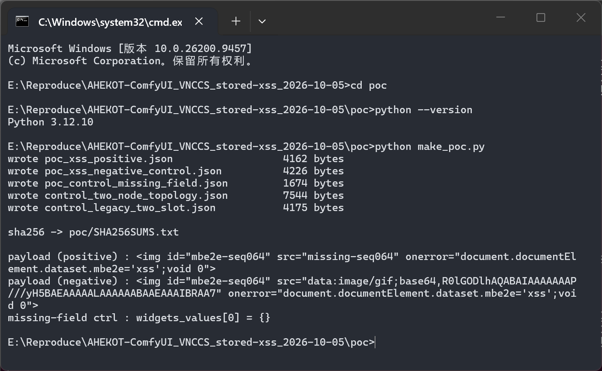
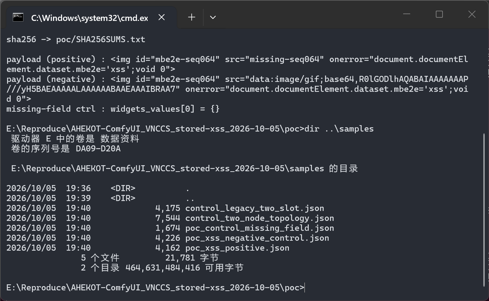
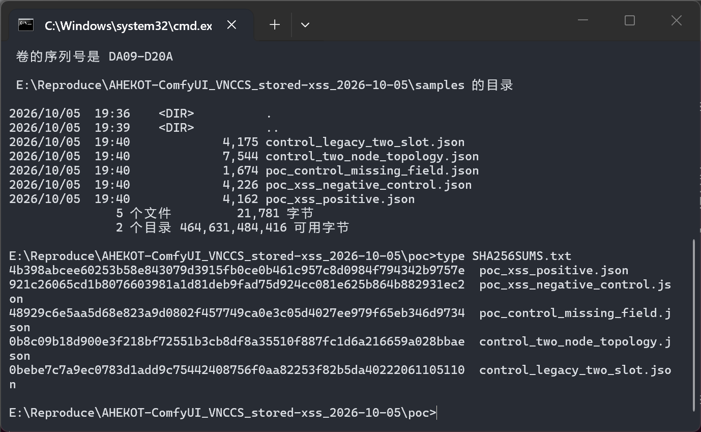
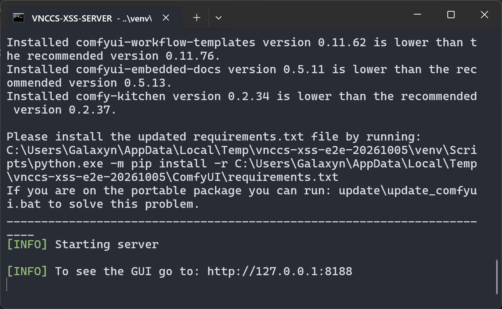
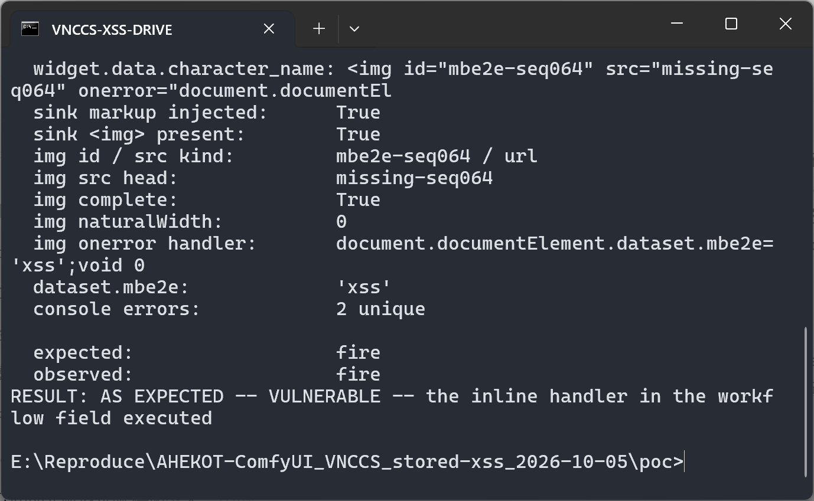
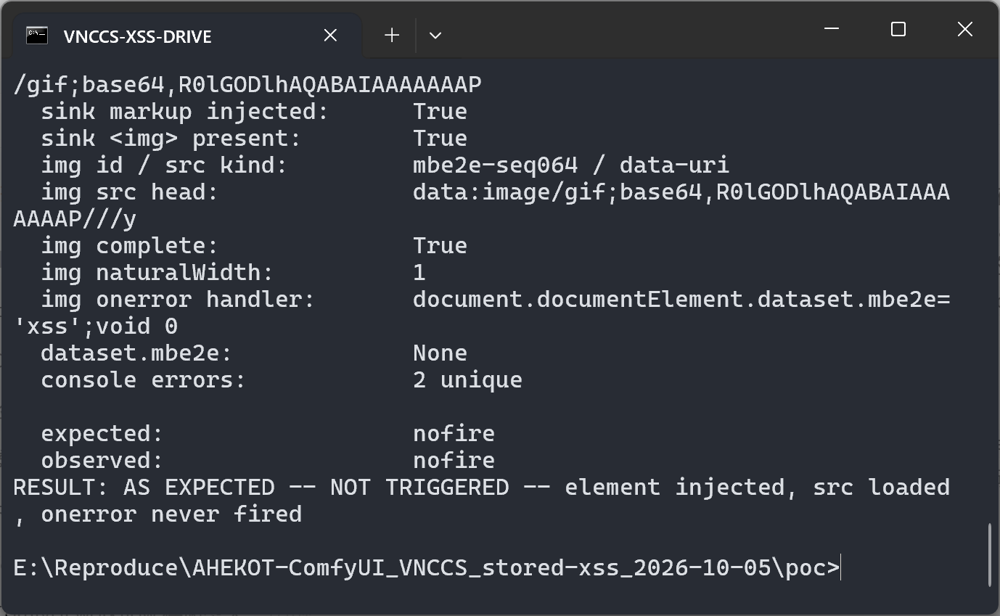
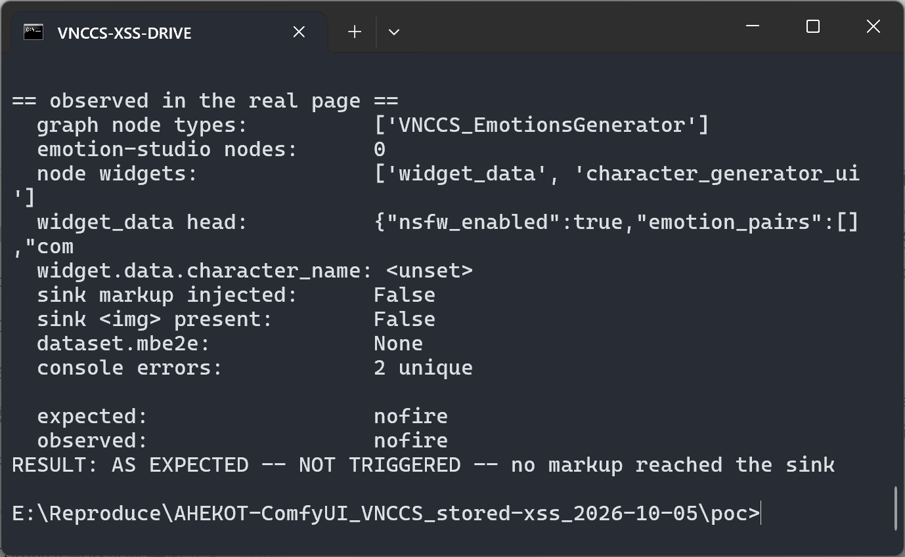
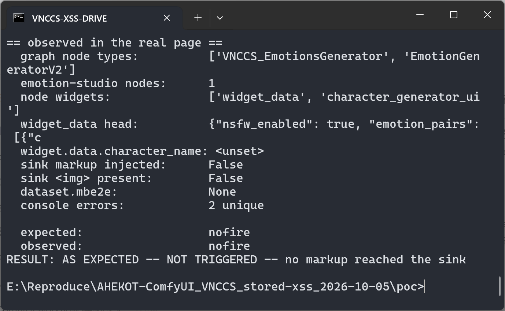
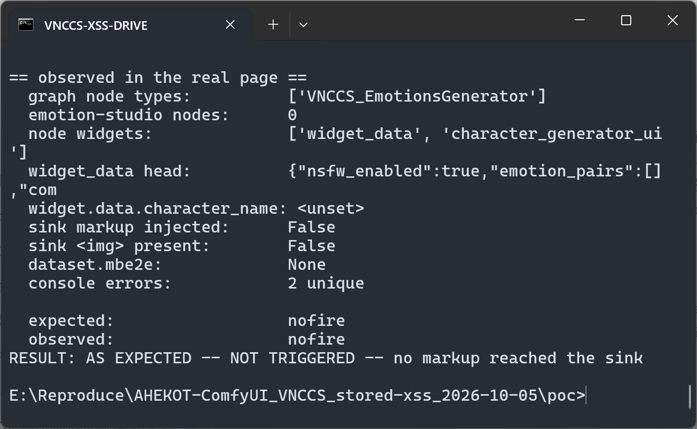
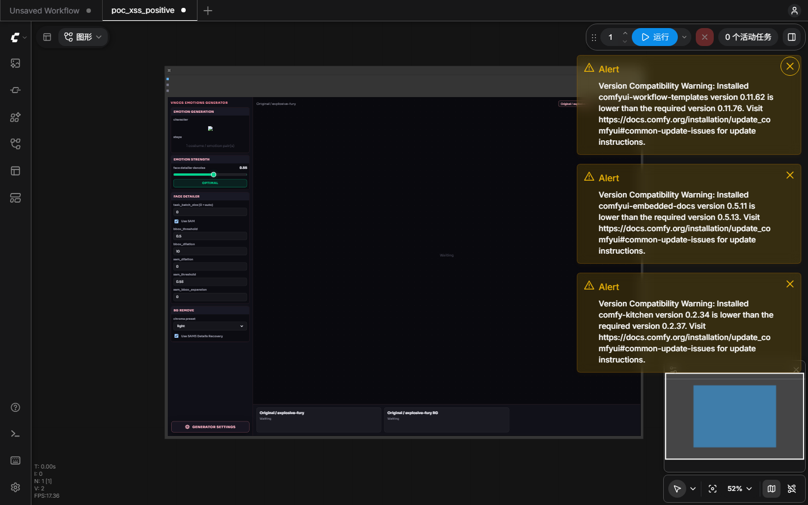

# ComfyUI VNCCS 3.1.2 — Stored Cross-Site Scripting in the Emotions Generator Settings Panel

## Summary

AHEKOT/ComfyUI_VNCCS (VNCCS, a ComfyUI custom-node suite) interpolates the `character_name` member of a node's `widget_data` widget into an HTML template and assigns the result to `innerHTML` without escaping (`web/vnccs_character_generator.js:2588-2592`). `character_name` lives inside the workflow artifact itself (`VNCCS_EmotionsGenerator.widgets_values[0]`), so a workflow JSON file that carries an HTML payload executes script in the ComfyUI origin the moment the victim opens it — no click, no confirmation, and no other interaction beyond opening the file. The payload was reproduced end-to-end against a real ComfyUI 0.38.0 server with the real custom node installed at the pinned commit; the two controls (benign `src`, missing field) inject the same markup or nothing and never execute.

## Affected Product

| Field | Value |
|---|---|
| Vendor | AHEKOT |
| Product | ComfyUI_VNCCS (VNCCS — Visual Novel Character Creation Suite), a ComfyUI custom-node package |
| Affected versions | 3.0.0 and later; still present on current main. Verified on commit `2206d1743f7920a7b9a21f80f03777d9ddce74c3` (2026-08-29, `pyproject.toml` version 3.1.2); the same unescaped sink is present at `HEAD` = `381cf10796d767de49dd2e3981f2d9c7ffbaaa19` (2026-10-05, version 3.2.2, `web/vnccs_character_generator.js:3159`) and in tags `3.0.0`–`3.0.3` and `3.2.0` |
| Component | `web/vnccs_character_generator.js` — `CharacterGeneratorWidget.renderSettings()` (the Emotions Generator node settings panel) |
| Platform | Any OS supported by ComfyUI; reproduced on Windows 11 (10.0.26200) with ComfyUI 0.38.0, `comfyui-frontend-package` 1.53.10, Python 3.12.10, PyTorch 2.12.0+cpu and Chromium 131.0.6778.33 |
| Vulnerability type | CWE-79: Improper Neutralization of Input During Web Page Generation ('Cross-site Scripting') |

## Root Cause

**Location:** `web/vnccs_character_generator.js:2576-2595` (`CharacterGeneratorWidget.renderSettings()`), sink at lines 2588-2592 — pinned commit `2206d174`. Same code at line 3159 on current main.

`renderSettings()` builds the "Emotion Generation" block of the node's DOM widget by concatenating page markup and attacker-controlled data into one template literal, then hands it to `innerHTML`. `${this.data.character_name}` is interpolated raw; the very same function sets the panel title safely through `textContent` (line 2582), which shows the omission is unintended:

```js
renderSettings() {
    ...
    info.innerHTML = `
        <div class="vnccs-pipe-block-h">Emotion Generation</div>
        <div class="vnccs-pipe-block-b">
            <div class="vnccs-pipe-label">character</div>
            <div class="vnccs-pipe-empty" style="min-height:auto;padding:8px;">${this.data.character_name || "Select in Emotion Studio"}</div>   // <-- unescaped sink
            <div class="vnccs-pipe-label">steps</div>
            <div class="vnccs-pipe-empty" style="min-height:auto;padding:8px;">${count} costume / emotion pair(s)</div>
        </div>`;
    ...
}
```

The value is attacker-controlled *through the workflow artifact*, which is the natural distribution format for this product (the repository itself ships workflows under `workflows/`, and VNCCS workflows are shared as JSON files):

1. `VNCCS_EmotionsGenerator.INPUT_TYPES()` exposes `widget_data` as a plain `STRING` widget (`nodes/character_generator.py:2834`); in a serialized workflow that widget is `nodes[].widgets_values[0]`.
2. On load, ComfyUI restores the widget value and calls the node's `onConfigure` (`web/vnccs_character_generator.js:3246-3267`), which does `this._vnccsCharacterGeneratorWidget.data = readData(this)` and then calls `renderSettings()` (line 3256) — no selection of the node, no click, no queueing.
3. `readData()` (`web/vnccs_character_generator.js:931-953`) parses the widget JSON and merges it over `DEFAULT_DATA`, preserving `character_name` verbatim.
4. `renderSettings()` writes it into `innerHTML`; the browser parses the injected markup and compiles the inline event handler. An `` whose `src` cannot be loaded fires `onerror` immediately, executing the script in the ComfyUI origin.

Two artifact-shape facts were measured during reproduction and are recorded here because they determine whether a given file reproduces (both are fully under the attacker's control when crafting the artifact):

- **No Emotion Studio source node in the same workflow.** `onConfigure` first calls `syncCharacterSourceData()`, which for this node delegates to `syncEmotionStudioSourceData()` (lines 1818-1849) and overwrites `data.character_name` with the `character` widget of any `EmotionGeneratorV2` node present in the graph. The upstream Step-3 workflow ships both nodes, so the payload in the generator node is replaced before it reaches the sink; the attacker simply ships a workflow without that node (sample `control_two_node_topology.json` demonstrates the overwrite).
- **One-element `widgets_values`.** `comfyui-frontend-package` 1.53.10 runs every loaded node through `migrateWidgetsValues()` (`static/assets/settingStore-*.js`), which rebuilds a slot mask from the node definition. For this node the mask has two entries (`emotion_data` is `forceInput`, `widget_data` is a widget), so a two-element array is treated as a legacy forceInput layout and slot 0 is discarded. A one-element array — which is what ComfyUI itself serializes for this node — passes through untouched (sample `control_legacy_two_slot.json` demonstrates the discarded slot).

## Proof of Concept

### Prerequisites
- A ComfyUI installation with the VNCCS custom node `ComfyUI_VNCCS` checked out at `2206d1743f7920a7b9a21f80f03777d9ddce74c3` under `custom_nodes/` (no other VNCCS version installed), started with `python main.py --cpu --disable-auto-launch --port 8188`.
- The victim opens the ComfyUI web UI once and then opens the attacker-supplied workflow JSON (the frontend's own workflow-open file input / Ctrl+O). That is the whole victim action.

### Steps to Reproduce
1. Start the real stack (ComfyUI 0.38.0 server with the pinned VNCCS node) and build the artifacts with `poc/make_poc.py`; five workflow files land in `samples/`.

   
   *The artifacts and the exact payload strings; the two payloads differ only in `src`.*
2. Confirm the artifacts and their SHA-256 digests (`samples/`, `poc/SHA256SUMS.txt`).

   
   
3. Start the pinned product stack in a terminal; ComfyUI serves the frontend that loads the VNCCS extension and registers `VNCCS_EmotionsGenerator`.

   
4. In the verification shell, run the positive artifact through a real Chromium page: `%PY% verify_poc.py --sample ..\samples\poc_xss_positive.json --expect fire`.

   
   *`widget.data.character_name` holds the payload; the sink injected an `` whose load failed (`naturalWidth` 0) and whose `onerror` handler ran — `dataset.mbe2e` is `'xss'`.*
5. Negative control — same element id, same inline handler, only `src` changed to a valid one-pixel data URI: `%PY% verify_poc.py --sample ..\samples\poc_xss_negative_control.json --expect nofire`.

   
   *Identical markup reaches the same sink, the image loads (`naturalWidth` 1) and the handler never fires: the outcome difference is caused by the attacker's `src`, not by any defence in the product.*
6. Missing-field control — `widgets_values[0]` is the stringified empty object `"{}"`: `%PY% verify_poc.py --sample ..\samples\poc_control_missing_field.json --expect nofire`.

   
7. Two further controls document the artifact-shape preconditions from the Root Cause section: the upstream two-node topology (field overwritten by the Emotion Studio node) and the legacy two-element `widgets_values` (slot 0 discarded by the frontend).

   
   
8. Visual confirmation in the browser: the page that executed the handler shows the VNCCS Emotions Generator node with the attacker's `` element rendered inside the "Emotion Generation → character" row of the settings panel.

   

### Expected vs Actual
- Expected: the workflow's `character_name` string is displayed as text in the settings panel, e.g. `V-chan`; markup characters are inert.
- Actual: the string is parsed as HTML. The injected `` element is created inside the reported sink and its handler executes in the ComfyUI origin during workflow load (`document.documentElement.dataset.mbe2e === "xss"`), while the structurally identical control with a loadable `src` does not execute.

### Sanitized PoC input

`VNCCS_EmotionsGenerator` node inside an otherwise ordinary VNCCS workflow JSON (`samples/poc_xss_positive.json`; the payload is a data marker, not a weaponised script):

```json
{
  "id": 405,
  "type": "VNCCS_EmotionsGenerator",
  "widgets_values": [
    "{\"nsfw_enabled\":true,\"emotion_pairs\":[{\"costume\":\"Original\",\"emotion\":\"explosive-fury\"}],\"character_name\":\"\"}"
  ]
}
```

Negative control (`samples/poc_xss_negative_control.json`) is byte-identical except for `src`, which becomes a valid one-pixel GIF data URI. Artifact digests: `4b398abcee60253b58e843079d3915fb0ce0b461c957c8d0984f794342b9757e` (positive), `921c26065cd1b8076603981a1d81deb9fad75d924cc081e625b864b882931ec2` (negative control), `48929c6e5aa5d68e823a9d0802f457749ca0e3c05d4027ee979f65eb346d9734` (missing-field control).

## Impact

The attacker's script runs in the origin of the ComfyUI web server (`http://127.0.0.1:8188` by default) with the victim's session, at the moment a workflow file is opened.

- Confidentiality: Low — same-origin script can read everything the ComfyUI HTTP API exposes to that session, including the prompt/workflow history (`/history`), stored workflows and user settings (`/userdata`), and generated images (`/view`).
- Integrity: Low — the same script can call state-changing API endpoints on the user's behalf (`/prompt` to queue workflows, `/userdata` writes, `/upload/image` uploads) and rewrite what the UI displays.
- Availability: None — the proof of concept does not degrade the service.
- Scope: Changed — a payload stored in a shared workflow file crosses the boundary from "data the user imported" to "script running in the ComfyUI origin".
- Escalation context (not exercised in this PoC): ComfyUI installations that carry nodes performing filesystem or process work (a very common situation for this ecosystem, and VNCCS itself ships a Control Center that installs dependencies) turn a same-origin script into a first step for arbitrary local execution. No such escalation was attempted or demonstrated here; the report is limited to script execution in the page origin.

## Attack Vector and Severity (CVSS v3.1)

| Metric | Value | Rationale |
|---|---|---|
| Attack Vector | L | The payload travels as a workflow file that the victim opens in a locally running ComfyUI instance; no network position is needed and none was used. |
| Attack Complexity | L | No special conditions: install the custom node, open the file, the handler runs during load. |
| Privileges Required | N | The file is opened in an unauthenticated local UI session; no ComfyUI account or API token is needed. |
| User Interaction | R | The victim must open the attacker-supplied workflow (double-click/drag-and-drop/Ctrl+O). |
| Scope | C | Script escapes the imported-data context and executes in the ComfyUI page origin. |
| Confidentiality | L | Same-origin reads of history, stored workflows and images; not full host compromise. |
| Integrity | L | Same-origin API calls can queue prompts and modify stored user data; no code execution demonstrated. |
| Availability | N | No denial of service demonstrated. |

```
Score: 4.9 (Medium)
Vector: CVSS:3.1/AV:L/AC:L/PR:N/UI:R/S:C/C:L/I:L/A:N
```

> Assumption recorded for transparency: the vector is scored as a local "open a crafted file" attack, which matches how the artifact reaches the victim and how the reproduction was driven. A deployment in which importing a workflow is itself a remote, unauthenticated action would raise AV to Network (6.1 Medium); nothing in this report depends on that.

## Remediation

- Set the value as text instead of markup in `web/vnccs_character_generator.js` (`renderSettings()`, pinned commit line 2588-2592; line 3159 on current main), matching what the same function already does for the panel title: assign `${this.data.character_name || "Select in Emotion Studio"}` to a `textContent` of a dedicated child element, or run it through an HTML-escaping helper, instead of embedding it in the `innerHTML` template.
- Audit the remaining `innerHTML` templates in the same file for the same pattern — for example `buildSeedvrCard()` (pinned commit line 2529) also interpolates `entry.name`/`entry.description` into `innerHTML`; the source there is the model catalogue rather than the workflow, but the escaping discipline should be uniform.
- Until a fix is released: do not open workflow files from untrusted sources, and keep the ComfyUI instance bound to `127.0.0.1`. A Content-Security-Policy on the ComfyUI frontend that forbids inline event handlers would also stop this specific payload.

## Timeline

| Date | Event |
|---|---|
| 2026-10-05 | Vulnerability discovered and reproduced end-to-end (real ComfyUI 0.38.0 + VNCCS at `2206d174`, Chromium 131) |
| 2026-10-05 | Report prepared |
| [pending] | Report sent to the maintainer |
| [pending] | Maintainer acknowledged |
| [pending] | Fix released |

## References

- Source repository: https://github.com/AHEKOT/ComfyUI_VNCCS
- Pinned vulnerable code: https://github.com/AHEKOT/ComfyUI_VNCCS/blob/2206d1743f7920a7b9a21f80f03777d9ddce74c3/web/vnccs_character_generator.js#L2588-L2592
- Same sink on current main: https://github.com/AHEKOT/ComfyUI_VNCCS/blob/381cf10796d767de49dd2e3981f2d9c7ffbaaa19/web/vnccs_character_generator.js#L3159
- Upstream report: [pending publication]
- CWE: https://cwe.mitre.org/data/definitions/79.html
- Vendor advisory: [none]
- Host application: https://github.com/comfyanonymous/ComfyUI

## Disclaimer

This report is provided for defensive and coordination purposes. It contains no ready-to-run exploit beyond the minimum reproduction information, and no sensitive infrastructure details. Do not disclose it publicly before the maintainer has had a reasonable window to fix the issue.

## Screenshot Checklist

All screenshots are real captures of a real terminal window or of the real Chromium page; none of them is rendered or re-typed after the fact. Capture environment: Windows 11 (10.0.26200), ComfyUI 0.38.0 (`5c460d8172fe30761ff67c0df3d5643bb74e0d70`), `comfyui-frontend-package` 1.53.10, Python 3.12.10 / PyTorch 2.12.0+cpu, Playwright 1.49.1 Chromium 131.0.6778.33, VNCCS pinned at `2206d1743f7920a7b9a21f80f03777d9ddce74c3`. Captured 2026-10-05.

| File | Content |
|---|---|
| `screenshots/01-make-poc.png` | Real terminal: `python make_poc.py` writing the five workflow artifacts and printing both payloads |
| `screenshots/02-samples.png` | Real terminal: `dir ..\samples` listing the five artifacts |
| `screenshots/03-sha256.png` | Real terminal: `type SHA256SUMS.txt` showing the pinned digests |
| `screenshots/04-server-up.png` | Real terminal: the pinned ComfyUI stack starting and printing the GUI URL |
| `screenshots/05-positive-fires.png` | Real terminal: positive artifact — payload preserved in `character_name`, `` injected by the sink, `naturalWidth` 0, `dataset.mbe2e` = `'xss'` (handler executed) |
| `screenshots/06-negative-control.png` | Real terminal: negative control — same id/handler, `src` is a valid data URI (`naturalWidth` 1), handler never fired |
| `screenshots/07-missing-field.png` | Real terminal: missing-field control (`widgets_values[0]` = `{}`) — nothing reaches the sink |
| `screenshots/08-two-node-topology.png` | Real terminal: upstream two-node topology — `character_name` overwritten by the Emotion Studio node, no injection |
| `screenshots/09-legacy-two-slot.png` | Real terminal: legacy two-element `widgets_values` — slot 0 discarded by the frontend migration, no injection |
| `screenshots/10-browser-positive.png` | Real Chromium screenshot of the live ComfyUI page: the injected `` element rendered in the node's "Emotion Generation → character" row |
