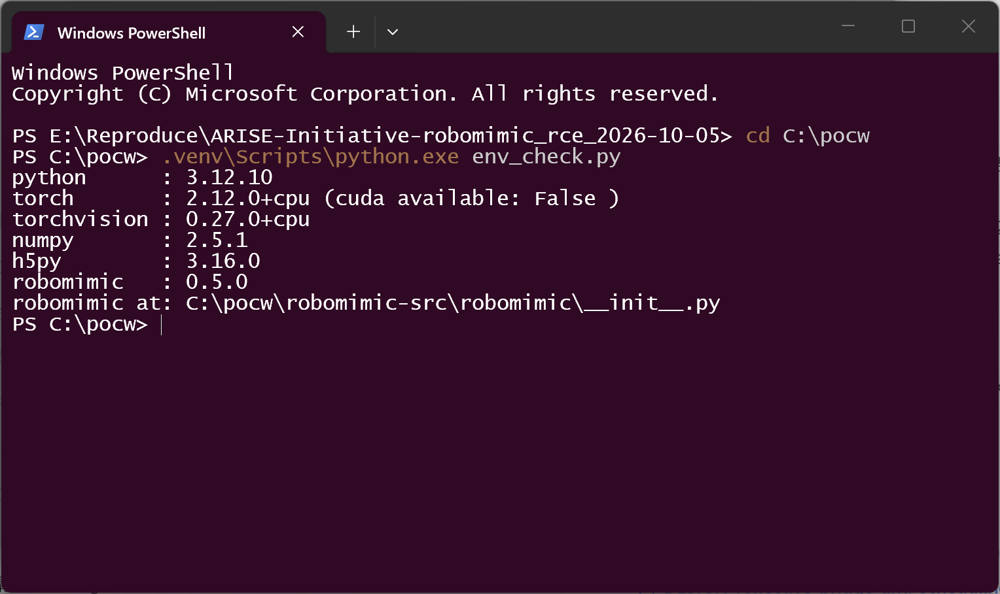
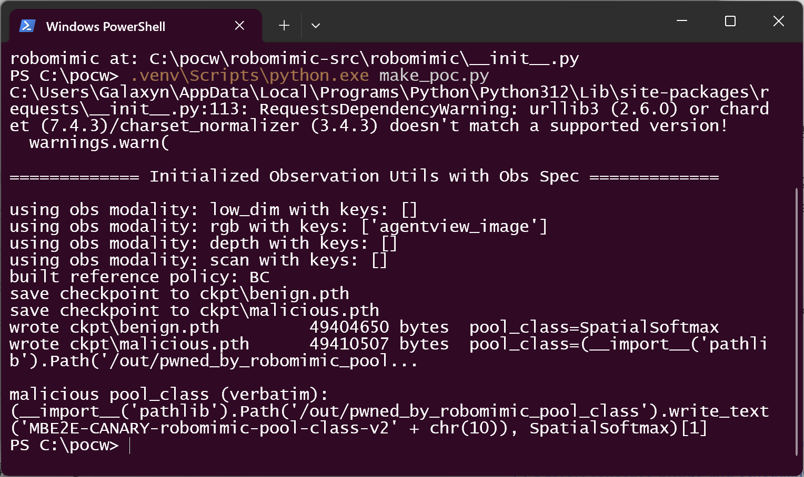
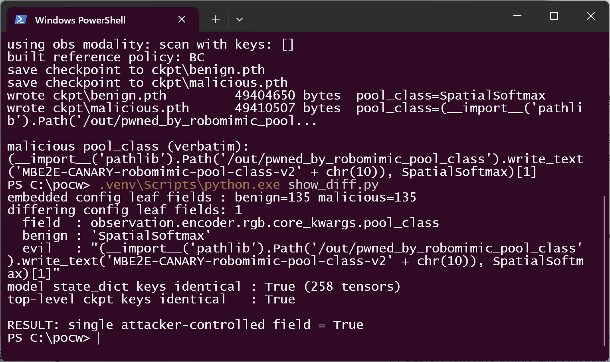
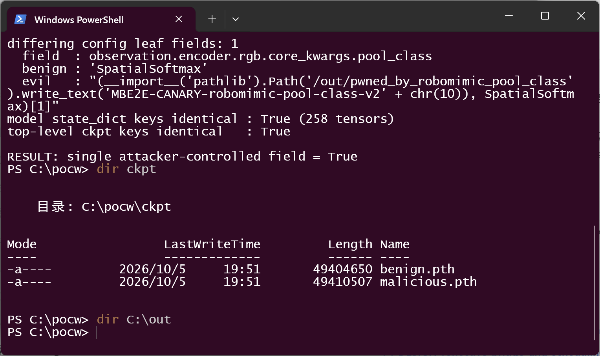
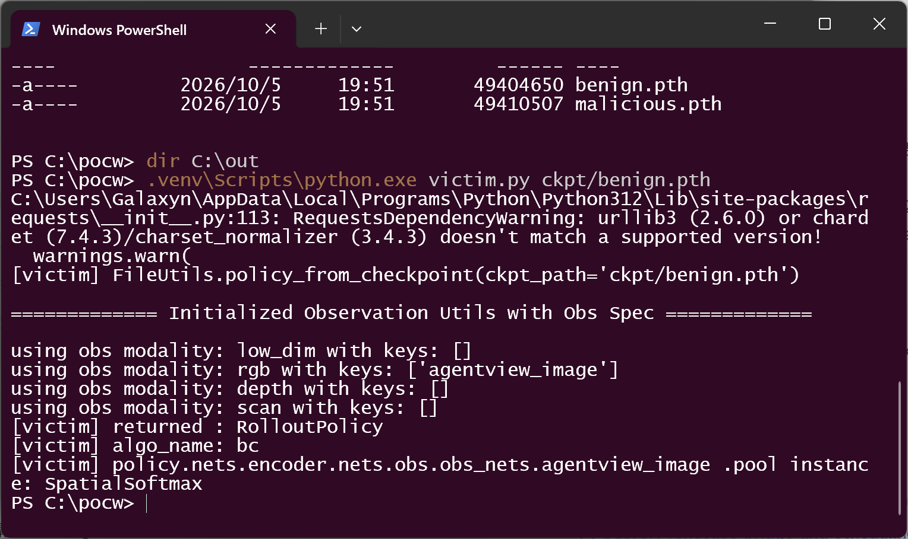
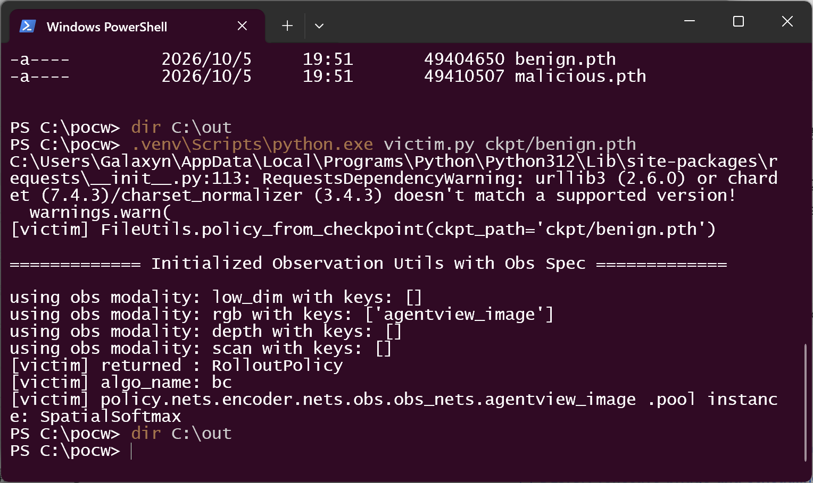
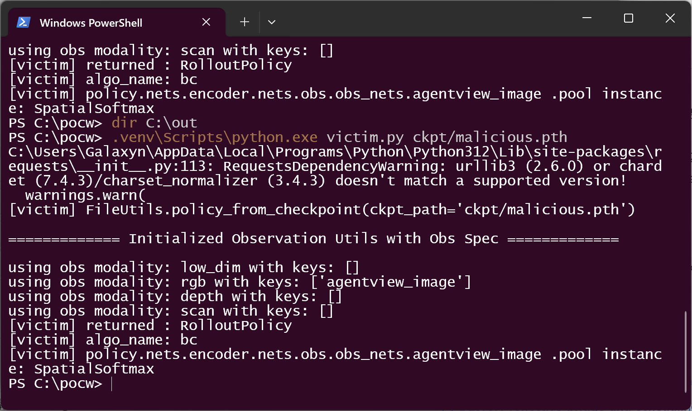
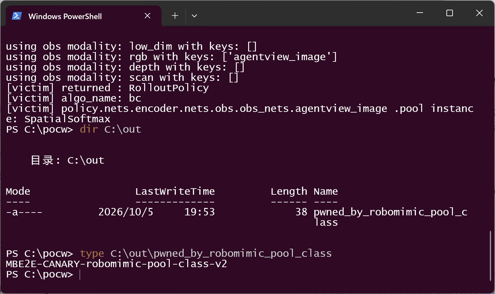
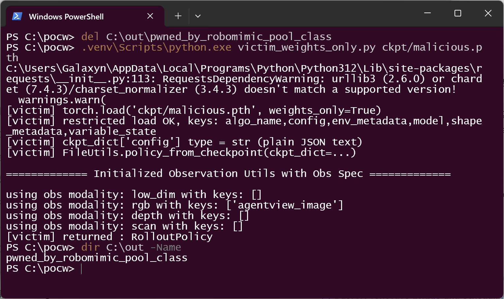

# robomimic 0.5.0 — Dynamic Code Evaluation (`eval` injection) in VisualCore pooling-class resolution

## Summary

ARISE-Initiative **robomimic** ≤ 0.5.0 (verified on `master` commit `d309eaecc18a`) passes the `pool_class` string taken from a checkpoint's embedded configuration straight into Python's `eval()` while it rebuilds the policy network. The public entry point `robomimic.utils.file_utils.policy_from_checkpoint()` — the documented way to load a trained policy — therefore executes arbitrary Python in the victim's process as soon as it is pointed at an attacker-supplied checkpoint. No `.py` file, plugin, or other program sidecar is needed: the entire payload is one string inside the JSON that the checkpoint already carries.

We assess this as **High, CVSS 3.1 7.8** (`AV:L/AC:L/PR:N/UI:R/S:U/C:H/I:H/A:H`).

## Affected Product

| Field | Value |
|---|---|
| Vendor | ARISE-Initiative (Advancing Robot Intelligence through Simulated Environments) |
| Product | robomimic |
| Affected versions | v0.3.0 through v0.5.0, and `master` @ `d309eaecc18acf4152a830a895a6984b8ac71b05`. The defect was introduced in v0.3.0 (commit `40e427a`, 2023-07-03, "Release v0.3 (#63)") and is absent from v0.1.0 and v0.2.0. The pinned commit is still current `master` HEAD. |
| Component | `robomimic/models/obs_core.py:121-122` (`VisualCore.__init__`); identical unguarded pattern at `:106` (`backbone_class`) and `:301` (`ScanCore`) |
| Platform | Any platform where robomimic runs. Verified on Windows 11 (build 26200) x64, CPython 3.12.10, torch 2.12.0+cpu, torchvision 0.27.0+cpu, robomimic 0.5.0 |
| Vulnerability type | CWE-95: Improper Neutralization of Directives in Dynamically Evaluated Code ('Eval Injection'); structurally CWE-470: Use of Externally-Controlled Input to Select Classes or Code ('Unsafe Reflection'); outcome CWE-94: Improper Control of Generation of Code ('Code Injection') |

## Root Cause

**Location:** `robomimic/models/obs_core.py:113-123` (`VisualCore.__init__`)

A robomimic checkpoint is a `torch.save()` dictionary. Alongside the model weights it stores the training configuration as a **JSON string**:

```python
# robomimic/utils/train_utils.py:620-635  (save_model -- the upstream writer)
params = dict(
    model=model.serialize(),
    config=config.dump(),          # <-- configuration, serialized to a JSON *string*
    algo_name=config.algo_name,
    env_metadata=env_meta,
    shape_metadata=shape_meta,
    variable_state=variable_state,
)
torch.save(params, ckpt_path)
```

On the way back in, that string is parsed and then used to *select and instantiate Python classes*:

```python
# robomimic/utils/file_utils.py -- config_from_checkpoint()
config_dict = json.loads(ckpt_dict['config'])
config = config_factory(algo_name, dic=config_dict)
```

```python
# robomimic/models/obs_core.py:113-123 -- VisualCore.__init__   (defect)
        # maybe make pool net
        if pool_class is not None:
            assert isinstance(pool_class, str)
            # feed output shape of backbone to pool net
            if pool_kwargs is None:
                pool_kwargs = dict()
            # extract only relevant kwargs for this specific backbone
            pool_kwargs["input_shape"] = feat_shape
            pool_kwargs = extract_class_init_kwargs_from_dict(cls=eval(pool_class), dic=pool_kwargs, copy=True)
            self.pool = eval(pool_class)(**pool_kwargs)          # <-- arbitrary code execution
            assert isinstance(self.pool, BaseNets.Module)
```

`pool_class` originates from `config.observation.encoder.rgb.core_kwargs.pool_class`, i.e. a plain JSON string that survives `json.loads()` untouched, is carried through `config_factory()`, and reaches `eval()` with no allow-list, no prefix check and no comparison against the class the framework itself wrote. It is evaluated twice (`:121` for kwargs filtering, `:122` for instantiation), so any side effect in the expression happens twice; the second `eval` is what must still yield a class object.

**Reachable from the documented public API.** `FileUtils.policy_from_checkpoint()` performs:

```
policy_from_checkpoint
  -> maybe_dict_from_checkpoint / load_dict_from_checkpoint
  -> config_from_checkpoint      -> json.loads(ckpt_dict["config"]); config_factory(...)
  -> ObsUtils.initialize_obs_utils_with_config(config)
  -> algo_factory(...)           -> ObsEncoder -> VisualCore.__init__ -> eval(pool_class)
```

The configuration is fully attacker-controlled, including `core_class`, `backbone_class` and `pool_class`.

**The codebase already knows better, and only missed the instantiation step.** Every other dynamic class lookup in the same subsystem goes through an allow-list registry:

| Location | Resolution |
|---|---|
| `robomimic/models/obs_nets.py:77` | `cls=ObsUtils.OBS_ENCODER_CORES[enc_kwargs["core_class"]]` |
| `robomimic/models/obs_nets.py:99,103` | `ObsUtils.OBS_RANDOMIZERS[rand_class]` |
| `robomimic/models/obs_nets.py:219` | `ObsUtils.OBS_ENCODER_CORES[self.obs_nets_classes[k]](...)` |
| `robomimic/models/obs_core.py:101` | `cls=ObsUtils.OBS_ENCODER_BACKBONES[backbone_class]` |
| **`robomimic/models/obs_core.py:106,121,122,301`** | **`eval(...)` — the outlier** |

The registries are populated automatically by `ConvBase.__init_subclass__` (`robomimic/models/base_nets.py:468-480` → `ObsUtils.register_encoder_backbone(cls)`), whose own docstring states the intent: *"allowing users to simply extend our base encoder class and refer to that class in string form in their config"*. Maintainers already flagged the `eval` pattern in issue #189 and added a registry in the merged PR #190 — but that change only rerouted the *kwargs* lookup, leaving class *instantiation* on `eval()`.

## Proof of Concept

### Prerequisites
- robomimic 0.5.0 installed from a vulnerable commit (`v0.3.0` … `master`; here
  `d309eaecc18acf4152a830a895a6984b8ac71b05`), plus `torch` and `torchvision`.
- The victim runs the standard, documented loading path — nothing more exotic than
  "load this checkpoint and give me the policy".

### Steps to Reproduce

1. Install the pinned source and show the environment that the rest of the run uses
   (`poc/env_check.py`). robomimic `0.5.0` is imported from the pinned checkout, not from PyPI.



2. Author both artifacts through the **upstream writer** (`poc/make_poc.py`). A minimal
   vision-based `bc` configuration is built with `config_factory()`, the network is instantiated
   once with the benign pool class, and `robomimic.utils.train_utils.save_model()` — the exact
   function `train.py` uses — writes two checkpoints:

   - `ckpt/benign.pth` — `pool_class = "SpatialSoftmax"` (an ordinary installed class name)
   - `ckpt/malicious.pth` — `pool_class = <payload>`

   Both artifacts carry the same serialized model state; only the embedded config JSON differs.
   The payload evaluates to the *same* `SpatialSoftmax` class, so the rebuilt network is
   architecturally identical and the saved weights still load.



3. Show that the two artifacts differ in **exactly one** config leaf (`poc/show_diff.py`), and
   that the top-level checkpoint keys and the 258 model tensors are identical. This isolates the
   trigger to that single string — there is no `.py`, plugin or native sidecar anywhere in the
   artifact.



4. Confirm the starting state: the artifacts exist, and the canary directory `C:\out` is empty.



5. **Negative control** — run the real public entry point on the benign checkpoint. The policy is
   reconstructed normally and **no canary file appears**.



6. Confirm the control left no trace.



7. **Exploit** — run the identical entry point on the checkpoint whose only difference is the
   `pool_class` string.



8. The canary file has been created and contains the payload's marker string. Note that the
   returned policy is a healthy `RolloutPolicy` and its rebuilt pool is a genuine
   `SpatialSoftmax` instance: nothing in the operator-visible result distinguishes the
   compromised load from the clean one.



9. **The sink is independent of the pickle layer.** `load_dict_from_checkpoint()` calls
   `torch.load(..., weights_only=False)`, which is a second, unrelated arbitrary-code path. To
   show the `pool_class` defect is not merely a restatement of that one, the same artifact is
   loaded with `weights_only=True` — torch's restricted unpickler, which refuses arbitrary
   pickle globals — and the resulting plain dictionary is handed to the same public entry point
   through its `ckpt_dict=` parameter. The restricted load succeeds (the config is ordinary JSON
   text) and the payload **still fires**.



### Expected vs Actual
- Expected: loading a checkpoint restores a policy; the configuration is treated as data.
- Actual: `policy_from_checkpoint()` executes an arbitrary Python expression taken from the
  checkpoint's configuration, in the victim's process, before any inference happens.

### Sanitized PoC input

The complete attacker-controlled value, byte-for-byte as verified (single line, in the checkpoint's `config` JSON at `observation.encoder.rgb.core_kwargs.pool_class`):

```text
(__import__('pathlib').Path('/out/pwned_by_robomimic_pool_class').write_text('MBE2E-CANARY-robomimic-pool-class-v2' + chr(10)), SpatialSoftmax)[1]
```

The trailing `[1]` makes the expression still evaluate to the `SpatialSoftmax` class, which is why `assert isinstance(self.pool, BaseNets.Module)` passes and the load completes normally. The benign twin uses the string `SpatialSoftmax`.

### Reproduction environment (as captured)

| Item | Value |
|---|---|
| Host | Windows 11 (build 26200) x64, PowerShell 5.1.26100.9444, 1600×1000 desktop session |
| Python | CPython 3.12.10 |
| torch / torchvision | 2.12.0+cpu / 0.27.0+cpu |
| robomimic | 0.5.0, editable install of `d309eaecc18acf4152a830a895a6984b8ac71b05` |
| Work directory | `C:\pocw` |
| Canary path | `C:\out\pwned_by_robomimic_pool_class` |

The payload writes to the absolute path `/out/pwned_by_robomimic_pool_class`. On POSIX that is `/out`; on Windows an absolute-looking POSIX path resolves against the current drive root, so the same unmodified string lands in `C:\out\`. The payload string itself was not altered. The earlier verification that motivated this report used a POSIX host and `/out`; the platform difference is noted here rather than papered over.

## Impact

- **Confidentiality: High** — arbitrary Python runs in the loading process, so any file, secret,
  token or dataset the process can read is exposed.
- **Integrity: High** — the process can modify anything it can write, including the checkpoint
  store, the training output directory, and the policy the operator is about to deploy and
  benchmark.
- **Availability: High** — the payload can terminate or wedge the process, or corrupt artifacts.
- **Scope: code execution.** The realistic delivery is a shared or published checkpoint: robomimic
  ships a model zoo, and the ecosystem exchanges trained checkpoints between labs and hosts. A
  user who loads a checkpoint received from someone else runs that someone else's code. The load
  *succeeds* and returns a working policy whose pooling layer is the expected class, so the
  compromise is silent.

## Attack Vector and Severity (CVSS v3.1)

| Metric | Value | Rationale |
|---|---|---|
| Attack Vector | L (Local) | The vulnerable component is a local Python library, not bound to a network stack; the attacker delivers a file that the victim later loads. If a reviewer treats the artifact-delivery channel as network-facing, AV:N applies and the score becomes 8.8. |
| Attack Complexity | L | No race, no mitigation to bypass: parse JSON, call `eval`. |
| Privileges Required | N | The loader needs no credentials; the attacker needs no account on the victim host. |
| User Interaction | R | The victim must obtain the artifact and call `policy_from_checkpoint()` on it. |
| Scope | U | Code executes inside the victim's own process and security domain. |
| Confidentiality | H | Full read access as the loading process. |
| Integrity | H | Full write access as the loading process; the emitted policy can also be tampered with. |
| Availability | H | The process can be killed, hung, or its artifacts corrupted. |

```
Score: 7.8 (High)
Vector: CVSS:3.1/AV:L/AC:L/PR:N/UI:R/S:U/C:H/I:H/A:H
```

## Remediation

Resolve the class through the allow-list registry that already exists instead of evaluating a string. `ObsUtils.OBS_ENCODER_BACKBONES` is populated automatically from `ConvBase.__init_subclass__`, and we verified at runtime that it **already contains** the default pool class:

```
registry keys: ['FiLMLayer', 'MVPConv', 'R3MConv', 'ResNet18Conv', 'ResNet18ConvFiLM',
                'ResNet50Conv', 'ShallowConv', 'SpatialSoftmax']
```

so `robomimic/models/obs_core.py:106` and `:122` become lookup + explicit failure rather than `eval`:

```python
# :106
self.backbone = ObsUtils.OBS_ENCODER_BACKBONES[backbone_class](**backbone_kwargs)
# :121-122
self.pool = ObsUtils.OBS_ENCODER_BACKBONES[pool_class](**pool_kwargs)
```

Two details to handle while doing this:

- `SpatialMeanPool` (`base_nets.py:1248`) derives from `Module`, not `ConvBase`, so it is *not* in
  `OBS_ENCODER_BACKBONES`. It must be registered explicitly, or a dedicated pool registry added
  mirroring `OBS_ENCODER_BACKBONES`.
- The same treatment is needed at `obs_core.py:301` (`ScanCore`) and for any other `eval()` of a
  config-supplied string.

**Interim workaround.** Treat a robomimic checkpoint as executable code: only load artifacts you produced or fully trust. Note that `FileUtils.load_dict_from_checkpoint()` calls `torch.load(..., weights_only=False)`, so the same entry point is independently exploitable via pickle; switching that call to `weights_only=True` is worth doing but does **not** close the defect reported here (see step 9).

## Timeline

| Date | Event |
|---|---|
| 2026-10-05 | Vulnerability discovered and reproduced end-to-end |
| 2026-10-05 | Report prepared |
| [pending] | Report sent to the maintainer |
| [pending] | Maintainer acknowledged |
| [pending] | Fix released |

## References
- Source repository: https://github.com/ARISE-Initiative/robomimic
- Vulnerable revision: https://github.com/ARISE-Initiative/robomimic/blob/d309eaecc18acf4152a830a895a6984b8ac71b05/robomimic/models/obs_core.py#L113-L123
- Upstream acknowledgement that the `eval` pattern is a problem (registry proposal, merged):
  https://github.com/ARISE-Initiative/robomimic/issues/189 and
  https://github.com/ARISE-Initiative/robomimic/pull/190
- Upstream report: [pending publication]
- CWE-95: https://cwe.mitre.org/data/definitions/95.html
- CWE-470: https://cwe.mitre.org/data/definitions/470.html
- CWE-94: https://cwe.mitre.org/data/definitions/94.html
- Vendor advisory: [none]

## Disclaimer
This report is provided for defensive and coordination purposes. It contains no ready-to-run exploit beyond the minimum reproduction information, and no sensitive infrastructure details. Do not disclose it publicly before the maintainer has had a reasonable window to fix the issue.

## Screenshot Checklist

All screenshots are real terminal-window captures taken during the run described above — not mock-ups. Collected 2026-10-05 on Windows 11 x64 / PowerShell 5.1 with the environment listed in *Reproduction environment* above.

| File | Contents |
|---|---|
| `screenshots/01-environment.png` | Component versions in the exact environment used: Python 3.12.10, torch 2.12.0+cpu, torchvision 0.27.0+cpu, robomimic 0.5.0 imported from the pinned checkout |
| `screenshots/02-build-checkpoints.png` | `make_poc.py`: both checkpoints written by the upstream `save_model()` writer; the malicious `pool_class` printed verbatim |
| `screenshots/03-single-field-diff.png` | `show_diff.py`: 135 config leaves each, exactly **1** differing leaf (`observation.encoder.rgb.core_kwargs.pool_class`), identical checkpoint keys and 258 identical model tensors |
| `screenshots/04-artifacts-and-clean-state.png` | The two artifacts on disk, and the canary directory still empty before any load |
| `screenshots/05-negative-control.png` | `policy_from_checkpoint()` on the benign checkpoint: a `RolloutPolicy` is returned, pool instance is `SpatialSoftmax`, no payload effect |
| `screenshots/06-control-left-no-trace.png` | Canary directory still empty after the control load |
| `screenshots/07-exploit-run.png` | `policy_from_checkpoint()` on the malicious checkpoint: policy returns normally **and** the payload has executed |
| `screenshots/08-canary-landed.png` | The canary file created by the payload, and its contents read back |
| `screenshots/09-weights-only-still-fires.png` | After deleting the canary: `torch.load(..., weights_only=True)` succeeds, the restricted dictionary is passed to `policy_from_checkpoint(ckpt_dict=...)`, and the canary is recreated — the config sink is independent of the pickle sink |
