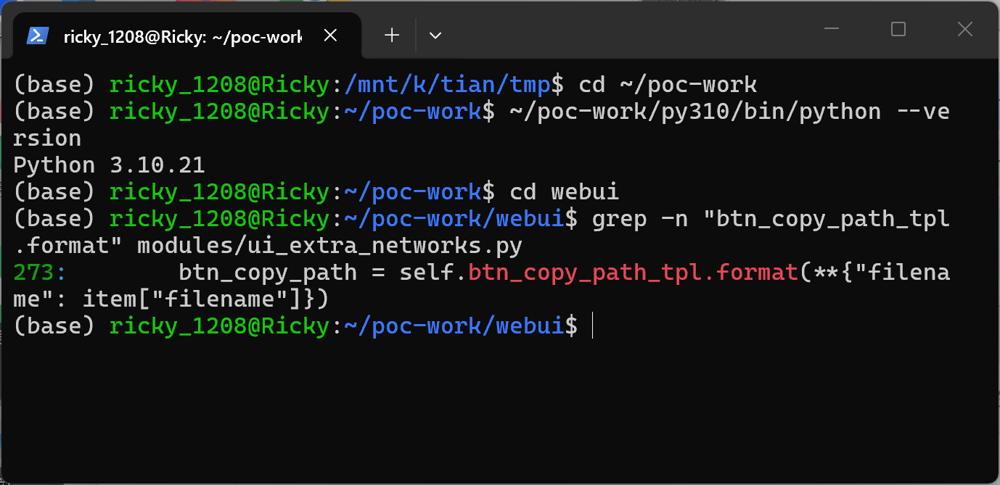
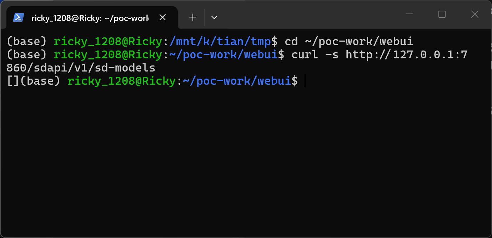
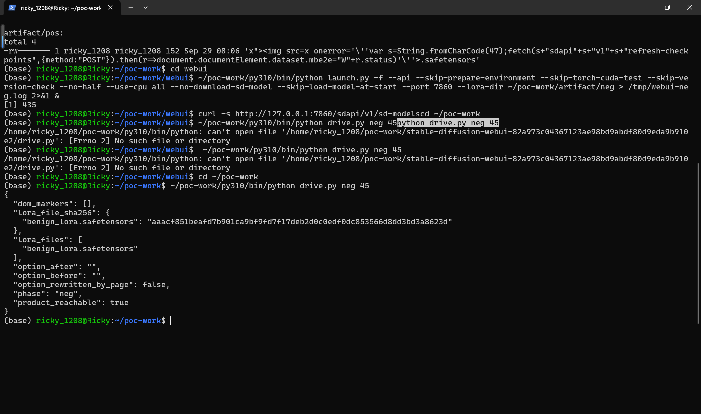
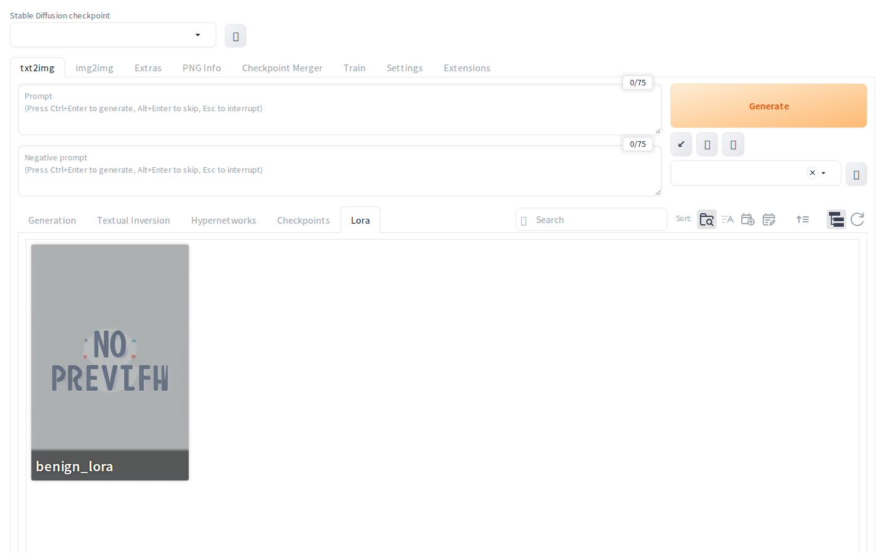
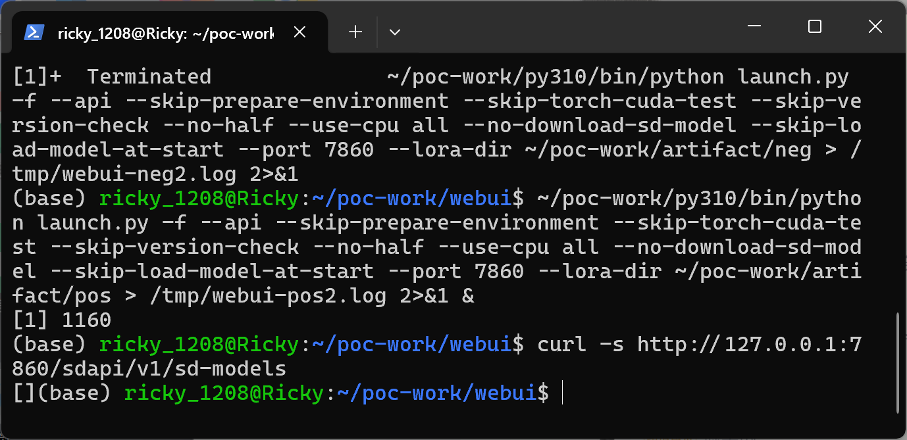
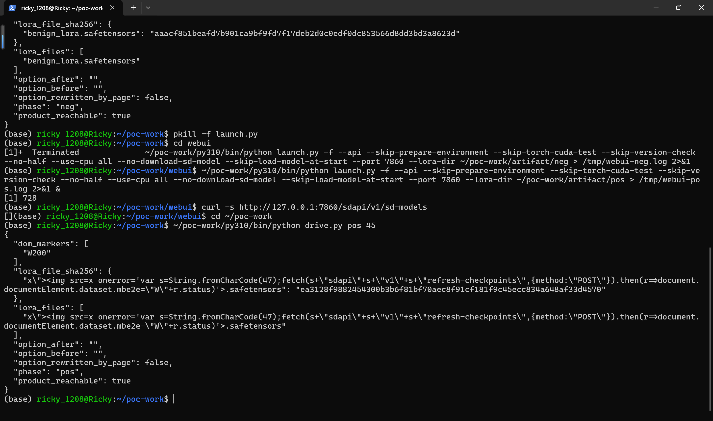
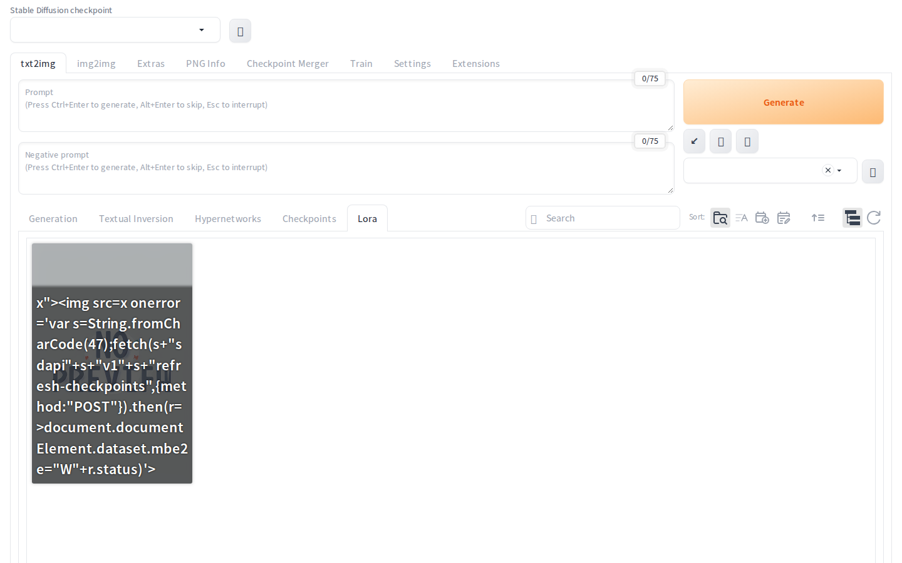
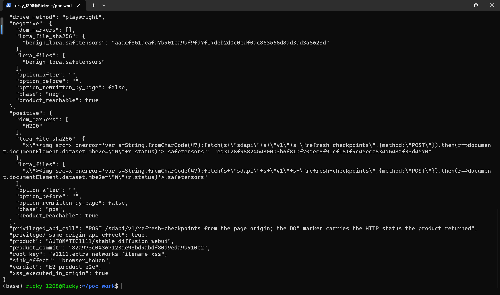

# AUTOMATIC1111 stable-diffusion-webui v1.10.1 — HTML Injection (Stored XSS) in the Extra-Networks Card HTML via Model Filename

**Identifier:** `a1111.extra_networks_filename_xss` · **Report date:** 2026-09-28 · **Severity (this assessment):** Medium 4.6 — `CVSS:3.1/AV:L/AC:L/PR:N/UI:R/S:C/C:L/I:L/A:N` · **CWE:** CWE-79 (Cross Site Scripting)

## Summary

AUTOMATIC1111 stable-diffusion-webui v1.10.1 (git commit `82a973c04367123ae98bd9abdf80d9eda9b910e2`) is affected by a cross-site scripting flaw in the extra-networks card builder. A model filename is interpolated into the card HTML without escaping, so a filename containing `"` and HTML markup breaks out of the `data-clipboard-text` attribute and is parsed as markup by the browser. The filename is attacker-chosen: it is simply the name of a file inside a model package the victim downloads and unpacks into the models tree. The file's contents are an ordinary, valid safetensors file written by the official writer — only its *name* is the payload. Because every card is built by `interface.load` while the page loads, the injected event handler executes the moment the victim opens the WebUI; clicking the extra-networks panel or loading a model is not required. In the documented verification the injected script used the page's own origin to call the product's API (`POST /sdapi/v1/refresh-checkpoints`), which the product accepted with HTTP 200.

## Affected Product

| Field | Value |
|---|---|
| Vendor | AUTOMATIC1111 (project) |
| Product | stable-diffusion-webui |
| Affected versions | v1.10.1, tested at git commit `82a973c04367123ae98bd9abdf80d9eda9b910e2`; the full affected range was not enumerated |
| Component | `modules/ui_extra_networks.py` `create_item_html()` (card HTML assembly), `html/extra-networks-copy-path-button.html` (attribute template), `javascript/extraNetworks.js` (`innerHTML` insertion) |
| Platform | Linux and macOS hosts (any byte except `/` and NUL is legal in a path component; Windows forbids the quote characters, see Constraints); verified on x86-64 WSL2 Ubuntu 24.04, Python 3.10, CPU-only install |
| Vulnerability type | CWE-79: Cross Site Scripting |

## Root Cause

**Primary sink — `modules/ui_extra_networks.py:273` (`create_item_html`), attribute breakout:**

```python
btn_copy_path = self.btn_copy_path_tpl.format(**{"filename": item["filename"]})
```

`html/extra-networks-copy-path-button.html:3` places the value inside a double-quoted attribute:

```html
data-clipboard-text="{filename}">
```

`str.format` performs no escaping, so a `"` in the filename terminates the attribute and everything after it is parsed as markup. The finished card block is assigned to `innerHTML` in `javascript/extraNetworks.js:662` (`newDiv.innerHTML = data.html;`), so an `onerror=` handler on an injected `` executes with the WebUI's origin.

The contrast with the *same card* shows this is an oversight rather than a deliberate trade-off — `sort_keys` (`modules/ui_extra_networks.py:306`) and `description` (`:328`) are both passed through `html.escape` before interpolation; the filename is the one field on the card that is not.

**Second, independent sink for the same string — `modules/ui_extra_networks.py:312-320`:**

```python
search_term_template = "<span class='hidden {class}'>{search_term}</span>"
for search_term in item.get("search_terms", []):
    search_terms_html += search_term_template.format(
        **{"class": f"search_terms{' search_only' if search_only else ''}",
           "search_term": search_term}
    )
```

`search_terms_from_path(filename)` (`extensions-builtin/Lora/ui_extra_networks_lora.py:27`) puts the same hostile string into `search_terms`; the loop above interpolates it with no `html.escape`. A fix applied only at `:273` would therefore not close the hole.

**Metadata-fed variant of the second sink.** `extensions-builtin/Lora/network.py:50-57` sets `self.hash` from the file's safetensors metadata before any computed hash:

```python
self.set_hash(
    self.metadata.get('sshs_model_hash') or
    hashes.sha256_from_cache(self.filename, "lora/" + self.name, use_addnet_hash=self.is_safetensors) or
    ''
)
```

`safetensors` metadata is attacker-controlled (`modules/sd_models.py:285-309` copies `__metadata__` entries verbatim), and `ui_extra_networks_lora.py:28-29` appends that hash to `search_terms`, which lands in the same unescaped span. The artifact documented here carries its payload in the *filename* and lights up both sinks at once; the metadata path is the same defect reached through a second taint source.

**Automatic trigger.** Card HTML for every registered page is produced by `interface.load` (`modules/ui_extra_networks.py:788`), so the cards — and the injected handlers — are in the DOM as soon as the UI page loads.

## Proof of Concept

### Prerequisites

- Victim runs stable-diffusion-webui at the pinned commit on Linux or macOS (the models directory is commonly populated from Unix-sourced archives even on mixed setups).
- Victim unpacks the attacker's model package into `models/Lora` and opens the WebUI page in a browser. That is the whole interaction — no click on the extra-networks panel, no model load.
- For the specific privileged API call demonstrated here the instance must be started with `--api`; script execution in the page origin does not depend on that flag.
- The verification used a CPU-only, checkpoint-less startup (`--skip-load-model-at-start`, stock `lora_show_all` setting) — neither is on the taint path.

### Steps to Reproduce

1. Build the two samples with the official writer (`poc/make_poc.py`): both are identical 152-byte safetensors files (`{"lora_down.weight": zeros(4)}`, metadata `{"format": "pt", "ss_output_name": "mbe2e"}`); the positive one is given the hostile filename below (191 bytes), the negative control is named `benign_lora.safetensors`.



2. Start the WebUI with the control sample directory and open `http://127.0.0.1:7860/`; drive it with a headless Chromium (`poc/drive.py neg`) — no marker appears.







3. Restart the WebUI with the positive sample directory (`--lora-dir`), confirm the API is serving.



4. Open the page in the driven browser (`poc/drive.py pos`): the injected `onerror` handler fires while the page loads, POSTs to `/sdapi/v1/refresh-checkpoints` from the page origin, and writes `W` + the HTTP status onto `document.documentElement`. The driver observes `data-mbe2e = "W200"`.





5. Merge both phase records (`poc/drive.py merge`): `verdict: E2_product_e2e` requires the marker in the positive phase and an empty marker list in the negative phase.



### Expected vs Actual

- Expected: a filename is inert text; it cannot add attributes, elements, or event handlers to the card.
- Actual: the filename breaks out of `data-clipboard-text="{filename}"` and is parsed as markup, and an `onerror` handler runs in the WebUI origin on page load.

### Sanitized PoC input

```text
x">document.documentElement.dataset.mbe2e="W"+r.status)'>.safetensors
```

The only attacker-controlled input is this name. The marker payload is deliberately inert: it calls one read-mostly API endpoint and records the HTTP status on `<html>`; nothing is sent anywhere. In a real attack the same 191 bytes could equally carry `alert(document.cookie)` or a same-origin bootstrap.

### Constraints

- A path component is limited to 255 bytes on ext4/overlayfs and may not contain `/`; the URL separators in the payload are therefore built with `String.fromCharCode(47)`. A settings-rewrite payload (`POST /sdapi/v1/options`) measures 287 bytes and does **not** fit — the demonstrated privileged effect is a body-less POST the product accepted, not a persistent state change. A longer chain would need a same-origin bootstrap (e.g. fetching the model file back through `/file=` and running a longer script out of its metadata); that was not attempted.
- Windows forbids `"` in filenames, so the carrier applies to Linux/macOS hosts and to archives unpacked on Unix.
- The payload lands in both unescaped sinks simultaneously; the DOM marker cannot distinguish which one fired first. Both are unescaped in the pinned source.

## Impact

- Confidentiality: Low — the injected script runs in the WebUI origin and can read UI state and drive same-origin endpoints as the local user.
- Integrity: Low — same-origin requests are accepted with the user's session; the demonstrated effect was an accepted privileged POST (HTTP 200). No OS-level code execution is claimed and A1111's `--allow-code` gate was not touched.
- Availability: None.
- Scope: crosses a trust boundary — the vulnerable component is the Python server that assembles card HTML, while the component that suffers is the victim's browser session (hence `S:C`).

## Reproduction environment and provenance

- Product source pinned by tarball at commit `82a973c04367123ae98bd9abdf80d9eda9b910e2`; the vulnerable lines quoted above were verified in that tree before running.
- Companion repositories pinned at the commits `modules/launch_utils.py` of that commit requests: `stable-diffusion-stability-ai` @ `cf1d67a6fd5ea1aa600c4df58e5b47da45f6bdbf`, `generative-models` @ `45c443b3…`, `k-diffusion` @ `ab527a9a…`, `BLIP` @ `48211a15…`, `stable-diffusion-webui-assets` @ `6f7db241…`. Note: the original `Stability-AI/stablediffusion` repository has disappeared from GitHub (404 as of 2026-09-28); the `stable-diffusion-stability-ai` tree was exported from the GitLab mirror `licyk/stablediffusion` **at the identical git commit SHA** — equal commit hash means an identical tree. The other four came from `codeload.github.com` at the pinned commits.
- Python 3.10.20 (micromamba, conda-forge), torch 2.1.2+cpu / torchvision 0.16.2+cpu, dependency set aligned with the pip freeze of an earlier verified run of this vulnerability (fastapi 0.94.0, pydantic 1.10.26, starlette 0.26.1, gradio 3.41.2, transformers 4.30.2, safetensors 0.4.2, numpy 1.26.2, uvicorn 0.53.0).
- Sample provenance: both samples are produced by the official writer with identical tensor payload and metadata and differ only in filename. Note on hashes: safetensors serializes `__metadata__` through a HashMap, so the byte-level SHA-256 varies between writer invocations while behaviour stays identical. Across all runs the hash set is exactly two values — `ea3128f9882454300b3b6f81bf70aec8f91cf181f9c45ecc834a648af33d4570` and `aaacf851beafd7b901ca9bf9fd7f17deb2d0c0edf0dc853566d8dd3bd3a8623d` — with the per-file assignment swapping between runs (the earlier Docker-based verification recorded benign=`ea3128…`/payload=`aaacf851…`; the screenshot run documented here recorded benign=`aaacf851…`/payload=`ea3128…`, as shown live in `images/…-03-make-poc.png` and `…-09-result.png`). See `poc/SHA256SUMS.txt`.
- An earlier, independent end-to-end validation of the same defect (Docker `--network none`, two runs, byte-identical `result.json`, `verdict: E2_product_e2e`, DOM marker `W200`) is on file; the screenshots in this report are from the local WSL re-run documented above, not from that earlier environment.

## Remediation

Escape the filename at both interpolation points in `modules/ui_extra_networks.py`, using the `html.escape` the file already applies elsewhere:

- at `:273`, wrap the value: `self.btn_copy_path_tpl.format(**{"filename": html.escape(item["filename"])})`;
- at `:312-320`, escape the `search_terms` value the same way (`sort_keys` at `:306` and `description` at `:328` are the existing precedent in this very function).

Because `create_item_html` builds a large template through `str.format`, the more durable change is to escape every untrusted field once, where the item dict is constructed — `filename`, `search_terms`, `name`, `prompt`, and any metadata-derived field (`sshs_model_hash` included) — so that adding a new `{field}` to the template cannot silently reopen this. As defence in depth, `data-clipboard-text` does not need to be baked into an HTML string at all: deliver the card path as JSON and attach it from JavaScript with `setAttribute`/`dataset`, which is escaping-safe by construction.

## References

- Source repository: https://github.com/AUTOMATIC1111/stable-diffusion-webui
- Pinned commit: https://github.com/AUTOMATIC1111/stable-diffusion-webui/commit/82a973c04367123ae98bd9abdf80d9eda9b910e2
- Vulnerable template: `html/extra-networks-copy-path-button.html` at that commit; insertion: `javascript/extraNetworks.js` line 662
- CWE: https://cwe.mitre.org/data/definitions/79.html
- Upstream report: [pending publication]
- Vendor advisory: [none]

