# AUTOMATIC1111 stable-diffusion-webui v1.10.1 — Stored XSS via LoRA safetensors Metadata (`sshs_model_hash`), Escalated to Staged RCE Through the Extension Installer

**Identifier:** `a1111.sshs_hash_xss_staged_rce` · **Report date:** 2026-09-30 · **Severity (this assessment):** High 8.4 — `CVSS:3.1/AV:L/AC:L/PR:N/UI:R/S:C/C:H/I:H/A:H` · **CWE:** CWE-79 (Cross Site Scripting), chain ends in CWE-94 (Code Injection)

## Summary

AUTOMATIC1111 stable-diffusion-webui v1.10.1 (git commit `82a973c04367123ae98bd9abdf80d9eda9b910e2`) is affected by a stored cross-site scripting flaw in the extra-networks card builder that is escalated to arbitrary code execution on the host through the product's own extension installer. A LoRA's `__metadata__.sshs_model_hash` string is adopted as the model's identity with no validation, appended to the card's `search_terms`, and interpolated into the card HTML as the one field that is not `html.escape()`d. A model package can therefore run JavaScript in the WebUI's origin as soon as the victim opens the page — the payload is in the DOM before any click. The same-origin script then drives the product's own hidden "install extension from URL" controls, which git-clones the attacker's package and executes its `install.py` (stage 1), presses "Apply and restart UI" so the product restarts itself, and the restarted process imports the package's `scripts/*.py` (stage 2) — code execution across the restart boundary, i.e. persistence, with no human action after the page load. The whole attacker input is an ordinary downloadable model package; both stages were verified end-to-end on the pinned release commit with inert canary files.

## Affected Product

| Field | Value |
|---|---|
| Vendor | AUTOMATIC1111 (project) |
| Product | stable-diffusion-webui |
| Affected versions | v1.10.1, verified at git commit `82a973c04367123ae98bd9abdf80d9eda9b910e2`; the full affected range was not enumerated |
| Component | `modules/ui_extra_networks.py` `create_item_html()` (unescaped `search_terms` sink), `extensions-builtin/Lora/network.py` `NetworkOnDisk.set_hash()` (unvalidated metadata adoption), `extensions-builtin/Lora/ui_extra_networks_lora.py` (hash → `search_terms`), fed by `modules/sd_models.py` `read_metadata_from_safetensors()` |
| Platform | OS-independent (Python/Gradio web app); verified on x86-64 WSL2 Ubuntu 24.04, Python 3.10, CPU-only install, and independently in an offline Docker container |
| Vulnerability type | CWE-79: Cross Site Scripting (stored, metadata-borne), escalated to code execution |

## Root Cause

**Taint source — `modules/sd_models.py:285-309` (`read_metadata_from_safetensors`).** Every `__metadata__` entry of a safetensors file is copied verbatim into the returned dict; only values that begin with `{` get a JSON re-parse attempt. This is correct parser behaviour: at this point `sshs_model_hash` is opaque data.

**Unvalidated adoption — `extensions-builtin/Lora/network.py:50-57` (`NetworkOnDisk.set_hash`).**

```python
self.set_hash(
    self.metadata.get('sshs_model_hash') or
    hashes.sha256_from_cache(self.filename, "lora/" + self.name, use_addnet_hash=self.is_safetensors) or
    ''
)
```

Metadata takes precedence over the computed hash, and there is no hex check, no length check, no character-set check. Everything a "hash" is supposed to be is assumed; nothing is verified.

**Into the card — `extensions-builtin/Lora/ui_extra_networks_lora.py:27-29`.** The adopted string is appended to the card's `search_terms`:

```python
search_terms = [self.search_terms_from_path(lora_on_disk.filename)]
if lora_on_disk.hash:
    search_terms.append(lora_on_disk.hash)
```

**The sink — `modules/ui_extra_networks.py:312-320` (`create_item_html`).**

```python
search_terms_html = ""
search_term_template = "<span class='hidden {class}'>{search_term}</span>"
for search_term in item.get("search_terms", []):
    search_terms_html += search_term_template.format(
        **{"class": f"search_terms{' search_only' if search_only else ''}",
           "search_term": search_term}
    )
```

`search_term` is interpolated into HTML without `html.escape()`. This is a gap, not a policy: on the very same card `sort_keys` (`:306`) and `description` (`:328`) are both passed through `html.escape`. Being inside a `hidden` span has no security effect — parsed event-handler content runs regardless of CSS.

**Automatic trigger.** Card HTML for every registered page is produced by `interface.load` (`modules/ui_extra_networks.py:788`) and rendered by Gradio 3.41.2's `gr.HTML` as raw HTML, so the payload is in the DOM the moment the UI page loads — opening the LoRA panel is not required.

**Escalation mechanics (the product's own documented features, driven by whoever holds the origin).** The injected script fills the hidden `#extension_to_install` textarea and clicks `#install_extension_button` (`modules/ui_extensions.py:603-604`, the same pair `javascript/extensions.js:47-55` uses for index installs). `install_extension_from_url` (`modules/ui_extensions.py:344-394`) git-clones the attacker-named path into `extensions/`, and `run_extension_installer` (`modules/launch_utils.py:228-237`) executes the package's `install.py` in a Python subprocess — **stage 1**. The script then presses "Apply and restart UI" (`modules/ui_extensions.py:26-56` → `modules/restart.py` `restart_program()` → `os._exit(0)`, with `webui.sh` re-exec-ing because it exports `SD_WEBUI_RESTART`), and in the new process `modules/scripts.py` `load_scripts()` imports `extensions/mbe2e_lora/scripts/mbe2e_stage2.py` — **stage 2**.

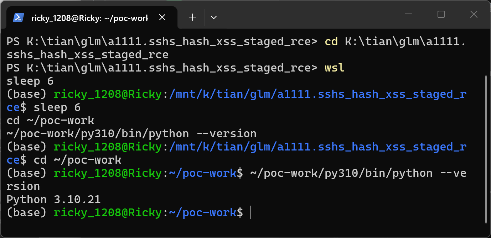

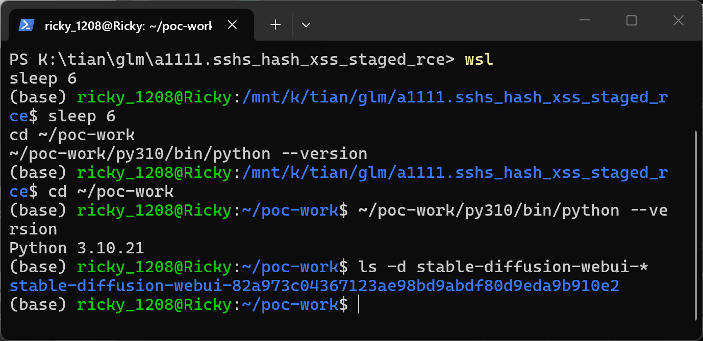

## Proof of Concept

### Prerequisites

- Victim runs stable-diffusion-webui at the pinned commit, launched the ordinary local way (default localhost binding).
- Victim unpacks — or `git clone`s, which is how every Hugging Face model repo is obtained — the attacker's LoRA package into `models/Lora/` and opens `http://127.0.0.1:7860/`. That is the whole interaction; the installer click, the confirmation wait and the restart click are all performed by the injected script.
- `webui.sh` (not `launch.py`) is the launcher in the verification because it exports `SD_WEBUI_RESTART` and re-execs, which makes "Apply and restart UI" a genuine self-restart with nobody in the loop.
- The verification instance ran CPU-only without a checkpoint (`--skip-load-model-at-start`) and with the stock `lora_show_all` user setting enabled so cards list without a loaded checkpoint; neither is on the taint path.

### Steps to Reproduce

1. Build the two packages with the official safetensors writer (`poc/make_poc.py`): both contain the same inert tensor, `install.py` and `scripts/mbe2e_stage2.py` (canary writers) and a `.git` directory; the positive package's `sshs_model_hash` carries the payload, the negative control's holds 64 `b` characters. The two use different `.safetensors` stems on purpose, because A1111 keys its metadata cache on the basename.

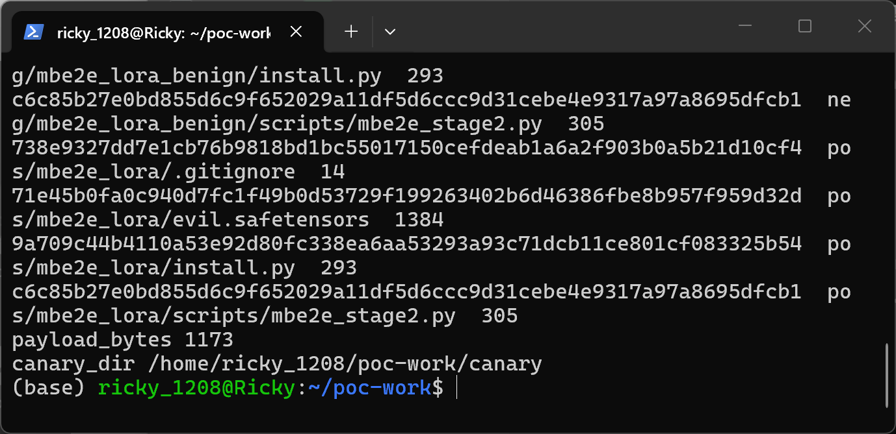

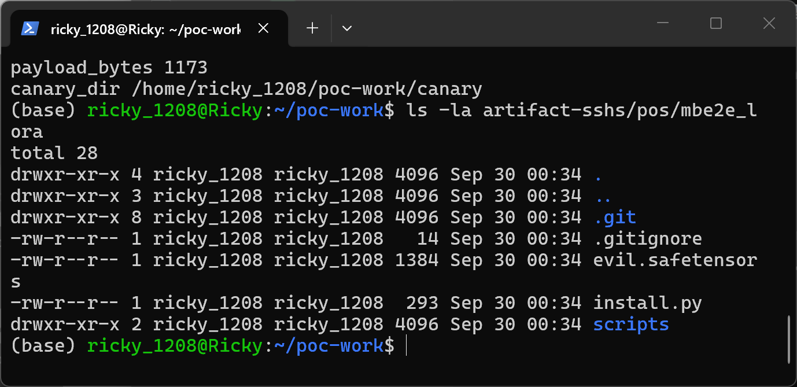

2. Negative control in its own product lifetime: unpack `mbe2e_lora_benign/` into a separate lora dir, start the product with `--lora-dir` pointing there, confirm the API serves.

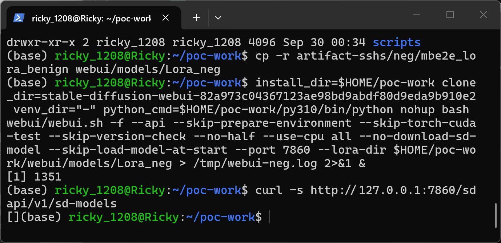

3. Drive a headless Chromium against the page (`poc/drive.py neg`): no DOM milestone appears, neither canary exists, `extensions/` is untouched.

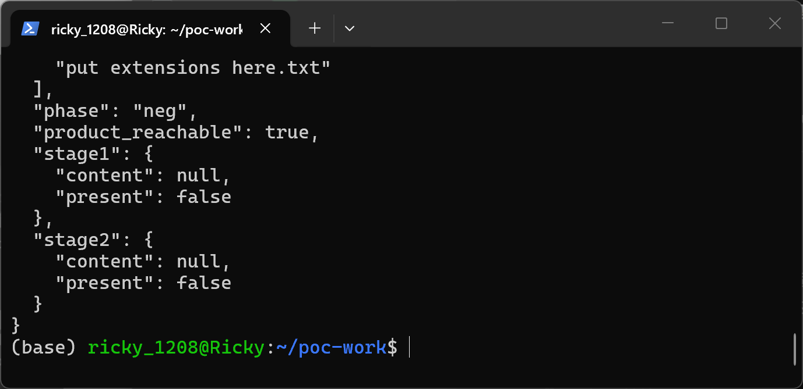

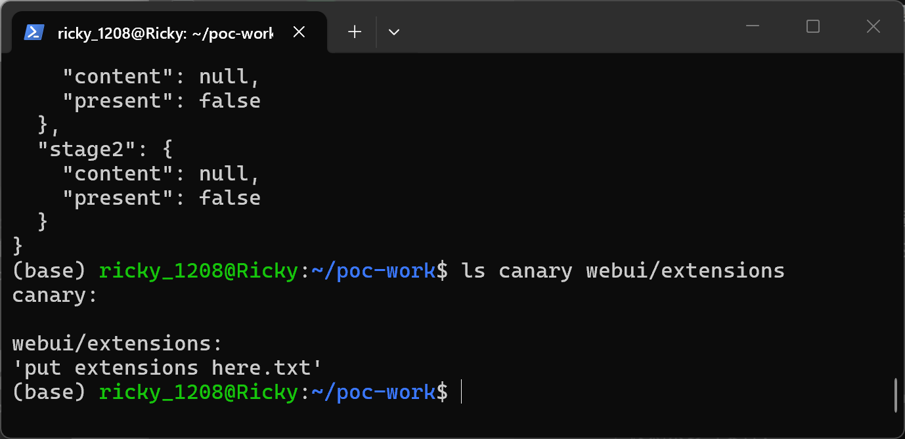

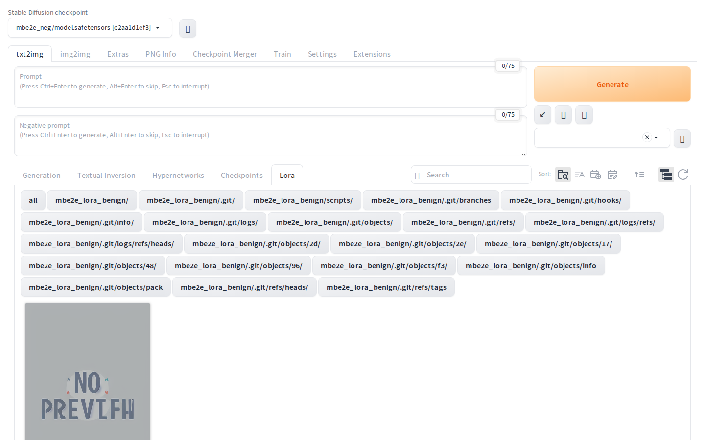

4. Victim action for the positive phase: unpack `mbe2e_lora/` into the default `models/Lora/`, restart the product with default flags, confirm the API serves.

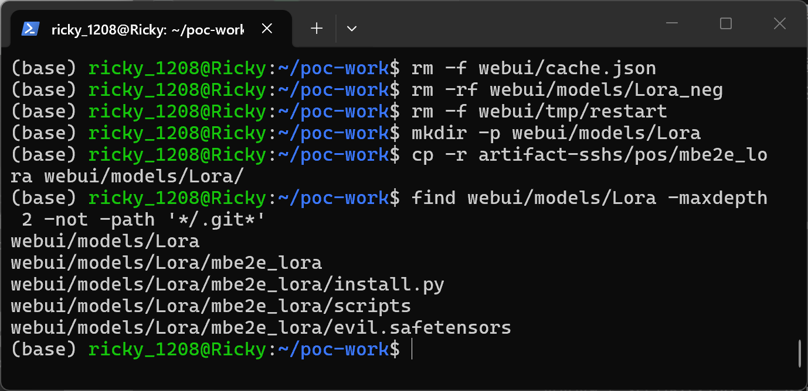

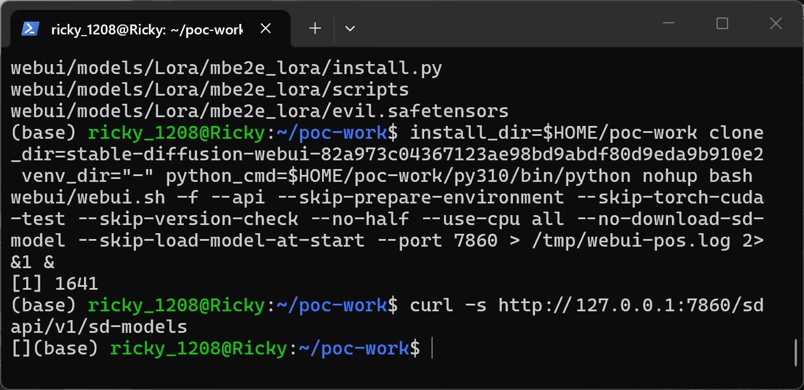

5. Open the page in the driven browser (`poc/drive.py pos`): the `onerror` handler fires on page load and walks the chain by itself. The driver reads the `data-mbe2e` attribute the payload sets on `<html>` at each step.

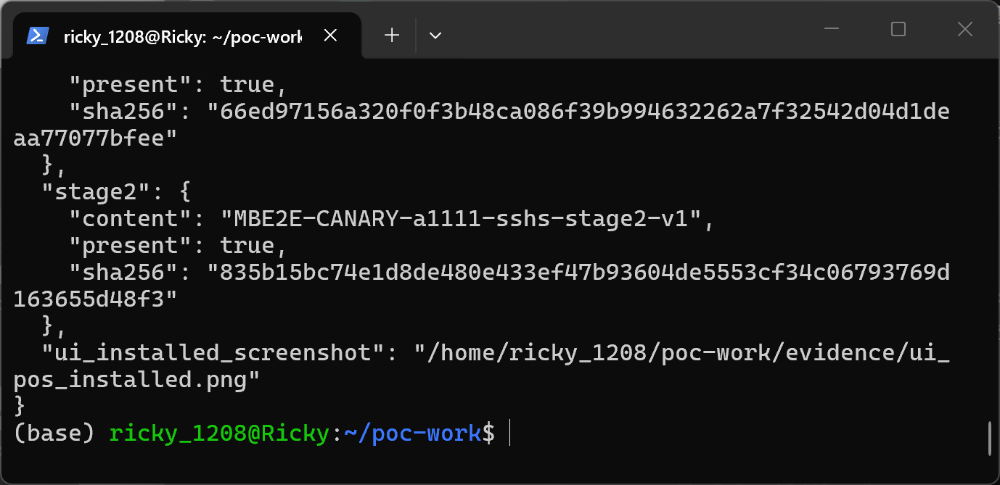

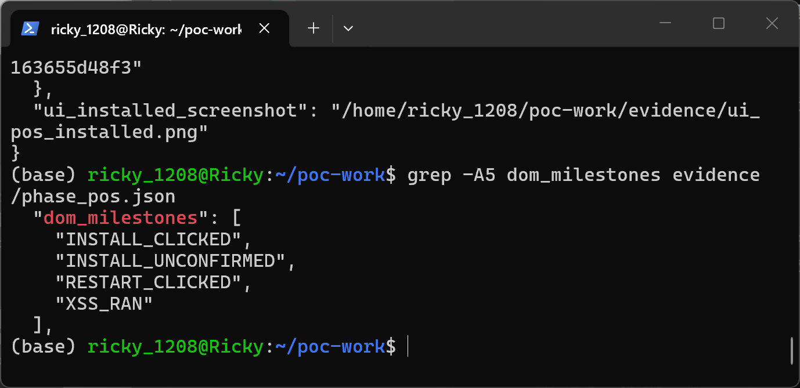

6. Both stages landed: the stage-1 canary was written by the package's `install.py` during the extension install; the stage-2 canary was written by `extensions/mbe2e_lora/scripts/mbe2e_stage2.py` imported after the self-triggered restart.

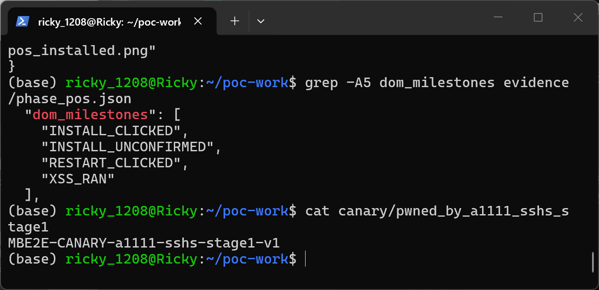

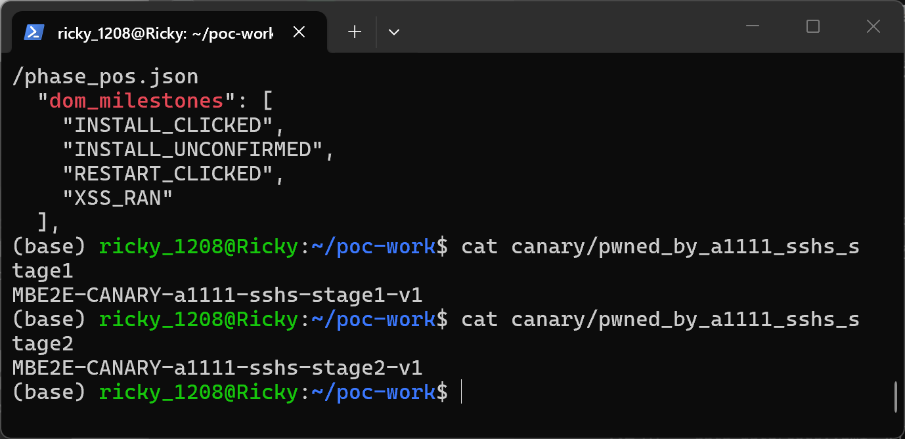

7. Persistence and self-restart confirmed from the product's own state: the attacker package sits in `extensions/`, and one launch of the product logged "Running on local URL" twice.

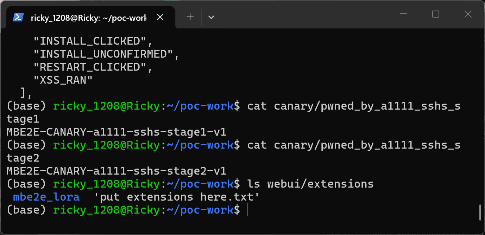

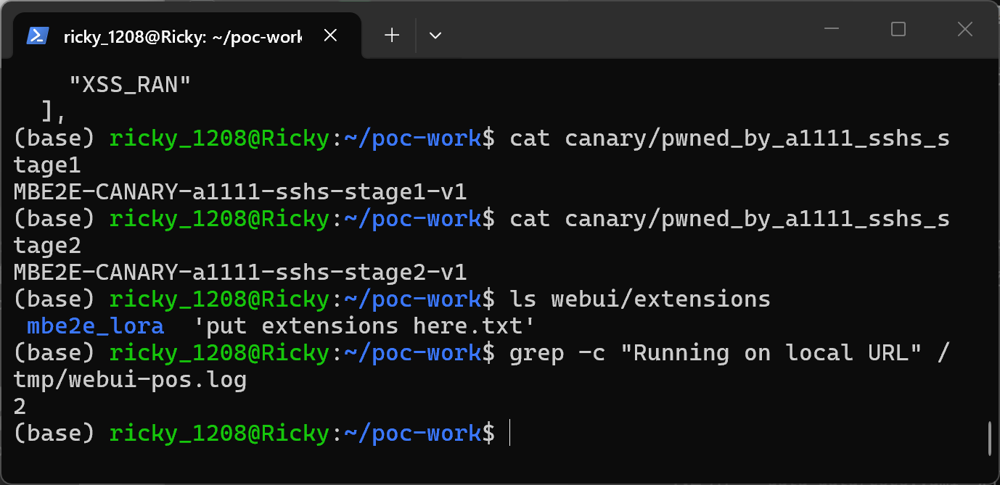

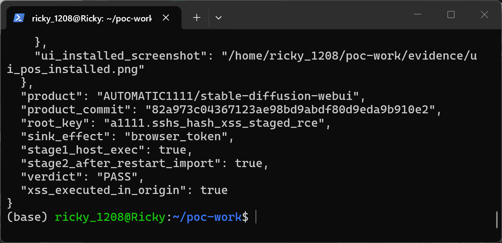

8. The product's own Extensions view after the restart lists the attacker package as an installed extension.

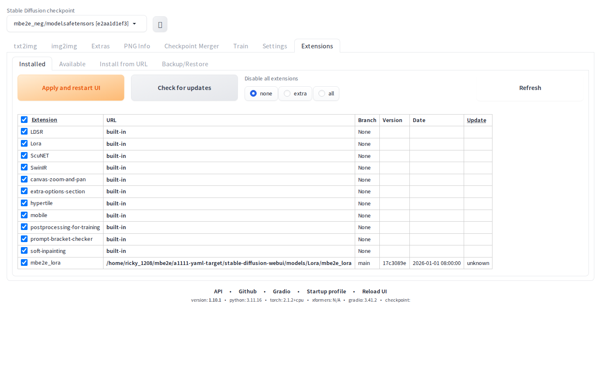

### Expected vs Actual

- Expected: a metadata string named "hash" is inert data — it cannot add markup to the card, cannot operate UI controls, and cannot cause code execution.
- Actual: the string is interpolated into the card HTML unescaped, executes as same-origin JavaScript on page load, and uses the product's own installer and restart controls to execute attacker Python twice — once as an installer subprocess, once as an imported module after a restart the payload triggered itself.

### Sanitized PoC input

```text

```

The full 1173-byte payload (with the exact waits, fallbacks and markers) is generated by `poc/make_poc.py` and carried in `__metadata__.sshs_model_hash` of `evil.safetensors`. Both canaries are inert local file writes; nothing is sent anywhere. `INSTALL_UNCONFIRMED` is itself a small finding: `install_extension_from_index` clones and runs `install.py` *before* `refresh_available_extensions_from_data` raises on the never-loaded index — the Gradio call aborts, the UI shows nothing, and the clone plus the code execution are not rolled back. A real attacker simply proceeds after a timeout, which is what the payload does.

### Constraints

- Stages 1-2 are blocked when extension access is disabled: `modules/shared_cmd_options.py` turns `disable_extension_access` on for `--share`/`--listen`/`--server-name` unless `--enable-insecure-extension-access` is given. The default localhost launch — the overwhelmingly common one, and the one verified here — leaves it enabled. Under `--listen` the XSS still executes; only the escalation is blocked.
- The package must be a git checkout for `install_extension_from_url` to clone it. That is the normal state of a model directory obtained with `git clone https://huggingface.co/...`; a plain zip without `.git` would need a different second stage, which was not attempted.
- The `hidden` span around the injected markup has no mitigating effect: event handlers on parsed elements run regardless of CSS visibility.

## Impact

- Confidentiality: High — attacker-chosen Python runs in the webui process (twice: installer subprocess, then imported module), with the process's full file-read and environment access.
- Integrity: High — the second stage survives restarts as a vanilla extension under `extensions/`, and attacker code can modify models, outputs and configuration at will.
- Availability: High — arbitrary code execution in the server process; the payload also demonstrated it can restart the product at will.
- Scope: crosses a trust boundary twice — server-side HTML generation → browser origin (the XSS), then browser session → host Python execution (the escalation).

## Remediation

Two changes, in order of importance:

1. **Escape `search_term` at `modules/ui_extra_networks.py:312-320`.** The same `html.escape` already applied to `sort_keys` at `:306` and `description` at `:328` is the fix; the omission looks accidental. Because `create_item_html` assembles a large template through `str.format`, the durable form is to escape every untrusted field once where the item dict is built, so a future `{field}` in the template cannot silently reopen this.
2. **Validate `sshs_model_hash` where it becomes an identity** (`extensions-builtin/Lora/network.py:50-57`). Require a value used as a hash to match `^[0-9a-fA-F]{8,64}$`; drop anything else and treat the file as having no recorded hash. Legitimate producers already emit hex, so the guard is cheap and protects future consumers of the field.

Independently worth revisiting: `install_extension_from_index` leaves the cloned extension and the executed `install.py` behind when its own call raises before completing (`modules/ui_extensions.py:344-394`); a failed install that still executed code is surprising.

## Reproduction environment and provenance

- Product source pinned by tarball at commit `82a973c04367123ae98bd9abdf80d9eda9b910e2` (the v1.10.1 release commit); the vulnerable lines quoted above were verified in that tree before running. Companion repositories pinned at the commits `modules/launch_utils.py` requests; `stable-diffusion-stability-ai` was exported from the GitLab mirror `licyk/stablediffusion` at the identical git commit SHA (the original GitHub repository is gone, 404 as of 2026-09-28).
- **Terminal evidence (images 01-18):** local WSL2 Ubuntu 24.04 environment "A" — Python 3.10.21 (micromamba/conda-forge), torch 2.1.2+cpu, gradio 3.41.2, safetensors 0.4.2, Playwright Chromium; product launched via `webui.sh` with `install_dir`/`clone_dir` pointing at the pinned tarball tree (a tarball extract has no `.git`, so the launcher needs the environment-variable form of the same layout webui.sh otherwise detects). Captured 2026-09-30 as one continuous real-terminal session (commands pasted one by one, output as shown).
- **UI page evidence and an independent second run (images 19-20, s-series):** local WSL2 environment "B" on the same machine — separate venv (Python 3.11.16, torch 2.1.2+cpu, gradio 3.41.2, Playwright Chromium) against the same pinned commit. Captured 2026-09-30. The second full neg→pos run reproduced the identical milestone sequence, canaries and extension install.
- An earlier, independent containerized validation of the same defect (Docker `--network none`, Chromium and WebUI in one loopback-only namespace, two runs with byte-identical `result.json`, `verdict: E2_product_e2e`) is on file; the images in this report are from the local reruns documented above, not from that environment.
- Sample provenance: all samples are produced by the official safetensors writer with identical tensor payload and differing only in metadata. Note on hashes: safetensors serializes `__metadata__` through a HashMap, so byte-level SHA-256 varies between writer invocations while behaviour stays identical — the official-round positive sample hashed `71e45b0fa0c940d7fc1f49b0d53729f199263402b6d46386fbe8b957f959d32d` (visible in image 05), the shipped `poc/SHA256SUMS.txt` records the supplement-round values, and both are equally valid instances of the same package.


## References

- Source repository: https://github.com/AUTOMATIC1111/stable-diffusion-webui
- Pinned commit: https://github.com/AUTOMATIC1111/stable-diffusion-webui/commit/82a973c04367123ae98bd9abdf80d9eda9b910e2
- Unescaped sink: `modules/ui_extra_networks.py` lines 312-320 at that commit
- Unvalidated adoption: `extensions-builtin/Lora/network.py` lines 50-57 at that commit
- CWE: https://cwe.mitre.org/data/definitions/79.html
- Upstream report: [pending publication]
- Vendor advisory: [none]

