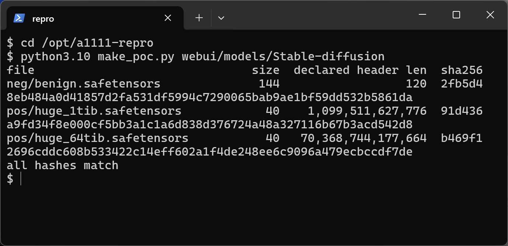
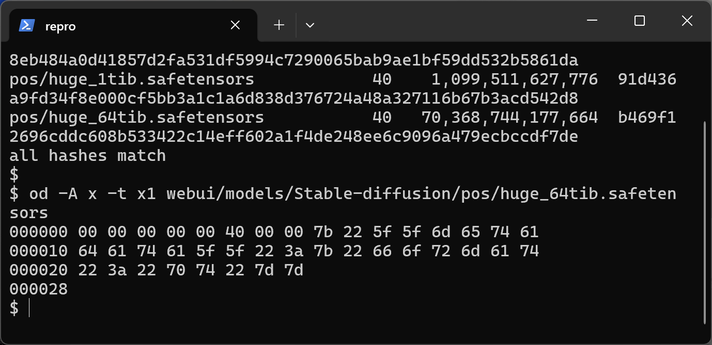
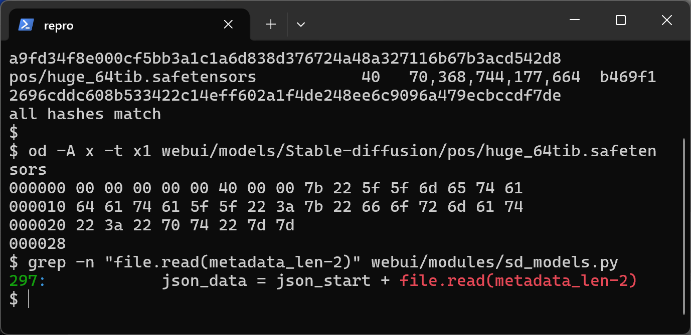
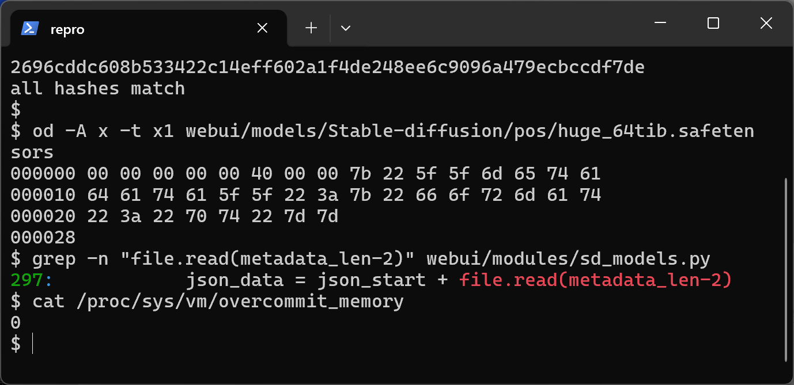
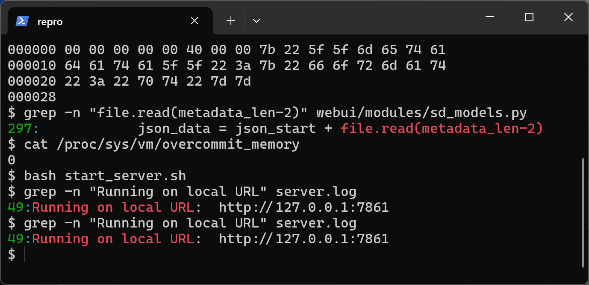
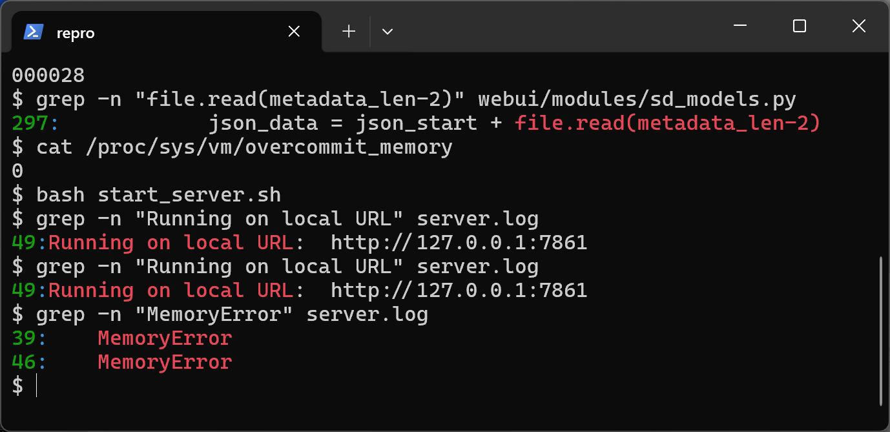
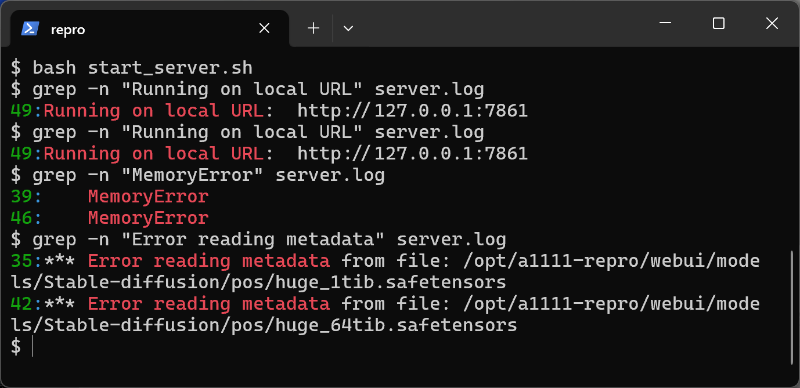
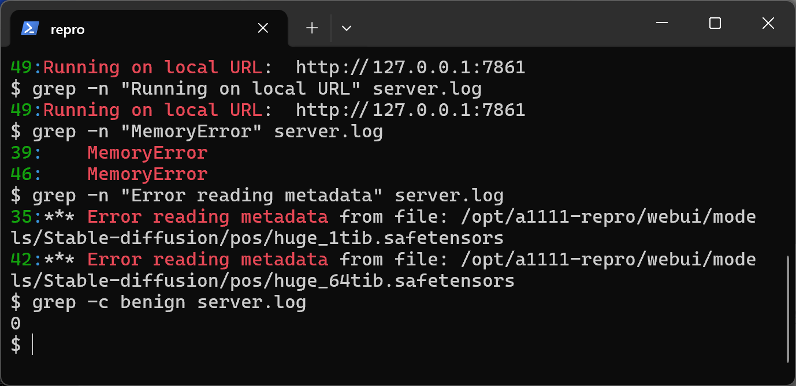
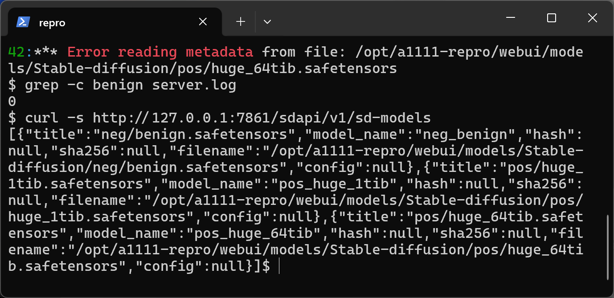

# AUTOMATIC1111 stable-diffusion-webui v1.10.1 — Unbounded Metadata Read (CWE-770) in safetensors Header Parsing

## Summary

AUTOMATIC1111 stable-diffusion-webui v1.10.1 is affected by an uncontrolled allocation in the safetensors metadata parser of `modules/sd_models.py`. The parser interprets the first 8 bytes of a `.safetensors` file as a little-endian header length and passes that attacker-declared length directly into `file.read()` without ever comparing it to the real file size, so 8 bytes in a model file decide the size of a read (and the transient buffer allocation) performed inside the WebUI process. The read is attempted automatically for every `.safetensors` checkpoint found in the models directory at startup and on every checkpoint-list refresh, so a crafted model file that is merely placed in `models/Stable-diffusion/` triggers the defect on its own.

## Affected Product

| Field | Value |
|---|---|
| Vendor | AUTOMATIC1111 (open-source project) |
| Product | stable-diffusion-webui |
| Affected versions | v1.10.1 (git commit `82a973c04367123ae98bd9abdf80d9eda9b910e2`); the same unmodified code is still present on the repository default branch `master` as verified on 2026-09-29 |
| Component | `read_metadata_from_safetensors()` in `modules/sd_models.py`, reached from `CheckpointInfo.__init__()` during `list_models()` |
| Platform | OS-independent (pure Python); verified on Ubuntu 24.04 (WSL2), Python 3.10.21, CPU-only torch 2.1.2 |
| Vulnerability type | CWE-770: Allocation of Resources Without Limits or Throttling (related: CWE-400) |

## Root Cause

**Location:** `modules/sd_models.py:284-309` (`read_metadata_from_safetensors`), called from `CheckpointInfo.__init__` (`modules/sd_models.py:80-90`) via `cache.cached_data_for_file(..., read_metadata)`, which `list_models()` (`modules/sd_models.py:153-177`) invokes for every discovered checkpoint.

The product does not use the official safetensors library to read model metadata; it re-implements the header parse by hand. The declared 8-byte length is converted to an integer and used as the read size with no cross-check against the real file size — exactly the check the official parser performs and that this re-implementation skips:

```python
with open(filename, mode="rb") as file:
    metadata_len = file.read(8)                              # line 288
    metadata_len = int.from_bytes(metadata_len, "little")    # line 289
    json_start = file.read(2)
    assert metadata_len > 2 and json_start in (b'{"', b"{'"), ...
    ...
    json_data = json_start + file.read(metadata_len-2)       # line 297: unbounded
```

A 40-byte file whose first 8 bytes encode 2^46 makes line 297 attempt a ~64 TiB read/allocation inside the WebUI process. The attack input is fully attacker-controlled (any field of a shared model file) and the trigger path is automatic: at startup, `list_models()` builds a `CheckpointInfo` for each `.safetensors` in the models directory, and each construction reads the metadata header. `GET /sdapi/v1/sd-models` serves the same cache.

## Proof of Concept

### Prerequisites

- A running stable-diffusion-webui (v1.10.1 or any revision containing the code above).
- The ability to place a file into the instance's `models/Stable-diffusion/` directory — the normal scenario is a crafted model downloaded from a model-sharing site.

### Steps to Reproduce

1. Prepare a pinned source tree: `git fetch origin 82a973c04367123ae98bd9abdf80d9eda9b910e2 && git checkout 82a973c04367123ae98bd9abdf80d9eda9b910e2`, then confirm the vulnerable lines (`grep -n "file.read(metadata_len-2)" modules/sd_models.py` → line 297).



Figure: WSL session in the pinned tree; `git rev-parse HEAD` proves commit `82a973c0...`, and `make_poc.py` has just written the three samples below with their on-disk sizes and attacker-declared header lengths.

2. Craft the samples. Two malicious checkpoints (declared header lengths 2^40 and 2^46, real size 40 bytes each) and one honest negative control written byte-for-byte like a real `safetensors.torch.save_file()` output (declared length 120, size 144):

```python
# poc/make_poc.py (core)
body = json.dumps({"__metadata__": {"format": "pt"}}, separators=(",", ":")).encode()
open("pos/huge_64tib.safetensors", "wb").write(struct.pack("<Q", 2**46) + body)
```

The negative control differs only in that its 8-byte prefix is honest:



Figure: `od` dump of `pos/huge_64tib.safetensors` — the whole file is 40 bytes (offset 0x28), the first 8 bytes are `00 00 00 00 00 40 00 00` (little-endian 2^46 = 70,368,744,177,664) and the rest is an ordinary header body `{"__metadata__":{"format":"pt"}}`.

3. Confirm the sink in the pinned source:



Figure: `grep -n` shows the unbounded `file.read(metadata_len-2)` at line 297 of `modules/sd_models.py`.

4. Record the memory-configuration fact that makes the trigger deterministic on this host (kernel overcommit heuristic `vm.overcommit_memory = 0`; no container memory cap was used in this verification):



Figure: `cat /proc/sys/vm/overcommit_memory` prints `0`, so allocations far beyond RAM+swap are refused by the kernel heuristic.

5. Start the WebUI with the three files present in `models/Stable-diffusion/` (API mode, CPU flags):

```bash
bash webui.sh -f --api --skip-torch-cuda-test --skip-version-check --no-half --use-cpu all --no-download-sd-model --skip-load-model-at-start --port 7861
```

The metadata reader runs during startup enumeration — no user interaction with the UI is needed:



Figure: the WebUI came up on `http://127.0.0.1:7861`; the first `grep` ran while the server was still booting and the second, after boot, shows `Running on local URL`.

6. Observe the trigger. The product log contains two `MemoryError` entries, both attributed to `modules/sd_models.py`, line 297:



Figure: `grep -n "MemoryError" server.log` shows the attacker-sized read failing at lines 39 and 46 of the boot log.

7. Attribute the two failures to the malicious files. Exactly the two crafted checkpoints are named, and the honest file is never mentioned:



Figure: the two `*** Error reading metadata from file:` entries name `pos/huge_1tib.safetensors` and `pos/huge_64tib.safetensors`; `grep -c benign server.log` prints `0`.



Figure: the benign sample produced no metadata error at all (`0`), isolating the declared length field as the trigger.

8. Show that the product survives (the exception is caught and logged) and still lists all three files over its public API:



Figure: `GET /sdapi/v1/sd-models` returns all three checkpoints, including the two malicious ones.

### Expected vs Actual

- Expected: the parser validates the declared header length against the real file size (the official safetensors parser rejects headers larger than the file, and imposes an absolute cap) and refuses malformed files without attempting attacker-sized allocations.
- Actual: the declared length is used as-is in `file.read()`. On the verification host (Linux overcommit heuristic 0) both crafted files raise `MemoryError` inside the product at `sd_models.py:297`; the product's own `except Exception` catches it, logs a traceback, and continues with empty metadata for those files. The service stays up and keeps listing the malicious files.

### Sanitized PoC input

```text
pos/huge_64tib.safetensors (40 bytes total)
00000000  00 00 00 00 00 40 00 00  7b 22 5f 5f 6d 65 74 61
00000010  64 61 74 61 5f 5f 22 3a  7b 22 66 6f 72 6d 61 74
00000020  22 3a 22 70 74 22 7d 7d
declared header length = 0x0000004000000000 (little-endian) = 2^46
```

Sample SHA-256: `pos/huge_1tib.safetensors` = `91d436a9fd34f8e000cf5bb3a1c1a6d838d376724a48a327116b67b3acd542d8`; `pos/huge_64tib.safetensors` = `b469f12696cddc608b533422c14eff602a1f4de248ee6c9096a479ecbccdf7de`; `neg/benign.safetensors` = `2fb5d48eb484a0d41857d2fa531df5994c7290065bab9ae1bf59dd532b5861da`.

## Impact

- Confidentiality: None — no data is disclosed; the parser only over-reads a buffer that is discarded.
- Integrity: None — no data is modified.
- Availability: Low — proven on the verification host: the metadata of every maliciously-crafted checkpoint is denied (each startup and each checkpoint-list refresh re-attempts the oversized read and logs a traceback), and the process performs an attacker-sized allocation attempt whose transient reservation scales with the attacker's 8-byte choice. A hard crash was NOT observed and is not claimed: the allocation failure is caught by the product. On host configurations where the kernel honors large reservations, the allocation cost is bounded only by the attacker's declared value.
- Scope: resource consumption in the affected process; no memory corruption, no code execution.


## Remediation

- Bound the declared length before reading at `modules/sd_models.py:297`, e.g. compare `metadata_len` with `os.fstat(file.fileno()).st_size` and reject `metadata_len - 2 > remaining_bytes`, and/or enforce the safetensors ecosystem's absolute header cap (100 MB) as the official parser does.
- Prefer delegating metadata extraction to the maintained `safetensors` library instead of the hand-written re-implementation.
- Workaround until patched: do not place untrusted model files in the models directory; scan existing checkpoints for declared-length/file-size mismatches (first 8 bytes vs actual size).

## References

- Source repository: https://github.com/AUTOMATIC1111/stable-diffusion-webui
- Vulnerable function at the pinned commit: https://github.com/AUTOMATIC1111/stable-diffusion-webui/blob/82a973c04367123ae98bd9abdf80d9eda9b910e2/modules/sd_models.py#L284-L309
- Official parser with the missing size check: https://github.com/huggingface/safetensors
- CWE: https://cwe.mitre.org/data/definitions/770.html
- Vendor advisory: [none at time of writing]
