# AllenNLP 2.10.1 — Unsafe Reflective Instantiation (RCE) in FromParams Configuration Handling

## Summary

AllenAI AllenNLP 2.10.1 (and the final state of the archived repository, commit 80fb6061e568cb9d6ab5d45b661e86eb61b92c82) is affected by an unsafe reflective instantiation issue in the `FromParams`/`Registrable` configuration machinery that leads to arbitrary command execution. When AllenNLP loads a model archive (`model.tar.gz`) containing an attacker-crafted `config.json`, a value such as `"type": "subprocess.Popen"` in the `dataset_reader` stanza bypasses the registered-choices validation (any value containing a `.` is accepted as a "fully-qualified class name"), is imported via `importlib.import_module`/`getattr` without any subclass check, and is instantiated directly with the remaining attacker-controlled parameters, executing the attacker's command under the privileges of the AllenNLP process.

## Affected Product

| Field | Value |
|---|---|
| Vendor | Allen Institute for Artificial Intelligence (AllenAI) |
| Product | AllenNLP |
| Affected versions | 2.10.1 (final PyPI release); commit 80fb6061e568cb9d6ab5d45b661e86eb61b92c82 (final commit of `main`, 2022-11-22, after which the repository was archived). The three vulnerable source files are byte-identical between the 2.10.1 tag and commit 80fb606. Whether earlier versions are affected: `[unknown]` (no earlier version audited). |
| Component | `allennlp/common/params.py` (`Params.pop_choice`), `allennlp/common/registrable.py` (`Registrable.resolve_class_name`), `allennlp/common/from_params.py` (`FromParams.construct`) |
| Platform | OS-independent (pure Python). Verified on Ubuntu 24.04.3 LTS (WSL2, kernel 6.18.33.2-microsoft-standard-WSL2), CPython 3.10.21, allennlp 2.10.1, torch 1.12.1+cpu, spacy 3.3.3, transformers 4.20.1 |
| Vulnerability type | CWE-470: Use of Externally-Controlled Input to Select Classes or Code ('Unsafe Reflection'), leading to arbitrary command execution (CWE-78 impact) |

## Root Cause

Three cooperating defects let an attacker-controlled configuration string reach an arbitrary constructor:

**1. `Params.pop_choice` accepts any dotted value as a "class name"** — `allennlp/common/params.py:271-316`. When the popped `type` value is not in the registered choices, validation is skipped entirely if the value merely contains a dot (`allow_class_names` defaults to `True`):

```python
ok_because_class_name = allow_class_names and "." in value
if value not in choices and not ok_because_class_name:
    raise ConfigurationError(...)
```

The docstring acknowledges the check "is extremely lenient and consists of checking that the value contains a '.'".

**2. `Registrable.resolve_class_name` imports the dotted name without any type check** — `allennlp/common/registrable.py:163-201`. If the name is not registered and contains a dot, the module is imported and the attribute is fetched, and the resulting object is returned as a "subclass" of the requesting base class with no `issubclass(subclass, cls)` validation:

```python
elif "." in name:
    parts = name.split(".")
    submodule = ".".join(parts[:-1])
    class_name = parts[-1]
    module = importlib.import_module(submodule)
    subclass = getattr(module, class_name)
    constructor = None
    return subclass, constructor
```

**3. `FromParams.construct` instantiates the resolved object directly with attacker-controlled kwargs** — `allennlp/common/from_params.py:580-617`. The resolved object is treated as a registered subclass; classes that do not define `from_params` (such as `subprocess.Popen`) fall through to raw instantiation with the remaining configuration parameters:

```python
choice = params.pop_choice("type", choices=as_registrable.list_available(), ...)
subclass, constructor_name = as_registrable.resolve_class_name(choice)
...
return subclass(**params)  # type: ignore
```

The trigger path is the standard model-loading flow: `allennlp predict` (and `allennlp train`) reads `config.json` out of the model archive and constructs the dataset reader before anything else — `allennlp/models/archival.py` `load_archive()` → `_load_dataset_readers()` (`allennlp/models/archival.py:259-275`) → `DatasetReader.from_params(...)`. `subprocess` is part of the Python standard library, so no plugin or custom code is required: the payload executes at archive-load time, under the victim user's privileges. Note that archive contents are extracted to a temporary directory that is not on `sys.path`, so shipping importable malicious code inside the archive does not work by itself — the primitive is limited to modules already importable in the victim environment (stdlib and installed packages), which is nonetheless sufficient for arbitrary command execution via `subprocess.Popen`.

## Proof of Concept

### Prerequisites

- Victim has `allennlp==2.10.1` installed (standard `pip install allennlp`).
- Victim runs `allennlp predict <archive> <input>` (or `allennlp train <config>`) on an attacker-supplied `model.tar.gz`.
- The payload writes to a path writable by the victim user; in this demonstration `/out` is a user-writable directory.

### Steps to Reproduce

1. Prepare the victim environment: `pip install allennlp==2.10.1`, create an empty writable directory `/out`, and confirm the canary file does not exist yet.

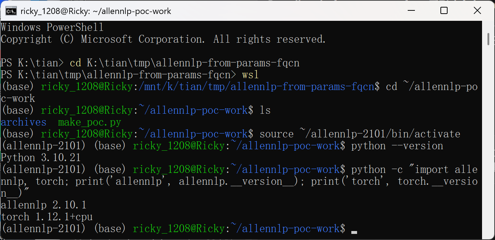

2. Build the three model archives with the generator script (`make_poc.py`, attached): `evil-model.tar.gz` (`dataset_reader.type = subprocess.Popen`, payload writes a canary file), `benign-model.tar.gz` (the product's own `text_classification_json` reader, negative control), and `localmodule-model.tar.gz` (`dataset_reader.type = pwn_reader.PwnReader` with `pwn_reader.py` shipped inside the archive, negative control for the import boundary).

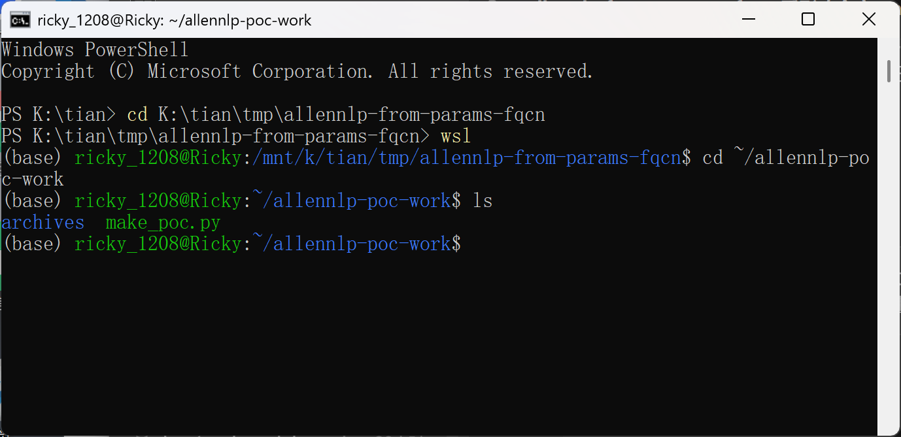

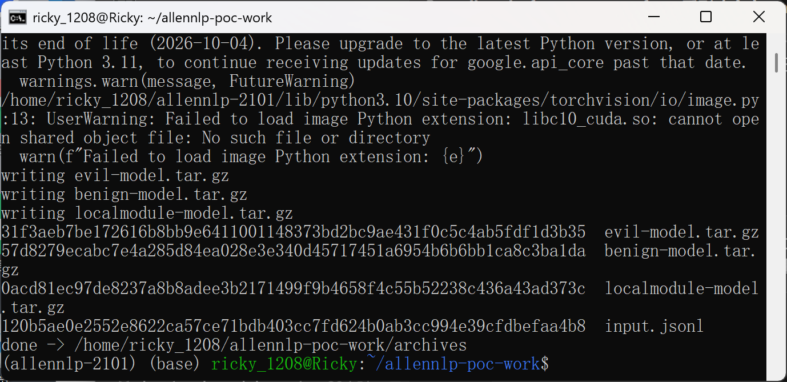

3. Inspect the malicious archive: it has the layout of an ordinary AllenNLP archive (`config.json`, `weights.th`, `vocabulary/`), with legitimate weights and vocabulary; the only malicious field is `dataset_reader.type`.

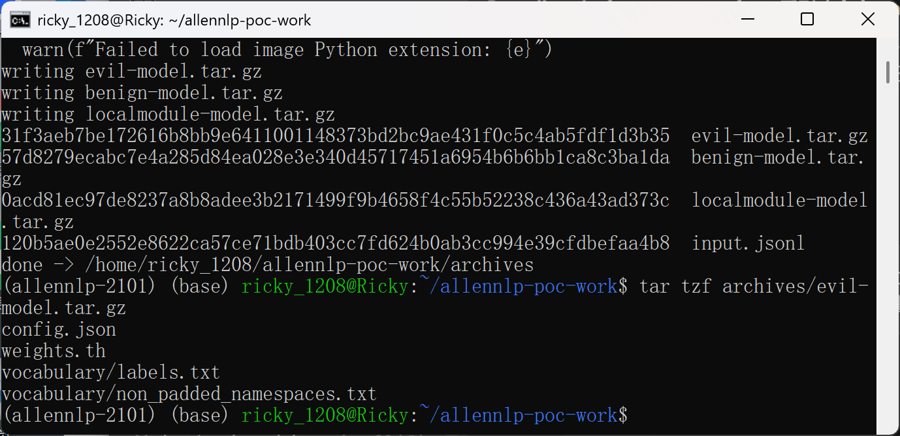

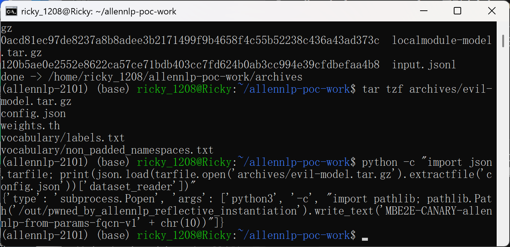

4. Baseline: `/out` contains no canary file.

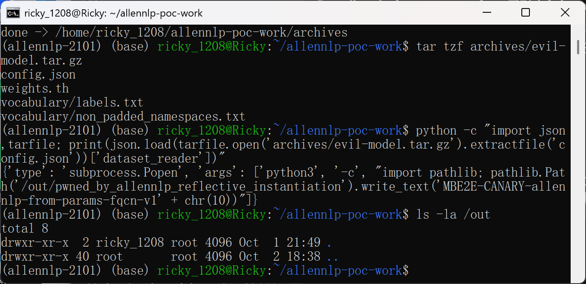

5. Run the product CLI on the malicious archive: `allennlp predict archives/evil-model.tar.gz archives/input.jsonl`.

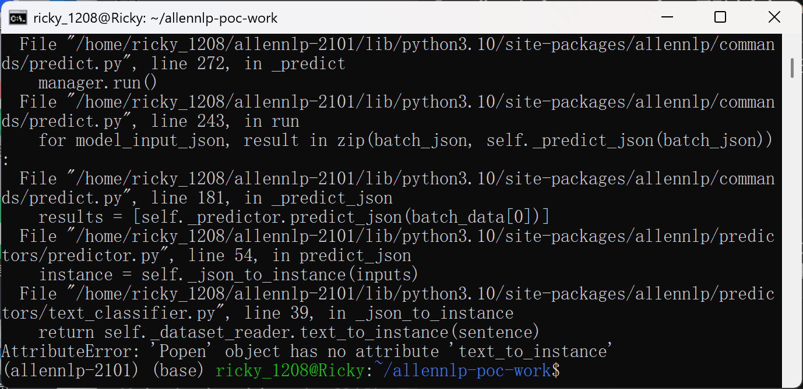

6. Observe that the command inside `args` executed during archive loading: the canary file now exists in `/out` with the exact canary string.

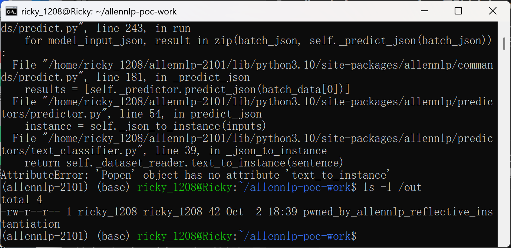

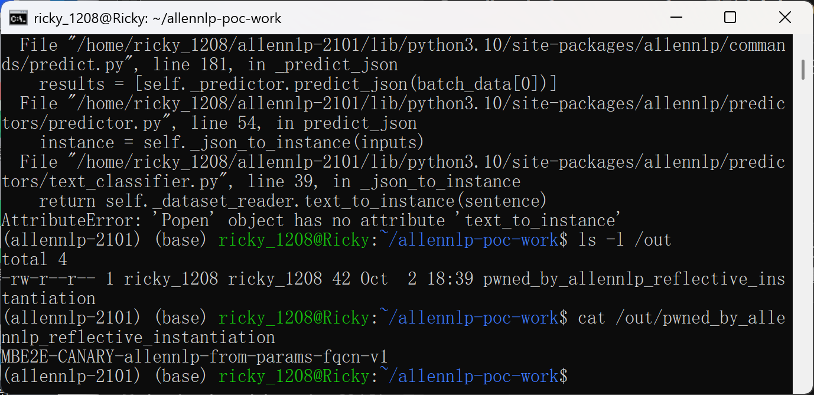

7. Negative control 1 (product's own reader): the same archive with `dataset_reader.type = text_classification_json` runs predictions normally and creates no file in `/out` (after removing the canary first).

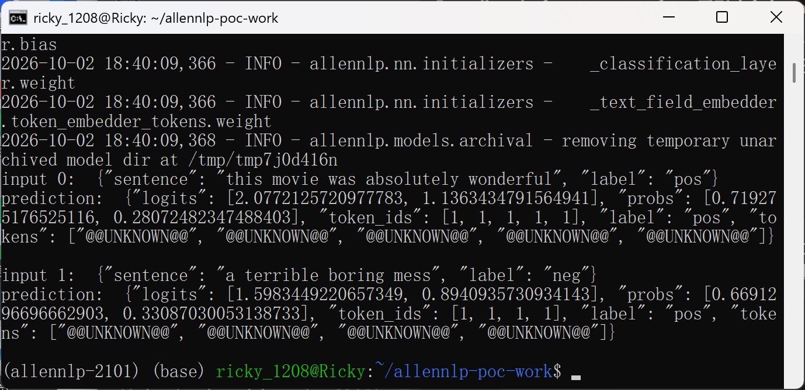

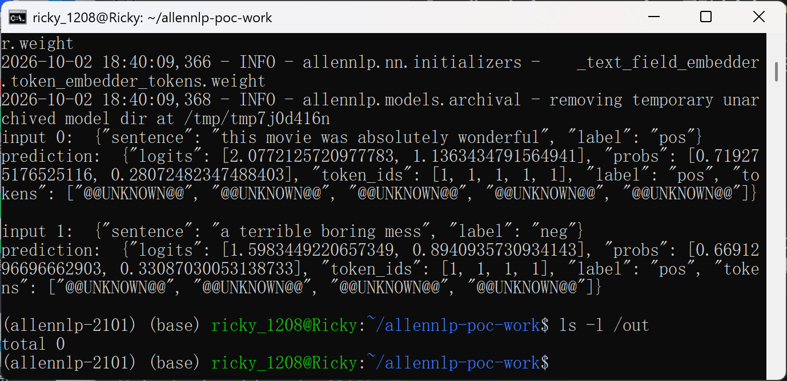

8. Negative control 2 (archive-local module): pointing `type` at `pwn_reader.PwnReader` with `pwn_reader.py` inside the archive fails with a `ConfigurationError` ("unable to import module pwn_reader") and no canary appears — archive contents are extracted to a temp directory that is not importable, which confines the primitive to FQCNs importable in the victim's environment.

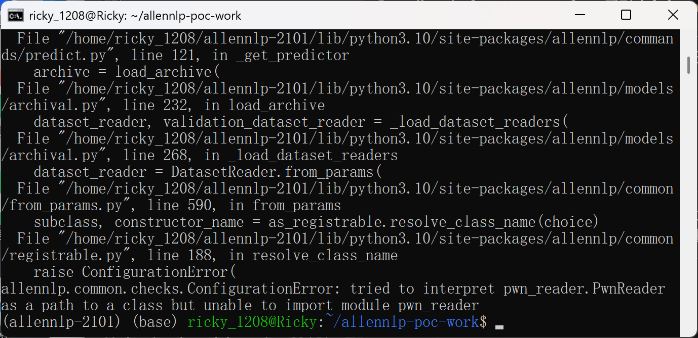

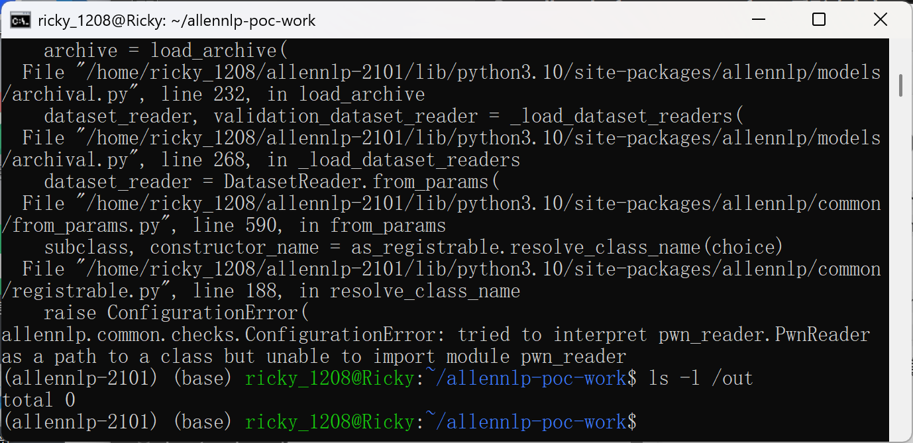

### Expected vs Actual

- Expected: a `config.json` inside a model archive should only ever instantiate `DatasetReader` subclasses that are registered for AllenNLP (or explicitly opted in); unknown `type` values must be rejected with a configuration error.
- Actual: any dotted value is treated as a "fully-qualified class name", imported, and instantiated with attacker-controlled constructor arguments; `subprocess.Popen(args=["python3", "-c", "..."])` executes the embedded Python command at archive-load time. The subsequent `AttributeError: 'Popen' object has no attribute 'text_to_instance'` shows the `Popen` instance being accepted in the `DatasetReader` slot; by that point the payload has already run.

### Sanitized PoC input

The essential malicious `config.json` (packed at the archive root together with ordinary `weights.th` and `vocabulary/` files):

```json
{
  "dataset_reader": {
    "type": "subprocess.Popen",
    "args": ["python3", "-c", "import pathlib; pathlib.Path('/out/pwned_by_allennlp_reflective_instantiation').write_text('MBE2E-CANARY-allennlp-from-params-fqcn-v1' + chr(10))"]
  },
  "model": {
    "type": "basic_classifier",
    "text_field_embedder": {"token_embedders": {"tokens": {"type": "embedding", "embedding_dim": 8}}},
    "seq2vec_encoder": {"type": "bag_of_embeddings", "embedding_dim": 8}
  }
}
```

The `dataset_reader` stanza alone is sufficient to trigger execution; the `model` stanza and the weights/vocabulary files only make the archive a well-formed AllenNLP archive (so the negative controls complete their normal workflow).

## Impact

- Confidentiality: High — the executed command runs with the victim's privileges and can read arbitrary data (credential files, model/data directories, exfiltrate over the network).
- Integrity: High — arbitrary files can be created or modified; model caches and environments can be poisoned.
- Availability: High — arbitrary process creation allows destructive operations on the host.
- Scope: command execution in the AllenNLP process's user account; typical ML workloads run with broad filesystem and sometimes cluster credentials, so a malicious `model.tar.gz` shared via model hubs, tutorials, or papers ("run `allennlp predict` on this model") yields full user-level compromise.

## Remediation

This product is end-of-life: the repository was archived on 2022-11-22 and no upstream fix is expected. Operators should migrate off AllenNLP or isolate it. For the record, the natural upstream fix would be:

- In `Registrable.resolve_class_name` (`allennlp/common/registrable.py:178-196`), after `getattr`, validate the resolved object before returning it, e.g. `if not (isinstance(subclass, type) and issubclass(subclass, cls)): raise ConfigurationError(...)`, so a dotted name can only select actual subclasses of the base class being constructed.
- Alternatively/additionally, disable the `allow_class_names` leniency (`allennlp/common/params.py:271-316`) for configuration that originates from untrusted archives, or require an explicit opt-in (similar in spirit to HF `trust_remote_code`).

Workaround until migration: never run `allennlp train`/`allennlp predict` on archives from untrusted sources; if unavoidable, run inside an unprivileged container without network access and without secrets.


## References

- Source repository: https://github.com/allenai/allennlp (archived)
- Vulnerable commit: https://github.com/allenai/allennlp/tree/80fb6061e568cb9d6ab5d45b661e86eb61b92c82
- `allennlp/common/params.py` (`pop_choice`): https://github.com/allenai/allennlp/blob/80fb6061e568cb9d6ab5d45b661e86eb61b92c82/allennlp/common/params.py
- `allennlp/common/registrable.py` (`resolve_class_name`): https://github.com/allenai/allennlp/blob/80fb6061e568cb9d6ab5d45b661e86eb61b92c82/allennlp/common/registrable.py
- `allennlp/common/from_params.py` (`construct`): https://github.com/allenai/allennlp/blob/80fb6061e568cb9d6ab5d45b661e86eb61b92c82/allennlp/common/from_params.py
- CWE-470: https://cwe.mitre.org/data/definitions/470.html
- CWE-78: https://cwe.mitre.org/data/definitions/78.html
- Vendor advisory: `[none]`
- Upstream issue: `[none — repository archived, issues disabled]`
