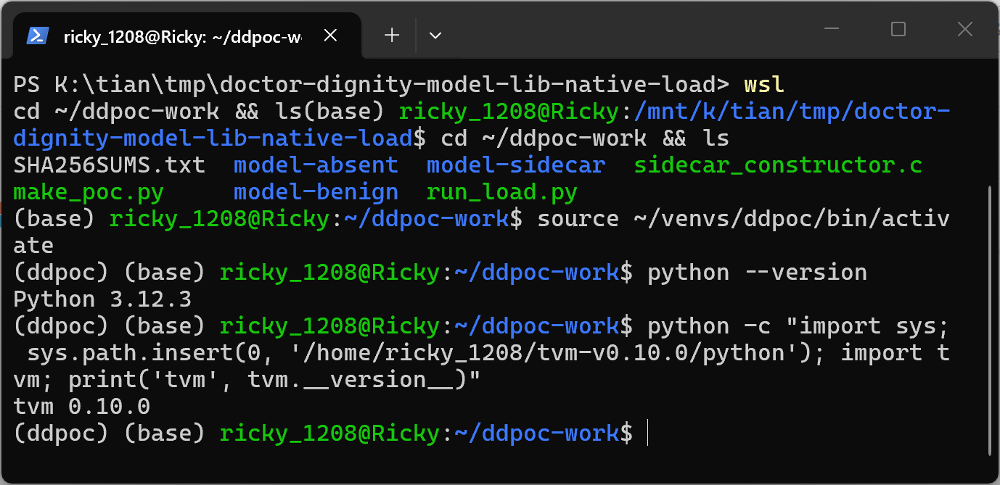
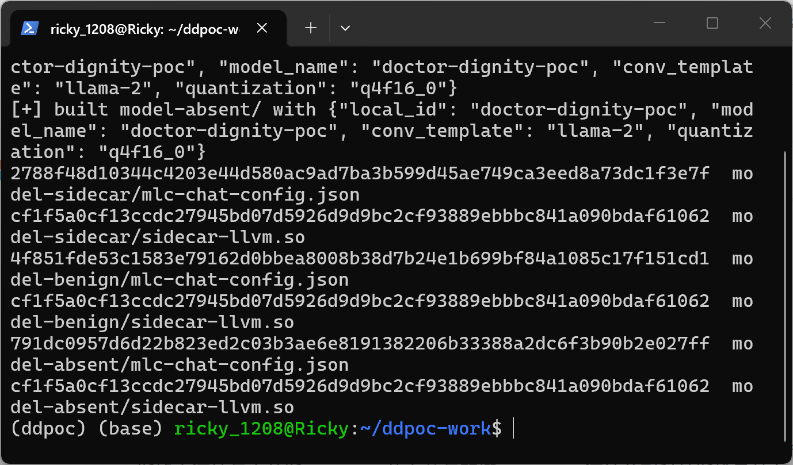
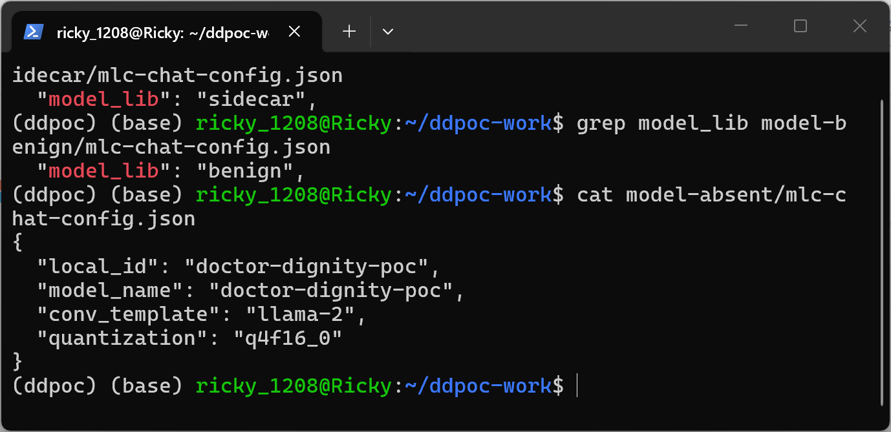
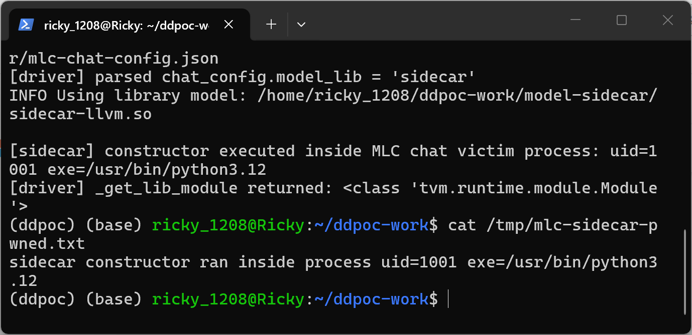
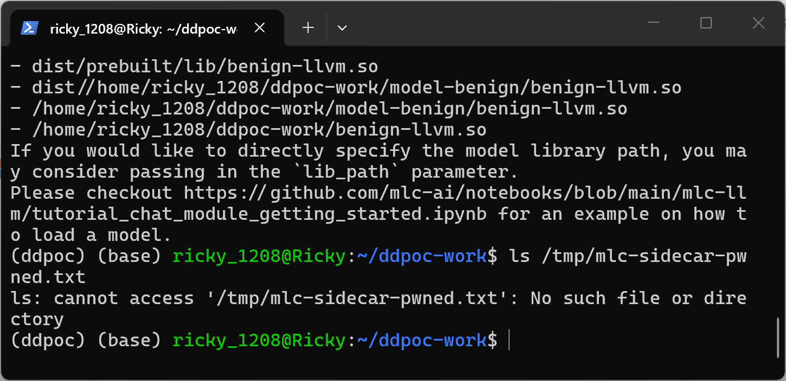

# Doctor-Dignity (MLC Chat) 3f2ffb6 — Arbitrary Code Execution via model_lib Sidecar Loading in mlc_chat.chat_module

## Summary

Doctor-Dignity (a fine-tuned LLaMA-2 medical chatbot built on the MLC LLM chat runtime, commit 3f2ffb6, the current tip of `main`) is affected by arbitrary code execution in the model-library lookup of `mlc_chat.chat_module`. The `model_lib` field of the plain-JSON file `mlc-chat-config.json` inside a distributed model package is used as an unvalidated string to build a shared-library file name, and the first matching file found inside the model package directory is passed to `tvm.runtime.load_module()`. TVM loads the file with `dlopen()`, which executes the library's ELF constructor before any TVM symbol is resolved, so an attacker-compiled native program shipped alongside the model weights executes inside the chat process the moment the victim's MLC Chat / Doctor-Dignity app loads the model package. A controlled experiment with three model packages whose `mlc-chat-config.json` differ only in the `model_lib` value confirms that this single JSON field decides whether the sidecar native program is loaded and executed; benign and missing-value controls never load it and never execute it.

**Classification note (honest scoping):** the JSON field itself is only a selector — the executable payload is a complete native program (`sidecar-llvm.so`) shipped as a file of the model package, so the terminal effect is owned by the bundled native sidecar rather than by a memory-safety defect in the parsing code. This is the same category as model packages that bundle Python modules: a reviewer may classify it as unsafe handling of untrusted model packages instead of a classic model-data (tensor/metadata) vulnerability. It is reported because the MLC chat runtime actively searches the untrusted package directory for loadable ELF files and executes them without any integrity check, which is behavior a user distributing/downloading model packages does not expect.

## Affected Product

| Field | Value |
|---|---|
| Vendor | llSourcell (Siraj Raval) — repository is a fork of mlc-ai/mlc-llm |
| Product | Doctor-Dignity (MLC Chat app runtime, `mlc_chat` Python package) |
| Affected versions | git commit 3f2ffb6c892f13b50a708d05900d3227acb40ded (current `main`); `mlc_chat.__version__` reports `0.1.dev0` |
| Component | `python/mlc_chat/chat_module.py`, function `_get_lib_module()` (lines 290-378), defect at lines 371-374; device fallback `_detect_local_device()` lines 434-461 |
| Platform | Linux (verified on Ubuntu 24.04 x86_64 under WSL2), Python 3.12, TVM runtime; the same code path exists on macOS/Windows with `.dylib`/`.dll` candidate names |
| Vulnerability type | CWE-94: Code Injection (execution of attacker-supplied native code selected by model-package configuration) |

## Root Cause

**Location:** `python/mlc_chat/chat_module.py:371-374` (`_get_lib_module`, step 4 "Search for model library")

`ChatModule.__init__()` reads the model package's `mlc-chat-config.json` with `json.load()` (`_get_chat_config`, lines 261-288) and keeps `model_lib` as an unchecked string. `_get_lib_module()` then builds candidate library file names from that string — on Linux `f"{chat_config.model_lib}-{device_name}.so"` (line 339) — and searches a list of locations that explicitly includes the model package directory itself (`os.path.join(model_path, lib_name)`, line 365). The first existing file is handed to `tvm.runtime.load_module(candidate)` (line 374). `model_lib` is therefore a fully attacker-controlled value (anyone who distributes a model package controls the JSON), the model package directory is attacker-controlled data, and the loader executes whatever ELF the combination selects. On a CPU-only host `_detect_local_device()` (lines 434-461) falls back to `device_name = "llvm"` (log line 458-460: "Switch to llvm instead"), so the searched name is `<model_lib>-llvm.so`; the attack works on any platform by naming the sidecar for the victim's platform suffix.

```python
# python/mlc_chat/chat_module.py:371-374 — no allow-list, no integrity check
for candidate in candidate_paths:
    if os.path.isfile(candidate):
        logging.info(f"Using library model: {os.path.abspath(candidate)}\n")
        return tvm.runtime.load_module(candidate)
```

`tvm.runtime.load_module()` on a `.so` file calls `dlopen()`; the ELF constructor of the loaded file runs at that instant, before TVM inspects or resolves any TVM-specific entry symbol. In the verified reproduction TVM v0.10.0 runtime even returns a `tvm.runtime.module.Module` object successfully, so the malicious library passes as "the model library" and the normal load flow continues. The direct branch at line 323-327 (user-supplied `lib_path`) reaches the same sink, but the package-internal path above is the vector that turns a downloaded model folder into code execution.

## Proof of Concept

### Prerequisites

- Victim obtains a model package directory (the unit users download/share: `mlc-chat-config.json` + weights + optional compiled library) and points any MLC-chat-based app at it — for Doctor-Dignity that is the documented quickstart flow.
- Attacker-side only: `gcc` to build the sidecar; victim needs nothing but the standard app.

### PoC package construction (`make_poc.py`, attached in `poc/`)

`make_poc.py` compiles one benign-in-effect sidecar (`sidecar_constructor.c`: an ELF constructor that prints to stderr and appends one line to `/tmp/mlc-sidecar-pwned.txt`, proving execution with the victim's uid and process executable) and installs the byte-identical `sidecar-llvm.so` into three model packages that differ **only** in `mlc-chat-config.json`:

| Package | `model_lib` value | Expected behavior |
|---|---|---|
| `model-sidecar/` | `"sidecar"` (positive control) | candidate `sidecar-llvm.so` found inside the package → dlopen → constructor executes |
| `model-benign/` | `"benign"` (negative control) | searches `benign-llvm.so`, which does not exist → `FileNotFoundError`, sidecar never touched |
| `model-absent/` | key absent (negative control) | searches `None-llvm.so` → `FileNotFoundError`, sidecar never touched |

SHA-256 of the sidecar is identical in all three packages (`cf1f5a0c…1062`, full hashes in `poc/SHA256SUMS.txt`), which isolates the JSON string as the sole decision variable.

### Steps to Reproduce (verified environment: WSL2 Ubuntu 24.04, Python 3.12.3, apache/tvm v0.10.0 runtime built from source at tag v0.10.0 — the project-era runtime; TVM is a dependency, not the defective component)



1. `python make_poc.py` — builds the three packages and prints their hashes.



2. Show that the packages differ only in the `model_lib` string of `mlc-chat-config.json`.



3. Drive the real, unmodified vulnerable function: `run_load.py` imports `mlc_chat.chat_module` from the pinned Doctor-Dignity tree and replays `ChatModule.__init__` steps 3-5 verbatim (`_get_model_path` → `_get_chat_config` → `_get_lib_module` with `device_name="llvm"`, the value `_detect_local_device()` returns on a CPU-only host). `SKIP_LOADING_MLCLLM_SO=1` is the upstream-provided switch in `mlc_chat/base.py` that skips loading the prebuilt `libmlc_llm.so` chat runtime, which this lookup path does not need.

![Positive control: "Using library model: …/model-sidecar/sidecar-llvm.so", then the sidecar constructor prints "[sidecar] constructor executed inside MLC chat victim process: uid=1001 exe=/usr/bin/python3.12", and TVM returns a Module](images/doctor-dignity-model-lib-native-load-04-positive-run.png)

4. Confirm the on-disk effect written by the constructor.



5. Negative control `model-benign` (`model_lib: "benign"`): the loader only searches `benign-llvm.so` candidates and raises `FileNotFoundError`; the identical `sidecar-llvm.so` sitting in the same folder is never loaded or executed.


6. Confirm no execution happened in the negative run.



7. Negative control `model-absent` (key removed): same result, searching `None-llvm.so` candidates.


### Expected vs Actual

- Expected: a model package's JSON metadata selects among known-good, previously compiled model libraries; loading a downloaded package must not execute attacker-supplied executables, or at minimum must verify the library against a trusted allow-list/integrity manifest.
- Actual: the first matching ELF found (including one shipped inside the untrusted package directory) is `dlopen()`ed; its ELF constructor executes arbitrary native code in the chat process before and independently of any TVM validation, and TVM v0.10.0 even accepts the file as a valid module.

### Sanitized PoC input

```text
model-sidecar/mlc-chat-config.json = {"model_lib": "sidecar", "local_id": "doctor-dignity-poc", "model_name": "doctor-dignity-poc", "conv_template": "llama-2", "quantization": "q4f16_0"}
model-benign/mlc-chat-config.json  = same JSON with "model_lib": "benign"
model-absent/mlc-chat-config.json  = same JSON without the model_lib key
sidecar-llvm.so (identical bytes in all three): gcc -shared -fPIC -O2 sidecar_constructor.c; ELF constructor writes /tmp/mlc-sidecar-pwned.txt
SHA-256(sidecar-llvm.so) = cf1f5a0cf13ccdc27945bd07d5926d9d9bc2fcf93889ebbbc841a090bdaf61062 in every package
```

## Impact

- Confidentiality: High — the constructor runs arbitrary native code with the victim user's privileges inside the chat process; real malware can exfiltrate files, credentials, and chat content.
- Integrity: High — arbitrary native code can modify files and systems accessible to the user.
- Availability: High — arbitrary native code can render the system or the app unusable.
- Scope: code execution in the victim process at model-load time, before any model weight is read; the injected payload in this report is a harmless marker writer to keep the PoC non-malicious.

## Remediation

- Stop treating `model_lib` as a free-form selector into attacker-controlled directories: resolve the library from a trusted install location (app-managed cache keyed by a manifest hash), or accept only an exact pre-registered library name from an allow-list.
- Verify integrity before `tvm.runtime.load_module()`: ship signed/hash manifests with model packages and refuse libraries that do not match; this mirrors the safetensors-style mitigation path for unsafe model packages.
- At minimum, warn loudly and require explicit opt-in when the resolved model library resides inside the model package directory or does not match the manifest.
- Workaround for users until patched: pass `lib_path` explicitly pointing at a trusted compiled library (line 323 branch) and never load model packages from untrusted sources; note the app currently provides no warning when it loads a package-internal library.

## References

- Source repository: https://github.com/llSourcell/Doctor-Dignity (commit 3f2ffb6c892f13b50a708d05900d3227acb40ded, file `python/mlc_chat/chat_module.py`)
- Upstream project of the forked code: https://github.com/mlc-ai/mlc-llm (same lookup logic existed in its `mlc_chat`/`mlc_llm` chat runtime of this era)
- TVM runtime dynamic module loading: https://github.com/apache/tvm (tag v0.10.0 used for the verified reproduction)
- CWE: https://cwe.mitre.org/data/definitions/94.html
- Vendor advisory: [none]
