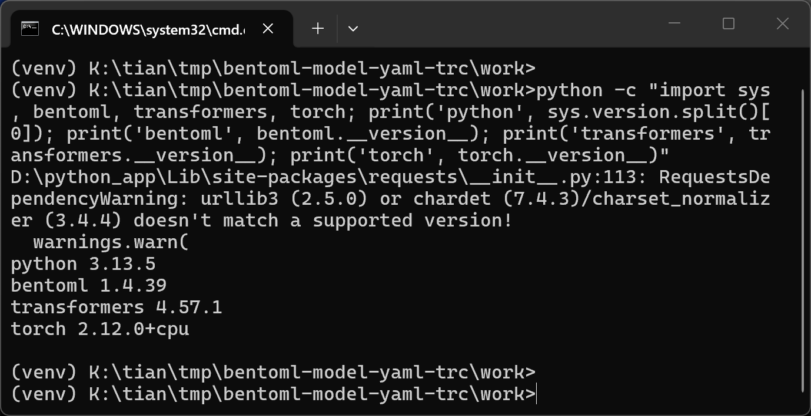
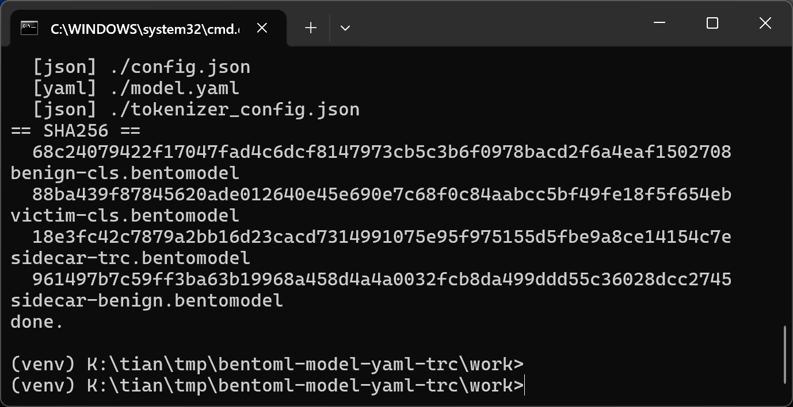
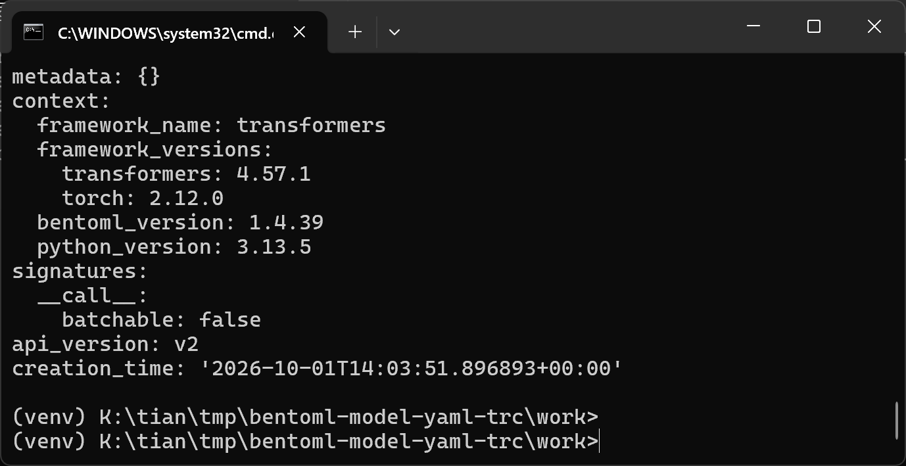
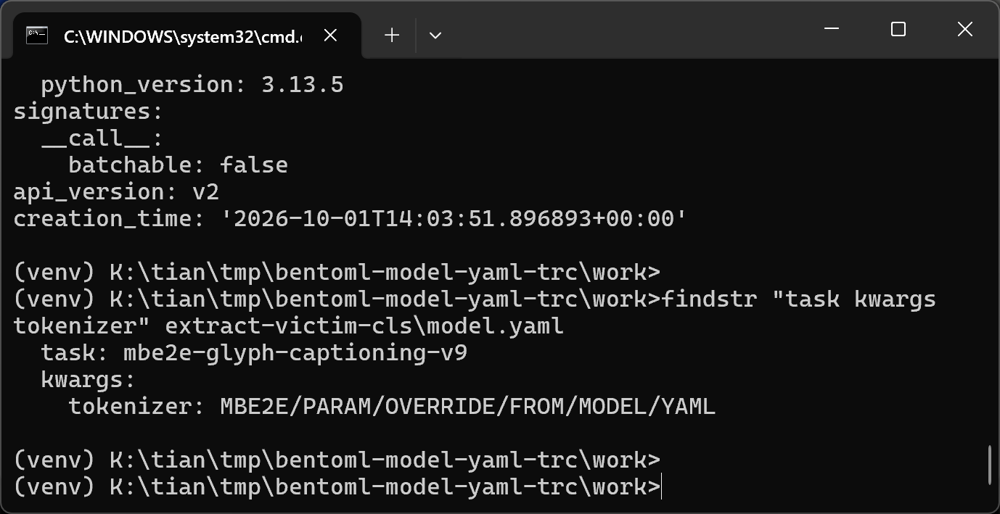
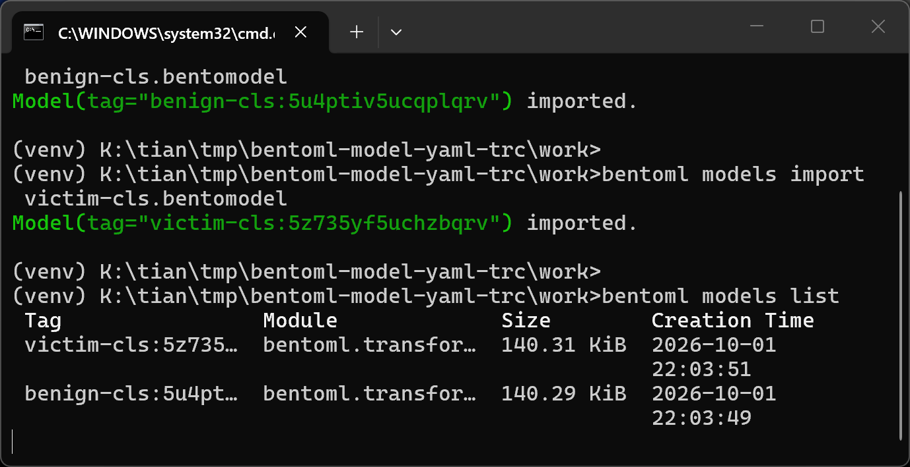
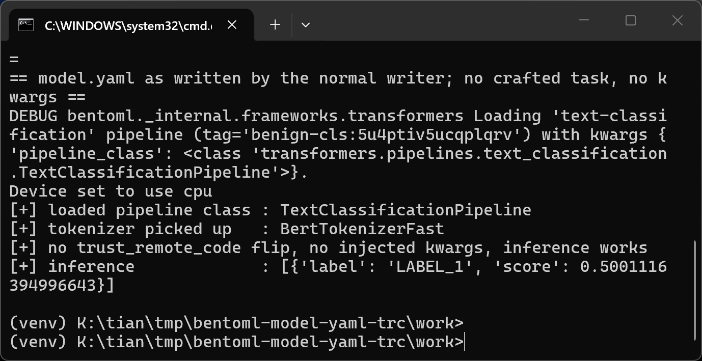
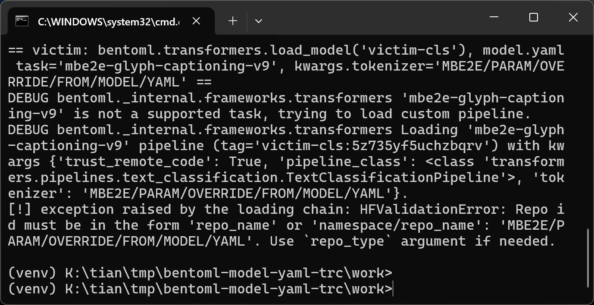
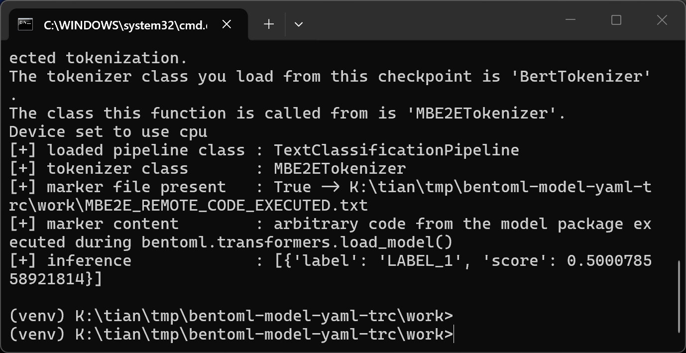
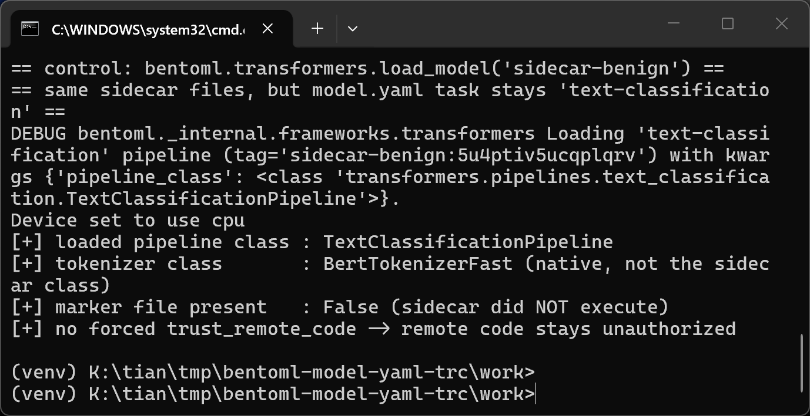

# BentoML 1.4.39 — Improper Access Control in `bentoml.transformers` Model Loading: Crafted `model.yaml` Forces `trust_remote_code=True` and Injects `pipeline()` Arguments

## Summary

BentoML 1.4.39 is affected by an improper access control flaw in the Transformers model loading path (`bentoml.transformers.load_model`). When a model package's `model.yaml` metadata declares a Transformers `task` that is not in the pipeline registry, BentoML sets `kwargs["trust_remote_code"] = True` on behalf of the calling application, and then merges the attacker-controlled `options.kwargs` from the same `model.yaml` into the arguments of `transformers.pipeline()`. A model package can therefore silently flip the remote-code-execution authorization that Transformers normally requires the *user* to opt into, and control how the pipeline is constructed. When the package additionally ships a dynamic-module sidecar (`tokenization_*.py` referenced by `auto_map`), the forced flag causes that Python file to be imported and executed during `load_model()` — arbitrary code execution with the privileges of the process loading the model. The finding does not depend on the `pipeline.v2.pkl` cloudpickle file: the pickle in the proof of concept is the untouched file BentoML itself generates, and the core parameter-override sample contains no attacker-controlled `.py` file at all.

## Affected Product

| Field | Value |
|---|---|
| Vendor | bentoml.com (BentoML project) |
| Product | BentoML |
| Affected versions | Verified on git commit `517b343b81ae` (main, 2026-09-07, whose `src/bentoml/_internal/frameworks/transformers.py` is byte-identical to release `v1.4.39`) and on release `v1.4.39`; the same vulnerable logic is present in `v1.2.0`, so all releases with the `api_version: v2` Transformers path are affected (at least 1.2.0 through 1.4.39 and current main) |
| Component | `src/bentoml/_internal/frameworks/transformers.py`, function `load_model()` (v2 branch, lines 485–522) |
| Platform | Any platform running BentoML with the `transformers` extra (verified on Windows, Python 3.13.5, transformers 4.57.1, torch 2.12.0+cpu) |
| Vulnerability type | CWE-284: Improper Access Control (leads to CWE-94: Code Injection / arbitrary code execution) |

## Root Cause

**Location:** `src/bentoml/_internal/frameworks/transformers.py:485-522` (`load_model`, v2 branch)

BentoML stores per-model options — including the Transformers `task` and a free-form `kwargs` dictionary — in the model store metadata file `model.yaml`, which is read with `yaml.safe_load` (`src/bentoml/_internal/models/model.py:640`) and reaches `load_model()` as `bento_model.info.options`. Anything inside an imported `.bentomodel` archive therefore fully controls these values. `load_model()` then treats them as authorization and construction input:

```python
if task not in get_supported_tasks():
    logger.debug(
        "'%s' is not a supported task, trying to load custom pipeline.",
        task,
    )

    register_pipeline(
        task,
        pipeline_class,
        tuple(
            convert_to_autoclass(auto_class) for auto_class in options.pt
        ),
        tuple(
            convert_to_autoclass(auto_class) for auto_class in options.tf
        ),
        options.default,
        options.type,
    )
    kwargs["trust_remote_code"] = True

kwargs.setdefault("pipeline_class", pipeline_class)

assert task in get_supported_tasks(), (...)

kwargs.update(options.kwargs)
if len(kwargs) > 0:
    logger.debug(
        "Loading '%s' pipeline (tag='%s') with kwargs %s.",
        task,
        bento_model.tag,
        kwargs,
    )
try:
    return transformers.pipeline(
        task=task, model=bento_model.path, **kwargs
    )
```

There are two distinct defects:

1. **Authorization decided by the package, not the user.** The decision to enable `trust_remote_code` — the explicit "I read the remote code and I trust it" consent that Hugging Face requires — is derived from `task`, a value that comes from the model package itself. The caller of `load_model()` is never consulted; the code sets `trust_remote_code = True` on their behalf whenever the package declares an unsupported task name. The same pattern exists in the v1 branch at `transformers.py:432-434`.
2. **Attacker-controlled arguments merged over caller arguments.** `kwargs.update(options.kwargs)` (line 511) merges the package's `options.kwargs` into the pipeline arguments *after* the caller's arguments, so the package can also override anything the loading application explicitly passed (e.g. `tokenizer`, `feature_extractor`, `device`, `model_kwargs`, `pipeline_class`). All of it is forwarded to `transformers.pipeline()` at line 520.

The `trust_remote_code=True` flag is honored by `transformers.pipeline()` for both the model and the tokenizer/feature-extractor auto classes. With `auto_map` entries present in the package's `config.json` / `tokenizer_config.json`, Transformers resolves them through its dynamic-module loader, which imports the referenced Python file from the package — executing attacker code inside the victim process. No modification of `pipeline.v2.pkl` is involved; the vulnerable input is plain YAML metadata.

## Proof of Concept

### Prerequisites

- BentoML with the Transformers framework support (`pip install bentoml transformers`); no GPU, no network access to Hugging Face is required for the core sample.
- The victim imports a model package produced by the attacker (`bentoml models import crafted.bentomodel`) and loads it via `bentoml.transformers.load_model(...)` — the standard consumption path for a `.bentomodel` shared through a model registry, an internal hub, or a colleague.

### Steps to Reproduce

1. Build a tiny, harmless text-classification pipeline with a synthetic BERT model and save it with BentoML's normal writer (`bentoml.transformers.save_model`), then export it (`bentoml.models.export_model`). This produces a legitimate archive containing `config.json`, `model.safetensors`, `model.yaml`, `pipeline.v2.pkl`, tokenizer files and `vocab.txt`. The environment used for this report:



2. Craft the package by editing **only** `model.yaml` inside the archive: set `options.task` to an unsupported name (`mbe2e-glyph-captioning-v9`) and put an attacker-chosen `tokenizer` value into `options.kwargs`. The archive still contains no attacker-controlled `.py` file and the original BentoML-generated `pipeline.v2.pkl`:



3. The crafted `model.yaml` inside the shipped archive — full metadata tail (context shows the versions and the `api_version: v2` pipeline path) and, focused with `findstr`, the two attacker-controlled fields `options.task` and `options.kwargs`:





4. From the victim side, import the benign archive and the crafted archive into a clean model store (`bentoml models import` accepts both without any warning):



5. Negative control — loading the untampered package works normally: no `trust_remote_code` is set, no kwargs are injected, the tokenizer comes from the model directory:



6. Load the crafted package. BentoML's debug log shows the package-controlled task name triggering the custom-pipeline branch, `trust_remote_code: True` being set by BentoML itself, and the attacker's `tokenizer` value entering the pipeline arguments; `transformers.pipeline()` then fails on the attacker-chosen string, proving it reached the Transformers API as an argument:



7. Authorization consequence — a second sample adds `tokenization_mbe2e.py` plus `auto_map` entries to the same package (this sample has a sidecar; the core sample above does not). With the crafted task name, the forced `trust_remote_code=True` makes Transformers import the sidecar: the module-level code lands a marker file in the victim's working directory and the pipeline comes up with the attacker's tokenizer class:



8. Control for step 7 — the identical archive with `task` left at the supported `text-classification`: the sidecar does not execute, the native tokenizer is used, and no marker file appears. The crafted `task` field is what flips the authorization:



### Expected vs Actual

- Expected: `bentoml.transformers.load_model()` must not enable `trust_remote_code` or accept construction arguments from untrusted package metadata; an unsupported `task` should be rejected (fail closed), and `options.kwargs` should never override the caller's arguments or security-relevant flags.
- Actual: BentoML sets `trust_remote_code=True` because the package said so, passes the package's `options.kwargs` into `transformers.pipeline()` (overriding caller arguments), and the pipeline then honors `auto_map` dynamic modules from the same package — executing the package's Python code in the victim process.

### Sanitized PoC input

```text
# the only attacker-controlled bytes in the core sample (inside model.yaml of the .bentomodel archive)
options:
  task: mbe2e-glyph-captioning-v9
  kwargs:
    tokenizer: MBE2E/PARAM/OVERRIDE/FROM/MODEL/YAML

# additionally, in the sidecar sample (tokenization_mbe2e.py shipped in the same archive)
tokenizer_config.json:
  "auto_map": { "AutoTokenizer": ["tokenization_mbe2e.MBE2ETokenizer", null] }
```

## Impact

- Confidentiality: High — arbitrary Python execution inside the process that loads the model allows reading anything that process can access (model weights, credentials in environment variables, service keys).
- Integrity: High — executed code can modify files, the model store, and downstream systems reachable from the process.
- Availability: High — executed code can crash or corrupt the serving process.
- Scope: code execution in the consuming application; the authorization decision Transformers deliberately leaves to the user is made by the attacker-supplied package instead.

## Remediation

- Do not derive `trust_remote_code` from package metadata. Remove the `kwargs["trust_remote_code"] = True` at `src/bentoml/_internal/frameworks/transformers.py:503` (and the v1-branch equivalent at line 434); if loading genuinely custom pipelines must keep working, require the *calling application* to pass an explicit opt-in argument (e.g. `load_model(..., allow_custom_pipeline=True)`), and log a prominent warning.
- Reject unsupported `task` values (fail closed) instead of registering attacker-named pipelines into the global Transformers registry — registering a crafted task also mutates process-global state shared with all subsequently loaded models.
- Treat `options.kwargs` as data, not as pipeline arguments: never `update()` caller kwargs with them, and refuse to load a model whose stored `kwargs` shadow security-relevant arguments (`trust_remote_code`, `pipeline_class`, `model_kwargs`, `config`, `device_map`, `revision`, `tokenizer`, `feature_extractor`).
- Document that `.bentomodel` archives must only be imported from trusted sources, until a signature/integrity mechanism exists.


## References

- Source repository: https://github.com/bentoml/BentoML
- Affected source (pinned commit): https://github.com/bentoml/BentoML/blob/517b343b81ae/src/bentoml/_internal/frameworks/transformers.py
- Vendor security policy: https://github.com/bentoml/BentoML/blob/main/SECURITY.md
- CWE-284: https://cwe.mitre.org/data/definitions/284.html
- Hugging Face remote code documentation: https://huggingface.co/docs/transformers/main/en/security

