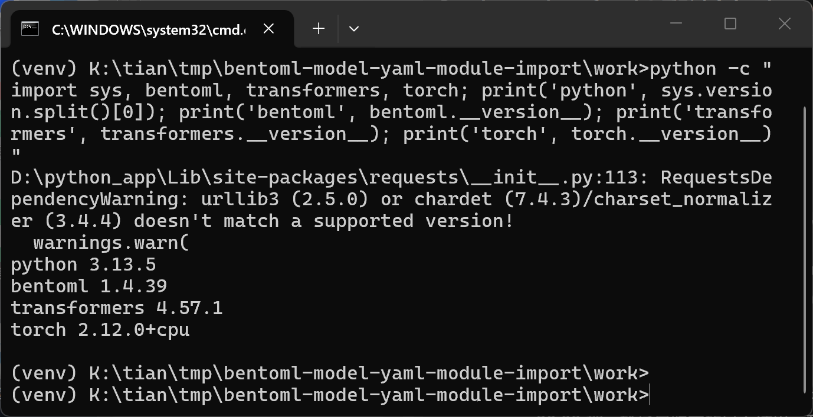
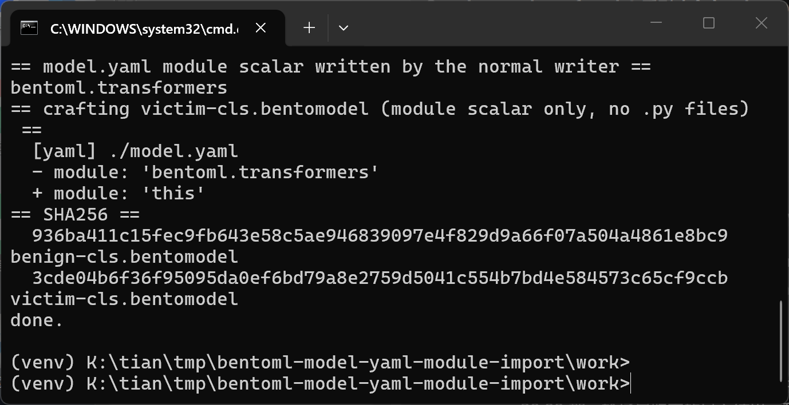
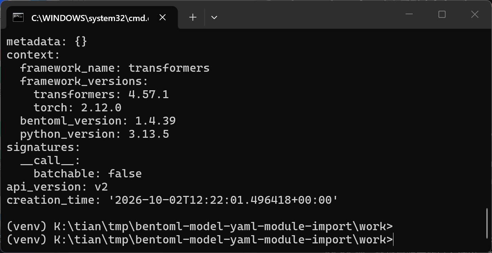
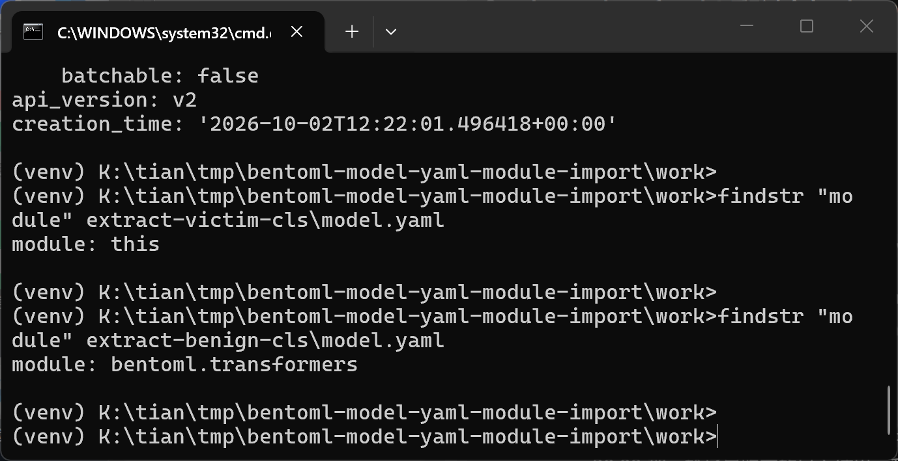
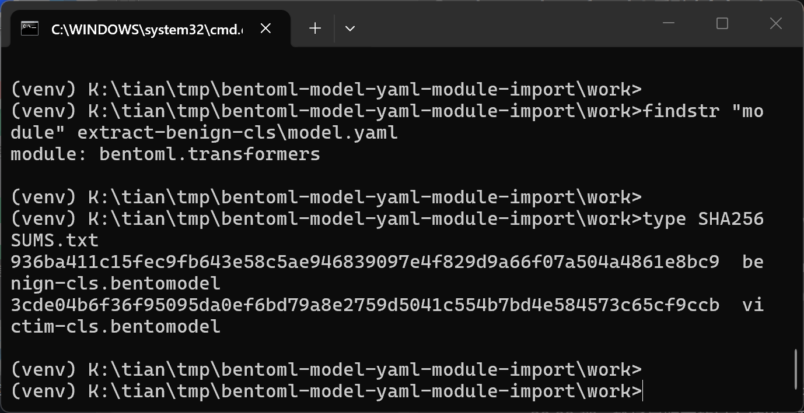
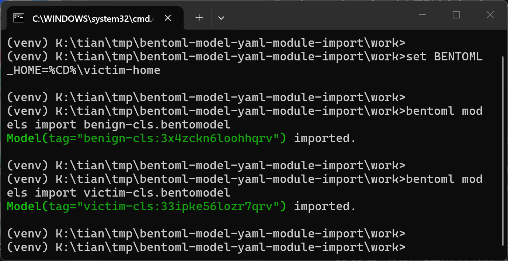
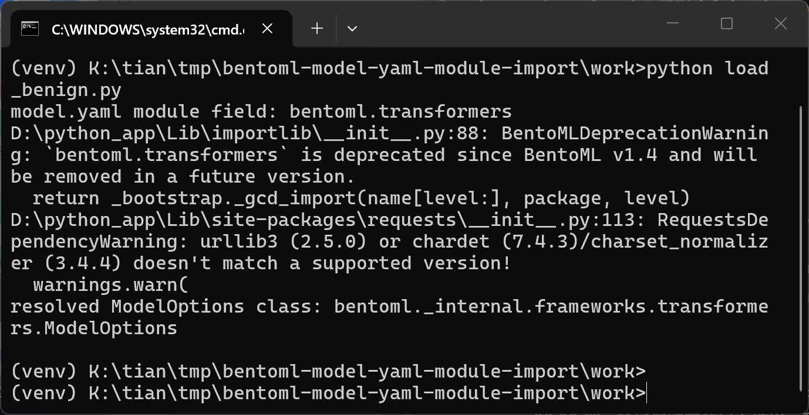

# BentoML model.yaml module Field Imports Arbitrary Installed Modules Without Whitelist (Unsafe Reflection)

## Summary

BentoML (bentoml/BentoML) is affected by an unsafe-reflection vulnerability in the model-store loading path. The `module` field of a model package's `model.yaml` is a plain, package-controlled string that `ModelInfo.imported_module` passes directly to `importlib.import_module` without any framework whitelist or cross-check against the package's declared context. When a consumer of the model accesses its info/options (or triggers any loader path), the module named by the package producer is imported into the consuming process and its module-level code executes, and the same value silently decides which `ModelOptions` class and loader handle the model afterwards. A crafted `.bentomodel` archive that differs from a normally produced one by a single YAML scalar (`module: bentoml.transformers` → `module: this`) makes the Python interpreter execute the `this` module — printing `The Zen of Python, by Tim Peters` inside the model-consumer process. Whenever the victim environment contains an importable module under an attacker-chosen name (dependency confusion, typosquatting, compromised registry or shared CI image), this becomes arbitrary code execution with the privileges of the consuming service.

## Affected Product

| Field | Value |
|---|---|
| Vendor | bentoml (bentoml/BentoML) |
| Product | BentoML |
| Affected versions | git commit `517b343b81aeb0b01bbd908e58e53ad9c12ef7eb` (main, 2026-09-07); the same unvalidated `import_module(self.module)` call is present in current main (`src/bentoml/_internal/models/model.py:601`), in the latest release v1.4.39, in v1.4.12 (line 623) and in v1.2.0 (line 614) — at least 1.2.0 through 1.4.39 and current main |
| Component | `src/bentoml/_internal/models/model.py`, `ModelInfo.imported_module` property (lines 592-608), reached from `ModelInfo.options` (610-623), `Model.with_options`, `Model.to_runnable` and framework `load_model` |
| Platform | OS-independent (any Python environment consuming `.bentomodel` model packages); verified on Windows 11, Python 3.13.5 |
| Vulnerability type | CWE-470: Use of Externally-Controlled Input to Select Classes or Code ('Unsafe Reflection') |

## Root Cause

**Location:** `src/bentoml/_internal/models/model.py:592-608` (`ModelInfo.imported_module`), at commit `517b343b81ae` and identically on current main.

The `module` field originates from `model.yaml` inside the model store / `.bentomodel` archive. It is parsed with `yaml.safe_load` in `ModelInfo.from_yaml_file` (`model.py:638-666`) and structured into the `ModelInfo` dataclass with no validation of the string. The `imported_module` property then feeds it straight into the import system:

```python
@property
def imported_module(self) -> ModuleType:
    if self._cached_module is None:
        if not self.module:
            raise BentoMLException(...)
        try:
            object.__setattr__(
                self, "_cached_module", importlib.import_module(self.module)
            )
        except (ValueError, ModuleNotFoundError) as e:
            raise BentoMLException(
                f"Module '{self.module}' defined in model.yaml is not found."
            ) from e
    assert self._cached_module is not None
    return self._cached_module
```

The only filtering is the `except (ValueError, ModuleNotFoundError)` around the call, which converts "module not found" into a `BentoMLException`. There is no check that the value is a BentoML framework module (`bentoml.<framework>`), no comparison with `context.framework_name` stored in the same YAML file, and no allowlist of any kind. The import itself is the side effect: whatever top-level code the named module carries runs in the importing (victim) process. The `options` property (`model.py:610-623`) then checks `hasattr(self.imported_module, "ModelOptions")` and falls back to the base `ModelOptions` when absent, so the single scalar also decides which options class and loader chain the model gets — a deterministic integrity effect even when the imported module is benign.

The property is reached from every normal consumption path: `ModelInfo.options`, `Model.with_options`, `Model.to_runnable` (`model.py:353`, `self.info.imported_module.get_runnable(self)`) and every framework's `load_model`. Any service, CI job or registry tooling that resolves model info therefore triggers the import of the package-chosen module.

## Proof of Concept

### Prerequisites

- bentoml built from source at commit `517b343b81ae` (the vulnerable function is identical in v1.4.39 and current main), transformers 4.57.1, torch 2.12.0+cpu, Python 3.13.5.
- The victim imports a `.bentomodel` package into their model store and then resolves the model's info/options — the standard flow of any model registry consumer, CI loader or Bento service (`bentoml models import` + `bentoml.models.get(...).info.options` in the minimal reproduction).
- The Python environment contains an importable module under the name the attacker wrote into `module`. The proof of concept uses the stdlib module `this` (present in every Python installation; its import-time code prints the Zen of Python) so the demonstration is harmless and reproducible everywhere.

### Steps to Reproduce

1. Build the two archives with the normal writer: save a tiny offline Transformers text-classification pipeline twice via `bentoml.transformers.save_model(...)` and export both with `bentoml.models.export_model(...)` to `benign-cls.bentomodel` and `victim-cls.bentomodel`. The writer stores `module: bentoml.transformers` in both `model.yaml` files; the archives contain `config.json`, `model.safetensors`, `model.yaml`, `pipeline.v2.pkl` and the tokenizer files.





2. Rewrite `victim-cls.bentomodel` changing only the `module` scalar in its `model.yaml`: `bentoml.transformers` → `this`. No other field is modified and no file is added or removed — in particular the package ships no `.py` sidecar, because files inside the archive cannot be imported through this path and are not needed.







3. On the consumer side, with an empty `BENTOML_HOME`, import both packages: `bentoml models import benign-cls.bentomodel` and `bentoml models import victim-cls.bentomodel`. Both import silently — no warning distinguishes the crafted package from the genuine one.



4. Trigger the defect with the generic consumer script `load_victim_module.py` (attached; it imports no framework module itself): `model = bentoml.models.get("victim-cls")`, then `model.info.options`.


5. Negative control: run the identical consumer flow against the untouched archive (`load_benign.py`). The yaml-named module is `bentoml.transformers`, whose import only produces BentoML's own deprecation warning (which itself demonstrates that the yaml-named module is imported), and the resolved class is the framework's `bentoml._internal.frameworks.transformers.ModelOptions`. The only delta between the two runs is the single YAML scalar.



### Expected vs Actual

- Expected: a model package naming a module outside the BentoML framework set (or inconsistent with its own `context.framework_name: transformers`) is rejected before any import; only `bentoml.<framework>` modules may be imported.
- Actual: any importable module name in `sys.path` is imported into the consumer process when the model info/options are resolved; its top-level code executes (demonstrated with the Zen of Python) and the resolved `ModelOptions` class silently switches from the framework's class to the base class.

### Sanitized PoC input

```text
model.yaml (crafted package, one scalar changed from the writer output):
  name: victim-cls
  version: <auto>
  module: this            # was: bentoml.transformers
  labels: {}
  options: {...unchanged...}
  metadata: {}
  context:
    framework_name: transformers
    ...
Consumer trigger:
  import bentoml
  model = bentoml.models.get("victim-cls")
  opts = model.info.options   # importlib.import_module("this") runs here
```

## Impact

- Confidentiality: High — if the victim environment contains an attacker-influenced module under the chosen name (dependency confusion, typosquatting, compromised registry/CI image), its code runs inside the service and can exfiltrate anything the process can read (model weights, tokens, environment).
- Integrity: High — the imported module's code runs with the service's privileges; even without a hostile module present, the scalar deterministically redirects the loading path (demonstrated: framework `ModelOptions` replaced by the base class), so the package controls how the model is loaded and parsed.
- Availability: High — any module that raises at import time, or that changes options parsing, breaks every subsequent load of the model in the process.
- Scope: code execution in the model-consumer process (service, CI job, registry tooling); not memory corruption. The claim is deliberately bounded at the no-whitelist import verified end to end with the benign stdlib module `this`; local `.py` files shipped inside the archive cannot be imported through this path.

## Remediation

Validate `module` before any import: in `ModelInfo.imported_module` (and ideally already when structuring `ModelInfo.from_yaml_file`), require the value to be a known BentoML framework module — for example `module == f"bentoml.{context.framework_name}"` or membership in the registered framework module list — and reject everything else with `BentoMLException` before calling `importlib.import_module`. As defense in depth, `bentoml models import` can apply the same check when untarring an archive, so crafted packages are refused at the store boundary instead of being stored silently. The existing `ModuleNotFoundError` handling can stay; the whitelist check simply has to run first, because the import call itself is the side effect.

## References

- Source repository: https://github.com/bentoml/BentoML
- Verified commit: https://github.com/bentoml/BentoML/commit/517b343b81aeb0b01bbd908e58e53ad9c12ef7eb
- Vulnerable function on main: https://github.com/bentoml/BentoML/blob/main/src/bentoml/_internal/models/model.py (ModelInfo.imported_module)
- Upstream report: [pending publication — private disclosure per the repository SECURITY.md]
- CWE: https://cwe.mitre.org/data/definitions/470.html
- Vendor security policy: https://github.com/bentoml/BentoML/security/policy
