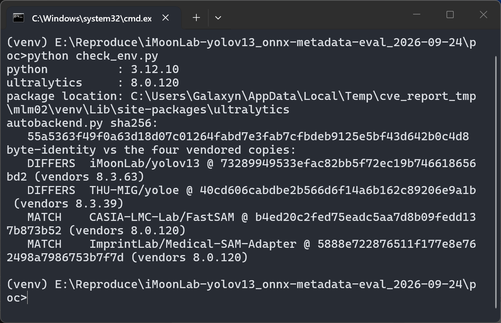
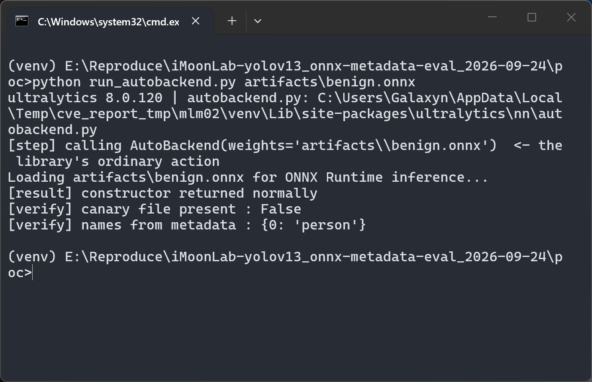
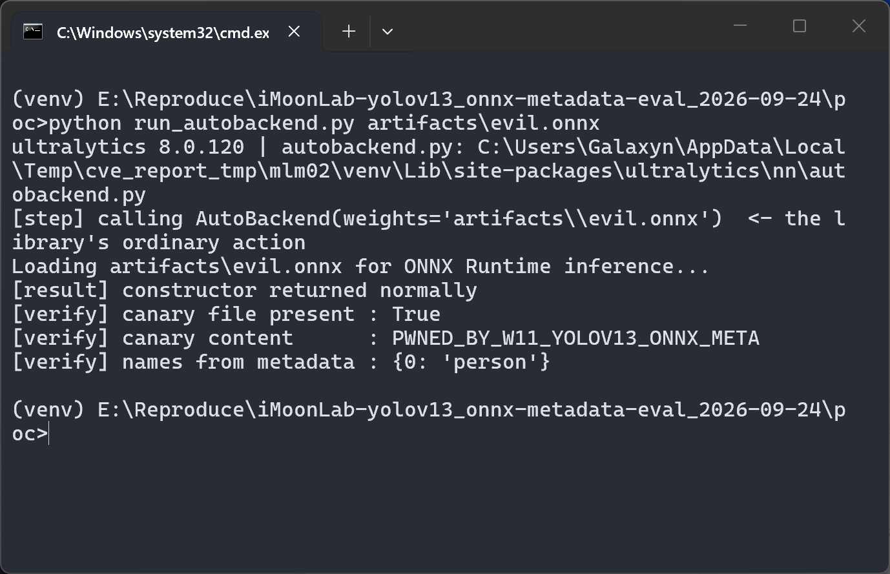
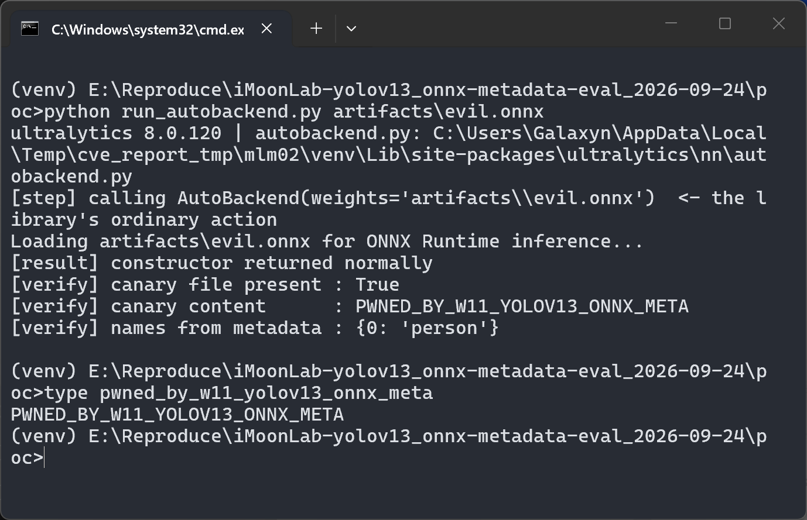

# CASIA-LMC-Lab/FastSAM — Eval Injection in bundled `ultralytics` `AutoBackend` (ONNX `metadata_props` → `eval()` at load time)

> **Status: n-day, already fixed upstream.** The defect was fixed publicly by `ultralytics/ultralytics`
> on 2025-12-01 (v8.3.234, PR #22847) and no CVE/GHSA has been assigned. This document is the English
> technical basis for a **synchronisation request** to `CASIA-LMC-Lab/FastSAM`, which still vendors a
> vulnerable copy — it is **not** a coordinated-disclosure report against upstream, and no CVE is being
> requested.

## Summary

`CASIA-LMC-Lab/FastSAM` vendors a copy of `ultralytics` **8.0.120**, older than the fixed **8.3.234**,
and therefore inherits `AutoBackend.__init__`, which parses the ONNX file's own `metadata_props` map and
passes three of its values (`imgsz`, `names`, `kpt_shape`) to `eval()`. Because that happens while the
model is being **loaded** — before any inference — an attacker who can supply a `.onnx` file obtains
arbitrary code execution in the victim's process. ONNX is commonly chosen precisely to avoid
pickle-based loading, so this path defeats that expectation.

## Affected Product and Version

| Field | Value |
|---|---|
| Vendor / Product | `CASIA-LMC-Lab` / `FastSAM` |
| Affected version | bundled `ultralytics` **8.0.120** at repository `HEAD` `b4ed20c2fed75eadc5aa7d8b09fedd137b873b52` (last push 2024-07-30; re-checked live 2026-09-29 — unchanged, no fix commit exists). Upstream affected range: `ultralytics` `v8.0.20` … `v8.3.233`, fixed from `v8.3.234` |
| Component | `ultralytics/nn/autobackend.py` — `AutoBackend.__init__` |
| Platform | CPython (any OS); reproducible on CPU, no GPU required |
| Vulnerability type | **CWE-95** Improper Neutralization of Directives in Dynamically Evaluated Code ("Eval Injection"), parent **CWE-94** (Code Injection); delivery channel **CWE-502** (untrusted model file treated as data); what applies to this copy today is **CWE-1395** (dependency on a vulnerable third-party component) |
| Verification level | **Execution of the byte-identical vendored file** (2026-09-29, library-constructor level, harmless sentinel + negative control); sibling copy `iMoonLab/yolov13` additionally driven end-to-end through the product CLI (E2, container) |

## Root Cause

`ultralytics/nn/autobackend.py` @ `CASIA-LMC-Lab/FastSAM` `b4ed20c` — source at **`:132`**, sink at
**`:278`**:

```python
# :132      SOURCE: the ONNX file's own string->string map, verbatim
metadata = session.get_modelmeta().custom_metadata_map
...
# :276-278
        if metadata and isinstance(metadata, dict):
            for k, v in metadata.items():
                ...
                    metadata[k] = eval(v)             # :278  SINK  (k in {"imgsz", "names", "kpt_shape"})
```

`metadata_props` is an arbitrary `string → string` map inside the `.onnx` protobuf. Whoever produces or
edits the file controls it completely; rewriting it needs no signing key, does not disturb the graph or
the weights, and the file still loads and infers normally. Between `:132` and `:278` there is **no
validation of any kind** — no allow-list, no regex, no restricted `__builtins__`, no `try/except`. The
key set is not a mitigation (it selects which values are evaluated; the value is never inspected), and
`check_class_names()` runs only after the sink, so it cannot un-run the evaluation. Nothing on the path
is opt-in: the sink is inside `AutoBackend.__init__`, before any inference call. The same file already
uses `ast.literal_eval` for its TFLite metadata branch — which is why the upstream fix is one line. A
second channel reaches the same loop: an external `metadata.yaml` sidecar next to the weights; that
branch was **not** executed end-to-end.

**Vendoring profile:** the vendored tree is nearly stock 8.0.120 — a git blob-SHA comparison against
upstream tag v8.0.120 (2026-09-24) shows 159 of 161 package files byte-identical, 1 file modified
(`yolo/utils/ops.py`). `nn/autobackend.py` — the file containing the sink — is byte-identical to
upstream v8.0.120, so the upstream one-line fix applies verbatim. (The PyPI project named `fastsam` is
an unrelated `0.0.1.dev0` placeholder by another author and is not this repository; there is no
package-level fix path here.)

## Proof of Concept

### Prerequisites

- The repository's vendored sources at `HEAD` `b4ed20c` (no edits)
- Python 3.12 venv with the official PyPI `ultralytics==8.0.120` wheel — its `nn/autobackend.py` is
  **byte-identical** to this repository's vendored file (sha256 `55a5363f49f0a63d18d07c01264fabd7e3fab7cfbdeb9125e5bf43d642b0c4d8`,
  verified against the GitHub raw file at `HEAD` on 2026-09-29)
- No GPU; no third-party model is downloaded — the `.onnx` is generated locally with the official ONNX writer API

### Steps to Reproduce

1. Build a minimal `.onnx` (a valid YOLO-shaped graph) whose `metadata_props` carries a harmless
   sentinel expression for `names` — it writes one inert marker file and returns a valid class dict.
   Generator: `poc/make_poc.py` (artifacts in `poc/artifacts/`, hashes in `poc/artifacts/SHA256SUMS`).



*`check_env.py` shows the active copy is `ultralytics 8.0.120` and hashes its `nn/autobackend.py` to `55a5363f…` — **MATCH** with the files `CASIA-LMC-Lab/FastSAM` and `ImprintLab/Medical-SAM-Adapter` vendor at their `HEAD`s (the other two repositories' copies DIFFER at this phase). Collected 2026-09-29.*

2. Load the artifacts through the vendored code path: `AutoBackend(weights="artifacts/benign.onnx")`
   (negative control), then `AutoBackend(weights="artifacts/evil.onnx")` (attack).



*8.0.120 `AutoBackend` on the benign artifact: constructor returns normally, `names` parses to a valid dict, **canary file present: False**.*



*8.0.120 `AutoBackend` on the attack artifact: **canary file present: True**, content `PWNED_BY_W11_YOLOV13_ONNX_META`, and `names` still comes back as a perfectly valid `{0: 'person'}`. The marker can only have been written by `eval()` of the metadata string at `:278`.*

3. Read the marker file back from disk.



*`type pwned_by_w11_yolov13_onnx_meta` prints `PWNED_BY_W11_YOLOV13_ONNX_META`. Version swap for this phase: `screenshots/15-swap-8.0.120.png` shows `pip show ultralytics` → Version 8.0.120.*

### Expected vs Actual

- Expected: `metadata_props` is inert data; `imgsz`/`names`/`kpt_shape` are parsed, not executed
- Actual: the stored strings are evaluated with unrestricted builtins; the sentinel's side effect
  (marker file) appears during construction — before any inference — and the load completes normally

### Sanitized PoC input

```text
.onnx with metadata_props:
  stride = "32", task = "detect", batch = "1", imgsz = "[640, 640]"
  names  = "(<harmless marker-write expression>, {0: 'person'})[1]"   # the attack
  names  = "{0: 'person'}"                                            # negative control A
  (no custom metadata at all)                                          # negative control B
```

No exploit string is inlined in this document. The sentinels are deliberately harmless — no network,
no shell, no download, no persistence, no process spawn. The reproduction kit (`poc/make_poc.py`,
`poc/run_autobackend.py`, `poc/check_env.py`) accompanies this report.

### Provenance (stated honestly)

- **Code-level:** source and sink lines re-read live at `HEAD` `b4ed20c` on 2026-09-29 (unchanged since the 2026-09-18 audit).
- **Execution-level (this report's screenshots, 2026-09-29):** Windows host, Python 3.12.10 venv, CPU. What was executed is the **official PyPI 8.0.120 wheel**, whose `autobackend.py` is byte-identical (sha256-verified) to the file this repository vendors — i.e. the exact sink bytes ran, at library-constructor level (`AutoBackend(weights=…)`), not this repository's full application.
- **Sibling end-to-end (corpus, 2026-09-20):** `iMoonLab/yolov13` (same lineage, 8.3.63) was driven through the product's own `yolo predict` CLI inside an air-gapped Linux container — benign/nometa → no marker, attack → marker, all exit 0 (grade `E2_product_e2e`).
- The external-YAML channel was never executed end-to-end.

## Impact

Loading an untrusted `.onnx` — the library's normal documented action — executes attacker-chosen Python
in the loading process, with the module's globals and unrestricted builtins.

- **Confidentiality: High** — everything the process can read (datasets, checkpoints, hub tokens, cloud credentials)
- **Integrity: High** — the same reach for writing (model files, checkpoints, training data, source tree)
- **Availability: High** — the evaluated expression can terminate, hang or wipe what it can write
- **Scope: Unchanged** — execution inside the loading Python process under its own privileges

## Attack Vector and Severity (CVSS v3.1)

```
Score: 7.8 (High)
Vector: CVSS:3.1/AV:L/AC:L/PR:N/UI:R/S:U/C:H/I:H/A:H
```

| Metric | Value | Rationale |
|---|---|---|
| Attack Vector | **L** | Carried by a file the victim's process opens — the CVSS "victim opens an attacker-supplied file" pattern |
| Attack Complexity | **L** | Deterministic: a fixed string is evaluated on every load |
| Privileges Required | **N** | Only the ability to make the file available (hub upload, shared mount, artifact) |
| User Interaction | **R** | Someone must load the model — the exact action the library exists to perform |
| Scope | **U** | Execution inside the loading process itself |
| C / I / A | **H / H / H** | Unrestricted `eval` with usable `__import__`, demonstrated by the sentinel |

Documented alternative: a scorer who treats "the component retrieves the malicious artifact over the
network" as network-borne would use `AV:N` → **8.8**. Only `AV` moves; the headline is 7.8 with the
variant documented.

## Remediation

Sync the vendored `ultralytics` to **≥ 8.3.234**, or cherry-pick `265b92fa084e05f54eb5d2dc18eafcd056e23457`.
FastSAM vendors 8.0.120, several hundred lines adrift from current upstream, so the cherry-pick is the
practical route. The one-liner applies at `ultralytics/nn/autobackend.py:278` (`ast` is already imported
in that file):

```python
-                    metadata[k] = eval(v)
+                    metadata[k] = ast.literal_eval(v)
```

Optional hardening beyond the one-liner: fail soft (`try/except` with defaults + warning); validate the
parsed structure (`imgsz` → 1–2 positive ints, `kpt_shape` → exactly 2 positive ints, `names` → bounded
`dict[int, str]`); apply the same handling to the external-YAML branch; document that loading a model
from an untrusted source equals running its author's code — for `.onnx` as well as `.pt`.

**For upstream `ultralytics/ultralytics`:** nothing to do — already fixed in 8.3.234. Do not open an
issue there.

## Timeline

| Date | Event |
|---|---|
| 2025-12-01 | Upstream fix released — `265b92fa`, PR #22847, v8.3.234 |
| 2026-09-18 | Local report and D2 reproduction completed; `CASIA-LMC-Lab/FastSAM` confirmed unsynced at `HEAD` |
| 2026-09-24 | Live re-check: `HEAD` unchanged, no `SECURITY.md`, private reporting disabled; synchronisation material prepared |
| 2026-09-29 | Re-check: `HEAD` still `b4ed20c`; the byte-identical vendored file executed live (harmless sentinel + negative control); real-terminal screenshots collected |
| [pending] | Maintainer notified (public issue) |
| [pending] | Fix synced downstream |

> This is an n-day: there is no embargo to keep, because the fix, its diff and its release note have all
> been public since 2025-12-01.

## References

- Upstream fix: <https://github.com/ultralytics/ultralytics/pull/22847> · commit `265b92fa084e05f54eb5d2dc18eafcd056e23457` · release v8.3.234 (2025-12-01T23:54:22Z)
- Affected copy: `CASIA-LMC-Lab/FastSAM` @ `b4ed20c2fed75eadc5aa7d8b09fedd137b873b52` — `ultralytics/nn/autobackend.py:132 → :278` (lines re-verified live 2026-09-29); permanent link: <https://github.com/CASIA-LMC-Lab/FastSAM/blob/b4ed20c2fed75eadc5aa7d8b09fedd137b873b52/ultralytics/nn/autobackend.py#L278>
- CWE: <https://cwe.mitre.org/data/definitions/95.html> · <https://cwe.mitre.org/data/definitions/502.html>
- Vendor advisory: **none** — no CVE, no GHSA and no repository advisory exists for this defect (checked 2026-09-18, 2026-09-24 and 2026-09-29)

## Disclaimer

This document is provided for defensive and coordination purposes. It contains no ready-to-run exploit
beyond the minimum reproduction information, and no sensitive infrastructure details. The defect it
describes is already public and already fixed upstream; the only outstanding action here is a version
synchronisation in this repository.

## Screenshot Checklist

Collected **2026-09-29** on the reporting machine (Windows 11 host, Python 3.12.10 venv, CPU-only).
Environment proof is on-screen in the `check_env` shot. The same 8.0.120 execution also covers
`ImprintLab/Medical-SAM-Adapter`, whose vendored `autobackend.py` is byte-identical (same sha256).

| file | content |
|---|---|
| `15-swap-8.0.120.png` | `pip show ultralytics` → **Version 8.0.120** active for this phase |
| `16-fastsam-msa-hash-proof-8.0.120.png` | `check_env.py`: installed `nn/autobackend.py` sha256 `55a5363f…` == the file `CASIA-LMC-Lab/FastSAM` vendors at `HEAD` (**MATCH**) |
| `17-fastsam-msa-benign-control.png` | 8.0.120 `AutoBackend(benign.onnx)` → canary **False**, `names` valid (negative control) |
| `18-fastsam-msa-evil-run.png` | 8.0.120 `AutoBackend(evil.onnx)` → canary **True**, content `PWNED_BY_W11_YOLOV13_ONNX_META` |
| `19-fastsam-msa-canary-landed.png` | `type` reads the marker file back from disk |
