# DeepPavlov 1.7.0 — Code Injection in Config Reference Resolver

## Summary

DeepPavlov 1.7.0 (and current master) is affected by a code injection in the configuration reference resolver (`resolve()` in `deeppavlov/core/common/params.py`). Any string value in a model configuration file that starts with `#` is treated as a component reference expression and evaluated with the unrestricted Python built-in `eval()`, so a crafted model config executes arbitrary Python code with the privileges of the user running any DeepPavlov command that builds a model (`deeppavlov predict`, `train`, `interact`, `riseapi`, ...). The payload does not require any custom code inside the model package: it reaches `eval()` through the `__globals__` of an already-registered component, and can return an ordinary value (e.g. `True`) so the rest of the pipeline keeps working and the execution stays silent.

## Affected Product

| Field | Value |
|---|---|
| Vendor | DeepPavlov (Neural Networks and Deep Learning Lab, MIPT) |
| Product | DeepPavlov |
| Affected versions | <= 1.7.0 (latest release on PyPI) and current master; verified on git commit 5f9fbed0c7191466bc7621e604b810f66f254c03 (2024-11-26, `_meta.py` reports `1.7.0`); unfixed as of 2026-10-02 |
| Component | `deeppavlov/core/common/params.py`, function `resolve()` (lines 30-42), called from `from_params()` for every value of every chainer pipe component config |
| Platform | Any OS supported by DeepPavlov (verified on Ubuntu 24.04, Python 3.12.3); pure Python issue, no build flags involved |
| Vulnerability type | CWE-94: Code Injection |

## Root Cause

**Location:** `deeppavlov/core/common/params.py:30-42` (`resolve`), reached from `from_params()` at `deeppavlov/core/common/params.py:61` and `build_model()` at `deeppavlov/core/commands/infer.py:47`.

DeepPavlov model configs declare a chainer pipeline whose components are built sequentially. A component can carry an `id`, and every other component's config values are passed through `resolve()`. A value that is a string starting with `#` is interpreted as `#<component-id>.<attribute.path>`: the resolver looks the component up in the module-level `_refs` dict, then — instead of walking the remaining dotted path with `getattr()` — joins the path back into a single string and hands it to `eval()`:

```python
def resolve(val):
    if isinstance(val, str) and val.startswith('#'):
        component_id, *attributes = val[1:].split('.')
        try:
            val = _refs[component_id]
        except KeyError:
            e = ConfigError('Component with id "{id}" was referenced but not initialized'
                            .format(id=component_id))
            log.exception(e)
            raise e
        attributes = ['val'] + attributes
        val = eval('.'.join(attributes))  # unrestricted eval of an attacker-controlled expression
    return val
```

The input is attacker-controlled because model configuration files are ordinary JSON files that are routinely shared (project repos, model hubs, tutorials, notebooks). The string after the `#` prefix is split on `.` only for the purpose of locating the referenced component id, and is then re-joined verbatim, so the full Python expression syntax (subscripts, calls, operators) survives into `eval()`. Since `eval()` uses the resolver's module globals with builtins attached, the payload only needs one already-built component instance to reach `__init__.__globals__['__builtins__']['__import__']` — no `.py` file, pickle, plugin or `class_name` trick is needed in the model package. The configuration for the referenced component itself is completely normal (`split_tokenizer` in the PoC below).

`from_params()` (line 61) applies `resolve()` to every top-level value of every pipe component's config, so any ordinary string parameter of any registered component is a delivery field for the payload. The payload expression ends with `and True`, so the config field receives the plain boolean it pretends to be, the component is constructed normally, and inference proceeds without any error or log line.

## Proof of Concept

### Prerequisites

- Python 3 with `deeppavlov` 1.7.0 installed (`pip show deeppavlov` reports 1.7.0); verified on Ubuntu 24.04 (WSL2), Python 3.12.3, using the pinned source of commit `5f9fbed0c7191466bc7621e604b810f66f254c03`.
- The target directory used by the demo payload (`/out`) must exist and be writable by the user; the payload in a real attack would of course target any path or network endpoint reachable by the victim.
- The victim only needs to run a DeepPavlov command that builds a model from the crafted config — here `python -m deeppavlov predict evil.json -f input.txt`.
- No model weights, no custom code files, no pickles and no plugins are involved: the model directory contains only two JSON configs, one text input and `make_poc.py`.

### Steps to Reproduce

1. Generate the samples with the attached `make_poc.py`: it writes `evil.json` (payload), `benign.json` (control, identical except the attack field is the literal boolean `true`), `input.txt` and `SHA256SUMS.txt`.

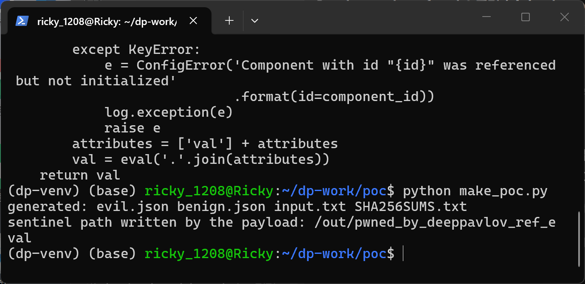

2. Inspect the malicious config. Its first pipe component is a perfectly normal `split_tokenizer` registered under `id: tok`; the second component (`sanitizer`) has an ordinary boolean parameter `diacritical` whose value is a string starting with `#tok.`:

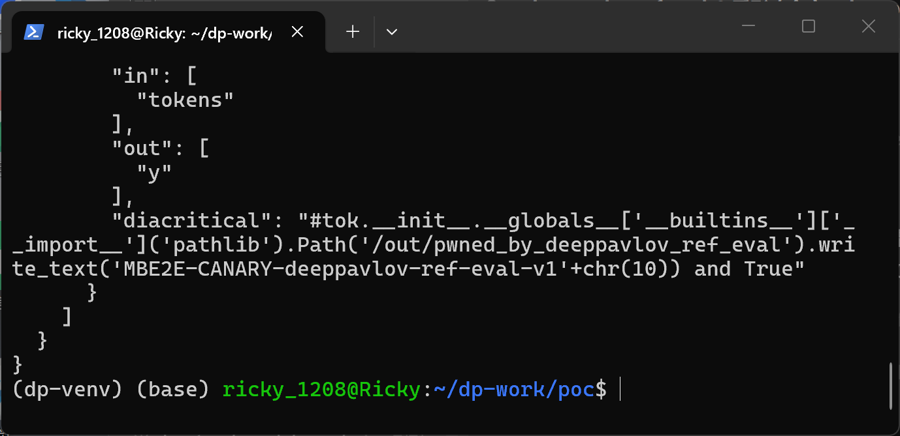

The complete config is:

```json
{
  "chainer": {
    "in": ["x"],
    "out": ["y"],
    "pipe": [
      {"id": "tok", "class_name": "split_tokenizer", "in": ["x"], "out": ["tokens"]},
      {"class_name": "sanitizer", "in": ["tokens"], "out": ["y"],
       "diacritical": "#tok.__init__.__globals__['__builtins__']['__import__']('pathlib').Path('/out/pwned_by_deeppavlov_ref_eval').write_text('MBE2E-CANARY-deeppavlov-ref-eval-v1'+chr(10)) and True"}
    ]
  }
}
```

3. Confirm the output directory is empty before the run, so any file appearing afterwards can only come from the config:

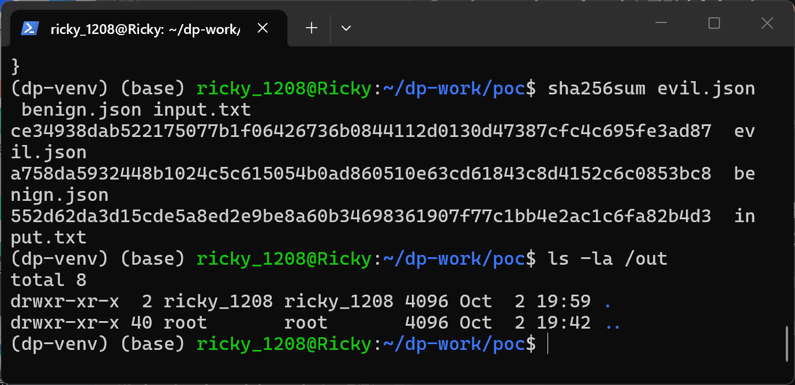

4. Run the official CLI on the malicious config:

```text
python -m deeppavlov predict evil.json -f input.txt
```

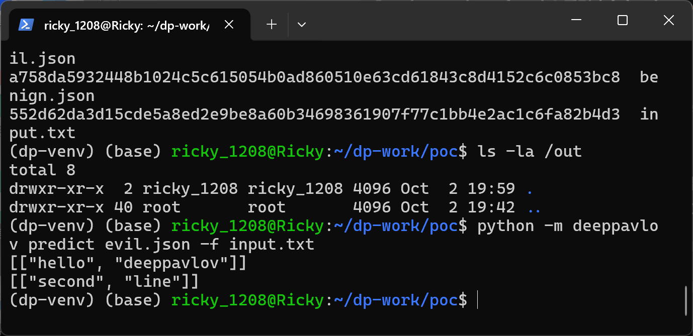

The command exits 0 and prints the ordinary predictions `[["hello", "deeppavlov"]]` and `[["second", "line"]]` — no traceback, no security log. During config resolution, `resolve()` evaluated the payload, which created `/out/pwned_by_deeppavlov_ref_eval`:

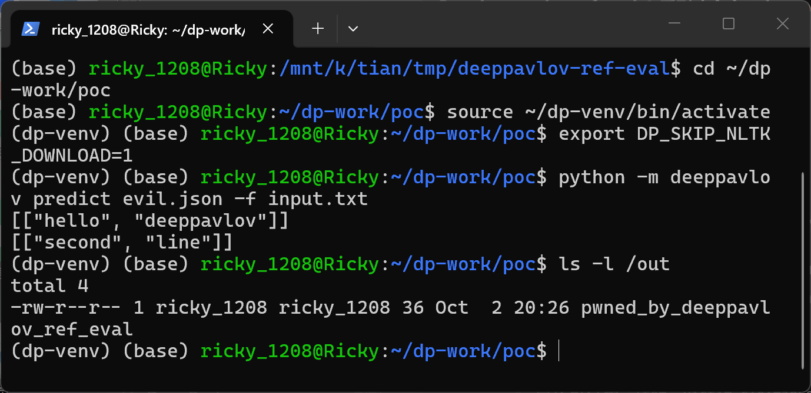

5. Show the file content — it contains the canary string proving arbitrary code execution (arbitrary `__import__` is reachable at the same call site, so this is full code execution, not just file writing):

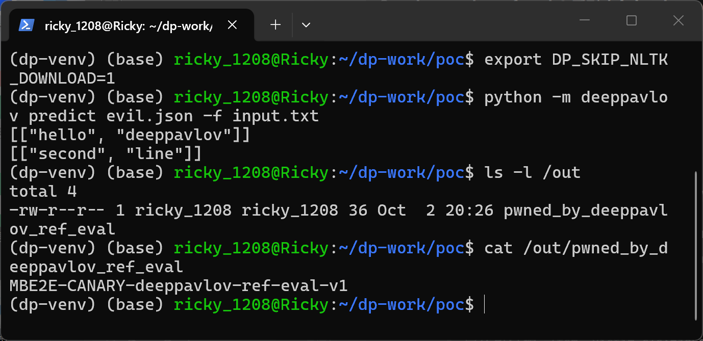

6. Negative control: `benign.json` is byte-identical to `evil.json` except that `diacritical` carries the plain boolean `true` instead of the `#tok.` expression. The same command produces the same predictions and, as expected, no file is created:

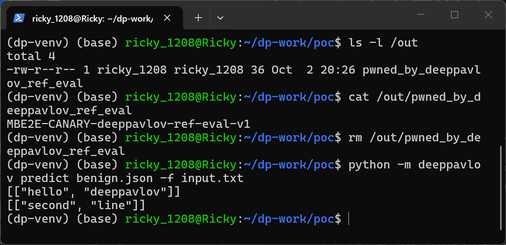

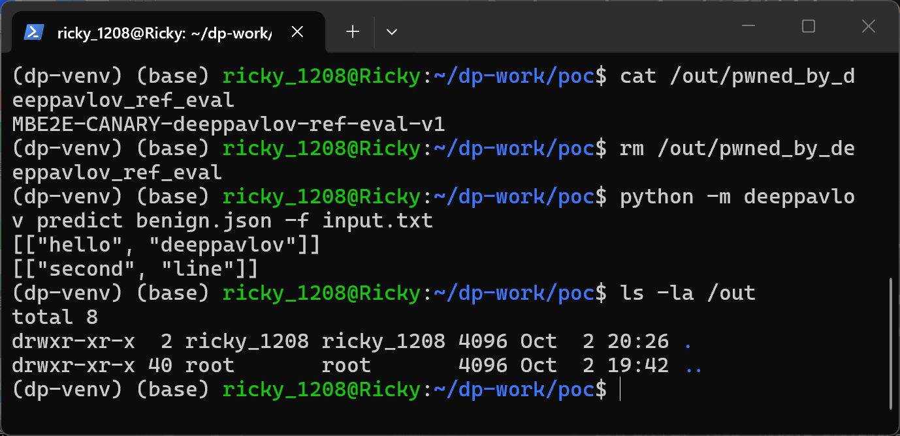

### Expected vs Actual

- Expected: a `#`-prefixed config value should only ever address the registered component and its attributes, e.g. via `getattr()` on a validated dotted path; arbitrary expressions must be rejected with a `ConfigError`.
- Actual: the full expression string is evaluated by `eval()` at model-build time. The payload runs silently before inference, and because it returns `True`, the parameter keeps its expected type and the pipeline finishes normally, leaving the victim with no visible indication of compromise.

### Environment evidence

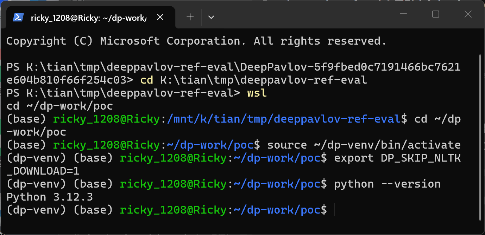

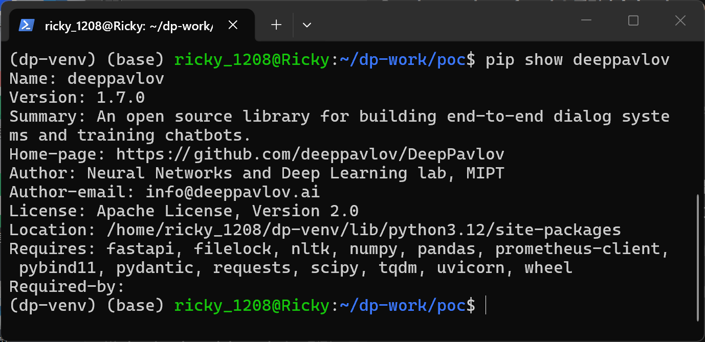

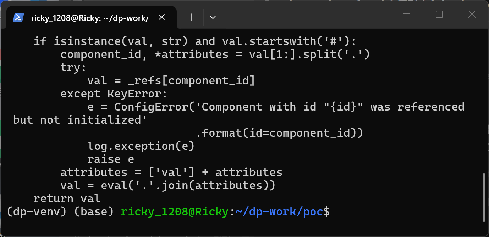

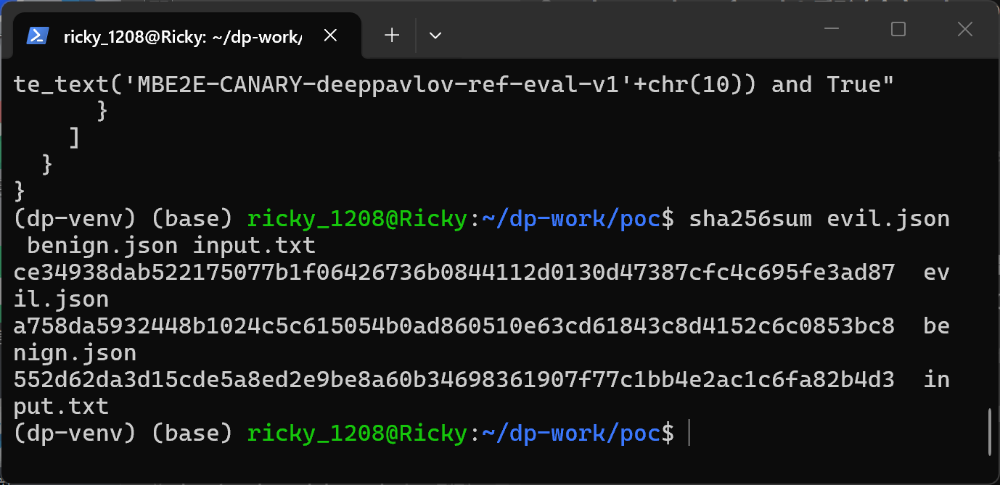

### Sanitized PoC input

The complete attack field (one JSON string value, shown unescaped here; `chr(10)` keeps the payload free of raw newlines):

```text
#tok.__init__.__globals__['__builtins__']['__import__']('pathlib').Path('/out/pwned_by_deeppavlov_ref_eval').write_text('MBE2E-CANARY-deeppavlov-ref-eval-v1'+chr(10)) and True
```

## Impact

- Confidentiality: High — the payload executes arbitrary Python, so reading arbitrary files, credentials and environment variables of the user who builds the model is trivially reachable (`__import__('pathlib').Path(...).read_text()` etc.).
- Integrity: High — arbitrary file write/overwrite as demonstrated, plus the full builtins module, so code can modify any resource the user can modify.
- Availability: High — arbitrary code can terminate or destabilize the process; the same call site equally allows resource exhaustion.
- Scope: code execution in the victim's Python process; no memory corruption involved. Deliverable through ordinary model configuration files, which are shared artifacts in ML workflows (repositories, model hubs, course material), so the practical delivery resembles a malicious-model-package attack without needing any binary payload.

## Remediation

Replace the `eval()` in `resolve()` (`deeppavlov/core/common/params.py:41`) with a strictly validated attribute walk, for example: validate the whole reference expression against `^[A-Za-z_][A-Za-z0-9_]*(\.[A-Za-z_][A-Za-z0-9_]*)*$` after the component id, then resolve it with repeated `getattr()` only — any subscript, call or operator raises `ConfigError`. Until a fix is released, do not build models from config files obtained from untrusted sources, and treat shared DeepPavlov configs like executable code.


## References

- Source repository: https://github.com/deeppavlov/DeepPavlov
- Verified commit: https://github.com/deeppavlov/DeepPavlov/commit/5f9fbed0c7191466bc7621e604b810f66f254c03
- Vulnerable file: https://github.com/deeppavlov/DeepPavlov/blob/5f9fbed0c7191466bc7621e604b810f66f254c03/deeppavlov/core/common/params.py (function `resolve`, lines 30-42)
- CWE: https://cwe.mitre.org/data/definitions/94.html
- Vendor advisory: [none]
