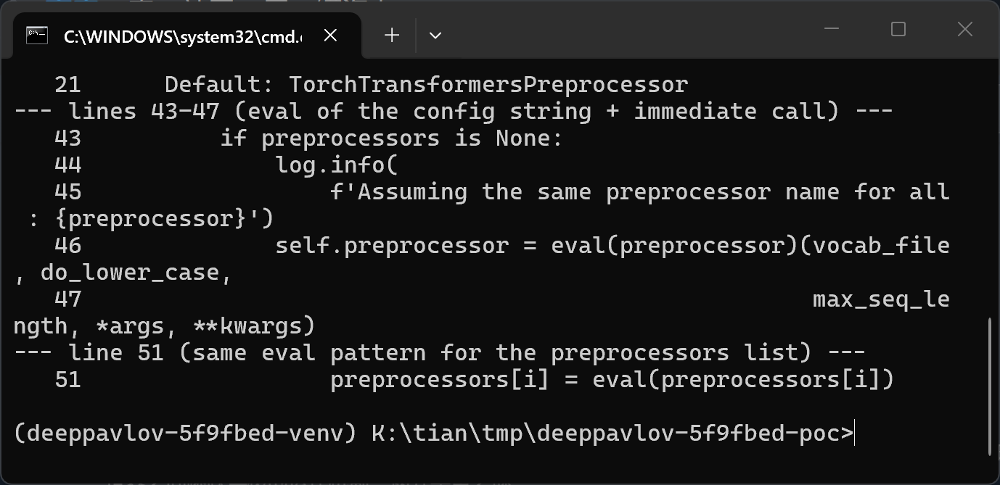
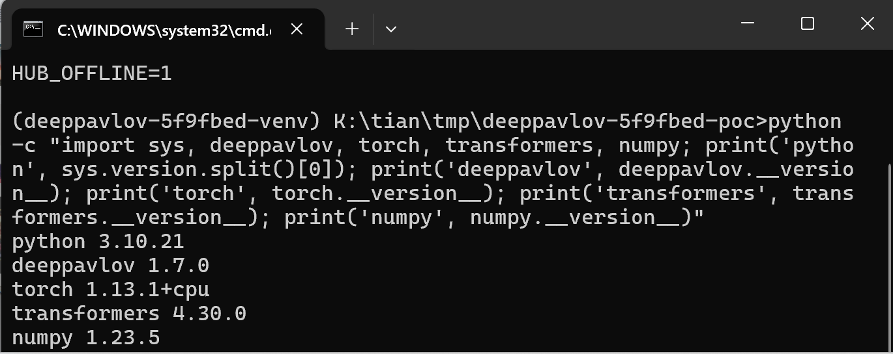
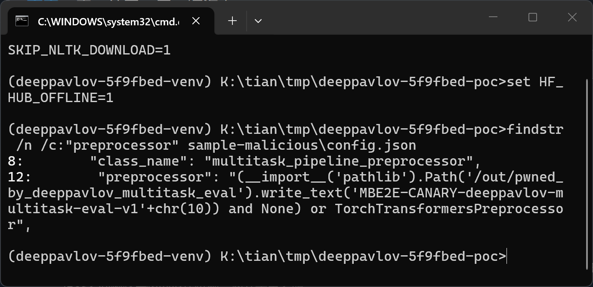
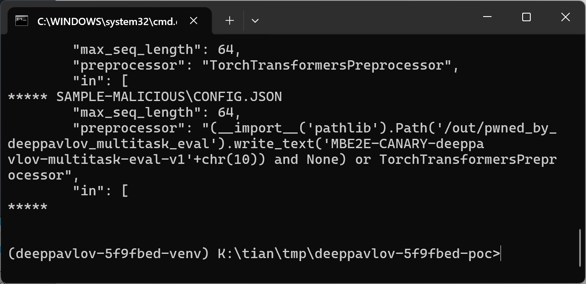
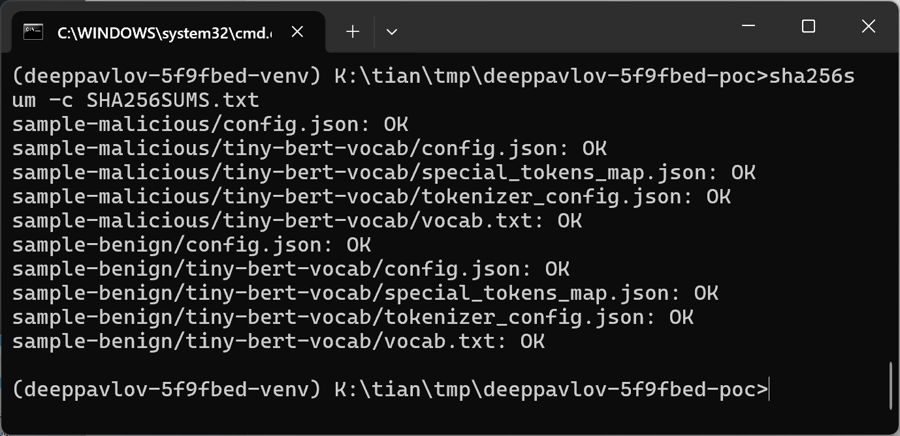
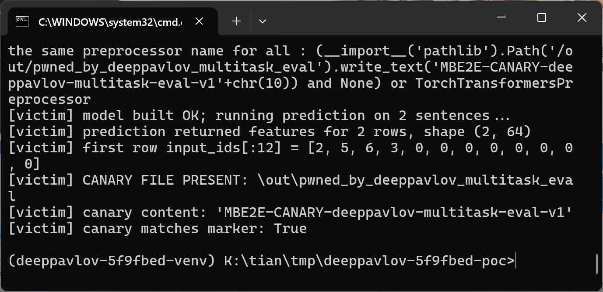
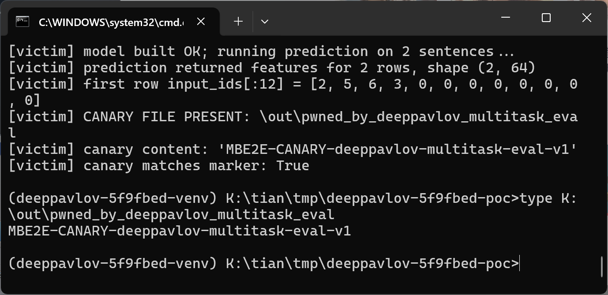
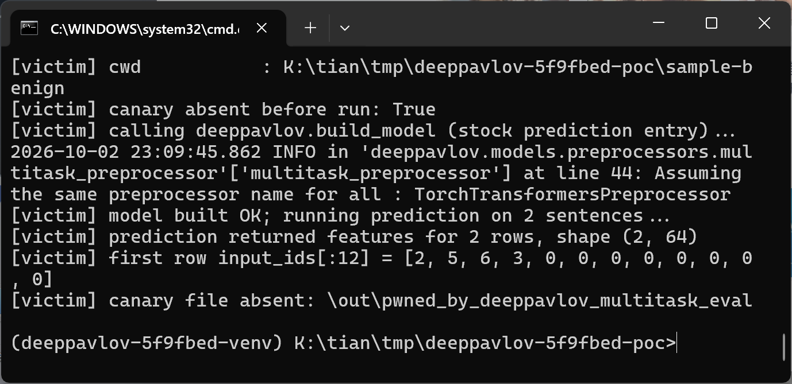

# DeepPavlov 1.2.0–1.7.0 (master @ 5f9fbed) — Code Injection (CWE-94) in multitask_pipeline_preprocessor

## Summary

DeepPavlov 1.2.0 through 1.7.0 (including the latest PyPI release 1.7.0 and master commit 5f9fbed) is affected by a Python code injection in the `multitask_pipeline_preprocessor` component. The `preprocessor` field of a model `config.json` is documented as the *name* of a DeepPavlov tokenizer class, but the component evaluates it with the built-in `eval()` and immediately calls the result, so any Python expression embedded in an otherwise well-formed model package (JSON + tokenizer data files, no `.py` sidecar) executes with the privileges of the victim process when the victim builds the model with the standard `deeppavlov.build_model()` / `deeppavlov predict` entry points.

## Affected Product

| Field | Value |
|---|---|
| Vendor | DeepPavlov (Neural Networks and Deep Learning Lab, MIPT) |
| Product | DeepPavlov |
| Affected versions | PyPI releases 1.2.0 (2023-06-06) through 1.7.0 (2024-08-12, latest release as of 2026-10-02); master commit 5f9fbed0c7191466bc7621e604b810f66f254c03 (2024-11-26); still unfixed in current master (verified 2026-10-02). Releases 1.0.0 and 1.1.0 are not affected. |
| Component | `deeppavlov/models/preprocessors/multitask_preprocessor.py`, `MultiTaskPipelinePreprocessor.__init__` (registered as `multitask_pipeline_preprocessor`), lines 46-47; same pattern in the `preprocessors` list branch at lines 50-51 |
| Platform | Any platform running Python (verified on Windows 11 x64, Python 3.10.21, CPU-only torch) |
| Vulnerability type | CWE-94: Code Injection |

## Root Cause

**Location:** `deeppavlov/models/preprocessors/multitask_preprocessor.py:46-47` (`MultiTaskPipelinePreprocessor.__init__`)

The docstring of the component documents the parameter as a class name: `preprocessor(str): name of DeepPavlov class that is used for tokenization. Default: TorchTransformersPreprocessor`. The implementation, however, hands the raw config string to `eval()` and calls the evaluation result in the same expression:

```python
if preprocessors is None:
    log.info(
        f'Assuming the same preprocessor name for all : {preprocessor}')
    self.preprocessor = eval(preprocessor)(vocab_file, do_lower_case,
                                           max_seq_length, *args, **kwargs)
    self.preprocessors = None
```

`preprocessor` is attacker-controlled: it arrives from the `chainer.pipe[]` entry of a `config.json` shipped inside a model package. DeepPavlov reads the JSON safely, resolves `class_name: multitask_pipeline_preprocessor` through the component registry (`deeppavlov/core/common/registry.json`), and passes every remaining JSON key as constructor arguments (`deeppavlov/core/common/params.py:102`), so the malicious string reaches `eval()` without any validation. The evaluation namespace makes the attack seamless: the module does `from deeppavlov.models.preprocessors.torch_transformers_preprocessor import *`, so the documented class name resolves as a bare global, and Python built-ins (including `__import__`) are available in `eval()`. A payload can therefore perform arbitrary actions first and still return the legitimate class, so model construction and prediction continue normally and the execution leaves no error. The sibling list branch has the identical defect one call away: `preprocessors[i] = eval(preprocessors[i])` (line 51).



## Proof of Concept

### Prerequisites

- Victim installs DeepPavlov (any of 1.2.0-1.7.0 or current master) and loads a model directory obtained from an attacker (model hub download, chat attachment, shared project folder). Loading happens with the stock prediction entry, e.g. `deeppavlov.build_model('config.json')`, `deeppavlov predict -c config.json`, or `deeppavlov interact -c config.json`; no developer tools or non-default settings are required.
- The model package consists only of `config.json` plus tokenizer data files (a BERT vocab directory). No Python sidecar file is involved anywhere.
- The canary path `/out/...` resolves to the root of the current drive on Windows (verified writing to `K:\out\`); on POSIX the parent directory of the payload path must already exist because `Path.write_text()` does not create parent directories.

### Steps to Reproduce

1. Generate the two model packages with the attached script (idempotent, also writes `SHA256SUMS.txt`): `python make_poc.py`.



2. Inspect the malicious package config: the `preprocessor` leaf of the `multitask_pipeline_preprocessor` component carries a Python expression.



3. Verify that the benign control package is byte-identical except for that single JSON leaf: `fc sample-benign\config.json sample-malicious\config.json`.



4. Verify package integrity and that both sides differ in exactly one file: `sha256sum -c SHA256SUMS.txt`.



5. Load the malicious package with the stock DeepPavlov prediction entry: `python victim_predict.py sample-malicious` (the script calls `deeppavlov.build_model()` on the package config and then runs one prediction batch).



6. Show the canary file that the eval'ed expression wrote outside the model directory.



7. Run the negative control: identical flow against the benign package whose `preprocessor` leaf is the plain documented class name `TorchTransformersPreprocessor`.



### Expected vs Actual

- Expected: the `preprocessor` field is treated as a class name, i.e. only names resolvable to a registered DeepPavlov tokenizer class are accepted, and no attacker-supplied code can execute during model loading.
- Actual: any Python expression in the field is executed inside the victim's `build_model()` call. In the verified run the expression wrote an arbitrary file (`/out/pwned_by_deeppavlov_multitask_eval` containing `MBE2E-CANARY-deeppavlov-multitask-eval-v1`), returned the legitimate `TorchTransformersPreprocessor` class, and the model then built and predicted normally (identical token ids to the benign control) — the execution is silent and leaves no exception. DeepPavlov even logs the attacker string verbatim: `Assuming the same preprocessor name for all : (__import__('pathlib')...`.

### Sanitized PoC input

The complete candidate component entry of `config.json` (canary marker is a fixed test string, no real hostnames/credentials involved):

```json
{
  "class_name": "multitask_pipeline_preprocessor",
  "vocab_file": "tiny-bert-vocab",
  "do_lower_case": true,
  "max_seq_length": 64,
  "preprocessor": "(__import__('pathlib').Path('/out/pwned_by_deeppavlov_multitask_eval').write_text('MBE2E-CANARY-deeppavlov-multitask-eval-v1'+chr(10)) and None) or TorchTransformersPreprocessor",
  "in": ["x"],
  "out": ["features"]
}
```

Negative control uses the identical entry with `"preprocessor": "TorchTransformersPreprocessor"`.

## Impact

- Confidentiality: High — the injected expression runs arbitrary Python with the full privileges of the victim process, so secrets readable by that user (model caches, tokens, files) can be exfiltrated.
- Integrity: High — arbitrary file writes/overwrites are possible; the PoC demonstrates a file created outside the model directory.
- Availability: High — the payload can crash the process, corrupt model stores, or persist via startup mechanisms.
- Scope: full code execution in the victim Python process; the demonstrated canary is a file-write primitive, but any Python payload is achievable because the field is evaluated by `eval()`.


## Remediation

Replace `eval()` with a whitelist lookup against the component registry, e.g. resolve the documented class name through `deeppavlov.core.common.registry` (which already maps `multitask_pipeline_preprocessor` to its class) or require an explicit `module.submodules:ClassName` string parsed by the existing `cls_from_str()` helper with a namespace allowlist; apply the same fix to the `preprocessors` list branch at line 51. Until a patched release is available, do not load model configs from untrusted sources, and treat any `deeppavlov` config JSON as executable code.

## References

- Source repository: https://github.com/deeppavlov/DeepPavlov
- Vulnerable file at pinned commit: https://github.com/deeppavlov/DeepPavlov/blob/5f9fbed0c7191466bc7621e604b810f66f254c03/deeppavlov/models/preprocessors/multitask_preprocessor.py
- Latest affected release: https://pypi.org/project/deeppavlov/1.7.0/
- Multitask pipeline documentation: https://github.com/deeppavlov/DeepPavlov/blob/master/docs/features/models/multitask_bert.rst
- CWE: https://cwe.mitre.org/data/definitions/94.html
- Upstream report: [pending publication]
