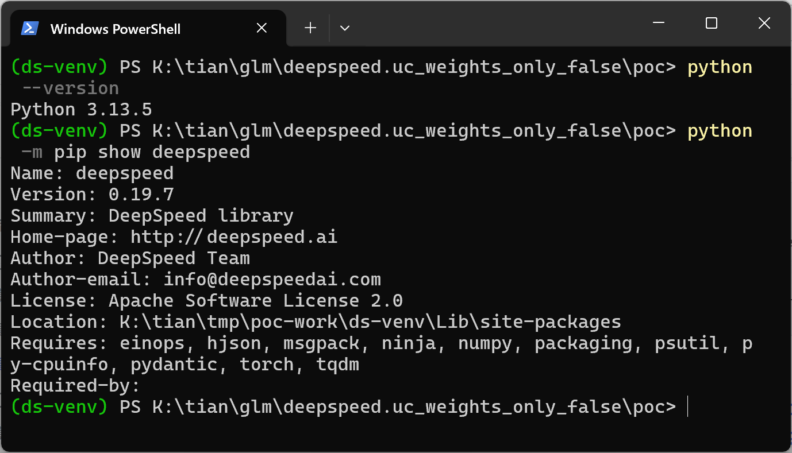
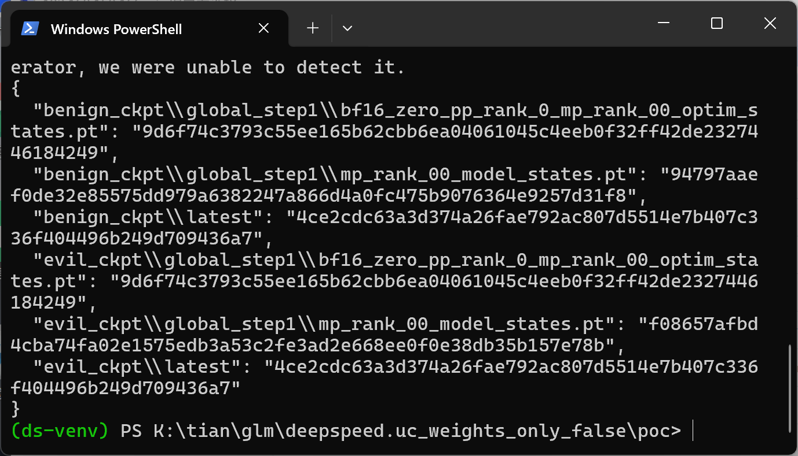
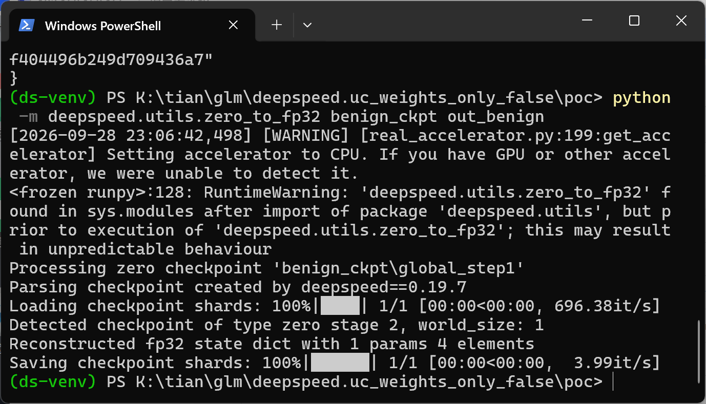
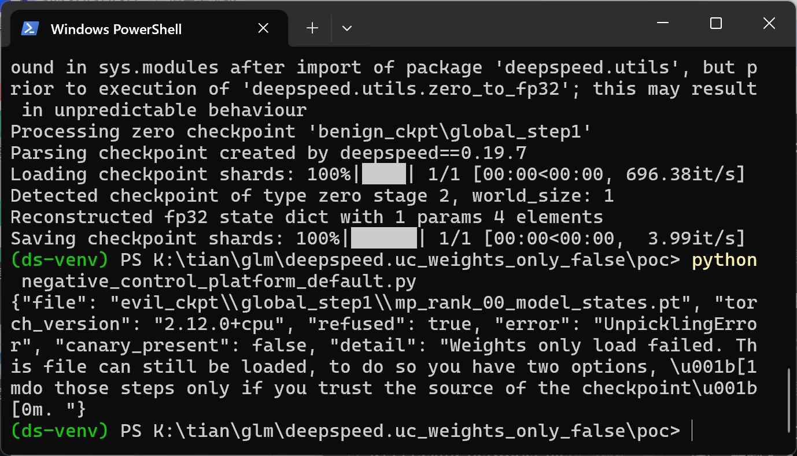
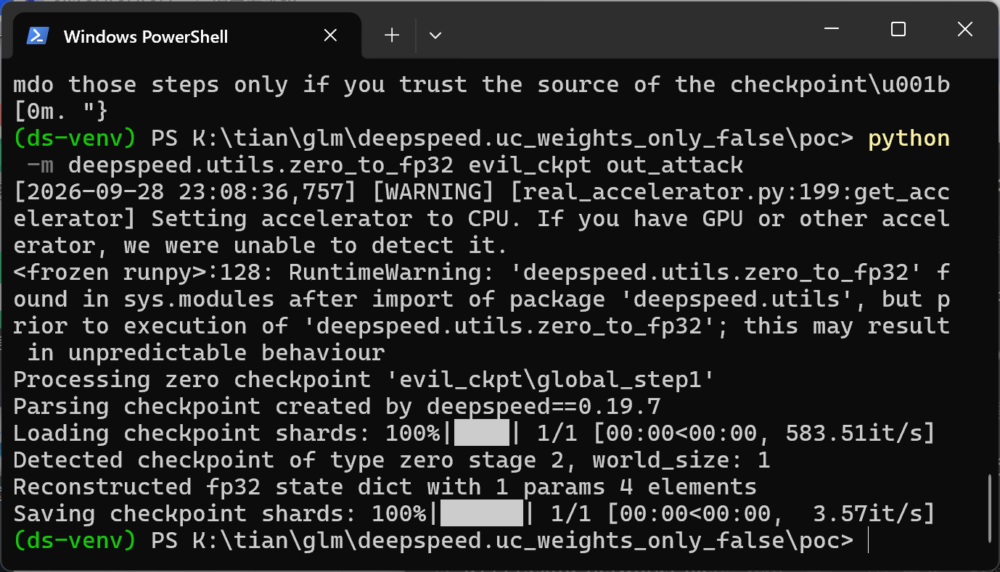
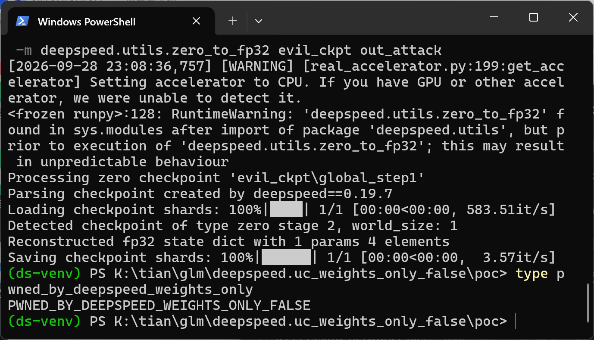
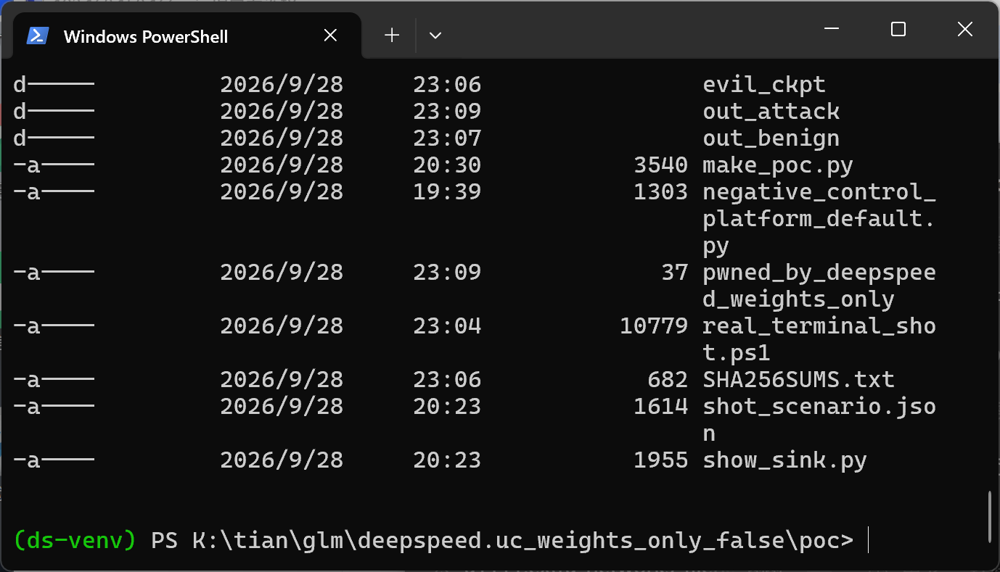

# DeepSpeed 0.19.7 — Deserialization of Untrusted Data (Arbitrary Code Execution) in the zero_to_fp32 Checkpoint Conversion CLI

## Summary

DeepSpeed (deepspeedai/DeepSpeed) ships `deepspeed/utils/zero_to_fp32.py`, the command-line tool that consolidates a sharded ZeRO checkpoint into a single fp32 state_dict; DeepSpeed copies this script into every checkpoint directory it writes precisely so that whoever receives the checkpoint can run it. Every `torch.load` on that mandatory path passes `weights_only=False`, which switches off the platform default that PyTorch introduced in torch 2.6 specifically so that a checkpoint from a stranger cannot execute code during unpickling. A pickle `__reduce__` gadget stored in a `.pt` shard of a shared checkpoint therefore executes while the tool loads it — before any structural validation of the checkpoint happens — giving arbitrary code execution in the victim's shell. The identical poisoned bytes are refused by a plain `torch.load()` under torch's own default, which isolates DeepSpeed's `weights_only=False` as the precise root cause.

## Affected Product

| Field | Value |
|---|---|
| Vendor | DeepSpeed (deepspeedai) |
| Product | DeepSpeed |
| Affected versions | through **0.19.7** (the latest PyPI release as of 2026-09-28). The explicit `weights_only=False` on this path was introduced by PR #6751 (merged 2024-11-19); releases since that change are affected when run with torch >= 2.6 |
| Component | `deepspeed/utils/zero_to_fp32.py` — `parse_model_states()` (line 153), `_raise_if_autoep_zero3_partitioned_checkpoint()` (line 146), `parse_optim_states()` (line 201); same root cause in six further entry points listed below |
| Platform | OS-agnostic pure-Python path (CPU only). Verified on Windows 11 x64 (Python 3.13.5, torch 2.12.0+cpu) and, in an earlier independent end-to-end run, in Docker (Linux, torch 2.8.0+cpu) |
| Vulnerability type | CWE-502: Deserialization of Untrusted Data |

Version note: the `zero_to_fp32.py` file in the PyPI 0.19.7 sdist is byte-identical (sha256 `54f74b8a39616e5c2a32c028a51524b1d8c481a15cd8b5961bb8125de244aed9`) to the same file at master commit `b5e000c4cd7952b351026c73a9e7bfd8e52ff0ba`, so all line numbers below are valid for both references.

## Root Cause

**Location:** `deepspeed/utils/zero_to_fp32.py:153` (`parse_model_states`), reached from `convert_zero_checkpoint_to_fp32_state_dict()` via `get_model_state_files()`; permalink to the audited commit: https://github.com/deepspeedai/DeepSpeed/blob/b5e000c4cd7952b351026c73a9e7bfd8e52ff0ba/deepspeed/utils/zero_to_fp32.py#L153

```python
def parse_model_states(files):
    zero_model_states = []
    for file in files:
        state_dict = torch.load(file, map_location=device, weights_only=False)  # line 153: full-trust unpickle
        _raise_if_autoep_zero3_partitioned_state(state_dict)

        if BUFFER_NAMES not in state_dict:                                     # line 156: structural check,
            raise ValueError(f"{file} is not a model state checkpoint")        # THREE lines AFTER the unpickle
```

`weights_only=False` is not a harmless spelling: on torch >= 2.6 it overrides the declarative safe default (`weights_only=True`) that the PyTorch project shipped precisely so that untrusted checkpoints cannot execute code, and there is no allowlist, no digest check and no opt-in on this path. Because the file is unpickled before the `BUFFER_NAMES` structural check at line 156, a malicious shard does not even need to be a well-formed DeepSpeed checkpoint — the payload runs first. Two further sites of the same defect exist in the same file: line 146 (`_raise_if_autoep_zero3_partitioned_checkpoint`) and line 201 (`parse_optim_states`, optimizer shards, additionally with `mmap=True`).

The provenance makes this an informed compatibility decision rather than an oversight: PR #6751 (merged 2024-11-19) was a response to PyTorch's `FutureWarning` about the coming `weights_only` default and quotes "arbitrary code execution during unpickling" in its own body, before converting the previously bare `torch.load` calls into explicit `weights_only=False`. The consequence is that every load of any third-party checkpoint degrades to full-trust unpickling, with no re-validation for the untrusted case. The repository itself contains the correct contrast inside a single function: `module_inject/replace_module.py` lines 625–628 load `.safetensors` through the safe reader `safetensors.torch.load_file` but `.pt` through `torch.load(..., weights_only=False)` — the safe format gets the safe reader, the pickle format gets the boundary removed.

The same root cause is present statically in six further entry points (line numbers at the audited commit): Universal Checkpoint resume in `deepspeed/runtime/zero/stage3.py:3371-3384` and `:3489-3494`, the `bin/ds_to_universal.py` conversion CLI (12+ sites), `deepspeed/runtime/checkpoint_engine/torch_checkpoint_engine.py:35-37` (ordinary non-UC training resume), `deepspeed/inference/engine.py:463/:471` (v1 inference shard load), `deepspeed/inference/v2/checkpoint/huggingface_engine.py:86`, and the kernel-inject `.pt` branch of `deepspeed/module_inject/replace_module.py:628`. Only the `zero_to_fp32` entry was executed end-to-end; the siblings were established by source audit.

## Proof of Concept

### Prerequisites

- Python with torch >= 2.6 (CPU is sufficient — the conversion path is CPU-only) and DeepSpeed installed (`pip install deepspeed`; verified on 0.19.7).
- The victim runs the documented consolidation command on a checkpoint directory obtained from another party; the attacker's entire capability is that directory (here: `evil_ckpt/`, a ZeRO stage-2 checkpoint that is byte-wise a normal DeepSpeed checkpoint plus ONE extra key `training_args` holding the payload).

### Steps to Reproduce

1. Build the malicious checkpoint and its benign twin (script `make_poc.py`, included; it writes a canary file using a RELATIVE path, so the canary lands in the victim's working directory):

```python
class Payload:
    def __reduce__(self):
        return (exec, ("import pathlib; pathlib.Path('pwned_by_deepspeed_weights_only')"
                       ".write_text('PWNED_BY_DEEPSPEED_WEIGHTS_ONLY_FALSE')",))
```



2. Show the vulnerable code exactly as installed and about to run (`show_sink.py` prints the installed `zero_to_fp32.py` with real line numbers):




3. Negative control N1 — convert the benign checkpoint: normal output, no canary file appears.



4. Negative control N2 — hand the IDENTICAL poisoned shard to a plain `torch.load()` (torch 2.12 platform default, `weights_only=True`): the load is refused with `UnpicklingError` and the canary does not exist, proving the platform boundary holds and only DeepSpeed's `weights_only=False` reopens it.



5. Trigger — run DeepSpeed's own conversion tool on the malicious checkpoint:



6. Confirm execution — the payload wrote its canary into the victim's working directory while the tool was "converting":





### Expected vs Actual

- Expected (PyTorch's declared default, and negative control N2): `torch.load` refuses the file with `UnpicklingError` ("Weights only load failed…"), no code runs.
- Actual (DeepSpeed `zero_to_fp32`, because of `weights_only=False`): the tool prints a completely normal conversion log (`Detected checkpoint of type zero stage 2, world_size: 1` / `Reconstructed fp32 state dict with 1 params 4 elements`) and exits 0, while the `__reduce__` gadget has already executed attacker-controlled `exec()` during deserialization.

### Sanitized PoC input

The poisoned shard (the attacker's only input) is a `torch.save` file whose mapping contains DeepSpeed's own format constants plus one extra key; sha256 `f08657afbd4cba74fa02e1575edb3a53c2fe3ad2e668ee0f0e38db35b157e78b`. The benign twin (same structure, no `training_args` key) is sha256 `94797aaef0de32e85575dd979a6382247a866d4a0fc475b9076364e9257d31f8`; both are regenerated deterministically by `poc/make_poc.py` in the disclosure package, and the full digest list is in `poc/SHA256SUMS.txt`. No network access is involved at any point.

## Impact

- Confidentiality: High — arbitrary code execution in the user's shell implies full read access to everything the user can read (credentials, source code, other model artifacts).
- Integrity: High — arbitrary writes; the reference payload writes an attacker-chosen file, and anything more is only a matter of the gadget body.
- Availability: High — full process control.
- Scope: arbitrary code execution during deserialization of a model artifact in a documented, DeepSpeed-endorsed sharing workflow (DeepSpeed copies `zero_to_fp32.py` into every checkpoint directory it writes, so "run the tool on the checkpoint you were given" is the designed use).

## Attack Vector and Severity (CVSS v3.1)

| Metric | Value | Rationale |
|---|---|---|
| Attack Vector | Local (L) | The malicious checkpoint must exist on the victim's disk (e.g. downloaded/shared model artifact); the code executes when the victim consolidates it locally |
| Attack Complexity | Low (L) | No race, no special configuration; standard conversion command |
| Privileges Required | None (N) | The victim needs no privileges; the attacker needs none either |
| User Interaction | Required (R) | The victim must run the conversion on the received checkpoint |
| Scope | Unchanged (U) | Execution stays in the user's own process/security context |
| Confidentiality | High (H) | Full compromise of the process |
| Integrity | High (H) | Full compromise of the process |
| Availability | High (H) | Full compromise of the process |

```
Score: 7.8 (High)
Vector: CVSS:3.1/AV:L/AC:L/PR:N/UI:R/S:U/C:H/I:H/A:H
```

Per the repository's own SECURITY.md severity table this falls in the HIGH band (CVSS 7.0–8.9).

## Remediation

1. Default every checkpoint read to `weights_only=True` and register the specific non-tensor classes DeepSpeed legitimately stores via `torch.serialization.add_safe_globals`; this preserves the round-trip compatibility that motivated PR #6751 without reopening the pickle channel.
2. Move non-tensor blobs that cannot be allowlisted out of the pickle into a JSON sidecar and rebuild them on load.
3. If a full-trust load must remain available, gate it behind an explicit opt-in flag (e.g. `--trust-checkpoint`, default off) so the unsafe mode is a conscious operator decision about a specific artifact.
4. Move the structural checks (`BUFFER_NAMES`, `ZERO_STAGE`) ahead of deserialization where possible, and publish hash-pinned checkpoints for reuse.

## References

- Source repository: https://github.com/deepspeedai/DeepSpeed
- Vulnerable line (audited commit): https://github.com/deepspeedai/DeepSpeed/blob/b5e000c4cd7952b351026c73a9e7bfd8e52ff0ba/deepspeed/utils/zero_to_fp32.py#L153
- PR #6751 (introduced the explicit `weights_only=False`): https://github.com/deepspeedai/DeepSpeed/pull/6751
- Repository security policy (report channel): https://github.com/deepspeedai/DeepSpeed/blob/master/SECURITY.md
- CWE-502: https://cwe.mitre.org/data/definitions/502.html
- PyTorch security policy (threat model for interacting with model files): https://github.com/pytorch/pytorch/blob/main/SECURITY.md
- Prior DeepSpeed advisory on a different sink: CVE-2024-43497
- Upstream advisory: [pending publication]
