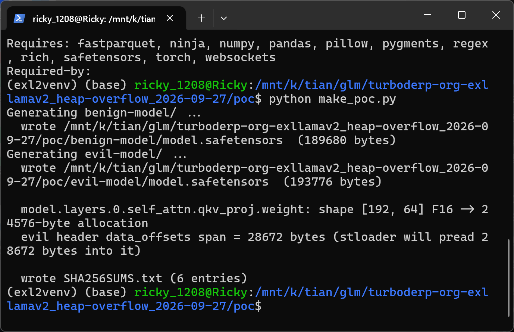
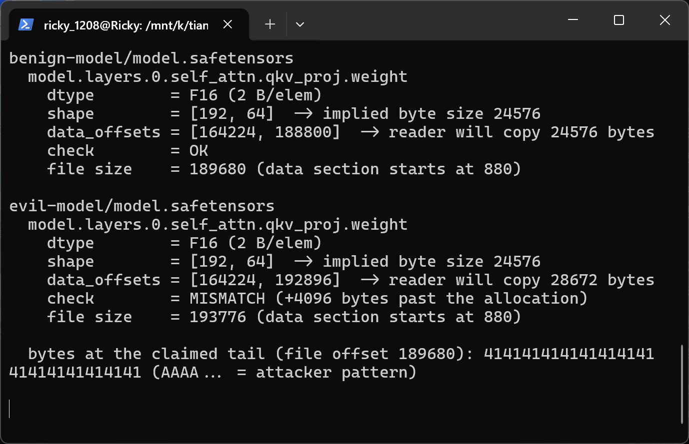
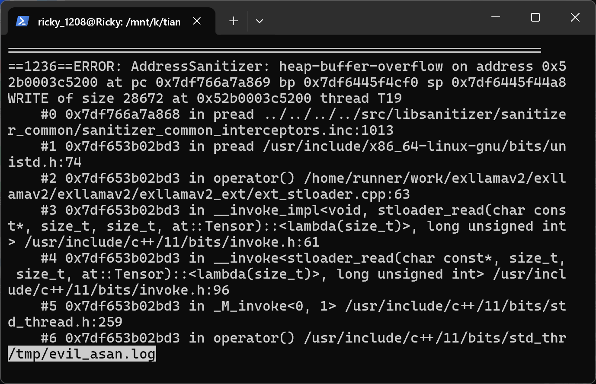
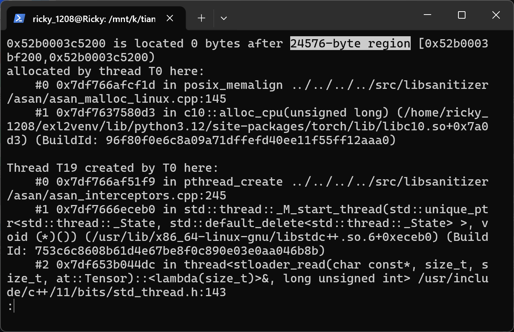
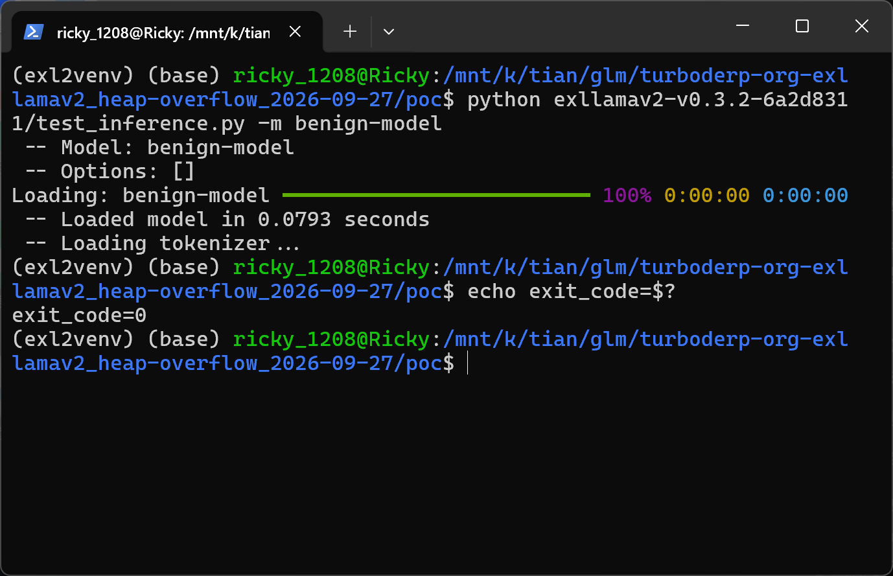

# ExLlamaV2 0.3.2 — Heap Buffer Overflow in the safetensors tensor loader (STFile.get_tensor / stloader_read)

## Summary

turboderp ExLlamaV2 0.3.2 is affected by a heap-based buffer overflow in its built-in safetensors reader (`exllamav2/stloader.py`, `STFile.get_tensor`, backed by `stloader_read` in `exllamav2/exllamav2_ext/ext_stloader.cpp`). The reader allocates the destination tensor from the header's `shape`/`dtype` but independently uses `data_offsets[1] - data_offsets[0]` as the number of bytes to read, without verifying that the two agree or that the offsets satisfy the contiguity/coverage invariants enforced by the reference safetensors implementation. On the CPU loading path the extension `pread()`s directly into the tensor's storage, so loading a crafted model directory — which the victim only needs to do with any normal entry point such as the README command `python test_inference.py -m <model>` — writes attacker-controlled bytes past the end of a heap allocation, corrupting the heap or crashing the process.

## Affected Product

| Field | Value |
|---|---|
| Vendor | turboderp (turboderp-org) |
| Product | ExLlamaV2 |
| Affected versions | v0.3.2 (latest release, commit 6a2d8311408aa23af34e8ec32e28085ea68dada7) and master commit 7dc12af3a81f34ac3f27cd7602ed539b638933ca (2026-03-04); the vulnerable files are byte-identical between the two, and earlier versions were not checked `[unknown]` |
| Component | `exllamav2/stloader.py` `STFile.get_tensor()`; `exllamav2/exllamav2_ext/ext_stloader.cpp` `stloader_read()` |
| Platform | Linux and Windows; CPU tensor-loading path (also reachable for GPU targets through the same missing length check) |
| Vulnerability type | CWE-122: Heap-based Buffer Overflow |

## Root Cause

**Location:** `exllamav2/stloader.py:154-165` (`STFile.get_tensor`) and `exllamav2/exllamav2_ext/ext_stloader.cpp:29,63` (`stloader_read`)

`STFile.get_tensor()` parses the safetensors JSON header itself and uses two independent, uncorrelated sources of truth for the same copy operation: the destination tensor is allocated from `h["shape"]` and `h["dtype"]`, while the copy length is computed from `h["data_offsets"]` as `end - beg`. The function never checks `size == tensor.numel() * esize`, and `read_dict()` performs none of the header invariants that the reference safetensors implementation enforces (offsets within the data section, contiguous non-overlapping coverage). All three header fields are fully attacker-controlled by anyone who can place a `model.safetensors` file in the model directory the victim loads.

```python
# exllamav2/stloader.py — STFile.get_tensor (v0.3.2, lines 154-165)
beg, end = h["data_offsets"]          # attacker-controlled
size = end - beg                      # read length: attacker-controlled
shape = h["shape"]                    # allocation size: attacker-controlled, unchecked against `size`
tensor = torch.zeros(shape, dtype = dtype, device = device)
torch.cuda.synchronize()
assert tensor.is_contiguous, "Non-contiguous tensor"
ext_c.stloader_read(
    self.filename,
    beg + self.header_size,
    size,                             # copied into `tensor` without a bound check
    tensor
)
```

In the extension, a CPU destination is used directly as the read target, so the unchecked length becomes an unchecked `pread()` into the PyTorch heap allocation:

```c
// exllamav2/exllamav2_ext/ext_stloader.cpp — stloader_read (v0.3.2)
if (target_cpu)
{
    load_buffer = (uint8_t*) target.data_ptr();   // heap buffer sized by `shape`, lines 27-31
}
...
// block copy loop, line 63
ssize_t br = pread(fileno(file), load_buffer + pos_a, pos_b - pos_a, offset + pos_a);
```

The most reachable trigger is the fused-QKV load path of architectures that ship a fused attention projection (e.g. `Phi3ForCausalLM`, whose keymap maps the fused tensor to `.self_attn.qkv_proj`): `ExLlamaV2Linear.load()` (`exllamav2/linear.py:128`) calls `load_weight_fused()` (`exllamav2/module.py:154`), which fetches the fused tensor with `device = "cpu"` (`exllamav2/module.py:171`) and therefore hits the `target_cpu` branch above. Note that the GPU path is equally affected by the same missing check: it `malloc()`s a staging buffer of exactly `size` bytes and then `cudaMemcpyAsync`-copies `size` bytes into the `shape`-sized GPU tensor (the CPU path was chosen for this report because it is reproducible without a GPU).

## Proof of Concept

### Prerequisites

- Python 3.12, `torch` (any build the exllamav2 wheel targets), exllamav2 0.3.2 (official wheel `exllamav2-0.3.2+cu124.torch2.6.0-cp312-cp312-linux_x86_64.whl` was used).
- A victim who loads an attacker-supplied model directory with any exllamav2 entry point; the README quick-start command `python test_inference.py -m <path_to_model>` is sufficient. No flags, no special configuration, no privileges.
- The verification host had no NVIDIA GPU, so the run adds a small `sitecustomize.py` environment shim (loaded via the venv's site-packages): it stubs `torch.cuda._lazy_init` / `torch.cuda.synchronize` (exllamav2 calls `torch.cuda.synchronize()` unconditionally in `get_tensor()`, which raises on a driver-less CUDA-enabled torch before any tensor can be loaded), and — because every exllamav2 load path requires at least one CUDA device for non-embedding weights — clamps module placement to CPU when `torch.cuda.device_count() == 0`. The shim is environment-only: it does not touch safetensors parsing, the length computation, or the allocation that gets overflowed; all vulnerable code runs unmodified.

### Steps to Reproduce

1. Generate the sample pair with the provided generator. `benign-model/` and `evil-model/` are ordinary Hugging Face-style directories (`config.json` + `tokenizer.json` + `model.safetensors`) for a tiny Phi3ForCausalLM. They are byte-identical except that in the evil file the `model.layers.0.self_attn.qkv_proj.weight` header entry declares a `data_offsets` span of 28,672 bytes (absolute offsets `[164224, 192896]`) instead of the shape-implied 24,576 bytes (`[164224, 188800]`; shape `[192, 64]`, dtype `F16`), and the evil file carries 4,096 attacker-controlled bytes appended after the tensor data so the oversized read stays inside the file.



The generator prints the tensor geometry (shape `[192, 64]` F16 → 24,576-byte allocation) and writes `SHA256SUMS.txt`.

2. Show the malformed header next to the benign one: both files report `shape = [192, 64]` / `dtype = F16`, but the evil entry's `data_offsets` span is 28,672 bytes — the header requests 28,672 bytes for a 24,576-byte tensor (check line: `MISMATCH (+4096 bytes past the allocation)`), and the appended attacker pattern (`0x41` repeated) is confirmed at the claimed tail.



3. Load the malicious model directory exactly as the README instructs (`python test_inference.py -m evil-model -p "Once upon a time,"`), with AddressSanitizer's runtime preloaded to observe the corruption (any victim run without a sanitizer suffers the same out-of-bounds write silently or crashes later with heap corruption). AddressSanitizer reports `heap-buffer-overflow ... WRITE of size 28672` issued from `pread` inside `stloader_read` (`ext_stloader.cpp:63`), landing at the end of the 24,576-byte region that backs the tensor (`allocated by ... posix_memalign ← c10::alloc_cpu`, i.e. the PyTorch tensor storage itself):





4. Negative control: load `benign-model/` the same way (same interpreter, same environment). The model loads completely (` -- Loaded model in 0.0793 seconds`, ` -- Loading tokenizer...`) and exits with code 0, no sanitizer report — confirming that the sole trigger is the malformed `data_offsets` field.



### Expected vs Actual

- Expected: the loader rejects the file, because the safetensors format requires `data_offsets` to be contiguous and to exactly cover each tensor's `shape × dtype` byte size; at minimum `STFile.get_tensor` must verify `size == numel(shape) * esize` before reading.
- Actual: `stloader_read` writes 28,672 bytes into the 24,576-byte heap allocation backing the tensor (4,096 bytes out of bounds, contents attacker-controlled; the overflow amount is attacker-controlled up to the file size). AddressSanitizer aborts at the moment of the write:

```text
==362==ERROR: AddressSanitizer: heap-buffer-overflow on address 0x52b0003c5200 at pc 0x70ed5507a869 bp 0x70ec32b8acf0 sp 0x70ec32b8a4a8
WRITE of size 28672 at 0x52b0003c5200 thread T19
    #0 0x70ed5507a868 in pread ../../../../src/libsanitizer/sanitizer_common/sanitizer_common_interceptors.inc:1013
    #1 0x70ec41f02bd3 in pread /usr/include/x86_64-linux-gnu/bits/unistd.h:74
    #2 0x70ec41f02bd3 in operator() /home/runner/work/exllamav2/exllamav2/exllamav2/exllamav2_ext/ext_stloader.cpp:63
    #3 0x70ec41f02bd3 in __invoke_impl<void, stloader_read(char const*, size_t, size_t, at::Tensor)::<lambda(size_t)>, long unsigned int> /usr/include/c++/11/bits/invoke.h:61
    ...
0x52b0003c5200 is located 0 bytes after 24576-byte region [0x52b0003bf200,0x52b0003c5200)
allocated by thread T0 here:
    #0 0x70ed550fcf1d in posix_memalign ../../../../src/libsanitizer/asan/asan_malloc_linux.cpp:145
    #1 0x70ed519580d3 in c10::alloc_cpu(unsigned long) (/home/.../site-packages/torch/lib/libc10.so+0x7a0d3)
    ...
Thread T19 created by T0 here:
    ... std::thread created in stloader_read ... /exllamav2/exllamav2_ext/ext_stloader.cpp:143
SUMMARY: AddressSanitizer: heap-buffer-overflow sanitizer_common_interceptors.inc:1013 in pread
```

The overflowed allocation is the destination tensor's storage (`c10::alloc_cpu`), and the writing thread is the `stloader_read` load worker — i.e. the report pins the unchecked copy in `STFile.get_tensor` → `stloader_read` exactly as described under Root Cause.

### Sanitized PoC input

```text
# evil-model/model.safetensors header (excerpt), JSON after the 8-byte length prefix:
"model.layers.0.self_attn.qkv_proj.weight": {
    "dtype": "F16",
    "shape": [192, 64],                  # implies 24576 bytes
    "data_offsets": [164224, 192896]     # span 28672 bytes (benign: [164224, 188800])
}
# + 4096 bytes of attacker data appended after the tensor data section
```

## Impact

- Confidentiality: High — heap memory adjacent to the allocation can be corrupted with attacker-controlled contents; depending on heap layout this is a stepping stone to information disclosure and code execution in the process loading the model.
- Integrity: High — attacker-controlled bytes are written past a heap buffer inside the victim's process (heap metadata and neighboring objects can be overwritten).
- Availability: High — the corruption reliably crashes the process when detected (sanitizer/allocator abort), and heap corruption without a sanitizer leads to undefined behavior at an arbitrary later point.
- Scope: memory corruption (heap out-of-bounds write) in the process that loads the model.

## Attack Vector and Severity (CVSS v3.1)

| Metric | Value | Rationale |
|---|---|---|
| Attack Vector | N/A/L/P → Network | The malicious model directory is delivered like any HF-style model (repository, download); no local access or special network position is needed. |
| Attack Complexity | Low | No special conditions: any model load that pulls a tensor on the CPU path triggers the unchecked copy; the geometry of the sample is ordinary. |
| Privileges Required | None | Loading a downloaded model requires no authentication or elevated privileges. |
| User Interaction | Required | The victim must choose to load/convert/run the malicious model directory. |
| Scope | Unchanged | Corruption stays within the loading process. |
| Confidentiality | High | Heap corruption with controlled data can enable code execution and access to process memory. |
| Integrity | High | Out-of-bounds write with attacker-controlled bytes and length. |
| Availability | High | Reliable abort/crash of the loading process. |

```
Score: 8.8 (High)
Vector: CVSS:3.1/AV:N/AC:L/PR:N/UI:R/S:U/C:H/I:H/A:H
```

> Assumption note: AV:N treats the model file as a network-delivered artifact and UI:R reflects that a user must initiate the load. If a deployment loads untrusted model directories without user interaction (e.g. an automated pipeline/server), the same flaw applies with UI:N (score 9.8, Critical).

## Remediation

Validate the header before any read, in `STFile.read_dict()`/`get_tensor()` (`exllamav2/stloader.py`): for every tensor, reject the file unless `data_offsets` are non-negative, monotonically contiguous across the file, exactly cover the data section, and satisfy `data_offsets[1] - data_offsets[0] == prod(shape) * dtype_size` (this mirrors the checks the reference safetensors implementation performs). Upgrading does not help until a fixed release is published `[pending]`; as a workaround, only load model directories from trusted sources, and prefer parsing `model.safetensors` with the reference `safetensors` library (which enforces the invariants) before handing files to exllamav2.


## References

- Source repository: https://github.com/turboderp-org/exllamav2
- Affected release: https://github.com/turboderp-org/exllamav2/releases/tag/v0.3.2
- Vulnerable code (v0.3.2): https://github.com/turboderp-org/exllamav2/blob/v0.3.2/exllamav2/stloader.py (STFile.get_tensor, lines 152-168) and https://github.com/turboderp-org/exllamav2/blob/v0.3.2/exllamav2/exllamav2_ext/ext_stloader.cpp (stloader_read, lines 27-31 and 63)
- CWE: https://cwe.mitre.org/data/definitions/122.html
- safetensors format invariants (reference implementation behaviour): https://github.com/huggingface/safetensors
- Vendor advisory: `[none]`
- Upstream report: `[pending publication]`

