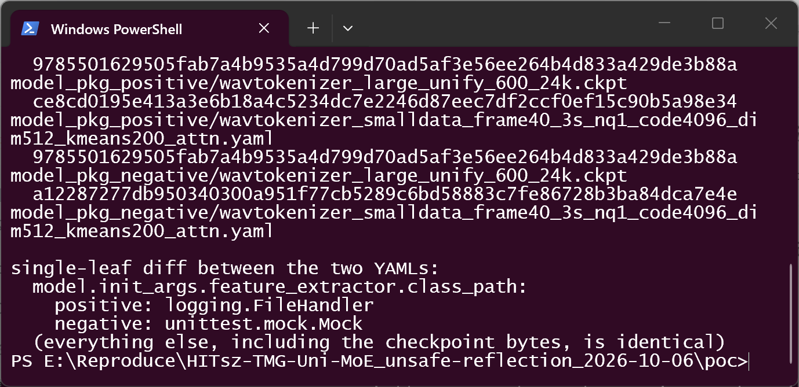
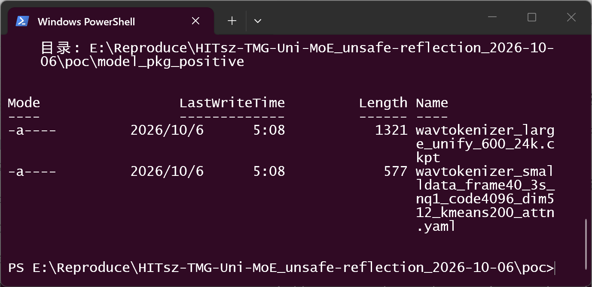
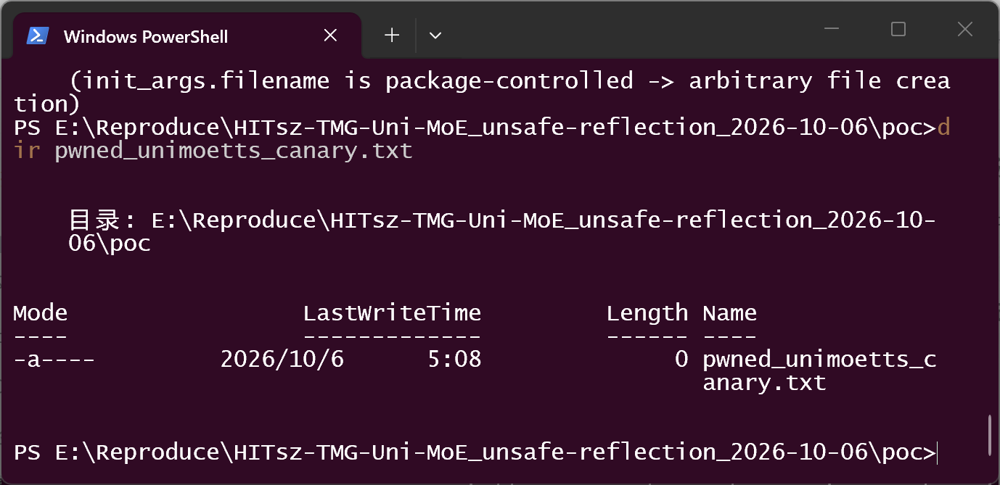
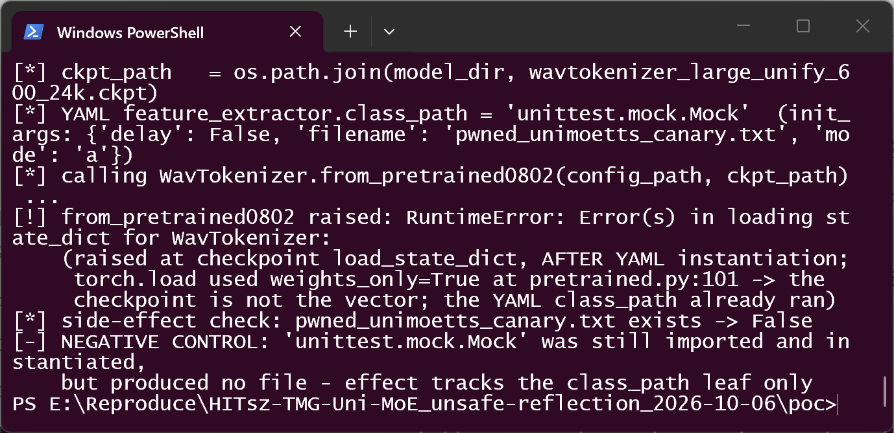
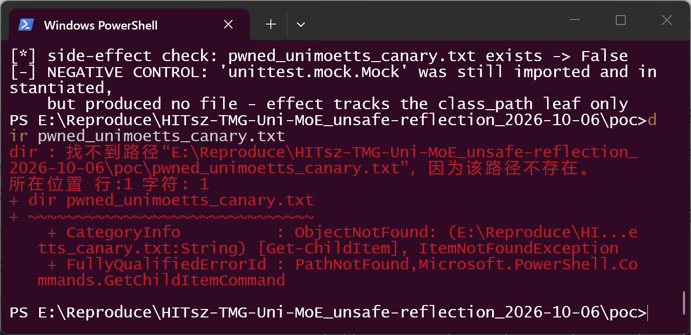
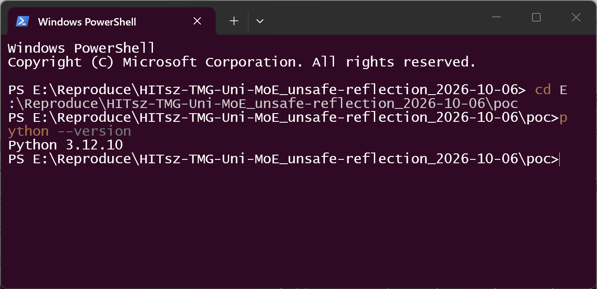
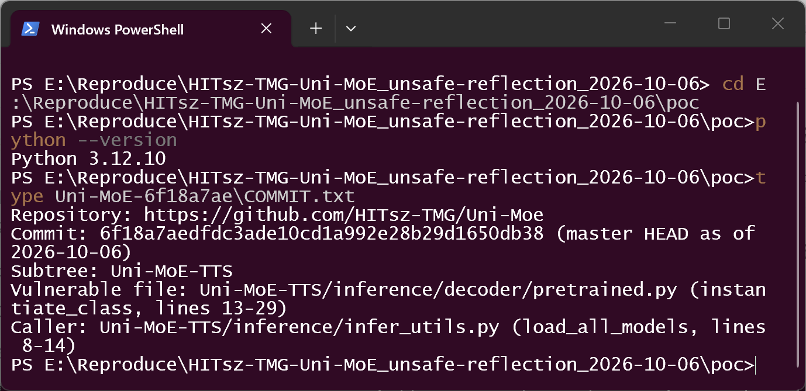

# Uni-MoE-TTS (HITsz-TMG/Uni-MoE) commit 6f18a7ae — Unsafe Reflection (CWE-470) in WavTokenizer YAML class_path instantiation

## Summary

HITsz-TMG Uni-MoE (Uni-MoE-TTS subtree) at master commit `6f18a7aedfdc` is
affected by an unsafe-reflection flaw in the WavTokenizer model loader. The
`class_path` string from the model package's YAML config is used verbatim as a
class locator: it is split, imported with `__import__()`, resolved with
`getattr()`, and called with attacker-controlled `init_args` keyword arguments.
A data-only model directory (one YAML plus one checkpoint loaded with
`weights_only=True`) is therefore sufficient to instantiate an arbitrary class
in the victim's Python environment at model load time; the demonstrated
primitive is arbitrary file creation via the standard-library class
`logging.FileHandler`. Victim interaction is limited to loading a crafted model
directory, e.g. one obtained from a model-sharing site.
CVSS v3.1 8.8 (High), `CVSS:3.1/AV:N/AC:L/PR:N/UI:R/S:U/C:H/I:H/A:H`.

## Affected Product

| Field | Value |
|---|---|
| Vendor | HITsz-TMG (Harbin Institute of Technology, Shenzhen — Text Mining Group) |
| Product | Uni-MoE (Uni-MoE-TTS component) |
| Affected versions | master @ commit `6f18a7aedfdc3ade10cd1a992e28b29d1650db38` (HEAD, dated 2026-08-06; verified 2026-10-06). No tagged releases exist, so all current consumers of the master branch are affected. |
| Component | `Uni-MoE-TTS/inference/decoder/pretrained.py` (`instantiate_class`, lines 13–29), reached via `from_hparams0802` (line 88) / `from_pretrained0802` (line 100), called by `Uni-MoE-TTS/inference/infer_utils.py` `load_all_models` (lines 8–14). Sibling copy of the same helper: `Uni-MoE-2/decoder/pretrained.py` lines 26–29. |
| Platform | Any OS with the project's Python environment (verified on Windows 10.0.26200 x64, Python 3.12.10, torch 2.12.0+cpu, torchaudio 2.11.0+cpu) |
| Vulnerability type | CWE-470: Use of Externally-Controlled Input to Select Classes or Code ("Unsafe Reflection") |

## Root Cause

**Location:** `Uni-MoE-TTS/inference/decoder/pretrained.py:13-29` (`instantiate_class`)

`WavTokenizer.from_pretrained0802(config_path, model_path)` first builds the
model from hyperparameters (`from_hparams0802`), which reads the package's YAML
with `yaml.safe_load` and then, at line 88, hands the `feature_extractor` entry
to `instantiate_class`:

```python
# Uni-MoE-TTS/inference/decoder/pretrained.py:13-29
def instantiate_class(args: Union[Any, Tuple[Any, ...]], init: Dict[str, Any]) -> Any:
    kwargs = init.get("init_args", {})
    if not isinstance(args, tuple):
        args = (args,)
    class_module, class_name = init["class_path"].rsplit(".", 1)
    module = __import__(class_module, fromlist=[class_name])   # attacker-controlled module
    args_class = getattr(module, class_name)                   # attacker-controlled attribute
    return args_class(*args, **kwargs)                         # instantiation w/ attacker kwargs
```

The defect: `class_path` and `init_args` are plain data inside the model
directory, but they are used **directly** as a class locator and constructor
arguments, with no allowlist and no namespace restriction (`yaml.safe_load`
itself is safe — the problem is what the *parsed values* are later used for).
`load_all_models()` in `Uni-MoE-TTS/inference/infer_utils.py` joins fixed file
names onto the model directory, so simply placing a crafted YAML next to the
checkpoint is enough:

```python
# Uni-MoE-TTS/inference/infer_utils.py:11-13
config_path = os.path.join(model_path,"wavtokenizer_smalldata_frame40_3s_nq1_code4096_dim512_kmeans200_attn.yaml")
model_path = os.path.join(model_path,"wavtokenizer_large_unify_600_24k.ckpt")
wavtokenizer = WavTokenizer.from_pretrained0802(config_path, model_path)
```

Note that the checkpoint is **not** the vector: the checkpoint is only loaded
after YAML instantiation and explicitly with `weights_only=True`
(`pretrained.py:101`), which the PoC keeps unchanged to prove this boundary.
The same unrestricted helper is duplicated in `Uni-MoE-2/decoder/pretrained.py`
(lines 26–29), so the fix should cover both copies.

## Proof of Concept

### Prerequisites

- The victim loads a Uni-MoE-TTS model directory through
  `load_all_models()` / `WavTokenizer.from_pretrained0802()` (normal use of the
  released TTS checkpoints, e.g. after downloading a model from a sharing site).
- No `.py` file, no plugin, no native library, and no shell sidecar is placed
  in the model directory — the package contains exactly two data files.

### Steps to Reproduce

1. Generate two model packages that are byte-identical except for a single YAML
   leaf (`model.init_args.feature_extractor.class_path`):
   `python make_poc.py` — positive arm sets it to `logging.FileHandler`
   (stdlib class that opens/creates a file at `init_args.filename`);
   negative arm sets it to `unittest.mock.Mock` (absorbs the same init_args as
   attributes, creates nothing). Both packages share the same checkpoint bytes
   (`torch.save({"state_dict": {}})` — an *empty* state dict).



2. Confirm the packages are data-only — each contains only the fixed YAML and
   checkpoint file names that `load_all_models()` joins onto the model dir:




3. Run the loader exactly as `load_all_models()` does —
   `python run_poc.py model_pkg_positive`. The harness first deletes any stale
   canary, prints the joined `config_path`/`ckpt_path`, and calls
   `WavTokenizer.from_pretrained0802()`:


4. Confirm the side effect landed on disk — the file name came from the
   package-controlled `init_args.filename`, at an arbitrary attacker-chosen
   path:



5. Run the negative control — `python run_poc.py model_pkg_negative`. The
   machinery still imports and instantiates the class named in the YAML, but
   with `unittest.mock.Mock` nothing is created:



6. Confirm absence on disk:



### Expected vs Actual

- Expected: model loading only constructs the WavTokenizer implementation's own
  components, regardless of what the package's YAML declares.
- Actual: the `class_path` leaf selects any class reachable in the victim's
  Python environment and instantiates it with package-controlled keyword
  arguments at load time; with `logging.FileHandler` this creates/opens a file
  at a package-chosen path before any weight is touched.

### Sanitized PoC input

```yaml
# model_pkg_positive/wavtokenizer_smalldata_frame40_3s_nq1_code4096_dim512_kmeans200_attn.yaml
model:
  class_path: decoder.pretrained.WavTokenizer
  init_args:
    backbone:
      class_path: decoder.models.VocosBackbone
      init_args: {dim: 512, input_channels: 128, intermediate_dim: 1536, num_layers: 8}
    feature_extractor:
      class_path: logging.FileHandler        # <- the single manipulated leaf
      init_args:
        delay: false
        filename: pwned_unimoetts_canary.txt # <- attacker-chosen path
        mode: a
    head:
      class_path: decoder.heads.ISTFTHead
      init_args: {dim: 512, hop_length: 240, n_fft: 1024, padding: same}
```

Negative control is identical except
`class_path: unittest.mock.Mock`. Sample SHA-256 (see `poc/SHA256SUMS.txt`):

```text
9785501629505fab7a4b9535a4d799d70ad5af3e56ee264b4d833a429de3b88a  model_pkg_positive/wavtokenizer_large_unify_600_24k.ckpt
ce8cd0195e413a3e6b18a4c5234dc7e2246d87eec7df2ccf0ef15c90b5a98e34  model_pkg_positive/wavtokenizer_smalldata_frame40_3s_nq1_code4096_dim512_kmeans200_attn.yaml
9785501629505fab7a4b9535a4d799d70ad5af3e56ee264b4d833a429de3b88a  model_pkg_negative/wavtokenizer_large_unify_600_24k.ckpt   (identical bytes)
a12287277db950340300a951f77cb5289c6bd58883c7fe86728b3ba84dca7e4e  model_pkg_negative/wavtokenizer_smalldata_frame40_3s_nq1_code4096_dim512_kmeans200_attn.yaml
```

Environment evidence and pinned commit:





Validation boundary, stated honestly: the harness drives the
`WavTokenizer.from_pretrained0802()` sink directly with the exact
`os.path.join` lines from `infer_utils.py:11-13`; the full `load_all_models()`
additionally loads `speech_gen_ep2.bin` and the `qwen_pp` processor first,
which are multi-GB assets not needed to reach this sink. The demonstrated
primitive is arbitrary file creation; impact beyond that depends on gadget
classes available in the victim environment and was not further explored. The
load ends with a `RuntimeError` in both arms because the PoC checkpoint is
deliberately empty — this occurs strictly after YAML instantiation and does not
affect the conclusion. Verified once on Windows (Python 3.12.10, torch
2.12.0+cpu) against the pinned commit, with both arms re-run in front of a real
terminal on 2026-10-06.

## Impact

- Confidentiality: High — gadget-dependent; arbitrary class instantiation with
  controlled kwargs in a torch/transformers environment can reach classes that
  read and exfiltrate data (conservative assumption, see CVSS note).
- Integrity: High — demonstrated: file creation/overwriting at an
  attacker-chosen path (`logging.FileHandler` `filename`); other gadget classes
  can modify more.
- Availability: High — gadget-dependent (resource-consuming constructors,
  clobbered files); also conservative.
- Scope: code selection / instantiation inside the victim's own Python process
  (no sandbox boundary crossed — Scope Unchanged).

## Attack Vector and Severity (CVSS v3.1)

| Metric | Value | Rationale |
|---|---|---|
| Attack Vector | N (Network) | Crafted model packages are distributed over the network (model hubs, file shares); no special network position needed |
| Attack Complexity | L (Low) | Single YAML leaf; no race, no special config; standard use of the loader |
| Privileges Required | N (None) | Attacker only needs to publish a model package |
| User Interaction | R (Required) | Victim must load the malicious model directory |
| Scope | U (Unchanged) | Instantiation happens in the victim's own process/security context |
| Confidentiality | H (High) | Gadget-dependent read/exfil potential (assumption flagged) |
| Integrity | H (High) | Arbitrary file creation demonstrated |
| Availability | H (High) | Gadget-dependent (conservative assumption flagged) |

```
Score: 8.8 (High)
Vector: CVSS:3.1/AV:N/AC:L/PR:N/UI:R/S:U/C:H/I:H/A:H
```

> Assumption note: only arbitrary file creation was demonstrated end-to-end.
> C/H and A/H are conservative choices per the "score what you cannot rule out"
> rule, reflecting that the primitive selects from *all* classes importable in
> the victim environment (typical Uni-MoE installations include torch,
> transformers, etc.). Scoring only the demonstrated primitive would lower the
> severity; the flagged assumption should be revisited during triage.

## Remediation

- Restrict `instantiate_class` (both copies: `Uni-MoE-TTS/inference/decoder/pretrained.py:13`
  and `Uni-MoE-2/decoder/pretrained.py:26`) to an explicit allowlist of the
  decoder's own component classes, or resolve `class_path` only inside the
  project's own package namespace (e.g. require the prefix `decoder.` /
  `encoder.` and reject anything else with a clear error), rather than
  `__import__` on an arbitrary dotted path.
- As defense in depth, validate model-directory configs at ingestion time
  (reject unknown `class_path` values before any load), and document that model
  directories are trusted input.
- Workaround until patched: only load WavTokenizer packages whose YAML
  `class_path` values have been manually reviewed.

## Timeline

| Date | Event |
|---|---|
| 2026-08-06 | Last commit to date on master (`6f18a7ae`), containing the vulnerable code |
| 2026-10-06 | Vulnerability analysis and reproduction verified against pinned commit |
| 2026-10-06 | Report prepared; upstream private channel still unavailable (issue #35 requesting one has been open and unanswered since 2026-07-08) |
| [pending] | Report sent to the maintainer |
| [pending] | Maintainer acknowledged |
| [pending] | Fix released |

## References

- Source repository: https://github.com/HITsz-TMG/Uni-MoE
- Pinned commit: https://github.com/HITsz-TMG/Uni-MoE/tree/6f18a7aedfdc3ade10cd1a992e28b29d1650db38
- Vulnerable file: https://github.com/HITsz-TMG/Uni-MoE/blob/6f18a7aedfdc3ade10cd1a992e28b29d1650db38/Uni-MoE-TTS/inference/decoder/pretrained.py
- Caller: https://github.com/HITsz-TMG/Uni-MoE/blob/6f18a7aedfdc3ade10cd1a992e28b29d1650db38/Uni-MoE-TTS/inference/infer_utils.py
- Prior request for a private channel: https://github.com/HITsz-TMG/Uni-MoE/issues/35
- CWE: https://cwe.mitre.org/data/definitions/470.html
- Vendor advisory: [none]
- Upstream report: [pending publication]

## Disclaimer

This report is provided for defensive and coordination purposes. It contains no
ready-to-run exploit beyond the minimum reproduction information, and no
sensitive infrastructure details. Do not disclose it publicly before the
maintainer has had a reasonable window to fix the issue.

## Screenshot Checklist

All screenshots are real Windows PowerShell terminal windows captured on
2026-10-06 during the actual reproduction (Windows 10.0.26200 x64, Python
3.12.10, torch 2.12.0+cpu; working dir = `poc/` of this folder).

| File | Content |
|---|---|
| screenshots/01-python-env.png | Capture environment: `python --version` → Python 3.12.10 |
| screenshots/02-pinned-commit.png | Pinned source provenance (`poc/Uni-MoE-6f18a7ae/COMMIT.txt`: commit 6f18a7aedfdc…, vulnerable file and caller) |
| screenshots/03-make-poc-packages.png | `make_poc.py` builds both packages; SHA-256 printed; checkpoints identical; single-leaf diff shown |
| screenshots/04-positive-package.png | `dir model_pkg_positive`: data-only package (2 files) |
| screenshots/05-negative-package.png | `dir model_pkg_negative`: identical layout, only the YAML differs |
| screenshots/06-positive-effect.png | Positive arm: `logging.FileHandler` instantiated at load time, canary created; RuntimeError shown to occur after instantiation with `weights_only=True` checkpoint |
| screenshots/07-canary-on-disk.png | `dir pwned_unimoetts_canary.txt`: file exists on disk (0 bytes) |
| screenshots/08-negative-control.png | Negative arm: `unittest.mock.Mock` instantiated, canary exists → False |
| screenshots/09-negative-no-canary.png | `dir pwned_unimoetts_canary.txt`: path does not exist after the negative run |
