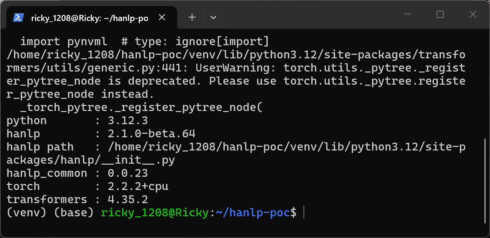
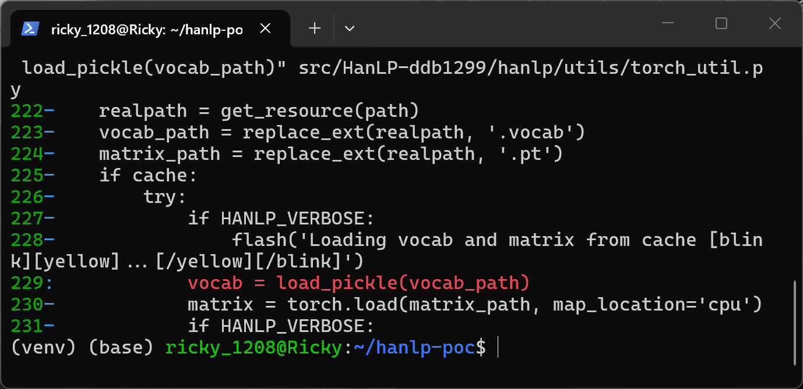
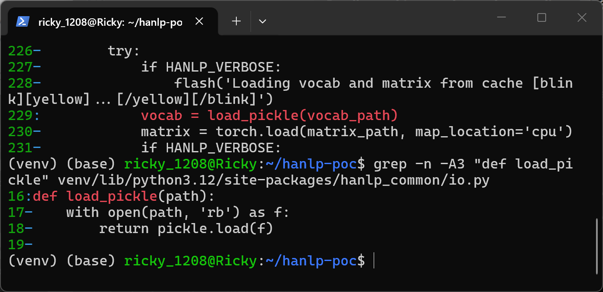
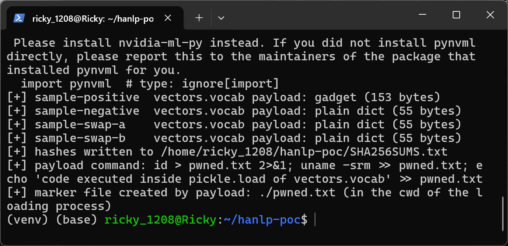
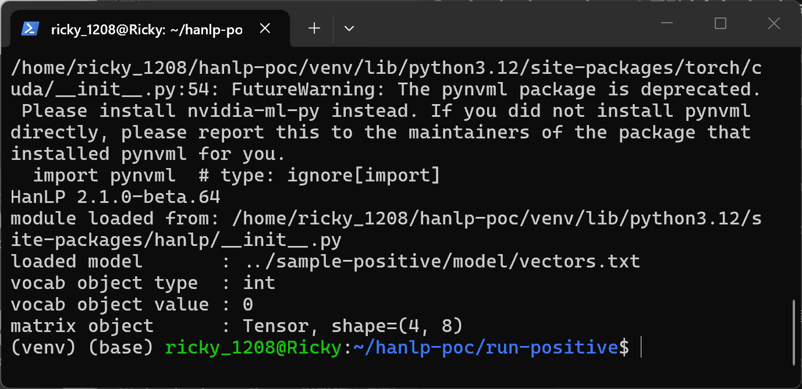
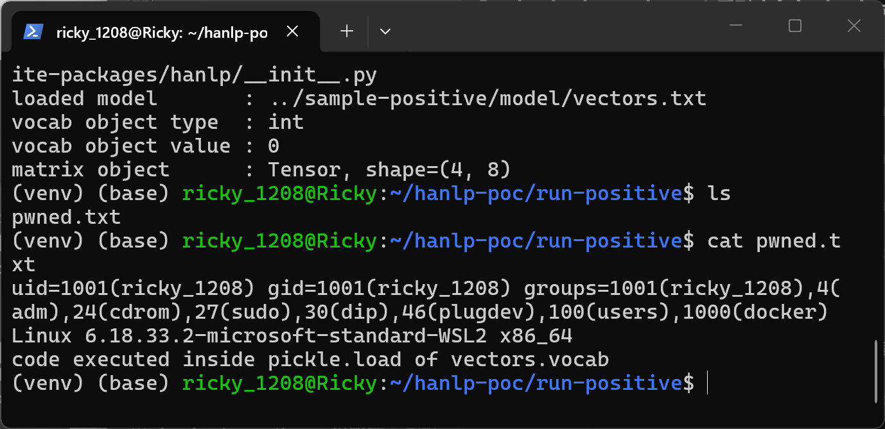
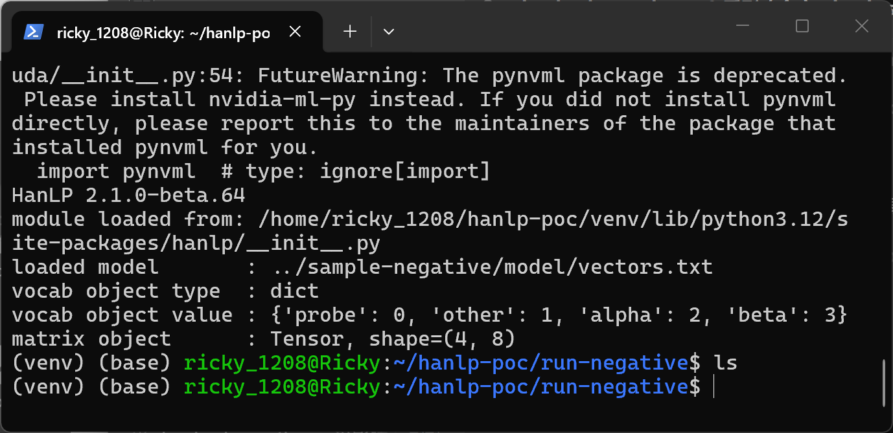
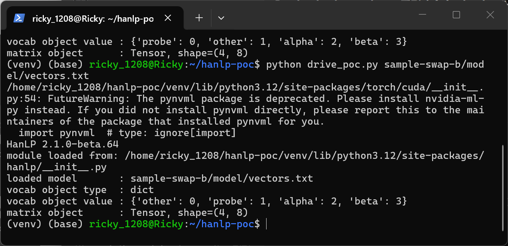

# HanLP 2.1.0-beta.64 (commit ddb1299) — Insecure Deserialization (CWE-502) in word2vec embedding cache loading (.vocab)

## Summary

hankcs HanLP 2.1.0-beta.64 (source commit `ddb1299`) automatically derives same-named cache files `vectors.vocab` and `vectors.pt` next to a word2vec-style embedding text file and, when `cache=True` (the default), deserializes the whole `vectors.vocab` file with unrestricted `pickle.load` through `hanlp_common.io.load_pickle`. The `.vocab` file is a complete, bare pickle: any object with a `__reduce__` gadget executes arbitrary code during model loading, before any vocabulary data is returned. An attacker who can supply or modify an embedding model directory (shared model archive, cloned model repository, dataset attachment) achieves arbitrary command execution with the privileges of the process that loads the embedding. This report was prepared from an internal triage that had been filed under the working title "hanlp classpath RCE"; that hypothesis (a `classpath` config field reaching reflective calls) was **not** substantiated by testing and is not claimed here — the verified mechanism is direct deserialization of the entire `.vocab` pickle file, classified as CWE-502.

## Affected Product

| Field | Value |
|---|---|
| Vendor | hankcs (HanLP project) |
| Product | HanLP |
| Affected versions | 2.1.0-beta.64, git commit `ddb1299bddff079e447af52ec12549c50636bfa8` (2023-11-28); the same pattern is present in the `load_word2vec()` `.pkl` cache path of the same file and is expected to affect earlier 2.x releases [unknown exact range] |
| Component | `hanlp/utils/torch_util.py` → `load_word2vec_as_vocab_tensor()`; sink helper `hanlp_common/io.py` → `load_pickle()` (hanlp-common 0.0.23) |
| Platform | OS-independent (pure Python deserialization); verified on Linux Ubuntu 24.04 x86_64 (WSL2) |
| Vulnerability type | CWE-502: Insecure Deserialization |

## Root Cause

**Location:** `hanlp/utils/torch_util.py:221-245` (`load_word2vec_as_vocab_tensor`), sink call at line 229; helper `hanlp_common/io.py:16-18` (`load_pickle`, hanlp-common 0.0.23).

When a component needs a pretrained word2vec-style embedding, HanLP resolves the embedding text file (e.g. `model/vectors.txt`), then unconditionally derives two sibling cache paths by extension substitution and, if `cache=True` (the default), restores both with unsafe loaders — `pickle.load` for the vocab and `torch.load` for the matrix:

```python
def load_word2vec_as_vocab_tensor(path, delimiter=' ', cache=True) -> Tuple[Dict[str, int], torch.Tensor]:
    realpath = get_resource(path)
    vocab_path = replace_ext(realpath, '.vocab')      # line 223: same-named .vocab is auto-derived
    matrix_path = replace_ext(realpath, '.pt')
    if cache:
        try:
            ...
            vocab = load_pickle(vocab_path)           # line 229: whole file -> pickle.load, no restriction
            matrix = torch.load(matrix_path, map_location='cpu')
            ...
            return vocab, matrix
        except IOError:
            pass
    ...
    if cache:
        save_pickle(vocab, vocab_path)                # line 242: first load auto-writes these caches
```

The helper performs a raw deserialization of the complete file with no type restriction, no integrity binding to the source text file, and no allow-list:

```python
def load_pickle(path):
    with open(path, 'rb') as f:
        return pickle.load(f)
```

Callers that reach the sink through public embedding APIs at this commit include `GazetteerEmbedding.__init__` (`hanlp/layers/embeddings/word2vec.py:333`) and `index_word2vec_with_vocab` / `build_word2vec_with_vocab` (`hanlp/layers/embeddings/util.py:36`), which back `Word2VecEmbedding`. Because line 242 (`save_pickle(vocab, vocab_path)`) writes the `.vocab`/`.pt` pair on first load, released embedding model directories characteristically ship exactly this layout — `config.json`, `vectors.txt`, `vectors.vocab`, `vectors.pt` — so a `.vocab` present in any model directory obtained from another party is a complete attacker-controlled pickle that HanLP will execute on load. The pickle is read from the beginning of the file as a whole object; there is no "classpath field" or configuration indirection involved.

## Proof of Concept

### Prerequisites

- A HanLP installation at the pinned commit (`pip install --no-deps .` of the `ddb1299` checkout) with runtime dependencies (torch, transformers, hanlp-common 0.0.23).
- A victim that loads an embedding model directory obtained from an attacker, or any workflow pointing `Word2VecEmbedding`/`GazetteerEmbedding` at an attacker-writable path. Loading a model file is the required user action.

### Steps to Reproduce

1. Verify the environment: the HanLP version under test imports from the pinned source install.



This screenshot proves the reproduction environment: WSL Ubuntu 24.04, Python 3.12.3, HanLP 2.1.0-beta.64 installed from the `ddb1299` checkout into the venv, hanlp-common 0.0.23 (the package providing `load_pickle`).

2. Confirm the vulnerable code in the pinned checkout: line 223 derives the same-named `.vocab`, line 229 deserializes it.



This screenshot proves the defect location: `vocab_path = replace_ext(realpath, '.vocab')` and `vocab = load_pickle(vocab_path)` in `load_word2vec_as_vocab_tensor`.

3. Confirm the sink helper is an unrestricted `pickle.load` of the whole file.



This screenshot proves the sink: `hanlp_common/io.py:16-18` opens the file `rb` and returns `pickle.load(f)`.

4. Build four model directories with identical `config.json`, `vectors.txt` and `vectors.pt`, differing only in the pickle payload inside `vectors.vocab`: positive (an `os.system` reduce gadget), negative control (the plain `{token: index}` dict HanLP itself would cache), and the original triage pair (same dict with only the `probe`/`other` indexes swapped). SHA256SUMS of all files is recorded (see Screenshot Checklist for hashes).



This screenshot proves the sample set: the four model dirs share identical tensors and text, only `vectors.vocab` differs (gadget 153 bytes vs plain dict 55 bytes).

5. Trigger: from a fresh working directory, load the positive model the way HanLP does.

```bash
mkdir run-positive && cd run-positive
python ../drive_poc.py ../sample-positive/model/vectors.txt
```

`drive_poc.py` calls exactly `hanlp.utils.torch_util.load_word2vec_as_vocab_tensor(path)`.



This screenshot proves the payload executed during loading: the "vocab" object returned by HanLP is `int 0` — the return value of `os.system` from the reduce gadget — instead of a vocabulary dict.

6. Verify code execution landed: the gadget's command wrote a marker file into the loader's working directory.



This screenshot proves arbitrary command execution inside `pickle.load` of `vectors.vocab`: `pwned.txt` exists and contains the output of `id` (run as the loading user, uid 1001) and `uname`, plus the marker line `code executed inside pickle.load of vectors.vocab`.

7. Negative control: the identical directory whose `vectors.vocab` contains the plain dict pickle loads cleanly and creates no file.



This screenshot proves the isolation: only the pickle payload in `.vocab` makes the difference — dict vocab `{'probe': 0, 'other': 1, 'alpha': 2, 'beta': 3}`, matrix loaded, and `ls` shows no `pwned.txt`.

8. Data-influence control (the original triage experiment): two benign caches that differ only in the `probe`/`other` index mapping change the vocabulary returned to downstream vector selection.



This screenshot proves the data-level effect observed during triage: `sample-swap-a` returns `{'probe': 0, ...}` while `sample-swap-b` returns `{'other': 0, 'probe': 1, ...}` — swap-pair caches alter results, but code execution requires only the positive gadget above.

### Expected vs Actual

- Expected: cache files beside an embedding text file are data files; a modified or attacker-supplied `vectors.vocab` must not execute code (at worst it should be rejected as corrupt).
- Actual: the whole `vectors.vocab` is restored with unrestricted `pickle.load`; an embedded `__reduce__` gadget runs `os.system` during loading with the victim's privileges, and the gadget's return value is silently used as the embedding vocabulary.

### Sanitized PoC input

The positive `vectors.vocab` is a 153-byte pickle equivalent to (no secrets or infrastructure involved; the payload command only writes a local marker file):

```python
import os, pickle

class RunShellCommand:
    def __reduce__(self):
        return os.system, ("id > pwned.txt 2>&1; uname -srm >> pwned.txt; "
                           "echo 'code executed inside pickle.load of vectors.vocab' >> pwned.txt",)

with open("model/vectors.vocab", "wb") as f:
    f.write(pickle.dumps(RunShellCommand()))
```

Full sample builder and driver: `poc/make_poc.py`, `poc/drive_poc.py` in this report's folder; hashes in `poc/SHA256SUMS.txt`.

## Impact

- Confidentiality: High — the gadget runs with the victim's privileges and can exfiltrate arbitrary data accessible to the process.
- Integrity: High — arbitrary commands can be executed and arbitrary files modified.
- Availability: High — the payload can delete data or disrupt the loading process.
- Scope: code execution in the context of the process loading the model (typically the user's training/serving environment); model-supply-chain attacks become remote in effect when models are distributed over the network.

## Remediation

- Replace `pickle` for vocab caches with a non-executable format (JSON or the existing `Vocab` to/from json facilities), or implement a `pickle.Unpickler` subclass with `find_class` restricted to a minimal allow-list (builtin dict/list/int/str, numpy scalars) — mirroring `torch.load(..., weights_only=True)` semantics for the `.pt` sibling, which is likewise loaded unrestricted at line 230.
- Bind caches to the source text file: store `sha256(vectors.txt)` inside the cache header and reject mismatches, so foreign or tampered `.vocab`/`.pt` files are ignored and rebuilt from the text.
- Document that model directories are executable code until this is fixed (as done for `trust_remote_code` in other ecosystems).


## References

- Source repository: https://github.com/hankcs/HanLP
- Pinned commit: https://github.com/hankcs/HanLP/blob/ddb1299bddff079e447af52ec12549c50636bfa8/hanlp/utils/torch_util.py (lines 221-245)
- Sink helper: hanlp-common 0.0.23, `hanlp_common/io.py` lines 16-18
- CWE: https://cwe.mitre.org/data/definitions/502.html
- Upstream report: [pending publication]
