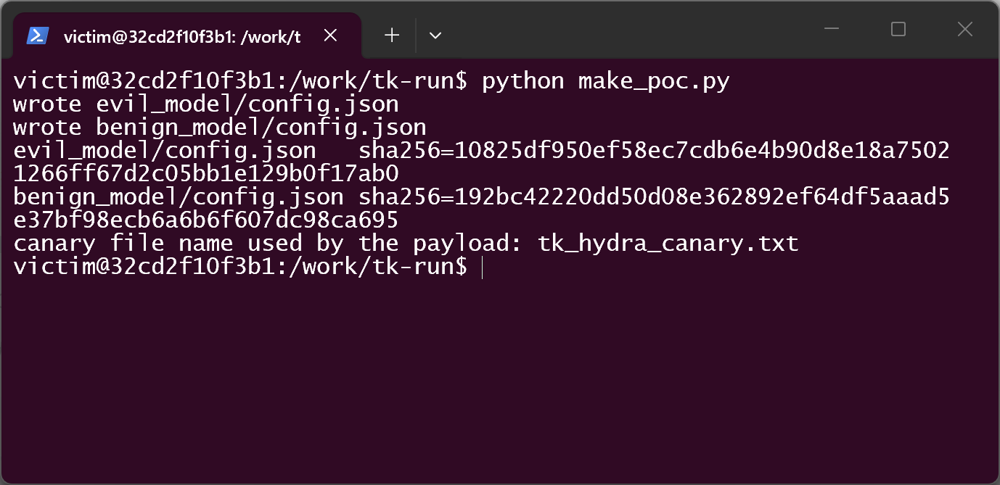
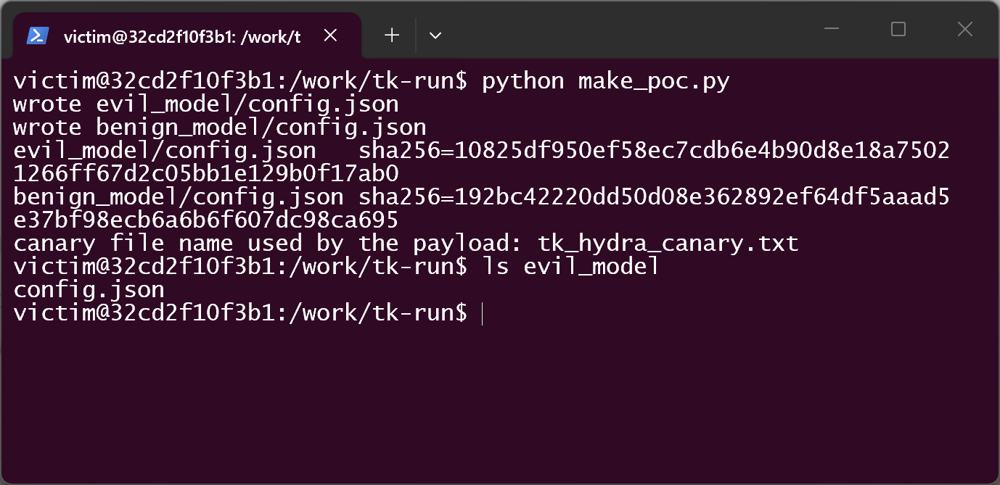
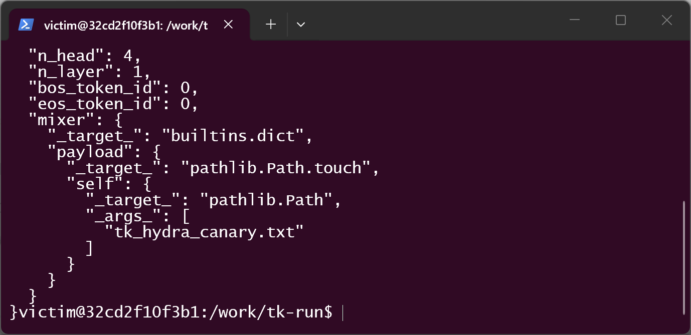
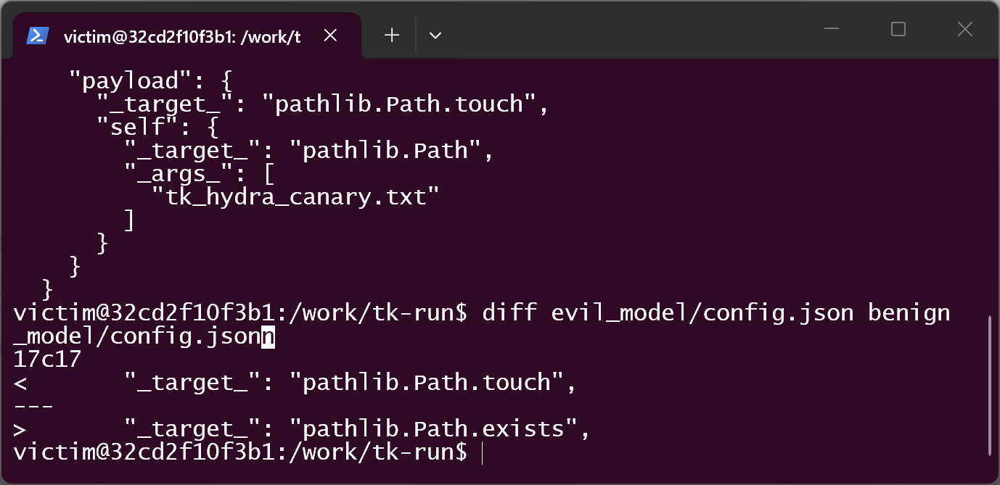
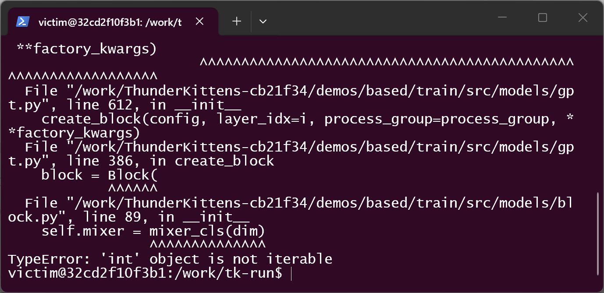
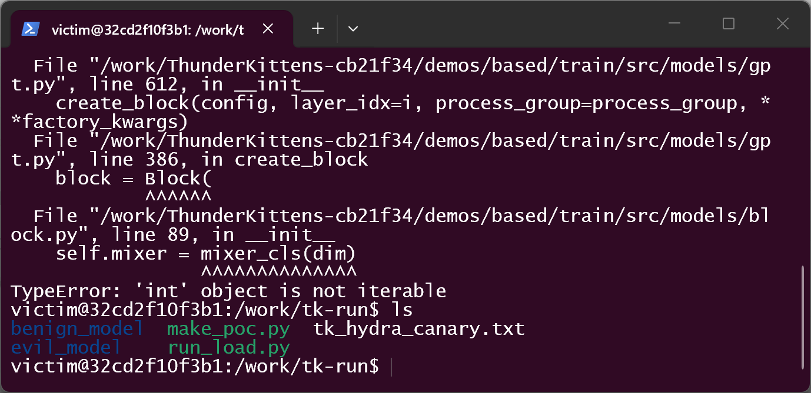
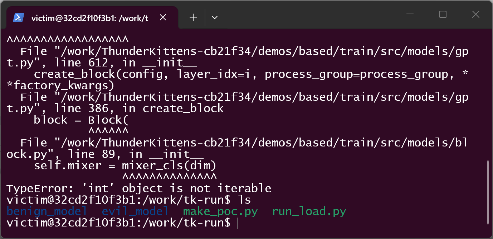

# ThunderKittens `demos/based` @ commit cb21f34 — Arbitrary Callable Dispatch via Hydra `_target_` in Hugging Face `config.json` During Model Construction

## Summary

HazyResearch ThunderKittens (commit `cb21f34`, and still present on `main` @ `67845f5`) is affected by a code-injection flaw in the Hugging Face model-consumption path of its `demos/based` demo family (`GPTLMHeadModel.from_pretrained_hf`). The `mixer` entry of a model's `config.json` is passed verbatim to `hydra.utils.instantiate`, which recursively instantiates attacker-nested `_target_` fields. Any callable importable in the victim's environment (e.g. `pathlib.Path.touch`, `subprocess.Popen`) is resolved and invoked with attacker-chosen arguments while the model object is being constructed — **before a single byte of the weight file is read**. An attacker only needs to publish or share a model directory whose `config.json` carries the payload; the victim triggers it by the documented act of loading the model. CVSS v3.1 8.8 (High).

## Affected Product

| Field | Value |
|---|---|
| Vendor | HazyResearch |
| Product | ThunderKittens (`demos/based` demo family: Based model training / `generate_based.py` / `document_ie_based.py`) |
| Affected versions | commit `cb21f34cdd99996e0aade8a4de45cb5b418fc7f8` (2026-09-10, pinned for this report); sink verified still present on `main` @ `67845f5fa48d05343dbbc1ba1403f11061f08d2d` (probed 2026-10-07); the repository has **no tagged releases** (0 releases / 0 tags), so no fixed version exists |
| Component | `demos/based/train/src/models/gpt.py` — `create_mixer_cls`, sink at lines 98–104; entry point `GPTLMHeadModel.from_pretrained_hf` at line 469 |
| Platform | any OS with the demo's Python dependencies (pure Python path; verified on Linux, python 3.12) |
| Vulnerability type | CWE-94: Code Injection |

## Root Cause

**Location:** `demos/based/train/src/models/gpt.py:98-104` (`create_mixer_cls`), reached from `GPTLMHeadModel.from_pretrained_hf` (`gpt.py:469`)

`create_mixer_cls` reads the `mixer` attribute that `GPT2Config` stored from the model's `config.json` and hands the dict straight to Hydra without any validation of `_target_`:

```python
# demos/based/train/src/models/gpt.py:94-104 (commit cb21f34)
wds = ['slide', 'sliding', 'window']
if any(wd in value['_target_'] for wd in wds): # and 'do_update' in value:
    value = sliding_window_additions(value, config, layer_idx=layer_idx, process_group=process_group, device=device)

mixer_cls = hydra.utils.instantiate(
    value,
    _partial_=True,
    device=device,
    dtype=dtype,
    layer_idx=layer_idx,
)
```

The substring test on line 95 is not a security check — it only rewrites sliding-window configs; any `_target_` that does not contain those words falls through to the instantiate call. Hydra resolves the dotted `_target_` path through the victim environment's import machinery and, because recursive instantiation is on by default, **nested** `_target_` nodes are instantiated as well, each with attacker-chosen arguments.

The full attacker-controlled data flow (line numbers per commit `cb21f34`):

1. `GPTLMHeadModel.from_pretrained_hf(model_name)` — `gpt.py:469`
2. `config_data = load_config_hf(model_name)` — `gpt.py:471`; `train/src/utils/hf.py:9-11` reads `config.json` with a plain `json.load` (the parser is safe — no evaluation happens here)
3. `config = GPT2Config(**config_data)` — `gpt.py:472`; unknown keys such as `mixer` become config attributes unchanged
4. `model = cls(config, device=device, **kwargs)` — `gpt.py:500` → `GPTLMHeadModel.__init__` (`gpt.py:781`) → `GPTModel.__init__` (`gpt.py:612`) → `create_block` (`gpt.py:386`) → `create_mixer_cls` (`gpt.py:70`) → `hydra.utils.instantiate(value, ...)` (`gpt.py:98`) — **payload executes here**
5. `state_dict = load_state_dict_hf(model_name, ...)` — `gpt.py:501` — weight loading happens **after** construction; in the proof of concept below it is never reached (no weight file exists at all)

Why the usual mitigating framings do not apply: the trigger is not weight-file deserialization (`torch.load` at `gpt.py:501` is never reached, and the artifact carries no `pytorch_model.bin`); there is no Python/native/executable sidecar in the model directory; and the flaw is not inside the JSON parser (which stays safe). The execution primitive comes from the victim environment's own code — Hydra plus whatever module the `_target_` string names — fired as a precondition of model *construction*. A published model repository (a `config.json` is mandatory for this loader) is sufficient to carry it.

## Proof of Concept

### Prerequisites

- The victim loads a model directory with the demo's documented loader, e.g.
  `GPTLMHeadModel.from_pretrained_hf(<attacker model dir or HF repo id>)` — this is exactly what `demos/based/generate_based.py:10` and `demos/based/document_ie_based.py:18` do.
- The demo's Python dependencies are installed (torch, transformers, hydra-core, einops; `triton` only because the no-flash-attn RMSNorm fallback imports it). No GPU is needed.
- The attacker needs write access to nothing but the model directory they publish.

### Steps to Reproduce

1. Generate the two config-only model directories with `poc/make_poc.py`. Both arms share the same outer target (`builtins.dict`) and the same nested `pathlib.Path` parameter; the **only** differing leaf field is `mixer.payload._target_`:
   - `evil_model` → `pathlib.Path.touch` (side effect: creates a canary file)
   - `benign_model` → `pathlib.Path.exists` (pure check, no side effect)

   

2. Confirm the artifact is a plain model directory: a single `config.json`, no weights, no Python/native/executable sidecar.

   

3. The attacker-controlled `mixer` block inside `evil_model/config.json`:

   

4. Differential proof that the two arms differ in exactly one leaf field:

   

5. Trigger: run the victim-side loader on the malicious directory.

   

6. Effect: the canary file named by the nested `pathlib.Path` argument now exists in the victim's working directory — created by `pathlib.Path.touch`, dispatched from `config.json` before any weight was read.

   

7. Negative control: delete the canary and load `benign_model`, identical in every field except the one leaf target. The same benign TypeError is raised (both arms return a `functools.partial` around `builtins.dict` that cannot be called by `Block.__init__`), but **no file is created** — isolating the nested `_target_` dispatch as the discriminator.

   

   

### Expected vs Actual

- Expected: consuming a model directory parses static configuration; no attacker-named callable runs, regardless of JSON content.
- Actual: `mixer.payload._target_` (`pathlib.Path.touch`) is resolved and executed with attacker-chosen arguments (`pathlib.Path("tk_hydra_canary.txt")`) during model construction, before weight loading. In both arms the loader finally aborts with `TypeError: 'int' object is not iterable` at `block.py:89` (the `functools.partial(builtins.dict, ...)` placeholder being called) — after the payload side effect has already fired in the positive arm.

### Sanitized PoC input

```json
{
  "mixer": {
    "_target_": "builtins.dict",
    "payload": {
      "_target_": "pathlib.Path.touch",
      "self": {
        "_target_": "pathlib.Path",
        "_args_": ["tk_hydra_canary.txt"]
      }
    }
  }
}
```

Negative control replaces only the leaf `mixer.payload._target_` with `pathlib.Path.exists`. The demonstrated callables are benign canaries chosen per responsible-disclosure norms; the same dispatch resolves any importable callable (e.g. modules such as `subprocess`, `os`, `socket`) with attacker-controlled arguments, in the victim process, before weights load.

## Impact

- Confidentiality: High — the dispatched callable runs in the victim process and can be any importable code (readers, network exfiltration, environment inspection) with attacker-chosen arguments.
- Integrity: High — write-primitive callables (file creation demonstrated via `pathlib.Path.touch`; arbitrary writes equally reachable) execute under the victim's privileges.
- Availability: High — the invoked code can terminate, hang, or corrupt the process; even the benign demo payload leaves the loader in an aborting state.
- Scope: code execution during model consumption (config-driven dispatch), reached before any weight deserialization.

## Attack Vector and Severity (CVSS v3.1)

| Metric | Value | Rationale |
|---|---|---|
| Attack Vector | N | The artifact is consumed by repo id / model name — the canonical path is a Hugging Face repository fetched over the network. (If the directory is shared purely offline, AV:L applies, giving 7.8 High; we keep the network variant as the more conservative primary.) |
| Attack Complexity | L | No special conditions; default configuration of the demo loader. |
| Privileges Required | N | The attacker needs no account or privilege on the victim side; publishing a model repo suffices. |
| User Interaction | R | The victim must load the model directory (the loader's documented use). |
| Scope | U | Impact stays in the victim process/security authority. |
| Confidentiality | H | Arbitrary callable execution with arbitrary arguments. |
| Integrity | H | Arbitrary callable execution with arbitrary arguments. |
| Availability | H | Process termination/hang is directly reachable. |

```
Score: 8.8 (High)
Vector: CVSS:3.1/AV:N/AC:L/PR:N/UI:R/S:U/C:H/I:H/A:H
```

## Remediation

- Validate `mixer['_target_']` (and every nested `_target_`) against a first-party allowlist / registry of known mixer classes before calling `hydra.utils.instantiate`, failing closed; the config side already names its own mixers, so a registry keyed by short tag (as `alt_mixer`/`alt_mixer_2` dispatch does elsewhere in the file) is the natural shape.
- Alternatively stop feeding raw config dicts to `hydra.utils.instantiate` and resolve mixers with first-party factory code only.
- Document that a ThunderKittens model directory is executable content; treat `config.json` like code, not data.

## Timeline

| Date | Event |
|---|---|
| 2026-10-07 | Vulnerability discovered; reproducibility verified on pinned commit `cb21f34` |
| 2026-10-07 | Report prepared |
| [pending] | Report sent to the maintainer |
| [pending] | Maintainer acknowledged |
| [pending] | Fix released |

## References

- Source repository: https://github.com/HazyResearch/ThunderKittens
- Pinned commit: https://github.com/HazyResearch/ThunderKittens/tree/cb21f34cdd99996e0aade8a4de45cb5b418fc7f8
- Vulnerable file at pinned commit: https://github.com/HazyResearch/ThunderKittens/blob/cb21f34cdd99996e0aade8a4de45cb5b418fc7f8/demos/based/train/src/models/gpt.py (L94-L104)
- Upstream report: [pending publication]
- CWE: https://cwe.mitre.org/data/definitions/94.html
- Vendor advisory: [none]

## Disclaimer

This report is provided for defensive and coordination purposes. It contains no
ready-to-run exploit beyond the minimum reproduction information, and no sensitive
infrastructure details. Do not disclose it publicly before the maintainer has had a
reasonable window to fix the issue.

## Screenshot Checklist

All screenshots are real terminal windows (Windows Terminal → WSL2 Kali → Docker container `python:3.12-slim`, non-root user), captured 2026-10-07 during the reproduction documented in this report.

| File | Content |
|---|---|
| screenshots/01-kali-env.png | Repro host shell: WSL2 Kali prompt in the PoC working directory; only `make_poc.py` and `run_load.py` present (pristine state) |
| screenshots/02-container-entry.png | `docker run --rm -it -v ~/poc-work:/work -w /work tk-poc-env bash` — victim-side container entered as non-root `victim` |
| screenshots/03-env-python.png | `python --version` → Python 3.12.15 inside the container |
| screenshots/04-versions.png | Dependency versions: torch 2.14.1+cpu, transformers 4.40.0, hydra-core 1.3.2, omegaconf 2.3.1, einops 0.8.2, triton 3.8.0 |
| screenshots/05-make-poc.png | `python make_poc.py`: two config-only model directories + sha256 hashes (evil `10825df9…`, benign `192bc422…`) |
| screenshots/06-evil-tree.png | `ls evil_model`: only `config.json` — no weight file, no code sidecar |
| screenshots/07-evil-config.png | Attacker-controlled `mixer` block of the positive sample |
| screenshots/08-config-diff.png | `diff` of the two configs: single differing line 17 (`pathlib.Path.touch` vs `pathlib.Path.exists`) |
| screenshots/09-evil-load.png | Positive trigger: `from_pretrained_hf` aborts with `TypeError` at `block.py:89` after the payload already executed |
| screenshots/10-canary-landed.png | `tk_hydra_canary.txt` exists after the positive load — config-driven file creation before weights |
| screenshots/11-benign-load.png | Negative control: identical crash, no side effect |
| screenshots/12-canary-absent.png | `tk_hydra_canary.txt` absent after the negative load |
