# HazyResearch minions main@a87d0ee90634 — Code Execution via LoRA `base_model_name_or_path` Redirect

## Summary

HazyResearch minions (main branch, commit a87d0ee90634) is affected by a
directed-model-load vulnerability in the `TransformersClient` LoRA loading
path. When a LoRA adapter directory is loaded, the client takes
`base_model_name_or_path` from the untrusted `adapter_config.json` and uses it
as the fetch target for both the base tokenizer and the base model, with
`trust_remote_code=True` hardcoded in both `from_pretrained` calls. An
attacker who publishes a LoRA adapter package therefore silently chooses which
repository the victim's machine contacts, and a repository shipping
`auto_map` + `modeling_*.py` gets its Python downloaded, imported and executed
on the victim machine during the load. The load then completes normally and
the LoRA weights merge, leaving the victim process running an
attacker-defined model class — a single field in the adapter package is the
only difference between a benign and a malicious load.

## Affected Product & Version

| Field | Value |
|---|---|
| Vendor | HazyResearch |
| Product | minions (`https://github.com/HazyResearch/minions`) |
| Affected versions | main @ `a87d0ee9063485ae2c065679c0471fd559aa5f4c` (HEAD at report time, committed 2026-03-11/12); no tagged releases exist, so all clones of main are affected; no fix at time of writing |
| Component | `minions/clients/transformers.py`, `TransformersClient._build_model_and_tokenizer`, LoRA branch (lines 588–619) |
| Platform | OS-independent (Python); demonstrated on Windows 11 x64 and Linux (Docker); the LoRA branch is entered for `/`-prefixed local adapter paths — the ordinary absolute-path form on POSIX |
| Vulnerability type | CWE-94: Code Injection (the same chain viewed from the inclusion angle is CWE-829: Inclusion of Untrusted Functionality) |

## Root Cause

**Location:** `minions/clients/transformers.py:588-619`
(`TransformersClient._build_model_and_tokenizer`, commit `a87d0ee90634`;
blob sha256 of the file at this commit:
`fc2f975a3e7c7d863fc3879ca94b4eee5ddd0807`, verified against the pinned
tarball used for reproduction)

The client decides a directory is a LoRA adapter when it contains
`adapter_config.json` (lines 579–586), then hands control to the package:

```python
# minions/clients/transformers.py:588-595 (commit a87d0ee90634)
if is_lora_adapter:
    self.logger.info(f"Detected LoRA adapter at {ckpt_path}")
    try:
        # Load the adapter config to get the base model name
        adapter_config = PeftConfig.from_pretrained(ckpt_path)
        base_model_name = adapter_config.base_model_name_or_path
        self.logger.info(f"Base model: {base_model_name}")
```

`adapter_config.json` is attacker-controlled data for every realistically
distributed adapter (community fine-tunes on model hubs, shared checkpoints).
`base_model_name_or_path` is then used, unvalidated, as the fetch target for
two loaders that both hardcode remote-code trust:

```python
# lines 597-602
tokenizer = AutoTokenizer.from_pretrained(
    base_model_name,
    token=self.hf_token,
    subfolder=self.subfolder,
    trust_remote_code=True          # <-- hardcoded
)
# lines 610-619
model = AutoModelForCausalLM.from_pretrained(
    base_model_name,
    torch_dtype=self.dtype,
    device_map="auto" if use_device_map else None,
    token=self.hf_token,
    trust_remote_code=True,         # <-- hardcoded
)
```

Two defects compose:

1. **Directed model load (the redirect).** The adapter package selects —
   silently, as a side effect of being loaded — which second repository the
   client contacts for the base model. Nothing ties `base_model_name_or_path`
   back to what the user asked to load, and no consent step exists.
2. **Implicit remote-code execution.** With `trust_remote_code=True`, the
   referenced repository's `config.json`/`tokenizer_config.json` `auto_map`
   entries cause transformers to download the repository's
   `configuration_*.py` / `modeling_*.py` / `tokenization_*.py` and **import**
   them — i.e. execute their top-level code — before weights are even loaded.

Because the same attacker controls both the adapter package and (in the
realistic "community adapter" scenario) the repository it points to, the two
halves form one attack: loading the package executes attacker Python. The
load completes and the LoRA weights merge afterwards, so the victim observes
a fully successful adapter load. Note that the terminal program is not in the
adapter JSON itself (PEFT parses that file as data, safely) — the JSON's role
is purely to *direct* the loader to the repository whose Python then runs.
Both `trust_remote_code=True` hardcodings are separate statements, so each of
tokenizer and model load is independently sufficient.

The same hardcoded flag also exists on the sibling code paths
(`transformers.py:641` and `:655` for full-model loads, `:706` for the Apriel
vision-language path); they are listed for remediation completeness but are
not the claim demonstrated here.

## Proof of Concept

### Prerequisites

- Victim runs minions' `TransformersClient` and loads a LoRA adapter by local
  path: `TransformersClient(model_name="/path/to/adapter")` — the constructor
  alone triggers the chain (`transformers.py:217`), no inference call needed.
- Attacker controls (a) the adapter directory the victim loads and (b) the
  repository id written in its `base_model_name_or_path`.
- The PoC replaces huggingface.co with a local mock hub on `127.0.0.1:8765`
  serving the two repositories, so the reproduction is offline and the
  second-repo fetches are fully visible in a request log; the loader performs
  real HTTP fetches against it (logged), exactly as it would against the
  public hub.

### Steps to Reproduce

1. Build the attacker repository `attacker/minions-base-with-program`
   (`config.json` with `auto_map` for `AutoConfig`/`AutoModelForCausalLM`,
   `tokenizer_config.json` with `auto_map` for `AutoTokenizer`, tiny weights,
   and three remote-code modules whose import writes a benign canary line),
   and the control repository `victim/minions-base-data-only` (same shape,
   but tokenizer/config **data files only**, zero `.py`):

   ```powershell
   python make_poc.py
   ```

   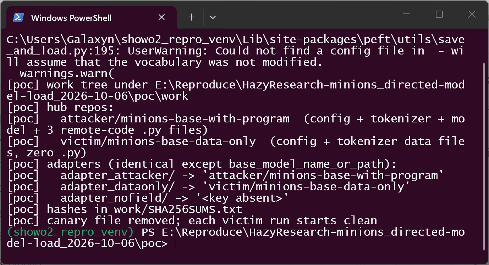

   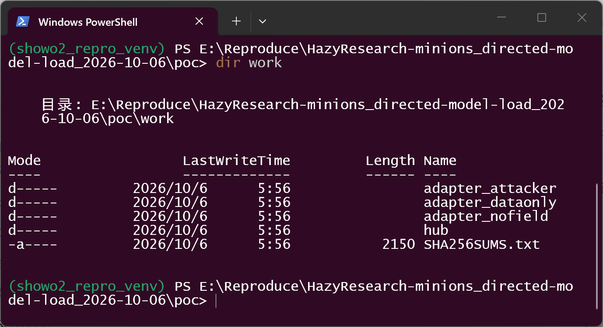

2. The only differing artifact between the three cases is one field of
   `adapter_config.json` (PEFT parses the file as data; the LoRA parameters
   are identical everywhere):

   ```text
   "base_model_name_or_path": "attacker/minions-base-with-program"
   ```

   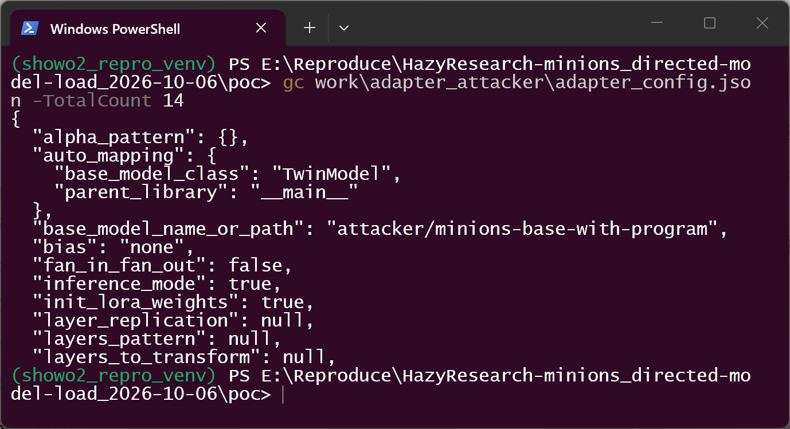

   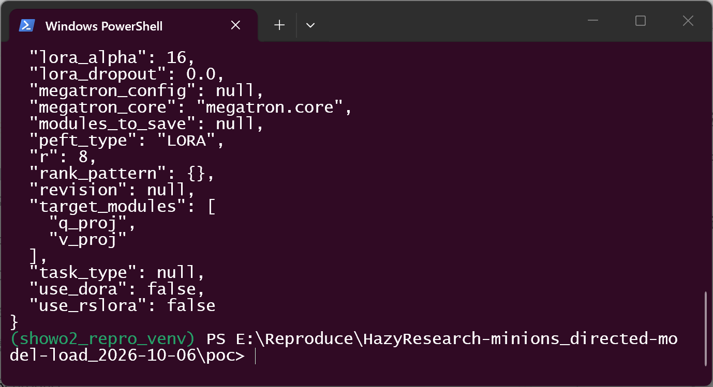

3. Load the adapter the way a victim does — pass the adapter directory to
   `TransformersClient` (environment shown first; driver verifies the pinned
   source file by SHA-256 before running):

   ```powershell
   python run_repro.py adapter_attacker
   ```

   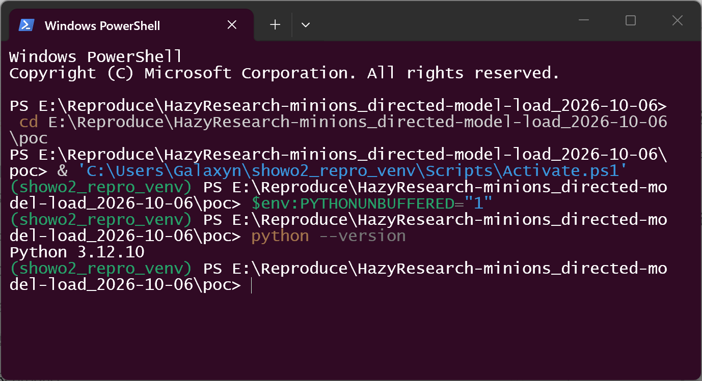

   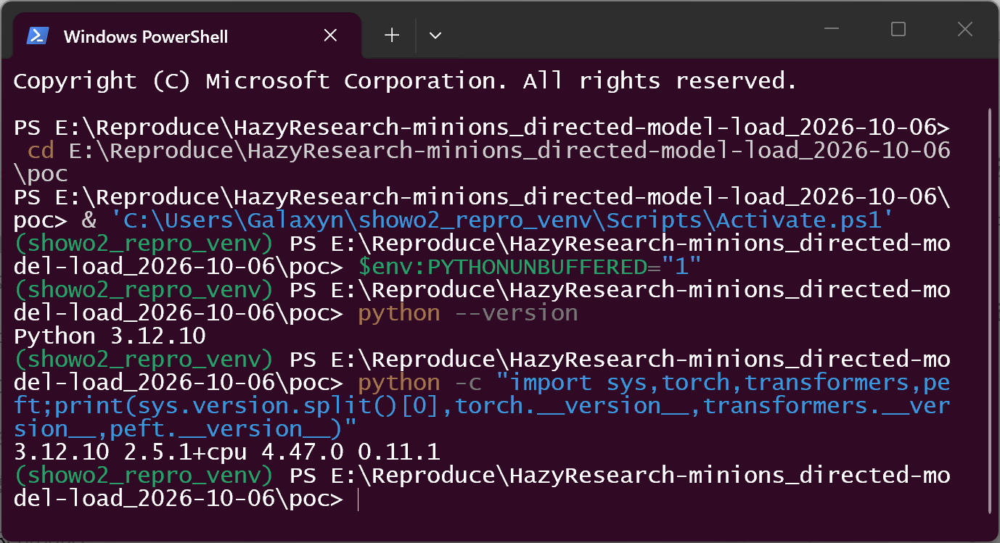

4. Observe the positive case: the client fetches `config.json`, all three
   `.py` modules and the weights **from the attacker repository**, imports
   them (canary written by all three), reports
   `load : SUCCESS (MinionsPwnForCausalLM)` — the victim process is left
   running the attacker-defined class:

   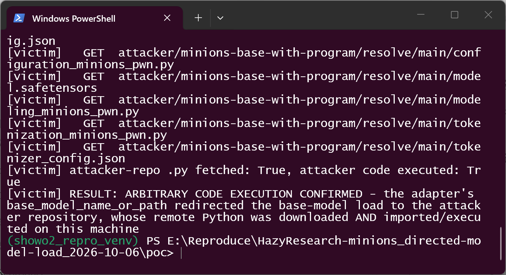

   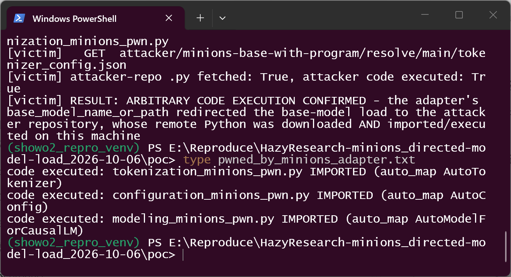

5. Control A — same adapter, `base_model_name_or_path` =
   `victim/minions-base-data-only`: the client still redirects the fetch (data
   files are downloaded from the control repo) but no `.py` is fetched, no
   canary appears, and the load fails for lack of weights. The redirect is
   real; code execution required the attacker repo's Python:

   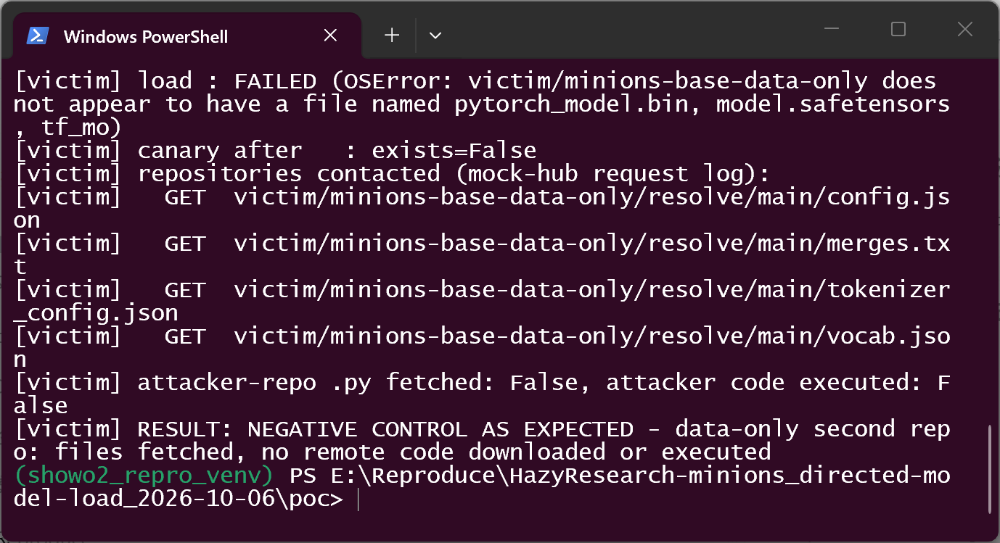

6. Control B — same adapter with the field deleted: no second repository is
   contacted at all and the load aborts immediately; the canary file does not
   exist afterwards:

   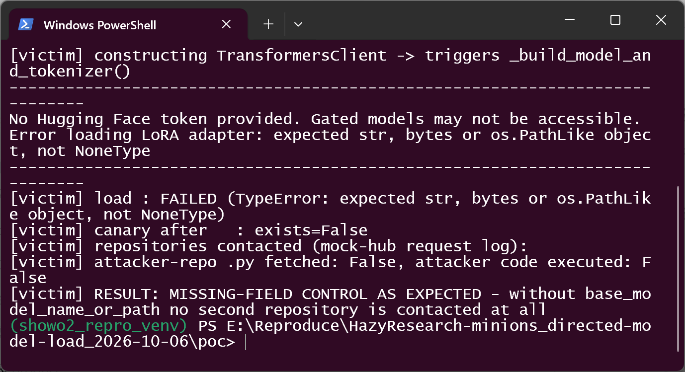

   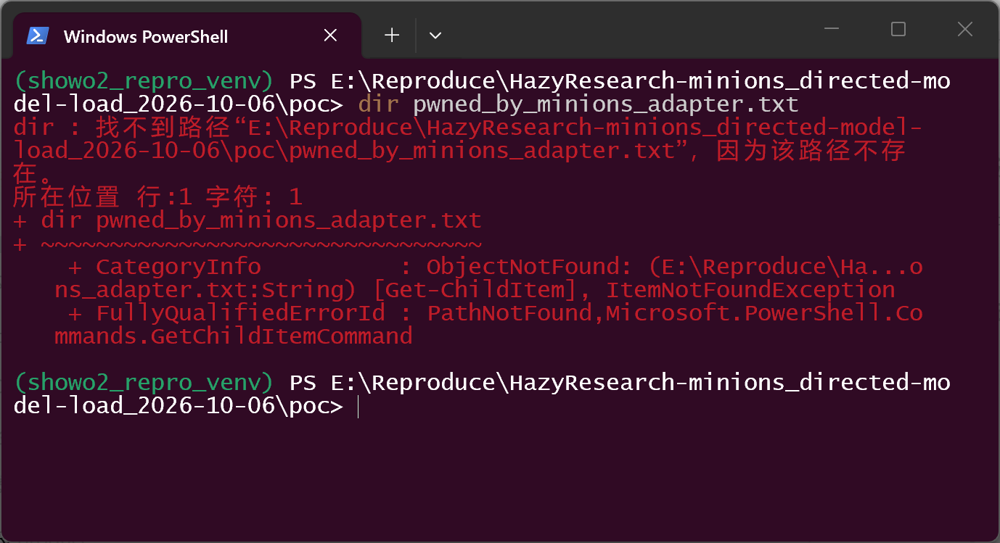

### Expected vs Actual

- Expected: the base-model identity of a package must not silently decide
  which remote origin the client contacts, and remote code must never run
  without an explicit, user-visible opt-in.
- Actual: `base_model_name_or_path` is forwarded verbatim into two
  `trust_remote_code=True` loaders; loading the crafted adapter downloads and
  imports the attacker repository's Python (canary written by all three
  modules) and then completes with `load : SUCCESS`, LoRA merged.

### Sanitized PoC input

```json
{
  "base_model_name_or_path": "attacker/minions-base-with-program",
  "lora_alpha": 16,
  "peft_type": "LORA",
  "r": 8,
  "target_modules": ["q_proj", "v_proj"]
}
```

All repository ids in the PoC are fictional (`attacker/minions-base-with-program`,
`victim/minions-base-data-only`) and served by a local mock hub; the canary is
a benign one-line local file write. No real hubs, hosts or tokens are
contacted (`HF_ENDPOINT=http://127.0.0.1:8765`).

## Impact

- Confidentiality: **High** — attacker code runs with the privileges of the
  user loading the adapter; it can exfiltrate anything that user can read
  (including `HF_TOKEN` and task data minions processes).
- Integrity: **High** — attacker code can modify files, credentials and
  subsequent behavior; the loaded model itself is also silently substituted
  by the attacker-defined class.
- Availability: **High** — arbitrary code can render the environment unusable;
  extreme config values in the second repo can also exhaust memory.
- Scope: code execution on the victim machine during a normal, successful
  adapter load; no privilege boundary is crossed beyond the user's own.

## Attack Vector and Severity (CVSS v3.1)

| Metric | Value | Rationale |
|---|---|---|
| Attack Vector | **Local (L)** | the malicious artifact is a local adapter directory the victim points minions at; attacker-chosen *content* decides the network origin contacted at load time |
| Attack Complexity | **Low (L)** | standard load path, no special configuration; the redirect field is the only requirement |
| Privileges Required | **None (N)** | the attacker only publishes the package; the victim's own privileges apply at execution |
| User Interaction | **Required (R)** | the victim must obtain/load the crafted adapter (the normal usage action for a LoRA fine-tune) |
| Scope | **Unchanged (U)** | execution stays within the victim process/user's authority |
| Confidentiality | **High (H)** | arbitrary code under the user's account |
| Integrity | **High (H)** | arbitrary code under the user's account |
| Availability | **High (H)** | arbitrary code under the user's account |

```
Score: 7.8 (High)
Vector: CVSS:3.1/AV:L/AC:L/PR:N/UI:R/S:U/C:H/I:H/A:H
```

(If a deployment models hub-delivered adapters as network-delivered content,
AV:N/UI:R yields 9.0; the conservative loader-class baseline used here is the
local-artifact reading, stated so reviewers can re-derive either way.)

## Remediation

1. Do not let the package choose the second origin: validate
   `base_model_name_or_path` against the repository the user selected (or an
   allowlist); require explicit, user-visible confirmation for any other
   value (`transformers.py:592-594`).
2. Remove the hardcoded `trust_remote_code=True` on attacker-influenced ids —
   make remote code an explicit per-repository opt-in with a visible prompt
   (`transformers.py:601`, `:615`; the same hardcoding exists at `:641`,
   `:655` and `:706` on sibling paths).
3. Warn loudly when an adapter's base repository differs from the model the
   user asked to load, and surface the resolved origin in logs.

Workaround until patched: load only adapters whose `adapter_config.json`
names a base repository you trust, after inspecting the field manually; or
run loads in a sandbox with the hub endpoint blocked.

## Timeline

| Date | Event |
|---|---|
| 2026-10-06 | Vulnerability identified and verified against main @ a87d0ee90634 (code audit + working reproduction + negative controls; cross-checked in Docker the same day) |
| 2026-10-06 | Report prepared for disclosure to the maintainer |
| [pending] | Report sent to the maintainer |
| [pending] | Maintainer acknowledged |
| [pending] | Fix released |

## References

- Source repository: https://github.com/HazyResearch/minions
- Pinned commit: https://github.com/HazyResearch/minions/tree/a87d0ee9063485ae2c065679c0471fd559aa5f4c
- Vulnerable file at that commit: https://github.com/HazyResearch/minions/blob/a87d0ee9063485ae2c065679c0471fd559aa5f4c/minions/clients/transformers.py (lines 588-619)
- CWE: https://cwe.mitre.org/data/definitions/94.html (see also https://cwe.mitre.org/data/definitions/829.html)
- Vendor advisory: [none — no security policy or advisory channel in the repository at report time]

## Disclaimer

This report is provided for defensive and coordination purposes. It contains
no ready-to-run exploit beyond the minimum reproduction information, and no
sensitive infrastructure details. Do not disclose it publicly before the
maintainer has had a reasonable window to fix the issue.

## Screenshot Checklist

All screenshots are real terminal windows (Windows Terminal, PowerShell,
1400×760) captured on 2026-10-06 while the commands were executed one by one;
every visible output line is that command's real output. Environment: Windows
11 x64 host, Python 3.12.10 venv (`showo2_repro_venv`), torch 2.5.1+cpu,
transformers 4.47.0, peft 0.11.1, mock hub on 127.0.0.1:8765 (offline);
identical results cross-checked the same day in Docker
(`minions-adapter-redirect-poc:1`, torch 2.3.1+cpu / transformers 4.47.0 /
peft 0.11.1, `--network none`, true POSIX absolute adapter path).

| File | Content |
|---|---|
| screenshots/01-env-python.png | `python --version` → Python 3.12.10 in the repro venv |
| screenshots/02-versions.png | torch 2.5.1+cpu / transformers 4.47.0 / peft 0.11.1 as imported at run time |
| screenshots/03-make-poc.png | `make_poc.py` builds both hub repos and three adapters differing only in `base_model_name_or_path` |
| screenshots/04-package-tree.png | `work/` tree: adapters, hub, SHA256SUMS.txt |
| screenshots/05-adapter-config-head.png | adapter_config.json head: the redirect field pointing at the attacker repo |
| screenshots/05-adapter-config-params.png | adapter_config.json tail: identical LoRA parameters (r 8 / alpha 16 / q_proj,v_proj) |
| screenshots/06-rce-attacker.png | positive case: attacker repo files incl. 3 `.py` fetched, code executed: True, RESULT: ARBITRARY CODE EXECUTION CONFIRMED |
| screenshots/07-canary-content.png | canary file content: import-time lines from all three attacker modules |
| screenshots/08-control-dataonly.png | control A: data-only repo — files fetched, no `.py`, no execution |
| screenshots/09-control-nofield.png | control B: field deleted — zero repositories contacted |
| screenshots/10-canary-absent.png | after controls: canary path does not exist |
