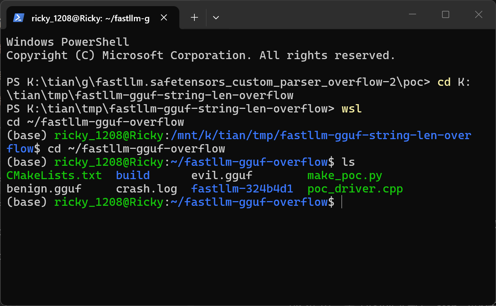
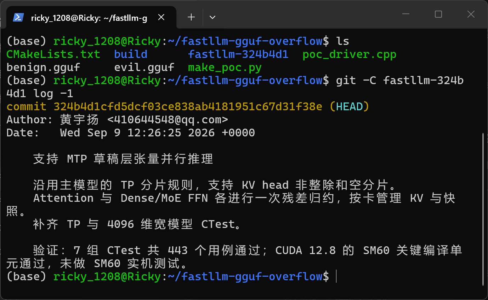
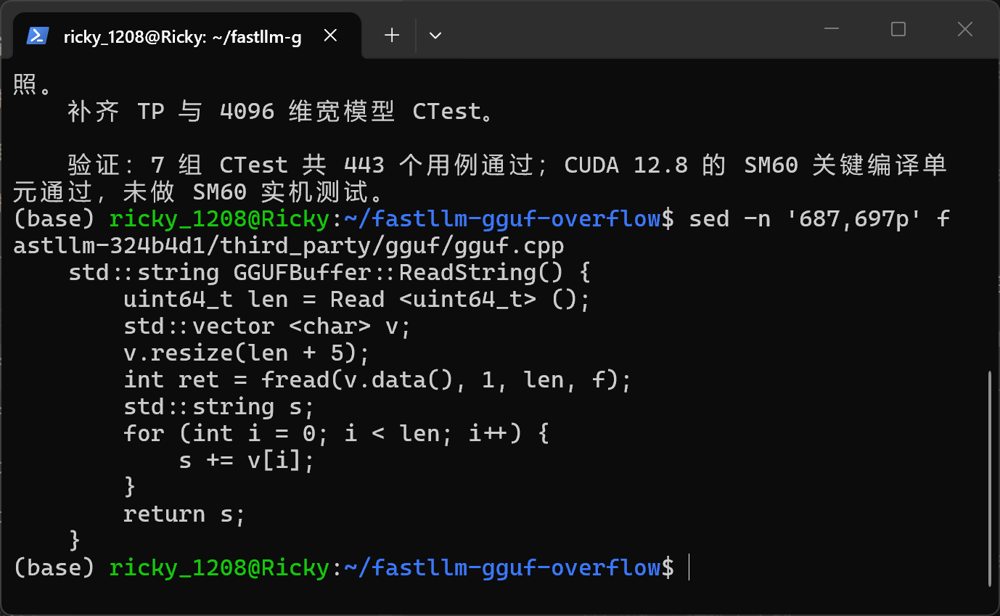
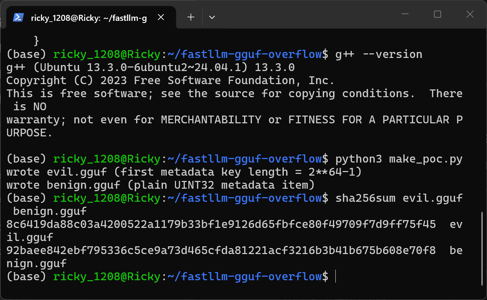
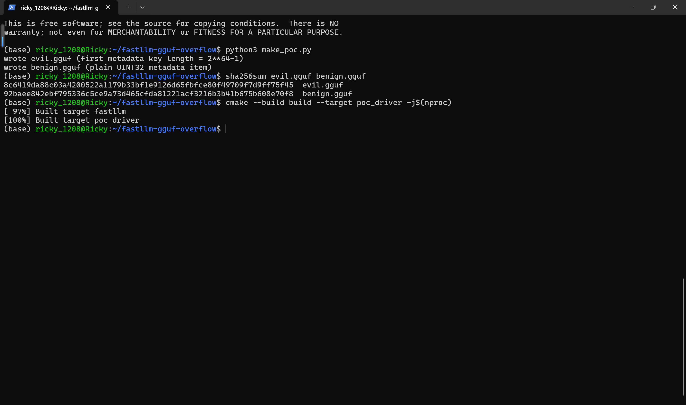
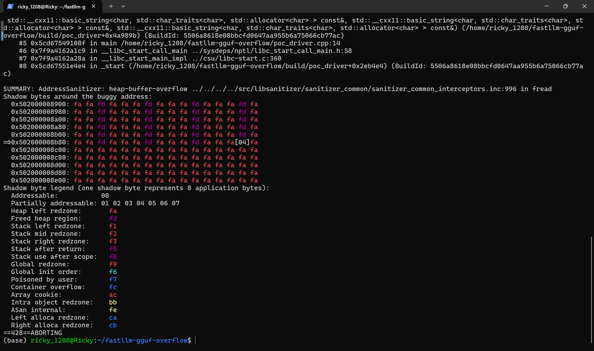
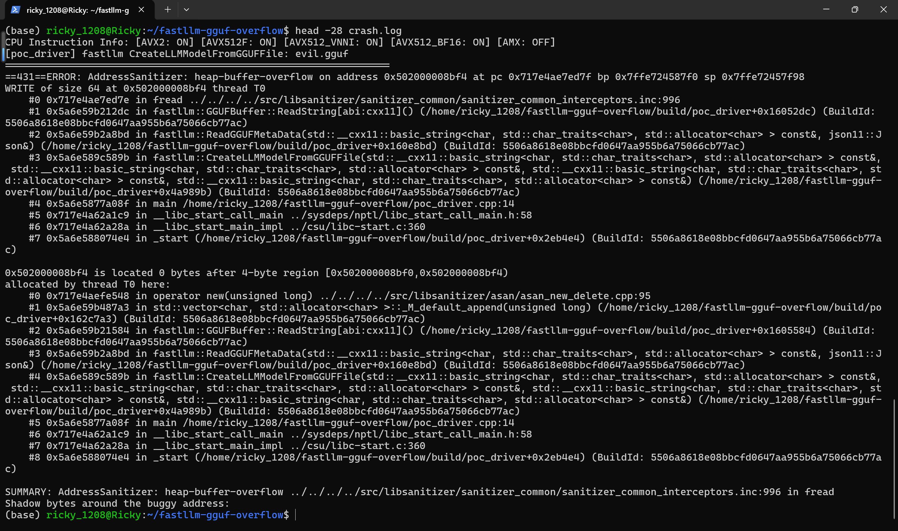
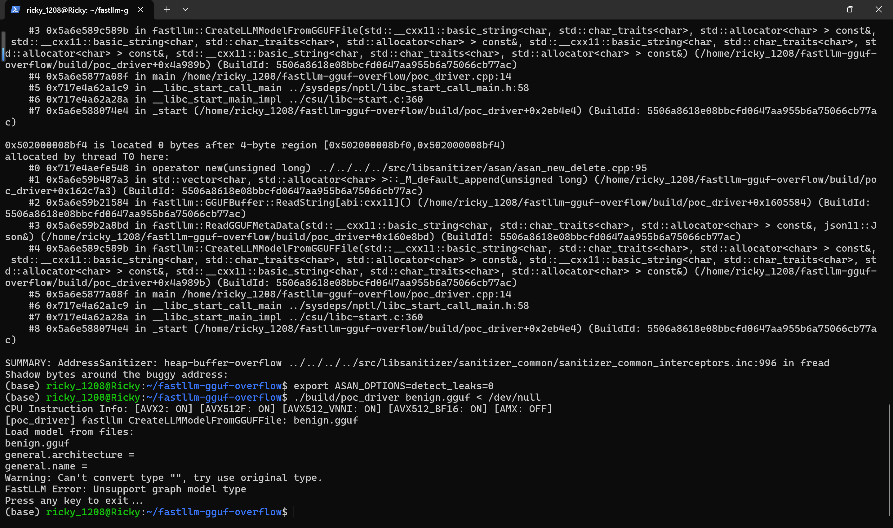

# Heap Buffer Overflow in fastllm v0.1.8.2 GGUF Metadata String Parser

## Summary

fastllm (github.com/ztxz16/fastllm), including release v0.1.8.2 and current master, is affected by an integer-overflow-driven heap buffer overflow in the GGUF metadata string parser. The first 8 bytes of any GGUF metadata key are a fully attacker-controlled `uint64_t` length; the parser computes the buffer size as `len + 5` in 64-bit arithmetic, which wraps around to a tiny value when `len` is near `2^64`, and then passes the original unwrapped `len` to `fread()`. Loading a crafted `.gguf` model file therefore makes the parser allocate a 4-byte heap buffer and read up to 2^64-1 bytes into it, corrupting the heap and crashing the process with a native memory error inside the format parser. An AddressSanitizer build reports `heap-buffer-overflow WRITE of size 64` in `fread` called from `fastllm::GGUFBuffer::ReadString()`.

## Affected Product

| Field | Value |
|---|---|
| Vendor | fastllm project (ztxz16) |
| Product | fastllm |
| Affected versions | release v0.1.8.2 (tag `db04d9a9`, 2026-09-06) and git master through commit `05284b4e` (2026-10-03); analyzed at pinned commit `324b4d1cfd5dcf03ce838ab4181951c67d31f38e` (2026-09-09) |
| Component | `third_party/gguf/gguf.cpp` — `fastllm::GGUFBuffer::ReadString()` (lines 687-697 at `324b4d1`; same code at line 716-724 on master `05284b4e`) |
| Platform | Linux x86_64 (verified on WSL2 Ubuntu 24.04, g++ 13.3, CMake RelWithDebInfo + AddressSanitizer); any 64-bit platform where `size_t`/`uint64_t` is 64-bit |
| Vulnerability type | CWE-122: Heap-based Buffer Overflow (root cause CWE-190: Integer Overflow or Wraparound) |

## Root Cause

**Location:** `third_party/gguf/gguf.cpp:687-697` (`GGUFBuffer::ReadString()`, pinned commit `324b4d1`)

The GGUF format stores every metadata key and tensor name as a length-prefixed string. `ReadString()` reads the 8-byte length straight from the file into `uint64_t len` and uses it for two different purposes with no validation: it sizes the receiving buffer as `len + 5`, and it bounds the following `fread()`. When `len` is `0xFFFFFFFFFFFFFFFF`, the addition `len + 5` wraps modulo 2^64 and yields `4`, so `std::vector::resize(4)` allocates only 4 bytes, while `fread(v.data(), 1, len, f)` still tries to fill the buffer with up to 2^64-1 bytes — glibc copies whatever bytes remain in the file (64 attacker-controlled bytes in the PoC) past the end of the 4-byte allocation. `len` is never checked against the remaining file size anywhere in the calling parser `ReadGGUFMetaData()`.

```cpp
std::string GGUFBuffer::ReadString() {
    uint64_t len = Read <uint64_t> ();   // attacker-controlled, 8 bytes from the file
    std::vector <char> v;
    v.resize(len + 5);                   // wraps to 4 when len == 2^64-1 (CWE-190)
    int ret = fread(v.data(), 1, len, f); // writes up to len bytes into the 4-byte buffer (CWE-122)
    std::string s;
    for (int i = 0; i < len; i++) {      // would also re-read len bytes OOB if fread returned
        s += v[i];
    }
    return s;
}
```

The reachable path from the public loading API is: the ctypes DLL export `create_llm_model_from_gguf()` (`tools/src/pytools.cpp:475`, consumed by the Python `ftllm` package in `tools/fastllm_pytools/llm.py:354`) calls `fastllm::CreateLLMModelFromGGUFFile()` (`src/model.cpp:3681`, declared in the public header `include/model.h:17`), which calls `ReadGGUFMetaData()` on the first `.gguf` file (`src/model.cpp:3704` → `third_party/gguf/gguf.cpp:918`), and `ReadGGUFMetaData()` calls `ReadString()` for the first metadata key at `gguf.cpp:935` — before any tensor, config field, or model type is validated. The defect therefore fires on the first key/value pair of any GGUF file opened through the normal model-loading entry point.

## Proof of Concept

### Prerequisites

- A fastllm build (CPU is sufficient) with AddressSanitizer: the victim loads a model file, e.g. through the Python `ftllm` tooling (`create_llm_model_from_gguf`) or any application embedding fastllm's `CreateLLMModelFromGGUFFile()`.
- A crafted 96-byte `.gguf` file (`evil.gguf`, generated by `make_poc.py` below). No GPU, no network access, and no special privileges are required.

### Steps to Reproduce

1. Generate the malicious and negative-control samples: `python3 make_poc.py` produces `evil.gguf` (first metadata key length = 2^64-1) and `benign.gguf` (identical header, key length 1, one plain UINT32 metadata item).



2. Confirm the analyzed source is the pinned upstream commit `324b4d1cfd5dcf03ce838ab4181951c67d31f38e` and inspect the vulnerable function.





3. Build fastllm plus the 14-line driver `poc_driver.cpp` (which calls the public `fastllm::CreateLLMModelFromGGUFFile()` — the same code path as the shipped `create_llm_model_from_gguf` ctypes export) with `-fsanitize=address`: `cmake -B build -DUSE_NUMAS=OFF -DCMAKE_BUILD_TYPE=RelWithDebInfo -DCMAKE_CXX_FLAGS="-fsanitize=address -fno-omit-frame-pointer" -DCMAKE_EXE_LINKER_FLAGS="-fsanitize=address"` followed by `cmake --build build --target poc_driver`.





4. Run `./build/poc_driver evil.gguf`. The process dies inside `fread()` while parsing the first metadata key, before any field of the file is returned to the model layer.



5. The full report head shows the defect chain: `heap-buffer-overflow WRITE of size 64`, `0 bytes after 4-byte region`, the 4-byte region allocated by `std::vector::_M_default_append` inside `ReadString` (the wrapped `len + 5 == 4` allocation), with `ReadString → ReadGGUFMetaData → CreateLLMModelFromGGUFFile → main` on both stacks.



6. Negative control: `ASAN_OPTIONS=detect_leaks=0 ./build/poc_driver benign.gguf < /dev/null`. The identical parser parses the same header plus one plain UINT32 metadata item and rejects the file with a controlled error (`FastLLM Error: Unsupport graph model type`) — no sanitizer report, no memory error. Leak checking is disabled only because fastllm's `ErrorInFastLLM()` exits the process without releasing process-lifetime allocations, which produces unrelated LeakSanitizer noise on the graceful-exit path; the crash sample aborts before any leak check.



### Expected vs Actual

- Expected: a GGUF string whose declared length exceeds the remaining file size is rejected (or truncated) by the parser; loading never writes more bytes than the receiving buffer holds.
- Actual: the parser allocates `len + 5` bytes with a wrapped 4-byte size and then `fread()`s the original `len` (2^64-1) bytes into it; with 64 trailing bytes available, 64 bytes are written 60 bytes past the end of a 4-byte heap region and the process aborts with a native memory error (`AddressSanitizer: heap-buffer-overflow ... ==pid==ABORTING`). Without a sanitizer the same copy corrupts glibc heap metadata and crashes the loader deterministically.

### Sanitized PoC input

The malicious file is 96 bytes; no host-specific values are embedded.

```text
offset 0   4 bytes   magic "GGUF" (0x46554747 little-endian)
offset 4   4 bytes   version = 3 (int32)
offset 8   8 bytes   tensor_count = 0 (uint64)
offset 16  8 bytes   metadata_kv_count = 1 (uint64)
offset 24  8 bytes   first metadata key length = 0xFFFFFFFFFFFFFFFF (uint64, the trigger)
offset 32  64 bytes  0x41 ('A') x64, readable bytes the overrunning fread() copies
```

Generator (also attached as `poc/make_poc.py`, negative control `benign.gguf` = key length 1, key "x", type UINT32 = 4, value 7):

```python
import struct
with open("evil.gguf", "wb") as f:
    f.write(struct.pack("<IiQQ", 0x46554747, 3, 0, 1))
    f.write(struct.pack("<Q", 2 ** 64 - 1))
    f.write(b"A" * 64)
```

Sample SHA-256 (identical when regenerated on any platform; see `poc/SHA256SUMS.txt`):

```text
8c6419da88c03a4200522a1179b33bf1e9126d65fbfce80f49709f7d9ff75f45  evil.gguf
92baee842ebf795336c5ce9a73d465cfda81221acf3216b3b41b675b608e70f8  benign.gguf
```

## Impact

- Confidentiality: High — the size used for the copy is fully attacker-controlled and the bytes copied come from the attacker's file, so adjacent heap memory can be smashed with attacker-chosen length and content; the companion copy loop (`for (int i = 0; i < len; i++) s += v[i];`) would additionally re-read up to `len` bytes from the undersized buffer into a returned `std::string` if the process survives the `fread`, an out-of-bounds read that can leak adjacent heap data into model metadata.
- Integrity: High — 60+ bytes of attacker-controlled data are written past a heap allocation inside the parsing process (heap metadata and adjacent objects overwritten).
- Availability: High — loading the 96-byte file deterministically crashes the loading process (native memory error in `fread` under glibc; ASan abort under a sanitized build); any service that automatically ingests model files from a hub can be killed by a trivially small file.
- Scope: memory corruption in the process that loads the model file; no privilege boundary is crossed by fastllm itself.

## Remediation

Validate the string length before allocating, and use checked arithmetic. A minimal fix at `third_party/gguf/gguf.cpp` `ReadString()`:

```cpp
uint64_t len = Read <uint64_t> ();
// reject lengths that cannot back the copy, e.g. against the file size
if (len > remainingFileSize()) {
    ErrorInFastLLM("GGUF string length out of range.\n");
}
std::vector <char> v;
v.resize(len + 5); // now unreachable with a wrapped len
```

`remainingFileSize()` can be derived from `fseek/ftell` on `GGUFBuffer::f` (or by capping `len` at a sane maximum such as `std::numeric_limits<int>::max()`, since the following copy loop uses an `int` counter — itself an additional overflow to fix). The same unvalidated `ReadString()` is used for tensor names by `AppendGGUFTasks()` and `ReadGGUF()`, so the check belongs in `ReadString()` itself. As a workaround, only load GGUF files from fully trusted sources until a fixed release is available.


## References

- Source repository: https://github.com/ztxz16/fastllm
- Analyzed commit: https://github.com/ztxz16/fastllm/tree/324b4d1cfd5dcf03ce838ab4181951c67d31f38e
- Vulnerable file at pinned commit: https://github.com/ztxz16/fastllm/blob/324b4d1cfd5dcf03ce838ab4181951c67d31f38e/third_party/gguf/gguf.cpp#L687-L697
- Release v0.1.8.2 (also affected): https://github.com/ztxz16/fastllm/releases/tag/v0.1.8.2
- CWE-190: https://cwe.mitre.org/data/definitions/190.html
- CWE-122: https://cwe.mitre.org/data/definitions/122.html
- Upstream report: [pending publication]
- Vendor advisory: [none]
