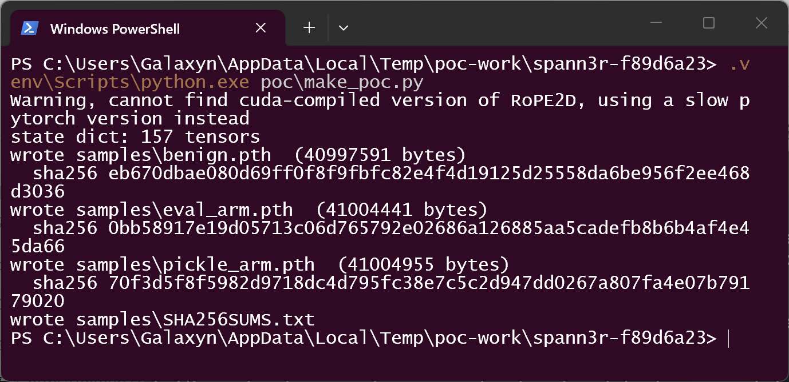
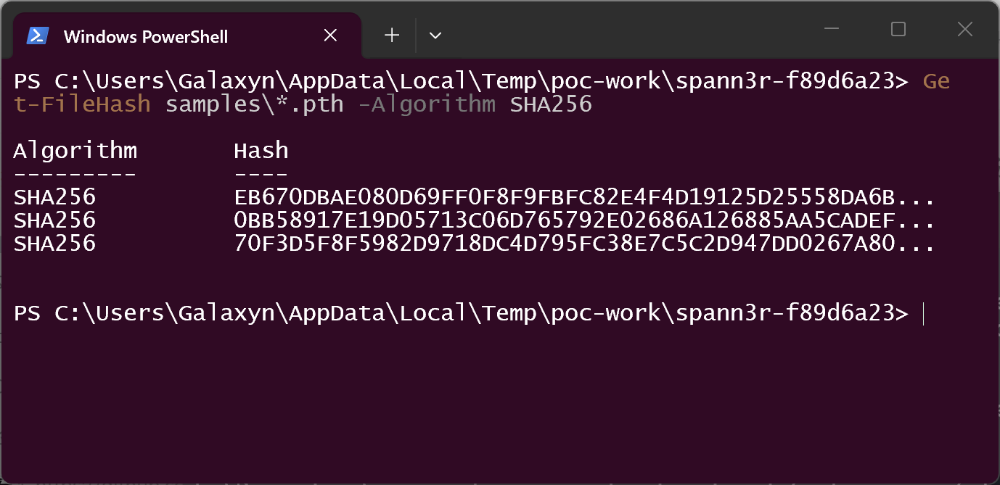
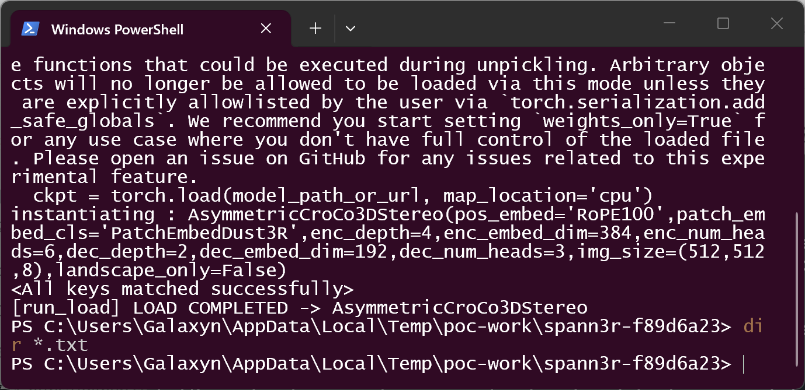
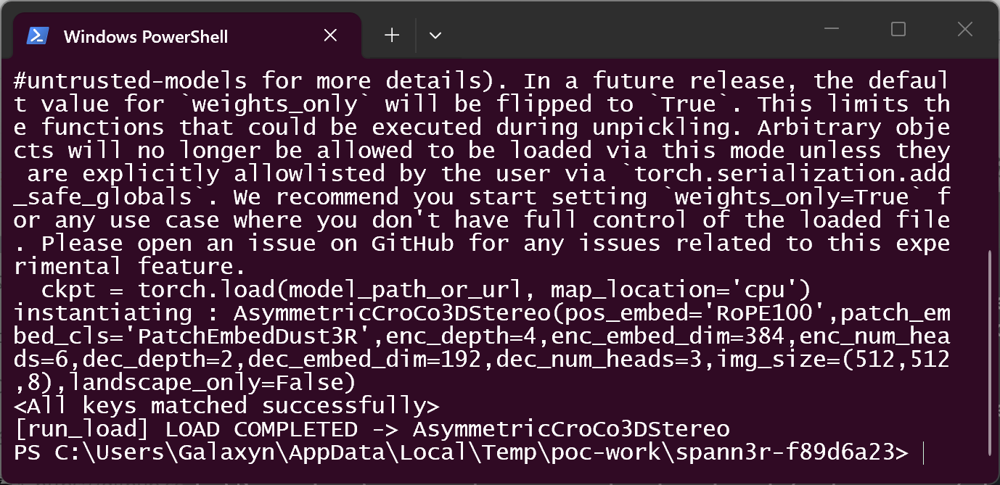
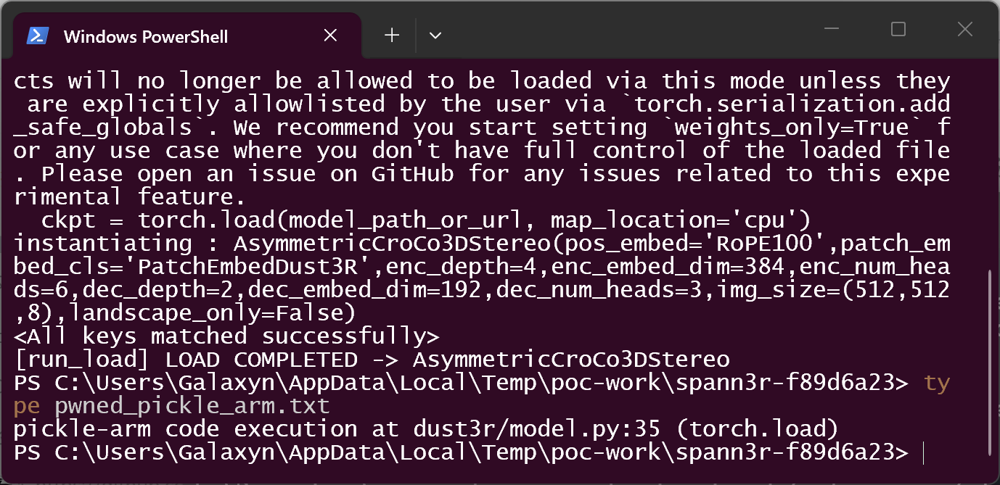
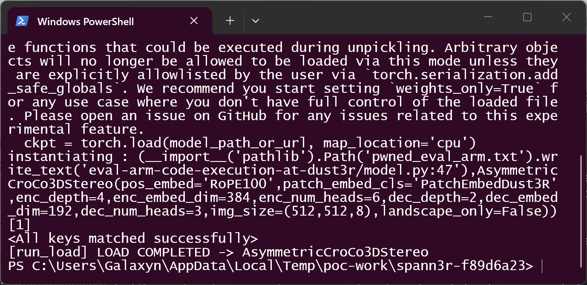
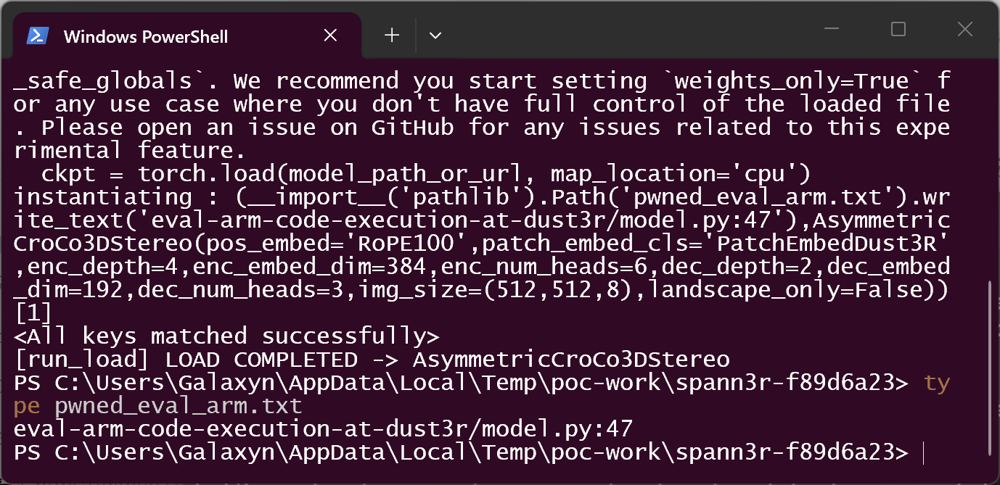
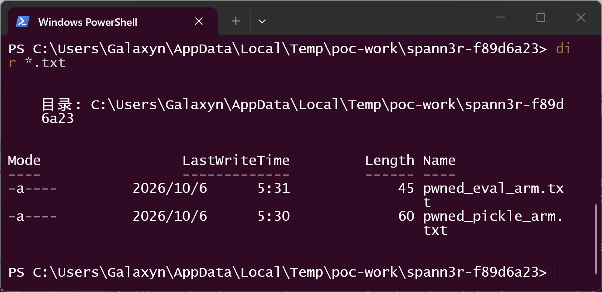

# SPANN3R commit f89d6a23a842 — Unsafe Deserialization and Code Execution in `dust3r/model.py` `load_model()`

## Summary

HengyiWang SPANN3R (repository `HengyiWang/spann3r`) at commit `f89d6a23a8423d03f19c1c8248c3772831d742a5`
(HEAD of `main`, 2025-02-25; the repository has no tagged releases) is affected by an unsafe
deserialization in the model loader `load_model()` in `dust3r/model.py`. The loader restores an
attacker-supplied checkpoint with a bare `torch.load()` / `torch.hub.load_state_dict_from_url()`,
which rebuilds the full pickle object graph before any field of the checkpoint is read — arbitrary
code execution is already possible at that point (CWE-502). Independently, the loader passes the
checkpoint-controlled string `ckpt['args'].model` through `eval()` (CWE-94) — a second injection
point in the same function, reached whenever the checkpoint passes the load: by default on
torch < 2.6, or on newer torch when the operator re-enables loading as torch's own error message
instructs. Loading one crafted `.pth` file — a routine operation for this tool, whose
Gradio demo pulls a checkpoint from a Hugging Face URL at startup — is sufficient for full
compromise of the victim's account.

## Affected Product

| Field | Value |
|---|---|
| Vendor | HengyiWang (SPANN3R project) |
| Product | SPANN3R (`HengyiWang/spann3r`) |
| Affected versions | commit `f89d6a23a8423d03f19c1c8248c3772831d742a5` (= `main` HEAD, 2025-02-25); no tagged releases exist, so all versions are affected |
| Component | `dust3r/model.py`, `load_model()`, lines 27-51 (sinks at lines 33, 35 and 47) |
| Platform | OS-independent (Python / PyTorch); validated on Windows x64, Python 3.12.10, torch 2.5.1+cpu |
| Vulnerability type | CWE-502: Deserialization of Untrusted Data (secondary path: CWE-94: Code Injection via `eval()`) |

## Root Cause

**Location:** `dust3r/model.py:27-51` (`load_model`), pinned commit `f89d6a23a842`.

```python
def load_model(model_path_or_url, device='cpu', landscape_only=False, verbose=True):
    ...
    if is_url:
        ckpt = torch.hub.load_state_dict_from_url(model_path_or_url, map_location='cpu', progress=verbose)  # :33
    else:
        ckpt = torch.load(model_path_or_url, map_location='cpu')        # :35  bare load, no weights_only
    args = ckpt['args'].model.replace("ManyAR_PatchEmbed", "PatchEmbedDust3R")  # :36  first field read
    if 'landscape_only' not in args:
        args = args[:-1] + ', landscape_only=False)'
    else:
        args = args.replace(" ", "").replace('landscape_only=True', 'landscape_only=False')
    assert "landscape_only=False" in args
    ...
    net = eval(args)                                                    # :47  eval of checkpoint string
```

Two independent defects, reached by the same call chain
(`app.py:107` Gradio demo startup — whose `DEFAULT_CKPT_PATH` is an **HTTPS URL** to a
Hugging Face-hosted `.pth` — and `AsymmetricCroCo3DStereo.from_pretrained()` at `dust3r/model.py:87`):

1. **CWE-502 (primary).** Lines 33/35 call `torch.load()` / `torch.hub.load_state_dict_from_url()`
   without `weights_only=True`. A `.pth` checkpoint is a pickle-backed object graph, so the whole
   graph — including any `__reduce__`-based payload hidden in any key — is executed during
   deserialization, *before* line 36 reads `ckpt['args'].model`. There is no safe-format barrier
   anywhere in the chain: the attacker never needs to survive (or wait for) the later `eval()` to
   gain code execution. On the torch < 2.6 versions this codebase was written for, `weights_only`
   defaults to `False`; on torch >= 2.6 the default flip converts this defect into a hard load
   failure for arbitrary pickles, but the loader itself never opted into the safe mode.
2. **CWE-94 (secondary).** The string `ckpt['args'].model` is transformed by
   lines 36-44 and then executed by `eval(args)` at line 47. The eval() sink itself has no
   version dependence; it is reached whenever the checkpoint passes line 35 — by default on
   torch < 2.6, or on any version once the operator allowlists the loaded types, exactly as
   torch's own `UnpicklingError` message instructs. The only in-path
   constraints are: the expression must survive a space-stripping `str.replace()` (line 40) and
   must contain the substring `landscape_only=False` (line 41) — a Python tuple expression
   `(payload(), AsymmetricCroCo3DStereo(...))[1]` satisfies both while still yielding a model
   object, so the load completes normally and leaves no trace beyond the executed payload.

Version cross-check, stated honestly: on torch >= 2.6 the bare load **fails closed** by default —
both crafted samples are refused with `UnpicklingError: Weights only load failed` on
torch 2.12.0+cpu (`argparse.Namespace` is not in the default safe-globals allowlist). This is a
partial ecosystem mitigation the loader never opted into: `requirements.txt` leaves `torch`
unpinned, era-typical installs of this commit run torch <= 2.5 where both arms execute, and the
RCE returns for any user who follows torch's suggestion to allowlist the types or pins an older
torch.

The same `eval(<checkpoint-controlled string>)` pattern also exists in
`spann3r/training.py:295` (`model = eval(args.model)` when resuming training) and in the inherited
`croco/pretrain.py:119`; and `dust3r/patch_embed.py:9` `eval(patch_embed_cls)` is guarded by an
`assert` of only two values.

## Proof of Concept

### Prerequisites

- The victim loads a crafted `.pth` checkpoint through the repository's own loader — e.g. by
  running the Gradio demo (`app.py`) with a checkpoint URL/path supplied by the attacker, by
  calling `AsymmetricCroCo3DStereo.from_pretrained(...)` on attacker-hosted weights, or by
  resuming training from a shared checkpoint. This is the normal "use published weights" workflow
  of the tool.
- Validation environment (attacker-free, all payloads are benign sentinels that only write a small
  text file): Windows x64, Python 3.12.10 in a venv, torch 2.5.1+cpu, huggingface-hub 0.24.6,
  einops 0.8.0, pillow 10.3.0, numpy 1.26.4; repository pinned at `f89d6a23a842`.

### Steps to Reproduce

1. Generate the three checkpoint samples with `poc/make_poc.py` (seeded, byte-reproducible):
   `benign.pth` (negative control, no attack fields), `pickle_arm.pth` (payload hidden in the
   pickle object graph under an unused `meta` key; `args.model` stays the normal model string),
   `eval_arm.pth` (only `args.model` differs — a payload expression that also constructs a valid
   model).

   

2. Verify the SHA-256 checksums of the samples:

   

3. Negative control — load `benign.pth` through the repository's own loader
   (`python run_load.py samples/benign.pth`). The load completes cleanly
   (`<All keys matched successfully>`); even PyTorch itself flags the sink by printing its
   `weights_only=False` pickle warning that quotes the vulnerable line
   `ckpt = torch.load(model_path_or_url, map_location='cpu')`:

   

4. Confirm no sentinel file exists after the control run (`dir *.txt` finds nothing):

   

5. **Pickle arm (CWE-502)** — load `pickle_arm.pth` the same way. The payload object's
   `__reduce__` executes inside `torch.load()` at `dust3r/model.py:35`, *before* the loader reads
   `ckpt['args']`; the load then completes normally, so the execution is silent at the application
   level:

   

6. The sentinel file created during `torch.load()` proves the code execution:

   

7. **Eval arm (CWE-94)** — load `eval_arm.pth`. The loader prints the attacker string itself
   (`instantiating : (__import__('pathlib').Path('pwned_eval_arm.txt').write_text(...),AsymmetricCroCo3DStereo(...))[1]`)
   and executes it at `dust3r/model.py:47`; the tuple trick still returns a valid model, so the
   load completes normally:

   

8. The second sentinel file proves the `eval()` code execution; step "dir" lists both payloads'
   files side by side:

   

   

9. Version cross-check (no screenshot; console transcript): on torch 2.12.0+cpu the same two
   crafted files are refused by the bare `torch.load()` with
   `UnpicklingError: Weights only load failed...` — the PyTorch 2.6 `weights_only=True` default
   (`argparse.Namespace` is not in the default allowlist). The loader's defect is the
   unconditional bare load; the RCE is fully realized wherever that load succeeds.

### Expected vs Actual

- Expected: loading a checkpoint restores tensors only; untrusted files must not execute code.
- Actual (pickle arm): attacker code runs during `torch.load()` (`dust3r/model.py:35`), before any
  checkpoint field is read; the loader then finishes normally.
- Actual (eval arm): attacker code runs when the loader `eval()`s `ckpt['args'].model`
  (`dust3r/model.py:47`); the loader prints the expression as `instantiating : ...`.
- Control: benign checkpoint loads cleanly, no sentinel files appear.

### Sanitized PoC input

Checkpoint structures (all values non-sensitive; payloads are benign sentinels):

```text
benign.pth (negative control):
  {'args': argparse.Namespace(
       model="AsymmetricCroCo3DStereo(pos_embed='RoPE100',patch_embed_cls='PatchEmbedDust3R',"
             "enc_depth=4,enc_embed_dim=384,enc_num_heads=6,dec_depth=2,dec_embed_dim=192,"
             "dec_num_heads=3,img_size=(512,512,8),landscape_only=False)"),
   'model': <157 weight tensors>}

pickle_arm.pth:
  same as benign, plus an unused key holding a __reduce__ object:
  'meta': {'created_by': <object whose __reduce__ returns
           (pathlib.Path.write_text, (Path('pwned_pickle_arm.txt'),
            'pickle-arm code execution at dust3r/model.py:35 (torch.load)'))>}

eval_arm.pth (args.model string; spaces are stripped by dust3r/model.py:40):
  (__import__('pathlib').Path('pwned_eval_arm.txt').write_text('eval-arm-code-execution-at-dust3r/model.py:47'),AsymmetricCroCo3DStereo(pos_embed='RoPE100',patch_embed_cls='PatchEmbedDust3R',enc_depth=4,enc_embed_dim=384,enc_num_heads=6,dec_depth=2,dec_embed_dim=192,dec_num_heads=3,img_size=(512,512,8),landscape_only=False))[1]
```

Sample SHA-256 (byte-reproducible, seeded generator in `poc/make_poc.py`):

```text
eb670dbae080d69ff0f8f9fbfc82e4f4d19125d25558da6be956f2ee468d3036  benign.pth
0bb58917e19d05713c06d765792e02686a126885aa5cadefb8b6b4af4e45da66  eval_arm.pth
70f3d5f8f5982d9718dc4d795fc38e7c5c2d947dd0267a807fa4e07b79179020  pickle_arm.pth
```

## Impact

- Confidentiality: High — arbitrary code execution exposes all data accessible to the victim
  account (training data, credentials in environment, model assets).
- Integrity: High — attacker code can modify files, models and outputs at will.
- Availability: High — attacker code can crash or disable the workflow, or destructive payloads
  can wipe assets.
- Scope: code execution in the user's Python environment (no memory-corruption boundary is
  crossed; `Scope: Unchanged`). Typical victims: researchers and demo users loading shared
  SPANN3R/DUSt3R checkpoints, including the demo's default Hugging Face-hosted weights URL
  pattern.

## Attack Vector and Severity (CVSS v3.1)

| Metric | Value | Rationale |
|---|---|---|
| Attack Vector | N | Checkpoints travel over the network (the demo's default `DEFAULT_CKPT_PATH` is an HTTPS URL to a hosted `.pth`); attacker hosts or shadows such a file |
| Attack Complexity | L | No special conditions; loading the file is the tool's normal operation |
| Privileges Required | N | No authentication; anyone may publish a checkpoint |
| User Interaction | R | The victim must load the attacker-crafted checkpoint (a routine action) |
| Scope | U | Execution stays in the victim's own security context |
| Confidentiality | H | Full code execution |
| Integrity | H | Full code execution |
| Availability | H | Full code execution |

```
Score: 8.8 (High)
Vector: CVSS:3.1/AV:N/AC:L/PR:N/UI:R/S:U/C:H/I:H/A:H
```

Assumption noted: the network vector treats "victim loads an attacker-published checkpoint" as the
delivery path, consistent with how the tool actually consumes models (URL-based default in
`app.py:17`). A strictly local-file reading would yield AV:L/PR:N/UI:R = 7.1 (High), which does
not change the severity band.

## Remediation

1. Replace the unsafe load with a safe-format barrier: `torch.load(..., weights_only=True)`
   (default on torch >= 2.6) or, for older torch, register the needed allowlist with
   `torch.serialization.add_safe_globals([argparse.Namespace])`. Store `args` as a plain dict of
   primitives at save time instead of an arbitrary object graph.
2. Remove `eval()` entirely (`dust3r/model.py:47`): store the model configuration as structured
   data (dict/JSON) or parse the string with a whitelist + `ast.literal_eval`-style parsing; never
   execute checkpoint-supplied expressions. Apply the same fix to `spann3r/training.py:295`.
3. Until patched, only load checkpoints you trained yourself, or run loads in a sandboxed
   environment with no access to sensitive data.

## Timeline

| Date | Event |
|---|---|
| [unknown] | Vulnerability present since the initial DUSt3R-inherited loader; discovery date of the independent analysis [unknown] |
| 2026-10-06 | Report prepared; validated against pinned commit `f89d6a23a842` in an isolated environment |
| [pending] | Report sent to the maintainer |
| [pending] | Maintainer acknowledged |
| [pending] | Fix released |

## References

- Source repository: https://github.com/HengyiWang/spann3r
- Pinned commit: https://github.com/HengyiWang/spann3r/commit/f89d6a23a8423d03f19c1c8248c3772831d742a5
- Vulnerable file: https://github.com/HengyiWang/spann3r/blob/f89d6a23a8423d03f19c1c8248c3772831d742a5/dust3r/model.py (lines 27-51)
- Upstream pattern (same loader inherited from): https://github.com/naver/dust3r
- CWE-502: https://cwe.mitre.org/data/definitions/502.html
- CWE-94: https://cwe.mitre.org/data/definitions/94.html
- PyTorch untrusted-models guidance: https://github.com/pytorch/pytorch/blob/main/SECURITY.md#untrusted-models
- Vendor advisory: [none — repository has no security policy; Private Vulnerability Reporting is disabled]

## Disclaimer

This report is provided for defensive and coordination purposes. All payloads shown are benign
sentinels (they write a small local text file and perform no network or destructive action). Do
not disclose it publicly before the maintainer has had a reasonable window to fix the issue.

## Screenshot Checklist

All screenshots are real terminal windows (Windows Terminal / PowerShell) captured on 2026-10-06
in the validation environment: Windows x64 (10.0.26200), Python 3.12.10 venv with
torch 2.5.1+cpu / huggingface-hub 0.24.6, repository pinned at `f89d6a23a842`, working directory
`%TEMP%\poc-work\spann3r-f89d6a23`.

| File | Content |
|---|---|
| screenshots/01-env.png | Validation environment: Python 3.12.10, torch 2.5.1+cpu in the venv |
| screenshots/02-make-poc.png | `poc/make_poc.py` generates the three ~41 MB checkpoint samples (157 weight tensors) with SHA-256 hashes |
| screenshots/03-sample-hashes.png | `Get-FileHash` cross-check of the three sample hashes |
| screenshots/04-negative-control.png | Benign control loads cleanly through `load_model()`; PyTorch's own warning quotes the vulnerable sink line `ckpt = torch.load(model_path_or_url, map_location='cpu')` |
| screenshots/05-control-no-sentinel.png | `dir *.txt` finds nothing after the control run — no payload side effects |
| screenshots/06-pickle-arm-trigger.png | Pickle arm: load completes normally; torch's `weights_only=False` pickle warning visible |
| screenshots/07-pickle-sentinel.png | Sentinel file content: code executed at `dust3r/model.py:35` during `torch.load()` |
| screenshots/08-eval-arm-trigger.png | Eval arm: the loader prints and `eval()`s the attacker expression (`instantiating : ...`), load completes |
| screenshots/09-eval-sentinel.png | Sentinel file content: code executed at `dust3r/model.py:47` via `eval()` |
| screenshots/10-sentinels-landed.png | Both sentinels on disk after the two arms — none from the control |
