# InternAgent fa8c3eed Untrusted LoRA Adapter Base-Model Remote Fetch in AutoChem experiment.py (CWE-20)

## Summary

InternScience InternAgent commit fa8c3eedfa9751d3752ea6eb49220b303ac2397d is affected by an improper input validation issue in the LoRA loading path of the AutoChem training script. When a LoRA adapter directory is supplied, the script reads `adapter_config.json` through PEFT and loads the base model from the `base_model_name_or_path` field without any validation, so a crafted adapter silently makes the training pipeline fetch an attacker-chosen model repository from the Hugging Face Hub and assemble the PEFT model on top of it. The attacker-supplied repository needs to contain only configuration and SafeTensors data (no remote code and no pickle), which means the defect is exploitable with plain data-only model repositories and results in attacker-controlled base weights for the fine-tuning run.

## Affected Product

| Field | Value |
|---|---|
| Vendor | InternScience |
| Product | InternAgent |
| Affected versions | commit fa8c3eedfa9751d3752ea6eb49220b303ac2397d (= current main HEAD, last commit dated 2026-07-29); no fixed release known at reporting time |
| Component | `tasks/AutoChem/code/experiment.py`, function `train()`, lines 251-255 (same pattern copied in `tasks/AutoChem/run_0/experiment.py` lines 261-265) |
| Platform | OS-independent (Python; verified on Windows 11 + WSL2 Ubuntu 24.04, CPU-only) |
| Vulnerability type | CWE-20: Improper Input Validation |

## Root Cause

**Location:** `tasks/AutoChem/code/experiment.py:251-255` (`train()`, `use_lora` branch, adapter-exists path)

The script accepts `--lora_adapter_path` from the command line (set by the agent workflow that launches the training task). If that directory exists, the script trusts the adapter metadata and derives the base model from it instead of using the operator-provided `--pretrained_model_path`:

```python
print(f"Load LoRA from {lora_adapter_path}")
logger.info(f"Load LoRA from {lora_adapter_path}")
lora_config = PeftConfig.from_pretrained(lora_adapter_path)
model = AutoModel.from_pretrained(lora_config.base_model_name_or_path)
model = PeftModel.from_pretrained(model, lora_adapter_path, is_trainable=True)
```

`lora_config.base_model_name_or_path` is a free-form string stored in `adapter_config.json` of the adapter directory. PEFT populates it verbatim from the JSON file, and line 254 passes it straight to `AutoModel.from_pretrained()`. When the value is a Hub repository id, transformers/huggingface_hub resolves it over the network against the configured endpoint (`HF_ENDPOINT`, default `https://huggingface.co`) and downloads the second repository's `config.json` and weight files. Nothing constrains the value to the operator-selected base model, to a trusted namespace, or to a pinned revision. An adapter is exactly the kind of artifact that gets shared (published on the Hub, exchanged between collaborators, copied into task workspaces), so the trust boundary crossed is the adapter file. The negative control below shows that the identical adapter with a local base path performs no network request at all, which isolates the single JSON field as the decision point for the remote fetch.

## Proof of Concept

### Prerequisites

- Python 3.12 with `torch==2.8.0+cpu`, `transformers==4.57.1`, `peft==0.21.2`, `huggingface_hub==0.34.3` (transformers/torch/huggingface_hub versions follow the repository `requirements.txt` pins; peft is what the vulnerable file imports)
- The crafted adapter directories generated by `make_poc.py` (see poc bundle): `adapter-positive` declares `"base_model_name_or_path": "attacker-mirror/poisoned-base"` (a Hub repo id) and `adapter-negative` is byte-identical except that the field points to a local directory `second_local/`; the attacker repo content (`hub-repo-attacker/`) is data-only: `config.json` + `model.safetensors`, no `.py` file, no pickle, remote code not enabled
- A local look-alike of the Hugging Face Hub endpoint (`fake_hf_hub.py`) that serves the attacker repo directory and logs every request; the victim process is pointed at it with `HF_ENDPOINT` so the positive case performs a real network fetch without publishing anything to the real Hub
- `run_victim.py` executes the defective statements verbatim (lines 251-255 above, quotes included). The original `train()` cannot reach this block on a CPU-only reproducer because its deepspeed distributed setup (`deepspeed.init_distributed()`, NCCL default) runs first and requires CUDA, so the PoC isolates the defective block without modifying it; this omission does not change the data flow into `AutoModel.from_pretrained()`

Captured environment: WSL2 bash prompt, activated venv and library versions:


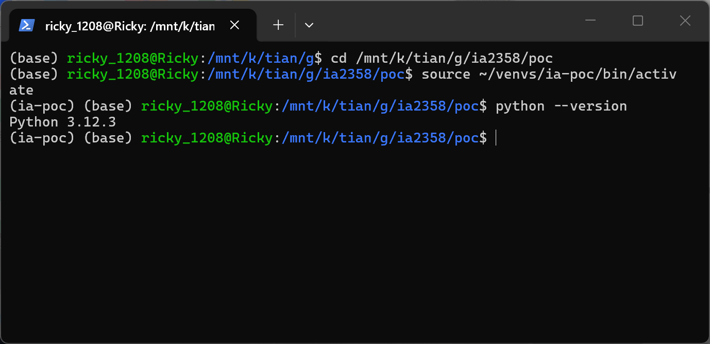

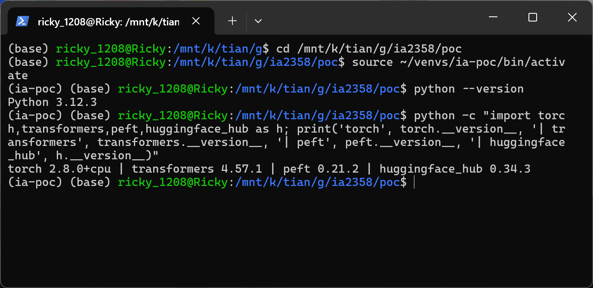

The defective code as shipped in the pinned commit:

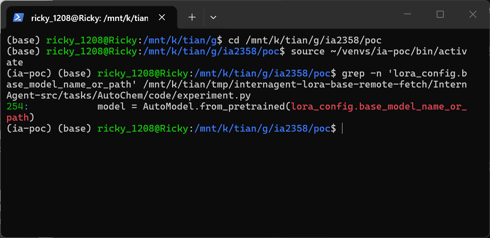

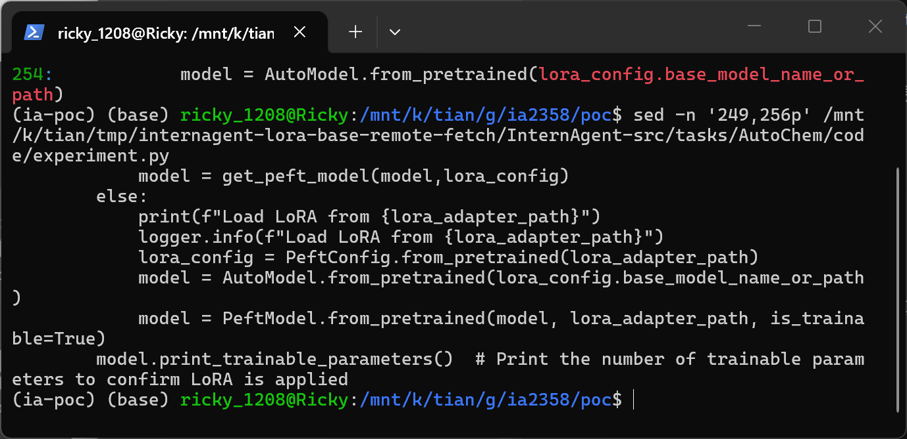

### Steps to Reproduce

1. Generate the fixture set and verify that positive and negative adapters differ only in the base field:

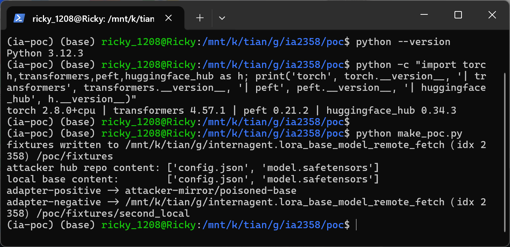

The script prints the attacker repo content (`config.json`, `model.safetensors`), the identical local base content, and both adapters' `base_model_name_or_path` values.

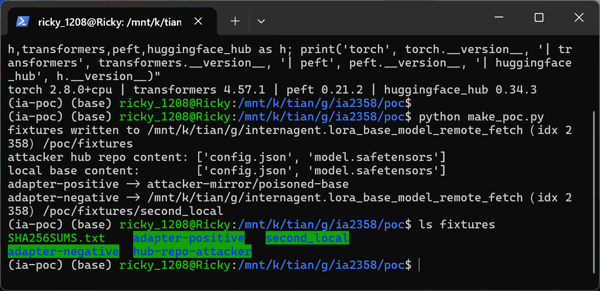

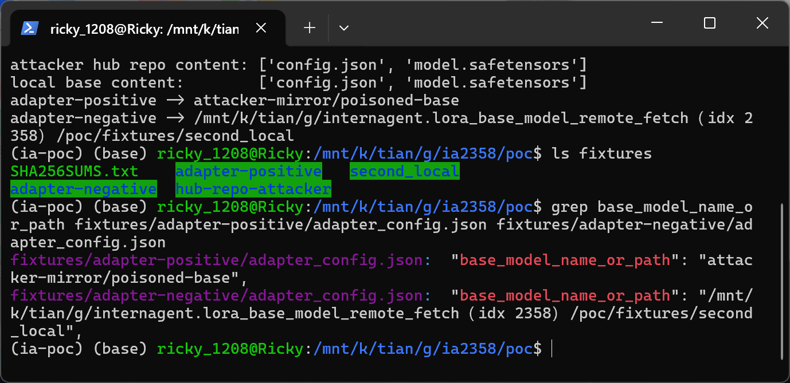

The grep output shows the only functional difference: `"attacker-mirror/poisoned-base"` (positive, Hub id) versus the local `second_local` path (negative). The adapter weight files are byte-identical (same SHA256 in `poc/fixtures/SHA256SUMS.txt`).

2. Confirm the attacker repo is data-only (no Python sidecar that could carry remote code execution):

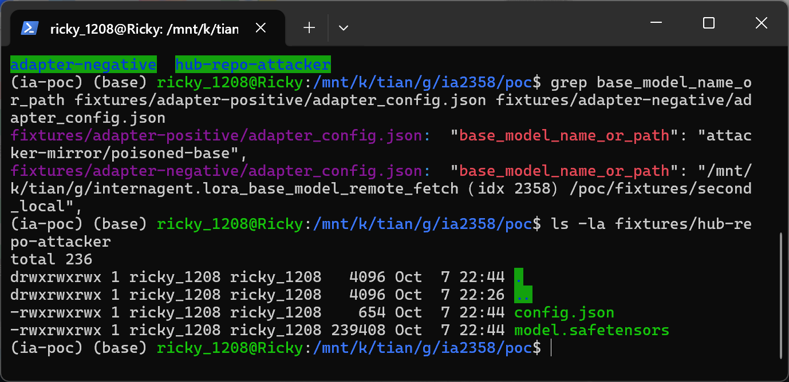

3. Start the local Hub look-alike on 127.0.0.1:8755 serving the attacker repo (port 8755 is used because 8080 was occupied by an unrelated service on the capture host), delete any cached copy of the attacker repo to force a cold fetch, and point the victim at it:

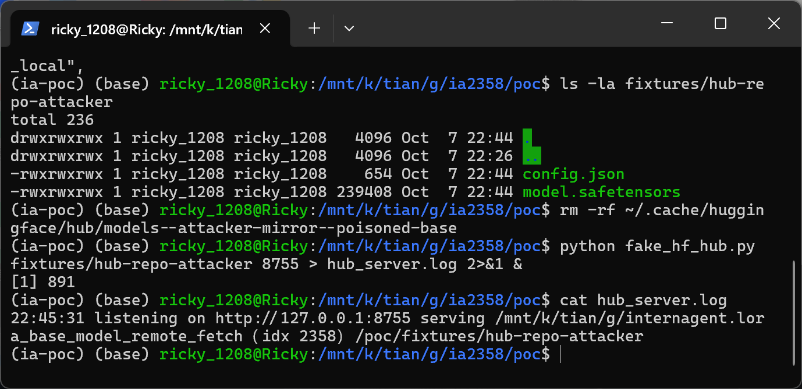

4. Run the training-side loader against the positive adapter with `HF_ENDPOINT=http://127.0.0.1:8755`:

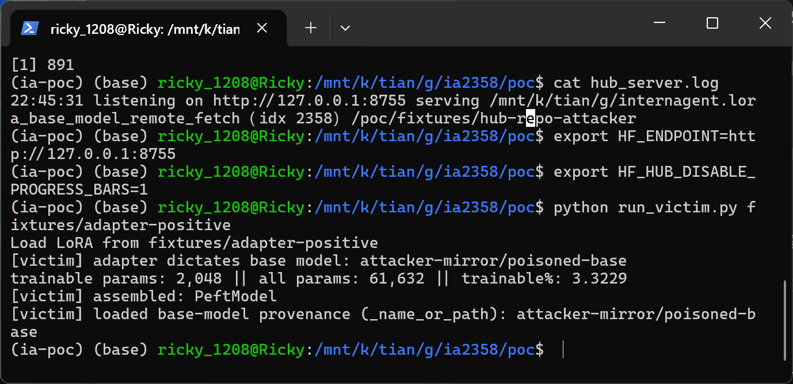

The victim prints `Load LoRA from fixtures/adapter-positive`, the adapter-dictated base `attacker-mirror/poisoned-base`, then assembles the PEFT model (`trainable params: 2,048 || all params: 61,632 || trainable%: 3.3229`) and reports the loaded base-model provenance (`_name_or_path: attacker-mirror/poisoned-base`), i.e. the weights of the assembled training model come from the attacker-chosen repository.

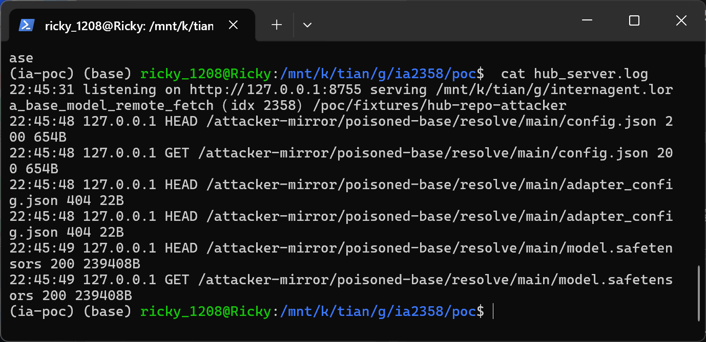

The endpoint log records the network fetch performed by the victim during `AutoModel.from_pretrained()`: `HEAD`+`GET` of `/attacker-mirror/poisoned-base/resolve/main/config.json` (200, 654 B), two `HEAD` probes of `adapter_config.json` (404), and `HEAD`+`GET` of `/resolve/main/model.safetensors` (200, 239408 B). This is the second repository being pulled over the network purely because of the JSON field.

5. Negative control: run the identical loader against the negative adapter with the Hub endpoint pointed at an unreachable address (`HF_ENDPOINT=http://127.0.0.1:9`):

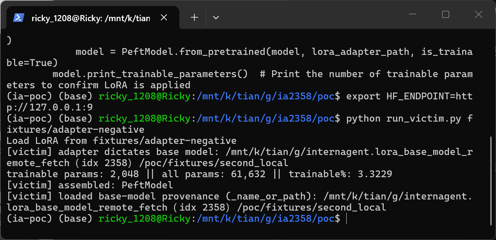

The run completes identically from the local base directory despite the dead endpoint.

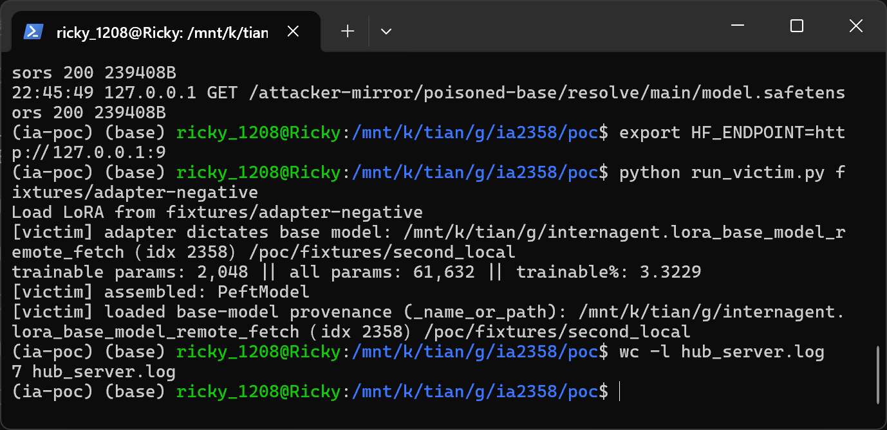

`wc -l hub_server.log` still reports 7 lines (1 startup line + 6 request lines from the positive run), proving the negative run issued no Hub request at all.

### Expected vs Actual

- Expected: the training script loads the base model the operator chose (`--pretrained_model_path`), or at minimum rejects/warns when the adapter declares a different, untrusted base
- Actual: the adapter's `base_model_name_or_path` silently overrides the source of the base model; a Hub repo id is fetched over the network and its config and weights become the foundation of the PEFT training model

### Sanitized PoC input

```text
fixtures/adapter-positive/adapter_config.json -> "base_model_name_or_path": "attacker-mirror/poisoned-base"
fixtures/adapter-negative/adapter_config.json -> "base_model_name_or_path": <local path to fixtures/second_local>
attacker repo content: config.json (654 B) + model.safetensors (239408 B), no .py files, no pickle
```

## Impact

- Confidentiality: None — no data leaves the training host; the fetch is a download from the attacker's repository
- Integrity: Low — the attacker chooses the base weights and base configuration of a fine-tuning run, so the resulting model's behavior is built on attacker-controlled parameters; a shared/collaborative adapter silently substitutes the model under training (model poisoning / provenance subversion). No code execution: the PoC deliberately uses a data-only repository, and the vulnerable code path does not enable `trust_remote_code`
- Availability: None — the run completes normally
- Scope: integrity of trained artifacts produced from a shared LoRA adapter; if a downstream deployment combines this pattern with `trust_remote_code=True` repositories, the same field would escalate to code execution, but that escalation is outside this report

## Remediation

Treat `adapter_config.json`'s `base_model_name_or_path` as untrusted data at `tasks/AutoChem/code/experiment.py:254`: when `--pretrained_model_path` is provided, override the adapter-declared base with it (or fail hard if the two disagree), restrict accepted values to an operator-configured allowlist of local paths or trusted namespaces, and pin exact commit hashes for any Hub source. Log a loud warning whenever the adapter-declared base differs from the operator-provided one. Apply the same change to the copied script `tasks/AutoChem/run_0/experiment.py`.


## References

- Source repository: https://github.com/InternScience/InternAgent
- Pinned commit: https://github.com/InternScience/InternAgent/tree/fa8c3eedfa9751d3752ea6eb49220b303ac2397d
- Vulnerable file: https://github.com/InternScience/InternAgent/blob/fa8c3eedfa9751d3752ea6eb49220b303ac2397d/tasks/AutoChem/code/experiment.py#L251-L255
- CWE-20: https://cwe.mitre.org/data/definitions/20.html
- Related weakness (download without integrity check): https://cwe.mitre.org/data/definitions/494.html
- Vendor advisory: [none]
