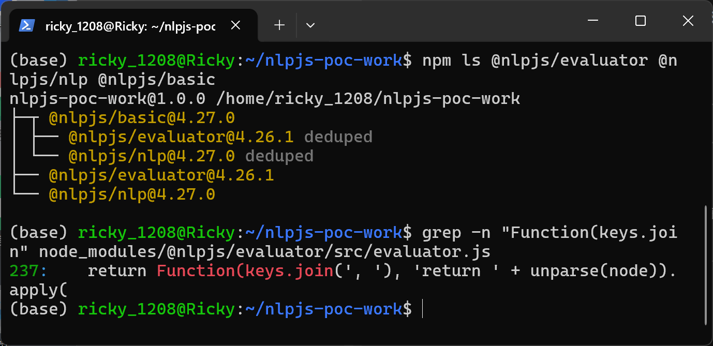
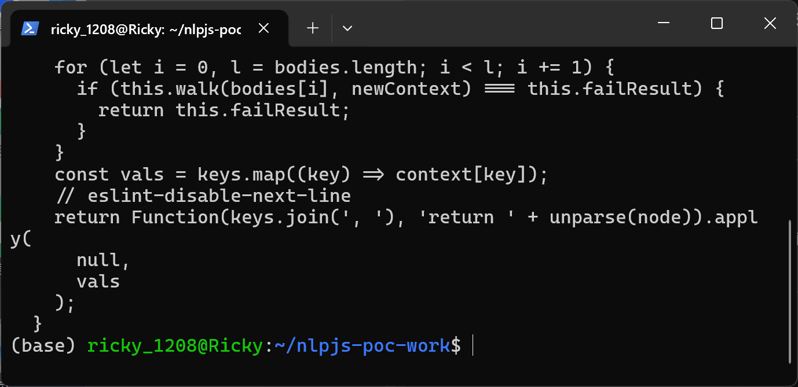
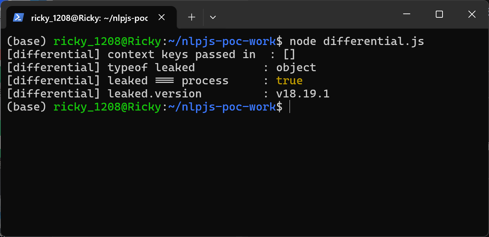
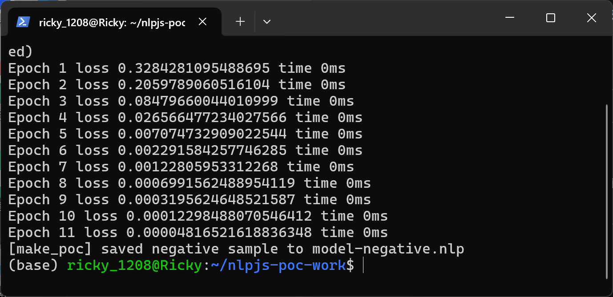
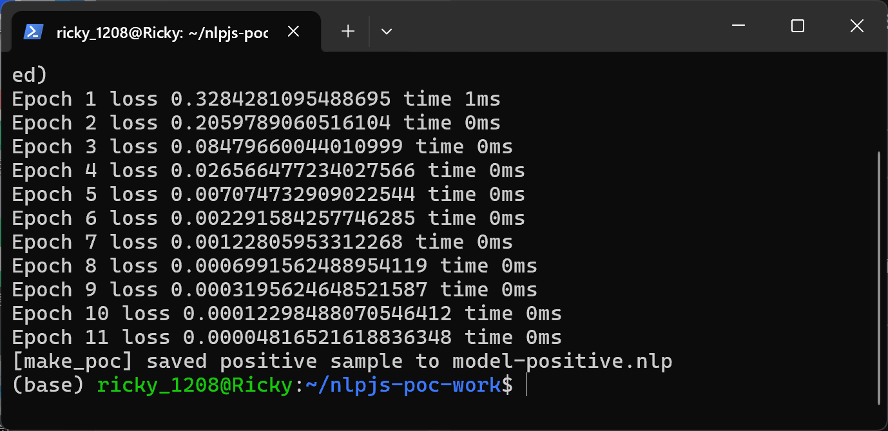
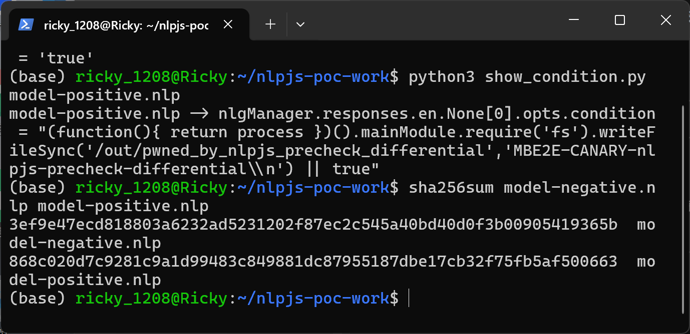
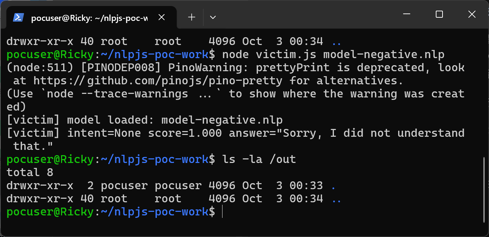
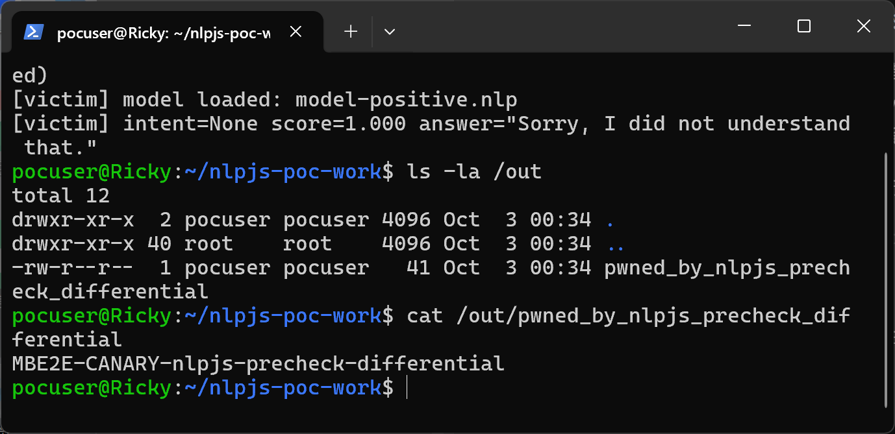

# NLP.js — Interpreter Differential Between NLG Condition Precheck and Function Compilation Yields Model-File RCE

## Summary

AXA Group NLP.js (the `@nlpjs` package family behind `node-nlp`) is affected by a code-injection flaw in the condition-expression pipeline of the Natural Language Generation (NLG) manager. The `condition` field of an NLG answer is stored as plain text inside the trained `model.nlp` JSON file. When the model is loaded, every condition string is handed to the `@nlpjs/evaluator` service, which first interprets the expression in a sandboxed AST walk (unknown identifiers such as `process` silently resolve to `undefined` and are never rejected) and then re-compiles the very same source text with the JavaScript `Function` constructor in the Node.js **global** scope, where `process` is a live global. An attacker who supplies a model file to any product that loads `model.nlp` (for example the bundled qna-web / Directline deployment pattern with `autoLoad: true`) achieves arbitrary code execution with the privileges of the bot process while the bot continues to answer normally. Both the benign and the malicious sample in this report are produced exclusively with the official `NlpManager`/`Nlp` `train()` + `save()` API; the artifact contains no script, no module and no second file.

## Affected Product

| Field | Value |
|---|---|
| Vendor | AXA Group Operations Spain S.A. (`axa-group`) |
| Product | NLP.js (`@nlpjs/*` package family; consumed as `node-nlp`) |
| Affected versions | git master commit `62731109b5dc5d9ed727c6e599443fb29eaea798` (2024-03-21); npm `@nlpjs/evaluator` 4.26.1 (latest stable 4.x), `@nlpjs/nlp` 4.27.0 and `@nlpjs/basic` 4.27.0 (latest stable 4.x line); the `latest` npm dist-tag currently points to `5.0.0-alpha.5`, which was not assessed |
| Component | `packages/evaluator/src/evaluator.js` (`walkFunction`, lines 218-241, `Function` compile at line 237); trigger chain via `packages/nlg/src/nlg-manager.js` (`filterAnswers`, lines 64-94) and model persistence in `packages/nlp/src/nlp.js` (`save`/`load`, lines 912-926) |
| Platform | Node.js (any supported version; reproduced on Node 18.19.1 / Ubuntu 24.04 WSL2) |
| Vulnerability type | CWE-94: Code Injection |

## Root Cause

**Location:** `packages/evaluator/src/evaluator.js:218-241` (`Evaluator.walkFunction`), consumed by `packages/nlg/src/nlg-manager.js:64-94` (`NlgManager.filterAnswers`)

The evaluator implements expressions in two passes. The first pass is an interpreter over the esprima AST. In this pass `walkIdentifier` resolves any unknown name to `undefined` (evaluator.js:140-145) and `walkFunction` first walks the function body statement by statement in a closed context built exclusively from the caller-supplied context (evaluator.js:218-234). An expression such as `return process` therefore passes the interpret phase without producing the internal `failResult`: the unknown identifier is treated as an ordinary undefined value, not as a violation. The second pass then serializes the same AST node back to source and compiles it with the `Function` constructor, executing it with `null` as `this` and only the caller context values as parameters (evaluator.js:235-240):

```js
const vals = keys.map((key) => context[key]);
// eslint-disable-next-line
return Function(keys.join(', '), 'return ' + unparse(node)).apply(
  null,
  vals
);
```

The compiled function object is returned to `walkCall`, which immediately invokes it (evaluator.js:155-175). Because `Function` compiles in the **global** scope, the function body sees every Node.js global that the interpret phase just decided was "undefined" — including `process`. The interpreter pass is effectively a precheck that approves what the compiler pass then executes with entirely different bindings; this interpreter/compiler differential is the defect.

The NLG manager feeds attacker-controlled text straight into this service: `NlpManager.filterAnswers` fetches the container's `Evaluator` and calls `evaluator.evaluate(condition, context) === true` for every answer whose `opts.condition` is set (nlg-manager.js:68-90). `condition` originates from `nlgManager.responses[locale][intent][n].opts.condition` in the model JSON, which `Nlp.load()` restores verbatim from the `model.nlp` file (nlp.js:893-899, 918-926). The standard `Basic` bootstrap plugin (used by the official qna-web example with the Directline/Express connectors) registers `@nlpjs/evaluator`'s `Evaluator` into the container automatically, so the condition path is active in a default deployment (`packages/core-loader/src/plugin-information.json`, entry `Basic`).

## Proof of Concept

### Prerequisites

- Node.js 18 with npm; packages pinned to the latest stable 4.x line: `@nlpjs/basic@4.27.0` (pulls `@nlpjs/nlp@4.27.0` and `@nlpjs/evaluator@4.26.1`).
- A directory `/out` writable by the bot user as the canary drop point (any path works; adjust the payload).
- The victim is any service that loads a `model.nlp` file with the stock `Basic` bootstrap (qna-web / Directline pattern). No debug flag, no plugin and no second file are involved.

### Steps to Reproduce

1. Pin the dependencies and confirm the vulnerable line inside the installed artifact:



This screenshot shows `npm ls` pinning `@nlpjs/basic@4.27.0`, `@nlpjs/nlp@4.27.0`, `@nlpjs/evaluator@4.26.1`, and `grep -n "Function(keys.join"` locating the global-scope compile at `node_modules/@nlpjs/evaluator/src/evaluator.js:237` (the package's `main` entry is `src/index.js`, so this is the executed code).

2. Inspect the vulnerable `walkFunction` as shipped:



This screenshot shows lines 218-241 of the installed `src/evaluator.js`: the closed-context body walk (the precheck) followed by the `Function(keys.join(', '), 'return ' + unparse(node))` compile.

3. Demonstrate the interpreter differential with the public `Evaluator` API alone (`differential.js` calls `evaluator.evaluate('(function(){ return process })()', {})` with an empty context):



The evaluator reports `leaked === process : true` and `leaked.version : v18.19.1` — the expression that the interpret pass evaluated against an empty context returns the live Node.js `process` object, because the `Function`-compiled twin executes in global scope.

4. Generate the benign control model with the official `train()` + `save()` API; the only semantic difference of the malicious variant is the NLG condition string:





5. Show the only semantic difference between the two artifacts and their SHA-256 hashes:



The negative model stores `condition = "true"`; the positive model stores the payload shown below. Everything else in the two JSON files is semantically identical, and both files are plain `model.nlp` JSON documents with no script sidecar.

6. Negative control: the victim loads the benign model and answers normally; nothing is written to `/out`:



7. Positive: the victim loads the malicious model, still answers normally — and the canary file appears with the exact marker content, written from inside the condition evaluation:



The bot answers `intent=None score=1.000` with its configured fallback text while `ls -la /out` shows `pwned_by_nlpjs_precheck_differential` (41 bytes) and `cat` prints the canary marker — arbitrary file write with the bot process privileges, invisible in the bot's conversational behavior.

### Expected vs Actual

- Expected: a `model.nlp` file is data; condition expressions must only ever see the caller-supplied evaluation context, and the interpret phase's decision (unknown identifier = undefined) must match what the execution phase can actually reach. At minimum, identifiers that are not part of the caller context should be rejected before any evaluation.
- Actual: the interpret phase approves `return process` as an ordinary undefined value, while the `Function`-compiled execution of the same text resolves `process` in the Node.js global scope. The payload `(function(){ return process })().mainModule.require('fs').writeFileSync(...)` therefore executes with full access to Node.js capabilities during `nlp.process()`, and the bot keeps answering normally.

### Sanitized PoC input

The full `opts.condition` value of the positive sample (single string, shown unescaped here for readability; the `/out/...` target path is an arbitrary attacker-chosen writable path):

```text
(function(){ return process })().mainModule.require('fs').writeFileSync('/out/pwned_by_nlpjs_precheck_differential','MBE2E-CANARY-nlpjs-precheck-differential\n') || true
```

JSON pointer of the field inside `model.nlp`:

```text
/nlgManager/responses/en/None/0/opts/condition
```

Sample hashes (also shipped as `poc/SHA256SUMS.txt`):

```text
3ef9e47ecd818803a6232ad5231202f87ec2c545a40bd40d0f3b00905419365b  model-negative.nlp
868c020d7c9281c9a1d99483c849881dc87955187dbe17cb32f75fb5af500663  model-positive.nlp
```

## Impact

- Confidentiality: High — condition expressions run with the full Node.js capability set of the bot process (`process.mainModule.require` reaches every installed module), so arbitrary file reads, credential theft and network access are available.
- Integrity: High — demonstrated arbitrary file write (`fs.writeFileSync`) with the privileges of the bot user; any other module capability (child process spawn, outbound requests) is equally reachable.
- Availability: High — the injected code runs inside the bot process and can terminate it, exhaust resources or destroy data at will.
- Scope: code execution inside the Node.js process running the bot; the compromise is silent because the NLG answer pipeline continues to produce normal user-visible replies.

## Remediation

- Treat `model.nlp` as code, not data: either stop evaluating `opts.condition` from loaded model files, or gate condition evaluation behind an explicit, per-product trust decision (e.g. signed models).
- Fix the differential in `@nlpjs/evaluator`: reject — instead of silently resolving to `undefined` — any identifier that is not present in the caller-supplied context during the interpret phase (`walkIdentifier`, evaluator.js:140-145), and remove the `Function` compile fallback in `walkFunction` (evaluator.js:235-240) or compile against a `vm`/isolated context that exposes only the caller context; identifiers unknown at interpret time must make the expression fail closed.
- Workaround for deployers until a fixed release exists: run bot processes under a dedicated low-privilege account with a read-only filesystem where possible, and only deploy model files from trusted, reviewed sources.

## References

- Source repository: https://github.com/axa-group/nlp.js
- Pinned commit analyzed: https://github.com/axa-group/nlp.js/tree/62731109b5dc5d9ed727c6e599443fb29eaea798
- Vulnerable file: https://github.com/axa-group/nlp.js/blob/62731109b5dc5d9ed727c6e599443fb29eaea798/packages/evaluator/src/evaluator.js
- Trigger chain: https://github.com/axa-group/nlp.js/blob/62731109b5dc5d9ed727c6e599443fb29eaea798/packages/nlg/src/nlg-manager.js
- Official deployment pattern that auto-loads `model.nlp` (qna-web example): https://github.com/axa-group/nlp.js/tree/62731109b5dc5d9ed727c6e599443fb29eaea798/examples/04-qna-web
- npm: https://www.npmjs.com/package/@nlpjs/evaluator , https://www.npmjs.com/package/@nlpjs/nlp , https://www.npmjs.com/package/node-nlp
- CWE: https://cwe.mitre.org/data/definitions/94.html
- Vendor advisory: [pending publication]
