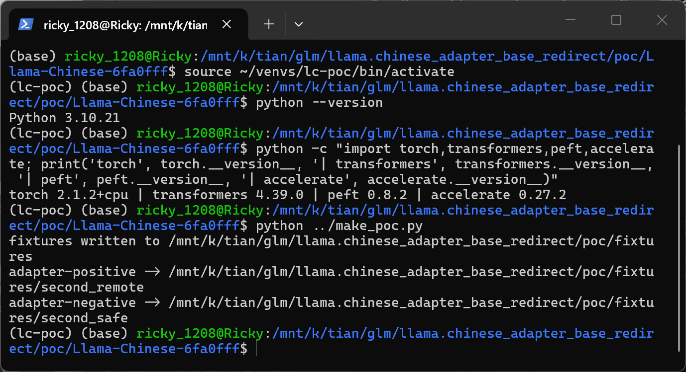
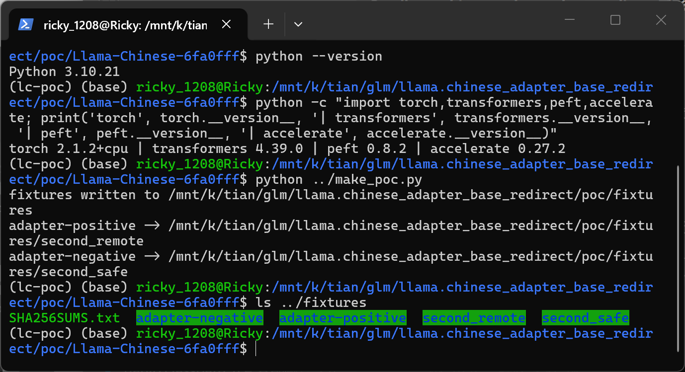
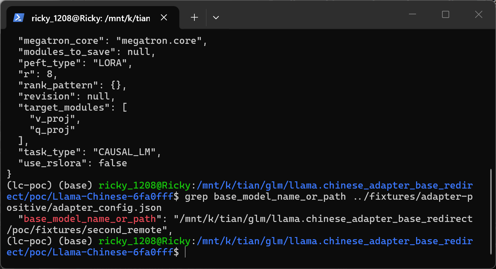
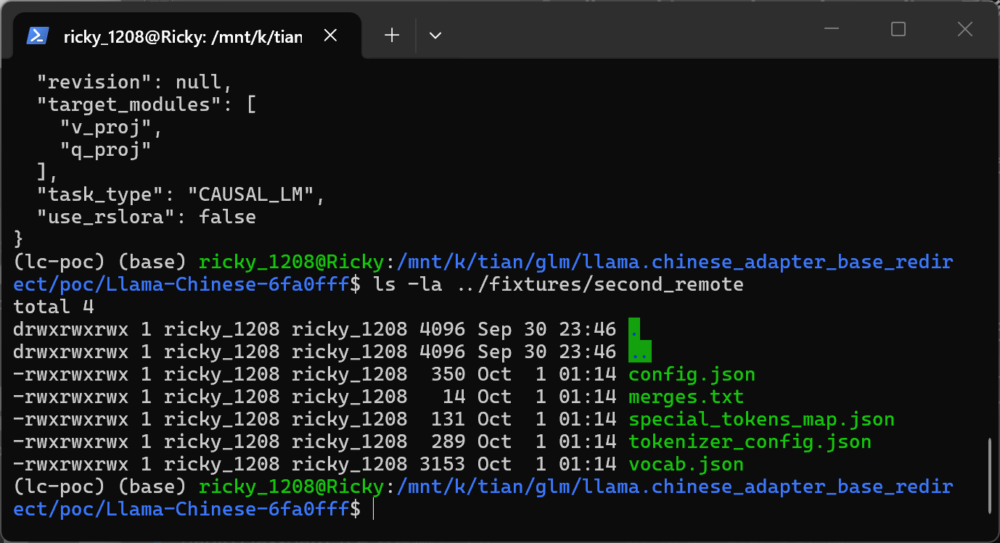
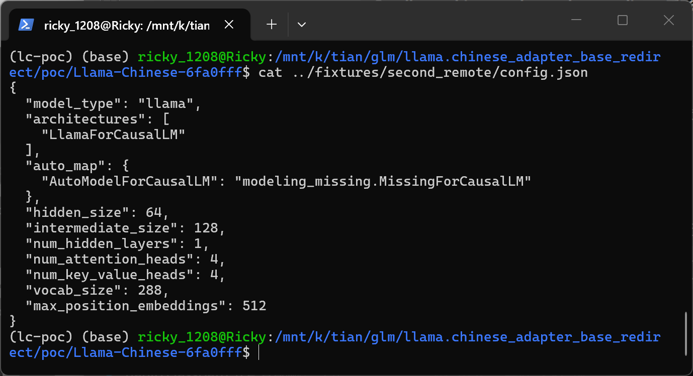
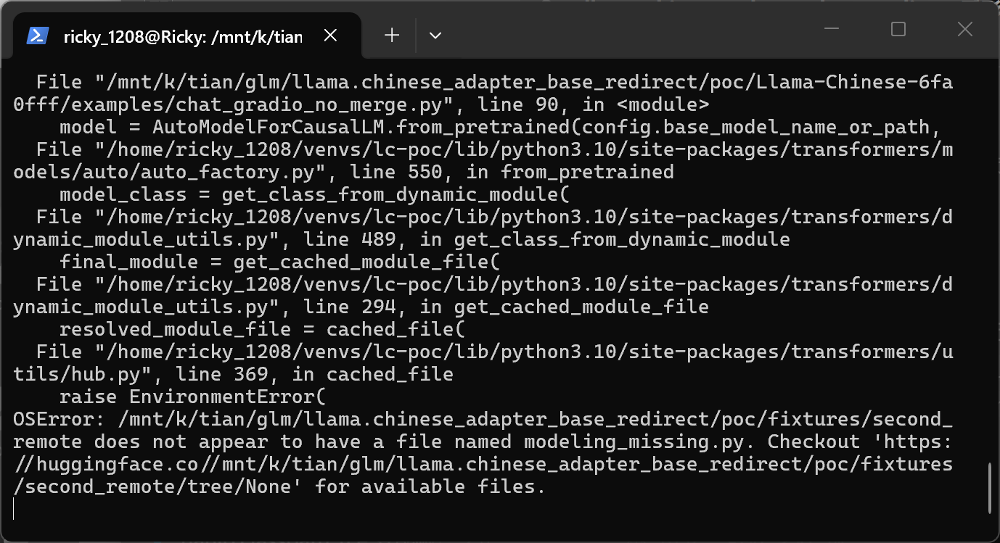
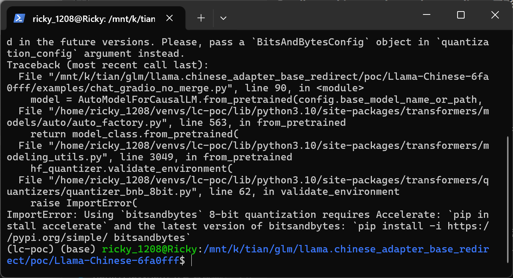
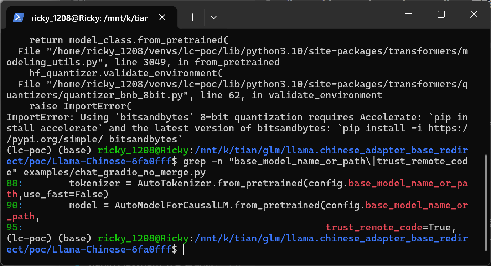

# Llama-Chinese commit 6fa0fff — Untrusted Base-Model Redirect with Hardcoded trust_remote_code=True in examples/chat_gradio_no_merge.py (CWE-94: Code Injection)

## Summary

LlamaChinese Llama-Chinese at commit 6fa0fff (current main HEAD) is affected by a model-supply-chain authorization gap in the `examples/chat_gradio_no_merge.py` inference entry point. The script reads a PEFT LoRA adapter package supplied on the command line and uses the adapter-controlled `base_model_name_or_path` field from `adapter_config.json` as the load path for both the tokenizer and the base model, while passing a hardcoded `trust_remote_code=True` to `AutoModelForCausalLM.from_pretrained`. A LoRA adapter whose weights are entirely benign can therefore redirect the second stage of model loading to any attacker-chosen repository or directory, and the product will honor that target's `config.json` `auto_map` entry by resolving and requesting its custom modeling code through transformers' dynamic-module machinery. In a controlled test where the attacker-chosen directory deliberately ships no Python file, the process still resolved the attacker-named module path (`modeling_missing.MissingForCausalLM`) and failed only because the file was absent — proving that the redirect and the remote-code resolution were both honored by the product. The finding is limited to this unvalidated redirect/authorization gap; execution of code delivered by the second repository is the conditional next stage and is not included in the evidence below.

## Affected Product

| Field | Value |
|---|---|
| Vendor | LlamaChinese (open-source community organization) |
| Product | Llama-Chinese |
| Affected versions | commit 6fa0fffb0dd82fe3cfaa1449ee54a5806d26ae9b (2025-04-06, current main HEAD); vulnerable file unchanged since commit 0ebaa0d, 2024-01-30 |
| Component | `examples/chat_gradio_no_merge.py`, `__main__` block, lines 87–96 (PEFT adapter loading path) |
| Platform | OS-independent Python entry point (verified on WSL2 Ubuntu 24.04, x86_64, CPU-only host) |
| Vulnerability type | CWE-94: Code Injection (untrusted source selection for remote-code loading; model-artifact-controlled base-model redirect) |

## Root Cause

**Location:** `examples/chat_gradio_no_merge.py:87-96` (`__main__` block), commit `6fa0fffb0dd82fe3cfaa1449ee54a5806d26ae9b`

The script builds a `PeftConfig` from the operator-supplied adapter path and then reuses the adapter-defined `base_model_name_or_path` string as the source for the tokenizer and the base model. `base_model_name_or_path` is ordinary attacker-controlled JSON data returned unmodified by `PeftConfig.from_pretrained`; it is never checked against the adapter's expected origin, the operator's intent, or any allowlist. Because `trust_remote_code=True` is hardcoded, a base config that declares an `auto_map` entry makes transformers resolve the referenced class from the attacker-chosen location via `get_class_from_dynamic_module` — i.e., the artifact decides both where the second model comes from and whether custom code is fetched for it, without any re-validation at the new use site.

```python
# examples/chat_gradio_no_merge.py:87-96 (commit 6fa0fff)
config = PeftConfig.from_pretrained(args.model_name_or_path)
tokenizer = AutoTokenizer.from_pretrained(config.base_model_name_or_path,use_fast=False)
tokenizer.pad_token = tokenizer.eos_token
model = AutoModelForCausalLM.from_pretrained(config.base_model_name_or_path,
                                             device_map='cuda:0' if torch.cuda.is_available() else "auto",
                                             torch_dtype=torch.float16,
                                             load_in_8bit=True,
                                             low_cpu_mem_usage=True,
                                             trust_remote_code=True,
                                             use_flash_attention_2=True)
```

The trust-delegation chain: (1) the attacker controls the adapter package, hence `adapter_config.json`; (2) `PeftConfig.from_pretrained` parses and returns `base_model_name_or_path` verbatim; (3) the downstream call sites (tokenizer at line 88, model at line 90) consume it as a load path without binding it to the operator-supplied base model or re-validating it; (4) the hardcoded `trust_remote_code=True` at line 95 grants the redirected target permission to supply custom modeling code. A LoRA adapter semantically only describes weight deltas, so this capability exceeds what the artifact format should authorize — the adapter is granted authority over second-stage code-source selection it never earned.

## Proof of Concept

### Prerequisites

- Python environment with the repository's pinned inference dependencies (verified with `torch 2.1.2+cpu`, `transformers 4.39.0`, `peft 0.8.2`, `accelerate 0.27.2`, `bitsandbytes 0.42.0`, `numpy 1.26.4`, `gradio 6.17.3` per the repo `requirements.txt` pins; `gradio` is imported by the entry point).
- No GPU is required: the redirect evidence fires before any quantization work.
- The victim (operator) runs the repository's standard Gradio chat entry on an attacker-supplied adapter directory.

### Steps to Reproduce

1. Build the fixtures with the accompanying script `poc/make_poc.py`. It generates two PEFT adapter packages and two second-stage model directories under `poc/fixtures/`: `adapter-positive` and `adapter-negative` differ only in the JSON value of `base_model_name_or_path` (`second_remote` vs `second_safe`); `second_remote/config.json` declares `"auto_map": {"AutoModelForCausalLM": "modeling_missing.MissingForCausalLM"}` while `second_safe/config.json` omits `auto_map`. Neither second-stage directory contains any `.py` file, so no code is actually delivered.





2. Inspect the attack field. In the positive package it points at the attacker-chosen directory; in the negative control it points at the benign one — this single JSON value is the entire difference between the two runs.




3. Confirm the attacker-chosen directory ships only config and tokenizer files, with `auto_map` naming a module whose `.py` does not exist.





4. Run the product's real entry point on the positive adapter:

```bash
python examples/chat_gradio_no_merge.py --model_name_or_path ../fixtures/adapter-positive
```



The traceback shows `chat_gradio_no_merge.py:90` calling `AutoModelForCausalLM.from_pretrained(config.base_model_name_or_path, ...)`, which enters transformers' remote-code branch (`auto_factory.py:550 → get_class_from_dynamic_module`) and attempts to fetch `modeling_missing.py` from the attacker-chosen directory, aborting only because that file was deliberately not shipped:

```text
File ".../examples/chat_gradio_no_merge.py", line 90, in <module>
    model = AutoModelForCausalLM.from_pretrained(config.base_model_name_or_path,
File ".../transformers/models/auto/auto_factory.py", line 550, in from_pretrained
    model_class = get_class_from_dynamic_module(
File ".../transformers/dynamic_module_utils.py", line 489, in get_class_from_dynamic_module
    final_module = get_cached_module_file(
File ".../transformers/utils/hub.py", line 369, in cached_file
    raise EnvironmentError(
OSError: .../fixtures/second_remote does not appear to have a file named modeling_missing.py.
```

5. Run the identical entry point on the negative control (same package, only the base path field now points at the benign directory without `auto_map`):

```bash
python examples/chat_gradio_no_merge.py --model_name_or_path ../fixtures/adapter-negative
```



The negative run proceeds down the standard local-code branch (`auto_factory.py:563 → model_class.from_pretrained`) and never attempts dynamic-module resolution; on this CPU-only host it aborts at the unrelated 8-bit quantization environment check (`quantizer_bnb_8bit.py:62 → ImportError`). The differential isolates the single JSON field as the trigger of the attacker-chosen code resolution.

6. Pin the vulnerable lines in the audited source:



### Expected vs Actual

- Expected: a LoRA adapter only contributes weight deltas; the base model and its code source should be chosen by the operator (or bound to the adapter's declared origin after re-validation), and custom modeling code should never be fetched without an explicit operator trust decision.
- Actual: the adapter's `base_model_name_or_path` unilaterally redirects the tokenizer and base-model load to an attacker-chosen location, and the hardcoded `trust_remote_code=True` makes the product resolve that location's attacker-named modeling code path. In the test the module file was intentionally absent, so the observable is the code-resolution request itself; had the attacker's repository delivered the file, transformers would have imported it into the product's process.

### Sanitized PoC input

The complete package specification is generated by `poc/make_poc.py` (hashes in `poc/fixtures/SHA256SUMS.txt`). Core of the positive package:

```json
{
  "base_model_name_or_path": "/home/<operator>/poc-work/fixtures/second_remote",
  "peft_type": "LORA",
  "r": 8,
  "lora_alpha": 16,
  "lora_dropout": 0.05,
  "target_modules": ["q_proj", "v_proj"],
  "task_type": "CAUSAL_LM"
}
```

```json
{
  "model_type": "llama",
  "architectures": ["LlamaForCausalLM"],
  "auto_map": {"AutoModelForCausalLM": "modeling_missing.MissingForCausalLM"}
}
```

`adapter_model.safetensors` contains four small random LoRA tensors and is never even read by the entry point before the redirect fires — the weights are irrelevant to the attack. Terminal screenshots show the test operator's own WSL home path; all report text uses `<operator>` placeholders.

## Impact

- Confidentiality: High — with a second-stage repository that delivers modeling code, the attacker's Python executes inside the operator's process (weights, files, and credentials accessible to that process); even without code delivery, the attacker silently chooses which model the victim runs.
- Integrity: High — the tokenizer and base model are substituted by attacker-chosen artifacts, corrupting the behavior and outputs of the inference service; imported custom code can modify arbitrary state.
- Availability: High — arbitrary imported code (or a malicious model config) can crash or hang the service.
- Scope: model-supply-chain redirect plus conditional arbitrary code execution via the trust_remote_code path; the demonstrated evidence stops at the code-request boundary by design (no .py was shipped in the test fixture).


## Remediation

- Do not treat `base_model_name_or_path` from an untrusted adapter config as a load path: require the operator to pass the base model explicitly, or validate the adapter-declared base against a signed manifest/allowlist and warn-and-confirm on mismatch.
- Remove the hardcoded `trust_remote_code=True`; default third-party loads to `False` and make any remote-code use an explicit, per-repository operator decision pinned to an immutable revision (commit hash), never a mutable ref.
- Validate the tokenizer source identically (line 88 loads it from the same attacker-controlled field).
- Optionally surface the check upstream in PEFT (e.g., an option to reject or warn when an adapter's declared base differs from the operator's expectation).


## References

- Source repository: https://github.com/LlamaChinese/Llama-Chinese
- Vulnerable file at pinned commit: https://github.com/LlamaChinese/Llama-Chinese/blob/6fa0fffb0dd82fe3cfaa1449ee54a5806d26ae9b/examples/chat_gradio_no_merge.py
- Repository security policy: none published (`/security/policy` states "No security policy detected"); upstream report URL [pending publication]
- CWE: https://cwe.mitre.org/data/definitions/94.html
- Related transformer mechanism: transformers `dynamic_module_utils.get_class_from_dynamic_module` (remote-code resolution gated by `trust_remote_code`)
