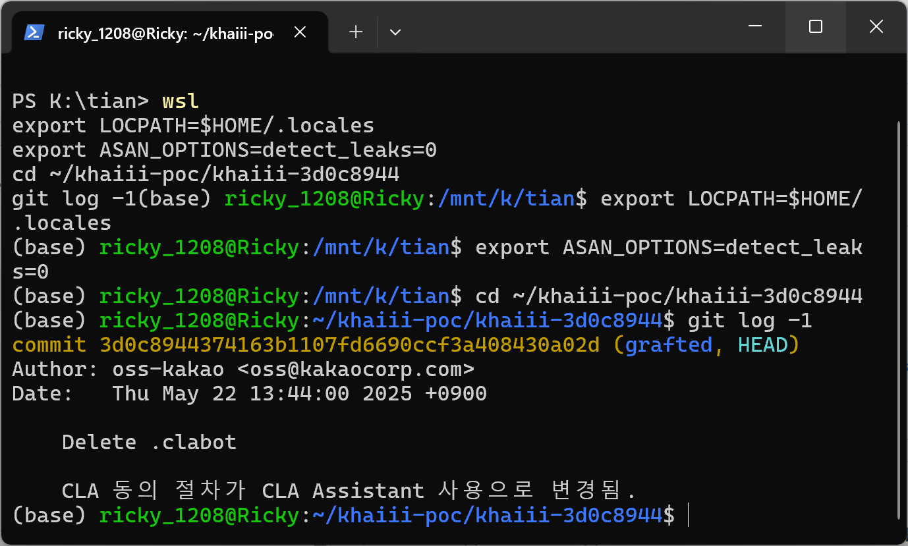
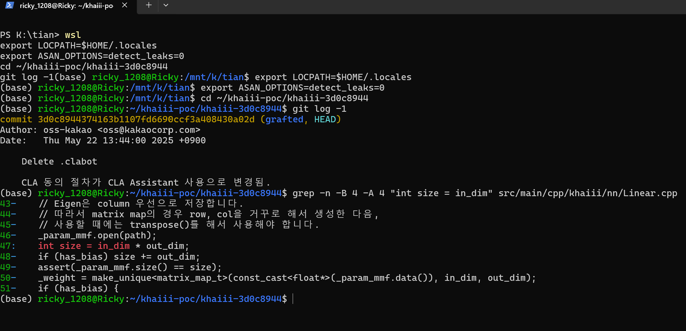
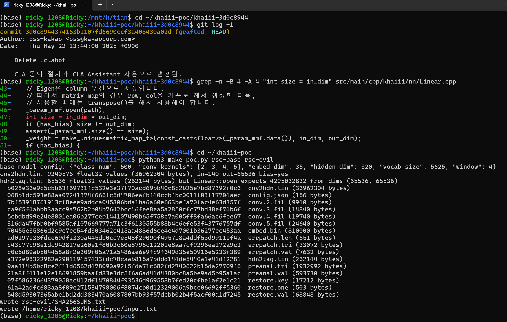
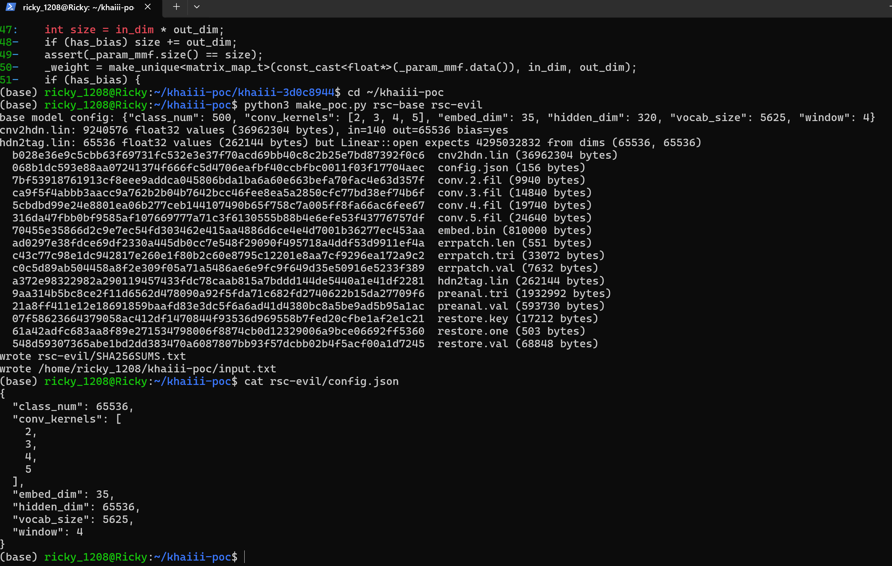
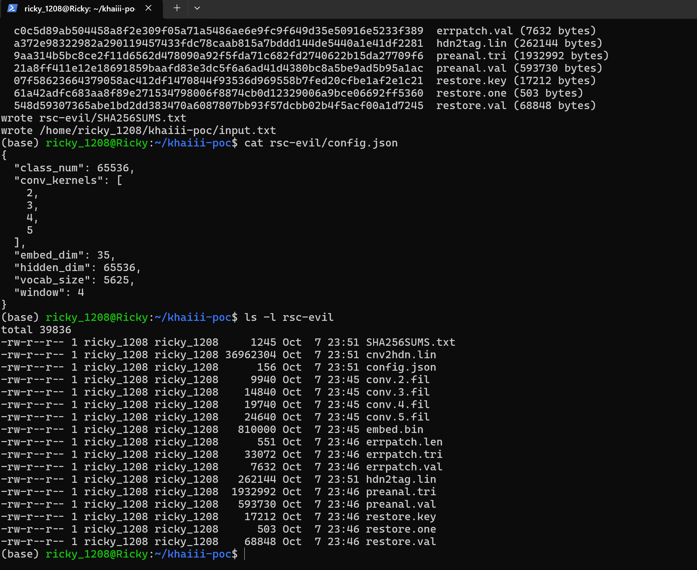
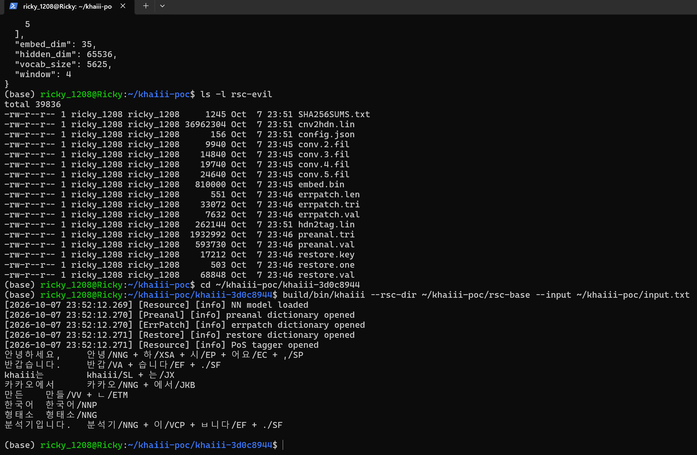
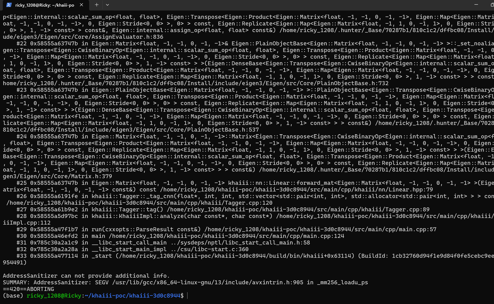
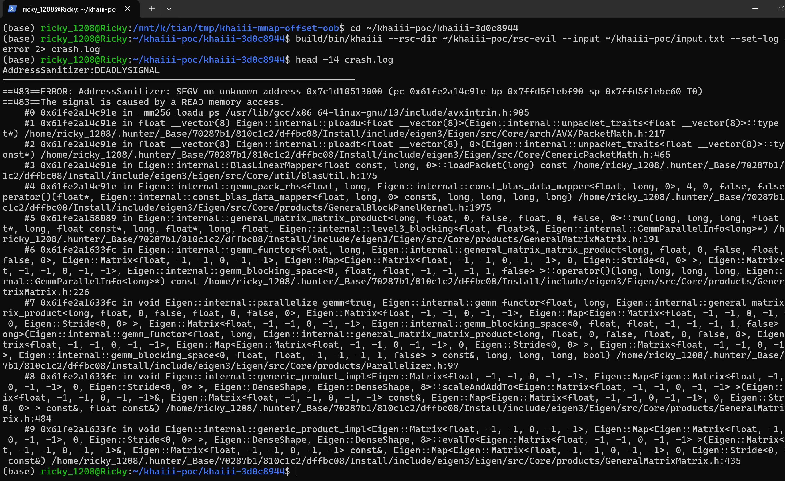

# khaiii (current master, commit 3d0c8944) — Out-of-bounds Read in nn::Linear::open via 32-bit Integer Overflow

## Summary

Kakao khaiii (Korean Hangul Analyzer III, current master commit 3d0c8944374163b1107fd6690ccf3a408430a02d, version string 0.4) is affected by an out-of-bounds read in the neural-network layer loader `khaiii::nn::Linear::open`. The loader computes the expected parameter-file size as a 32-bit `int` product of two attacker-controlled dimensions from the model's `config.json`. For `hidden_dim = class_num = 65536` the product `65536 × 65536 = 2^32` wraps to 0, so a `hdn2tag.lin` file containing only 65536 float32 values (256 KiB) passes the length assertion that should require ~16 GiB of weights. The layer is then memory-mapped and wrapped in an Eigen matrix map with the original 65536×65536 dimensions, and the first morphological-analysis request makes the Eigen GEMM kernel read far past the end of the 256 KiB mapping, crashing the process (SEGV, READ). An attacker who can place or substitute a model resource directory consumed by khaiii (CLI or any service embedding libkhaiii) can crash the analyzer with a minimal data-only model package; no program sidecar is required.

## Affected Product

| Field | Value |
|---|---|
| Vendor | Kakao Corp. |
| Product | khaiii (Korean Hangul Analyzer III) |
| Affected versions | master commit 3d0c8944374163b1107fd6690ccf3a408430a02d (2025-05-22, HEAD of master at the time of writing, verified via GitHub compare API); version string 0.4, latest tagged release v0.4 (2019-06-17) |
| Component | `src/main/cpp/khaiii/nn/Linear.cpp` — `khaiii::nn::Linear::open`; reached via `khaiii::Resource::open` / `khaiii::Tagger::_tag_cnn` |
| Platform | Linux x86-64 (verified on Ubuntu 24.04 under WSL2, GCC 13.3.0, CMake 3.28.3, hunter-pinned Eigen 3.3.5, built with `-fsanitize=address`); the defect is in 32-bit integer arithmetic and mmap handling and is platform-independent at the source level |
| Vulnerability type | CWE-125: Out-of-bounds Read (root cause: CWE-190: Integer Overflow to Buffer Overflow) |

## Root Cause

**Location:** `src/main/cpp/khaiii/nn/Linear.cpp:47-50` (`khaiii::nn::Linear::open`)

`Resource::open` loads the tagger's output layer from the model directory with dimensions taken verbatim from the model's `config.json` (`src/main/cpp/khaiii/Resource.cpp:52-53`): `hdn2tag.open(path, cfg.hidden_dim, cfg.class_num, true)`. `Config::set_members` only checks that both values are positive integers, so 65536 is accepted. `Linear::open` then validates the size of the memory-mapped weight file with a 32-bit computation and, without any further check, constructs an Eigen map with the original dimensions:

```cpp
_param_mmf.open(path);
int size = in_dim * out_dim;              // 65536 * 65536 = 2^32 wraps to 0 in 32-bit int
if (has_bias) size += out_dim;            // 0 + 65536 = 65536
assert(_param_mmf.size() == size);        // file with 65536 float32 values passes
_weight = make_unique<matrix_map_t>(const_cast<float*>(_param_mmf.data()), in_dim, out_dim);
```

`_param_mmf` is a `MemMapFile<float>` whose `size()` returns the number of mapped elements (`MemMapFile.hpp:104-110`), and `matrix_map_t` is `Eigen::Map<Eigen::MatrixXf>` (`nn/tensor.hpp:26`). Three facts make the defect reachable and exploitable:

1. The expected element count is computed in 32-bit `int`. For `in_dim = out_dim = 65536` the true count `hidden_dim × class_num + class_num = 4,295,032,832` overflows to `65536`, so the `assert` accepts a 256 KiB file that should have to contain ~16 GiB of weights.
2. The Eigen map is nevertheless created with the **unreduced** dimensions (65536 × 65536), presenting a ~16 GiB matrix view over a 256 KiB mapping.
3. Both dimensions come from the model package's `config.json`, which khaiii reads from the resource directory it is pointed at; `Resource::open` returns successfully, so every subsequent `analyze()` call runs the normal tagger forward pass. During `hdn2tag.forward_mat(hidden_outs)` (`Tagger.cpp:120`, product at `Linear.hpp:79`), the Eigen GEMM kernel streams the mapped weight matrix and reads past the end of the 256 KiB mapping, which sits on exactly 64 pages, hitting an unmapped page (SEGV, READ).

The same wrap-around also mis-points the bias map (`_param_mmf.data() + in_dim * out_dim` wraps to the start of the file), underlining that the size bookkeeping of this layer is not 64-bit safe anywhere.

## Proof of Concept

### Prerequisites

- A Linux build environment (verified on Ubuntu 24.04 / WSL2) with `cmake`, `g++` and Python 3; khaiii fetches its C++ dependencies through hunter during configure.
- khaiii pinned at commit 3d0c8944374163b1107fd6690ccf3a408430a02d, configured with AddressSanitizer: `cmake -DCMAKE_CXX_FLAGS="-fsanitize=address -fno-omit-frame-pointer" -DCMAKE_EXE_LINKER_FLAGS="-fsanitize=address" .. && make bin_khaiii`. Two build-system notes for reproducibility, neither of them touching the vulnerable code path: hunter 0.23.34 has no prebuilt GTest for GCC 13 and its source build fails there, so the test-only GTest dependency is skipped via a minimal `BUILD_TEST` option in `CMakeLists.txt` (patch: `cmake-build-test-optional.diff`, 45 lines); and hunter's pinned `cxxopts.hpp` needs a one-line `#include <limits>` addition under GCC 13.
- An `en_US.UTF-8` locale must be resolvable at runtime (`Sentence.cpp:112` constructs `std::locale("en_US.UTF-8")`; the upstream Dockerfile installs `language-pack-ko` for the same reason). On a minimal system a user-owned locale works: `localedef -i en_US -f UTF-8 ~/.locales/en_US.UTF-8` with `LOCPATH=~/.locales`. `ASAN_OPTIONS=detect_leaks=0` is used below only to silence an unrelated, pre-existing 128-byte leak in `Conv1d::open` that LeakSanitizer reports at normal exit.
- The negative control is the **official base model resource**, compiled from the pinned source itself with the upstream scripts (`rsc/bin/compile_model.py`, `compile_preanal.py`, `compile_restore.py`, `compile_errpatch.py` against `rsc/src`); its `config.json` is `{"class_num": 500, "conv_kernels": [2, 3, 4, 5], "embed_dim": 35, "hidden_dim": 320, "vocab_size": 5625, "window": 4}`.

### Steps to Reproduce

1. Pin khaiii at the affected commit and build the CLI with AddressSanitizer as described above.



This is a real terminal window: `git log -1` shows the source tree is exactly at commit 3d0c8944374163b1107fd6690ccf3a408430a02d (HEAD of master, "Delete .clabot", 2025-05-22). Captured 2026-10-07.

2. Confirm the vulnerable size computation in the pinned source.



`grep -n -B 4 -A 4 "int size = in_dim" src/main/cpp/khaiii/nn/Linear.cpp` shows lines 47-50: the 32-bit product, the bias addition, the assertion against the wrapped value, and the Eigen map built with the unreduced dimensions.

3. Generate the malicious model directory from the official resource with the attached `make_poc.py`. The script copies the official base model, sets `"hidden_dim": 65536` and `"class_num": 65536` in `config.json`, regenerates `cnv2hdn.lin` to the exact size the loader expects for the new `hidden_dim` (4×35×65536 + 65536 = 9,240,576 float32 values, so its own assertion still passes), and writes `hdn2tag.lin` with exactly 65536 float32 values (262,144 bytes) — the element count that `Linear::open` computes after the 32-bit wrap. It also writes the paired `input.txt` used for both runs and a `SHA256SUMS.txt` manifest. Only JSON and native float32 array data are involved; no program sidecar.



`python3 make_poc.py rsc-base rsc-evil` prints the base configuration and the generated sizes: `hdn2tag.lin: 65536 float32 values (262144 bytes) but Linear::open expects 4295032832 from dims (65536, 65536)`.



`cat rsc-evil/config.json` shows `"hidden_dim": 65536` and `"class_num": 65536` with the remaining official model parameters untouched.



`ls -l rsc-evil` shows the short `hdn2tag.lin` at 262,144 bytes next to the regenerated 36,962,304-byte `cnv2hdn.lin` and the unchanged official dictionary files.

4. Negative control — the unmodified official model analyzes normally:



`build/bin/khaiii --rsc-dir ~/khaiii-poc/rsc-base --input ~/khaiii-poc/input.txt` loads the model, prints `PoS tagger opened`, and emits the expected morphological analysis for the input sentence (e.g. `안녕/NNG + 하/XSA + 시/EP + 어요/EC`), then exits cleanly.

5. Positive case — the same CLI, same input text, only the model directory swapped for the crafted one:



`build/bin/khaiii --rsc-dir ~/khaiii-poc/rsc-evil --input ~/khaiii-poc/input.txt` completes `Resource::open` (`NN model loaded`, `PoS tagger opened` — the wrapped assertion accepted the short file), then crashes during the first analysis inside Eigen's GEMM kernel. The visible tail of the sanitizer report shows the khaiii frames: `Linear::forward_mat` (`Linear.hpp:79`) → `Tagger::_tag_cnn` (`Tagger.cpp:120`) → `Tagger::tag` → `KhaiiiImpl::analyze` → `main`, ending with `SUMMARY: AddressSanitizer: SEGV ... in _mm256_loadu_ps` and `ABORTING`.

6. The head of the same sanitizer report identifies the access itself:



`AddressSanitizer:DEADLYSIGNAL`, `ERROR: AddressSanitizer: SEGV on unknown address 0x7c1d10513000` and `The signal is caused by a READ memory access.` — the faulting address is the first page-aligned address past the end of the 262,144-byte weight mapping, read by Eigen's `ploadu` packet load (`avxintrin.h:905`) while streaming the phantom 65536×65536 weight matrix.

### Expected vs Actual

- Expected: khaiii refuses to load a model whose `hdn2tag.lin` (262,144 bytes) is far smaller than what `hidden_dim × class_num + class_num` requires (~16 GiB), reporting an invalid or truncated resource; the analyzer keeps running.
- Actual: the 32-bit size computation wraps to exactly 65536, the assertion passes, `Resource::open` reports success, and the first analysis request dereferences the oversized matrix view, terminating the process with SIGSEGV (ASan: SEGV on unknown address, READ).

### Sanitized PoC input

- Text input (`input.txt`, shared by both runs): `안녕하세요, 반갑습니다. khaiii는 카카오에서 만든 한국어 형태소 분석기입니다.`
- Malicious model package (all paths relative to the resource directory): `config.json` with `"hidden_dim": 65536, "class_num": 65536`; `hdn2tag.lin` = 65536 random float32 values; `cnv2hdn.lin` = 9,240,576 random float32 values; all other files byte-identical to the official base model. Generated by `poc/make_poc.py`; checksums in `poc/SHA256SUMS.txt`.

## Impact

- Confidentiality: High — the component reads out of the bounds of a memory-mapped model file under attacker-controlled dimensions; out-of-bounds reads of this class can return adjacent memory contents into the analyzer's computation and outputs. (In the demonstrated run the read walks off the mapping onto an unmapped page and crashes, so no information disclosure was observed or claimed.)
- Integrity: None — the defect is a read; no attacker-controlled write is demonstrated.
- Availability: High — the analyzer process deterministically crashes with SIGSEGV on the first analysis request; any service embedding libkhaiii with a poisoned model directory loses its analysis capability until the model is replaced.
- Scope: memory corruption (out-of-bounds read via integer-overflow-wrapped size validation); crash demonstrated, no exploit chain beyond the crash is claimed.

## Remediation

Compute the expected parameter count in 64-bit (`long long` / `size_t`) at `src/main/cpp/khaiii/nn/Linear.cpp:47-49` (and the same pattern in `Conv1d::open` and the `in_dim * out_dim` pointer offset for the bias), compare it against `_param_mmf.size()` with a checked failure path instead of an `assert` (asserts vanish under `NDEBUG`), and reject dimension pairs whose 64-bit product exceeds the mapped size before constructing the Eigen map. Until a fixed release is available, only run khaiii against model directories whose provenance is trusted and whose `config.json` dimensions match the shipped parameter file sizes.


## References

- Source repository: https://github.com/kakao/khaiii
- Vulnerable source at pinned commit: https://github.com/kakao/khaiii/blob/3d0c8944374163b1107fd6690ccf3a408430a02d/src/main/cpp/khaiii/nn/Linear.cpp (lines 47-50)
- Upstream report: [pending publication]
- CWE-125: https://cwe.mitre.org/data/definitions/125.html
- CWE-190: https://cwe.mitre.org/data/definitions/190.html
- Vendor advisory: [none]
