# Scrypted OpenVINO Plugin — Path Traversal Arbitrary File Write in Custom Model Download

## Summary

Scrypted (koush/scrypted) at git commit 5ed7603ff6a2d5c0d15fc98aa84c6738d93bdd1c (@scrypted/openvino plugin 0.1.200) is affected by a path traversal (CWE-22) in the custom model download routine of the OpenVINO plugin. When a Scrypted administrator adds a custom OpenVINO model by URL, the plugin reads a `config.json` manifest and downloads every entry of its `files` array. The manifest-supplied file names are concatenated into the local model cache path without any traversal check, so a manifest whose `files` entry contains `../` segments causes the downloaded file — with fully attacker-controlled content — to be written to an arbitrary filesystem location with the privileges of the Scrypted service account (root in the official Docker image). The same primitive also creates attacker-named directories via `os.makedirs`. A malicious model package is pure data (no Python/JavaScript, no native libraries, no pickles, no symlinks), so no code execution inside the model format is required.

## Affected Product

| Field | Value |
|---|---|
| Vendor | koush (Scrypted) |
| Product | Scrypted, OpenVINO object detection plugin (`@scrypted/openvino`) |
| Affected versions | git commit 5ed7603ff6a2d5c0d15fc98aa84c6738d93bdd1c (2026-09-23, main branch), plugin package version 0.1.200; the repository's SECURITY.md lists 0.145.0 as the latest supported release at the time of writing |
| Component | `plugins/openvino/src/predict/custom_detect.py` (`CustomDetection.init_model`), `plugins/openvino/src/predict/__init__.py` (`PredictPlugin.downloadFile`), `plugins/openvino/src/common/path_tools.py` (`replace_last_path_component`) |
| Platform | Linux (official scrypted Docker image), any host running the Scrypted server with the OpenVINO plugin installed |
| Vulnerability type | CWE-22: Path Traversal |

## Root Cause

**Location:** `plugins/openvino/src/predict/custom_detect.py:51-56` (`CustomDetection.init_model`) and `plugins/openvino/src/predict/__init__.py:119-147` (`PredictPlugin.downloadFile`)

When an administrator creates a custom model device, `PredictPlugin.createDevice` (`plugins/openvino/src/predict/__init__.py:496-529`) fetches the manifest at the user-supplied model URL (which must end in `config.json`, or is converted from a GitHub repository URL), stores it in device storage, and calls `init_model()`. `init_model` then iterates the manifest's `files` array and downloads each entry, using the manifest-supplied name both to build the remote URL and the local destination path:

```python
files: list[str] = config["files"]
local_files: list[str] = []
for file in files:
    remote_file = replace_last_path_component(config_url, file)
    localFile = self.downloadFile(remote_file, f"{self.id}/{file}")
    local_files.append(localFile)
```

`downloadFile` joins that name onto the plugin's file volume without sanitization and writes the downloaded bytes:

```python
filesPath = os.path.join(os.environ["SCRYPTED_PLUGIN_VOLUME"], "files")
fullpath = os.path.join(filesPath, filename)   # filename = f"{self.id}/{file}" — attacker-controlled "../" segments are kept verbatim
...
os.makedirs(os.path.dirname(fullpath), exist_ok=True)   # creates attacker-named directories outside the volume
response = urllib.request.urlopen(url)
...
with open(tmp, "wb") as f: ...              # writes attacker-controlled content at the escaped path
os.rename(tmp, fullpath)
```

`os.path.join` does not normalize `..` segments, and both `os.makedirs` and `open` resolve them at the OS level, so the destination escapes the model cache directory. The `files` entry is attacker-controlled because the manifest is fetched from the attacker's URL; `replace_last_path_component` (`common/path_tools.py`) merely swaps the last URL path segment for the attacker's name and preserves the `../` segments, so the same string serves as the remote path (resolving on the attacker's server to any file they host) and as the local path (resolving on the victim to any writable location). In the official Docker deployment `SCRYPTED_PLUGIN_VOLUME` is `<volume>/plugins/@scrypted/openvino`, so seven `../` segments escape to the filesystem root; excess `../` segments clamp at the root, so the attacker does not need to know the exact deployment depth.

## Proof of Concept

### Prerequisites

- A Scrypted installation with the OpenVINO plugin where the victim administrator adds a custom model ("Model" device) from an attacker-supplied URL — the plugin's device-creator dialog explicitly invites arbitrary model URLs and links a third-party sample model, which normalizes installing models from untrusted sources.
- An attacker HTTP server hosting the malicious model package (static file serving is sufficient).
- The reproduction below runs the unmodified `CustomDetection.init_model()` and `PredictPlugin.downloadFile()` functions from the pinned commit against such a static server. Only the Scrypted SDK device runtime is stubbed (a device id string, a key/value storage, and a `deviceManager` hook returning the storage); `PredictPlugin.createDevice`'s fetch-store-init sequence is replicated by the driver. Reproduction host: WSL2 Ubuntu 24.04.3 LTS, Python 3.12.3, run as root to match the official Docker image's service account, with `SCRYPTED_PLUGIN_VOLUME=/server/volume/plugins/@scrypted/openvino` mirroring the container layout.

### Steps to Reproduce

1. Prepare the environment: WSL2 Ubuntu 24.04, Python 3.12.3 in a virtualenv with numpy and Pillow, the pinned scrypted checkout at commit 5ed7603.

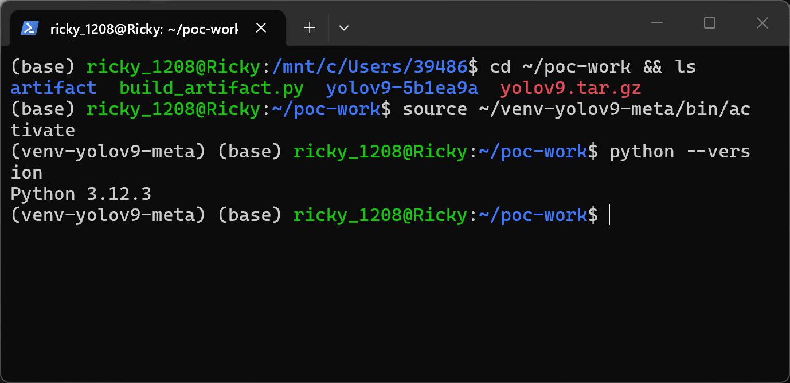

2. Confirm the vulnerable code is present at the pinned commit (lines 51-56 of `plugins/openvino/src/predict/custom_detect.py`).

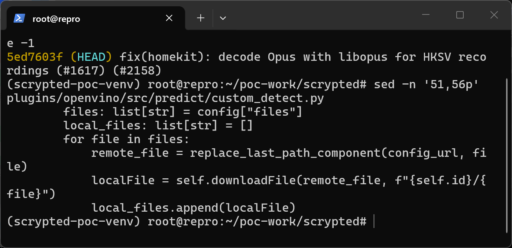

3. Generate the attacker-hosted model packages with `make_poc.py`: a positive package whose `config.json` contains the traversal `files` entry and a negative control package whose `files` entry is the ordinary model file name `model.bin`. Both packages are pure data (JSON plus a flat binary blob — no executable content of any kind).

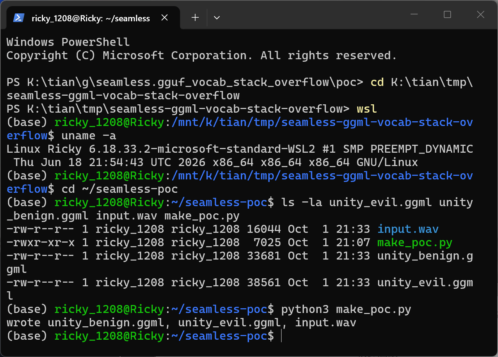

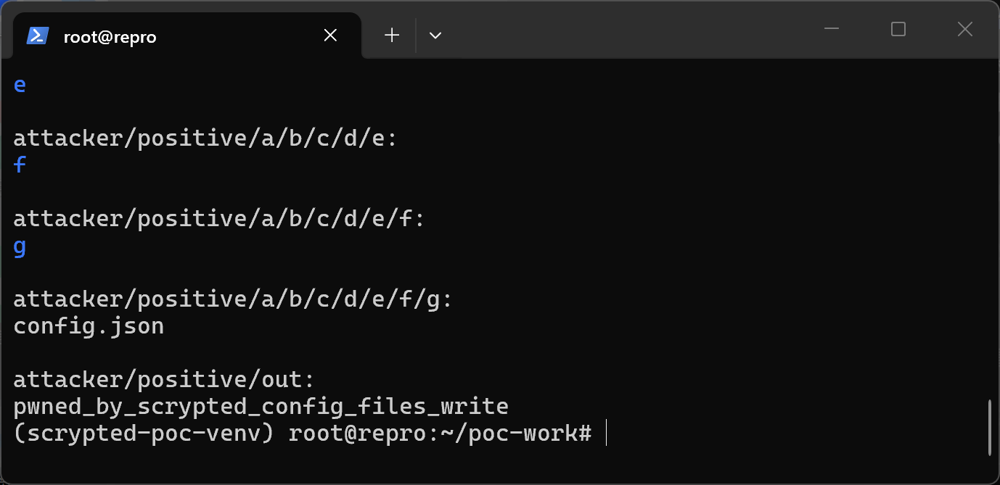

4. Serve the attacker directory with a static HTTP server and verify the manifest is served at the model URL.

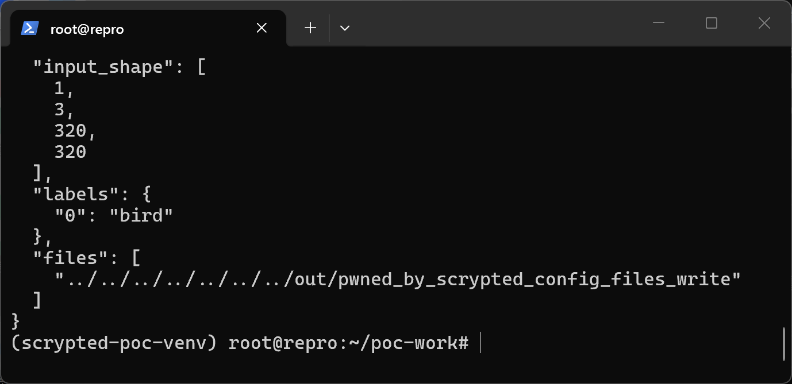

5. Add the custom model by running the driver with the positive package's config URL, which replicates `createDevice`: fetch `config.json`, store it, call the real `init_model()`. The plugin resolves the `files` entry to the attacker's payload URL and writes it through the unsanitized local path.

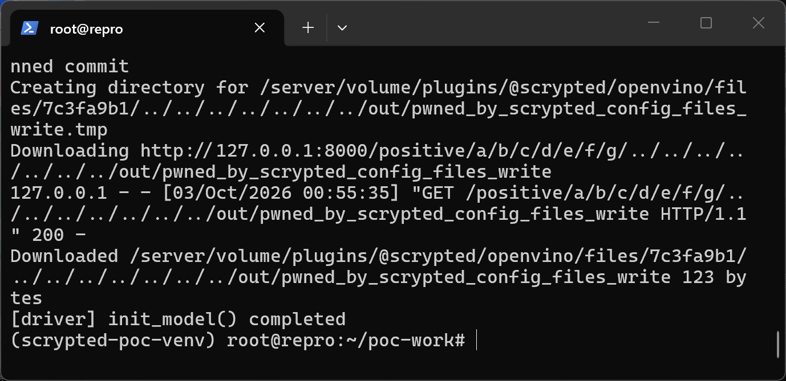

6. The downloaded file lands outside the entire plugin volume, at the filesystem root `/out/pwned_by_scrypted_config_files_write`, with the attacker-controlled content; the plugin's own volume contains only empty directories.

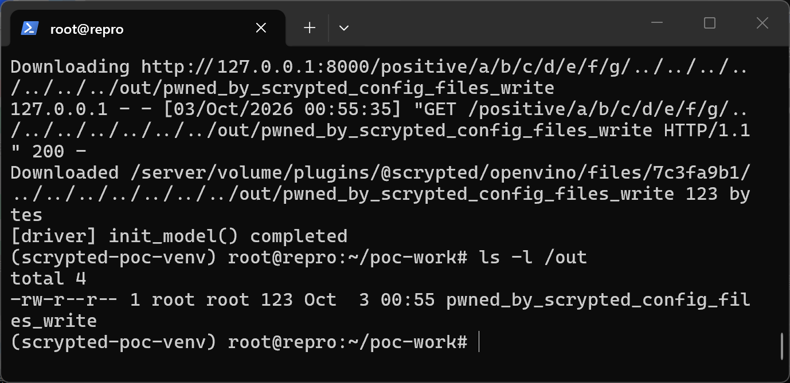

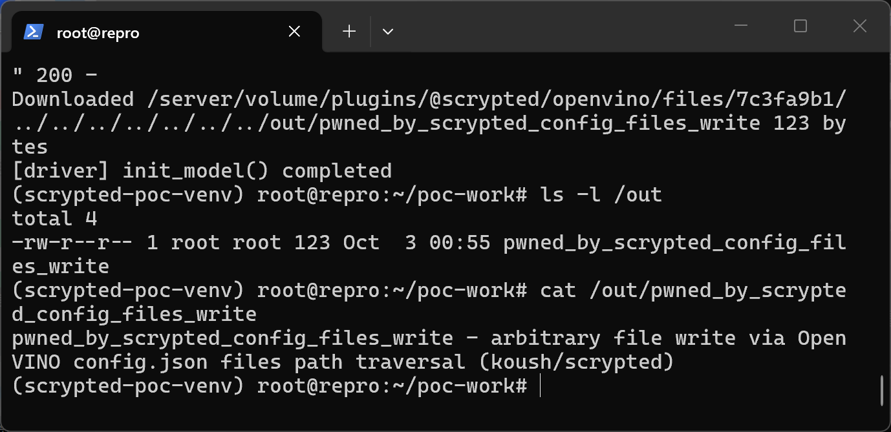

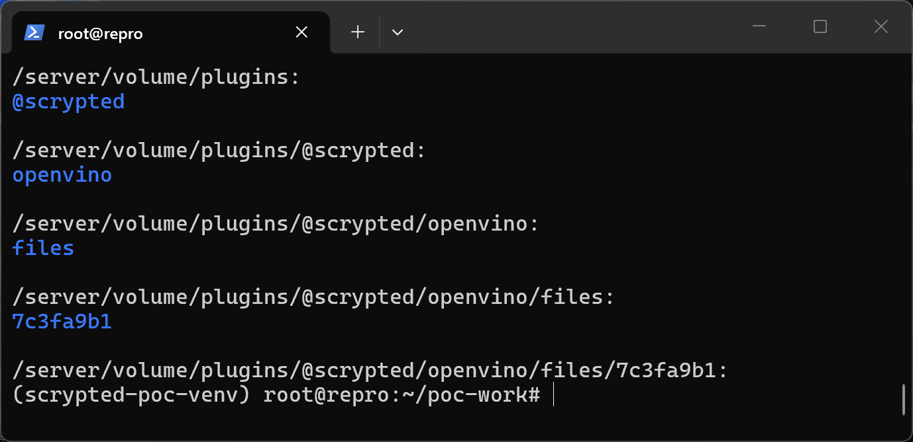

7. Negative control: run the driver against the negative package, whose `config.json` is identical except that `files` is `["model.bin"]`. The model file is downloaded into the intended cache directory inside the volume and no file escapes.

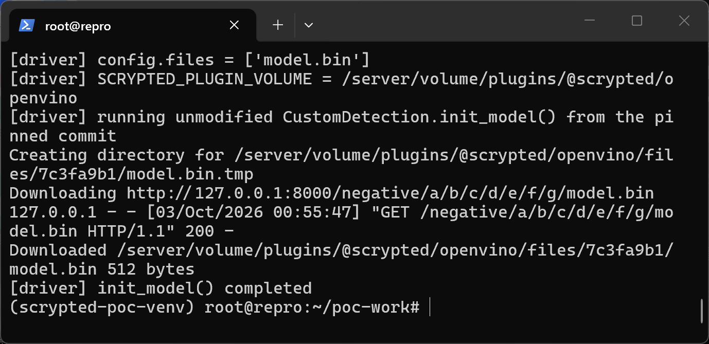

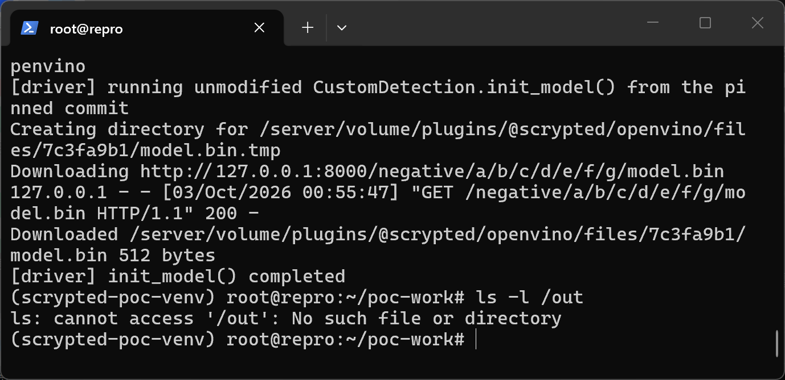

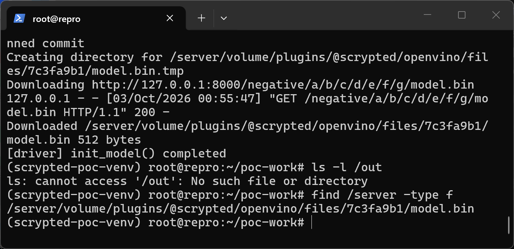

### Expected vs Actual

- Expected: manifest `files` entries are file names relative to the plugin's model cache directory; names containing `../` (or absolute paths) must be rejected or contained.
- Actual: the name is joined onto the cache directory verbatim; `../` segments escape the volume, `os.makedirs` creates attacker-named directories anywhere, and the downloaded bytes are written at the escaped path with the service account's privileges.

### Sanitized PoC input

The malicious manifest served at `http://<attacker-host>/positive/a/b/c/d/e/f/g/config.json`:

```json
{
  "input_shape": [1, 3, 320, 320],
  "labels": {"0": "bird"},
  "files": ["../../../../../../../out/pwned_by_scrypted_config_files_write"]
}
```

The attacker hosts the payload bytes at the path the traversal resolves to on their own server (`/positive/out/pwned_by_scrypted_config_files_write`), so the same seven `../` segments that escape the victim's cache directory also resolve against the manifest URL. Sample SHA-256 hashes are listed in `poc/SHA256SUMS.txt`.

## Impact

- Confidentiality: None — the primitive is file/directory creation and overwrite; it does not read files.
- Integrity: High — the attacker controls both the destination path and the full file content, so any file writable by the Scrypted service account can be created or overwritten. In the official Docker image the service runs as root, so sensitive targets such as `/etc/cron.d/`, systemd units, `~/.ssh/authorized_keys`, or the Scrypted server's own plugin code are all in scope; overwriting executable or configuration files turns the write into persistent code execution on the host or container.
- Availability: Low — overwriting critical files can prevent the service or host from operating, but the primitive is not aimed at denial of service.
- Scope: arbitrary file write outside the application's designated storage (path traversal), achieved with a pure-data malicious model package.

## Remediation

Reject any `config.json` `files` entry that is an absolute path or contains `..` segments (or path separators at all), and additionally enforce containment by resolving the final destination — e.g. `os.path.realpath(fullpath)` must remain within `os.path.realpath(filesPath)` — before `os.makedirs`/`open` in `PredictPlugin.downloadFile` (`plugins/openvino/src/predict/__init__.py:119`). Server-side the risk is limited by only adding custom models from trusted sources; note the plugin's own UI links a third-party sample model repository, which encourages installing community model packages.


## References

- Source repository: https://github.com/koush/scrypted
- Affected code: https://github.com/koush/scrypted/blob/5ed7603ff6a2d5c0d15fc98aa84c6738d93bdd1c/plugins/openvino/src/predict/custom_detect.py
- Upstream report: [pending publication] (reported privately per the repository's SECURITY.md)
- CWE: https://cwe.mitre.org/data/definitions/22.html
- Vendor advisory: [none]
