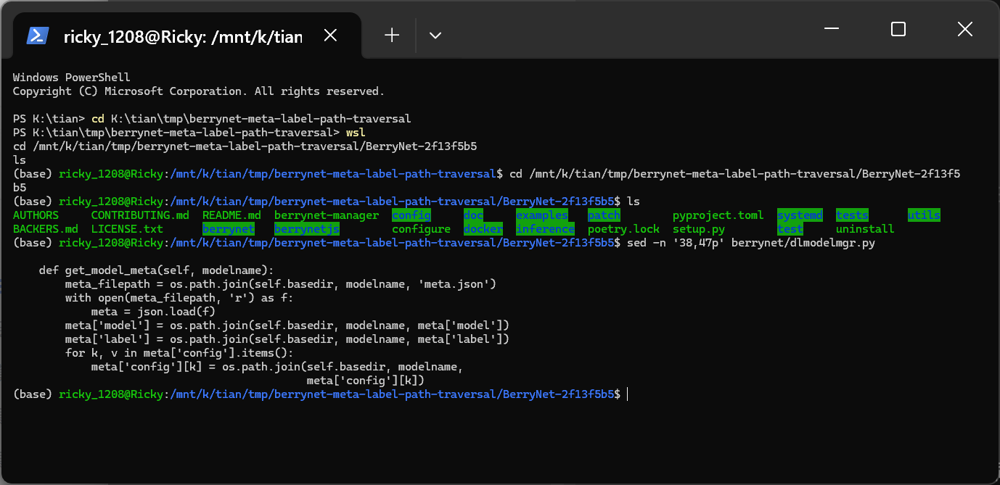
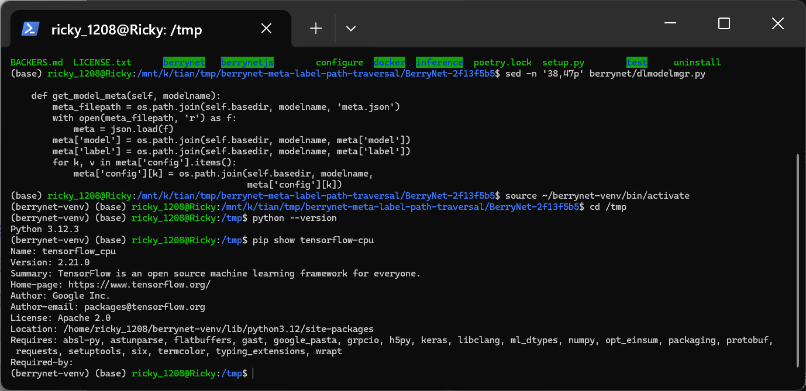
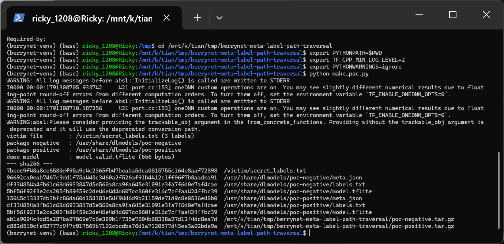
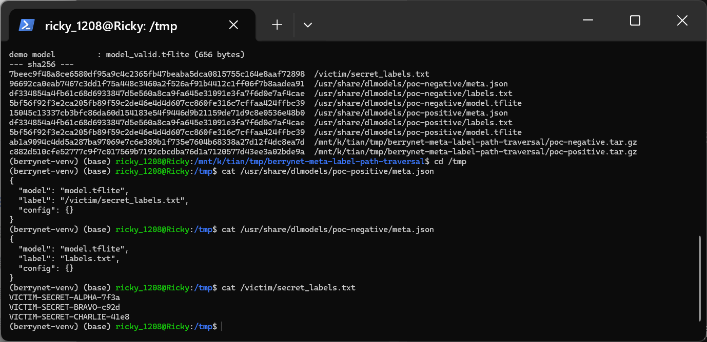
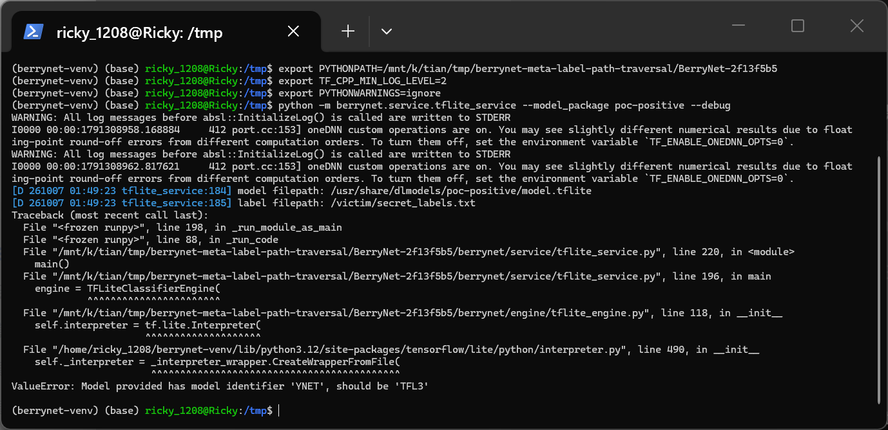
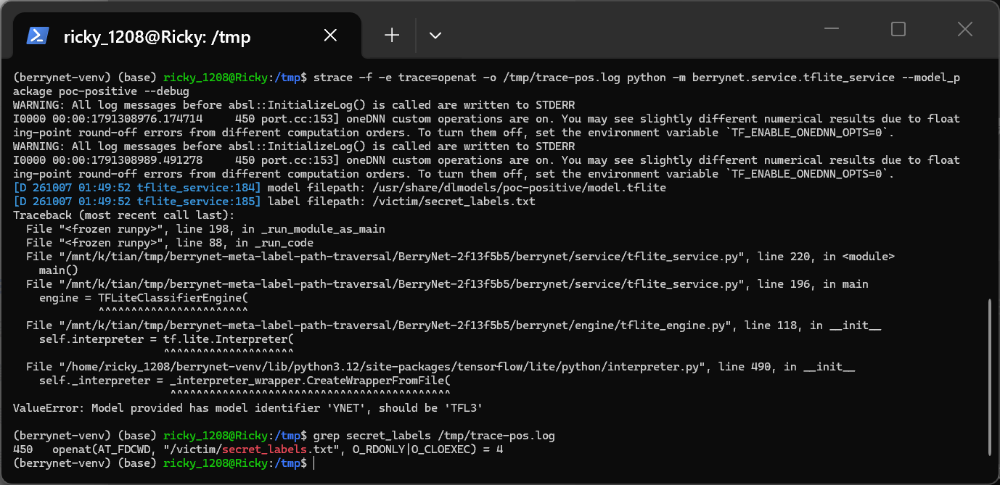
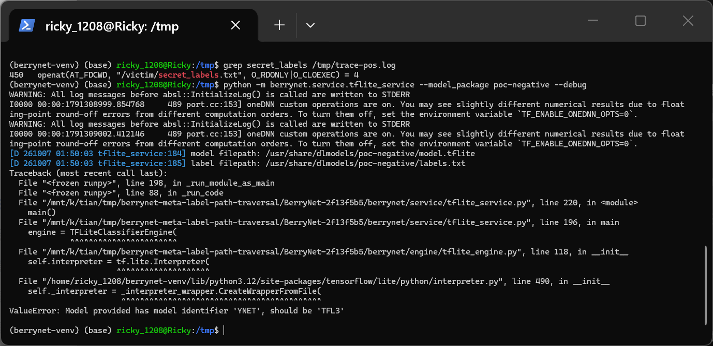
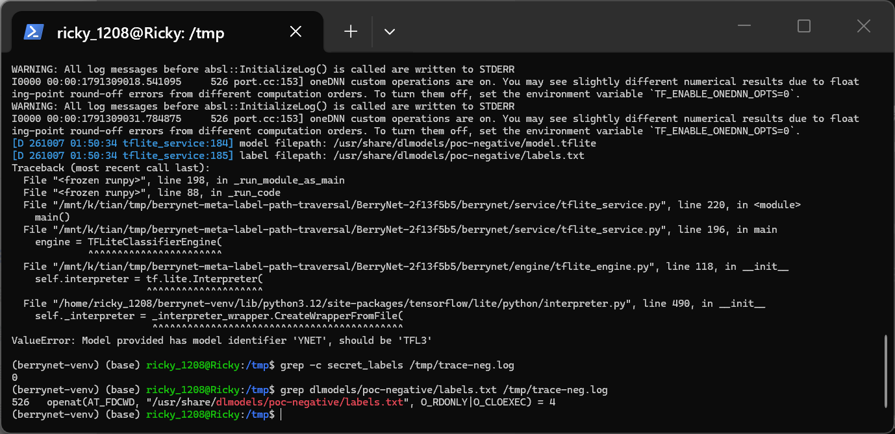
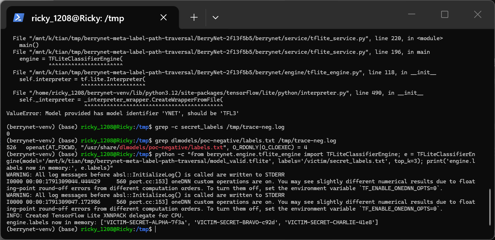

# BerryNet v3.10.2 — Path Traversal in Model Package Label Resolution Leads to Arbitrary File Read

## Summary

DT42 BerryNet v3.10.2 (git commit 2f13f5b559ee, the current master HEAD) is affected by a path traversal in the DLModelBox model package metadata handling (`berrynet/dlmodelmgr.py`, `DLModelManager.get_model_meta`). The `label` field of an installed model package's `meta.json` is joined to the package directory with `os.path.join()` without any validation, so a value pointing to an absolute path or a path with `../` segments escapes the package directory. When a BerryNet inference service is started with `--model_package <name>` (bn_tflite, bn_darknet, bn_openvino all share this code), the resolved label path is handed to the engine, which opens and reads the full contents of the attacker-chosen file into the engine's label table. A malicious package is data-only (meta.json + labels.txt + model.tflite) and contains no executable payload, so the attack survives reviews that only scan packages for code sidecars.

## Affected Product

| Field | Value |
|---|---|
| Vendor | DT42 |
| Product | BerryNet |
| Affected versions | v3.10.2 (setup.py version at master HEAD commit 2f13f5b559ee22d1c0e325834677b10a504fd117, dated 2022-07-12, the latest release/master as of 2026-10-07); the vulnerable code in berrynet/dlmodelmgr.py has been unchanged since its 2018-11-03 commit, so all versions built from this code line are affected |
| Component | berrynet/dlmodelmgr.py `DLModelManager.get_model_meta()` (path resolution), consumed by berrynet/engine/tflite_engine.py `_load_label()` (file read); entry points bn_tflite (berrynet/service/tflite_service.py:179-183), bn_darknet (darknet_service.py:105-106), bn_openvino (openvino_service.py:183-184) |
| Platform | Linux (POSIX path semantics); verified on Ubuntu 24.04 in WSL2 with Python 3.12 |
| Vulnerability type | CWE-22: Path Traversal |

## Root Cause

**Location:** `berrynet/dlmodelmgr.py:38-47` (`DLModelManager.get_model_meta`), defect line 43; read primitive at `berrynet/engine/tflite_engine.py:180-183` (`TFLiteClassifierEngine._load_label`, invoked from `__init__` at line 114; the detector class carries an identical copy at lines 101-104).

`get_model_meta()` loads the package manifest and joins each metadata field onto the package directory without checking the result stays inside the package:

```python
def get_model_meta(self, modelname):
    meta_filepath = os.path.join(self.basedir, modelname, 'meta.json')
    with open(meta_filepath, 'r') as f:
        meta = json.load(f)
    meta['model'] = os.path.join(self.basedir, modelname, meta['model'])
    meta['label'] = os.path.join(self.basedir, modelname, meta['label'])
    for k, v in meta['config'].items():
        meta['config'][k] = os.path.join(self.basedir, modelname,
                                         meta['config'][k])
    return meta
```

Every value in `meta.json` is attacker-controlled: whoever crafts the model package chooses the contents of `meta.json`. Python's `os.path.join()` discards all preceding components when the final component is absolute, so with `basedir = '/usr/share/dlmodels'` and `modelname = 'poc-positive'`, `os.path.join('/usr/share/dlmodels', 'poc-positive', '/victim/secret_labels.txt')` returns `/victim/secret_labels.txt` unchanged. The service then assigns it directly to the engine's label path (`tflite_service.py:183`, `args['label'] = meta['label']`), and the engine constructor loads labels *before* it touches the model file:

```python
# TFLiteClassifierEngine.__init__ (berrynet/engine/tflite_engine.py:114)
self.labels = self._load_label(labels)
...
# berrynet/engine/tflite_engine.py:180-183
def _load_label(self, path):
    with open(path, 'r') as f:
        labels = list(map(str.strip, f.readlines()))
    return labels
```

`_load_label()` opens the traversed path with no restriction and slurps the complete file into `self.labels`. There is no validation of `meta['label']` (nor of `meta['model']` or the `config` values) anywhere between `json.load()` and `open()`.

## Proof of Concept

### Prerequisites

- Attacker delivers a data-only model package (meta.json, labels.txt, model.tflite) that the victim installs under `/usr/share/dlmodels/<package-name>/`; no executable content is needed in the package.
- Victim (or a deployment script) starts any BerryNet engine service with `--model_package <package-name>`.
- The target file only needs to be readable by the user running the BerryNet service.

### Steps to Reproduce

The following was executed for real in WSL2 Ubuntu 24.04 (Python 3.12.3, tensorflow-cpu 2.21.0) against the pinned source tree of commit 2f13f5b559ee on 2026-10-07. `make_poc.py` (attached) generates both packages and the victim file.

1. Pinned source tree and vulnerable code location:



1. Environment used for verification (BerryNet venv, Python 3.12.3, tensorflow-cpu 2.21.0):



2. Run `python make_poc.py`. It creates the victim file `/victim/secret_labels.txt` (three unique labels that exist nowhere in the packages) and installs two model packages under `/usr/share/dlmodels/`. The SHA256 output shows the two packages are identical except for `meta.json`: `labels.txt` and `model.tflite` share the same hash in both packages, only `meta.json` differs.



3. The only difference is the `label` value — negative control keeps the in-package file name, the positive case points to an absolute path outside the package:



```json
{"model": "model.tflite", "label": "/victim/secret_labels.txt", "config": {}}
```

4. Trigger: run `bn_tflite` (berrynet.service.tflite_service) against the positive package with `--debug`. The debug log prints the resolved label path `/victim/secret_labels.txt` — outside the package directory — proving the traversal during metadata resolution. Both packages then stop at the same point because `model.tflite` is intentionally invalid, which is a common stopping point reached only *after* the label file has been read (`_load_label` runs before `tf.lite.Interpreter` in the constructor):



5. System-call proof that the out-of-package file was really opened by the service process: `strace -f -e trace=openat` shows `openat(AT_FDCWD, "/victim/secret_labels.txt", O_RDONLY|O_CLOEXEC) = 4`:



6. Negative control: the identical package with `"label": "labels.txt"` resolves to the in-package file and never touches `/victim/...`:





7. Content consumption: with a small *valid* TFLite model (also produced by `make_poc.py` as `model_valid.tflite`), the engine constructor completes and the victim file's unique strings are sitting in the engine's label table in process memory:



### Expected vs Actual

- Expected: metadata fields of an installed model package may only reference files inside that package directory; values pointing outside must be rejected.
- Actual: an absolute `label` value silently overrides the package prefix, and the engine opens and reads the attacker-chosen file in full; with a valid model the contents become the engine's label table and can be emitted verbatim in inference results.

### Sanitized PoC input

```text
/usr/share/dlmodels/poc-positive/meta.json:
{"model": "model.tflite", "label": "/victim/secret_labels.txt", "config": {}}

/usr/share/dlmodels/poc-negative/meta.json (control):
{"model": "model.tflite", "label": "labels.txt", "config": {}}

/victim/secret_labels.txt (target file, unique strings):
VICTIM-SECRET-ALPHA-7f3a
VICTIM-SECRET-BRAVO-c92d
VICTIM-SECRET-CHARLIE-41e8
```

## Impact

- Confidentiality: High — the BerryNet service process reads and ingests the complete contents of any file readable by its user; with an attacker-crafted model the selected label strings are reflected in classification/detection results, giving a usable exfiltration channel from the victim host.
- Integrity: None — the defect demonstrated here does not modify data.
- Availability: None — no crash beyond the (already present) common stopping point.
- Scope: information disclosure into the inference pipeline (arbitrary file read via metadata path traversal).

## Remediation

Validate every path-valued metadata field before use, in `DLModelManager.get_model_meta` (covers bn_tflite, bn_darknet, bn_openvino at once): reject values that are absolute or contain path separators/`..` segments, or verify containment after resolution, e.g. resolve with `os.path.realpath()` and require the result to be inside `os.path.realpath(os.path.join(self.basedir, modelname)) + os.sep`. Until patched, only install model packages whose `meta.json` fields have been manually reviewed.

## References

- Source repository: https://github.com/DT42/BerryNet
- Vulnerable code at pinned commit: https://github.com/DT42/BerryNet/blob/2f13f5b559ee22d1c0e325834677b10a504fd117/berrynet/dlmodelmgr.py
- CWE: https://cwe.mitre.org/data/definitions/22.html
- Vendor advisory: [none]
