# FARM 0.8.1-snapshot (commit 5919538) — Path Traversal in Tokenizer.load / EmbeddingTokenizer.from_pretrained

## Summary

deepset-ai FARM at commit 5919538 is affected by a path traversal (CWE-22) in the tokenizer loading component. `Tokenizer.load()` on a local model package directory forwards the directory to `EmbeddingTokenizer.from_pretrained()`, which reads the `vocab_filename` field from the package's `language_model_config.json` and joins it onto the model directory path with `pathlib.Path` without any containment check. A relative value such as `../../victim/host-vocab.txt` escapes the package boundary, and an absolute value such as `/etc/passwd` replaces the base entirely, because `Path.__truediv__` discards the left operand when the right operand is absolute. The resulting path is opened by the tokenizer constructor via transformers' `load_vocab()`, so the content of a file outside the model directory becomes the returned tokenizer's vocabulary. An attacker who supplies a model package that the victim loads (a common supply-chain pattern for ML models) can make the victim's process ingest arbitrary local files into the tokenizer object, from where application code may persist or transmit them (for example `save_pretrained()` re-exports the vocabulary verbatim).

## Affected Product

| Field | Value |
|---|---|
| Vendor | deepset (deepset-ai) |
| Product | FARM (Framework for Adapting Representation Models) |
| Affected versions | commit 5919538 (0.8.1-snapshot tree, dated 2022-08-31); the identical statement is still present on current master as of 2026-10-05 (unfixed); release v0.8.0 (latest tag, 2021-06-10) contains the same code |
| Component | `farm/modeling/tokenization.py`, `EmbeddingTokenizer.from_pretrained()` (lines 308-322), reached from `Tokenizer.load()` |
| Platform | OS-independent (pure Python; verified on Ubuntu 24.04 x86-64, CPU only) |
| Vulnerability type | CWE-22: Path Traversal |

## Root Cause

**Location:** `farm/modeling/tokenization.py:314` (`EmbeddingTokenizer.from_pretrained`), consumed at `farm/modeling/tokenization.py:321`

`Tokenizer.load()` is the public entry point for loading a saved FARM model's tokenizer. For model directories whose name contains `word2vec`, `glove` or `fasttext`, `_infer_tokenizer_class()` selects the `EmbeddingTokenizer` branch without needing any explicit argument from the caller. `EmbeddingTokenizer.from_pretrained()` then parses the package's `language_model_config.json` and builds the vocabulary path by joining the JSON field `vocab_filename` onto the model directory. The field is fully attacker-controlled for any untrusted model package, and the code performs no check that the joined path stays inside the package directory; absolute values are not rejected either. Line 321 passes the unresolved path to the constructor, which calls `load_vocab()` on it and turns every line of the target file into a vocabulary token.

```python
# farm/modeling/tokenization.py, EmbeddingTokenizer.from_pretrained
temp = open(str(Path(pretrained_model_name_or_path) / "language_model_config.json"), "r",
            encoding="utf-8").read()
config_dict = json.loads(temp)

# no containment check; relative "../" escapes the model dir, absolute replaces it entirely
resolved_vocab_file = str(Path(pretrained_model_name_or_path) / config_dict["vocab_filename"])
...
tokenizer = cls(vocab_file=resolved_vocab_file, **kwargs)   # constructor opens the file via load_vocab()
```

## Proof of Concept

### Prerequisites

- A Python 3.9 environment with the pinned commit's dependency set: `torch==1.9.1+cpu`, `transformers==4.7.0`, `tokenizers==0.10.3`, `huggingface_hub==0.0.8`, `numpy==1.21.6`, `pandas==1.3.5`, `scipy==1.7.3`, `scikit-learn==1.0.2`, `sentencepiece==0.1.96`, `boto3`, `dotmap` (FARM is used from its source tree, not installed).
- The FARM source tree at commit 5919538, available as `FARM-5919538/` inside the working directory `~/farm-poc` (the PoC scripts add it to `sys.path` themselves).
- A "sensitive" file outside any model package; the reproduction uses `victim/host-vocab.txt` containing marker tokens `hostvictr01` and `hostvictr02` that only exist in that file. A real attack would target any readable host file.
- Note on the file format: `load_vocab()` reads the target file one token per line; the tokenizer constructor additionally requires an `[UNK]` line for files that should produce a usable tokenizer. A traversed file lacking `[UNK]` is still opened and fully parsed first, and only then fails with `KeyError: '[UNK]'` at `tokenization.py:287`, which itself proves the read.

### Steps to Reproduce

1. Generate the packages: run `python make_poc.py poc-run` in `~/farm-poc`. The script creates `victim/host-vocab.txt` plus two model packages that are byte-identical except for the single attack field: `models/word2vec-poisoned/` (vocab_filename `../../victim/host-vocab.txt`) and `models/word2vec-control/` (vocab_filename `vocab.txt`), both shipping a bundled `vocab.txt` that contains a different marker `bundlectrl01`. It also prints the SHA-256 of every generated file.

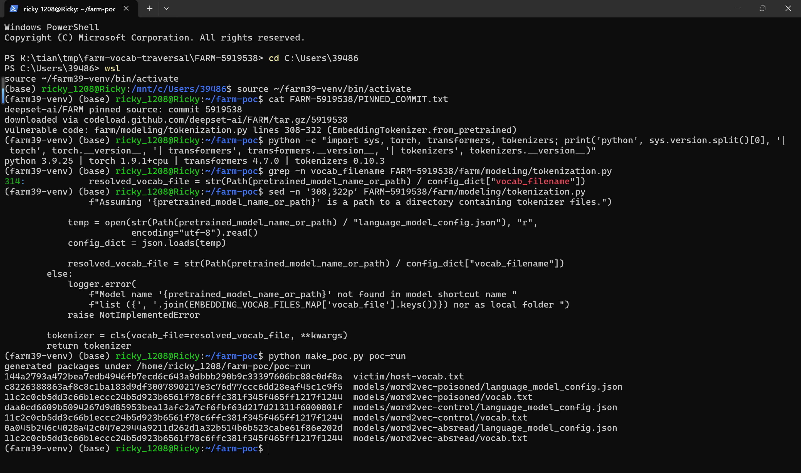

This screenshot proves both model packages and the outside host file were generated, and fixes their content via hashes.

2. Inspect the attack package's `language_model_config.json`:

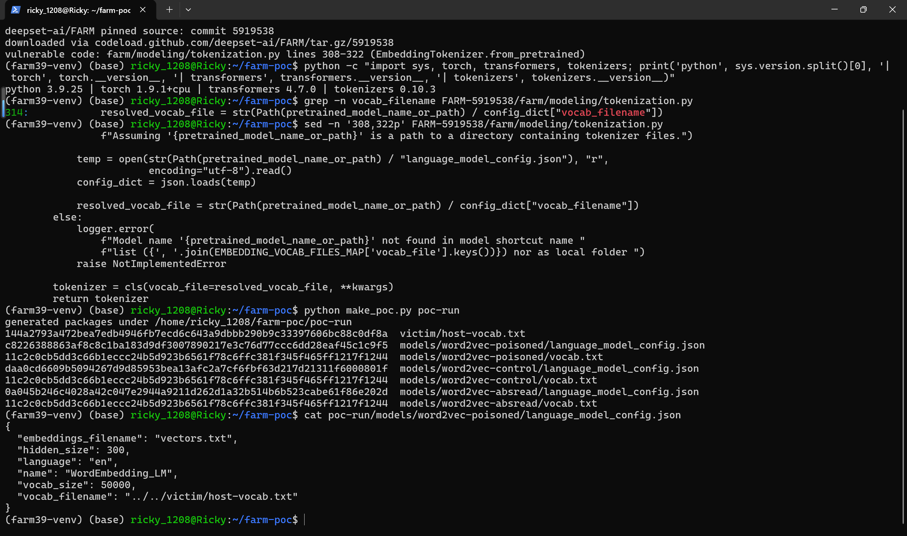

This screenshot shows the attacker-controlled field `"vocab_filename": "../../victim/host-vocab.txt"` inside an otherwise realistic FARM embedding-model config.

3. Confirm the two packages differ only in that field:

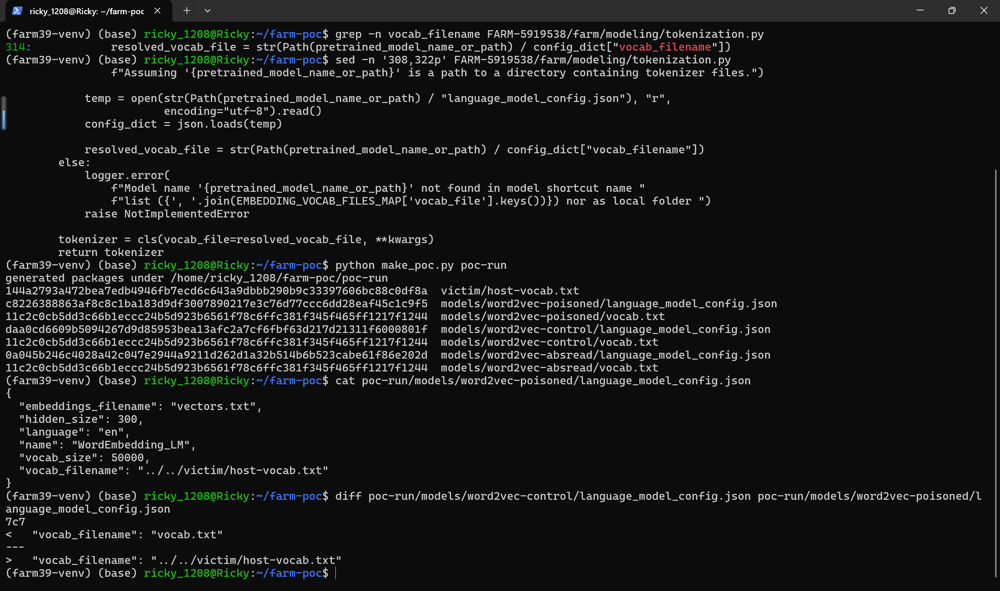

This screenshot proves the negative control changes only the attack field (`vocab.txt` vs `../../victim/host-vocab.txt`), so any difference in loaded content is attributable to the traversal.

4. Show the two vocabularies: the outside host file and the package-bundled vocab carry disjoint marker tokens:

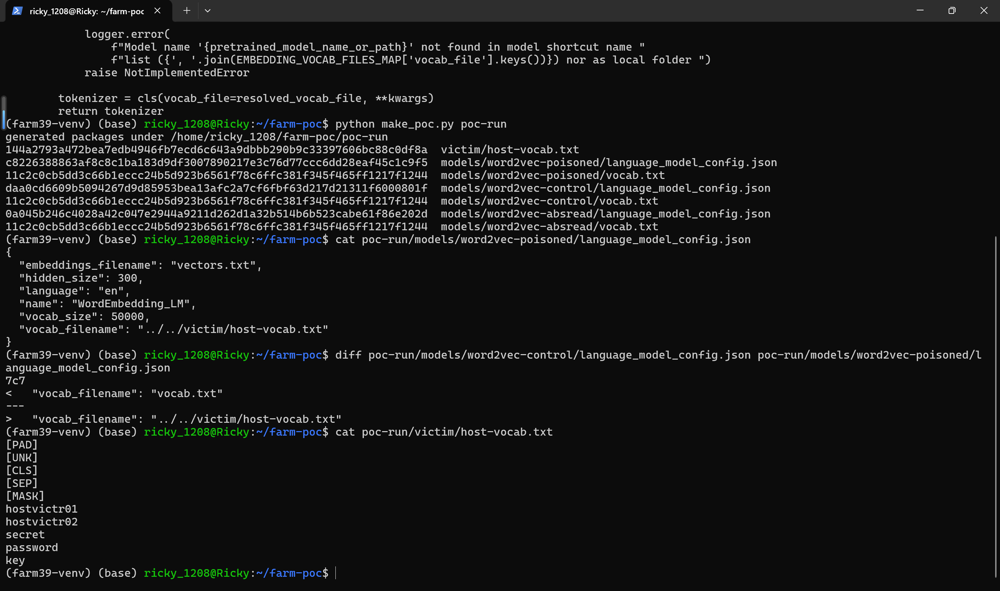

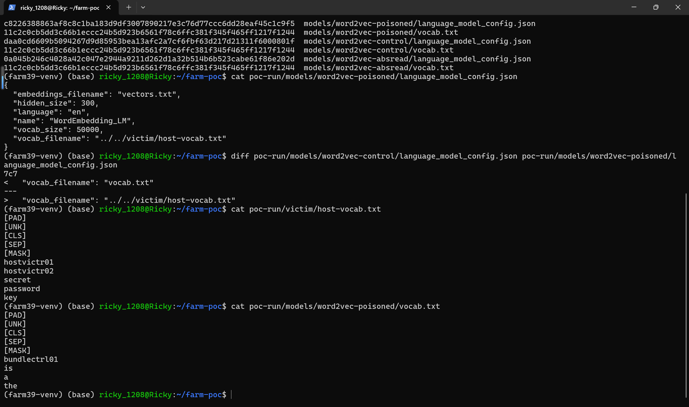

5. Trigger the traversal by loading the poisoned package through the public API with no extra arguments (the directory name contains `word2vec`, so FARM auto-infers `EmbeddingTokenizer`):

```
python run_poc.py poc-run/models/word2vec-poisoned
```

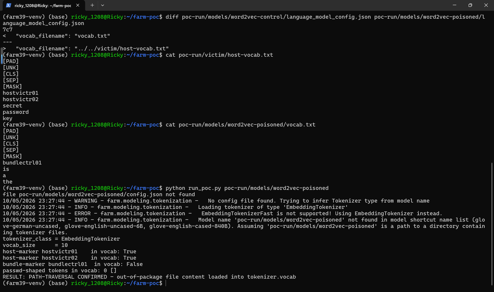

This screenshot shows the actual result: `tokenizer_class = EmbeddingTokenizer`, `host-marker hostvictr01 in vocab: True`, `host-marker hostvictr02 in vocab: True`, `bundle-marker bundlectrl01 in vocab: False`, and the verdict `RESULT: PATH-TRAVERSAL CONFIRMED - out-of-package file content loaded into tokenizer.vocab`. The log lines in the same screenshot (`Loading tokenizer of type 'EmbeddingTokenizer'`) confirm the default inference path of the public `Tokenizer.load()` was used, with no explicit `tokenizer_class` argument.

6. Negative control on the identical package with the stock `vocab_filename`:

```
python run_poc.py poc-run/models/word2vec-control
```

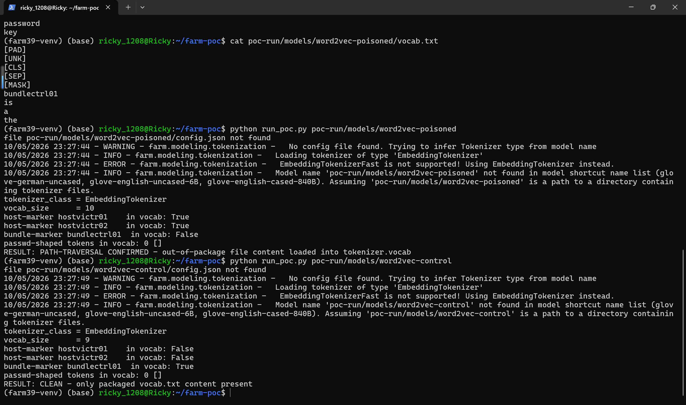

This screenshot shows the control result: both host markers absent, bundled marker present, verdict `RESULT: CLEAN - only packaged vocab.txt content present`.

### Expected vs Actual

- Expected: `Tokenizer.load()` only opens vocabulary files that resolve inside the supplied model package directory; escaping or absolute `vocab_filename` values are rejected.
- Actual: the package-relative value `../../victim/host-vocab.txt` resolves one level above the package tree, and its marker tokens `hostvictr01`/`hostvictr02` appear in the returned tokenizer's vocabulary while the bundled marker does not; the vulnerable statement at `tokenization.py:314` is the only difference between the confirmed and clean runs.

### Sanitized PoC input

```json
{
  "embeddings_filename": "vectors.txt",
  "hidden_size": 300,
  "language": "en",
  "name": "WordEmbedding_LM",
  "vocab_size": 50000,
  "vocab_filename": "../../victim/host-vocab.txt"
}
```

This is the full `language_model_config.json` of the attack package; the only attack-relevant field is `vocab_filename`. An absolute value such as `/etc/passwd` works identically because `Path.__truediv__` discards the base directory for absolute right-hand sides; pointing a fourth package at `/etc/passwd` confirmed the file is opened and fully parsed by `load_vocab()` (its lines enter the vocabulary dict before construction fails on the missing `[UNK]` token at `tokenization.py:287`).

### Evidence chain environment

The screenshots were captured from a real Windows Terminal session running WSL (Ubuntu 24.04) with the verification venv. Pinned source and interpreter versions as shown in the first two screenshots:

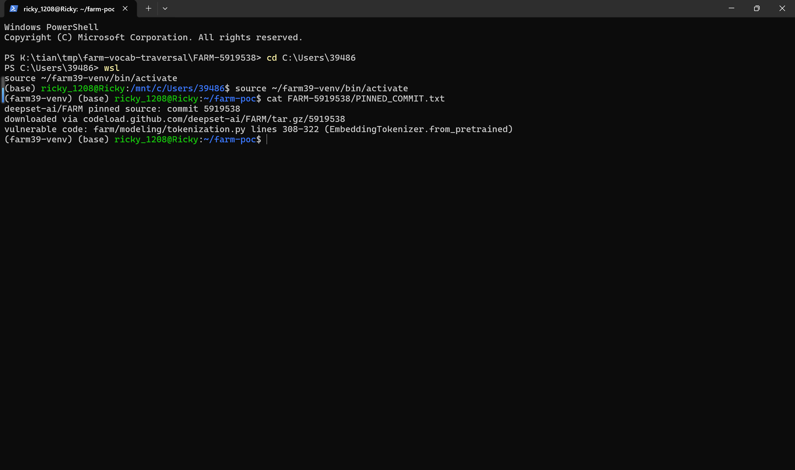

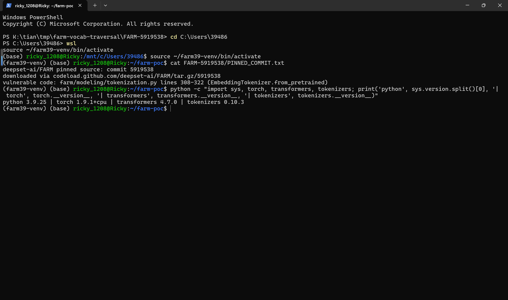

Vulnerable statement with its line number and surrounding code as executed in the verification tree:

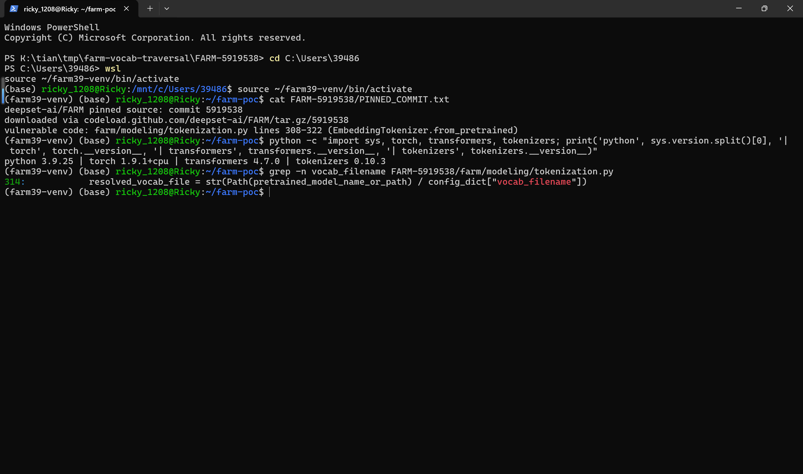

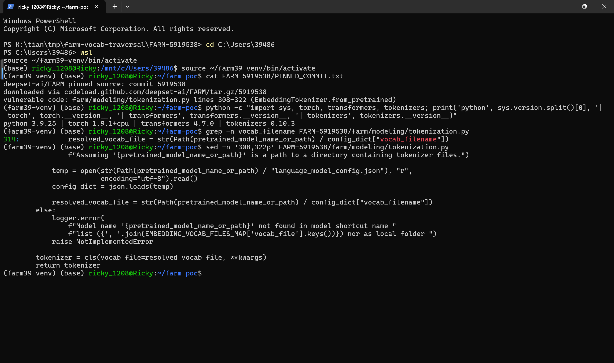

## Impact

- Confidentiality: High — the content of arbitrary readable files outside the model package is ingested into the application's tokenizer object; applications that persist or transmit tokenizer state (`save_pretrained()`, logging, remote inference endpoints that expose vocabulary or token IDs) leak the file content to the attacker or to anyone who can observe the tokenizer.
- Integrity: Low — attacker-chosen vocabulary entries silently replace the token-to-id mapping the application will use, enabling vocabulary poisoning of downstream models; no victim files are modified.
- Availability: Low — a `vocab_filename` pointing at a file without an `[UNK]` line crashes the load with `KeyError: '[UNK]'` after the file has been read, which can turn a malicious model download into a denial of service for the loading process.
- Scope: information disclosure via out-of-package file read; no memory corruption, no code execution.

## Remediation

Validate the joined vocabulary path before opening it, and fail closed: resolve `(Path(pretrained_model_name_or_path) / config_dict["vocab_filename"]).resolve()` and require it to be contained in `Path(pretrained_model_name_or_path).resolve()` (e.g. `resolved.relative_to(base)` inside try/except), rejecting absolute `vocab_filename` values explicitly. The same containment check should be applied wherever `language_model_config.json` fields are turned into filesystem paths. Workaround until patched: only load FARM model packages from trusted sources, or pre-validate `vocab_filename` in `language_model_config.json` before passing the directory to `Tokenizer.load()`.

## References

- Source repository: https://github.com/deepset-ai/FARM
- Vulnerable commit: https://github.com/deepset-ai/FARM/commit/5919538f721c7974ea951b322d30a3c0e84a1bc2
- Vulnerable file on master (verified 2026-10-05): https://github.com/deepset-ai/FARM/blob/master/farm/modeling/tokenization.py
- CWE: https://cwe.mitre.org/data/definitions/22.html
- Vendor advisory: [none]
- Upstream report: [pending publication]
