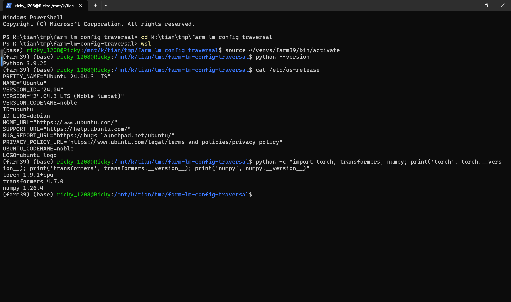
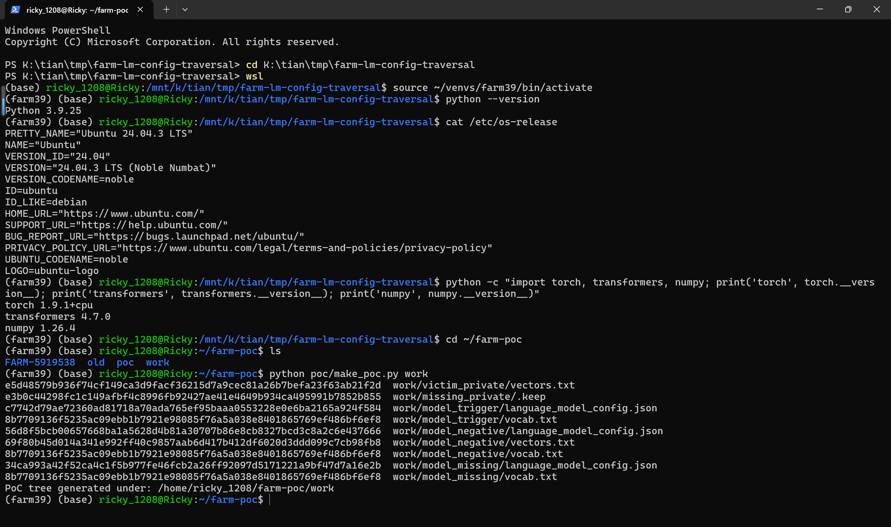
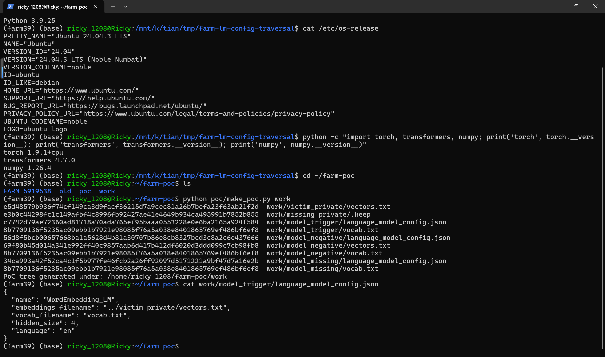
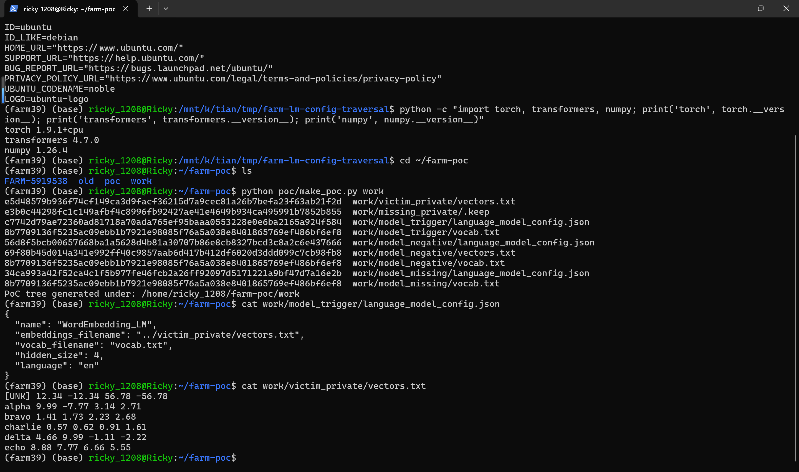
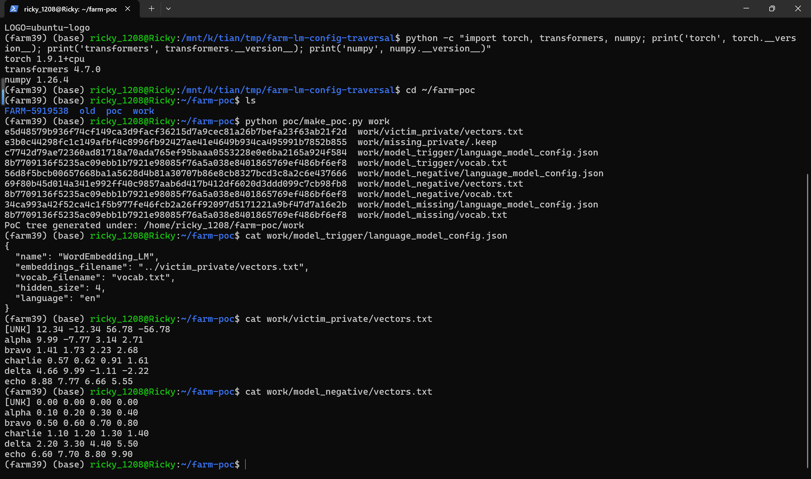
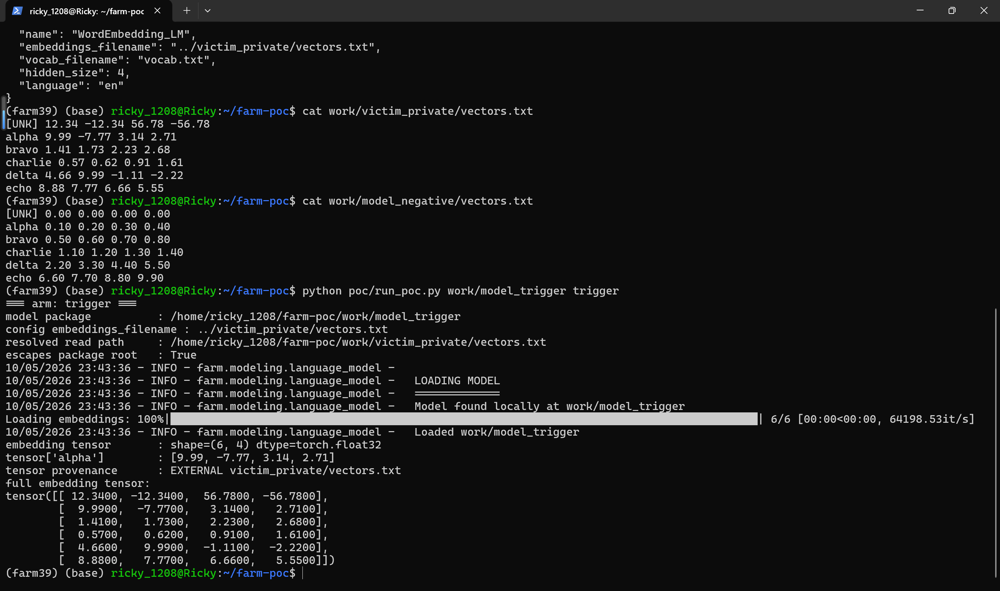
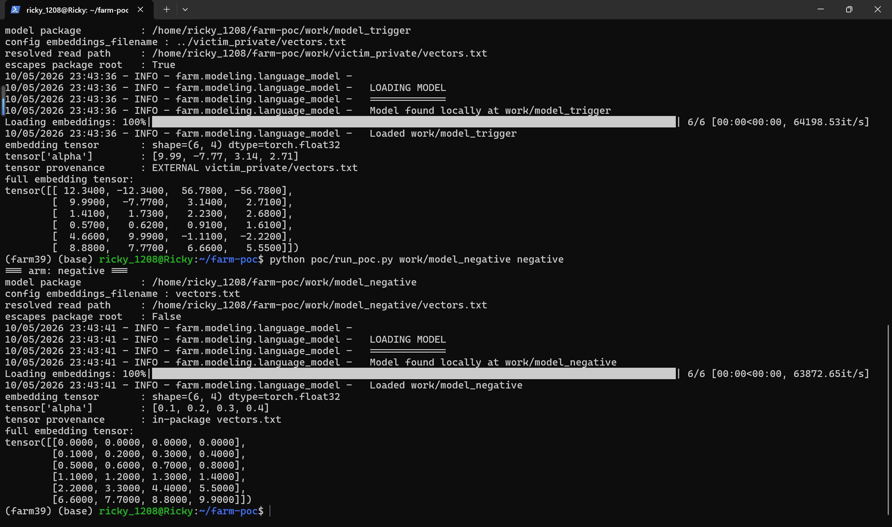
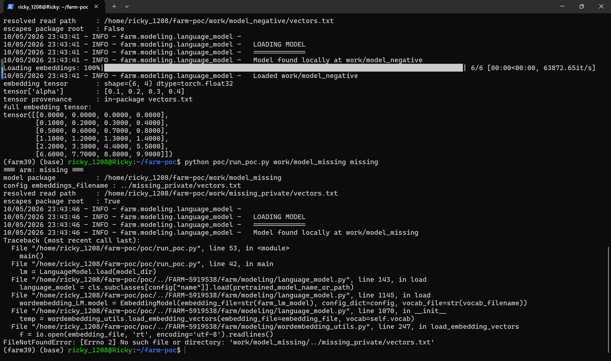

# FARM — Path Traversal in WordEmbedding_LM Model Package Loading

## Summary

deepset-ai FARM (git commit 5919538f721c7974ea951b322d30a3c0e84a1bc2, version string 0.8.1-snapshot) is affected by a path-traversal flaw in the `WordEmbedding_LM` model package loader. The `language_model_config.json` file inside a FARM model package can point the `embeddings_filename` field at a relative path containing `..` sequences (for example `../victim_private/vectors.txt`). When a victim loads such a package through the public `LanguageModel.load()` API, FARM joins the field onto the package directory and opens the resulting path with `io.open()` without any check that the resolved path still lies inside the package root. The content of the external file is then converted into the model's PyTorch embedding tensor, so whatever the configuration points at silently becomes model weights.

## Affected Product

| Field | Value |
|---|---|
| Vendor | deepset GmbH (GitHub organization deepset-ai) |
| Product | FARM — Fast & easy transfer learning for NLP |
| Affected versions | git commit 5919538f721c7974ea951b322d30a3c0e84a1bc2 (2022-08-31, version string 0.8.1-snapshot); the identical vulnerable code is present in the PyPI `farm` wheel 0.8.0 (latest published release) at the same lines, and in the final public master revision of the repository. The repository was archived on 2023-12-20, so no official fix is expected. |
| Component | `farm/modeling/language_model.py` (`WordEmbedding_LM.load`, `EmbeddingModel.__init__`) and `farm/modeling/wordembedding_utils.py` (`load_embedding_vectors`) |
| Platform | OS-independent pure-Python code path; verified on Ubuntu 24.04.3 (WSL2) with Python 3.9.25, torch 1.9.1+cpu and transformers 4.7.0 (the stack pinned by the project's own requirements.txt) |
| Vulnerability type | CWE-22: Improper Limitation of a Pathname to a Restricted Directory ('Path Traversal') |

## Root Cause

**Location:** `farm/modeling/language_model.py:1143` (`WordEmbedding_LM.load`) and `farm/modeling/wordembedding_utils.py:247` (`load_embedding_vectors`)

`LanguageModel.load()` finds `language_model_config.json` in the model directory and dispatches to the class named by the fully attacker-controlled `name` field (`farm/modeling/language_model.py:143`). `WordEmbedding_LM.load()` then builds the embedding-file path by appending the configuration value to the package directory using `pathlib`:

```python
config = json.load(open(farm_lm_config, "r"))
farm_lm_model = Path(pretrained_model_name_or_path) / config["embeddings_filename"]
vocab_filename = Path(pretrained_model_name_or_path) / config["vocab_filename"]
wordembedding_LM.model = EmbeddingModel(embedding_file=str(farm_lm_model), config_dict=config, vocab_file=str(vocab_filename))
```

The `/` operator of `pathlib.Path` concatenates the strings verbatim, so a value such as `../victim_private/vectors.txt` produces `model_trigger/../victim_private/vectors.txt`. Nothing normalizes the result and nothing verifies that the resolved path is still located inside the model package root. `EmbeddingModel.__init__` hands the path to `wordembedding_utils.load_embedding_vectors()`, which opens it directly:

```python
def load_embedding_vectors(embedding_file, vocab):
    f = io.open(embedding_file, 'rt', encoding='utf-8').readlines()
```

The parsed floating-point rows are returned as a NumPy array and converted into the model's weights one line later in `EmbeddingModel.__init__` (`farm/modeling/language_model.py:1071`):

```python
temp = wordembedding_utils.load_embedding_vectors(embedding_file=embedding_file, vocab=self.vocab)
self.embeddings = torch.from_numpy(temp).float()
```

Both the configuration file and the embedding file are ordinary data files inside an untrusted model package (JSON and whitespace-separated text — no code sidecars are involved), so the trust boundary that is crossed is the model package root itself: a value in the package's own metadata selects and ingests a resource from anywhere the victim's process can read that is reachable through a relative path.

## Proof of Concept

### Prerequisites

- Python 3.9 with the project-pinned stack installed (torch 1.9.1+cpu, transformers 4.7.0, numpy 1.26.4, pandas, scikit-learn, boto3, requests, dotmap, tqdm — the versions follow FARM's own requirements.txt of the pinned commit)
- FARM source at commit 5919538f721c7974ea951b322d30a3c0e84a1bc2 (imported unchanged, no patches)
- The three-arm sample generator `make_poc.py` and the loader `run_poc.py` (attached in `poc/`)
- A working directory in which the model package directory sits next to a private directory of the victim

### Steps to Reproduce

1. Generate the three model packages. All three arms share the same legal FARM layout, the same vocabulary and the same 4-dimensional vector shape; they differ only in the `embeddings_filename` value. `victim_private/vectors.txt` carries canary values that never appear in any in-package file.

```text
python poc/make_poc.py work
```





2. Inspect the trigger package's configuration and the external target. The configuration is pure JSON and the target is a plain word2vec-style text file outside the package.

```text
cat work/model_trigger/language_model_config.json
```







3. Load the trigger package through the public API and print the resulting embedding tensor. The loader resolves the read path outside the package root, and the tensor rows equal the external file's canary rows (row `alpha` = 9.99, -7.77, 3.14, 2.71).

```text
python poc/run_poc.py work/model_trigger trigger
```



4. Negative control: the identical package with `embeddings_filename: "vectors.txt"` loads its own in-package vectors (row `alpha` = 0.10, 0.20, 0.30, 0.40), which isolates the configuration field as the sole cause of the escape.

```text
python poc/run_poc.py work/model_negative negative
```



5. Missing control: the same relative escape against a non-existing resource raises an unhandled `FileNotFoundError` at the flagged read point (`wordembedding_utils.py:247`), proving that a real filesystem access happens at the escaped path rather than any fabricated in-package read.

```text
python poc/run_poc.py work/model_missing missing
```



### Expected vs Actual

- Expected: a FARM model package only ever reads embedding resources located inside its own package root; a configuration pointing outside must be rejected.
- Actual: the trigger arm silently ingests `../victim_private/vectors.txt` — the resulting `torch.float32` embedding tensor contains the external file's rows verbatim. The negative control behaves identically to a legitimate package, and the missing control fails with `FileNotFoundError: [Errno 2] No such file or directory: 'work/model_missing/../missing_private/vectors.txt'` at `wordembedding_utils.py:247`.

### Sanitized PoC input

```json
{
  "name": "WordEmbedding_LM",
  "embeddings_filename": "../victim_private/vectors.txt",
  "vocab_filename": "vocab.txt",
  "hidden_size": 4,
  "language": "en"
}
```

The negative control uses the identical JSON with `"embeddings_filename": "vectors.txt"`, and the missing control uses `"embeddings_filename": "../missing_private/vectors.txt"`. Full samples and their SHA-256 hashes are attached in `poc/` (`SHA256SUMS.txt`).

## Impact

- Confidentiality: Low — text files outside the package whose lines parse as `word v1 v2 ... vn` are ingested into embedding weights whose values are observable through the loaded model, an information-disclosure primitive across the package boundary; targets that do not parse abort the load.
- Integrity: Low — model weights are silently sourced from outside the package (model poisoning); no file on the victim's system is modified.
- Availability: Low — a missing or nonconforming external resource raises an unhandled exception that aborts model loading.
- Scope: the resource access escapes the model package root (the trust boundary of a shared model artifact) while staying within the victim's security context.

## Remediation

The upstream repository has been archived (2023-12-20), so no official fix is expected; the following applies to forks, derivatives and downstream consumers. Join-then-verify: after building the path from `embeddings_filename` (and `vocab_filename`, which reaches the identical pattern at `farm/modeling/language_model.py:1144`), normalize it with `os.path.realpath()` and reject any result whose resolved location is not contained within the model package root before handing it to `io.open()`. Treat `language_model_config.json` as untrusted input in any service that accepts model uploads, and load untrusted packages in an isolated directory or sandbox so that a relative escape cannot reach user data.

## References

- Source repository: https://github.com/deepset-ai/FARM
- Pinned commit: https://github.com/deepset-ai/FARM/tree/5919538f721c7974ea951b322d30a3c0e84a1bc2
- Vulnerable read point: https://github.com/deepset-ai/FARM/blob/5919538f721c7974ea951b322d30a3c0e84a1bc2/farm/modeling/wordembedding_utils.py#L246-L247
- Path join without containment check: https://github.com/deepset-ai/FARM/blob/5919538f721c7974ea951b322d30a3c0e84a1bc2/farm/modeling/language_model.py#L1139-L1145
- PyPI package: https://pypi.org/project/farm/
- CWE-22: https://cwe.mitre.org/data/definitions/22.html
