# Alibaba Pai-Megatron-Patch commit a098ca5a — Path Traversal (CWE-22) in fp8_cast_bf16 weight_map Loads Out-of-Pack SafeTensors Scale Shards

## Summary
Alibaba Pai-Megatron-Patch is affected by a path traversal in the DeepSeek FP8→BF16 checkpoint converter `fp8_cast_bf16.py`. The converter treats the shard filenames in a model's `model.safetensors.index.json` as trusted relative names and joins every `weight_map` value onto the model directory with `os.path.join` before passing it to `safetensors.torch.load_file`, with no check that the resolved path stays inside the model package. A `weight_map` value containing `..` (or an absolute path) therefore makes the converter open safetensors files anywhere on the filesystem, outside the model directory. Because the traversal is used to fetch the `_scale_inv` dequantization scales of FP8 weights, an attacker who publishes a crafted "FP8 checkpoint" selects which out-of-pack resource supplies the scales, and the converted BF16 weights silently take whatever values the out-of-pack file dictates: in the captured differential, two model packs that are byte-identical except for one index string convert the same FP8 weight to all-12.0 (control) versus all-8.0 (attack), while the converter exits cleanly with no warning.

## Affected Product

| Field | Value |
|---|---|
| Vendor | Alibaba |
| Product | Pai-Megatron-Patch |
| Affected versions | commit `a098ca5acbdeaf7172ce0393fa309b39a77506db` (HEAD of `main` at reporting time); the vulnerable file was introduced on 2025-02-25 (commit `4da7eaee6e8e639bb37e1cf01818d35840d3b207`, PR #481) and has not been modified since |
| Component | `toolkits/model_checkpoints_convertor/deepseek/fp8_cast_bf16.py`, `get_tensor()` (lines 51-56), called from `main()` line 73 |
| Platform | Platform independent (Python `os.path.join` semantics); verified on WSL2 Ubuntu 24.04, Python 3.12.3 |
| Vulnerability type | CWE-22: Path Traversal |

## Root Cause

**Location:** `toolkits/model_checkpoints_convertor/deepseek/fp8_cast_bf16.py:52-55` (`get_tensor`, called from `main` line 73)

The converter is the documented way to turn DeepSeek-V3/R1 FP8 checkpoints into trainable BF16 ones (`examples/deepseek_v3/README.md` line 84: `python fp8_cast_bf16.py --input-fp8-hf-path /mnt/deepseek-ckpts/DeepSeek-V3 --output-bf16-hf-path /mnt/deepseek-ckpts/DeepSeek-V3-bf16`), i.e. it is routinely pointed at model packages downloaded from a model hub or a mirror. It parses `model.safetensors.index.json`, and whenever an FP8 weight needs its `_scale_inv` dequantization scale, it looks the shard filename up in the index `weight_map` and joins it onto the model directory with no containment check:

```python
def get_tensor(tensor_name):
    file_name = weight_map[tensor_name]        # line 52: attacker-controlled index value
    if file_name not in loaded_files:
        file_path = os.path.join(fp8_path, file_name)   # line 54: no validation of file_name
        loaded_files[file_name] = load_file(file_path, device="cuda")   # line 55: opens any path
    return loaded_files[file_name][tensor_name]
```

`os.path.join` never rejects `..` segments, and a right-hand operand that is absolute discards the left-hand side entirely, so a `weight_map` value of `../outside/second_resource.safetensors` or `/any/path/secret.safetensors` makes line 55 open a file outside the model package. The `weight_map` values are fully attacker-controlled whenever the checkpoint comes from an untrusted source, because the index is a plain JSON file shipped inside the package. Every FP8 weight in the checkpoint passes through this lookup for its scale (`main()`, lines 70-75), and the loaded scale directly feeds the dequantization: `new_state_dict[weight_name] = weight_dequant(weight, scale_inv)`, so whatever out-of-pack resource the index points at determines the numeric content of the converted BF16 weights. The in-pack preloading loop (lines 58-63) caches only plain basenames, so any traversal or absolute value misses that cache and is freshly opened at line 55 — the two code paths are distinguishable, which is what makes the attack run observable in the logs.

Note that `load_file` only succeeds on files that parse as safetensors, so the primitive is "make the converter consume any safetensors file outside the model directory" rather than an unconstrained file read; on the poisoned-conversion impact below it is fully sufficient.

## Proof of Concept

### Prerequisites
- Python 3 with `torch`, `safetensors`, `triton` and `tqdm` importable; a CUDA GPU is needed to run the converter unmodified (the script hard-codes `device="cuda"` and a Triton CUDA kernel).
- The attached `make_poc.py`, `cpu_harness.py` and `inspect_safetensors.py`, and the model packs they generate.
- About the capture environment: the captured session ran on a GPU-less host (AMD iGPU only). The unmodified pinned converter therefore aborts at its first `device="cuda"` load, which is shown below as evidence of the hardware requirement. The differential was then captured through `cpu_harness.py`, which loads the pinned `fp8_cast_bf16.py` byte-for-byte and shims exactly two module-level names at runtime: `load_file` is routed to the same `safetensors.torch.load_file` on the same path with only the device placement dropped (the `weight_map` lookup and the `os.path.join` at lines 52-55 are executed by the pinned code itself, and every opened path is logged), and `weight_dequant` is replaced by a pure-torch blockwise equivalent of the pinned Triton kernel with the same signature and `block_size=128` semantics. Index parsing, path joining, shard iteration and the save logic all run verbatim from the pinned source. On a CUDA host the unmodified script produces the same differential, because which scale shard is returned is decided entirely by the unmodified `get_tensor()` code.

### Steps to Reproduce

Environment used for the captured session (WSL2 Ubuntu 24.04, Python 3.12.3, torch 2.14.1+cpu, safetensors 0.8.0, triton 3.8.0, source pinned at commit a098ca5a):

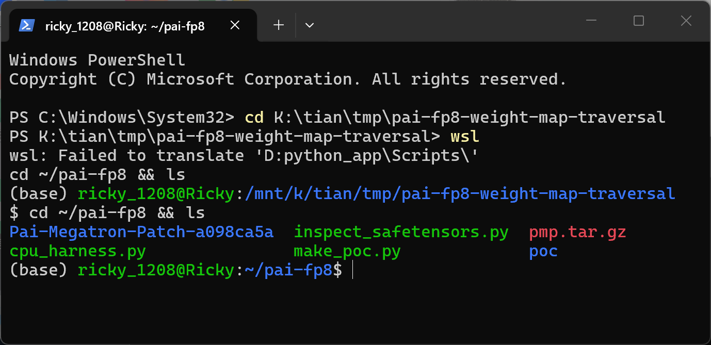

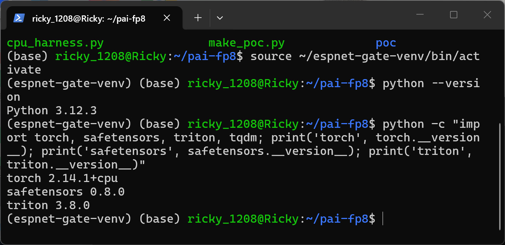

The two unvalidated lines and the sink in the pinned source (line 52 lookup, line 54 join, line 55 `load_file`):

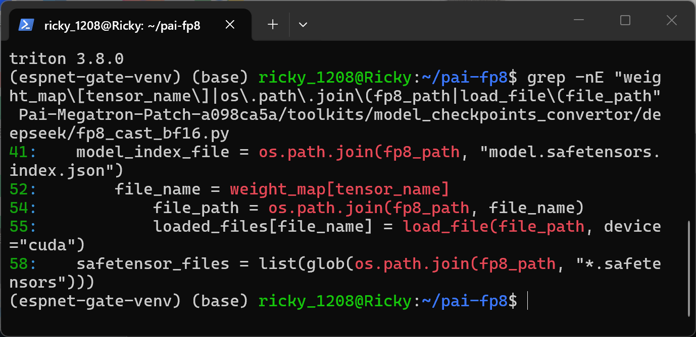

1. Generate the samples with the attached `make_poc.py`. It builds two full model packs (config, tokenizer files, an E5M2 FP8 weight of 128×128 filled with 4.0 in `model-00001.safetensors`, and an in-pack `second_resource.safetensors` holding a (1,1) bf16 `_scale_inv` scale of 3.0) plus a legitimate `second_resource.safetensors` with scale 2.0 outside any model directory. The two packs are byte-identical except ONE string in `model.safetensors.index.json`.

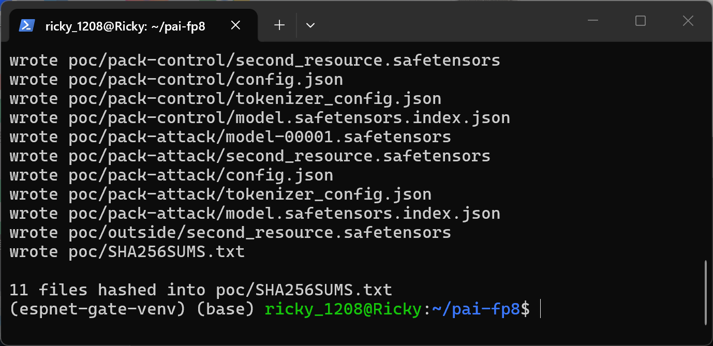

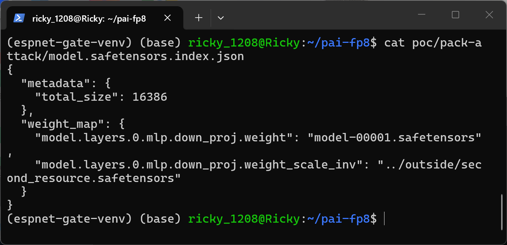

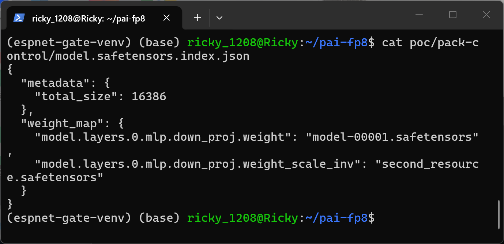

2. Inspect the two legal scale shards: the out-of-pack one carries 2.0, the in-pack one 3.0, and both packs carry their own in-pack 3.0 shard — so the only thing deciding which scale is used is the index string. Verify sample integrity against `SHA256SUMS.txt` (the attack and control packs share identical hashes for every file except `model.safetensors.index.json`).

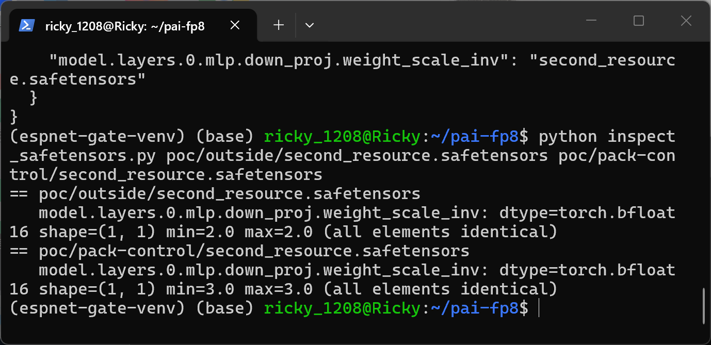

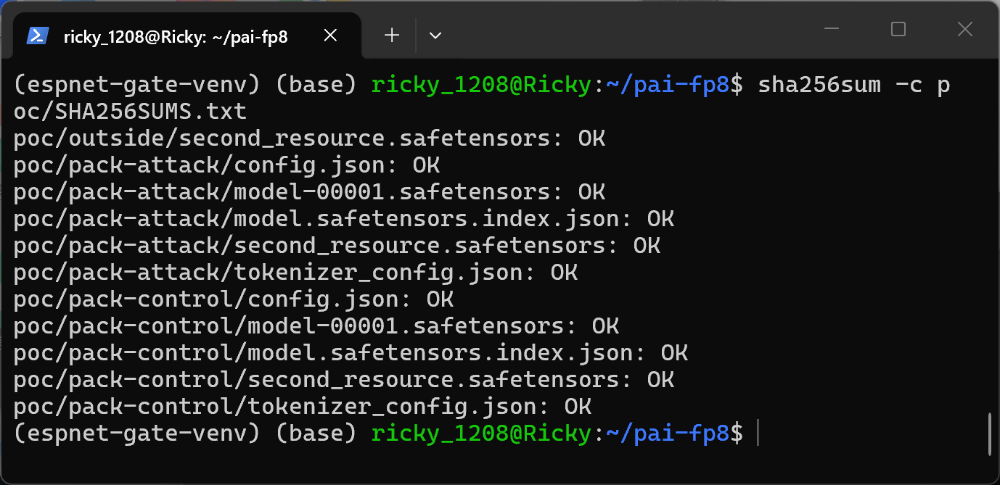

3. Run the unmodified pinned converter on the control pack to document the hardware requirement on the capture host: it aborts at `fp8_cast_bf16.py` line 62 (`load_file(safetensor_file, device="cuda")`) with `RuntimeError: pin_memory=True requires a CUDA or other accelerator backend`, before any index-driven lookup.

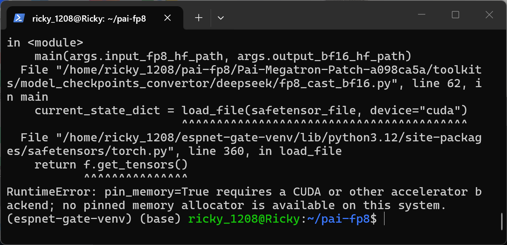

4. Run the control pack through the pinned converter logic via the disclosed CPU harness. Every opened path stays inside the pack and the conversion finishes cleanly.

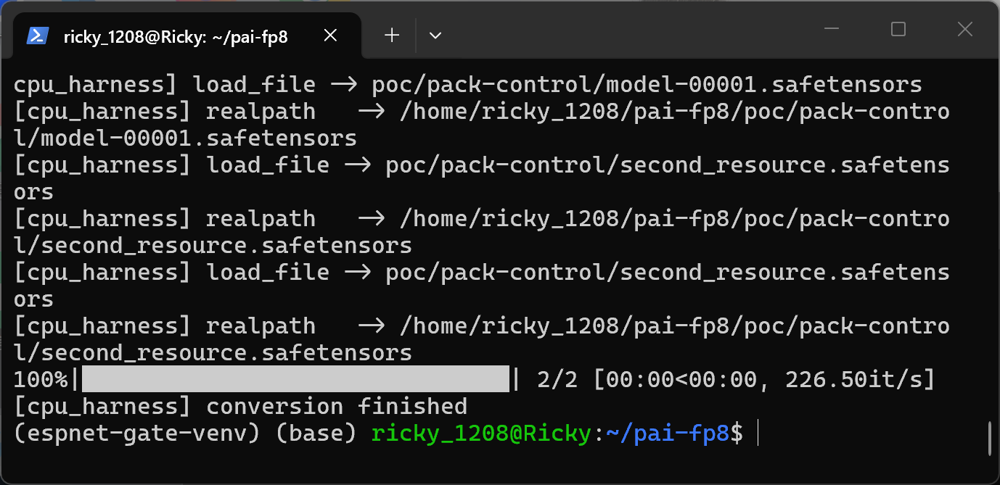

The converted BF16 weight is uniformly 12.0 (FP8 fill 4.0 × in-pack scale 3.0), i.e. the in-pack scale shard was used as designed.

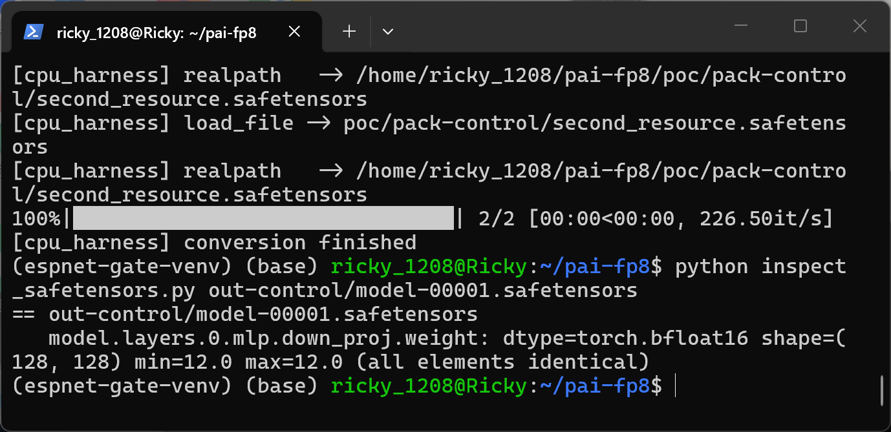

5. Run the attack pack — identical except the single index string. The log shows the pinned code at line 54-55 joining and opening `poc/pack-attack/../outside/second_resource.safetensors`, whose real path is outside the model pack, and the conversion still finishes cleanly with no warning.

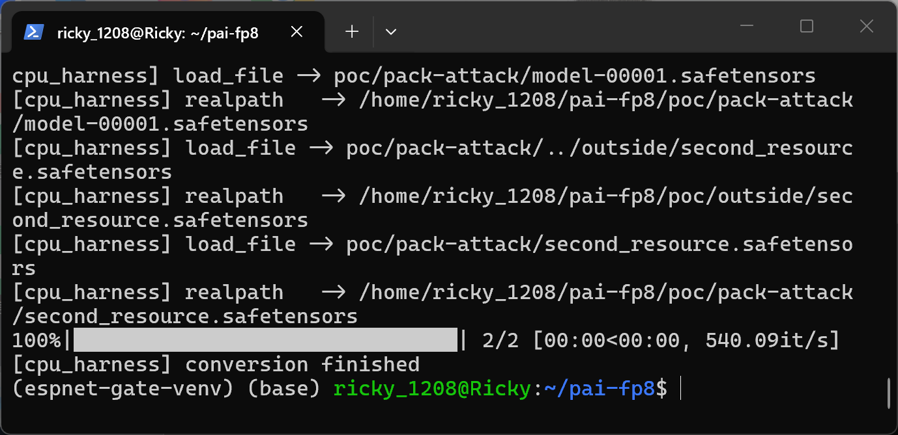

The very same FP8 weight now converts to uniformly 8.0 (4.0 × out-of-pack scale 2.0): the out-of-pack resource was loaded and silently changed the converter's numeric output.

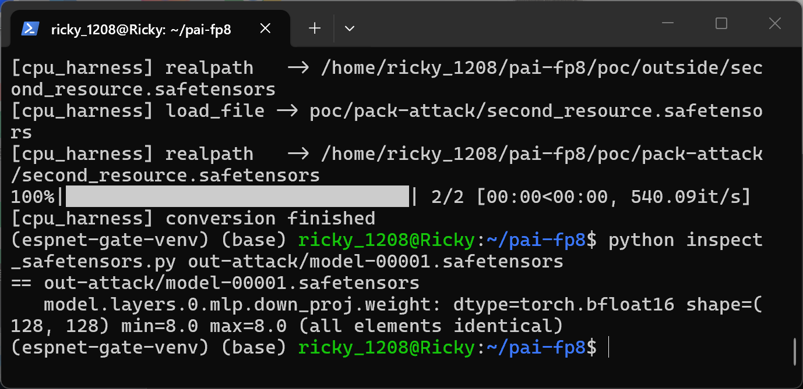

6. Confirm the differential really reduces to the one string.

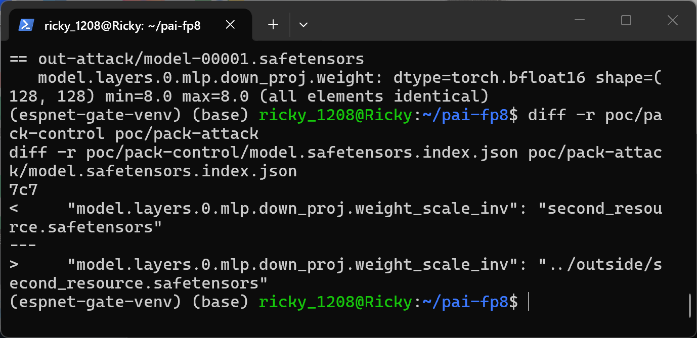

### Expected vs Actual
- Expected: shard filenames taken from an untrusted `model.safetensors.index.json` are rejected unless they resolve inside the model directory; `..`-escaping or absolute `weight_map` values are never opened.
- Actual: the index value is joined onto the model directory verbatim and opened at line 55. The converter consumes the out-of-pack safetensors file as the `_scale_inv` source, so the converted BF16 weights take whatever values the out-of-pack file dictates (12.0 → 8.0 in the captured differential), with exit code 0, a clean tqdm pass and no warning; the output index even drops the `_scale_inv` entries, leaving no trace of the substituted scale in the produced package.

### Sanitized PoC input
```json
{"metadata": {"total_size": 16386}, "weight_map": {"model.layers.0.mlp.down_proj.weight": "model-00001.safetensors", "model.layers.0.mlp.down_proj.weight_scale_inv": "../outside/second_resource.safetensors"}}
```

## Impact
- Confidentiality: Low — the contents of the out-of-pack file are not directly returned to the attacker; they only shape the victim's converted weights. If the victim republishes the converted model, an indirect disclosure channel exists, but no direct readback.
- Integrity: High — the converted BF16 weights are silently steered by an out-of-pack resource chosen through the index: the values of every FP8 weight in the output can be degraded or biased arbitrarily (the attacker controls the scale file, and scale values directly multiply the weights). The converter completes with exit code 0 and prunes the `_scale_inv` entries from the output index, so a poisoned result is indistinguishable from a clean one downstream; the output feeds Megatron training/fine-tuning per the documented workflow.
- Availability: None — a malformed or missing out-of-pack file raises a normal exception; no crash or resource exhaustion.
- Scope: file read and resource substitution outside the model package boundary; the trust boundary crossed is "model package contents" versus "arbitrary files readable by the user running the conversion".

## Remediation
Validate every `weight_map` value before joining: reject absolute paths and `..` segments (e.g. `PurePosixPath(file_name).is_absolute()` or `'..' in PurePosixPath(file_name).parts`), and after joining verify containment on the resolved path (`resolved = os.path.realpath(os.path.join(fp8_path, file_name))`; refuse unless it is inside `os.path.realpath(fp8_path)`) at `fp8_cast_bf16.py` lines 52-55, before `load_file`. Add a regression test with a traversal `weight_map` value, and consider failing loudly instead of silently skipping when scale tensors are missing. Interim workaround: only convert checkpoints whose index `weight_map` values have been manually checked, and run conversions against untrusted packages in an isolated directory/account.


## References
- Source repository: https://github.com/alibaba/Pai-Megatron-Patch
- Affected commit: https://github.com/alibaba/Pai-Megatron-Patch/blob/a098ca5acbdeaf7172ce0393fa309b39a77506db/toolkits/model_checkpoints_convertor/deepseek/fp8_cast_bf16.py#L51-L56
- Documented usage: https://github.com/alibaba/Pai-Megatron-Patch/blob/a098ca5acbdeaf7172ce0393fa309b39a77506db/examples/deepseek_v3/README.md
- CWE: https://cwe.mitre.org/data/definitions/22.html
- Upstream report: [pending publication]
- Vendor advisory: [none]

