# UbiquitousLearning mllm (pymllm) 2.0.2 commit bc8f5cdb557f — Path Traversal (CWE-22) in pymllm.mobile.convertor.load_model weight_map Shard Resolution

## Summary
UbiquitousLearning mllm 2.0.2 (the `pymllm` Python package) is affected by a path traversal in the SafeTensors index handling of `pymllm.mobile.convertor.load_model`. Shard filenames taken from a model's `model.safetensors.index.json` `weight_map` are joined onto the model directory with `os.path.join` and opened with `safetensors.safe_open` without any check that the resolved path stays inside the model package. A model package prepared by an attacker whose index maps a tensor to a value such as `../../../victim/host.safetensors` makes the loader open and read tensors from an arbitrary location outside the package. The out-of-package values are returned in the `state_dict`, get loaded into real modules and are consumed at inference time (a crafted `probe.weight` read from outside the package drives a module's `forward()` output to 183.0 while the package's own decoy shard holds 23.0), and the official `mllm-convertor` CLI writes them into the converted `.mllm` artifact. The defect is still present in the current `main` branch at reporting time.

## Affected Product

| Field | Value |
|---|---|
| Vendor | UbiquitousLearning |
| Product | mllm (`pymllm` Python package, mobile runtime / model conversion tooling) |
| Affected versions | pymllm 2.0.2, git commit `bc8f5cdb557f` (HEAD of `main` at reporting time, committed 2026-09-08); the vulnerable code is unchanged on current `main` |
| Component | `pymllm/mobile/convertor/__init__.py`, function `load_model()`, index-file branch lines 81-107 (unvalidated join at line 102) |
| Platform | Platform independent (pure Python `os.path` semantics); verified on WSL2 Ubuntu 24.04, Python 3.12.3, torch 2.14.1+cpu, safetensors 0.8.0, pymllm built from source at the pinned commit |
| Vulnerability type | CWE-22: Path Traversal |

## Root Cause

**Location:** `pymllm/mobile/convertor/__init__.py:101-105` (`load_model`), with the attacker-controlled value entering at line 82/93 and the out-of-package open at line 103.

`load_model()` is the single loading entry point used by the mobile runtime tooling and by the official `mllm-convertor` CLI (`pymllm/mobile/utils/mllm_convertor.py:59`). For index-style models it parses `model.safetensors.index.json` with `json.load()` (line 82), groups the tensor names by their `weight_map` values (lines 93-98) and then joins every attacker-supplied shard filename onto the index directory and opens it:

```python
# Group tensors by shard file
for tensor_name, shard_file in weight_map.items():   # shard_file: attacker-controlled index value
    ...
    shard_tensors[shard_file].append(tensor_name)

# Load tensors from each shard
for shard_file, tensor_names in shard_tensors.items():
    shard_path = os.path.join(index_dir, shard_file)          # line 102: no containment check
    with safe_open(shard_path, framework="pt", device="cpu") as f:   # line 103: opens any parseable file
        for tensor_name in tensor_names:
            state_dict[tensor_name] = f.get_tensor(tensor_name)      # line 105: values returned to the caller
```

There is no rejection of `..` segments, no rejection of absolute paths, and no resolved-path containment check against the model directory (`os.path.join` keeps `..` segments, which the OS resolves at open time). The `weight_map` values are fully attacker-controlled whenever a model package comes from an untrusted source (a downloaded release, a model-hub snapshot, or any archive shared as a "model package" — the PoC package contains only JSON and SafeTensors data, no code, plugins or pickle sidecars), so the loader can be pointed at any safetensors-parseable file at an attacker-chosen relative or absolute path outside the package. Values read this way are returned in the `state_dict` and are consumed by whatever loads them — a real module at inference time, or the `mllm-convertor` conversion pipeline that writes the parameters into the produced model file.

## Proof of Concept

### Prerequisites
- Python 3.12 with `torch`, `safetensors` and a source build of `pymllm` 2.0.2 at commit `bc8f5cdb557f` (the bundled C++ FFI extension is built with CMake and `MLLM_ENABLE_PY_MLLM=on`; the resulting package is installed into the venv used for the captured session).
- The attached `make_poc.py` generates two model packages that are identical except for one string — the `weight_map` value — plus an out-of-package "second resource": `run/victim/host.safetensors` holds tensor `probe.weight` (float32, shape `[1,1]`) filled with 183.0, while the in-package decoy shard `shard-0.safetensors` inside both packages holds the same tensor name and shape filled with 23.0. `pkg-attack` maps `probe.weight` to `../../../victim/host.safetensors` (escapes the package root; the package sits two directories below the run root), `pkg-control` maps it to the plain in-package shard name `shard-0.safetensors`. The packages contain only JSON and SafeTensors data.

### Steps to Reproduce

Environment used for the captured session (WSL2 Ubuntu 24.04, Python 3.12.3, torch 2.14.1+cpu, safetensors 0.8.0, pymllm built from the pinned commit `bc8f5cdb`):


The unvalidated index-handling block in the pinned source: `pymllm/mobile/convertor/__init__.py` lines 81-93 (`json.load` of the attacker-controlled index and `weight_map` extraction) and lines 99-107 (the `os.path.join(index_dir, shard_file)` sink at line 102, `safe_open` at 103, `get_tensor` at 105).

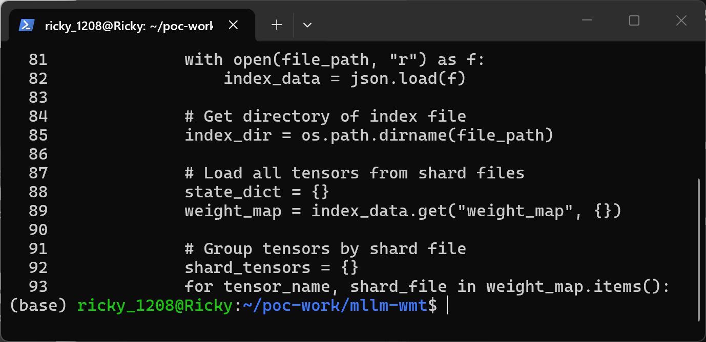

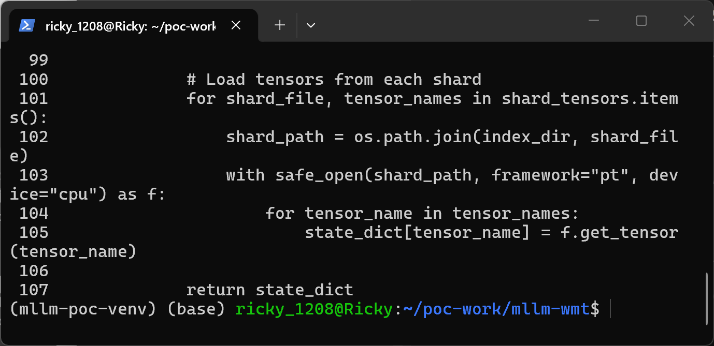

1. Generate the samples with the attached `make_poc.py`. The attack and control packages share the same tensor key, shape, dtype and shard bytes (both in-package shards have the identical SHA-256 `b3f4381ada2e9dfb3d3a34f47d7b5a49db6dcb9ced3c8991ab7384754aee700d`); the ONLY difference is the `weight_map` value string.

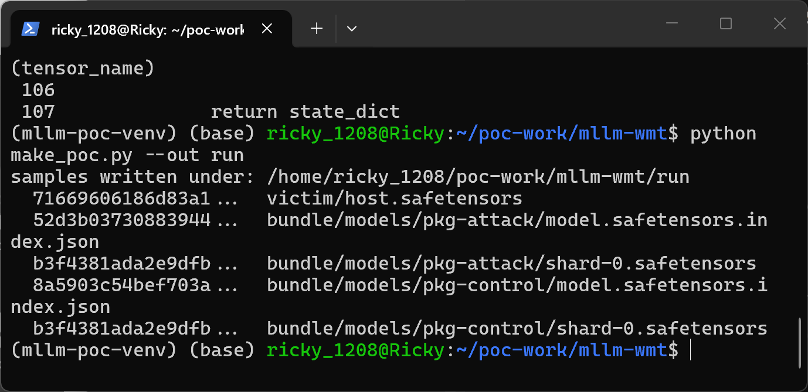

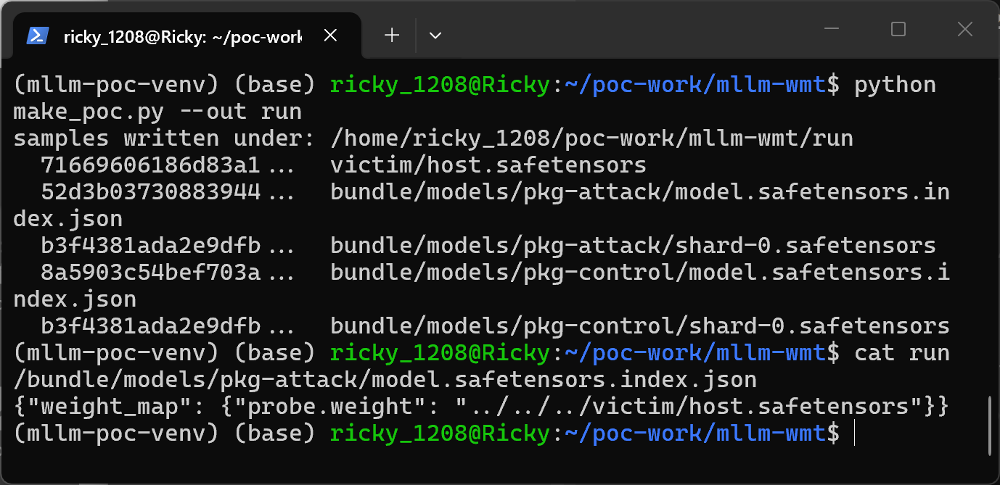

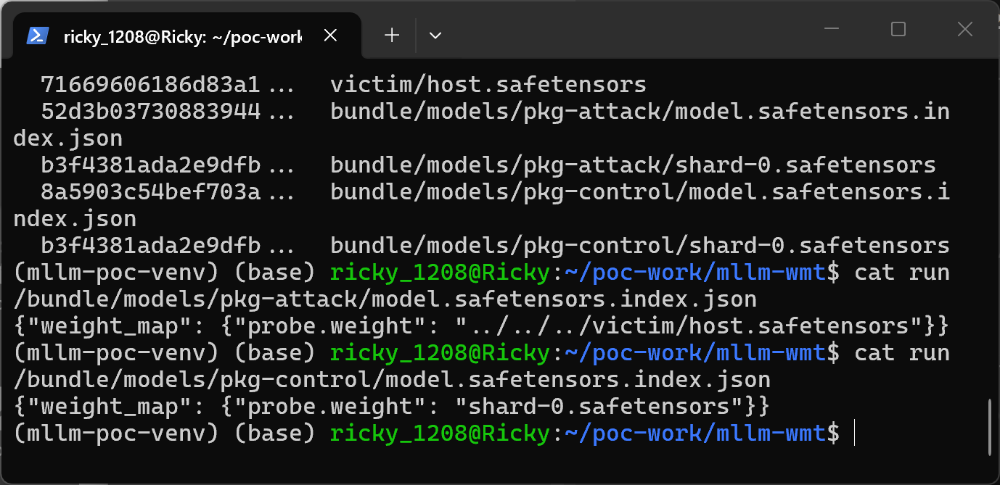

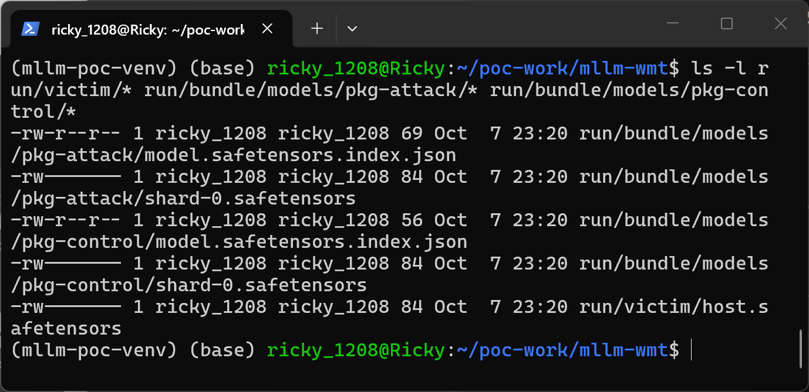

2. Verify sample integrity against the generated `SHA256SUMS.txt` (run inside the `run/` directory the generator created).

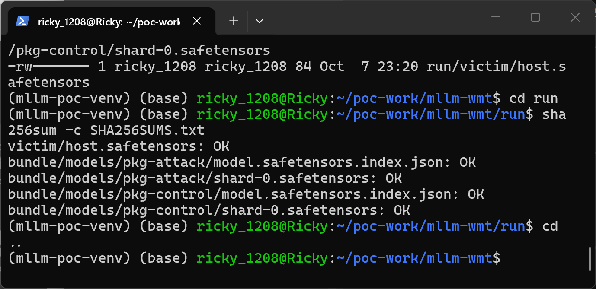

3. Load the attack package with the real upstream entry point `pymllm.mobile.convertor.load_model` and feed the returned `state_dict` into a real `torch.nn.Module` (`verify_poc.py --only pkg-attack`). The driver prints the joined path, its normalized form (which leaves the package root), the in-package decoy value (23.0) and the value `load_model` actually returned (183.0, read from `run/victim/host.safetensors` outside the package), then runs `forward()`.

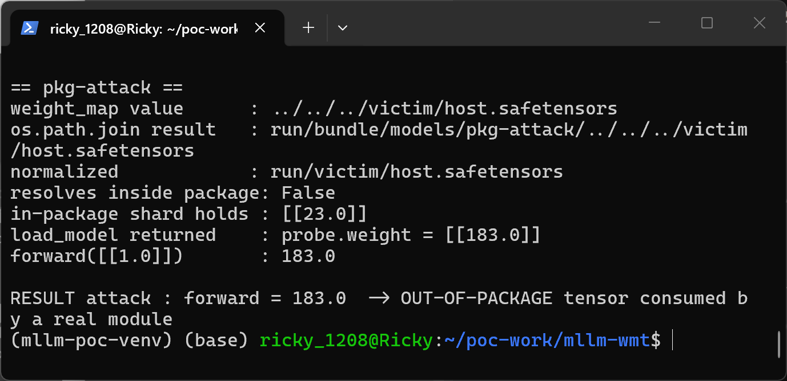

4. Run both packages through the same loader in one pass (`verify_poc.py --run run`): the control package resolves its shard inside the package and `forward()` yields 23.0, while the attack package yields 183.0 — the two packages differ only in that one index string.

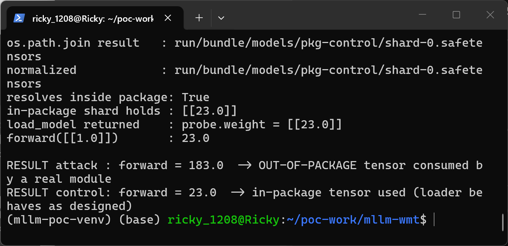

5. Run the official `mllm-convertor` CLI on the attack package to show that the deployed conversion entry point consumes the traversed shard as well: `mllm-convertor --input_path run/bundle/models/pkg-attack --output_path run/out-attack.mllm --model_name probe --verbose`.

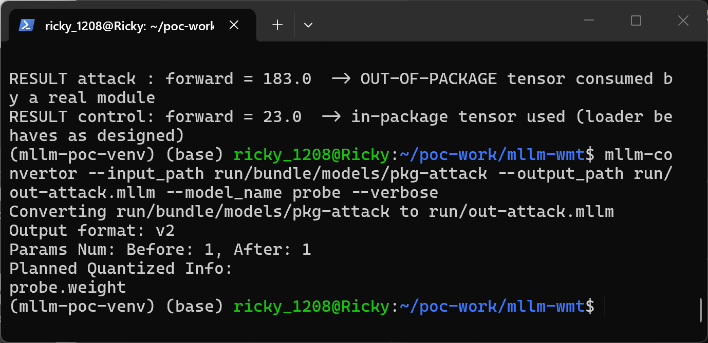

6. Run the same converter on the control package.

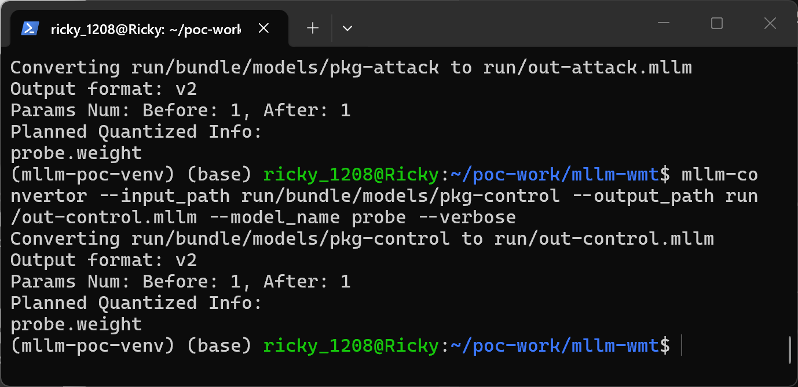

7. Read both produced `.mllm` artifacts back with `dump_converted.py` (a reader for the `ModelFileV2` format of `pymllm/mobile/convertor/model_file_v2.py`). The artifact converted from the attack package contains `probe.weight = [[183.0]]` — the value read from outside the package has been baked into the converted model file — while the control artifact contains `[[23.0]]`.

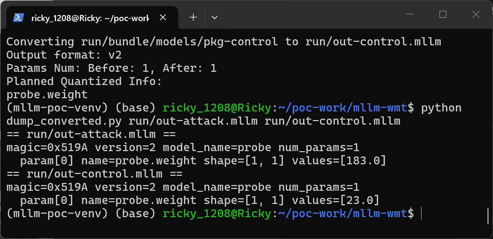

### Expected vs Actual
- Expected: shard filenames from an untrusted `model.safetensors.index.json` are rejected unless they resolve inside the model package; a `..`-escaping or absolute `weight_map` value is never opened.
- Actual: the traversing value is joined onto the model directory and opened; the out-of-package tensor is returned in the `state_dict`, consumed by real modules at `forward()` time (183.0 vs 23.0) and embedded into the converted `.mllm` artifact by the official converter CLI.

### Sanitized PoC input
```json
{"weight_map": {"probe.weight": "../../../victim/host.safetensors"}}
```

## Impact
- Confidentiality: High — the loader reads tensor content from any attacker-chosen location outside the model package (any file that parses as safetensors and contains the attacker-mapped tensor names), and the official `mllm-convertor` CLI embeds the read values into the produced `.mllm` artifact, so a victim who converts a crafted package and publishes or shares the artifact leaks the out-of-package file's tensor content. Distinguishable error outcomes additionally disclose which paths exist and parse as safetensors.
- Integrity: High — attacker-selected tensor values silently replace model weights inside the returned `state_dict` (demonstrated: `forward()` output steered to 183.0 while the package's own shard holds 23.0), giving the package author full control over the numerical behavior of the loaded model without shipping those weights inside the package.
- Availability: None — a missing or unparseable shard raises a normal exception; no crash or resource exhaustion.
- Scope: read and content consumption of resources outside the model package trust boundary; no memory corruption, no code execution (the PoC package intentionally contains no code, no plugins and no pickle sidecars).


## Remediation
Validate every shard filename taken from `weight_map` before joining and verify containment after joining, at `pymllm/mobile/convertor/__init__.py:102`: reject absolute paths and `..` segments (e.g. `os.path.isabs(shard_file)` or `".." in PurePath(shard_file).parts`), and after the join verify the resolved path stays inside the model directory (e.g. `resolved = Path(index_dir, shard_file).resolve()`; raise unless `resolved.is_relative_to(Path(index_dir).resolve())`). Apply the same check to any other place index-supplied shard names are joined onto a local directory, and add a regression test with a `..`-escaping and an absolute `weight_map` value. No fixed release exists at reporting time; re-verify after the maintainer publishes a patch.


## References
- Source repository: https://github.com/UbiquitousLearning/mllm
- Affected commit: https://github.com/UbiquitousLearning/mllm/blob/bc8f5cdb557f/pymllm/mobile/convertor/__init__.py (lines 81-107)
- CWE: https://cwe.mitre.org/data/definitions/22.html
- Upstream report: [pending publication]
- Vendor advisory: [none]
