# Jackrong-llm-finetuning-guide (qwen-mtp-gguf pipeline) commit ef2b17f — Path Traversal (CWE-22) in Index Validation via Absolute weight_map Shard Paths

## Summary
R6410418/Jackrong-llm-finetuning-guide is affected by a path traversal in the index validation of the `qwen-mtp-gguf` conversion pipeline. The pipeline treats the shard filenames in a model's `model.safetensors.index.json` as trusted relative names and joins each `weight_map` value onto the model directory before opening it with `safetensors.safe_open`. A value that is an absolute path (e.g. `/opt/victim/second_resource.safetensors`) makes pathlib discard the model-directory prefix entirely, so a model repo prepared by an attacker makes the pipeline open and validate safetensors files at arbitrary absolute paths on the machine running the conversion, outside the model package. The unvalidated join also yields a file existence/format oracle through distinct error messages and log lines that echo the attacker-chosen absolute path. A related but separate defect in the same file, the join of hub-downloaded shard names onto the HF snapshot directory in `extract_mtp_heads()` (line 610), enables full tensor-content exfiltration into the produced model asset and is reported separately.

## Affected Product

| Field | Value |
|---|---|
| Vendor | R6410418 (Jackrong) |
| Product | Jackrong-llm-finetuning-guide, `qwen-mtp-gguf` pipeline |
| Affected versions | commit `ef2b17f2798cd18cd85375080c35a58397ad0d09` (HEAD of `main` at reporting time, committed 2026-07-11); no tagged releases |
| Component | `qwen-mtp-gguf/scripts/qwen_mtp_gguf_pipeline.py`, function `validate_indexed_tensors()` (lines 544-559), reached from `model_has_valid_mtp()` (lines 562-577) and `inject_mtp_index()` (line 636) |
| Platform | Platform independent (pure Python pathlib semantics); verified on WSL2 Ubuntu 24.04, Python 3.12.3 |
| Vulnerability type | CWE-22: Path Traversal |

## Root Cause

**Location:** `qwen-mtp-gguf/scripts/qwen_mtp_gguf_pipeline.py:552` (`validate_indexed_tensors`), with the path echo at line 554 and the external open at line 555.

`validate_indexed_tensors()` is the gate that decides whether a model repo counts as a valid MTP source. It reads the `weight_map` of `model.safetensors.index.json` (parsed by `list_mtp_keys_from_index()`, lines 506-515) and joins every value onto `model_dir` with no check that the value is a relative, contained path:

```python
def validate_indexed_tensors(model_dir: Path, keys: Iterable[str], weight_map: dict[str, str]) -> None:
    by_file: dict[str, list[str]] = {}
    for key in keys:
        filename = weight_map.get(key)          # attacker-controlled index value
        if not filename:
            raise RuntimeError(f"Index is missing weight_map entry for {key}")
        by_file.setdefault(filename, []).append(key)
    for filename, expected_keys in sorted(by_file.items()):
        shard = model_dir / filename            # line 552: absolute value replaces model_dir
        if not shard.exists():                  # line 553
            raise FileNotFoundError(f"Indexed shard does not exist: {shard}")   # line 554: echoes the absolute path
        with safe_open(str(shard), framework="pt", device="cpu") as f:   # line 555: opens any parseable safetensors file
            available = set(f.keys())
```

In pathlib, joining a right-hand operand that is absolute discards the left-hand side completely: `Path("/home/user/models/qwen") / "/opt/victim/secret.safetensors"` evaluates to `Path("/opt/victim/secret.safetensors")`. There is no rejection of absolute paths, no rejection of `..` segments, and no resolved-path containment check. The `weight_map` values are fully attacker-controlled when the model repo comes from an untrusted source (a downloaded release, a Hugging Face snapshot, or any archive shared as a "model package"), so the pipeline can be directed at any absolute path known to be a valid safetensors file — or made to reveal filesystem structure through the `FileNotFoundError` at line 554, which echoes the joined absolute path verbatim.

The trigger chain inside the same file: `main()` → `process_job()` → `ensure_mtp()` (line 641) → `model_has_valid_mtp()` (lines 562-577) reads the index of the prepared model directory and, as soon as it contains keys matching `mtp`/`nextn`, calls `validate_indexed_tensors()` with the untrusted `weight_map`. The same function is also invoked by `inject_mtp_index()` at line 636. A second, independent join of the same kind exists in `extract_mtp_heads()` at line 610 (`snapshot_dir / shard_name`); it is reported separately because its impact (tensor-content exfiltration into the produced model) differs.

## Proof of Concept

### Prerequisites
- Python 3.12 with `torch`, `safetensors` and `huggingface_hub` importable (the pipeline refuses to start otherwise, `require_runtime_deps()` at line 278).
- A local victim-side file in safetensors format outside the model package, here planted at `/opt/victim/second_resource.safetensors` (96 bytes, tensor key `model.mtp.fc.weight`, filled with the marker value 42.0) using the attached `plant_victim_file.py` run as root; the captured session shows it via `ls -l /opt/victim/`.
- The attached samples: `attacker-repo-attack` (index maps `model.mtp.fc.weight` to the absolute path `/opt/victim/second_resource.safetensors`), `attacker-repo-control` (byte-identical except the weight_map value is the plain in-repo shard basename `second_resource.safetensors`) and `attacker-repo-missing` (index points at `/opt/victim/does-not-exist.safetensors`).

### Steps to Reproduce

Environment used for the captured session (WSL2 Ubuntu 24.04, Python 3.12.3, torch 2.14.1+cpu, safetensors 0.8.0, huggingface_hub 2.1.1, source pinned at commit ef2b17f):

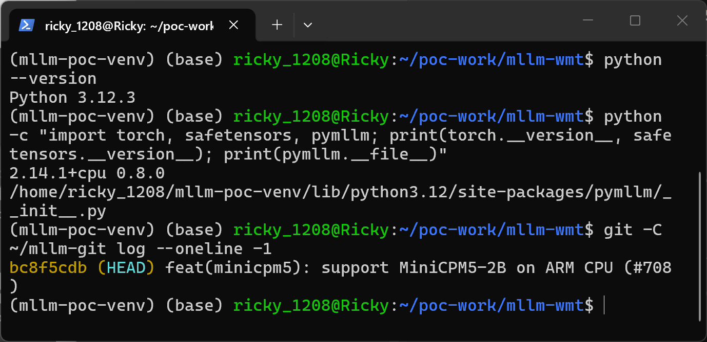

The two unvalidated joins in the pinned source: line 552 (`model_dir / filename`, this report) and line 610 (`snapshot_dir / shard_name`, separate report).

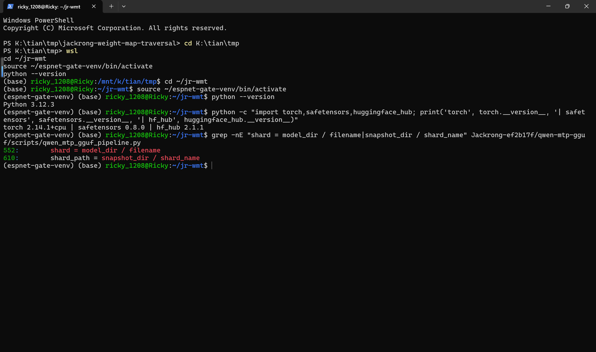

1. Generate the samples with the attached `make_poc.py`. The attack and control repos share the same tensor key, index structure and config; the ONLY difference is one string, the `weight_map` value.

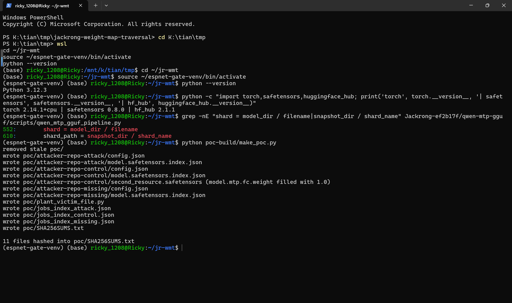

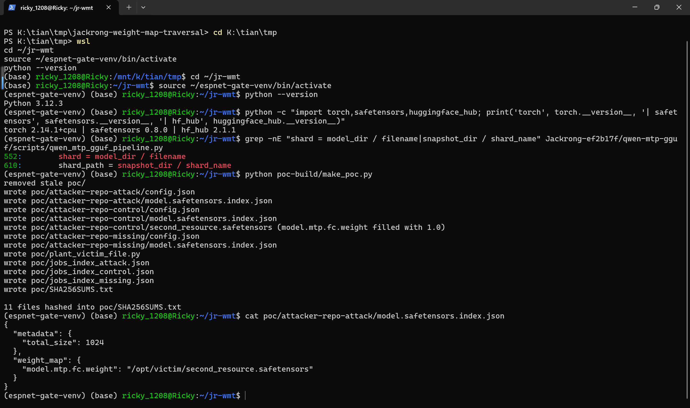

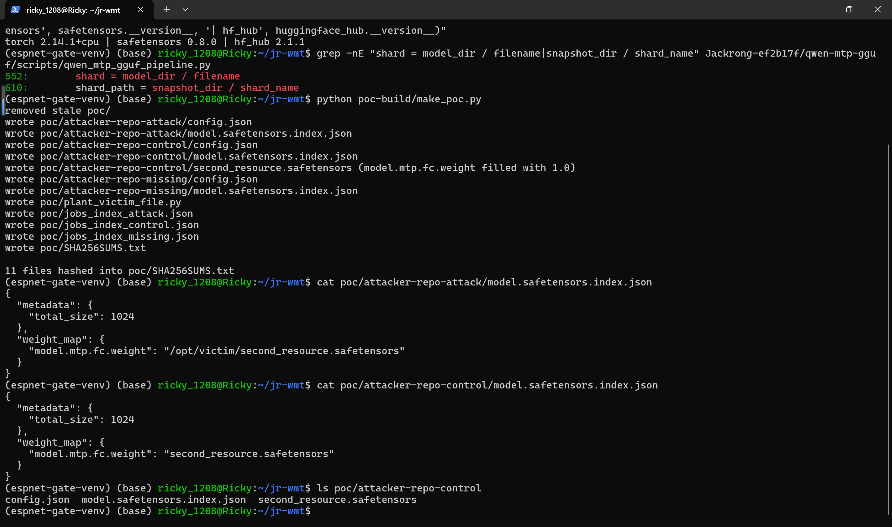

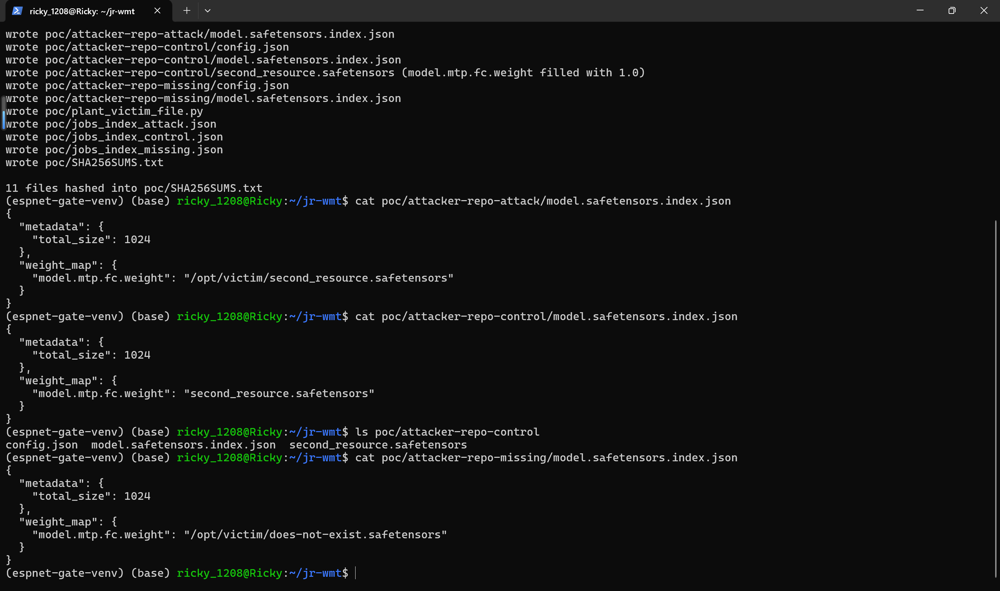

2. Confirm the victim-side file exists outside the model package (planted by `sudo python3 plant_victim_file.py` before the session) and verify sample integrity.

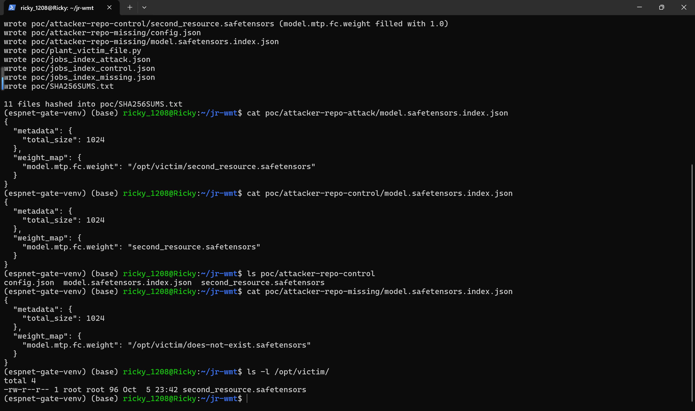

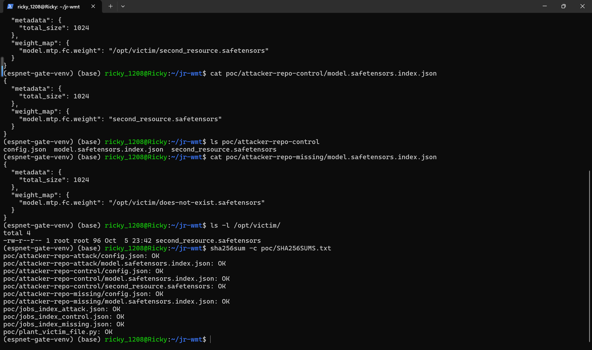

3. Run the pipeline on the attack sample. `--llama-cpp` is an unused placeholder because quantization stages are never reached (`--quant-types ,` yields an empty quant list so the pipeline exits right after MTP handling), and `--skip-preflight` skips the disk/RAM/tooling preflight, which is unrelated to the defect: `python qwen_mtp_gguf_pipeline.py --jobs poc/jobs_index_attack.json --llama-cpp llama.cpp --skip-preflight --quant-types ,`

The log line `Detected 1 existing MTP tensors in index: ['/opt/victim/second_resource.safetensors']` can only be reached after `safe_open` at line 555 successfully opened the out-of-package file and found the indexed tensor key inside it, i.e. the pipeline accepted and validated a shard that was never part of the model package.

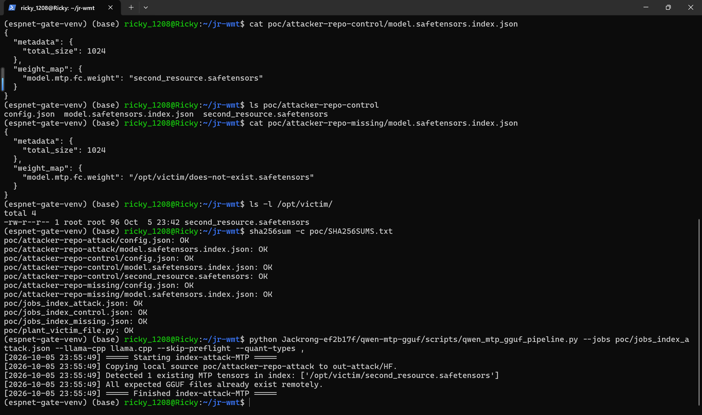

4. Run the control sample, which differs only in that one string. The pipeline resolves the shard inside the model directory and behaves as designed.

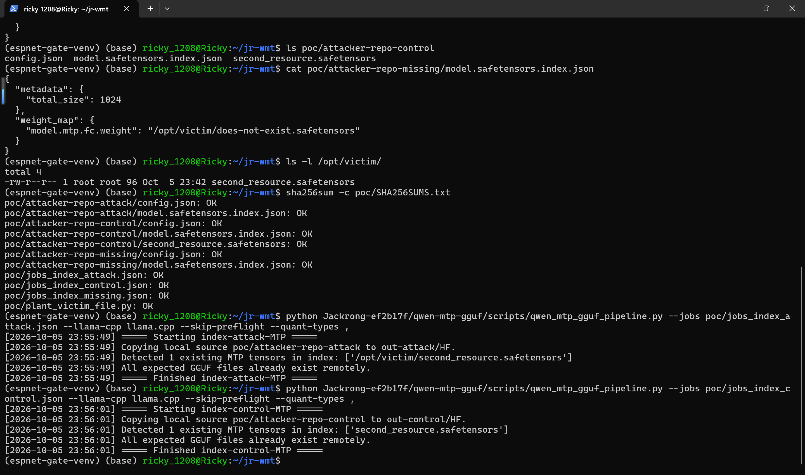

5. Run the missing-shard sample. The `FileNotFoundError` at line 554 echoes the attacker-chosen absolute path back, which turns the defect into a filesystem-structure oracle (missing path vs. parseable safetensors vs. valid-and-matching-shard are three distinguishable outcomes).

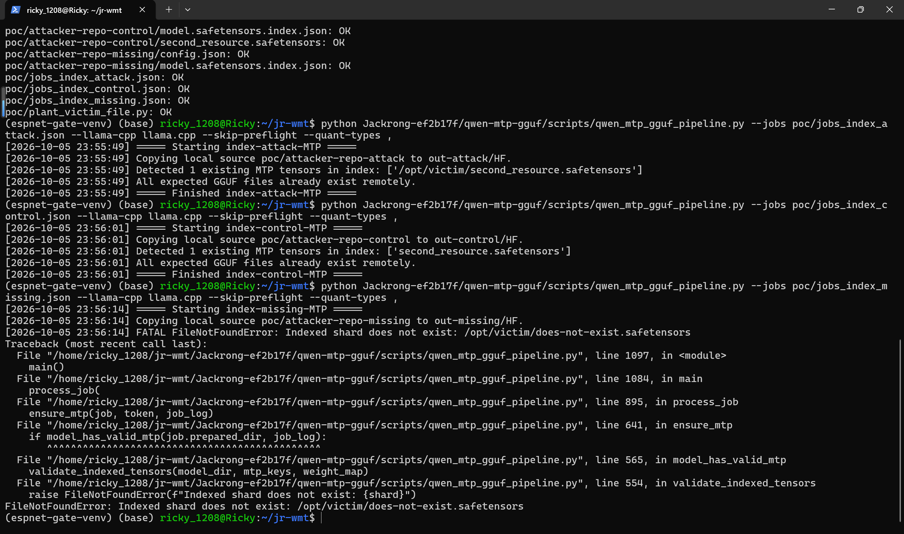

### Expected vs Actual
- Expected: shard names from an untrusted `model.safetensors.index.json` are rejected unless they resolve inside the model directory; an absolute path or a `..`-escaping path is never opened.
- Actual: the absolute `weight_map` value replaces the model-directory prefix entirely (pathlib join semantics). The pipeline opens and validates the out-of-package file, marks the model as a valid MTP source and proceeds with the tampered index; distinguishable outcomes leak filesystem structure and absolute path echoes.

### Sanitized PoC input
```json
{"metadata": {"total_size": 1024}, "weight_map": {"model.mtp.fc.weight": "/opt/victim/second_resource.safetensors"}}
```

## Impact
- Confidentiality: Low — at this sink tensor values are not exported, but the oracle discloses, for any absolute path, whether the file exists, whether it parses as safetensors, and which tensor keys it contains (distinguishable error and log outcomes); tensor key names of private model files are disclosed.
- Integrity: Low — the attacker-written index passes the pipeline's own MTP validation gate, so the tampered model (whose index still maps tensors to out-of-package absolute paths) is accepted and enters the downstream conversion stages with attacker-steered shard mappings.
- Availability: None — a missing shard raises a normal exception; no crash or resource exhaustion.
- Scope: local file read/validation outside the model package boundary; the sibling join in `extract_mtp_heads()` (line 610, separate report) extends this to full tensor-content exfiltration into the published model asset.

## Remediation
Validate every shard filename taken from the index before joining: reject absolute paths and `..` segments (e.g. `PurePosixPath(filename).is_absolute()` or `'..' in PurePosixPath(filename).parts`), and after joining verify containment on the resolved path (`shard = (model_dir / filename).resolve()`; raise unless `shard.is_relative_to(model_dir.resolve())`). Apply the same check at every place index-supplied shard names are joined onto a local directory in this pipeline, in particular `validate_indexed_tensors()` at line 552 and `extract_mtp_heads()` at line 610, and add a regression test with an absolute `weight_map` value. No fixed release exists at reporting time; re-verify after the maintainer publishes a patch.

## References
- Source repository: https://github.com/R6410418/Jackrong-llm-finetuning-guide
- Affected commit: https://github.com/R6410418/Jackrong-llm-finetuning-guide/blob/ef2b17f2798cd18cd85375080c35a58397ad0d09/qwen-mtp-gguf/scripts/qwen_mtp_gguf_pipeline.py#L544-L559
- CWE: https://cwe.mitre.org/data/definitions/22.html
- Upstream report: [pending publication]
- Related report for the sibling join in `extract_mtp_heads()` (line 610): [pending publication]
