# Jackrong llm-finetuning-guide (qwen-mtp-gguf pipeline) commit ef2b17f — Path Traversal (CWE-22) in MTP weight_map shard resolution

## Summary
R6410418/Jackrong-llm-finetuning-guide is affected by a path traversal in the `qwen-mtp-gguf` conversion pipeline. The pipeline trusts the shard filenames in `model.safetensors.index.json` of the MTP source model repo and joins each `weight_map` value onto the local Hugging Face snapshot directory before opening it with `safetensors.safe_open`. A value that is an absolute path discards the snapshot prefix entirely (pathlib join semantics), so an attacker-published MTP source repo makes the pipeline read attacker-chosen local files on the machine running the conversion and copy tensors stored under MTP/nextN-prefixed keys into the produced model asset (`mtp_heads.safetensors`), which is wired into the prepared model index and flows into the published GGUF output. The unvalidated join also yields a file existence/format oracle through the distinct error messages.

## Affected Product

| Field | Value |
|---|---|
| Vendor | R6410418 (Jackrong) |
| Product | Jackrong-llm-finetuning-guide, `qwen-mtp-gguf` pipeline |
| Affected versions | commit `ef2b17f2798c` (HEAD of main at reporting time, committed 2026-07-11); no tagged releases |
| Component | `qwen-mtp-gguf/scripts/qwen_mtp_gguf_pipeline.py`, functions `source_mtp_shards()` (lines 337-346) and `extract_mtp_heads()` (lines 593-619) |
| Platform | Platform independent (pure Python path handling); verified on WSL2 Ubuntu 24.04, Python 3.12.3 |
| Vulnerability type | CWE-22: Path Traversal |

## Root Cause

**Location:** `qwen-mtp-gguf/scripts/qwen_mtp_gguf_pipeline.py:610` (`extract_mtp_heads`), fed by `source_mtp_shards` at lines 337-346.

`source_mtp_shards()` reads `model.safetensors.index.json` from the attacker-influenced MTP source repo (`job.mtp_source_repo`) and returns the `weight_map` values verbatim as shard names:

```python
def source_mtp_shards(repo_id: str, token: str | None) -> tuple[list[str], list[str]]:
    index_path = hf_hub_download(repo_id=repo_id, filename="model.safetensors.index.json", token=token)
    index_data = json.loads(Path(index_path).read_text(encoding="utf-8"))
    weight_map = index_data.get("weight_map", {})
    mtp_keys = sorted(key for key in weight_map if "mtp" in key.lower() or "nextn" in key.lower())
    return mtp_keys, sorted({weight_map[key] for key in mtp_keys})
```

`extract_mtp_heads()` then joins every value onto the snapshot directory and opens it, without rejecting absolute paths, `..` segments, or checking that the resolved result stays inside the snapshot:

```python
for shard_name in shards:
    shard_path = snapshot_dir / shard_name          # line 610: absolute value replaces the base
    with safe_open(str(shard_path), framework="pt", device="cpu") as f:   # line 611: opens any path
        for key in f.keys():
            if key in wanted:
                tensors[key] = f.get_tensor(key)
...
save_file(tensors, str(target_path))               # line 618: external content lands in the model asset
```

The shard names originate from a model repo that can be published by anyone, so they are attacker-controlled data reaching a file-system sink with no containment check. Because `pathlib.Path.__truediv__` returns the right operand unchanged when it is absolute, `/opt/victim/second_resource.safetensors` fully replaces `snapshot_dir`.

## Proof of Concept

### Prerequisites
- Linux-like host with Python 3 and a venv containing `huggingface_hub`, `safetensors` and `torch` (CPU build is sufficient); the target model can be a tiny local directory, no GPU and no llama.cpp install are needed when `--quant-types ''` is passed.
- A directory the attacker names in the absolute path must exist on the operator's machine and contain a valid safetensors file whose tensor keys contain `mtp` or `nextn` for content injection; missing or unparseable paths are still distinguishable through the pipeline's error messages (existence/format oracle).
- huggingface.co itself is not contacted in the demo: publishing a weaponised repo is not acceptable, so the same hub protocol is answered by a localhost mock (`mock_hf_hub.py`) via the official `HF_ENDPOINT` override. Every request the pipeline makes is real client code; the mock only stands in for the attacker's published repo.

### Steps to Reproduce
1. Check out the repo at commit `ef2b17f` and prepare the environment.

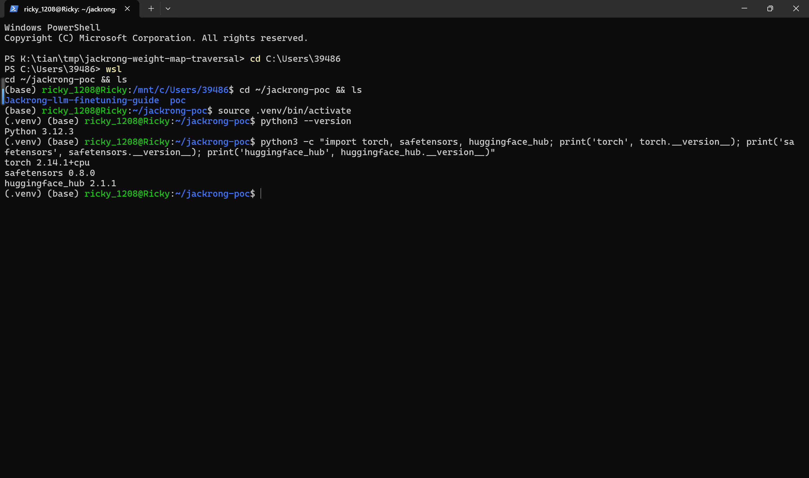

2. Confirm the vulnerable line in the checked-out source.

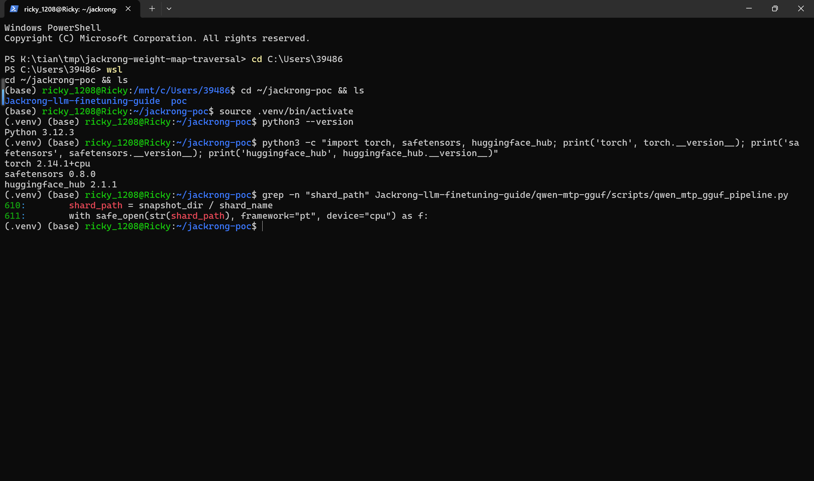

3. Generate the samples with `make_poc.py`: an attack repo and a control repo that are identical except for one string — the attack `weight_map` value is the absolute path `/opt/victim/second_resource.safetensors`, the control value is the in-repo shard name `second_resource.safetensors`. Tensor content is marked with distinct fill values (42.0 victim-side, 1.0 in-repo) so the extracted output can be attributed unambiguously.

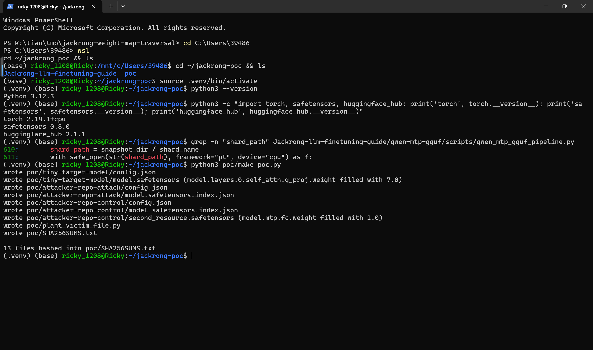

4. The attack repo's index maps the MTP tensor to the absolute path.

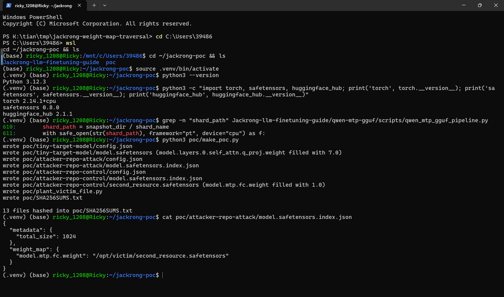

5. The control repo's index maps the same tensor key to the plain in-repo shard, which exists in that repo.

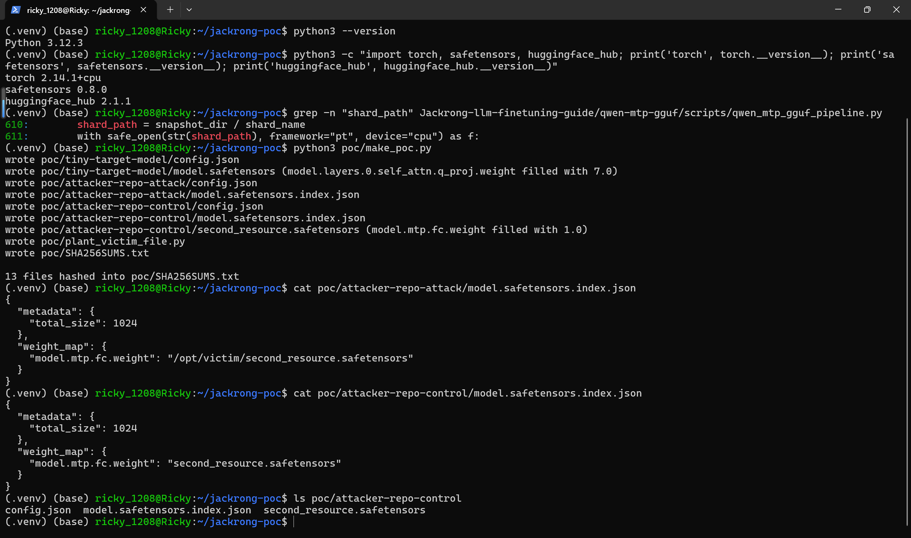

6. Create the victim-side local file (one-time `sudo install -d -o "$USER" /opt/victim` to create the directory as root, then run the plant script as the normal user).

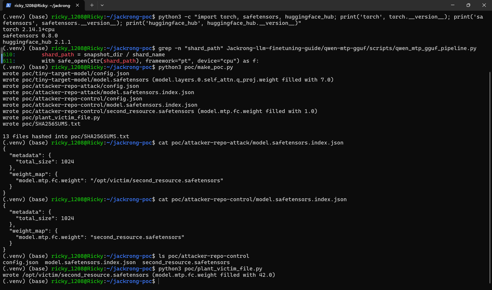

7. Serve the attack repo on a local HF-compatible endpoint and run the real pipeline against it. The log shows only the index is fetched (`Fetching 1 files`), yet extraction succeeds from the absolute path.

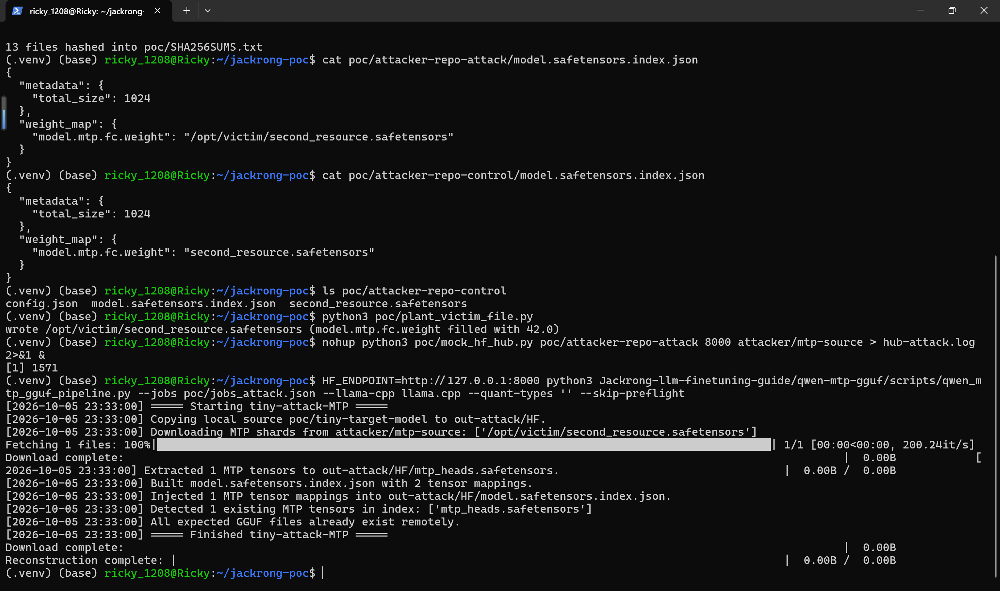

8. The persistent job log records the same sequence.

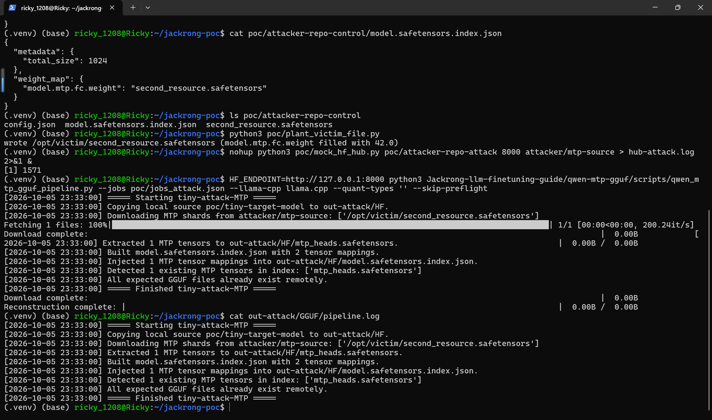

9. Read back the produced model asset: the tensor is the victim file's content (mean 42.0), and the prepared model index now ships it as `mtp_heads.safetensors`.

![verify_output.py: model.mtp.fc.weight shape=[2, 2] mean=42.0000, prepared index weight_map contains mtp_heads.safetensors](images/jackrong-weight-map-traversal-09-verify-attack.png)

10. The hub access log proves the external file was never downloaded from the repo — only `model.safetensors.index.json` was requested.

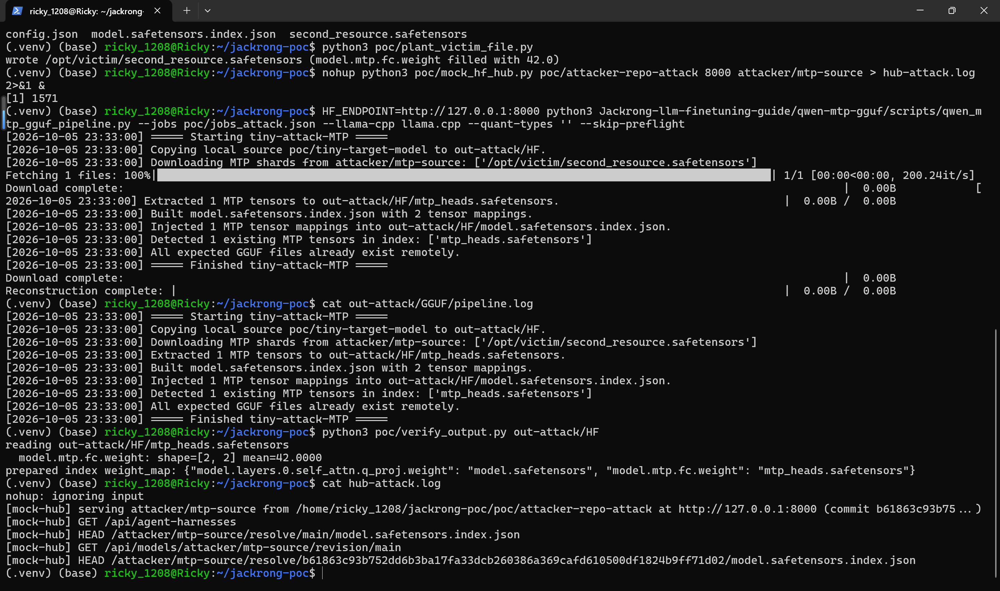

11. Control run with the in-repo shard name: the pipeline downloads the shard (`Fetching 2 files`) and behaves as designed.

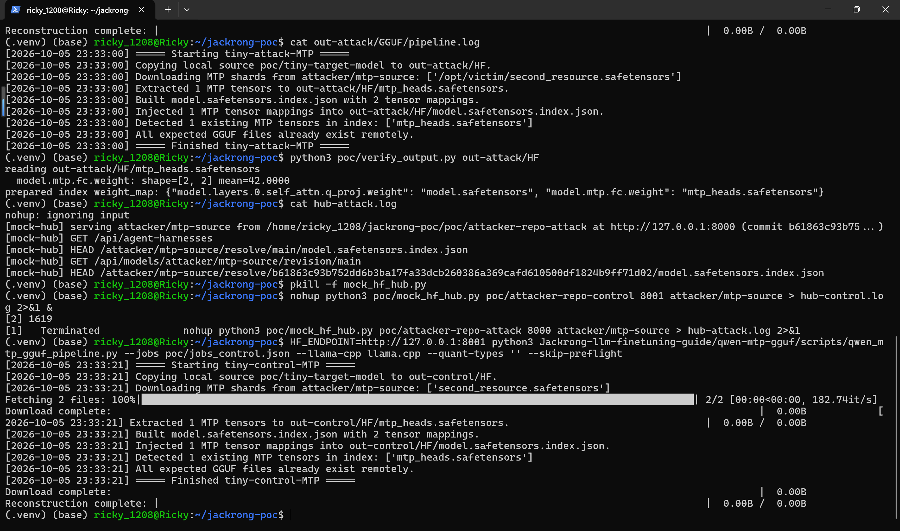

12. Control read-back: the extracted tensor comes from the snapshot copy (mean 1.0), confirming the 42.0 in the attack run can only come from the absolute path.

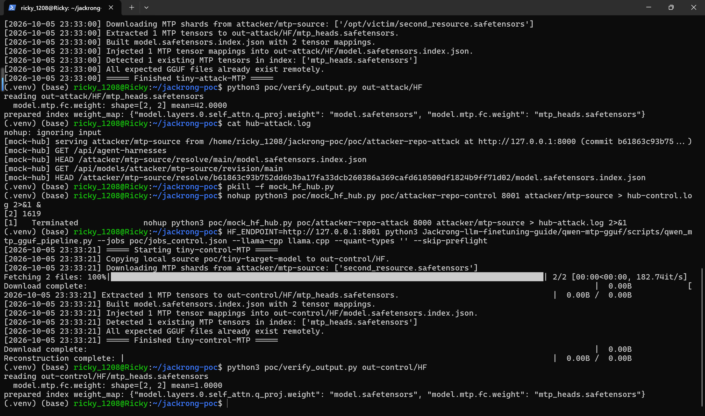

### Expected vs Actual
- Expected: shard names from an untrusted index are rejected unless they resolve inside the downloaded snapshot directory; an absolute path or snapshot-escaping value is never opened.
- Actual: the absolute `weight_map` value replaces the snapshot prefix, `safe_open` reads the attacker-chosen local file, and its tensors are copied into `mtp_heads.safetensors` and indexed into the prepared model. In the attack run only 1 file (the index) is fetched from the repo while extraction succeeds with the external file's content.

### Sanitized PoC input
```json
{"metadata": {"total_size": 1024}, "weight_map": {"model.mtp.fc.weight": "/opt/victim/second_resource.safetensors"}}
```

Pipeline invocation used in the demo (no tokens, no external services): `HF_ENDPOINT=http://127.0.0.1:8000 python3 qwen-mtp-gguf/scripts/qwen_mtp_gguf_pipeline.py --jobs poc/jobs_attack.json --llama-cpp llama.cpp --quant-types '' --skip-preflight`

## Impact
- Confidentiality: High — within the safetensors-compatible domain, the full tensor content of an attacker-named local file is copied into the conversion output, which the operator then publishes; the differing error messages additionally disclose file existence and format validity for arbitrary paths.
- Integrity: High — attacker-chosen tensor data is silently embedded into the victim's model artifact (`mtp_heads.safetensors` plus index entries), poisoning the weights that are intended for publication.
- Availability: None — no crash or resource exhaustion; failing paths surface as ordinary runtime errors.
- Scope: local file read/content injection into a model-supply-chain artifact; no memory corruption, no code execution via this defect alone.

## Remediation
Validate every shard name from the index before opening it: reject absolute paths and `..` segments (e.g. `PurePosixPath(shard_name).is_absolute()` or `'..' in PurePosixPath(shard_name).parts`), and after joining verify containment on the resolved path (`shard_path.resolve().is_relative_to(snapshot_dir.resolve())`), raising a clear error otherwise. Apply the same check wherever index-supplied shard names are joined onto a local directory in this pipeline. No fixed release exists at reporting time; re-verify after the maintainer publishes a patch.

## References
- Source repository: https://github.com/R6410418/Jackrong-llm-finetuning-guide
- Pinned commit: https://github.com/R6410418/Jackrong-llm-finetuning-guide/tree/ef2b17f2798c
- Vulnerable file: https://github.com/R6410418/Jackrong-llm-finetuning-guide/blob/ef2b17f2798c/qwen-mtp-gguf/scripts/qwen_mtp_gguf_pipeline.py#L610
- Upstream report: [pending publication]
- CWE: https://cwe.mitre.org/data/definitions/22.html
- Vendor advisory: [none]
