# tt-metal v0.79.0 — Path Traversal in tt_transformers load_checkpoints

## Summary

Tenstorrent tt-metal (TT-Metalium) at git commit 70f840f46adb (main branch, 2026-09-14) and in the latest release v0.79.0 (2026-09-18) is affected by a path traversal (CWE-22) in the safetensors checkpoint loader used by the tt_transformers model family. The shard filenames inside `model.safetensors.index.json` are joined to the checkpoint directory with `os.path.join()` without any containment check, so a malicious model package can make the loader open and read safetensors files from anywhere on the filesystem (relative `../..` sequences and absolute paths both work) and pull the tensor values into the model state dict. A machine-learning model repository is attacker-controlled content in the normal workflow of this project (models are pulled from Hugging Face Hub and loaded from a local snapshot directory), so a crafted `weight_map` silently swaps model weights for values taken from a file outside the model directory.

## Affected Product

| Field | Value |
|---|---|
| Vendor | Tenstorrent |
| Product | tt-metal (TT-Metalium) |
| Affected versions | git commit 70f840f46adb (main, 2026-09-14); the vulnerable function is present unchanged in release v0.79.0 (2026-09-18, latest release at the time of writing) |
| Component | `models/tt_transformers/tt/load_checkpoints.py` — `load_hf_state_dict_filtered()` / inner `resolve_file()` |
| Platform | OS-independent Python code (reproduced on Ubuntu 22.04 WSL2, Python 3.12.3, torch 2.14.1+cpu, safetensors 0.8.0); no Tenstorrent hardware is required to reach the defect |
| Vulnerability type | CWE-22: Path Traversal |

## Root Cause

**Location:** `models/tt_transformers/tt/load_checkpoints.py:72-107` (`load_hf_state_dict_filtered`, inner function `resolve_file`)

The function supports two modes: a Hugging Face repo ID (delegated to `hf_hub_download`, which enforces hub path rules) and a local checkpoint directory. In the local-directory mode the shard filename taken from the index JSON is used verbatim:

```python
def resolve_file(filename, allow_missing=False):
    if is_local_dir:
        path = os.path.join(ckpt_dir, filename)
        if os.path.exists(path):
            return path
```

The index is fully attacker-controlled when the checkpoint comes from a downloaded model package:

```python
weight_map = index_data["weight_map"]
file_to_keys = {}
for key, file in weight_map.items():
    if key.startswith(prefixes):
        file_to_keys.setdefault(file, []).append(key)

for file, keys in file_to_keys.items():
    safetensor_path = resolve_file(file)
    with safetensors_safe_open(safetensor_path, framework="pt", device="cpu") as f:
        for key in keys:
            loaded_weights[key] = f.get_tensor(key)
```

The prefix filter at line 100 constrains only the tensor **keys**; the **values** of `weight_map` (the shard filenames) are never validated. `os.path.join(ckpt_dir, "../../victim/external.safetensors")` escapes the checkpoint directory, the only gate is `os.path.exists()`, and the resolved path is handed to `safetensors_safe_open()`. `os.path.join()` also passes absolute paths through unchanged, so the traversal is not limited to `..` sequences. The production callers pass a user-chosen model directory or repo snapshot into this function, e.g. `models/demos/qwen25_vl/tt/model_config.py:121` (`load_hf_state_dict_filtered(self.CKPT_DIR, ("visual.", "model.visual."))`) and `models/experimental/exaone45_vl/tt/model_config.py:126`; the tensor name used in this PoC, `model.visual.proj.weight`, falls under those prefixes. The sibling function `load_hf_state_dict()` in the same file (line 33, `os.path.join(ckpt_dir, file)` over `weight_map.values()`) repeats the same pattern and is affected in the same way.

## Proof of Concept

### Prerequisites

- A checkout of tt-metal at commit 70f840f46adb (only the `models/` tree is imported; no Tenstorrent hardware and no C++ build are needed).
- Python 3.12 with `torch`, `safetensors`, `loguru`, `tqdm` installed.
- The victim-side second resource: a safetensors file outside the model package, e.g. `<workdir>/victim/external.safetensors`, containing a tensor named `model.visual.proj.weight` with the value `73.0` (standing in for any pre-existing legitimate safetensors file the victim has on disk).

### Steps to Reproduce

1. Generate the samples with the attached `make_poc.py`. It writes a malicious package (`poc/pkg-attack`) whose index maps `model.visual.proj.weight` to `../../victim/external.safetensors`, a negative control package (`poc/pkg-control`) whose index points the same tensor at the in-package shard `internal.safetensors`, the in-package shard tensors (value `11.0`), and the external victim resource (value `73.0`). The two index files differ in exactly one JSON string.

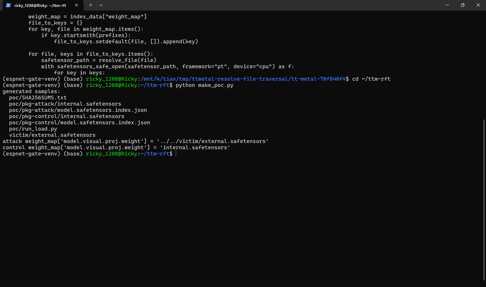

2. Confirm the malicious index. The shard filename is a traversal sequence pointing outside the package:

```json
{"metadata": {"total_size": 4}, "weight_map": {"model.visual.proj.weight": "../../victim/external.safetensors"}}
```

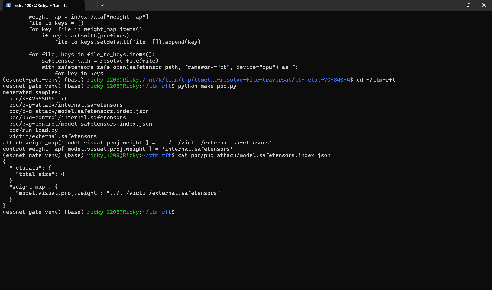

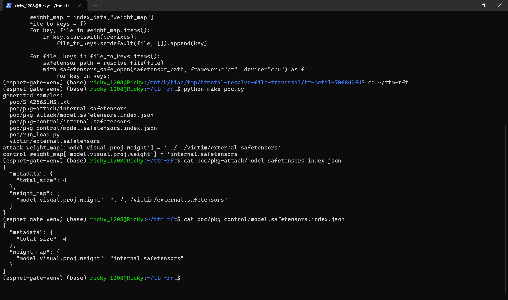

3. Verify the traversal target really lands outside the package: `realpath poc/pkg-attack/../../victim/external.safetensors` resolves to `<workdir>/victim/external.safetensors`.

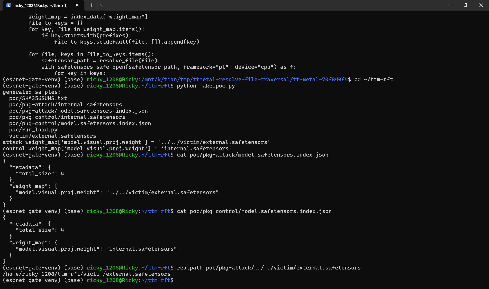

4. Verify sample integrity: `sha256sum -c poc/SHA256SUMS.txt` reports OK for all generated files.

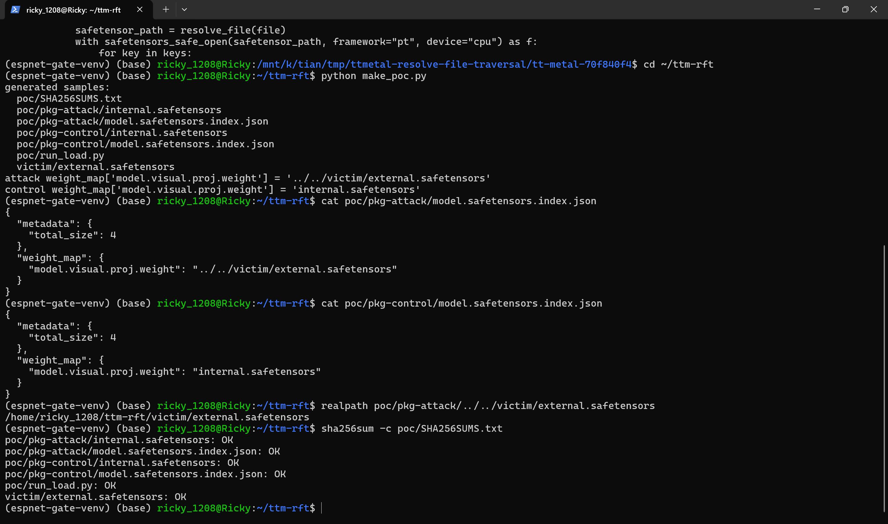

5. Run the real tt-metal loader through the victim-side trigger `poc/run_load.py` (it imports `load_hf_state_dict_filtered` from the pinned checkout and prints the value that lands in the model state dict) against the attack package:

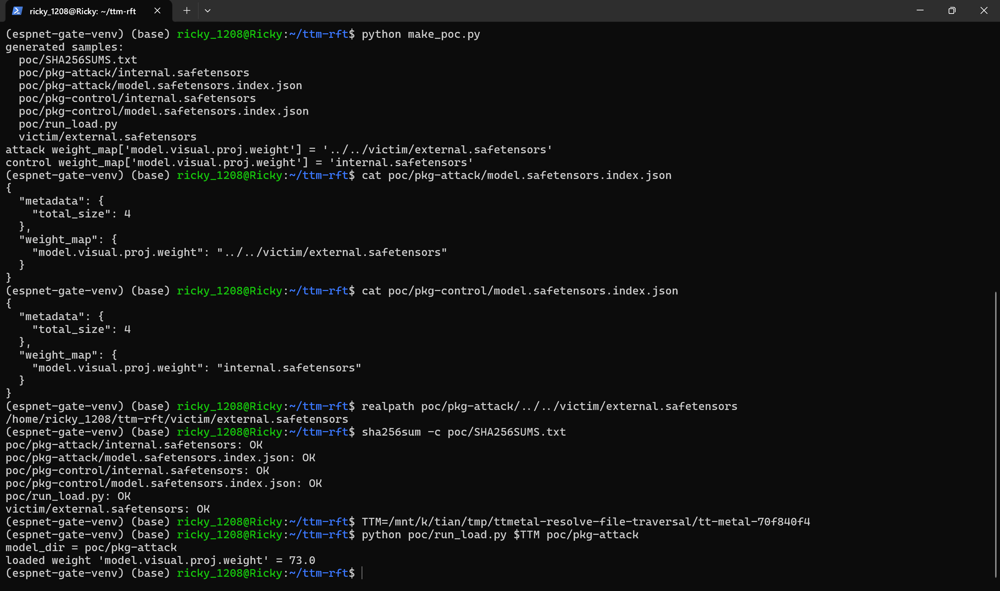

6. Run the same loader against the negative-control package:

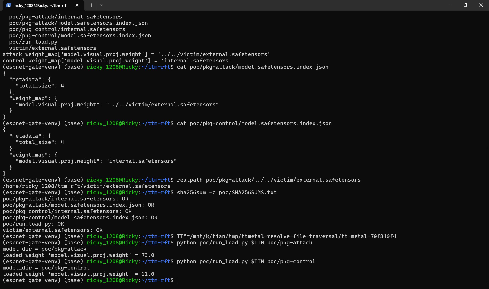

### Expected vs Actual

- Expected: the loader only ever resolves shard files inside the checkpoint directory passed by the caller; a `weight_map` value pointing outside the package should be rejected.
- Actual: the attack package makes the loader open `<workdir>/victim/external.safetensors` (outside the package) and the loaded weight takes the external value `73.0`; the control package loads `11.0` from the in-package shard. The loaded weights silently differ depending on the content of an arbitrary file outside the model directory.

### Sanitized PoC input

```text
model.safetensors.index.json (attack package):
{"metadata": {"total_size": 4}, "weight_map": {"model.visual.proj.weight": "../../victim/external.safetensors"}}
model.safetensors.index.json (negative control, only this string differs):
{"metadata": {"total_size": 4}, "weight_map": {"model.visual.proj.weight": "internal.safetensors"}}
```

### Environment evidence

- Pinned source used for the reproduction (commit `70f840f4`, "[Bug fix] Fit SDPA decode correction in FP32 half-sync DST (#56225)"):

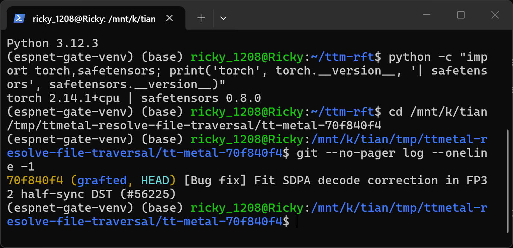

- Python/torch/safetensors versions of the reproduction host:

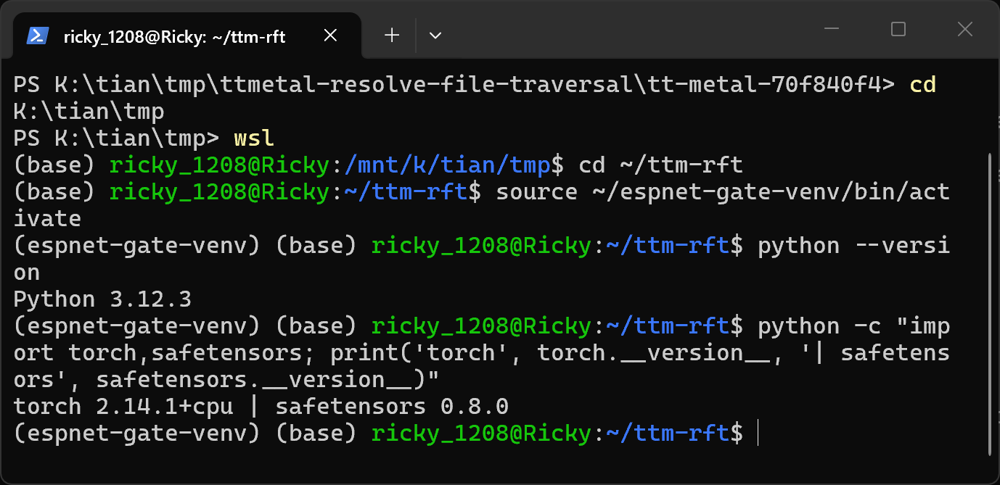

- Vulnerable code at lines 72-79 (`resolve_file` joins the unvalidated filename):

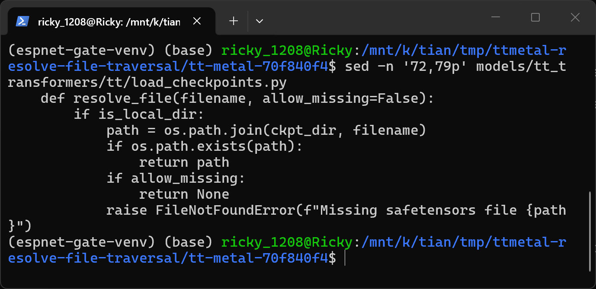

- Vulnerable code at lines 97-107 (weight_map values flow into resolve_file and safetensors_safe_open):

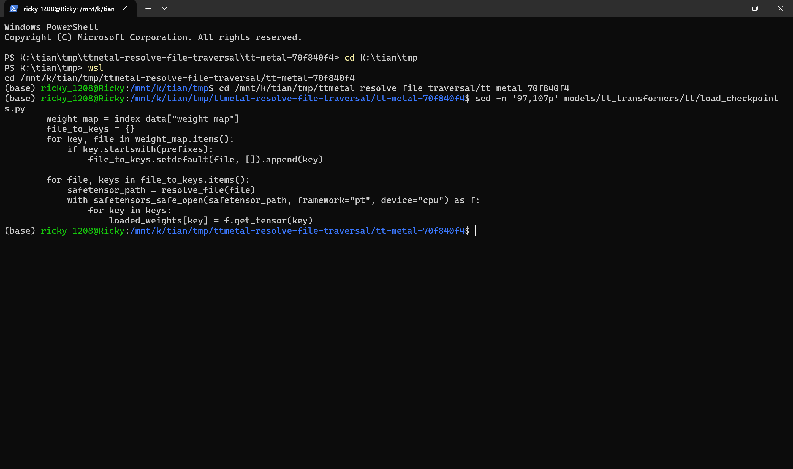

The value-differential screenshots (steps 5-6) were captured in WSL2 Ubuntu 22.04 on the reproduction host; the loader code executed is the unmodified pinned tt-metal source listed above.

## Impact

- Confidentiality: Low — the read is limited to files that parse as safetensors and the attacker must know the tensor names inside the target file; the extracted values surface as model weights, so exfiltration requires an observation channel (inference outputs, behavioral probes). Existence of arbitrary paths is however testable through the error oracle (`FileNotFoundError` for a missing shard vs a tensor-name error for a present-but-different file).
- Integrity: High — model weights are silently replaced by attacker-chosen tensor values read from outside the model directory (weight poisoning / backdoor insertion); the loaded value propagates into the model state dict with no warning.
- Availability: None — a malformed or missing traversal target aborts the load with an exception, which the attacker already controls by shipping broken weights inside the package.
- Scope: resource confusion between the attacker-supplied model package and any pre-existing safetensors file on the victim host; no memory corruption, no code execution via this defect alone.

## Remediation

Contain the resolved path to the checkpoint directory before opening it, e.g. resolve the joined path and require it to be inside `os.path.realpath(ckpt_dir)` (or accept basenames only and reject separators), and apply the same check in `load_hf_state_dict()` (line 33) which repeats the pattern. Rejected shard filenames should fail loudly. A workaround until patched: only load checkpoints whose index `weight_map` values have been reviewed, or load from the Hugging Face repo-ID mode where shard names are validated by the hub client.

## References

- Source repository: https://github.com/tenstorrent/tt-metal
- Pinned commit: https://github.com/tenstorrent/tt-metal/blob/70f840f46adb33ec21ec8893f48ee06692648f75/models/tt_transformers/tt/load_checkpoints.py
- Latest release containing the code: https://github.com/tenstorrent/tt-metal/releases/tag/v0.79.0
- CWE: https://cwe.mitre.org/data/definitions/22.html
- Vendor advisory: [pending publication]
