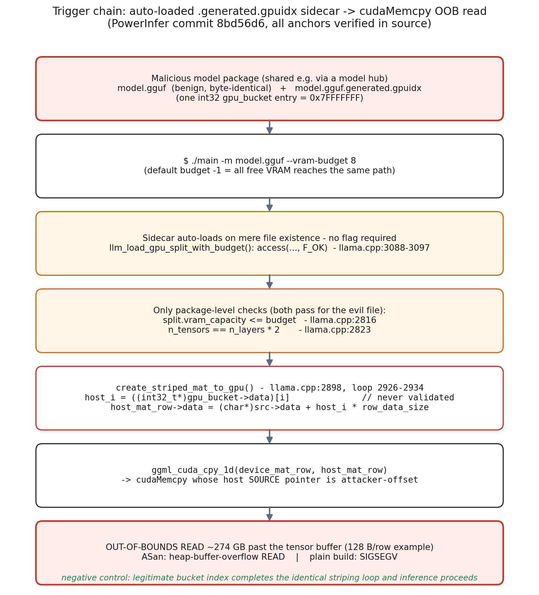
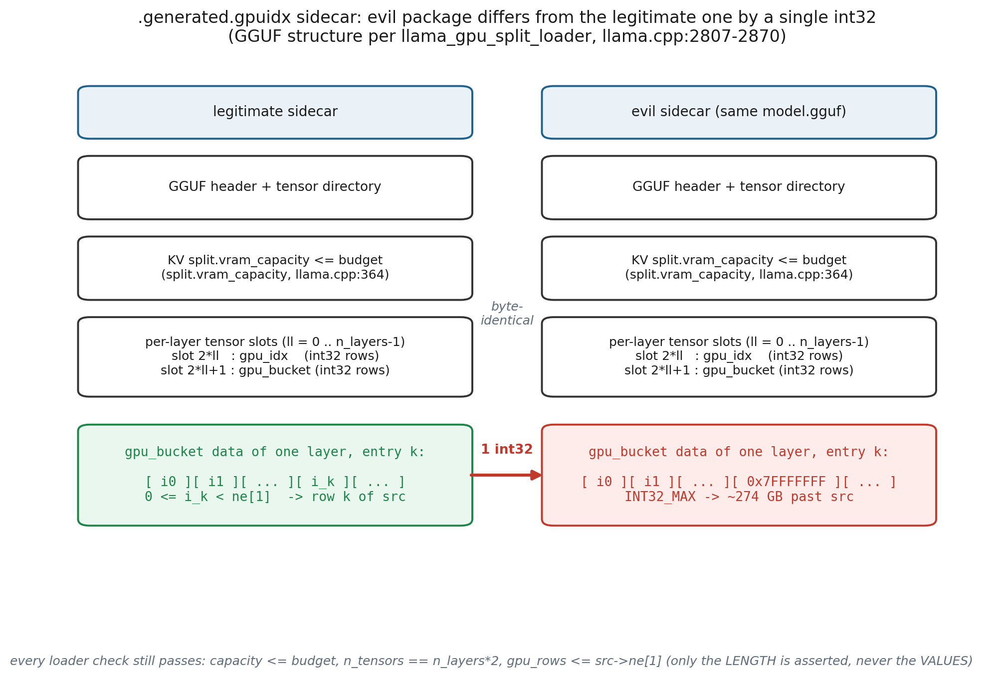
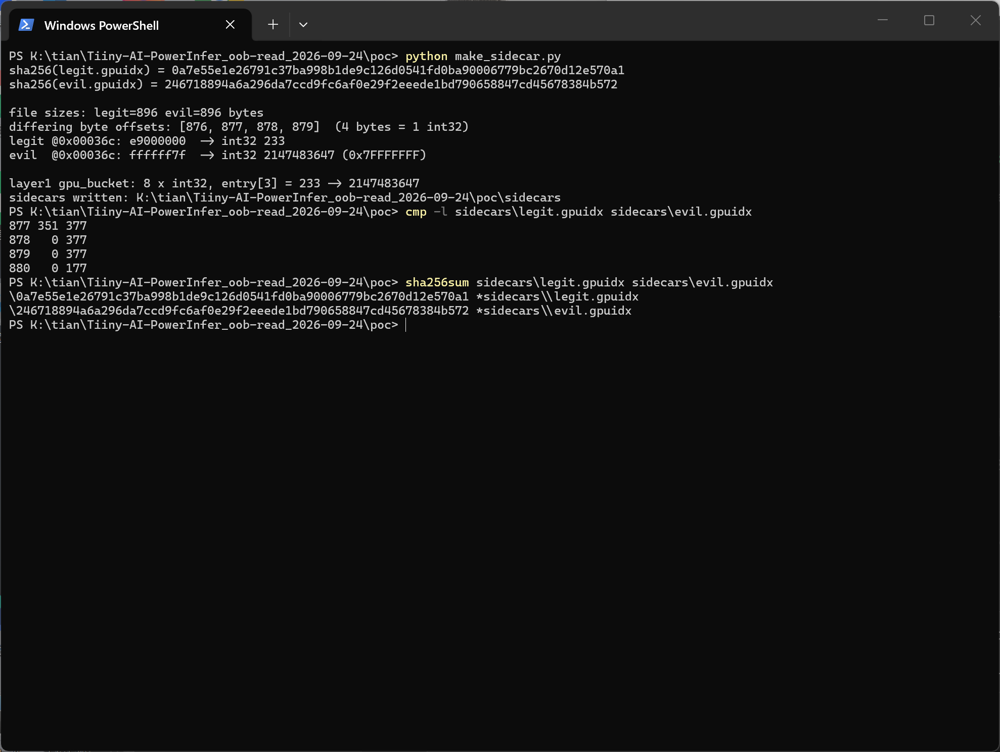
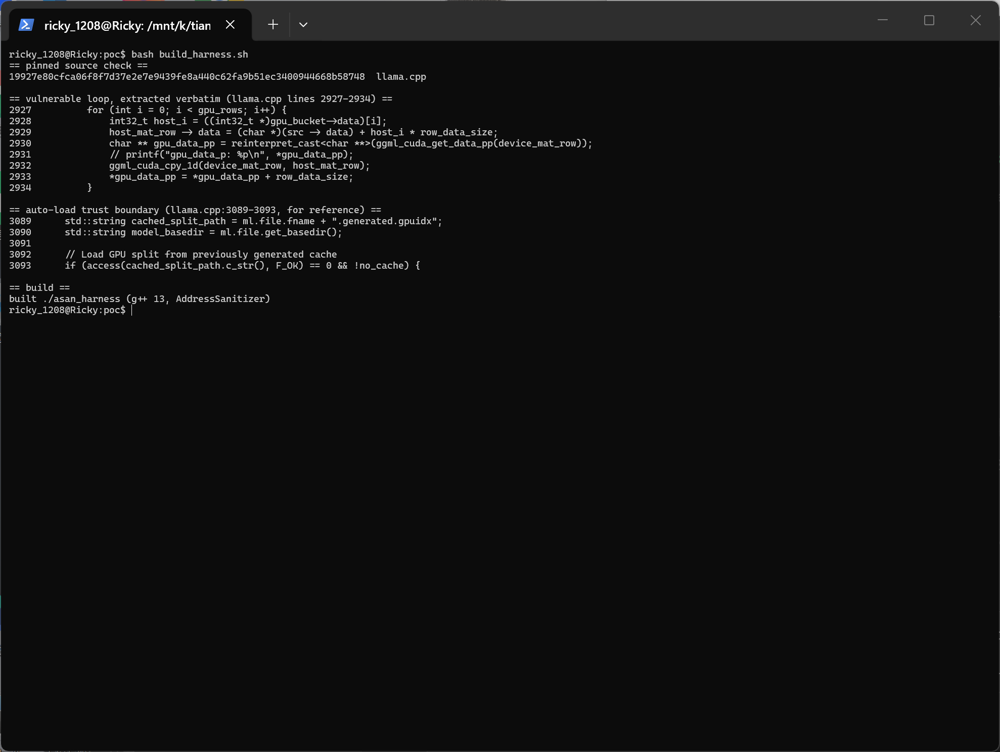
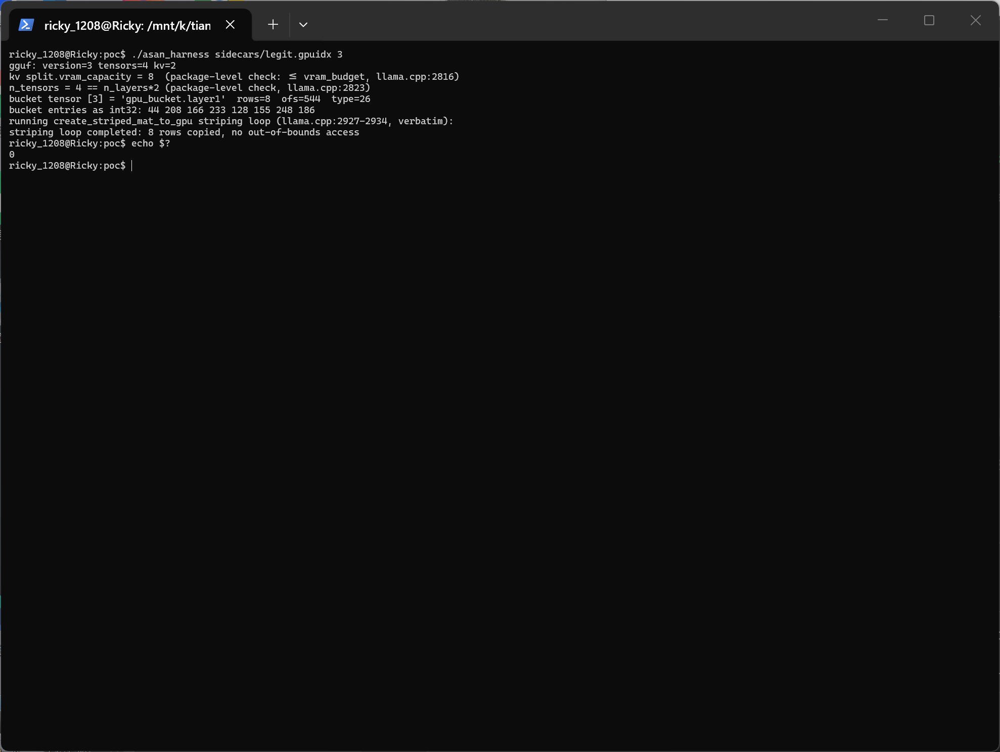
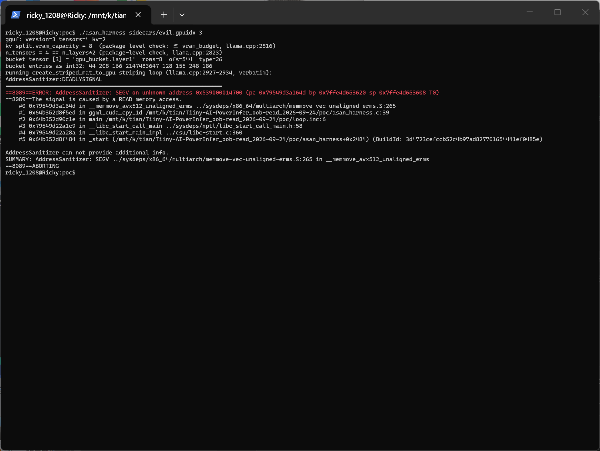
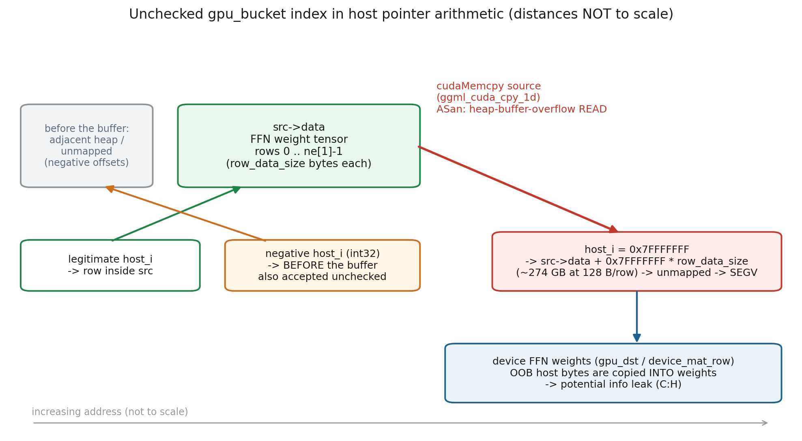

# PowerInfer commit 8bd56d6 — Out-of-bounds Read (CWE-125) in the FFN GPU-Split Sidecar Loader

## Summary

Tiiny-AI PowerInfer (commit `8bd56d69906c9d2dba4d3bf6899763401e01a9a4`, current `main`, no tagged releases) is affected by an out-of-bounds read in the loader for its automatic GPU-split sidecar file (`<model>.generated.gpuidx`). The sidecar is loaded silently whenever it sits next to the model file, and its per-layer `gpu_bucket` int32 row indices are used **without any per-entry validation** as offsets in host pointer arithmetic before being passed to `cudaMemcpy`. A model package that differs from a legitimate one by a single int32 (e.g. `0x7FFFFFFF`) makes the inference binary read up to `INT32_MAX * row_data_size` bytes (≈274 GB for 128-byte rows) past the weight buffer, crashing the process; the out-of-bounds bytes are copied into device FFN weights, so host memory can in principle be leaked through inference output.



## Affected Product

| Field | Value |
|---|---|
| Vendor | Tiiny-AI |
| Product | PowerInfer (high-speed LLM serving for local deployment) |
| Affected versions | commit `8bd56d69906c9d2dba4d3bf6899763401e01a9a4` (`main`, 2026-05-11); no tagged releases exist |
| Component | `llama.cpp` (vendored single file) — `create_striped_mat_to_gpu()` at `llama.cpp:2898`, vulnerable loop at `llama.cpp:2926-2934`; sidecar auto-load in `llm_load_gpu_split_with_budget()` at `llama.cpp:3088-3097` |
| Platform | CUDA builds (`GGML_USE_CUBLAS`); host-side defect, independent of GPU model / driver / OS |
| Vulnerability type | CWE-125: Out-of-bounds Read |

## Root Cause

**Location:** `llama.cpp:2926-2934` (`create_striped_mat_to_gpu`), reached via `slice_ffn_mat_to_gpu()` during model load.

PowerInfer stores a GPU/neuron split cache next to the model as `<model-file>.generated.gpuidx`. The loader treats the *existence* of this file as sufficient trust (only `--reset-gpu-index` regenerates, only `--disable-gpu-index` opts out; the default `--vram-budget` of `-1` = all free VRAM still reaches the same path):

```cpp
// llama.cpp:3088-3097
std::string cached_split_path = ml.file.fname + ".generated.gpuidx";
if (access(cached_split_path.c_str(), F_OK) == 0 && !no_cache) {   // mere existence -> load
```

Only two package-level checks are performed, and both hold for a crafted file:

```cpp
// llama.cpp:2816 — check_vram_allocable(): split.vram_capacity (GGUF KV) <= VRAM budget
// llama.cpp:2823 — load_gpu_idx_for_model(): n_tensors == n_layers * 2
```

The per-row copy loop then consumes the sidecar's int32 `gpu_bucket` entries with **no bounds or sign check on the values** (only the bucket *length* is asserted, `gpu_rows <= src->ne[1]`):

```c
/* llama.cpp:2926-2934 — host_i is fully attacker-controlled */
for (int i = 0; i < gpu_rows; i++) {
    int32_t host_i = ((int32_t *) gpu_bucket->data)[i];              // never validated
    host_mat_row->data = (char *) src->data + host_i * row_data_size; // unchecked pointer arithmetic
    ggml_cuda_cpy_1d(device_mat_row, host_mat_row);                  // -> cudaMemcpy, host source pointer
}
```

`ggml_cuda_cpy_1d()` hands `host_mat_row->data` to `cudaMemcpy` as the **source** address, so any negative or oversized index turns into an out-of-bounds host read of attacker-chosen distance.



## Proof of Concept

### Prerequisites

- PowerInfer built with CUDA (`GGML_USE_CUBLAS`) at commit `8bd56d6`, run on a machine with an NVIDIA GPU.
- A legitimate `model.gguf` plus a legitimately generated `model.gguf.generated.gpuidx` (produced by one normal run with GPU-index generation enabled).
- Victim interaction: the user runs `./main` on the prepared directory (typical for model packages shared via a model hub).

### Steps to Reproduce

1. Build PowerInfer (commit `8bd56d6`) with CUDA.
2. Generate a legitimate sidecar once: `./main -m model.gguf` on a GPU, so `model.gguf.generated.gpuidx` is created next to the model.
3. Craft the evil package: keep `model.gguf` byte-identical; inside the sidecar, locate the data of any layer's `gpu_bucket` tensor (layer `il` occupies slots `2*il` = `gpu_idx`, `2*il+1` = `gpu_bucket`) and overwrite one int32 entry with `0x7FFFFFFF`. `split.vram_capacity` and the tensor count stay valid, so both existing checks pass.

   

   On the capture machine (no NVIDIA GPU) the same single-int32 craft is reproduced for real and verified byte-exactly (`poc/make_sidecar.py`; capture scenario `poc/shot_scenario.json`): the two GGUF sidecars are 896 bytes each and differ in exactly 4 bytes — one int32 of layer 1's `gpu_bucket`, `233` → `0x7FFFFFFF`:

   

4. Trigger:

   ```bash
   ./main -m model.gguf --vram-budget 8
   # a plain `./main -m model.gguf` also triggers: default budget -1 = all free VRAM
   ```

5. Negative control: repeat step 4 with the unmodified sidecar — the identical striping loop completes and inference proceeds normally, ruling out an unrelated build/environment failure.

### Reproduction scope on the capture machine

The capture machine has no NVIDIA GPU, so the end-to-end CUDA crash cannot be photographed here. The vulnerable code path was instead verified in an isolated ASan harness that consumes the same crafted sidecar files (`poc/build_harness.sh`, `poc/asan_harness.c`):

- `poc/build_harness.sh` fetches the pinned `llama.cpp` (sha256 `19927e80…b58748`, commit `8bd56d6`), extracts lines 2927-2934 **verbatim** with `sed` into the harness, and builds with `g++ -fsanitize=address`;
- `ggml_cuda_cpy_1d()` (the device copy) is represented by `memcpy()` over the same host source bytes — identical read semantics for the host buffer, and AddressSanitizer intercepts `memcpy`;
- the harness parses the crafted `.generated.gpuidx` with a minimal GGUF v3 reader, addressing tensors by index exactly like `llama_model_loader::get_tensor_meta(il*2+1)`, and prints the two package-level checks (`split.vram_capacity`, `n_tensors == n_layers*2`) passing.



Negative control — the legitimate sidecar (`gpu_bucket[3] = 233`) completes the same loop, exit 0:



Evil sidecar (`gpu_bucket[3] = 2147483647`): the first striping iteration computes `src->data + 0x7FFFFFFF * 512` (≈1 TB past the 64 KB weight buffer) and the copy faults on the out-of-bounds READ inside the verbatim loop:



### Expected vs Actual

- Expected: every `gpu_bucket` index is validated against `0 <= index < src->ne[1]` before use; a malformed sidecar is rejected with an error.
- Actual: the first striping iteration computes `src->data + 0x7FFFFFFF * row_data_size` and passes it to `cudaMemcpy` as the source — with ASan this is a `heap-buffer-overflow READ`; without ASan the process dies with SIGSEGV during model load. In the isolated ASan harness (above) the same index faults as a `SEGV … caused by a READ memory access` inside the verbatim striping loop, while the legitimate index completes the loop with exit 0.

### Sanitized PoC input

```text
model.gguf                    : unchanged (byte-identical to the legitimate package)
model.gguf.generated.gpuidx   : GGUF container
  KV  split.vram_capacity     : unchanged (must satisfy <= --vram-budget)
  tensors per layer il        : slot 2*il = gpu_idx (int32), slot 2*il+1 = gpu_bucket (int32)
  single modification         : one int32 entry of any layer's gpu_bucket data set to 0x7FFFFFFF
```

## Impact

- Confidentiality: **High** — the out-of-bounds host memory is copied *into* device FFN weights (`device_mat_row` / `gpu_dst`) that subsequent inference multiplies through, so host memory can in principle be leaked through model outputs (conservative estimate; primary demonstrated effect is the crash).
- Integrity: **None** — beyond the attacker already controlling the model package, no additional integrity impact.
- Availability: **High** — deterministic process crash during model load.
- Scope: memory-safety (out-of-bounds read feeding `cudaMemcpy`); crash reproduced with ASan and as SIGSEGV on a plain build; legitimate-index negative control completes the same loop.



## Attack Vector and Severity (CVSS v3.1)

| Metric | Value | Rationale |
|---|---|---|
| Attack Vector | L | The crafted package must be present on the victim's filesystem (e.g. downloaded model directory); no network service is involved. |
| Attack Complexity | L | No race, no ASLR bypass, no special configuration; the auto-load path is default behavior. |
| Privileges Required | N | None beyond the ability to run the binary; no authentication involved. |
| User Interaction | R | The victim starts the inference run on the crafted package. |
| Scope | U | Impact confined to the inference process. |
| Confidentiality | H | OOB host bytes land in device FFN weights and can surface through inference output (conservative). |
| Integrity | N | No additional integrity impact. |
| Availability | H | Deterministic crash of the inference process. |

```
Score: 7.1 (High)
Vector: CVSS:3.1/AV:L/AC:L/PR:N/UI:R/S:U/C:H/I:N/A:H
```

## Remediation

Validate every entry before pointer arithmetic — `llama.cpp:2928`:

```c
int32_t host_i = ((int32_t *) gpu_bucket->data)[i];
if (host_i < 0 || (int64_t) host_i >= src->ne[1]) {
    LLAMA_LOG_ERROR("%s: gpu_bucket[%d] index %d out of range\n", __func__, i, host_i);
    return nullptr;   /* or fall back to CPU offload for this layer */
}
```

Additionally, treat `.generated.gpuidx` as untrusted input: check `gpu_rows` per tensor outside of `GGML_ASSERT` (release builds may compile asserts out), and consider binding the sidecar to the model file (e.g. hash check) instead of trusting it on existence alone. Interim workaround for users: run with `--disable-gpu-index`, or remove any untrusted `.generated.gpuidx` next to the model.

## References

- Source repository: <https://github.com/Tiiny-AI/PowerInfer>
- Vulnerable loop (pinned): <https://github.com/Tiiny-AI/PowerInfer/blob/8bd56d69906c9d2dba4d3bf6899763401e01a9a4/llama.cpp#L2926-L2934>
- Sidecar auto-load (pinned): <https://github.com/Tiiny-AI/PowerInfer/blob/8bd56d69906c9d2dba4d3bf6899763401e01a9a4/llama.cpp#L3088-L3097>
- CWE-125: <https://cwe.mitre.org/data/definitions/125.html>
- Upstream report: [pending publication]
- Vendor advisory: [none]
