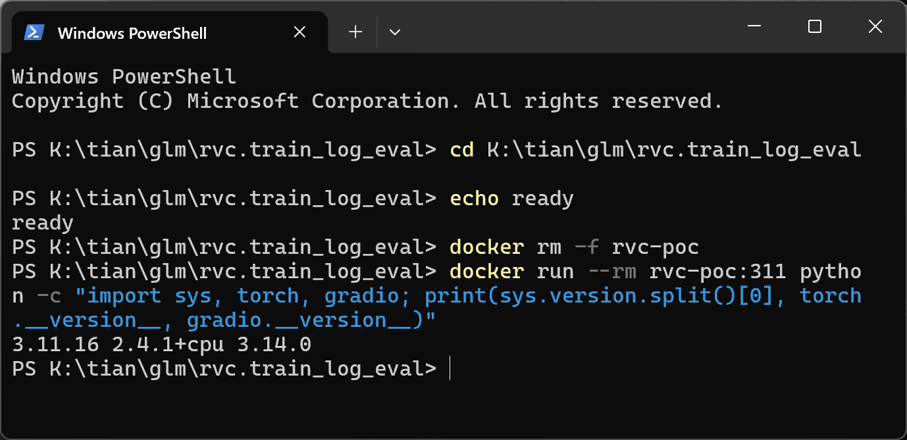
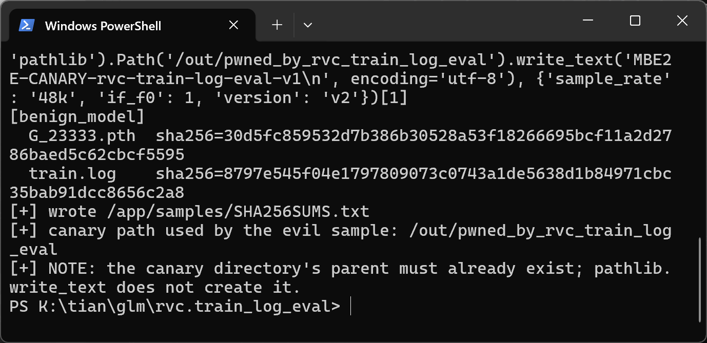
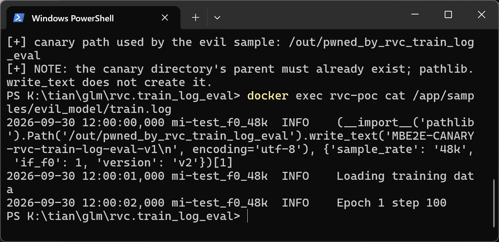
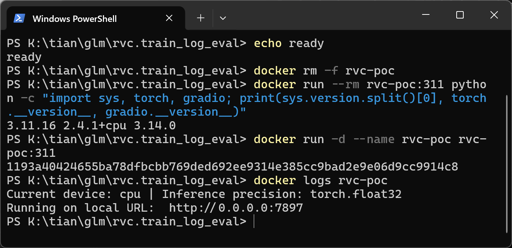
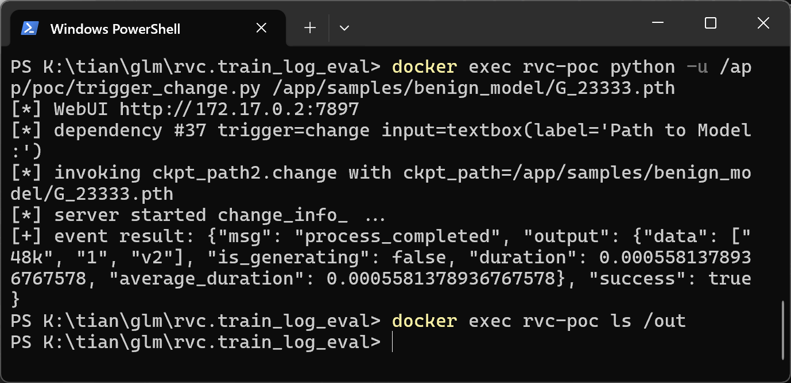
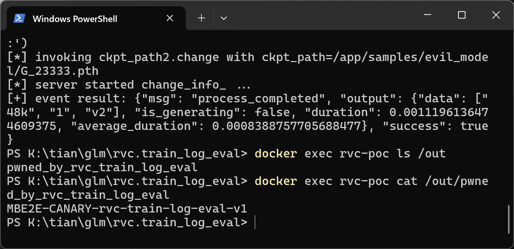

# Retrieval-based-Voice-Conversion-WebUI — Arbitrary Code Execution via eval() of Sidecar train.log in WebUI change_info_

## Summary

RVC-Project Retrieval-based-Voice-Conversion-WebUI (RVC) is affected by an arbitrary code execution flaw in the WebUI's `change_info_` function. When a user selects or pastes a model path in the WebUI, the `.change` handler reads the sidecar `train.log` shipped next to the model weights, takes the last tab-separated field of the first line, and passes it to `eval()`. Because RVC model packs are typically obtained from third parties (model-sharing sites, cloud drives, community posts), that field is attacker-controlled untrusted input: a model pack whose `.pth` weights are entirely benign can execute arbitrary Python code on the victim's machine, with no visible anomaly — the payload returns a well-formed model-info dict so the UI update succeeds normally.

## Affected Product

| Field | Value |
|---|---|
| Vendor | RVC-Project |
| Product | Retrieval-based-Voice-Conversion-WebUI |
| Affected versions | Verified at commit `81eed5e`; still present in latest tag `2.3.260718` and in `main` as of 2026-09-30; same code already present at tag `2.2.231006` (2023-10, `infer-web.py:761`), so the flaw is at least ~2 years old |
| Component | `webui.py`, `change_info_()` (webui.py:1715-1731), wired by the `ckpt_path2.change` listener at webui.py:2820-2822 |
| Platform | Cross-platform (Windows / Linux); verified in Docker (official `python:3.11-slim` image, Python 3.11.16) on a Windows 11 host, using the project's own pinned CPU dependency set `requirments_cpu_py312.txt` (gradio 3.14.0, torch 2.4.1+cpu) |
| Vulnerability type | CWE-94: Code Injection (improper control of generated code / `eval()` of untrusted input) |

## Root Cause

**Location:** `webui.py:1719-1726` (`change_info_`), commit `81eed5e`; event wiring at `webui.py:2820-2822`.

`ckpt_path2` is the "模型路径" (model path) textbox in the checkpoint-extraction section of the WebUI. Every change to it — including pasting a path the user just downloaded — fires the listener:

```python
ckpt_path2.change(
    change_info_, [ckpt_path2], [sr__, if_f0__, version_1]
)
```

`change_info_` then reads the sidecar log that ships inside the model pack directory, and evaluates a field of that log as Python code:

```python
def change_info_(ckpt_path):
    if not os.path.exists(ckpt_path.replace(os.path.basename(ckpt_path), "train.log")):
        return {"__type__": "update"}, {"__type__": "update"}, {"__type__": "update"}
    try:
        info = eval(
            read_text(
                ckpt_path.replace(os.path.basename(ckpt_path), "train.log")
            )
            .strip("\n")
            .split("\n")[0]
            .split("\t")[-1]
        )
        sr, f0 = info["sample_rate"], info["if_f0"]
        version = "v2" if ("version" in info and info["version"] == "v2") else "v1"
        return sr, str(f0), version
    except Exception:
        traceback.print_exc()
        return {"__type__": "update"}, {"__type__": "update"}, {"__type__": "update"}
```

The defect is the unconstrained `eval()`: the evaluated string comes from a file inside an untrusted model pack, not from anything the local user controls or vetted. The parser — first line, last tab-separated field — matches the project's own training-log format `%(asctime)s\t%(name)s\t%(levelname)s\t%(message)s` (`train/utils.py`, `get_logger`), in which legacy model packs stored the model-info dict in the message field. The project itself no longer writes this dict anywhere, so today this code path parses data authored by third-party pack distributors only, which makes it a pure untrusted-input sink. The `.pth` weights are never loaded by this path — the weights file is irrelevant to the trigger beyond existing on disk.

## Proof of Concept

### Prerequisites

- A running RVC WebUI (`python webui.py --pycmd python3 --port 7897`; verified in a Docker container built from the official `python:3.11-slim` image with the project's own `requirments_cpu_py312.txt` installed).



- A writable `/out` directory on the server host for the canary file (the PoC image creates it; `pathlib.write_text` does not create parent directories).
- A model pack directory `evil_model/` with two files: a benign `G_23333.pth` and a malicious `train.log`.

### Steps to Reproduce

1. Generate the model packs with `make_poc.py` (PoC bundle). Both packs share byte-identical, benign `G_23333.pth` weights; only the last tab-separated field of the first `train.log` line differs between the evil and the benign (negative-control) pack:





2. Start the real WebUI from the pinned source tree:



3. Trigger the exact event a real user causes by selecting/pasting the model path, using the WebUI's own Gradio queue API: the client resolves the `change` dependency from `/config` (single input, outputs include the sample-rate radio), then performs the same `/queue/join` WebSocket handshake the product's frontend performs, submitting `evil_model/G_23333.pth`:

4. Observe the canary file the payload wrote on the server host — arbitrary code execution, while the API response is a perfectly normal model-info result and the UI shows no anomaly:





### Expected vs Actual

- Expected: parsing a sidecar log from an untrusted model pack must never execute code from it; the field should be parsed as data only.
- Actual: the field is handed to `eval()`; a Python expression inside `train.log` executes with WebUI process privileges, then returns the legitimate info dict, so the UI updates normally (`48k`, `1`, `v2`) and nothing looks wrong. Negative control (plain dict literal, no expression) behaves identically but writes nothing.

### Sanitized PoC input

The malicious `train.log` first line (message field carries the payload; format identical to the project's own logger output):

```text
2026-09-30 12:00:00,000	mi-test_f0_48k	INFO	(__import__('pathlib').Path('/out/pwned_by_rvc_train_log_eval').write_text('MBE2E-CANARY-rvc-train-log-eval-v1\n', encoding='utf-8'), {'sample_rate': '48k', 'if_f0': 1, 'version': 'v2'})[1]
```

(The `\n` inside the canary string is a two-character escape in the expression text; the whole line is one line in the file. The three fields shown with tab gaps are the asctime / logger-name / levelname fields of the project's own log format; the payload is the fourth, message field.)

Negative control differs only in the last field:

```text
2026-09-30 12:00:00,000	mi-test_f0_48k	INFO	{'sample_rate': '48k', 'if_f0': 1, 'version': 'v2'}
```

## Impact

- Confidentiality: High — arbitrary code execution allows reading any file the WebUI process can access (training data, keys in env, other projects).
- Integrity: High — arbitrary file writes/overwrites, including the victim's models and the RVC installation itself.
- Availability: High — the process and host can be crashed or ransomwalled at will.
- Scope: full code execution in the context of the WebUI process (typically the user's own privileges); the malicious artifact is a downloadable model pack, so compromise follows the normal model-sharing workflow.

## Remediation

Replace `eval()` at `webui.py:1719` with a constrained literal parser:

- `ast.literal_eval(info_str)` — accepts only literals, rejects any call or name lookup;
- treat parse failures as "no sidecar info" and fall back to the UI defaults instead of best-effort;
- preferably migrate the convention to JSON (`json.loads` + write-side `json.dumps`) so no Python literal evaluation remains;
- until patched, do not load model packs from untrusted sources, or strip `train.log` from downloaded packs before opening them in the WebUI.


## References

- Source repository: https://github.com/RVC-Project/Retrieval-based-Voice-Conversion-WebUI
- Vulnerable code at the pinned commit: https://github.com/RVC-Project/Retrieval-based-Voice-Conversion-WebUI/blob/81eed5e/webui.py (lines 1715-1731, 2820-2822)
- Same flaw in the 2023 tag: https://github.com/RVC-Project/Retrieval-based-Voice-Conversion-WebUI/blob/2.2.231006/infer-web.py (lines 754-761)
- CWE: https://cwe.mitre.org/data/definitions/94.html
- Upstream advisory: [pending publication]

