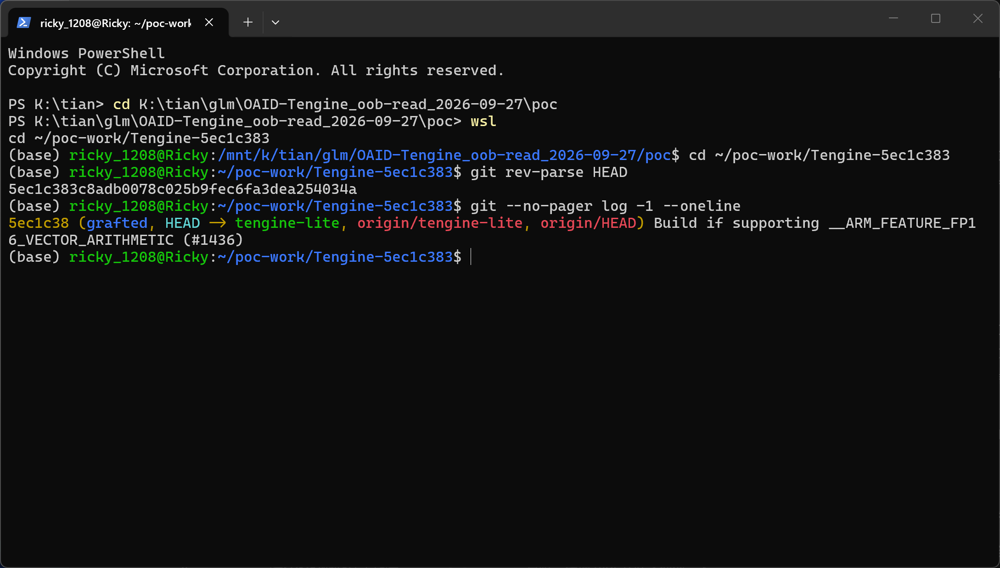
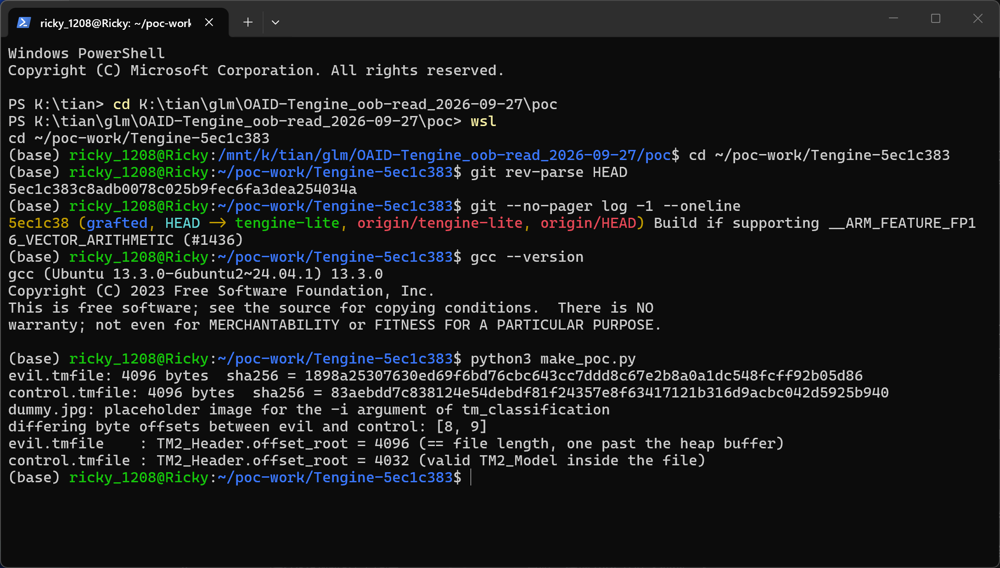
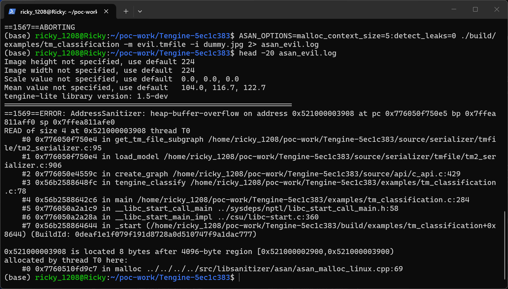
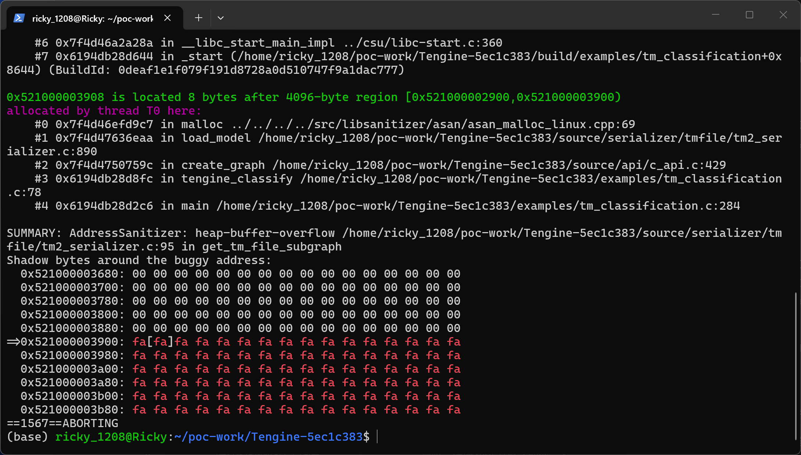
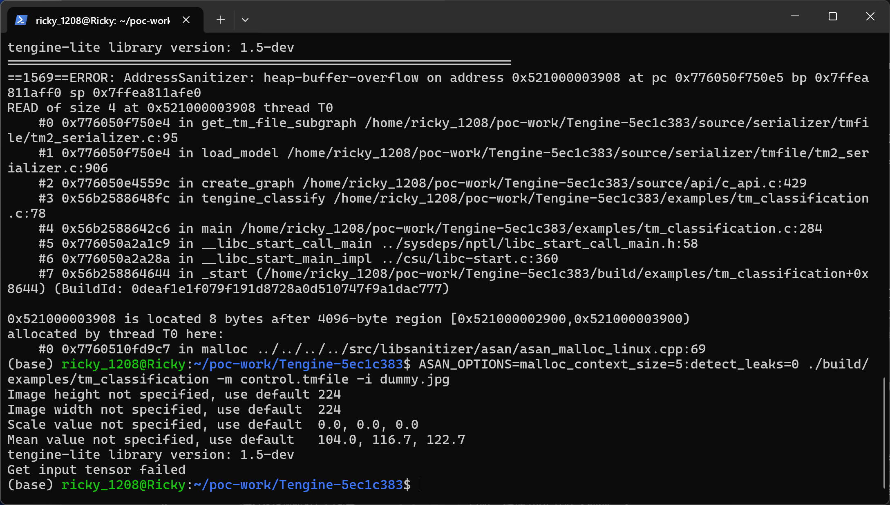

# Tengine (Tengine-Lite) master @ 5ec1c383 — Heap Out-of-bounds Read in the tmfile Model Loader

## Summary

OPEN AI LAB Tengine (Tengine-Lite, github.com/OAID/Tengine) is affected by a heap-based out-of-bounds read (CWE-125) in its native model file (.tmfile) serializer. The loader allocates a heap buffer of exactly the model file's size, then forms pointers to the file's internal tables by blindly adding 32-bit offsets taken from the untrusted file to the buffer base — the recorded buffer length (`priv->mem_len`) is never used to validate any offset. A crafted .tmfile whose `TM2_Header.offset_root` equals the file length makes the loader build a `TM2_Model *` that points exactly at the end of the heap buffer and dereference it before the only version check in the loading path. Any application that loads an attacker-supplied model file (e.g. the README example `tm_classification -m <file>`, or any user of `create_graph()` / `load_mem()`) is affected.

## Affected Product

| Field | Value |
|---|---|
| Vendor | OPEN AI LAB (GitHub org `OAID`) |
| Product | Tengine (Tengine-Lite inference engine) |
| Affected versions | master branch commit `5ec1c383c8adb0078c025b9fec6fa3dea254034a` (latest commit at analysis time, dated 2024-09-15); the repository carries no release tags, so all current code is affected |
| Component | `source/serializer/tmfile/tm2_serializer.c` — `load_model()`, `load_mem()`, `get_tm_file_model()`, `get_tm_file_subgraph()` |
| Platform | Platform-independent C; PoC verified on Linux x86_64 (Ubuntu 24.04 on WSL2, GCC 13.3.0, CMake 3.28.3, AddressSanitizer) |
| Vulnerability type | CWE-125: Out-of-bounds Read (heap-buffer-overflow READ) |

## Root Cause

**Location:** `source/serializer/tmfile/tm2_serializer.c:88-98` (`get_tm_file_model()` / `get_tm_file_subgraph()`), reached from `load_model()` at `source/serializer/tmfile/tm2_serializer.c:865-913`

`load_model()` reads the whole .tmfile into a heap buffer sized exactly to the file, records the length in `priv->mem_len`, and then derives three table pointers purely by offset arithmetic. `priv->mem_len` is stored but never consulted by any check:

```c
/* source/serializer/tmfile/tm2_serializer.c:890-906 (load_model) */
void* mem_base = (void*)sys_malloc(file_len);
int ret = read(fd, mem_base, file_len);
...
priv->mem_len = file_len;                            /* recorded, but never used for validation */

priv->header  = get_tm_file_header((const char*)mem_base);
priv->model   = get_tm_file_model((const char*)mem_base, priv->header);
priv->subgraph = get_tm_file_subgraph((const char*)mem_base, priv->model);
```

```c
/* source/serializer/tmfile/tm2_serializer.c:88-98 */
static inline const TM2_Model* get_tm_file_model(const char* base, const TM2_Header* header)
{
    /* header->offset_root is an unvalidated uint32_t straight from the file */
    return (const TM2_Model*)(base + header->offset_root);
}

static inline const TM2_Subgraph* get_tm_file_subgraph(const char* base, const TM2_Model* model)
{
    const TM2_Vector_offsets* v_graphs = (TM2_Vector_offsets*)(base + model->offset_vo_subgraphs);
    const TM2_Subgraph* tm_graph = (TM2_Subgraph*)(base + v_graphs->offsets[0]);
    return tm_graph;
}
```

The only version check in the loading path — `priv->header->ver_main != TM2_FILE_VER_MAIN` at `source/serializer/tmfile/tm2_serializer.c:840` inside `load_graph()` — runs at line 912, i.e. strictly *after* `get_tm_file_subgraph()` has already dereferenced `model->offset_vo_subgraphs`. There is also no file-magic check anywhere in the serializer, so nothing stops a file with arbitrary `main_type`/`sub_type` bytes from reaching this code. The in-memory variant `load_mem()` (lines 915-935) performs the identical unchecked arithmetic on a caller-provided buffer and is affected the same way.

Concretely: a 4096-byte file with `TM2_Header.offset_root = 4096` (= the file length) makes `get_tm_file_model()` return `(TM2_Model*)(mem_base + 4096)` — a pointer exactly at the end of the 4096-byte allocation. The subsequent read of `model->offset_vo_subgraphs` (struct offset +8) reads 4 bytes at `mem_base + 4104`, which AddressSanitizer reports as a heap-buffer-overflow READ of size 4 located 8 bytes after the 4096-byte region. Because every table pointer in this format is built the same way, any out-of-range offset in any table produces the same class of wild-pointer dereference; `offset_root` is simply the first one reached.

## Proof of Concept

### Prerequisites

- Tengine pinned at commit `5ec1c383c8adb0078c025b9fec6fa3dea254034a` (PoC tree in `poc/Tengine-5ec1c383/`).
- A build with AddressSanitizer: `cmake -DCMAKE_C_FLAGS="-fsanitize=address -g -O1 -fno-omit-frame-pointer" -DCMAKE_CXX_FLAGS="-fsanitize=address -g -O1 -fno-omit-frame-pointer" -DCMAKE_EXE_LINKER_FLAGS="-fsanitize=address" ..` followed by `make -j`. The `tm_classification` example is built by default (binary at `build/examples/tm_classification`).
- `poc/make_poc.py` (Python 3, no third-party dependencies) generates the two 4096-byte samples plus a placeholder image.
- Verified environment: Ubuntu 24.04 on WSL2, GCC 13.3.0, CMake 3.28.3 (2026-09-27).

### Steps to Reproduce

1. Build the pinned source with AddressSanitizer as shown above.

2. Generate the samples: `python3 make_poc.py`. It writes `evil.tmfile` and `control.tmfile`, which are byte-identical except for the two low bytes of `TM2_Header.offset_root` (file offsets 8-9: `0x00100000` = 4096 for evil vs `0x0fc00000` = 4032 for control, little-endian).


The reproduction runs against the exact upstream commit `5ec1c383c8adb0078c025b9fec6fa3dea254034a` (latest master, 2024-09-15).


`make_poc.py` prints both sample SHA256 hashes and confirms the two files differ only at byte offsets 8 and 9 — evil sets `offset_root = 4096` (== file length), control sets `offset_root = 4032` (a valid `TM2_Model` inside the file).

3. Run the README example against the evil sample: `ASAN_OPTIONS=malloc_context_size=5:detect_leaks=0 ./build/examples/tm_classification -m evil.tmfile -i dummy.jpg`. The loader aborts during `create_graph()` before any image is touched.


AddressSanitizer reports `heap-buffer-overflow`, `READ of size 4` at `get_tm_file_subgraph()` (`tm2_serializer.c:95`) called from `load_model()` (`tm2_serializer.c:906`), and locates the address as `8 bytes after 4096-byte region` — the buffer allocated by `sys_malloc(file_len)` at `tm2_serializer.c:890`.


The same crash in the live terminal: `SUMMARY: AddressSanitizer: heap-buffer-overflow ... tm2_serializer.c:95 in get_tm_file_subgraph`, the redzone shadow bytes behind the 4096-byte region, and `==1567==ABORTING`.

4. Negative control: run the same binary on the control sample: `ASAN_OPTIONS=malloc_context_size=5:detect_leaks=0 ./build/examples/tm_classification -m control.tmfile -i dummy.jpg`. Here `offset_root` points at a structurally valid `TM2_Model` inside the file, so every pointer the loader forms stays within the allocation; the graph loads as an empty graph, the example prints its ordinary `Get input tensor failed` error and exits — no sanitizer report of any kind. (With LeakSanitizer enabled the example additionally reports leaked graph allocations on this error path — an unrelated hygiene issue of the example app, suppressed here with `detect_leaks=0`.)


The control sample terminates gracefully (`Get input tensor failed`) with no AddressSanitizer report, confirming the crash is caused solely by the unvalidated `offset_root`.

### Expected vs Actual

- Expected: the loader rejects a file whose root offset points outside the file (e.g. `offset_root + sizeof(TM2_Model) > file_len`) with a validation error.
- Actual: the loader dereferences `mem_base + offset_root` and reads past the end of the heap allocation; under AddressSanitizer the process aborts with `heap-buffer-overflow ... READ of size 4 ... 0x521000003908 is located 8 bytes after 4096-byte region`. The crash happens before the version check at line 840 is ever reached.

### Sanitized PoC input

No sensitive values are involved; the samples are fully synthetic files produced by `poc/make_poc.py`.

| Sample | SHA256 | `TM2_Header.offset_root` |
|---|---|---|
| `evil.tmfile` | `1898a25307630ed69f6bd76cbc643cc7ddd8c67e2b8a0a1dc548fcff92b05d86` | 4096 (== file length) |
| `control.tmfile` | `83aebdd7c838124e54debdf81f24357e8f63417121b316d9acbc042d5925b940` | 4032 (valid `TM2_Model` inside the file) |

Both files are exactly 4096 bytes and differ only at byte offsets 8 and 9 (the two low bytes of `offset_root`). File layout of the control: `TM2_Header` @ 0 (`ver_main = 2`, `offset_root = 4032`), `TM2_Vector_offsets {v_num=1, offsets[0]=3872}` @ 2016, empty `TM2_Vector_offsets {v_num=0}` @ 2048, `TM2_Subgraph` @ 3872 (all vector fields pointing at the empty vector @ 2048), `TM2_Model {offset_vo_subgraphs = 2016}` @ 4032.

## Impact

- Confidentiality: High — the out-of-bounds values read past the buffer are attacker-steered offsets that drive further parsing; heap memory adjacent to the model buffer is read and its values flow into the in-memory graph (names, indices, tensor metadata), so information from outside the file can enter the application. (This is a conservative rating; the PoC demonstrates the read itself, not an end-to-end leak.)
- Integrity: None — no write primitive is involved in this defect.
- Availability: High — the wild-pointer dereference reliably crashes the loading process (ASan abort; native builds segfault on the subsequent out-of-range accesses).
- Scope: memory corruption during model loading / potential adjacent-heap information disclosure / denial of service of any application loading the crafted model.


## Remediation

Treat `priv->mem_len` as the bound it already is: before every pointer formation in the serializer, check that the offset plus the minimum size of the referenced structure lies within the buffer, and fail closed otherwise. At minimum, in `get_tm_file_model()` reject `header->offset_root + sizeof(TM2_Model) > priv->mem_len`, and in `get_tm_file_subgraph()` reject `model->offset_vo_subgraphs + sizeof(TM2_Vector_offsets) > priv->mem_len` before dereferencing, then continue this pattern for every table offset in `tm2_format.h` (subgraph, node, tensor, vector, string, buffer offsets). The same checks must be added to the `load_mem()` path, which currently shares the unchecked arithmetic on a caller-provided buffer. Optionally also validate the file magic before dispatching to the serializer.


## References

- Source repository: https://github.com/OAID/Tengine
- Vulnerable code (pinned commit): https://github.com/OAID/Tengine/blob/5ec1c383c8adb0078c025b9fec6fa3dea254034a/source/serializer/tmfile/tm2_serializer.c#L88-L98
- Loading path (pinned commit): https://github.com/OAID/Tengine/blob/5ec1c383c8adb0078c025b9fec6fa3dea254034a/source/serializer/tmfile/tm2_serializer.c#L865-L913
- Upstream report: [pending publication]
- CWE: https://cwe.mitre.org/data/definitions/125.html
- Vendor advisory: [none]
