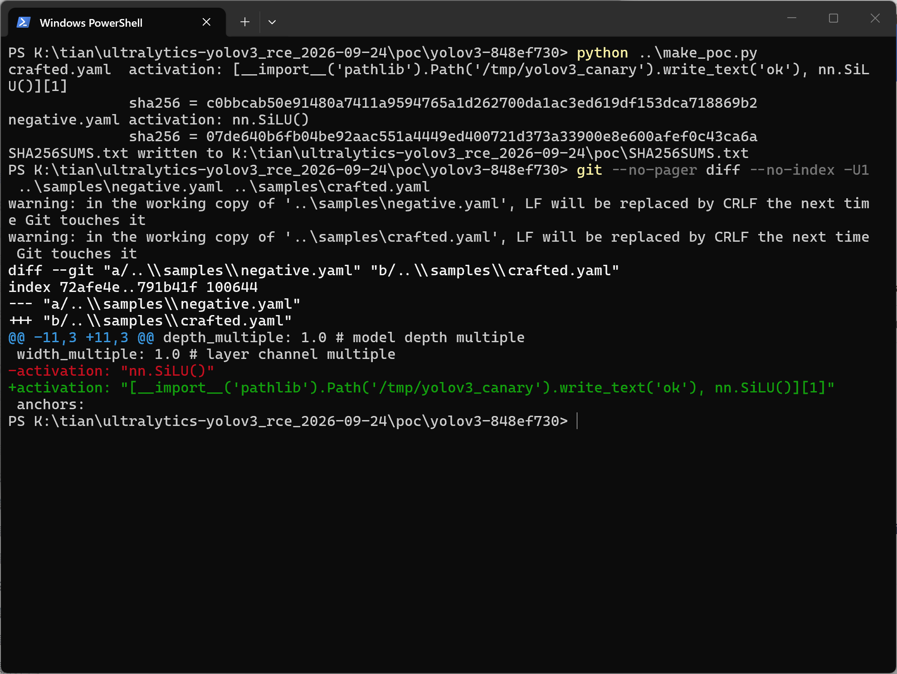
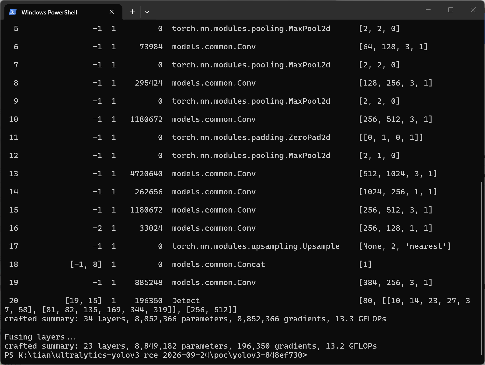
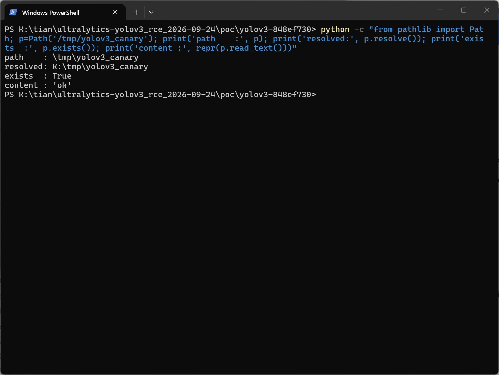
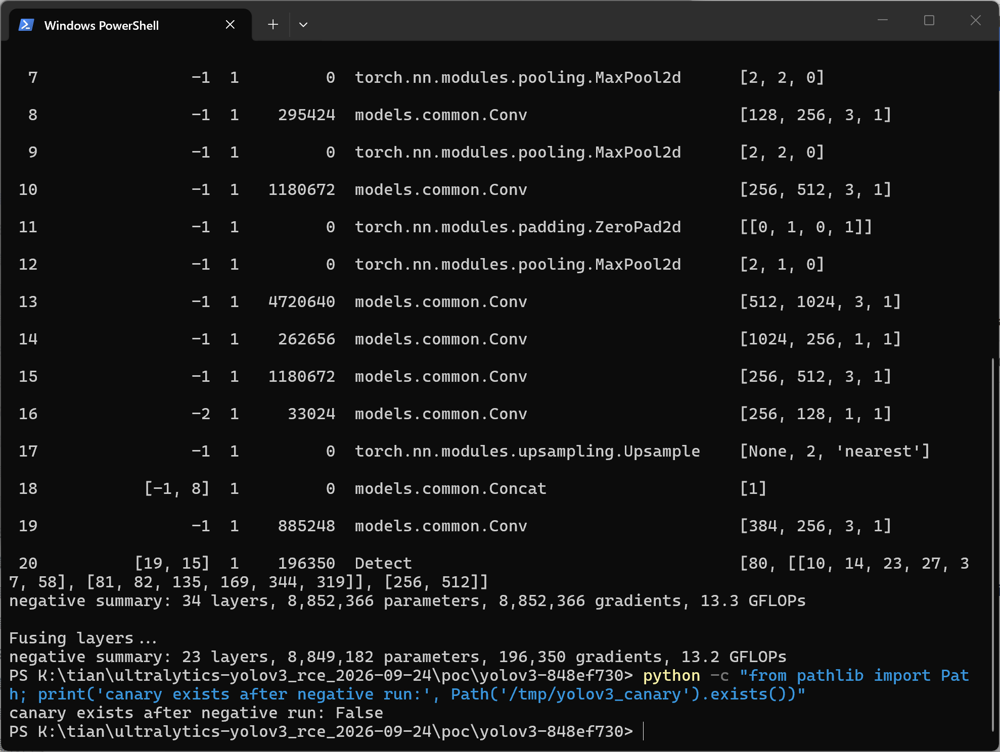

# Ultralytics YOLOv3 (master commit 848ef730) — Arbitrary Code Execution via eval() of the YAML `activation` Field in parse_model

## Summary

Ultralytics YOLOv3 is affected by arbitrary Python code execution through the top-level `activation` key of a model-definition YAML file. Although the configuration is loaded with `yaml.safe_load()` (which returns plain strings and cannot instantiate objects), `parse_model()` passes the `activation` string directly to `eval()` and uses its return value as the default activation module for all `Conv` layers. An attacker who can make a victim build a model from a crafted YAML (e.g. a model config shared in a paper repository, model zoo, or chat message) executes arbitrary Python code with the victim's privileges. A stealth payload returns a genuine `nn.SiLU()` instance, so model construction completes normally and the victim observes no anomaly.

## Affected Product

| Field | Value |
|---|---|
| Vendor | Ultralytics |
| Product | YOLOv3 (`ultralytics/yolov3`) |
| Affected versions | Commits from `cac7189c3e11de563056e2db08012c2c12b30789` (2024-01-03) through current master `848ef730a20a78d7b7754b80f5e744df4c01bdc8` (2026-09-10, HEAD at time of reporting); no fixed version yet |
| Not affected | Release v9.6.0 (2021-11-14) and commits up to `251ea948e4d7` (2023-08-01) |
| Component | `models/yolo.py`, function `parse_model()`, lines 311–314 |
| Platform | OS-independent (Python + PyTorch; verified on CPU device) |
| Vulnerability type | CWE-94: Improper Control of Generation of Code (Code Injection); related CWE-95 (Eval Injection) |

## Root Cause

**Location:** `models/yolo.py:311-314` (`parse_model()`)

`parse_model()` reads the model dictionary produced by `yaml.safe_load()` and evaluates the `activation` value as a Python expression before any module whitelist check runs:

```python
anchors, nc, gd, gw, act = d["anchors"], d["nc"], d["depth_multiple"], d["width_multiple"], d.get("activation")
if act:
    Conv.default_act = eval(act)  # redefine default activation, i.e. Conv.default_act = nn.SiLU()
    LOGGER.info(f"{colorstr('activation:')} {act}")  # print
```

The value is fully attacker-controlled whenever the YAML file comes from an external source. `yaml.safe_load()` is not a mitigation here: it correctly returns a plain string, and the code then executes that string with `eval()` anyway. Because `models/yolo.py` imports `from torch import nn` at module top, the evaluated expression can reference the whole `torch.nn` namespace, and `__import__` grants access to any installed module.

Note: `parse_model()` also calls `eval()` on `backbone`/`head` module and argument strings (`models/yolo.py:320` and `:323`). This report is scoped to the top-level `activation` sink; the sibling sinks deserve the same hardening.

## Proof of Concept

### Prerequisites

- A checkout of `ultralytics/yolov3` (master, commit `848ef730`). Python dependencies per `requirements.txt`; at this commit the repository also imports the `ultralytics` pip package (reproduction used ultralytics 8.4.161 with torch 2.12.0+cpu on Python 3.13.5 — PyTorch CPU is sufficient).

- The attacker only needs to place one crafted YAML file where the victim will use it as `--cfg`.

  

### Steps to Reproduce

1. Copy `models/yolov3-tiny.yaml` to `crafted.yaml`. Leave `nc`, `anchors`, `backbone`, and `head` untouched; add ONE top-level line:

   ```yaml
   activation: "[__import__('pathlib').Path('/tmp/yolov3_canary').write_text('ok'), nn.SiLU()][1]"
   ```

   (Any writable path works. The expression writes a canary file as a side effect and returns `nn.SiLU()` — index `[1]` of the list — so that model construction continues normally.)



*Figure 1: `make_poc.py` output and a `git diff` of the two samples. Both samples are byte-identical to `models/yolov3-tiny.yaml` except the one `activation` key: the negative control `negative.yaml` carries the benign `activation: "nn.SiLU()"` (removed line, red), while `crafted.yaml` carries the payload (added line, green); SHA-256 hashes for both are shown.*

2. Build the model from the crafted config:

   ```bash
   python models/yolo.py --cfg crafted.yaml --device cpu
   ```

   `parse_model()` evaluates the `activation` expression at this point, before any module whitelist check.



*Figure 2: tail of the malicious run in a live PowerShell session — the model table, `crafted summary: 34 layers, 8,852,366 parameters, 8,852,366 gradients, 13.3 GFLOPs`, layer fusion and the second `crafted summary: 23 layers, ...` all print normally, and the PowerShell prompt returns without any error or traceback: the payload returned a genuine `nn.SiLU()`, so construction completed as if nothing had happened.*

3. Verify the side effect: the canary file now exists and the model has built normally with the returned activation module.



*Figure 3: the canary file exists (`exists : True`) with content `'ok'`, at the resolved path `K:\tmp\yolov3_canary` (native-Windows resolution of `/tmp/...`; on Linux this is `/tmp/yolov3_canary`).*

4. Negative control: run the byte-identical sample whose `activation` key holds the benign `nn.SiLU()` instead of the payload. The model builds the same way, but no canary file is written.



*Figure 4: the negative-control run builds normally (`negative summary: 34 layers, ...` / `negative summary: 23 layers, ...`) and afterwards `canary exists after negative run: False` — the canary in Figure 3 is caused solely by the malicious `activation` expression.*

### Expected vs Actual

- Expected: the config parser only selects an activation module by name; config values never execute as Python code.
- Actual: the `activation` string is executed as a Python expression with the user's privileges. With the payload above, `/tmp/yolov3_canary` is written while the model summary prints normally (no error, no traceback).

### Sanitized PoC input

```yaml
# crafted.yaml = models/yolov3-tiny.yaml + the following top-level line (all other keys unchanged)
activation: "[__import__('pathlib').Path('/tmp/yolov3_canary').write_text('ok'), nn.SiLU()][1]"
```

No secrets, hosts, or personal paths are involved; the canary path is a placeholder and can be any writable location.

## Impact

- Confidentiality: High — arbitrary code execution exposes files, credentials, and data accessible to the user running the model build.
- Integrity: High — attacker code can create, modify, or delete files (the PoC demonstrates arbitrary file write via the canary).
- Availability: High — attacker code can crash the process or compromise the environment (e.g. poisoning training artifacts).
- Scope: arbitrary Python code execution in the victim's build environment. Every entry point that instantiates `Model()` from a YAML config is exposed (`models/yolo.py`, `train.py`, `val.py`, `detect.py`, `export.py`).

## Attack Vector and Severity (CVSS v3.1)

| Metric | Value | Rationale |
|---|---|---|
| Attack Vector | N (Network) | Crafted configs are typically distributed remotely (repo, model zoo, chat); no special network position needed |
| Attack Complexity | L (Low) | No special conditions; stock repo, CPU-only environment reproduces it |
| Privileges Required | N (None) | The attacker needs no account on the victim machine; only distribution of the config file |
| User Interaction | R (Required) | The victim must run model construction with the crafted YAML |
| Scope | U (Unchanged) | Impact is confined to the victim's process/user security context |
| Confidentiality | H (High) | Full code execution ⇒ full read access |
| Integrity | H (High) | Full code execution ⇒ arbitrary file write/modify |
| Availability | H (High) | Full code execution ⇒ process compromise/crash |

```
Score: 8.8 (High)
Vector: CVSS:3.1/AV:N/AC:L/PR:N/UI:R/S:U/C:H/I:H/A:H
```

> Assumption: the CVSS model assumes the documented threat scenario — a user is persuaded to build a model from an attacker-supplied model YAML. If the deployment only ever loads local, trusted configs, the practical severity is lower; the code defect itself is unambiguous.

## Remediation

Do not `eval()` configuration values. Map known activation names through a fixed whitelist and reject unknown values, e.g.:

```python
_ACTS = {"silu": nn.SiLU, "relu": nn.ReLU, "lrelu": nn.LeakyReLU, "leaky_relu": nn.LeakyReLU}
Conv.default_act = _ACTS.get(str(act).strip().lower(), nn.SiLU)()
```

The same treatment should be applied to the sibling `eval()` calls on `backbone`/`head` module and argument strings (`models/yolo.py:320`, `:323`).

Workaround until patched: only build models from trusted, reviewed YAML files; treat any `activation:` value containing parentheses/imports as malicious (the evaluated expression is also echoed in the `activation:` log line, which aids detection).


## References

- Source repository: <https://github.com/ultralytics/yolov3>
- Vulnerable code (master): <https://github.com/ultralytics/yolov3/blob/848ef730a20a78d7b7754b80f5e744df4c01bdc8/models/yolo.py#L311-L314>
- First vulnerable commit: `cac7189c3e11de563056e2db08012c2c12b30789` (2024-01-03)
- Upstream report: [pending publication]
- CWE: <https://cwe.mitre.org/data/definitions/94.html>
