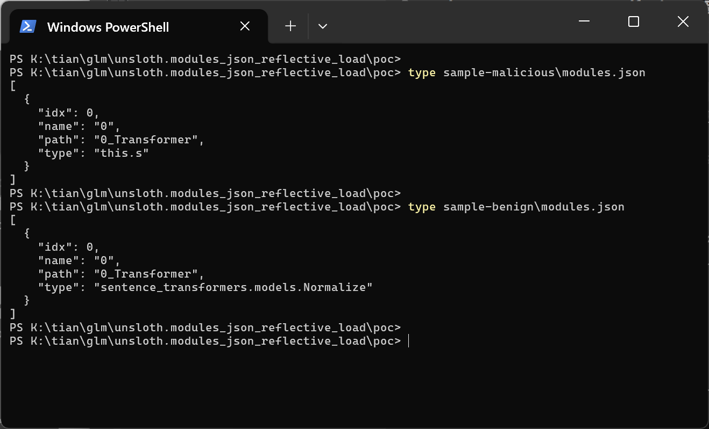
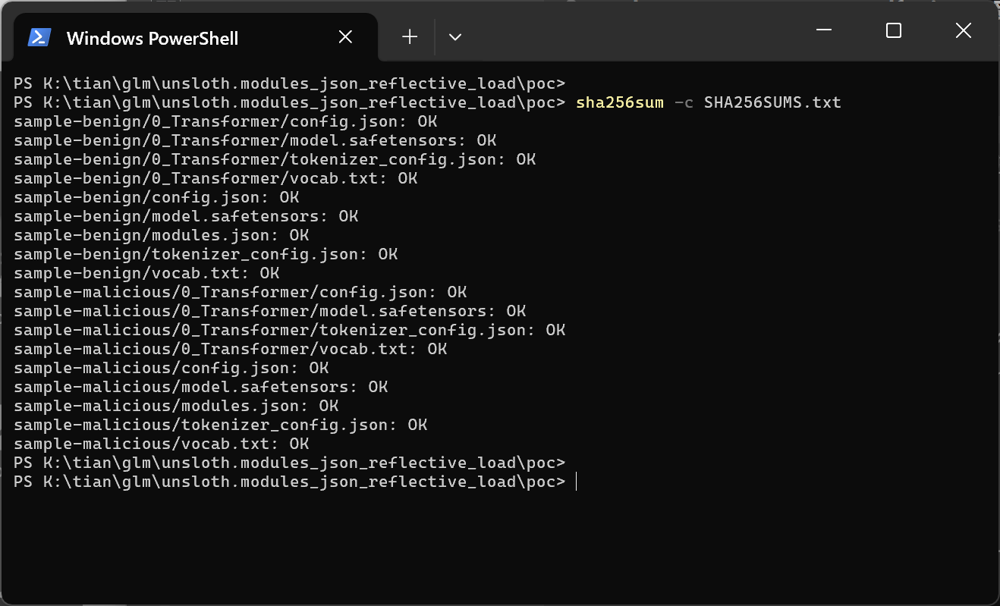
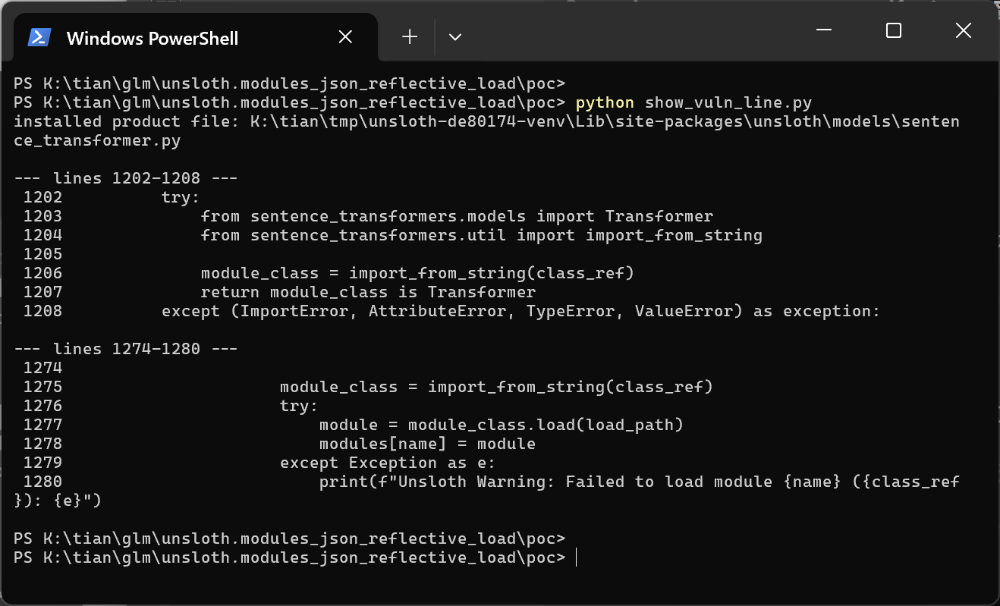
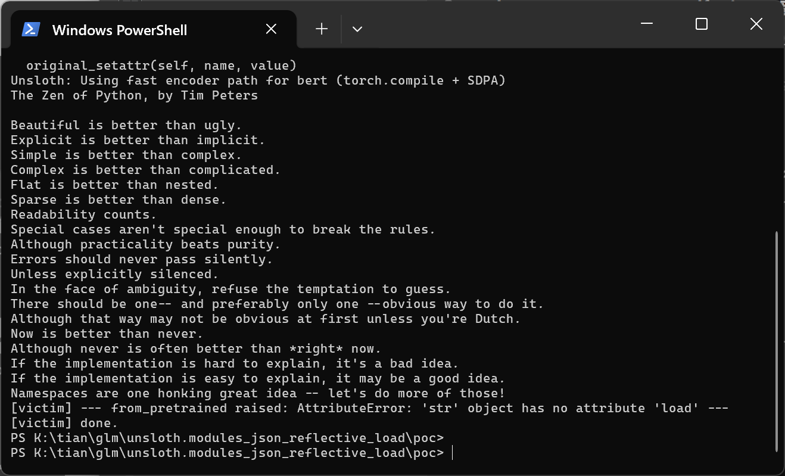
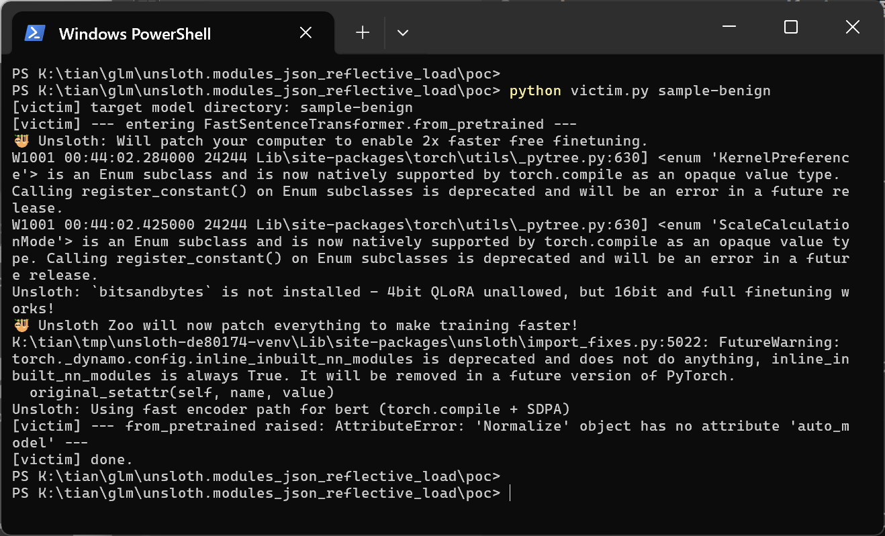
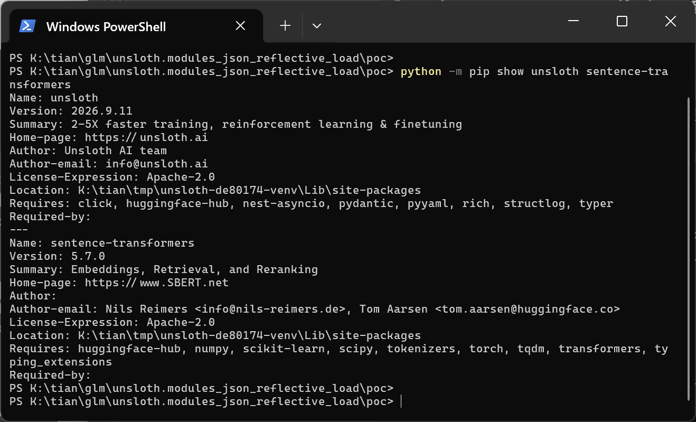
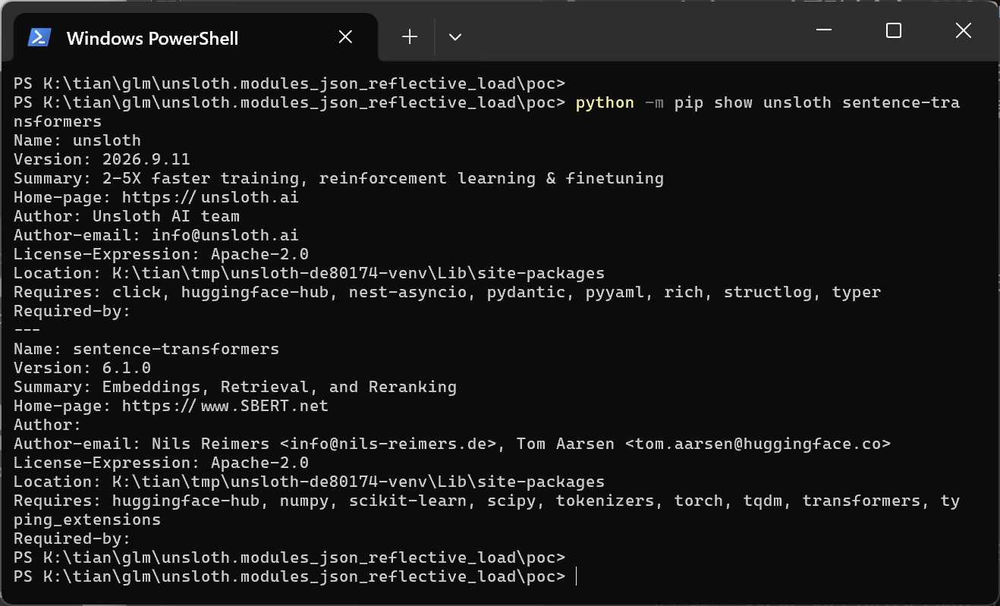
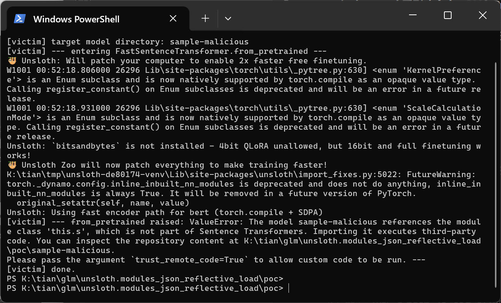
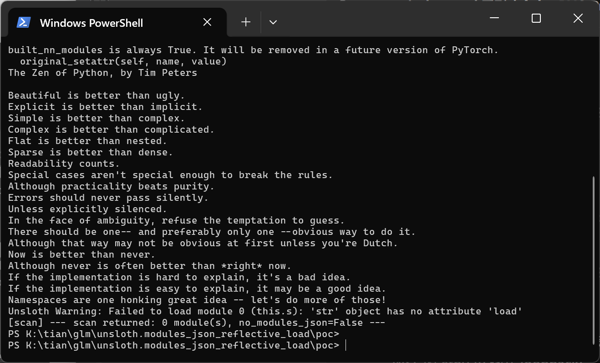
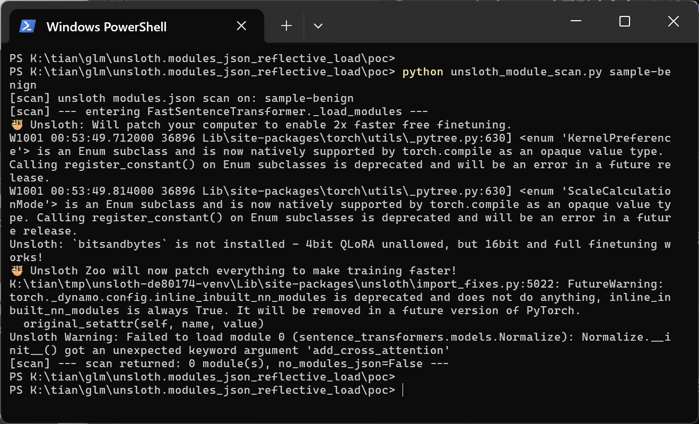

# Unsloth 2026.9.11 — Unsafe Reflection in FastSentenceTransformer modules.json Handling

## Summary

Unsloth 2026.9.11 (git commit `de801746386a53a0cb26216e715a0af863b76ad9`) is affected by an unsafe-reflection defect in the `FastSentenceTransformer` embedding-model loading component. The `type` field of a model directory's `modules.json` is passed unvalidated to `sentence_transformers.util.import_from_string`, which imports the named module in the Unsloth process; any code at the target module's top level therefore executes while the product opens a model for training. Exploitation requires only a crafted model directory (for example one downloaded from a model hub or received from a third party) and no Python sidecar file inside the model: the imported target only has to resolve in the victim's already-installed environment. A bundled guard in sentence-transformers itself (6.0+) refuses exactly this input, but Unsloth's own scan bypasses the guard by calling the lower-level `import_from_string` directly.

## Affected Product

| Field | Value |
|---|---|
| Vendor | Unsloth AI (unslothai) |
| Product | Unsloth |
| Affected versions | 2026.9.11, git commit `de801746386a53a0cb26216e715a0af863b76ad9` (latest main at time of analysis); earlier versions introducing `unsloth/models/sentence_transformer.py` likely affected [unknown] |
| Component | `unsloth/models/sentence_transformer.py` — `FastSentenceTransformer._is_transformer_module_ref` and `FastSentenceTransformer._load_modules`, called by `FastSentenceTransformer.from_pretrained` |
| Platform | OS-independent (verified on Windows 11 x64, Python 3.13.5, CPU-only host, torch 2.14.0+cpu) |
| Vulnerability type | CWE-470: Use of Externally-Controlled Input to Select Classes or Code ('Unsafe Reflection') |

## Root Cause

**Location:** `unsloth/models/sentence_transformer.py:1242` (attacker value enters), `:1206` and `:1275` (reflective import), `:1277` (call on the imported object), call site `:1836`.

`FastSentenceTransformer.from_pretrained` loads the model directory for embedding training and delegates module assembly to `_load_modules`, which reads `modules.json` as plain JSON and takes each entry's `type` string as a class reference:

```python
# unsloth/models/sentence_transformer.py (commit de80174)
modules_config = json.load(f)              # line 1239
for module_config in modules_config:
    class_ref = module_config["type"]      # line 1242 — attacker-controlled JSON leaf
```

The string is then reflectively imported twice — first by the classification helper, then again in the non-Transformer branch, where the loaded object is even invoked:

```python
# _is_transformer_module_ref, lines 1202-1207
try:
    from sentence_transformers.models import Transformer
    from sentence_transformers.util import import_from_string

    module_class = import_from_string(class_ref)   # line 1206 — import side effects run here
    return module_class is Transformer
```

```python
# _load_modules else-branch, lines 1275-1277
module_class = import_from_string(class_ref)       # line 1275
try:
    module = module_class.load(load_path)          # line 1277 — method call on the imported object
```

`import_from_string` resolves the dotted path with `importlib`, so importing the referenced module executes its top-level code inside the Unsloth process. The value comes from a data file inside an untrusted model directory; no allowlist, no `trust_remote_code` consultation and no namespace restriction exist on this path. The reference does not need to point into the model directory at all — any dotted path that resolves against the packages installed in the victim environment is accepted, so the attacker needs no code file of their own in the model, only a `modules.json`.

For comparison, sentence-transformers hardened the identical sink in its own loader: since 6.0, `sentence_transformers/util/misc.py` (`_load_module_class`) raises `ValueError` for any class outside the `sentence_transformers.*` namespace unless `trust_remote_code=True`, explicitly because "Importing it executes third-party code" (their issue #3801). Unsloth's scan bypasses that gate by importing `import_from_string` from `sentence_transformers.util` directly, so on current sentence-transformers the reflective load still happens — through Unsloth's code — while stock sentence-transformers refuses it. On sentence-transformers 5.x (also permitted by Unsloth's unpinned `sentence-transformers` requirement), the reflective import fires through the default `from_pretrained` path itself.

## Proof of Concept

### Prerequisites

- A victim that opens a model directory with Unsloth's embedding workflow (`FastSentenceTransformer.from_pretrained`), i.e. what Unsloth Studio / the Python package does when a model is opened for training.
- The victim environment has the import target installed; the PoC uses the Python standard library module `this`, whose import-time code prints the Zen of Python — a harmless, unmistakable witness that the import happened. The model directory contains only normal weights and JSON; it carries no `.py` sidecar.
- Verified on: Windows 11 x64, Python 3.13.5, torch 2.14.0+cpu, unsloth 2026.9.11 built from the pinned commit, unsloth_zoo 2026.9.8, transformers 5.5.0; round 1 with sentence-transformers 5.7.0 and round 2 with sentence-transformers 6.1.0 (both satisfying unsloth's unpinned requirement). `UNSLOTH_ALLOW_CPU=1` (unsloth's documented CPU allowance) and `HF_HUB_OFFLINE=1` (local directories only) were set; neither affects the defect.

### Steps to Reproduce

1. Generate the two model directories with `poc/make_poc.py`: `sample-malicious` (modules.json `type` = `this.s`) and `sample-benign` (`type` = `sentence_transformers.models.Normalize`). Both contain byte-identical tiny BERT weights at the root and in `0_Transformer/`; the only difference is the single JSON leaf value. `poc/SHA256SUMS.txt` pins all 18 files.



The two `modules.json` files as shown in a real terminal — identical except for the manipulated `type` leaf: `"this.s"` (attacker) versus `"sentence_transformers.models.Normalize"` (negative control).



`sha256sum -c SHA256SUMS.txt` passes for all 18 files, confirming both directories share the same weights and only differ in the JSON leaf.

2. Confirm the defective code in the installed product:



`show_vuln_line.py` prints the installed `unsloth/models/sentence_transformer.py` lines 1202-1208 (reflective import of `class_ref`) and 1274-1280 (second import plus `module_class.load(load_path)`), tying the shipped file to the defect.

3. Round 1 (sentence-transformers 5.7.0 — the default `from_pretrained` path end to end):



`python victim.py sample-malicious` calls `FastSentenceTransformer.from_pretrained("sample-malicious")`. Inside the product's model-loading path (after unsloth's own "Using fast encoder path for bert" banner), the entire Zen of Python is printed — the top-level code of the stdlib module `this`, executed because Unsloth passed the `modules.json` `type` string to `import_from_string`. The scan then attempts `module_class.load(...)` on the imported string object and the load fails with `AttributeError: 'str' object has no attribute 'load'`. Any importable module with attacker-chosen import-time side effects would have executed instead of the harmless witness.



The negative control (`type` = `sentence_transformers.models.Normalize`, everything else byte-identical) imports the normal installed class and performs no attacker-visible import side effect; no Zen of Python appears.



Round 1 environment: unsloth 2026.9.11 (from the pinned source tree) with sentence-transformers 5.7.0.

4. Round 2 (sentence-transformers 6.1.0 — the bypass of the bundled trust gate):



Round 2 environment: same unsloth build, sentence-transformers 6.1.0.



The same `from_pretrained` call on sentence-transformers 6.1.0 is refused by sentence-transformers' own guard: "The model sample-malicious references the module class 'this.s', which is not part of Sentence Transformers. Importing it executes third-party code." — the exact protection Unsloth's scan bypasses.



Driving unsloth's own `FastSentenceTransformer._load_modules` — the unmodified function `from_pretrained` calls at `sentence_transformer.py:1836` — with the same directory on sentence-transformers 6.1.0 prints the Zen of Python and then `Unsloth Warning: Failed to load module 0 (this.s): 'str' object has no attribute 'load'`: the scan imported the attacker-chosen stdlib module and then called `.load()` on the imported object, bypassing the guard that stock sentence-transformers applies to the same input. (On this CPU-only host the encoder-weight load stage that normally precedes the scan aborts on unsloth's own CUDA requirement before reaching the scan; that stage is unrelated to the defect — the scan itself and the data it reads are untouched product code and data, and the manipulated entry never touches the encoder weights.)



The scan negative control imports the normal installed class and produces no import side effect. (The `Normalize.__init__() got an unexpected keyword argument 'add_cross_attention'` warning is an unrelated unsloth/sentence-transformers 6.1 API mismatch in how unsloth calls `Normalize.load` positionally; it demonstrates no attacker behavior and no import of attacker-chosen code.)

### Expected vs Actual

- Expected: a `modules.json` `type` value from an untrusted model directory is treated as data; only allowlisted `sentence_transformers.*` module classes are resolved, and anything else requires the same explicit `trust_remote_code` decision that stock sentence-transformers 6.x requires.
- Actual: the raw string is imported twice via `import_from_string` in the Unsloth process, executing the target module's import-time code, and the imported object's `.load()` is then called.

### Sanitized PoC input

```json
[
  {
    "idx": 0,
    "name": "0",
    "path": "0_Transformer",
    "type": "this.s"
  }
]
```

## Impact

- Confidentiality: High (potential) — once the primitive is established, any importable module in the victim environment executes at import time; environments routinely contain packages whose import or attribute surface can expose secrets or be chained into full code execution.
- Integrity: High (potential) — import-time code runs with the product process's privileges and can modify data, files or the training pipeline.
- Availability: High (potential) — arbitrary import-time behavior includes process termination or resource exhaustion.
- Scope: the demonstrated primitive is execution of import-time code of any module installed in the victim environment, inside the Unsloth process that opened the model. The PoC payload itself (`this`) is a harmless stdlib witness; no exploit beyond the reflective import is provided.

## Remediation

- Treat `modules.json` `type` values as untrusted data: resolve them through sentence-transformers' gated `_load_module_class` (honoring `trust_remote_code` exactly as stock sentence-transformers does), or apply an allowlist of the shipped `sentence_transformers.*` module classes before any resolution.
- Never call `sentence_transformers.util.import_from_string` directly on model-supplied strings (`unsloth/models/sentence_transformer.py:1206` and `:1275`).
- Fixed version: [unknown] / [pending].


## References

- Source repository: https://github.com/unslothai/unsloth (commit `de801746386a53a0cb26216e715a0af863b76ad9`)
- Upstream report: [pending publication]
- CWE: https://cwe.mitre.org/data/definitions/470.html
- sentence-transformers trust gate (the bypassed guard): `sentence_transformers/util/misc.py`, `_load_module_class` (sentence-transformers issue #3801)
- Vendor advisory: [none]
